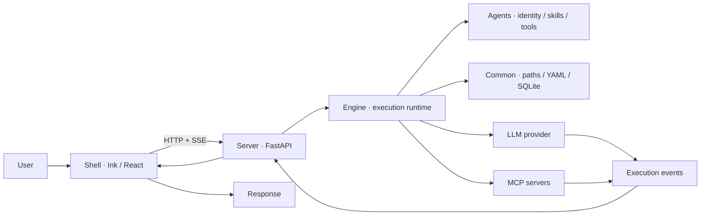

# openSmith

> A local-first, terminal-native agent workbench.


Smith is a single, always-on agent that runs on your machine. It keeps
conversation context, accumulates memory across sessions, and switches workflows
through skills. One agent, one conversation — no sub-agents, no routing layer to
reason about.

Everything runs locally: the shell, the API server, the execution engine, and
the SQLite database. The only outbound traffic goes to the LLM provider you
configure.

---

## Why One Agent

Multi-agent frameworks spend their complexity budget on orchestration —
delegation, hand-off protocols, shared scratchpads, and the failure modes each of
those introduces. openSmith spends it on the single agent instead:

| Concern | How openSmith handles it |
|---|---|
| Different task types | **Skills** — a task-specific workflow loaded into the prompt, not a separate agent |
| Multi-step work | **Skill chains** — declared pipelines with gates between stages |
| Long-lived context | **Memory** — compiled from evidence, not appended transcripts |
| Dangerous operations | **Tool guard + fact gate** — a non-bypassable boundary plus a challenge layer |
| Correctness of intermediate steps | **Gates** — a stage must produce its contract before the next one runs |

---

## What It Does

- **Interactive terminal** — a single rich Ink shell, launched with `smith` from any project directory
- **Skill-based workflows** — debug, plan, review, or reply directly, chosen per task
- **Skill chains** — requirements research, TDD development, and code review run as gated pipelines
- **Real tools** — file I/O, shell, Git, web search, and MCP servers, each behind permission levels
- **Persistent memory** — sessions, agent memory, and project context survive restarts
- **Multi-provider LLM** — OpenAI-compatible and Anthropic, routed by use case (interactive / gate / background)
- **Auditable by construction** — a tamper-evident hash chain over the audit log, plus structured execution events

---

## Quick Start

### Prerequisites

- Python 3.11+
- [uv](https://docs.astral.sh/uv/)
- Node.js 22+

### Install

```bash
# Backend
cd server && uv sync

# Terminal shell — build, then link `smith` onto your PATH
cd ../shell && npm ci && npm run build && npm link
```

If an older release left a `smith` from `uv tool install`, remove it first — it
points at the deleted Python CLI and shadows the shell entry point:

```bash
uv tool uninstall agent-smith-server
```

`npm link` symlinks the global `smith` to this working copy rather than copying
it, so `smith` works from any directory and finds `server/` through its own
install path. The trade-off: it breaks if the repository moves, and it picks up
source edits only after `npm run build`. Verify with:

```bash
ls -l "$(which smith)"   # → .../lib/node_modules/smith-shell/bin/smith.js
```

### Configure

Set your LLM provider through environment variables:

```bash
export AGENTSMITH_LLM_PROVIDER=openai          # openai / anthropic
export AGENTSMITH_LLM_API_KEY="sk-..."
export AGENTSMITH_LLM_BASE_URL="https://api.openai.com/v1"
export AGENTSMITH_LLM_MODEL="your-model"
```

Or write `~/.agent-smith/config.yaml`:

```yaml
llm:
  provider: openai
  api_key: sk-...
  base_url: https://api.openai.com/v1
  model: your-model
```

### Run

```bash
# From any project directory — the backend starts automatically
smith
```

### Context Files

`~/.agent-smith/SMITH.md` is your user-wide instruction file: it applies to every
run. A repository's own `.smith/SMITH.md` holds rules that belong to that project
only. Both are read while a run is assembled, so edits take effect on the next
request without restarting the backend.

Inside the shell, `/reload` starts a fresh session while keeping the previous one
in history, so the next task begins with the current context.

---

## Architecture



Dependencies flow one way — `server → engine → common`. The engine never imports
FastAPI, and `agents/` imports nothing from the other layers: it is loaded at
runtime, so its contract is file shape, not Python types.

| Layer | Directory | Responsibility |
|---|---|---|
| Infrastructure | `common/` | Paths, YAML config, SQLite connection, audit hash chain. No business logic. |
| Execution | `engine/` | Agent framework: LLM, ReAct loop, pipelines, memory, skills, tools, safety, observability. No platform knowledge. |
| Content | `agents/` | Smith's identity seed, pipelines, gates, conditions, tools, skills, hooks. Pure content. |
| Platform | `server/` | FastAPI app: orchestration, session and agent lifecycle, HTTP endpoints. |
| Terminal UI | `shell/` | Ink shell. Talks to the server over local HTTP, auto-starts the backend. |

---

## Repository Layout

```
openSmith/
├── agents/                     # Content layer — loaded at runtime, never imported
│   ├── conditions/             #   Predicates deciding whether a pipeline node runs
│   ├── gates/                  #   Stage contracts: what a node must produce to advance
│   ├── identities/             #   Identity and route declarations (smith.yaml, coding.yaml)
│   ├── pipelines/              #   Skill-chain definitions
│   ├── safety/                 #   Declarative safety rules
│   ├── skills/                 #   Built-in skills, one directory per SKILL.md
│   ├── smith/                  #   Smith's identity seed: role, style, workflow, hooks
│   ├── tools/                  #   Tool providers (TOOL_META + execute)
│   ├── output_style.md         #   Response style layer injected into the prompt
│   └── README.md
│
├── common/                     # Infrastructure layer — zero business logic
│   ├── config.py               #   Configuration loading
│   ├── database.py             #   SQLite connection management
│   ├── hash_chain.py           #   Tamper-evident audit log chain
│   ├── paths.py                #   Single source of truth for the data root (~/.agent-smith)
│   ├── yaml_utils.py           #   Safe YAML read/write
│   └── pyproject.toml
│
├── engine/                     # Execution layer — the agent framework
│   ├── context/                #   Prompt assembly (trust-tagged layers)
│   ├── execution/              #   Run lifecycle and control flow
│   │   ├── hooks/              #     Pre/Post/Stop tool-lifecycle hook framework
│   │   ├── orchestration/      #     Run lifecycle, agent dispatch
│   │   ├── pipeline/           #     Pipeline and skill-chain execution
│   │   ├── react/              #     ReAct loop
│   │   └── routing/            #     Lexical intent routing
│   ├── identity/               #   Identity catalog and route resolution
│   ├── llm/                    #   Provider adapters, model configuration
│   ├── mcp/                    #   MCP client: external tool protocol
│   ├── memory/                 #   Evidence log, compiler, guards, policy
│   ├── observability/          #   Structured events, traces, metrics
│   ├── safety/                 #   Tool guard (non-bypassable) and fact gate
│   ├── sandbox/                #   Host execution isolation (Seatbelt on macOS)
│   ├── skill/                  #   Skill discovery and loading
│   ├── tool/                   #   Tool registry and dispatch
│   ├── tests/                  #   Engine test suite
│   └── pyproject.toml
│
├── server/                     # Platform layer — FastAPI
│   ├── app/
│   │   ├── infrastructure/     #     App wiring, startup, dependencies
│   │   ├── routers/            #     HTTP endpoints (thin: extract, call, return)
│   │   ├── schemas/            #     Request and response models
│   │   ├── services/           #     Orchestration: engine runtime, sessions, profiles
│   │   ├── utils/
│   │   └── main.py             #     ASGI entry point
│   ├── docs/
│   ├── tests/
│   └── pyproject.toml
│
├── shell/                      # Terminal UI — Ink / React
│   ├── bin/smith.js            #   CLI entry point
│   ├── src/                    #   Components, transcript rendering, API bridge
│   ├── scripts/                #   Test runner
│   ├── biome.json              #   Lint and format configuration
│   └── package.json
│
├── docs/                       # Documentation
│   ├── wiki/                   #   Primary design docs — 14 chapters, start here
│   ├── adr/                    #   Architecture decision records
│   ├── analysis/               #   Analyses and investigations
│   ├── capabilities/           #   Capability notes
│   ├── reference/              #   Reference material
│   ├── research/               #   Research notes
│   ├── superpowers/            #   Agent technique notes
│   └── 00–11 *.md              #   Earlier documentation set (not kept in sync)
│
├── .githooks/                  # Repository git hooks
├── AGENTS.md                   # Brief for coding agents working in this repo
├── CLAUDE.md                   # Working brief: architecture, boundaries, verification
└── CONTEXT.md                  # Short project context
```

---

## Documentation

**Start with [`docs/README.md`](docs/README.md)** — the reading map. Every topic
has exactly one authoritative document, all of it written against the source:

| Where | What |
| --- | --- |
| [`docs/guide/`](docs/guide) | What Smith is, and getting it running |
| [`docs/architecture/`](docs/architecture) | Layers, one request end to end, glossary |
| [`docs/subsystems/`](docs/subsystems) | How each subsystem runs — loop, memory, context, tools & safety, sub-agents, LLM, MCP, observability, routing, skills, sandbox |
| [`docs/layers/`](docs/layers) | What each code layer is responsible for |
| [`docs/project/`](docs/project) | Conventions, roadmap, external comparisons |

Superseded drafts live in [`docs/archive/`](docs/archive) and are **not current
fact** — each carries a banner naming the document that replaced it and why.
Writing and diagram conventions are in
[`docs/00`](docs/00-文档阅读指南与表达规范.md). When documentation and code
disagree, the code wins.

---

## Development

```bash
cd engine && uv run --extra test pytest tests   # Engine tests
cd server && uv run --extra dev  pytest tests   # Server tests
cd shell  && npm test && npm run check          # Shell tests + typecheck
```

Run the backend in the foreground when you need it directly:

```bash
cd server && uv run uvicorn app.main:app --port 8000
```

Note for non-macOS contributors: a number of engine tests exercise the macOS
Seatbelt sandbox and are skipped elsewhere. A Seatbelt test that *fails* rather
than skips on Linux is missing its platform marker.

---

## Contributing

New capability? Add a **skill**, not an agent. The architecture boundaries in
[`CLAUDE.md`](CLAUDE.md) are enforced by the import graph and by tests — keep
`engine/` free of HTTP concepts, and keep `agents/` importing nothing.

---

## License

MIT
