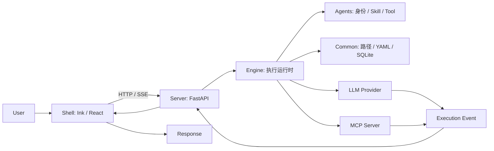

# Agent-Smith

> Local-first, terminal-native AI agent workbench.


Smith is a single, always-on agent that runs locally. It keeps conversation context, accumulates memory across sessions, and switches workflows via skills. One agent, no orchestration overhead.

## 结论

Smith 是一个本地运行的常驻 Agent：它保留会话上下文、跨会话积累记忆，并通过 skill 切换任务工作流。产品只运行一个 Agent，不包含子 Agent 或多 Agent 编排。

## 架构总览



依赖方向为 `server → engine → common`。`agents/` 由 Engine 在运行时加载；`shell/` 仅通过本地 HTTP/SSE 与 Server 通信。

## What It Does

- **Interactive terminal** — a single rich Ink shell
- **Skill-based workflows** — debug, plan, review, or direct reply, chosen per task
- **Skill chains** — requirements research, TDD development, and code review are routed by intent and run as gated skill chains
- **Real tools** — file I/O, shell, Git, web search, MCP, all sandboxed with permission levels
- **Persistent memory** — sessions, agent memory, and project context survive restarts
- **Multi-provider LLM** — OpenAI-compatible and Anthropic; routed by use case (interactive / gate / background)

## Quick Start

### Prerequisites

- Python 3.11+, [uv](https://docs.astral.sh/uv/), Node.js 22+

### Install

```bash
# Backend
cd server && uv sync

# Terminal shell — build, then link `smith` onto your PATH
cd ../shell && npm ci && npm run build && npm link
```

If an older release left a `smith` from `uv tool install`, remove it first — it
points at the deleted Python CLI and shadows the shell entry point:

```bash
uv tool uninstall agent-smith-server
```

`npm link` symlinks the global `smith` to this working copy rather than copying
it, so `smith` works from any directory and finds `server/` through its own
install path — but it breaks if the repository moves, and picks up source edits
only after `npm run build`. Verify with:

```bash
ls -l "$(which smith)"   # → .../lib/node_modules/smith-shell/bin/smith.js
```

### Configure

Set your LLM provider via environment variables:

```bash
export AGENTSMITH_LLM_PROVIDER=openai          # openai / anthropic
export AGENTSMITH_LLM_API_KEY="sk-..."
export AGENTSMITH_LLM_BASE_URL="https://api.openai.com/v1"
export AGENTSMITH_LLM_MODEL="your-model"
```

Or write `~/.agent-smith/config.yaml`:

```yaml
llm:
  provider: openai
  api_key: sk-...
  base_url: https://api.openai.com/v1
  model: your-model
```

### Run

```bash
# Run it from any project directory — it auto-starts the backend
smith
```

### Context files

`~/.agent-smith/SMITH.md` is your user-wide instruction file: it applies to every Smith run. Use a repository's `.smith/SMITH.md` only for rules that belong to that project. Both files are read when Smith builds a run, so edits apply to the next request without restarting the backend.

In the terminal, run `/reload` after editing context files to start a fresh session while keeping the prior session in history. The next task then starts with the current context.

## Architecture

```
shell (Ink / React)
      │ HTTP
      ▼
server (FastAPI)
      │
      ▼
engine (execution) ◄── agents (identity, skills, tools, safety)
      │
      ▼
common (paths, YAML, SQLite, filesystem, audit hash chain)
```

| Layer | What It Does |
|---|---|
| `common/` | Paths, YAML configuration, SQLite connection, filesystem resources, tamper-evident audit log hash chain (`common/hash_chain.py`, consumed by the engine's trace store and tool guard) — no orchestration logic |
| `engine/` | Task routing, skill chains, ReAct loop, LLM adapters, memory, tools, safety, sandbox (`engine/sandbox/`), observability (`engine/observability/`) |
| `agents/` | Smith identity, pipelines, built-in skills, tool providers, safety rules |
| `server/` | FastAPI app, service orchestration, agent/session lifecycle |
| `shell/` | Ink/React terminal UI, auto-starts backend, SSE streaming |

Dependencies flow one way: `server → engine → common`. The engine never imports FastAPI.

## Documentation

从 [文档入口](docs/README.md) 开始；写作与图示规范见 [00 · 文档阅读指南与表达规范](docs/00-文档阅读指南与表达规范.md)。当前实现以源码和测试为准，调研及历史方案不代表已支持的功能。

## Development

```bash
cd engine && uv run --extra test pytest tests   # Engine tests
cd server && uv run --extra dev pytest tests     # Server tests
cd shell  && npm test && npm run check           # Shell tests + typecheck
```

## License

MIT
