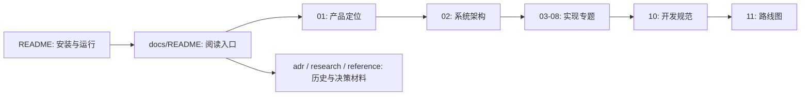

# 00 · 文档阅读指南与表达规范

## 本章结论

Agent-Smith 的当前实现文档统一采用：**结论优先 → 图示优先 → 工程拆解 → 源码实现 → 完整示例 → 风险与边界**。源码和测试是实现事实来源；调研、方案与历史记录不构成功能承诺。

## 学习目标

- 从入口文档定位产品、架构、模块与开发规范。
- 区分已实现的契约、设计决策与外部调研。
- 以一致的工程化格式补充技术文档。

## 文档地图



## 文档分层

| 类型 | 位置 | 用途 | 事实来源 |
| --- | --- | --- | --- |
| 当前实现 | `README.md`、`docs/01`–`08`、`docs/10` | 当前行为、接口、配置与维护 | 源码、测试、包 manifest |
| 决策记录 | `docs/adr/` | 已做决策及其后果 | ADR 原文 |
| 计划与能力设计 | `docs/capabilities/`、`docs/superpowers/`、`docs/11` | 候选方案、待办与验收条件 | 明确标注的计划 |
| 调研与参考 | `docs/research/`、`docs/reference/` | 外部实践与历史背景 | 原始调研来源 |

## 编写规范

### 章节顺序

当前实现类章节默认按以下顺序组织；不适用的段落应显式省略，不得虚构内容。

1. 本章结论
2. 学习目标
3. 总体架构
4. 核心概念
5. 调用链
6. 实现
7. 完整示例
8. 工程实践
9. 自测题

### 图示与流程

- 流程、架构和数据流默认使用 `graph LR`；流程节点必须从左到右排列。
- 长链路拆为多条横向链路，或以 Mermaid 子图分段；不得为换行改成纵向流程。
- Agent 图必须覆盖外部输入、运行时状态、工具/依赖、错误处理（如有）及最终输出。

```text
User → Shell → Server → Engine → Tool / Model → Event → Shell → Response
```

### 源码说明

关键函数或类必须说明：为什么存在、输入、输出、上游调用者、下游依赖，以及异常或边界条件。讲解顺序为：设计思想 → 数据结构 → 调用链 → 核心源码 → 完整 Demo → 测试 → 优化。

可运行示例必须标出文件位置、依赖与版本、必要导入、类型、异常处理和启动命令。伪代码必须显式标注。

## 工程实践

1. API、事件、配置、持久化格式或安全语义变化时，同一变更更新对应当前实现文档。
2. 每一项“已实现”断言必须能追溯到源码路径或测试；不确定的信息必须明确标注。
3. 外部 API、版本和快速变化的信息必须标注官方来源与核验日期。
4. 历史材料不改写为当前事实；需要引用时链接到主文档。

## 自测题

1. 新增一个 HTTP 事件字段时，需要同步哪些文档？
2. 为什么 `docs/research/` 不能作为运行时能力的依据？
3. 一张 Agent 流程图至少需要表现哪些输入、执行和输出环节？
