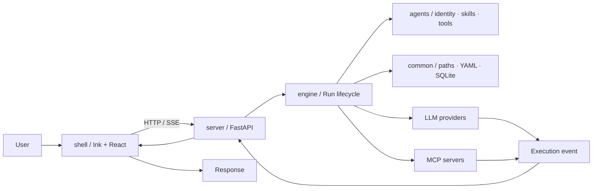
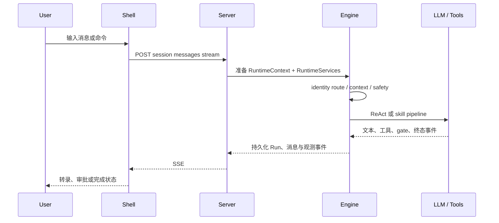

# 02 · 系统架构

## 本章结论

一次 Smith 请求沿 `User → Shell → Server → Engine → Tool / Model → Event → Shell → Response` 横向流动。Engine 是执行边界，`agents/` 提供运行时加载的声明内容，`common/` 只提供基础设施；依赖方向固定为 `server → engine → common`。

本文以 `server/app/main.py`、`engine/`、`agents/`、`common/` 与 `shell/src/` 为准，只描述已落地的实现。外部借鉴与待选方案位于 `reference/`、`research/`。

## 学习目标

- 识别各层的职责、依赖与禁止依赖。
- 跟踪一条消息从终端输入到最终响应的调用链。
- 找到配置、事件、安全和记忆的事实入口。

## 总体架构

依赖方向是 `server → engine → common`。`agents/` 是由 Engine 装载的声明性内容与 provider 实现；`shell/` 只使用本地 HTTP/SSE，不能导入 Python 运行时。Engine 不依赖 FastAPI。

| 层 | 责任 | 关键入口 |
| --- | --- | --- |
| `common/` | 确定项目/数据路径、YAML、SQLite 连接、私有目录和审计日志哈希链 | `common.paths.AppPaths`、`common.database`、`common.hash_chain` |
| `engine/` | 身份路由、上下文、模型、ReAct、pipeline、Run、工具、记忆、MCP、安全、沙箱（`engine/sandbox/`）和可观测性投影（`engine/observability/`，支撑 `/observability/*` 端点） | `engine.execution`（包级公开接口，重导出 `run_stream_with_runtime` 等；`orchestration`/`pipeline`/`react` 为实现细节） |
| `agents/` | Smith 配置、identity/pipeline YAML、SKILL.md、tool provider、安全规则 | `agents/identities/`、`agents/pipelines/`、`agents/tools/` |
| `server/` | 本地 API、持久化、运行时装配、scheduler、鉴权 token | `server/app/main.py` |
| `shell/` | 终端 UI、本地 server 启动、请求编排、SSE 事件投影 | `shell/src/index.tsx`、`bridge.ts` |

## 调用链：一次消息的生命周期

具体步骤：

1. Shell 通过 `NodeBridge` 调用 Server，并把当前 working directory、会话和可选 skill 传给 API。
2. `AgentService` 读取 session、配置和 identity，构建 LLM、ToolRegistry、SkillRegistry、MCP session pool 与安全对象。
3. `IdentityCatalog.resolve()` 在默认 identity 和声明式 routes 中选择身份/流程；无匹配时使用默认 identity 的直接 ReAct。
4. `run_stream_with_runtime()` 创建/恢复 Run 状态，准备 Prompt 与上下文，并把执行事件写入 trace/投影。
5. `run_agent_stream()` 选择直接 `react_event_loop()`、强制 skill 或 `SkillChain`。Pipeline 的每个节点只在 gate 接受后提交 provisional 输出。
6. 工具调用经过 `ToolPolicy`、`ToolGuard`、可选 FactGate 和审批 broker；允许结果再返回模型。
7. 终态由 lifecycle 持久化；记忆钩子在完成、失败或不完整状态下记录受限证据。Server 以 SSE 转发事件，Shell 将其投影为转录和面板状态。

## 运行时数据

默认数据根是 `~/.agent-smith/`，可由 `AGENT_SMITH_PROJECT_ROOT` 改变源码/资源根的解析。主要目录如下：

| 路径 | 内容 | 写入方 |
| --- | --- | --- |
| `sqlite/agent-smith.sqlite` | profile、session、message、auto task 等持久化数据 | Server repositories |
| `agent/` | profile、Run 状态、trace、记忆、运行时 LLM 配置覆盖（`agent/config.yaml`）和用户安装的技能 | Engine / Server |
| `builtin/skills/` | 从发布包物化的内置技能；与用户技能隔离 | `AppPaths.ensure_base_dirs()` |
| `config.yaml` | 可持久化的 LLM 配置 | ConfigService |

项目指令与用户范围指令是不同层：`~/.agent-smith/SMITH.md` 适用于用户，项目目录 `.smith/SMITH.md` 只适用于该项目。二者由当前 Run 读取，自动记忆不会改写它们。

## 关键横切契约

### 配置与模型

配置通过环境变量、持久化配置与会话/用途覆盖解析为 `LLMPort`。用途只有 `interactive`、`gate`、`background`；具体字段与安全约束见[LLM 模块](04b-LLM模块设计.md)。

### 事件与 Run

`ExecutionEvent` 是 Engine 到 Server/Shell 的统一事实来源。Run 有可查询状态、事件 trace、诊断和改善建议投影；中断 Run 可经 `/resume` 路径恢复。UI 不依据一段文本猜测执行是否成功。

### 安全

`ToolGuard` 处理文件边界、敏感路径/凭据、命令规则与审计摘要；`ApprovalBroker` 将按请求的授权决定绑定到 `run_id`。Tool provider 不得绕过 registry 或直接取得未经 policy 审核的执行能力。

### 记忆

记忆把清洗后的证据编译为两个正式视图：用户级 `context.md` 和项目级 `memory/durable.md`。`memory/recent.jsonl` 只是追加式证据日志；正常请求整份注入两个有界视图，不做查询时召回，也没有 FTS、embedding/vector 或 episode 层。原始聊天记录不是正式记忆。完整规则见[记忆系统](05-Engine-记忆系统.md)。

## 当前未纳入架构的能力

- 子 Agent、团队/圆桌协作、插件 marketplace 与 webhook trigger；
- 内建知识库/RAG 管理服务；
- 对外 MCP server；
- SwiftUI/macOS 原生客户端。

这些方向可作为后续设计或外部集成研究，但新增时必须补充运行、权限、恢复和数据所有权契约，而不是在既有文档中预先声明为已支持。
