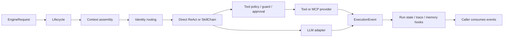

# 04 · Engine 设计与实现

## 本章结论

Engine 不是一个“调用模型的封装”，而是一条受状态、证据、安全和恢复约束的执行运行时。它将用户请求转成可观察的 `ExecutionEvent` 流：路由决定执行形态，ReAct 或 SkillChain 执行工作，工具调用经过不可旁路的安全链，Run 状态、记忆和观测在终态统一收敛。

稳定入口是 `engine.execution.lifecycle`。Engine 不负责 HTTP、FastAPI、SQLite repository 或终端渲染；这些分别属于 Server、Common 与 Shell。本文的实现断言以 `engine/` 和 `engine/tests/` 为准。

## 学习目标

- 理解 Engine 为什么拆成执行、上下文、身份、模型、工具、安全、记忆、MCP 和观测九类边界。
- 跟踪一条请求如何变成 Run、事件、工具副作用与最终响应。
- 在改动模块时识别其输入、输出、上游、下游与失败语义。

## 总体架构



## 设计思想

| 设计问题 | 采用的边界 | 目的 | 不采用的方案 |
| --- | --- | --- | --- |
| 同一引擎需要被 Server、测试和嵌入端调用 | `EngineRequest`、`RuntimeContext`、`RuntimeServices` | 把可信输入和资源所有权显式化 | 从进程 cwd、HTTP request 或全局单例猜测运行环境 |
| 模型输出不等于可信动作 | registry → policy → guard → fact gate → approval | 将“能调用”与“允许执行”分离 | 让 skill、provider 或 prompt 直接执行主机操作 |
| 流式草稿可能被 gate 拒绝 | provisional event 生命周期 | UI 可实时展示，同时不污染最终 transcript | 先持久化文本，再在失败时尝试删除 |
| 多步流程需要质量控制而非提示词祈祷 | `SkillChain` + node gate + backtrack | 每步提交都有可检查证据 | 只把流程写成一段长 prompt |
| 本地任务会被中断 | `RunStateStore` + ownership/checkpoint 约束 | 恢复可审计且不接管活跃 Run | 仅保留内存状态或按 session 盲目恢复 |
| 记忆会放大错误与敏感信息 | evidence → review → compiled views | 只让受限证据进入长期上下文 | 把完整聊天记录直接拼进 prompt |

## 调用链

```text
EngineRequest → lifecycle.run_stream_with_runtime → context/identity preparation
context/identity preparation → run_agent_stream → direct ReAct | explicit skill | SkillChain
ReAct | SkillChain → LLMClient + ToolRegistry → policy → guard → approval → provider.execute
provider / LLM → ExecutionEvent → RunStateStore + observability + memory hooks → caller
```

| 阶段 | 输入 | 输出与副作用 | 上游调用者 | 下游依赖 | 失败语义 |
| --- | --- | --- | --- | --- | --- |
| 生命周期 | request、runtime context/services | Run、事件流、终态持久化 | Server 或可信嵌入层 | 路由、执行、状态存储 | 取消与遗留活跃 Run 转为可恢复状态 |
| 上下文 | history、项目/用户指令、记忆、预算 | 已拟合 messages | lifecycle | assembler、compression、budget | 超预算时压缩或裁剪，而非无界增长 |
| 路由 | identity catalog、请求文本、可选强制 skill | direct ReAct 或 pipeline 决策 | lifecycle | identity、skill、pipeline | 无匹配走默认 identity；缺失 pipeline skill 回落直连 ReAct |
| 执行 | messages、tools、LLM、node 条件 | token/tool/text/gate 事件 | route decision | ReAct、SkillChain | 预算、模型终止、gate 失败与用户暂停都有显式终态 |
| 工具 | schema、参数、run context | 允许、拒绝、挑战或审批后的结果 | ReAct / skill | policy、guard、approval、provider | 拒绝不执行；挑战需重新取证；审批按 `run_id` 绑定 |
| 收敛 | 事件流、run metadata | trace、摘要、记忆候选、资源关闭 | lifecycle | observability、memory、hooks | 失败与不完整状态也必须记录，不伪装为成功 |

## 模块地图

| 模块 | 责任 | 代表文件 |
| --- | --- | --- |
| `execution/` | Run 生命周期、事件、编排、pipeline、ReAct 与恢复 | `orchestration/lifecycle.py`、`react/react_loop.py` |
| `context/` | Prompt 装配、预算、历史压缩与上下文 fitting | `assembler.py`、`budget.py`、`compression.py` |
| `identity/` | YAML identity 解析、校验和关键词路由 | `catalog.py` |
| `llm/` | Provider 无关契约、adapter、配置和使用量 | `port.py`、`client.py`、`factory.py` |
| `tool/` | 工具 schema、注册、调用账本和截断 | `registry.py`、`schema.py`、`ledger.py` |
| `skill/` | SKILL.md 发现、启用状态与执行 | `loader.py`、`registry.py`、`executor.py` |
| `safety/` | 工具策略、文件/命令 guard、审批与事实检查 | `tool_guard.py`、`approval.py` |
| `memory/` | 证据日志、两视图编译与审核、Dream 清理和维护调度 | `store.py`、`compile.py`、`maintenance.py` |
| `mcp/` | stdio/streamable HTTP client 与 session pool | `client.py`、`config.py`、`session_pool.py` |
| `observability/` | Run trace、摘要、健康、事故与诊断投影 | `recorder.py`、`projections.py` |

## 模块设计：每一层解决什么问题

### `execution/`：把一次任务变成可恢复的事件流

`execution/` 将“请求正在运行”建模为有身份、有工作目录、有状态和终态原因的 Run，而不是一次无状态的模型调用。`lifecycle.py` 负责创建、终结和恢复；`orchestration/agent_loop.py` 根据路由选择执行方式；`react/` 只负责单步的模型—工具循环；`pipeline/` 只负责多步流程和 gate。

| 项目 | 说明 |
| --- | --- |
| 为什么存在 | 让取消、恢复、SSE 展示、审计与内存处理都围绕同一个 Run 发生。 |
| 输入 | `EngineRequest`、可信 `RuntimeContext`、归属资源的 `RuntimeServices`。 |
| 输出 | 有序 `ExecutionEvent` 与持久化终态/checkpoint。 |
| 谁调用它 | Server 的 runtime 装配层或测试中的可信嵌入调用方。 |
| 它调用谁 | context、identity、ReAct、SkillChain、Run state、hooks、observability、memory。 |
| 如何失败 | 取消、预算耗尽、provider 错误、gate 阻塞和无效恢复都以显式事件/状态结束。 |

### `context/`：把有限 token 预算分配给最可信的信息

`context/assembler.py` 以信任层组装 prompt，而不是简单拼接历史。它将 Agent role/style/workflow、工具策略、可用能力、用户/项目指令、identity guidance 和条件化安全规则分层；`budget.py` 与 `compression.py` 在超限时压缩和裁剪。其核心构思是：上下文既是能力输入，也是安全边界，不能由一段未验证的历史文本无限扩张。

| 项目 | 说明 |
| --- | --- |
| 输入 | history、指令层、可用 tools/skills、记忆视图、模型预算。 |
| 输出 | 可发送给模型的 messages，以及可观测的 context usage。 |
| 上游 / 下游 | lifecycle 提供可信运行环境；ReAct/LLM 消费已拟合消息。 |
| 失败与边界 | 优先压缩工具输出与历史；仍超限时硬裁剪，保留必要的头尾与活跃请求。 |

### `identity/` 与 `routing/`：声明式选择工作流，而非启动另一个 Agent

`identity/catalog.py` 从 YAML 加载默认 identity 和按关键词、示例、优先级声明的 routes；`task_router.py` 将请求解析为 route decision。其构思是把“该任务适合什么约束和流程”放在可审查内容层，而不把判断散落在 Shell 或 prompt 中。`coding` 是能力档案和 pipeline 路由，不是第二个执行实体。

| 项目 | 说明 |
| --- | --- |
| 输入 | 请求文本、可选 identity/skill、identity catalog。 |
| 输出 | 默认 direct ReAct、显式 skill 或带 pipeline 的 route decision。 |
| 上游 / 下游 | lifecycle 调用；agent loop 和 SkillChain 消费。 |
| 失败与边界 | 无匹配走默认 identity；关键词边界和受限屈折避免误匹配；缺失链路能力整条回落 direct ReAct。 |

### `react/`：以单一事件协议驱动模型—工具闭环

`react_event_loop()` 是真正的核心生成器；`react_loop()` 和 `react_stream_loop()` 只是分别消费最终文本和文本 delta 的适配器。该拆分的构思是让 pipeline、Shell、测试不必各自复制模型流解析与终态处理。循环的状态保存在局部计数器中，避免跨 Run 的可变共享状态。

| 项目 | 说明 |
| --- | --- |
| 输入 | 已拟合 messages、`LLMClient`、工具 registry 与安全对象。 |
| 输出 | thinking、text、tool、usage、provisional 与终态 `ExecutionEvent`。 |
| 上游 / 下游 | agent loop 或 SkillChain 调用；LLM、tool registry、policy/guard 被调用。 |
| 失败与边界 | 最大工具轮次、连续失败、同一错误循环、preflight 挑战、长度截断与空回复均有独立终态。 |

### `pipeline/` 与 `skill/`：让 SOP 可复用、让交付可验收

`skill/` 发现、启用和执行 `SKILL.md`；`pipeline/skill_chain.py` 按 YAML 的 nodes、conditions、allowed tools、gates 和 backtrack map 编排它们。这里的关键设计是不把“写了步骤”误当成“完成了步骤”：节点产出先是 provisional，只有 base gate 和 node gate 均通过才提交。无法使用的 skill 允许节点级 ReAct fallback，既保留工作流约束，也避免单个安装问题导致整个任务失效。

| 项目 | 说明 |
| --- | --- |
| 输入 | pipeline YAML、skill registry、前序已提交产物和 node tool boundary。 |
| 输出 | gate 通过的产物、回退、阻塞或等待用户输入事件。 |
| 上游 / 下游 | routing/agent loop 调用；skill executor、ReAct、gate 和 tool policy 被调用。 |
| 失败与边界 | 无 backtrack 的 gate 失败终止为 blocked；等待用户输入必须由 marker 或明确允许的问句推断触发，不能把结尾客套话当暂停。 |

### `llm/`：把协议差异收敛在 adapter，保留调用用途与账本

`port.py` 定义 provider 无关契约，`adapters/` 承担协议差异，`factory.py` 负责选择实现，`client.py` 统一 chat/stream 和使用量，`observability.py` 用 contextvars 给每次调用标注 run、session 和 purpose。构思是让执行层面对稳定能力接口编程，而不是把 OpenAI 与 Anthropic 的响应格式渗入 ReAct 和 pipeline。

| 项目 | 说明 |
| --- | --- |
| 输入 | 用途路由后的模型配置、messages、tools 和 generation context。 |
| 输出 | 规范化 provider events、完成结果与 token/时延记录。 |
| 上游 / 下游 | ReAct、gate、memory 等调用；adapter 与 provider transport 被调用。 |
| 失败与边界 | provider 终止原因转为 Engine 的 FAILED/INCOMPLETE 语义；观测记录必须归属到正确 run/session/purpose。 |

### `tool/` 与 `safety/`：从“模型意图”到“受控副作用”的强制通道

`tool/` 负责 schema、注册、参数/结果处理和账本；`safety/` 决定副作用是否可执行。顺序不可交换：先由 `ToolPolicy` 作策略决定，再由 `ToolGuard` 强制检查路径、命令、凭据和白名单，再按需取证与审批，最后才调用 provider。这样 soft challenge 可重试，但 hard guard 不能被 skill、hook、MCP 或模型文本绕过。

| 项目 | 说明 |
| --- | --- |
| 输入 | 工具名、schema、实参、run/session/workdir 上下文与审批决定。 |
| 输出 | 结果、拒绝、challenge 或 approval request，以及可审计 ledger/event。 |
| 上游 / 下游 | ReAct/SkillChain 调用；tool provider 或 MCP wrapper 在最终允许后调用。 |
| 失败与边界 | 参数不合法、敏感文件、命令规则、过期/错属审批、TOCTOU 与 hook 阻断均不得产生未授权执行。 |

### `memory/`：将长期上下文视为编译产物，而非原始聊天备份

`memory/` 把清洗后的事件和结构化候选追加到 `memory/recent.jsonl`，再通过 compiler、reviewer 和确定性 writer 形成两个受控视图：用户级 `context.md` 与项目级 `memory/durable.md`。两个视图均有字符预算，并在后续请求中整份注入；不存在查询时检索、FTS、向量索引或 episode 层。maintenance 负责编译/Dream 调度和失败可见性，Dream 只做安全清洗与已消费证据前缀的可恢复回收。

| 项目 | 说明 |
| --- | --- |
| 输入 | 完成、失败或不完整 Run 的受限证据与维护调度信号。 |
| 输出 | 两个有界正式视图、追加式证据/审计记录和维护状态。 |
| 上游 / 下游 | lifecycle/hooks 提供事件；context assembler 在后续请求中消费。 |
| 失败与边界 | Reviewer、结构/预算与安全校验先于正式写入；受限 fallback 不得跨过纠正/忘记；offset 与 cleanup journal 防止证据丢失或重放。 |

### `mcp/` 与 `observability/`：扩展能力与审计能力都不逃离 Run

`mcp/` 以 client/session pool 连接 stdio 或 streamable HTTP server，并将暴露能力纳入工具模型；`observability/` 将事件投影为 trace、摘要、健康、incident 和诊断。二者共同遵循同一构思：外部能力可以扩展，但它的资源生命周期、权限和可观测性必须回到本地 Run。

| 项目 | 说明 |
| --- | --- |
| 输入 | MCP 配置、调用上下文、ExecutionEvent 与 Run metadata。 |
| 输出 | 受管理的 MCP session / tool 结果，以及查询用观测投影。 |
| 上游 / 下游 | runtime services 和 lifecycle 调用；MCP transport、trace storage/projection 被调用。 |
| 失败与边界 | session/子进程生命周期必须关闭；MCP 名称冲突、暴露参数和工具执行仍受 registry 与安全规则控制；恢复 Run 需重新锚定 trace。 |

## 核心契约

### 运行时装配

调用者提交 `EngineRequest`、`RuntimeContext` 与 `RuntimeServices`。

- `EngineRequest` 是一条用户输入及其 history、context、强制 skill、identity 与工作目录；
- `RuntimeContext` 是已可信解析的 agent/profile/session/filesystem 边界，Engine 不从自身 cwd 猜测项目目录；
- `RuntimeServices` 拥有当前 Run 的 LLM、tools、skills、安全对象、MCP clients、hooks 与 observation factory，并负责关闭归属资源。

这让 Engine 可由 Server、测试或其他可信嵌入层调用，而不引入 FastAPI、SQLite 或 Shell 依赖。

### 路由与流程

`IdentityCatalog` 从 `agents/identities/*.yaml` 加载唯一默认 identity 和可选 routes。每条 route 包含关键词、示例、优先级与可选 pipeline；英文关键词使用词边界和受限屈折匹配，避免 `git` 命中 `digital` 一类误路由。

`run_agent_stream()` 有三条互斥路径：

1. 用户显式指定 skill：加载并执行该 skill；
2. route 无 pipeline：直接 ReAct；
3. route 指向 pipeline：顺序执行 `SkillChain`。每个节点先执行声明的 Skill；若 Skill 缺失、被禁用、
   运行失败或未通过验收，则在该节点以 ReAct 补偿，并沿用前序产物、节点工具范围和同一套 gate；
   只有 gate 通过后才提交输出并进入下一节点。

当前有三条 shipped pipeline（`agents/pipelines/requirements-research.yaml`、
`tdd-development.yaml`、`code-review.yaml`），分别对应 `coding` 身份的三条意图路由：

| pipeline | 步骤（skill → gate） |
|---|---|
| `requirements-research` | `grilling`→`grilling_complete`、`research`→`research_brief`、`ecc-plan`→`plan_confirmed` |
| `tdd-development` | `diagnosing-bugs`→`red_loop`（条件 `coding_bugfix_needs_diagnosis`）、`tdd-workflow`→`tdd_evidence`、`verification-loop`→`tdd_verification` |
| `code-review` | `code-review`→`review_report`、`verification-loop`→`review_verification` |

普通编码、修复与重构请求不命中关键词路由，留在直接 ReAct。每条链都禁止把副作用或
真实测试结果只写在 Markdown 里：它们必须由 skill 的工具调用和 gate 的事实检查产生。

### ReAct 与事件

`react_event_loop()` 是统一 Agent 循环：发送已拟合的 messages 与工具 schema，归并 `ProviderEvent`，流式产生文本/工具/用量/终态事件，再把工具结果写回下一轮上下文。它显式限制最大轮数、工具调用预算、连续工具错误、长度截断后的续写和 preflight 挑战。

`ExecutionEvent` 是对外可观察语义。重要类别包括：route 决定、skill 开始/结束、文本 delta、工具调用及结果、gate 结果、审批请求、provisional commit/retract、context usage 与 done。Shell/Server 只消费事件，不需要了解某个 Provider 的原始帧格式。

### provisional 输出

直接 ReAct 的文本可持续流式呈现。Pipeline 节点的文本先以 `provision_id` 标记为候选输出：gate 通过后发送 `PROVISIONAL_COMMIT`，失败或回退时发送 `PROVISIONAL_RETRACT`。这避免被拒绝的草稿进入最终 transcript、session 或记忆。

## 安全与副作用

工具执行不是“模型返回了函数名就运行”。执行顺序是：

```text
Tool schema / registry
  → ToolPolicy（静态与动态策略）
  → ToolGuard（路径、命令、凭据、会话白名单）
  → FactGate（需要先取证时的挑战）
  → ApprovalBroker（需要用户授权时）
  → provider.execute()
  → ToolExecutionLedger / ExecutionEvent
```

`ToolGuard` 是最后的强制边界。新 provider 必须通过 registry 注册，并让涉及路径、shell、网络或外部副作用的参数进入相应安全检查；不得由 skill 或 MCP 旁路直接执行。

## Run、恢复与可观测性

`RunStateStore` 将状态落入 agent runtime 数据目录。lifecycle 在服务启动时把遗留的活跃 Run 置为可恢复，pipeline checkpoint 只会被同身份、同工作目录、同请求且 owner 已结束的 Run 采用。重复提交不能接管仍在运行的 Run checkpoint。

每个 Run 的关键事件可投影成摘要、trace、诊断、健康和 incident 信息。Server 暴露这些只读视图；具体 API 见[Server 文档](07-Server-平台后端.md)。

## 设计演进：从提交记录可确认的构思

下面记录的是仓库历史能够证明的设计方向，而非对作者个人想法的臆测。提交信息说明了“为何增加这一层保护或抽象”；具体实现仍以当前源码为准。


| 演进阶段 | 可追溯提交 | 已落实的构思 | 工程含义 |
| --- | --- | --- | --- |
| 分离运行时职责 | `81a5ad1`（2026-07-26） | 拆分 execution、context、identity 包 | 让执行控制、prompt 构造和身份配置各自演进，避免单一 Engine 模块同时承担全部职责 |
| 让任务可恢复 | `4a13ece`、`8618525`、`a079181` | 引入 Run state、coding pipeline recovery 与 checkpoint | 任务中断是正常状态；恢复必须受 owner、identity、工作目录和请求匹配限制 |
| 把主机能力变成受控能力 | `adfc1ef`、`ee4e168`、`7880a0a` | 审批、运行时边界和安全审计 | 模型的工具请求只是一项意图，不能直接获得文件、命令或网络副作用 |
| 把工作流做成可审查链 | `58e14c5`、`39b51f3`、`2a0413f` | coding identity、声明式 pipeline、节点级 ReAct fallback | 结构化任务按 gate 提交；缺失或失败的 skill 不让整条体验失效 |
| 保持流式体验的正确性 | `a079181`、`9f84ac6`、`3e3b031` | provisional streaming、draft retraction、usage accounting | 用户可以看到过程，但失败节点的草稿不能成为最终事实 |
| 让记忆可治理 | `d3cd2a7`、`b71be4b`、`8f88412` | secret redaction、双视图收敛、审核、受限 fallback 与可恢复清理 | 长期记忆是有证据、有预算的编译产物，不是对话日志的复制品 |
| 让结论有证据 | `fa34ce0` | evidence binding、risk-tier triage、hash-chained audit logs | gate 结论、工具证据和审计记录需要可对应、可回放、可发现篡改 |
| 以真实失效模式加固 | `36d7ad5`、`69ea7c0`、`ddad1c3`、`0425d05` | 原子审批、hook 取消、硬链接敏感文件检测、对抗审计修复 | 并发、TOCTOU、文件别名和取消不是边缘问题，必须进入运行时设计 |

## 工程实践

1. 改动执行路径前，先确认事件是否仍是唯一的跨层事实来源；不要让 Shell 或 Server 解析模型文本猜状态。
2. 改动 tool provider 时，先确认参数仍经过 `ToolPolicy`、`ToolGuard` 和审批路径；安全层必须先于可重试的软挑战执行。
3. 改动 pipeline 时，明确每个 node 的输入产物、允许工具、gate 证据、回退目标和用户暂停语义。
4. 改动记忆时，验证敏感信息过滤、Reviewer/fallback 边界、两视图预算、offset 与可恢复清理；不能把完整原始聊天直接写入长期视图。
5. 改动 Run 恢复或并发行为时，补充所有权、取消和重复提交的回归测试。

## 自测题

1. 为什么 `ExecutionEvent` 比直接透传 Provider 原始事件更适合作为跨层协议？
2. 为什么 pipeline 文本在 gate 通过前必须使用 provisional 生命周期？
3. 一项被用户批准的工具调用，为什么仍然必须经过 `ToolGuard`？
4. checkpoint 恢复为何不能只按 session id 匹配？

## 深入阅读

| 主题 | 专题文档 | 阅读目标 |
| --- | --- | --- |
| 执行、Run、pipeline 与恢复 | [04e · Execution](04e-Execution-运行生命周期与管线.md) | 理解 Run 状态、checkpoint、gate、回退与 provisional 提交 |
| 单步模型—工具循环 | [04a · ReAct Loop](04a-ReAct-Loop-设计.md) | 理解事件、预算、流式与压缩 |
| Prompt 与上下文预算 | [04c · Context](04c-Context-上下文系统.md) | 理解信任分层、fitting 与压缩 |
| Identity 与路由 | [04d · Identity](04d-Identity-身份与路由.md) | 理解 YAML 能力档案与 direct/pipeline 路径选择 |
| 模型 provider | [04b · LLM](04b-LLM模块设计.md) | 理解 adapter、配置与 usage |
| 工具运行时 | [04f · Tool](04f-Tool-工具系统.md) | 理解发现、schema、scoped capability 与 ledger |
| 安全与审批 | [04g · Safety](04g-Safety-安全与审批.md) | 理解 policy、guard、fact gate 与 approval |
| Skill 运行时 | [04h · Skill](04h-Skill-技能系统.md) | 理解发现、enablement、执行与交接 |
| 外部 MCP | [04i · MCP](04i-MCP-外部工具协议.md) | 理解 transport、session pool 与本地治理 |
| 可观测性 | [04j · Observability](04j-Observability-可观测性.md) | 理解 trace、summary、incident 与 health |
| 主机执行环境 | [04k · Sandbox](04k-Sandbox-主机执行环境.md) | 理解进程组、I/O 上限、取消与 Seatbelt |
| 记忆系统 | [05 · Memory](05-Engine-记忆系统.md) | 理解证据、双视图编译、审核与维护 |
| 内容层编辑方式 | [06 · Agents](06-Agents-内容层.md) | 理解 identity、pipeline、skill 与 tool provider 的内容来源 |
| 审批决策背景 | [ADR 0001](adr/0001-approval-gated-host-capabilities.md) | 追溯 host capability 的审批设计 |

## 非目标

Engine 当前不提供 multi-agent scheduler、plugin handler/runtime、外部 webhook trigger、RAG 服务或 MCP server。若未来引入，必须先定义它们对 Run 所有权、资源关闭、并发写工作目录、审批传播和观测链路的影响。
