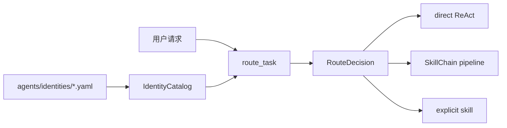

# 04d · Identity 身份与路由

## 本章结论

`engine/identity/` 与 `engine/execution/routing/` 用声明式 YAML 将“任务应采用什么能力档案和流程”变成可检查的 `RouteDecision`。identity 不是 Agent 实例，更不会创建子 Agent；它只约束当前单个 Smith Run 的提示、能力集合和 pipeline 选择。

## 总体架构



## 目录与职责

| 文件 | 解决的问题 | 核心对象/函数 |
| --- | --- | --- |
| `identity/catalog.py` | YAML 的加载、校验、缓存与匹配 | `IdentitySpec`、`RouteSpec`、`RouteDecision`、`IdentityCatalog` |
| `execution/routing/task_router.py` | 将输入委托给 catalog 做纯词法匹配 | `route_task()` |

## 核心数据结构

| 对象 | 输入 | 输出 | 关键边界 |
| --- | --- | --- | --- |
| `IdentitySpec` | identity id、提示、工具/skill 配置、routes | 一份可用能力档案 | 必须有唯一默认 identity |
| `RouteSpec` | keywords、examples、priority、pipeline | 可匹配意图规则 | priority 解决冲突；关键词受词边界约束 |
| `RouteDecision` | 用户请求与匹配结果 | identity、route、pipeline/fallback 原因 | 调用方不需要重新推断路径 |

## 调用链

```text
prepare_runtime → load_identity_catalog → IdentityCatalog.resolve
resolve → route_task（纯词法，无 LLM 兜底） → RouteDecision
RouteDecision → run_agent_stream → direct ReAct | forced skill | SkillChain
```

## 设计说明

### 声明式内容与执行代码分离

identity YAML 放在 `agents/`，Engine 只解析与执行。这使产品能力可以由内容层调整，而不会让 `agents/` 反向依赖 FastAPI 或运行时类型。路由规则可以审查、测试和版本控制，避免把意图判断隐藏在长 prompt 中。

### 默认路径必须稳定

匹配不到 route 时回到默认 identity 的 direct ReAct，而不是报错或随意选择最相近的 pipeline。缺失 pipeline 所需 skill 时，整条 route 也明确回退 direct ReAct，并用 route event 说明原因；这样用户看见的是实际执行路径。

### 关键词匹配必须克制

英文关键词采用词边界与受限屈折匹配，防止 `git` 误命中 `digital` 等字符串。priority 仅用于可预期的规则冲突，不能作为把模糊请求强行路由进高副作用流程的手段。

## 失败语义与测试

| 情况 | 结果 |
| --- | --- |
| YAML 缺字段、类型不对、默认 identity 不唯一 | `IdentityCatalogError`；启动/装配失败而非静默猜测 |
| 无 route 命中 | 默认 identity + direct ReAct |
| pipeline 缺失或所需 skill 不可用 | 显式 fallback；不执行半条链 |
| 用户显式指定 skill | 优先走 forced skill 路径，仍受工具和安全边界约束 |

## 自测题

1. 为什么 `coding` identity 不等于一个独立 Agent？
2. 为什么 route fallback 也需要作为事件对外可见？
