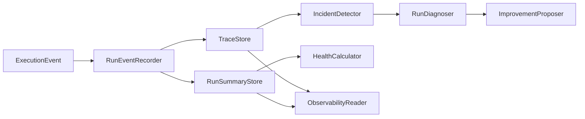

# 04j · Observability 可观测性

## 本章结论

`engine/observability/` 把 `ExecutionEvent` 转为可查询的 trace、摘要、事故、诊断、健康和改进建议。它的目标不是堆积日志，而是在不泄露敏感数据的前提下，让每个 Run 的结果、失败原因和系统趋势可解释。

## 总体架构



## 目录与职责

| 文件 | 设计职责 | 核心对象 |
| --- | --- | --- |
| `recorder.py`、`runtime.py` | 将 Run 事件写入观测边界 | `RunEventRecorder`、`RunObservation` |
| `trace_store.py` | 保存有界、脱敏的事件时间线 | `TraceStore` |
| `summary_store.py`、`projections.py` | 保存/合并运行摘要与投影 | `RunSummaryStore`、`RunSummaryProjection` |
| `incidents.py`、`diagnosis.py` | 从 trace 识别异常并给出原因 | `IncidentDetector`、`RunDiagnoser` |
| `health.py`、`proposals.py` | 汇总运行健康与改进建议 | `HealthCalculator`、`ImprovementProposer` |
| `index.py`、`reader.py` | 保留策略和只读查询入口 | `ObservabilityIndex`、`ObservabilityReader` |

## 调用链

```text
lifecycle event boundary → RunEventRecorder.record
record → TraceStore.append + RunSummaryStore.upsert
terminal trace → IncidentDetector → RunDiagnoser → improvement proposal
summary history → HealthCalculator → Server read-only API / Shell panel
```

## 核心设计

### 事件是唯一输入，不从文本猜状态

Recorder 消费 Engine 的规范化事件，而不是解析最终回答或 provider 原始帧。于是 tool failure、gate reject、approval、token usage、incomplete 与 done 都能成为稳定的观测事实，Shell、Server 和诊断工具不会各自得到不同结论。

### Trace 与 Summary 分工

trace 保存单 Run 的时间线以支持追踪；summary 保存查询友好的聚合结果。二者不互相替代：只存摘要会失去根因证据，只存 trace 会让列表、健康和趋势查询成本过高。

### 观测数据也有安全边界

`TraceStore` 对内容做 secret redaction 与深度/长度限制。观测系统不能因为“用于调试”而保存工具参数、响应或凭据的无限原文；恢复 Run 时还需要重新锚定 trace，保证时间线连续。

## 失败语义与测试

- 事件写入失败不能改变原 Run 的完成语义，但必须产生可见诊断。
- summary 合并必须幂等，避免 resume/重放使 token 或失败次数翻倍。
- incident 要区分 timeout、工具失败、gate 阻塞和 provider 失败；建议必须链接到证据，不以泛化文案替代根因。
- retention 清理不得删除仍被索引或恢复流程引用的数据。

## 自测题

1. 为什么 trace 和 summary 不能只保留其中一种？
2. 为什么 observability 写入不应反向改变 Run 的终态？
