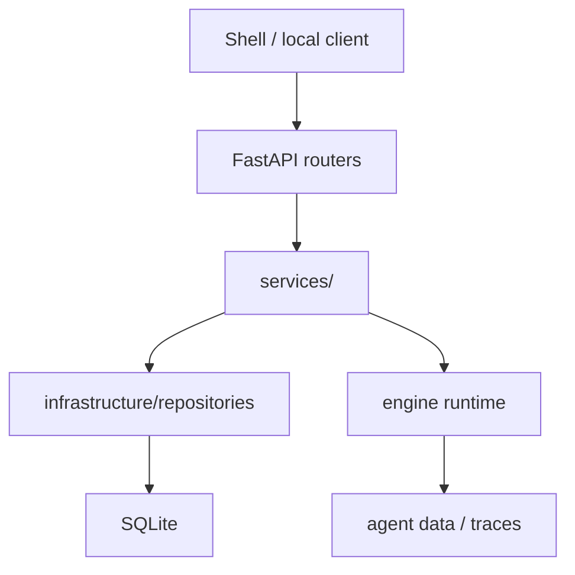

# 07 · Server 平台后端

> **当前实现说明**：Server 是本机 FastAPI 服务，版本 `0.2.0`。接口定义的唯一事实来源是 `server/app/routers/agent.py`、`server/app/routers/config.py`，外加 `server/app/main.py` 中直接定义的 `/api/health`（它不在任何 router 内）；下表已按当前实现重写。

## 服务边界

`server/` 负责 HTTP/SSE、local token 鉴权、SQLite repositories、session/profile/auto task 持久化、Engine runtime 装配和 scheduler。它不实现模型协议、ReAct、工具安全或终端渲染；这些分别属于 Engine 或 Shell。

启动时，`server/app/main.py` 会：初始化 local token 与数据库、加载并校验 identity catalog 的可执行资产闭包（`validate_execution_assets`：route → pipeline → 节点 skill → allowlist → allowed_tools；校验失败即启动失败）、标记中断 Run 为可恢复、同步 token 统计、设置 generation sink 并启动 auto-task scheduler。

关闭时按 6 步执行（`main.py`）：

1. `set_default_generation_sink(None)` 摘除 generation sink；
2. 取消 scheduler task；
3. `cancel_background_runs()` 收尾后台 auto-task Run；
4. `close_shared_llm_clients()` 关闭共享 LLM client；
5. `close_audit_chains()` 封存审计链——这是审计链唯一定义良好的封链边界（此刻不再有 Run 追加写入），封链后对已封日志的回滚可在下次校验时被检出，属安全语义而非清理动作；
6. `close_db()` 关闭 SQLite。

## 鉴权与网络边界

- 除 `/api/health` 外，已注册 router 统一依赖 `require_auth`；客户端需使用本地 Bearer token。
- CORS 仅允许 `localhost` 与 `127.0.0.1` 的 HTTP(S) origin。
- 这是单机本地服务，而非多租户公网 API；不要将其直接暴露到不受信任网络。

## 路由总览

### Health

| 方法 | 路径 | 作用 |
| --- | --- | --- |
| GET | `/api/health` | 返回 `status`、server version 和 `nonce`；无 router 鉴权。定义在 `main.py`，不属于任何 router。 |

`nonce` 回显 `SMITH_SERVER_NONCE` 环境变量（未设置时为 `null`）。Shell 用它分辨"自己 spawn 的 server"：只有 nonce 与自己启动时注入的值一致才认领；`null` 意味着"不是我启动的，不要采纳"（`main.py`，`test_health_nonce.py`）。

### Agent、会话与消息

| 方法 | 路径 | 作用 |
| --- | --- | --- |
| GET | `/api/agent` | 获取当前 Agent profile。 |
| POST | `/api/agent/ensure` | 创建或确保本地 profile 存在。 |
| GET | `/api/agent/memory/status` | 返回记忆维护状态。 |
| GET | `/api/agent/sessions` | 列出 session。 |
| POST | `/api/agent/sessions` | 创建 session。 |
| PATCH | `/api/agent/sessions/{session_id}/model` | 修改会话 model profile。 |
| POST | `/api/agent/sessions/{session_id}/compress` | 压缩并持久化会话上下文。 |
| DELETE | `/api/agent/sessions/{session_id}` | 删除 session。 |
| GET | `/api/agent/sessions/{session_id}/messages` | 分页获取消息，支持 `limit`、`offset`。 |
| POST | `/api/agent/sessions/{session_id}/messages/stream` | 创建消息 Run 并以 SSE 返回执行事件。 |

流式消息 body 使用 `MessageCreate`，可提供 `content`、可选 `context`、`skill_name`、`identity_id` 与 `working_dir`。服务端不把普通 JSON 结果伪装为流式完成：Shell 应按 SSE 事件消费 Run 的真实状态。

`POST /sessions` 也接受 `identity_id`。identity 在会话创建或首条消息时固定到会话，后续消息沿用；不存在修改会话 identity 的端点（`PATCH .../model` 只能改 `model_profile`），换身份必须新建会话。

### Skill、MCP 与项目指令

| 方法 | 路径 | 作用 |
| --- | --- | --- |
| GET | `/api/agent/skills` | 列出已发现技能和其启用状态。 |
| PUT | `/api/agent/skills/{skill_name}` | 更新单个 skill 的启用状态。 |
| GET | `/api/agent/mcp` | 只读列出配置的 MCP server。 |
| PUT | `/api/agent/project-instructions` | 为给定 working directory 初始化 `.smith/SMITH.md`。 |

### Run 与审批

| 方法 | 路径 | 作用 |
| --- | --- | --- |
| GET | `/api/agent/runs/{run_id}` | 查询 Run 状态。 |
| POST | `/api/agent/runs/{run_id}/resume` | 恢复可恢复 Run，并以 SSE 返回事件。 |
| POST | `/api/agent/runs/{run_id}/approval` | 提交该 Run 的审批决定，返回最新状态。 |

审批决定绑定 `run_id`，不能作为会话级“永久允许”处理。请求已过期、Run 所属不匹配或状态不允许时，Service 应拒绝而不是执行工具。

### 可观测性与使用量

| 方法 | 路径 | 作用 |
| --- | --- | --- |
| GET | `/api/agent/token-stats` | 获取 token 统计；可传 `year`。 |
| GET | `/api/agent/observability/runs` | 最近 Run 摘要，`limit` 为 1–200，默认 50。 |
| GET | `/api/agent/observability/runs/{run_id}` | 单个 Run 摘要。 |
| GET | `/api/agent/observability/runs/{run_id}/trace` | Run trace，`limit` 为 1–1000，默认 300。 |
| GET | `/api/agent/observability/incidents` | 最近 incident，`limit` 为 1–200，默认 50。 |
| GET | `/api/agent/observability/health` | Agent health 投影，`limit` 为 1–200，默认 50。 |
| GET | `/api/agent/observability/runs/{run_id}/diagnosis` | Run 诊断。 |
| GET | `/api/agent/observability/runs/{run_id}/improvement-proposal` | 改善建议。 |

### 自动任务

| 方法 | 路径 | 作用 |
| --- | --- | --- |
| GET | `/api/agent/auto-tasks` | 列出自动任务。 |
| POST | `/api/agent/auto-tasks` | 新建自动任务。 |
| PUT | `/api/agent/auto-tasks/{task_id}` | 更新任务。 |
| POST | `/api/agent/auto-tasks/{task_id}/trigger` | 立即触发后台执行，返回 `202`。 |
| DELETE | `/api/agent/auto-tasks/{task_id}` | 删除任务。 |
| GET | `/api/agent/auto-tasks/{task_id}/runs` | 获取任务执行记录。 |

### LLM 配置

| 方法 | 路径 | 作用 |
| --- | --- | --- |
| GET | `/api/config/llm` | 获取可展示 LLM 配置；不得返回明文 API key。 |
| GET | `/api/config/llm/models` | 从兼容 relay 发现可用模型。 |
| POST | `/api/config/llm` | 部分更新持久化 LLM 配置。 |

`routes` 与 `timeout_profiles` 只允许 `interactive`、`gate`、`background` 三种 usage。此外还有 `models` 维度：按模型名的覆盖表，key 是任意字符串（模型名），不受 usage 枚举限制；顶层字段另有 `vendor`、`provider`、`api_key`、`base_url`、`model`、`stream`、`max_output_tokens`、`context_window`。

`POST /api/config/llm` 是三态部分更新语义：省略的字段保留现值；发送 `null` 删除对应 override；对 `routes`/`models`/`timeout_profiles` 发送空 mapping 清空整段。请求模型 `extra="forbid"`，未知字段返回 422。详情、字段和 endpoint 校验见[LLM 模块](04b-LLM模块设计.md)。

## 数据职责

SQLite repositories 管理 profile、session、messages 与 auto task 等应用记录；Engine 自己的 Run/checkpoint/trace/记忆文件位于 agent 数据目录。Server 负责把二者编排起来，但不能把 Engine 私有数据结构泄漏成不稳定的数据库契约。

Pydantic schema 集中在 `server/app/schemas/`，有一个例外：config router 在 `routers/config.py` 内联定义了 `LLMRoutePatch`、`LLMTimeoutProfilePatch`、`LLMConfig` 三个模型。新增 endpoint 应先新增/复用 schema，再由 router 调用 service；router 不应直接嵌入数据库逻辑。

## Service 与职责

`server/app/services/` 共 13 个 service，`server/app/infrastructure/repositories/` 共 3 个 repo。**`AgentService` 是 agent router 的唯一门面**：`routers/agent.py` 的所有端点只依赖它，由它组合其余 service。

| 文件 | 职责 |
| --- | --- |
| `agent_service.py` | agent router 的唯一门面，组合下列 service 对外提供操作。 |
| `agent_profile_service.py` | 本地 Agent profile 的创建与生命周期。 |
| `session_service.py` | 会话与消息持久化、聊天 Run 的创建与执行编排。 |
| `run_state_service.py` | Engine run state store 的只读/恢复/审批适配。 |
| `skill_service.py` | 技能发现列表与启用状态更新。 |
| `mcp_service.py` | 只读列出配置的 MCP server。 |
| `project_instruction_service.py` | 为 working directory 初始化 `.smith/SMITH.md`。 |
| `observability_service.py` | Run 摘要、trace、incident、health 的只读投影。 |
| `token_stats_service.py` | token 用量事件的持久化、聚合与 generation sink。 |
| `auto_task_service.py` | 自动任务 CRUD 与后台执行。 |
| `scheduler.py` | 每 60 秒 tick 一次、执行到期自动任务的后台调度循环。 |
| `config_service.py` | 用户可编辑 LLM 配置的持久化与脱敏展示。 |
| `engine_runtime.py` | Engine runtime 装配、identity catalog 加载与资产校验、共享 LLM client 管理。 |

| Repo | 职责 |
| --- | --- |
| `agent_profile_repo.py` | Agent profile 表。 |
| `session_repo.py` | session 与 message 表。 |
| `auto_task_repo.py` | 自动任务与执行记录表。 |

## 明确不存在的 API

当前 Server **没有**下列路由，调用方不得依赖：

- `/api/templates`；
- `/api/plugins/*` 或 webhook plugin 管理；
- `/api/teams/*`、团队消息或圆桌会话；
- 知识库/RAG 的上传、检索或向量管理 API；
- 对外 MCP server endpoint。

这些内容曾出现在早期设计/调研文档中，现归类为候选方向，不能作为协议承诺。

## 新增 API 的规则

1. 先确认能力归属：HTTP/persistence 在 Server，provider/runtime 语义在 Engine，呈现在 Shell。
2. 用显式 request/response schema；对数字、枚举、分页与未知字段做 Pydantic 校验。
3. 变更 SSE 事件时同步修改 Engine 事件、Shell reducer 与契约测试，不在 router 私造事件。
4. 对副作用检查 local auth、working directory 边界、Run 所属和审批语义。
5. 添加 service/router 测试并更新本页路由表。
