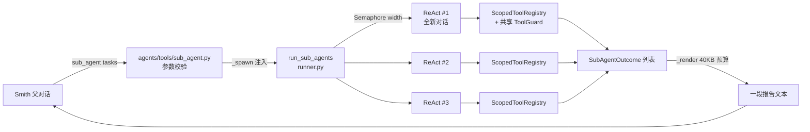

# 24 · 子 Agent 委派系统

## 本章结论

Smith 可以把一段**范围明确**的工作交给子 Agent：一次隔离的 ReAct 对话，跑完只回一份最终报告。父 Agent 付的是**摘要的 token，不是转录的 token**。

子 Agent 不是第二个常驻 Agent。它**没有记忆、没有 session、没有 profile 记录、不能向用户提问**，跑完即消失。它是一个上下文预算工具，不是多 Agent 路由。

三个已装配的类型：`explorer`（只读调查）、`reviewer`（只读对抗式评审）、`implementer`（可写，单点改动并自验）。类型由 `agents/subagents/*.yaml` 声明，上限由 engine 强制，**内容层抬不动**。

> **当前状态：能力已实现，但默认配置下模型看不见它。**
> `sub_agent` 在 `_BUILTIN_PROVIDER_FILENAMES` 里注册成功，也不是 `hidden`，
> 但 `agents/smith/config.yaml` 的 `tools.enabled` 没有列出它，
> `enabled_tools_from_config()` 因此把它过滤掉（`preparation.py:81`），
> 调用会被 `registry.py:703` 拦下。上线该能力的 `9180061` 未同步 profile 种子。
>
> 启用方式：在 `~/.agent-smith/agent/config.yaml` 的 `tools.enabled` 中加入
> `sub_agent`。注意 profile 是**一次性种子**（CLAUDE.md §7），改仓库里的
> `agents/smith/config.yaml` 只对全新安装生效，已有安装必须改运行时那份。

## 学习目标

- 说清子 Agent 与"多 Agent 协作"的区别，以及为什么这个区别是刻意的。
- 定位类型声明、扇出执行、报告渲染三处代码，知道各自管什么。
- 复述八条不变量，并说出每一条**不成立会发生什么**。
- 判断一个任务该不该委派。

## 总体架构



三层职责分离，边界由 `agents/` 的零导入约束决定：

| 关注点 | 文件 |
| --- | --- |
| 类型定义（提示词、工具白名单、模型角色、迭代与 token 上限） | `agents/subagents/*.yaml` |
| 类型解析与校验 | `engine/execution/subagent/catalog.py` |
| 扇出、隔离、故障隔离 | `engine/execution/subagent/runner.py` |
| 工具 schema 与报告渲染 | `agents/tools/sub_agent.py` |
| 能力注入 | `bind_sub_agent_tool()` — `engine/execution/orchestration/builtin_tools.py:150` |

内容层的零导入边界没有破例：`agents/tools/sub_agent.py` 不 import 任何 `engine` 符号，engine 通过 `wrap_tool` 把 `_spawn` 注入进去——和 `memory_ops`、`skill_load` 用的是同一套机制。注入发生在**模型给的参数之后**，所以模型伪造一个 `_spawn` 参数顶不掉真实能力（`sub_agent.py:166`）。

## 核心概念

### 类型是"能力信封"，不是 Agent 实例

`SubAgentSpec`（`catalog.py:48`）只有八个字段：`id` / `name` / `description` / `prompt` / `tools` / `max_iters` / `model` / `token_budget`。YAML 里出现未知字段直接报错（`catalog.py:99`）——拼错 `tool:` 不会静默变成"没有工具"。

`model` 声明的是**角色**（`interactive` / `background`），永远不是 provider 名或模型字符串（`catalog.py:40`）。凭据和选型留在运维配置里，不进随仓库发布的 YAML。声明了 `background` 但部署没建这个 port 时，回退到 `interactive` 而不是让任务失败（`runner.py:171`）。

### 三个已装配类型

| 类型 | 可写？ | `max_iters` | 工具 | 用途 |
| --- | --- | --- | --- | --- |
| `explorer` | 否 | 20 | `read_file` `grep` `glob_files` `list_dir` `get_current_time` | 搜索并阅读本地代码树，用 `path:line` 汇报 |
| `reviewer` | 否 | 20 | `read_file` `grep` `glob_files` `list_dir` | 对抗式缺陷评审，必须构造出具体的失败场景 |
| `implementer` | 是 | 30 | `read_file` `grep` `glob_files` `list_dir` `edit_file` `write_file` `shell` | 一处范围明确的改动，并**跑点什么**来验证 |

两个刻意的缺项：

- `reviewer` **没有** `git_ops`。作用域是按工具**名**收窄的，不是按动作；而 `git_ops` 把 commit / push / branch 和 diff 装在同一个工具里。知道哪份 diff 重要的是父 Agent，所以 diff 由父 Agent 写进任务简报。
- `implementer` **没有** `todo`。`todo` 是 session 作用域且按下标寻址的，并行的兄弟任务会互相覆盖条目；而且它是用户可见的任务清单，不是草稿纸。

### 报告契约

每个子 Agent 的 system prompt 尾部都拼上同一段契约（`runner.py:49`）：

```text
1. Answer   —— 直接结果，放最前面
2. Evidence —— 具体的 file:line、跑过的命令、查到的值
3. Gaps     —— 没能确定的部分，直说
```

契约里明确写了"不要向父 Agent 提问，它无法回复"。这不是礼貌用语——子 Agent 跑在 `without_approval_context()` 下（见下文），提问在物理上就没有回路。

## 调用链


事件流只取四类（`runner.py:253`）：`TEXT_DELTA` 累积成摘要、`TOOL_CALL_START` 计数、`TOKEN_USAGE` 记账并检查两道预算、`FAILED` / `INCOMPLETE` 记原因。**其余事件全部丢弃**——这正是父 Agent 看不到子 Agent 工具调用的原因，也是它省下 token 的原因。

## 实现

### 双重预算：turn 和 token

`max_iters` 管的是**轮次**，`token_budget` 管的是**token**。后者才是失控时真正烧掉的东西——一轮带回 200KB 工具结果的对话，15 轮就能烧穿任何按轮次设的预算。

```python
# runner.py:260 —— 先记账，后判断
elif event.type is EventType.TOKEN_USAGE:
    batch.spend(_accumulate_usage(usage, event))
    # 在造成超支的那次记账之后检查：token 已经花掉了，
    # 唯一有用的反应是停在下一轮之前，别让它继续复利。
    if usage.get("total_tokens", 0) >= spec.token_budget:
        failure = f"token budget exhausted ({usage['total_tokens']}/{spec.token_budget})"
        break
    if batch.exhausted:
        failure = "batch token budget exhausted"
        break
```

provider 不上报 `total_tokens` 时按 input+output 计费（`runner.py:140`）——**缺失的记账不能读成免费**。

两道预算都在轮次之间停机，并把**部分结果当作失败**报告出去。

### 上限表

| 量 | 值 | 位置 |
| --- | --- | --- |
| 单次调用任务数 | 10 | `runner.py:38` `MAX_TASKS_PER_CALL` |
| 并发上限 | 8（默认 4） | `runner.py:39-40` |
| 单 Agent 迭代 | 40（默认 15） | `catalog.py:29-30` |
| 单 Agent token | 400 000（默认 120 000） | `catalog.py:34-35` |
| 单批 token | 600 000 | `runner.py:47` |
| 单任务墙钟 | 600 s | `runner.py:43` |

YAML 里写 `max_iters: 500` 不会报错，会被 `min()` 削到 40（`catalog.py:150`）。**上限属于 engine，不属于内容层。**

### 报告怎么装进一次工具结果

运行时对超过 50 KB 的工具结果做截断并溢出到文件——丢掉的是**尾巴**，也就是最后几个子 Agent 的发现。所以渲染端自己先兜住（`sub_agent.py:76`）：

```python
REPORT_BYTE_BUDGET = 40 * 1024      # 整份报告
MAX_SUMMARY_BYTES  = 12 * 1024      # 单个 Agent 上限
MIN_SUMMARY_BYTES  = 1024           # 单个 Agent 下限

per_agent = max(MIN_SUMMARY_BYTES,
                min(MAX_SUMMARY_BYTES, REPORT_BYTE_BUDGET // max(1, len(outcomes))))
```

按**字节**而不是字符：一份中文报告的 UTF-8 字节数约为字符数的 3 倍，按字符设的上限会直接冲过运行时的字节天花板。`_clip()` 按 UTF-8 边界截断，不会劈开一个字符（`sub_agent.py:83`）。

### 不变量

每条都对应一个"不成立会怎样"：

| 不变量 | 不成立会怎样 | 强制点 |
| --- | --- | --- |
| **不可递归** | 无上限的指数扇出，父 Agent 看不到任何天花板 | `catalog.py:116` 剥离 + `runner.py:177` 再剥离一次 |
| **不可提权** | 类型能点名身份或 profile 已禁用的工具 | `ScopedToolRegistry` 与父注册表求交集 |
| **故障被隔离** | 一个任务抛异常拖垮整批 | `gather(return_exceptions=True)`，仅 `CancelledError` 向上传播 |
| **摘要即产品** | 循环报成功但父 Agent 什么也没拿到 | `runner.py:290` 空文本判失败 |
| **无人在环** | 继承父 broker 会让循环 `await` 一个用户永远看不到的审批，挂到超时为止 | `without_approval_context()` |
| **事实门禁按 Agent 独立** | 一个 Agent 的轮次边界会替兄弟满足未决质询 | `runner.py:199` 每个子 Agent 一个 `FactGate` |
| **Hook 覆盖委派工作** | 子 Agent 能改父 Agent 被 `config-protection` 挡住的文件 | `hook_registry` 透传（`runner.py:250`） |
| **只读类型不持有可写工具** | 描述里写"read-only"不构成任何证明 | 按 `ToolDefinition.is_write_tool` / `permission_level` 校验 |

还有一条容易被忽略的：**装不上的能力不进提示词**。`agents/subagents/` 缺失或损坏时，工具被标 `hidden` 并记 ERROR 日志（`builtin_tools.py:169-177`），而不是让每一轮对话都失败。

## 完整示例

新增一个"只读依赖审计"类型。文件 `agents/subagents/auditor.yaml`：

```yaml
schema: agentsmith.subagent/v1
id: auditor
name: Dependency Auditor
description: 只读 —— 核对声明的依赖与实际 import 是否一致
max_iters: 20
token_budget: 80000
tools:
  - read_file
  - grep
  - glob_files
  - list_dir
prompt: |
  你在审计依赖声明。对每一个 manifest 里声明的依赖，确认代码中
  确实存在对应的 import；对每一个 import，确认它已被声明。
  报告两类偏差，各自附 path:line。不要修改任何文件。
```

无需改动 Python 代码——`SubAgentCatalog.load()` 扫描整个目录（`catalog.py:175`）。重启后父 Agent 的工具描述里会自动多出一行类型说明，且 `agent_type` 的 JSON Schema `enum` 会包含 `auditor`（`builtin_tools.py:196`），拼错的类型名在 provider 侧就被挡掉，不会浪费一次启动去发现笔误。

父 Agent 的调用形态：

```json
{
  "tasks": [
    {"agent_type": "auditor",  "prompt": "审计 server/ 的依赖声明…", "label": "server"},
    {"agent_type": "explorer", "prompt": "找出所有调用 fit_request 的位置…", "label": "ctx"}
  ],
  "max_parallel": 2
}
```

两个任务并发跑，返回一段 `# Sub-agent report (2/2 succeeded)` 开头的文本。

验证命令：

```bash
cd engine && uv run --with pytest --with pytest-asyncio pytest tests/execution/test_sub_agent.py
```

## 工程实践

**该委派的**：可以并行的独立调查；会把大量噪音塞进主对话的搜索；需要独立第二意见的评审。

**不该委派的**：需要本对话上下文的工作（子 Agent 看不到）；一次简单查找（启动开销不划算）；任何需要用户交互的事（子 Agent 问不了）。

**并行任务的文件范围必须不相交**。并发编辑是后写覆盖先写，而且**没有任何机制会发现这次冲突**。工具描述里明写了这条（`sub_agent.py:24`），但真正保证它的是父 Agent 写简报时的划分——要么给每个任务不相交的范围，要么分成多次调用。

**简报要能独立成立**。子 Agent 的对话只有两条消息：一条 system（类型提示词 + 工具清单 + 报告契约）和一条 user（你的简报）——`runner.py:124`。父对话里的任何事实，不重述就不存在。

## 自测题

1. `catalog.py` 里 `tools` 的非空校验为什么必须放在剥离 `sub_agent` **之后**？放在之前会产生什么样的类型？
2. 一个子 Agent 的 provider 只回 `input_tokens` 和 `output_tokens`，不回 `total_tokens`。它的花费怎么算进批预算？为什么不能按 0 算？
3. 为什么每个子 Agent 要拿一个全新的 `FactGate`，而不是共用父 Agent 那个？
4. 报告预算为什么按字节而不是按字符设？给出一个按字符设会出事的具体输入。
5. `agents/subagents/` 整个目录被删掉后，下一轮对话会发生什么？为什么不是报错？
