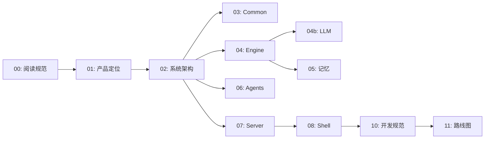

# Smith 文档

## 本章结论

当前实现文档只描述已落地、可由代码或测试验证的契约；历史设计、调研与参考资料只提供背景，不代表产品能力。当前基线为 **2026-08-31 的 `main`（`a094162`）** 源码对齐版本。阅读和维护规范见 [00 · 文档阅读指南与表达规范](00-文档阅读指南与表达规范.md)。

## 阅读地图

## 按目标阅读

| 目的 | 阅读入口 | 事实来源 |
| --- | --- | --- |
| 安装、运行与基本定位 | [仓库 README](../README.md) | `README.md`、各包 manifest |
| 理解产品边界 | [01 · 产品设计与定位](01-产品设计与定位.md) | `README.md`、Shell/Server 入口 |
| 理解当前架构与一次 Run | [02 · 系统架构](02-系统架构.md) | `server/app/main.py`、`engine/execution/` |
| 修改执行运行时 | [04 · Engine 设计与实现](04-Engine-设计与实现.md) | `engine/` 与对应测试 |
| 修改 Engine 的任一模块 | [04 · Engine 总览](04-Engine-设计与实现.md) → 对应 04a–04k 专题 | `engine/` 与对应 `engine/tests/` |
| 修改模型调用、记忆、身份或技能 | [04b · LLM](04b-LLM模块设计.md)、[05 · 记忆](05-Engine-记忆系统.md)、[04d · Identity](04d-Identity-身份与路由.md)、[04h · Skill](04h-Skill-技能系统.md) | `engine/{llm,memory,identity,skill}/`、`agents/`（目录地图见 [`agents/README.md`](../agents/README.md)） |
| 修改本地 API 或终端 UI | [07 · Server](07-Server-平台后端.md)、[08 · Shell](08-Shell-终端前端.md) | `server/app/routers/`、`shell/src/` |
| 开发、验证和下一阶段工作 | [10 · 开发规范](10-开发规范与约定.md)、[11 · 路线图](11-开发路线图与待办.md) | 包脚本、测试、Issue/ADR |

## 系统机制说明（20–24）

这五篇是按代码通读后写的现行机制说明，用于对外讲解五个核心子系统（`20`–`23` 写于 2026-08-23，`24` 补于 2026-08-31）。与 `04a`–`04k` 旧稿冲突时以这五篇和代码为准。

| 文档 | 讲什么 | 事实来源 |
| --- | --- | --- |
| [20 · Agent Loop 运行机制](20-Agent-Loop-运行机制.md) | 三条执行路径、ReAct 单轮形状、三套预算、终态与原因、草稿生命周期、崩溃恢复、管线门禁 | `engine/execution/` |
| [21 · 记忆系统](21-记忆系统.md) | 两个视图、证据日志、变更集编译、三道程序裁决、失败不写入、双游标与 Dream、git 快照 | `engine/memory/`、`engine/memory/MEMORY_POLICY.md` |
| [22 · 上下文治理](22-上下文治理.md) | 16 层提示词与信任标签、预算推导、CJK token 估算、`fit_request` 五步阶梯、三种压缩、缓存前缀 | `engine/context/` |
| [23 · 工具与安全体系](23-工具与安全体系.md) | 20 个工具的能力矩阵、八道关卡、ToolGuard 与 31 条危险规则、风险分级与审批、Seatbelt profile、哈希链审计 | `agents/tools/`、`engine/{tool,safety,sandbox}/` |
| [24 · 子 Agent 委派系统](24-子Agent-委派系统.md) | 三个已装配类型、能力信封、扇出与并发上限、turn/token 双预算、八条不变量、40KB 报告预算 | `engine/execution/subagent/`、`agents/subagents/`、`agents/tools/sub_agent.py` |

## 文档分层

### 当前实现（规范性）

根目录的 `01`–`08` 和 `10` 为规范性文档，说明已经落入源码的能力、接口和边界；`09`（外部架构模式对比）与 `11`（路线图）是非规范性的决策输入，不描述当前实现。规范性文档应满足：

- 每个关键断言都能追溯到明确的源码路径或测试；
- 未实现事项明确写为“计划中”，不伪装成接口或模块；
- API 路径以 `server/app/routers/` 为准，运行时行为以测试和实现为准；
- 同一事实只在一个主文档详细维护，其他页面链接过去而非复制。

`03`、`04a`、`04b`、`05` 是对应层的深入参考；对外或跨层约定应先在 `02` 留下概览。

### 决策与历史材料（非规范性）

| 目录/文件 | 用途 | 使用规则 |
| --- | --- | --- |
| [`adr/`](adr/) | 已做出的架构决策 | 记录决策与后果；新决策新增 ADR，不改写历史结论。 |
| [`analysis/`](analysis/) | 问题分析与待解方案 | 以状态字段为准，未解决项不得当作已实现。 |
| [`capabilities/`](capabilities/) | 方案拆解与能力升级记录 | 若能力已落地，主文档与代码优先。 |
| [`research/`](research/) | 调研、竞品观察和候选方案 | 不是产品承诺，也不是实现说明。 |
| [`reference/`](reference/) | 外部产品逆向和早期选型资料 | 可能包含已淘汰的 SwiftUI/macOS、插件或多 Agent 方案。 |
| [`superpowers/`](superpowers/) | 一次性设计 artifact 的规格与实施计划 | 仅对原 artifact 有约束力。 |

## 维护规则

1. 改变 API、事件字段、配置键、数据文件或安全语义时，同一变更必须更新对应当前实现文档。
2. 不删除有决策价值的旧调研；移动或保留在历史目录，并在入口页标出它不是当前事实。
3. 代码示例只展示可运行的最小路径；密钥、真实 token、私人 URL 和机器路径不能进入文档。
4. 合并前至少执行该变更层的质量命令；完整命令见[开发规范](10-开发规范与约定.md)。
5. 文档链接必须使用相对路径，并在本地检查中保持可解析（仓库不使用 CI；唯一自动触发点是需手动启用的 `.githooks/pre-push`，且它只跑测试、不做链接检查）。

## 当前能力边界

- Smith 是单个本地常驻 Agent；`coding` 是声明式身份与流程，不是一个独立进程或子 Agent。
- Smith 可把范围明确的工作委派给**临时子 Agent**（隔离执行、只回摘要、无记忆/无 session/无 profile 记录）。它不是第二个常驻 Agent，也不构成多 Agent 路由。**注意**：该能力已实现但未列入 profile 的 `tools.enabled`，默认对模型不可见——见 [24](24-子Agent-委派系统.md)开头的状态说明。
- Shell 是 Ink/React 终端客户端；当前没有 SwiftUI/macOS 桌面端。
- Server 注册 `agent` 与 `config` 两组带鉴权的本地 API，外加一个免鉴权的 `/api/health` 探活端点（shell 启动握手所需的有意例外）；不存在插件管理、团队/圆桌会话或知识库 HTTP API。
- Smith 是 MCP client，支持配置的 stdio 与 streamable HTTP 服务；它不对外提供 MCP server。
