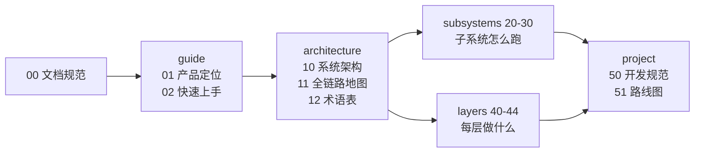

# Smith 文档

## 本章结论

每个主题只有一篇正本。当前基线为 **2026-08-31 的 `main`（`a094162`）**：每条断言都能追溯到源码路径或测试，追不到的一律标为“计划中”。被取代的旧稿在 [`archive/`](archive)，不是当前事实。

写作与维护契约见 [00 · 文档阅读指南与表达规范](00-文档阅读指南与表达规范.md)。

## 目录结构

```text
docs/
├── 00-文档阅读指南与表达规范.md   写作与维护契约
├── check-links.py               链接检查（改完文档跑一次）
├── guide/          01-02  上手：这是什么、怎么跑起来
├── architecture/   10-12  全貌：分层、一次请求的全链路、术语
├── subsystems/     20-30  横切子系统：每个子系统怎么跑
├── layers/         40-44  代码分层：每一层解决什么问题
├── project/        50-52  项目治理：规范、路线图、外部对比
├── archive/               已被取代的旧稿（不是当前事实）
└── adr/ analysis/ capabilities/ reference/ research/ superpowers/
                           决策与历史材料（非规范性）
```

**编号是稳定的**：`guide` 用 0x，`architecture` 用 1x，`subsystems` 用 2x–3x，
`layers` 用 4x，`project` 用 5x。新增文档在所属段内取下一个号，不重排既有编号。

## 阅读地图



`subsystems` 与 `layers` **切法不同、不重叠**：前者按运行机制切（一个子系统一篇，
跨越多个代码目录），后者按代码目录切（一个目录一篇）。同一件事只在其中一处详述，
另一处链接过去。

## 按目标阅读

| 目的 | 从哪读起 | 事实来源 |
| --- | --- | --- |
| 安装、运行、第一次对话 | [02 · 快速上手](guide/02-快速上手.md) | 仓库 [README](../README.md)、各包 manifest |
| 理解产品边界与非目标 | [01 · 产品定位](guide/01-产品定位.md) | Shell/Server 入口 |
| 理解分层与一次 Run | [10 · 系统架构](architecture/10-系统架构.md) → [11 · 全链路白盒地图](architecture/11-全链路白盒地图.md) | `server/app/main.py`、`engine/execution/` |
| 看不懂某个词 | [12 · 术语表](architecture/12-术语表.md) | 仓库 [CONTEXT.md](../CONTEXT.md) |
| 改执行循环、记忆、上下文、工具安全 | [subsystems/](subsystems) 对应篇 | `engine/execution/`、`engine/memory/`、`engine/context/` |
| 改某一层的代码 | [layers/](layers) 对应篇 | 对应目录与其测试 |
| 提交前要跑什么 | [50 · 开发规范](project/50-开发规范.md) | 包脚本、`.githooks/` |
| 下一步做什么 | [51 · 路线图](project/51-路线图.md) | Issue / ADR |

## 正本清单

### guide —— 上手

| 文档 | 讲什么 |
| --- | --- |
| [01 · 产品定位](guide/01-产品定位.md) | 单 Agent 定位、技能切换工作流、明确的非目标 |
| [02 · 快速上手](guide/02-快速上手.md) | 安装、配置模型、第一次运行、常见故障 |

### architecture —— 全貌

| 文档 | 讲什么 |
| --- | --- |
| [10 · 系统架构](architecture/10-系统架构.md) | 五层边界与依赖方向、一次消息的生命周期、运行时数据布局 |
| [11 · 全链路白盒地图](architecture/11-全链路白盒地图.md) | 一次对话从输入到输出，逐节点走一遍，每个节点记录了什么 |
| [12 · 术语表](architecture/12-术语表.md) | 产品与实现术语的统一口径 |

### subsystems —— 子系统怎么跑

| 文档 | 讲什么 | 事实来源 |
| --- | --- | --- |
| [20 · Agent Loop](subsystems/20-Agent-Loop.md) | 三条执行路径、ReAct 单轮形状、三套预算、27 种事件、崩溃恢复、管线门禁 | `engine/execution/` |
| [21 · 记忆系统](subsystems/21-记忆系统.md) | 两个视图、证据日志、变更集编译、三道程序裁决、双游标与 Dream、git 快照 | `engine/memory/` |
| [22 · 上下文治理](subsystems/22-上下文治理.md) | 16 层提示词与信任标签、预算推导、`fit_request` 五步阶梯、三种压缩 | `engine/context/` |
| [23 · 工具与安全](subsystems/23-工具与安全.md) | 20 个工具的能力矩阵、八道关卡、31 条危险规则、Seatbelt、哈希链审计 | `agents/tools/`、`engine/{tool,safety,sandbox}/` |
| [24 · 子 Agent 委派](subsystems/24-子Agent委派.md) | 三个已装配类型、能力信封、扇出上限、turn/token 双预算、八条不变量 | `engine/execution/subagent/` |
| [25 · LLM 集成](subsystems/25-LLM集成.md) | 配置怎么解析成一次请求、适配器、流式归一化、用量记账、录制回放 | `engine/llm/` |
| [26 · MCP 集成](subsystems/26-MCP集成.md) | 两种传输、协议协商、工具名归一化、连接池、四道故障边界 | `engine/mcp/` |
| [27 · 可观测性](subsystems/27-可观测性.md) | 一次运行留下什么档案、防篡改、脱敏、事故分类、改进建议 | `engine/observability/` |
| [28 · 身份与路由](subsystems/28-身份与路由.md) | 声明式身份档案、纯词法路由、`RouteDecision` | `engine/identity/`、`engine/execution/routing/` |
| [29 · Skill 技能系统](subsystems/29-Skill技能系统.md) | `SKILL.md` 怎么被发现、启用、执行并移交上下文 | `engine/skill/` |
| [30 · Sandbox 执行环境](subsystems/30-Sandbox执行环境.md) | 子进程管理、输出上限、取消、macOS Seatbelt 约束 | `engine/sandbox/` |

### layers —— 每层做什么

| 文档 | 讲什么 | 规模 |
| --- | --- | --- |
| [40 · Common](layers/40-Common.md) | 路径根、YAML、SQLite 连接、审计哈希链。零业务逻辑 | 1.3k 行 |
| [41 · Engine](layers/41-Engine.md) | 执行框架总览、模块地图、核心契约、Hook 框架、非目标 | 28k 行 |
| [42 · Agents](layers/42-Agents.md) | 身份/管线/技能/工具/子 Agent 类型/hook 的内容契约 | 10.2k 行 |
| [43 · Server](layers/43-Server.md) | 34 个路由端点 + `/api/health`、13 个 service、并发、调度器、鉴权 | 6.4k 行 |
| [44 · Shell](layers/44-Shell.md) | Ink/React 终端 UI、SSE 事件投影、后端守护、审批交互 | 16.5k 行 TS |

### project —— 项目治理

| 文档 | 讲什么 | 规范性 |
| --- | --- | --- |
| [50 · 开发规范](project/50-开发规范.md) | 分层约束、质量命令、提交前检查 | 规范性 |
| [51 · 路线图](project/51-路线图.md) | 当前基线、待办与前置条件 | 非规范性 |
| [52 · 竞品对比](project/52-竞品对比.md) | 外部架构模式对照与借鉴原则 | 非规范性 |

## 决策与历史材料（非规范性）

| 目录 | 用途 | 使用规则 |
| --- | --- | --- |
| [`archive/`](archive) | 已被取代的旧稿 | **不是当前事实。** 每篇开头标注取代它的正本与裁决依据；不再随代码更新。 |
| [`adr/`](adr) | 已做出的架构决策 | 记录决策与后果；新决策新增 ADR，不改写历史结论。 |
| [`analysis/`](analysis) | 问题分析与待解方案 | 以状态字段为准，未解决项不得当作已实现。 |
| [`capabilities/`](capabilities) | 方案拆解与能力升级记录 | 若能力已落地，正本与代码优先。 |
| [`research/`](research) | 调研、竞品观察与候选方案 | 不是产品承诺，也不是实现说明。 |
| [`reference/`](reference) | 外部产品逆向与早期选型资料 | 可能包含已淘汰的 SwiftUI/macOS、插件或多 Agent 方案。 |
| [`superpowers/`](superpowers) | 一次性设计 artifact 的规格与实施计划 | 仅对原 artifact 有约束力。 |

## 维护规则

1. 改变 API、事件字段、配置键、数据文件或安全语义时，**同一变更**必须更新对应正本。
2. **每个主题只有一篇正本。** 出现第二篇描述同一件事时，把落败的那篇移入
   [`archive/`](archive)、写明取代者与裁决依据，并把指向它的链接改到接替者。
3. 不删除有决策价值的旧稿：移动到 `archive/` 或历史目录，并标出它不是当前事实。
4. 每条“已实现”断言都要能追溯到源码路径或测试。**按消费方的判据计数，不按目录列表**
   ——`ls agents/tools/*.py` 数不出工具数，registry 只认同时有 `TOOL_META` 和
   `execute` 的文件。
5. 代码示例只展示可运行的最小路径；密钥、真实 token、私人 URL 和机器路径不进文档。
6. 文档链接必须用相对路径并保持可解析。改名或移动后跑一次：

   ```bash
   python3 docs/check-links.py     # 退出码 0 = 全部可解析
   ```

   仓库不使用 CI，`.githooks/pre-push` 需手动启用且只跑测试，所以这条规则的执行者
   就是上面这条命令。
7. 新增文档在所属段的编号区间内取下一个号，不重排既有编号——重排会让所有外部引用失效。

## 当前能力边界

- Smith 是单个本地常驻 Agent；`coding` 是声明式身份与流程，不是独立进程。
- Smith 可把范围明确的工作委派给**临时子 Agent**（隔离执行、只回摘要、无记忆/无
  session/无 profile 记录）。它不是第二个常驻 Agent，也不构成多 Agent 路由。
  **注意**：该能力已实现但未列入 profile 的 `tools.enabled`，默认对模型不可见——
  见 [24 · 子 Agent 委派](subsystems/24-子Agent委派.md)开头的状态说明。
- 记忆是两个整体注入的视图，**没有**查询期检索、索引或 embedding。曾有的 episode
  与向量层已于 `b71be4b`（2026-08-08）移除。
- Shell 是 Ink/React 终端客户端；`main` 上没有桌面端。
- Server 注册 `agent` 与 `config` 两组带鉴权的本地 API，外加一个免鉴权的
  `/api/health` 探活端点；不存在插件管理、团队会话或知识库 HTTP API。
- Smith 是 MCP client，支持 stdio 与 streamable HTTP；它不对外提供 MCP server。
