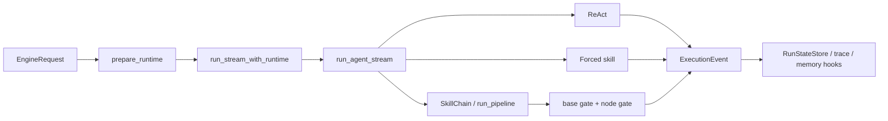

# 04e · Execution 运行生命周期与管线

> **已归档 —— 不是当前事实。**
> 本文已被 [20 · Agent Loop 运行机制](../20-Agent-Loop-运行机制.md) 取代；两者冲突时以那一篇和源码为准。
> 保留在此仅供追溯当时的设计取舍，不再随代码更新。


## 本章结论

`engine/execution/` 将一次请求管理为可恢复、可审计的 Run，并把 direct ReAct、显式 skill 与 pipeline 统一投影为 `ExecutionEvent`。它的设计重点是状态所有权和提交语义：草稿可流式显示，只有通过 gate 的节点产物才能成为链路事实。

## 总体架构



## 目录地图

| 区域 | 责任 | 关键文件 |
| --- | --- | --- |
| `orchestration/` | runtime 装配、Run 生命周期、恢复、事件边界 | `runtime.py`、`preparation.py`、`lifecycle.py`、`agent_loop.py`、`run_state.py` |
| `pipeline/` | skill node、gate、checkpoint、回退与产物上下文 | `skill_chain.py`、`pipeline.py`、`gate.py`、`checkpoint.py` |
| `react/` | 单步模型—工具循环 | `react_loop.py`，详见 [04a](04a-ReAct-Loop-设计.md) |
| `routing/` | 请求到 route decision | `task_router.py`，详见 [04d](../04d-Identity-身份与路由.md) |
| 根文件 | 事件、证据 hash、运行控制提示、回放签名 | `events.py`、`evidence.py`、`run_signature.py` |

## 核心对象

| 对象 | 为什么存在 | 输入/输出 | 失败与边界 |
| --- | --- | --- | --- |
| `EngineRequest` | 明确用户输入与可选执行选择 | message、history、identity、skill、working dir | 不由 Engine 猜 cwd |
| `RuntimeContext` | 承载可信 profile/session/filesystem 边界 | 嵌入层已解析的运行环境 | scope 不匹配拒绝恢复/写入 |
| `RuntimeServices` | 显式资源所有权 | LLM、tools、skills、安全、MCP、hooks | 终态关闭归属资源 |
| `RunStateStore` | 跨中断保存 Run | 状态迁移、事件、scope | 非法迁移和 scope mismatch 明确报错 |
| `SkillChain` | 让 YAML 工作流有提交/回退语义 | nodes、gates、backtrack map | 环、无效拓扑、失败回退受保护 |

## 管线调用链

```text
route decision → SkillChain.from_yaml → run_pipeline
run_pipeline → 执行 skill 或 node-local ReAct fallback → provisional output
provisional output → base gates → node gate → commit | retract | backtrack | wait user
commit → 保存 checkpoint → 下一 node → 清理 checkpoint → terminal Run
```

## 设计说明

### Run 状态优先于 UI 状态

Shell 只消费 `ExecutionEvent`；它不能根据一段文本判断任务是否完成。`RunStateStore` 对状态迁移、scope、持久化和恢复作最终判断。恢复 checkpoint 还要求 identity、工作目录、请求和 owner 状态匹配，避免重复提交夺取活跃 Run。

### Provisional 是事务式提交模型

pipeline 节点产生的文本先带 `provision_id`。gate 通过发出 commit，失败、回退或需要继续取证时发出 retract。这样临时草稿可以实时展示，却不会写入正式 transcript、前序产物或记忆。

### Gate 不是文本格式检查

base gate 在每个 node 之前兜底，node gate 校验本步骤的交付。证据绑定要求结论与实际工具/测试证据对应；仅在 Markdown 中声称“测试通过”不能构成提交依据。

## 失败语义与测试重点

- 无回退目标的 gate 失败终止为 blocked，不无限重试。
- 等待用户输入需要显式 marker；少数对话节点可按配置识别真正的终止问句。
- 同一失败签名受 `FailureLoopGuard` 限制，防止 backtrack 自循环。
- 取消、setup 失败和恢复失败都有终态事件与持久化原因。

## 自测题

1. 为什么 pipeline 的文本不能在 gate 之前写入 session？
2. checkpoint 恢复为什么要验证 owner 是否仍在运行？
