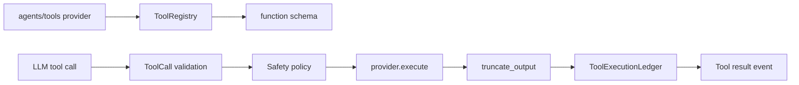

# 04f · Tool 工具系统

> **已归档 —— 不是当前事实。**
> 本文已被 [23 · 工具与安全体系](../subsystems/23-工具与安全.md) 取代；两者冲突时以那一篇和源码为准。
> 保留在此仅供追溯当时的设计取舍，不再随代码更新。


## 本章结论

`engine/tool/` 是模型与实际能力之间的规范化适配层。它负责发现 provider、生成 schema、校验调用、执行、截断输出、记录账本和施加 node-local 工具范围；它不决定某次调用是否安全，安全决策属于 [04g · Safety](04g-Safety-安全与审批.md)。

## 总体架构



## 目录与职责

| 文件 | 设计职责 |
| --- | --- |
| `interface.py` | 以 `ToolDefinition`、`ToolCall`、`ToolResult` 固化运行时协议 |
| `registry.py` | 从 `TOOL_META` + `execute` 发现工具、校验调用、异步适配与 scoped registry |
| `schema.py` | 从 Python 类型生成 JSON Schema，避免手写 schema 漂移 |
| `ledger.py` | 将允许/拒绝/执行结果以脱敏、截断形式写入账本 |
| `truncation.py` | 将大输出转为可引用的有限结果，避免污染模型上下文 |
| `snapshot.py` | 为 session 维护文件快照能力 |

## 调用链

```text
runtime preparation → ToolRegistry.discover/register → provider schema
LLM tool call → ToolCall → registry validation → ToolPolicy/ToolGuard
allowed call → provider.execute → truncate_output → ToolResult + ledger + ExecutionEvent
```

## 核心设计

### Provider 是窄契约，不是任意插件

`agents/` 目录的 provider 只有同时定义 `TOOL_META` 与 `execute` 才被 registry 接受。这使 Engine 可以在动态加载内容层的同时，仍检查名称、描述、参数、权限元数据和执行签名。新增工具不能通过 import Engine 类型来绕过这份运行时契约。

### Schema 从类型生成，调用仍需运行时校验

模型看到的是 JSON Schema；实际执行前 registry 仍验证工具名、参数形状和函数签名。类型提示帮助生成协议，但不能替代不可信模型输出的验证。

### Scoped registry 是 capability boundary

`ScopedToolRegistry` 支持 node-local allowed tools：`None` 表示兼容旧链路的 identity-wide 能力，空集合则明确禁止所有工具。这样 pipeline 的某一节点可被授予比整个 Agent 更窄的能力，而不是依赖提示词要求“不要调用”。

## 失败语义与测试

| 情况 | 结果 |
| --- | --- |
| provider 缺少 `TOOL_META` 或 `execute` | 不被发现，不进入模型 schema |
| 工具名、参数或签名不合法 | 返回可观察工具错误，不执行 provider |
| 输出过大 | 截断并保留受控引用，而不是无界写回 messages |
| 工具被 scoped registry 排除 | 在执行前拒绝 |
| 内容包含敏感数据 | ledger 摘要脱敏；安全层仍承担强制保护 |

## 自测题

1. 为什么生成 JSON Schema 后仍需校验模型实参？
2. `allowed_tools=()` 与 `None` 的能力含义为何不同？
