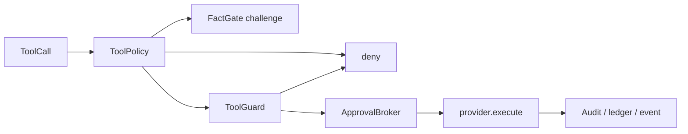

# 04g · Safety 安全与审批

> **已归档 —— 不是当前事实。**
> 本文已被 [23 · 工具与安全体系](../23-工具与安全体系.md) 取代；两者冲突时以那一篇和源码为准。
> 保留在此仅供追溯当时的设计取舍，不再随代码更新。


## 本章结论

`engine/safety/` 将模型的工具意图转换成不可旁路的主机能力决策。策略可以挑战或请求补充证据，`ToolGuard` 必须在任何执行之前强制检查；审批按 `run_id` 和 scope 绑定，不能变成会话级永久授权。

## 总体架构



## 目录与职责

| 文件 | 解决的问题 | 核心对象 |
| --- | --- | --- |
| `tool_policy.py` | 聚合 allow/deny/challenge 的策略流程 | `ToolPolicy`、`ToolPolicyDecision` |
| `tool_guard.py` | 路径、命令、凭据、白名单、审计强制边界 | `ToolGuard`、`FileGuard`、`SessionWhitelist`、`AuditLog` |
| `approval.py` | 请求、展示、等待和原子提交审批 | `ApprovalBroker`、`ApprovalScope` |
| `fact_gate.py` | 对高风险或缺证据动作发起可重试挑战 | `FactGate`、`FactGateContext` |
| `risk.py` | 以风险等级决定审批呈现和强度 | `RiskTier` |
| `eval_guard.py` | 识别需进入评测安全处理的输入 | `detect_eval_sensitive()` |

## 设计说明

### 硬 guard 必须先于软挑战

`FactGate` 可以要求模型先读取文件、核实状态或重做分析，因此它是可重试的软控制。`ToolGuard` 是路径、凭据、命令与白名单的硬边界，必须在所有 provider 执行前生效。顺序错误会让“再试一次”成为绕过安全的通道。

### 审批是一次性的、原子性的能力租约

`ApprovalBroker` 用 `ApprovalScope` 绑定 run、工具与目标范围；提交审批时需原子解析，避免 TOCTOU 窗口。审批展示对参数做递归脱敏，不能把 secret 原文复制到“请确认”的 UI。

### 文件保护检查对象身份，不只检查路径文字

`FileGuard` 处理规范化路径、Git 目录、运行时凭据和 hard-link 场景。仅禁止 `.env` 这种文件名不足以防止另一条路径指向同一敏感 inode；命令参数和 shell 写路径也需要同一保护模型。

## 调用链

```text
ReAct / SkillChain → ToolPolicy.evaluate
policy allow → ToolGuard.check → ApprovalBroker.request/resolve → execute
policy challenge → model receives recovery prompt → new ToolCall
policy deny or guard deny → blocked event + audit/ledger → no execution
```

## 失败语义与验证

- deny、过期审批、run/scope 不匹配、敏感路径、凭据暴露、禁止命令均不得执行 provider。
- hook 在审批后阻断时仍需释放/关闭该次审批，避免错误复用。
- 审计摘要、trace 与 approval 展示都必须脱敏；审计链用于发现记录被替换或降级。
- 安全修改应覆盖并发审批、取消、符号链接/hard link、命令拼接与直接 provider 调用的回归测试。

## 自测题

1. 为什么用户批准后仍不能跳过 `ToolGuard`？
2. FactGate 与 ApprovalBroker 分别解决什么不同问题？
