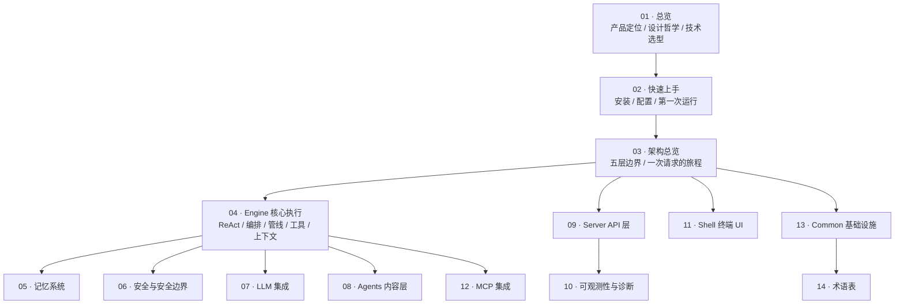

# Agent-Smith 设计文档（Wiki）

> **已归档 —— 不是当前事实。**
> 本文已被 [docs/README](../README.md) 取代；两者冲突时以那一篇和源码为准。
> 裁决依据：wiki 整套已按主题拆分并入新结构，这份索引不再对应任何目录。
> 保留在此仅供追溯当时的设计取舍，不再随代码更新。

> **定位**：这一套文档回答"Agent-Smith 是怎么设计出来的"——每个子系统的技术选型、架构分层、关键参数、以及每一处非显然决策背后的取舍。
> **适合**：想理解一个本地优先单 Agent 工作台如何落地的工程师；想改这个代码库的贡献者；想抄这套设计的人。

## 这套文档和 `docs/` 下其它文档的关系

`docs/` 根目录下的 `00`–`11` 是更早的一版文档，**没有随重构同步**（`CLAUDE.md` 明确写了这一点）。本目录 `docs/wiki/` 是按 [deepwiki 分类](https://deepwiki.com/zyt2000123/smith) 重写的一版，**全部以源码为准**：每一条断言尽量给出文件路径与行为依据，凡是代码里找不到的机制一律标注为"未实现"。

两者冲突时以本目录为准；本目录与代码冲突时以代码为准。

## 阅读顺序

## 文档清单

| # | 文档 | 覆盖内容 | 对应 deepwiki 分类 |
|---|------|---------|-------------------|
| 01 | [总览](wiki-01-总览.md) | 产品定位、设计哲学、五层架构速览、技术选型与理由、数据落盘全景、非目标 | 1 Overview |
| 02 | [快速上手](../guide/02-快速上手.md) | 依赖、安装、配置全参数、第一次运行、斜杠命令、常见故障 | 2 Getting Started |
| 03 | [架构总览](wiki-03-架构总览.md) | 层边界与依赖规则、一次请求的完整时序、跨层数据契约 | 3 Architecture Overview |
| 04 | [Engine 核心执行](wiki-04-Engine-核心执行.md) | ReAct 循环、运行生命周期、Pipeline 与技能链、工具注册与执行、上下文装配与压缩 | 4 Engine: Core Execution |
| 05 | [记忆系统](wiki-05-记忆系统.md) | 两视图模型、变更集编译管线、三道裁决守卫、Dream 维护周期、游标与预算 | 5 Memory System |
| 06 | [安全与安全边界](wiki-06-安全与安全边界.md) | ToolGuard、审批工作流、沙箱执行、审计哈希链、事实门 | 6 Safety and Security |
| 07 | [LLM 集成](../subsystems/25-LLM集成.md) | 五层配置合并、用途路由、Provider 适配器、流式协议、重试与录制回放 | 7 LLM Integration |
| 08 | [Agents 内容层](wiki-08-Agents-内容层.md) | 身份与路由、内建技能、内建工具、门禁/条件/钩子 | 8 Agents Content Layer |
| 09 | [Server API 层](../layers/43-Server.md) | 会话与运行管理、自动任务与调度器、Agent 档案与配置 API、34 个端点 | 9 Server API Layer |
| 10 | [可观测性与诊断](../subsystems/27-可观测性.md) | 事件模型、trace/summary 存储、事故检测、健康度、诊断与改进建议、Token 统计 | 9.2 Observability |
| 11 | [Shell 终端 UI](../layers/44-Shell.md) | 状态管理与事件处理、组件与渲染、服务端生命周期与 API 客户端 | 10 Shell Terminal UI |
| 12 | [MCP 集成](../subsystems/26-MCP集成.md) | 协议实现、传输层、会话池、工具命名与截断 | 11 MCP Integration |
| 13 | [Common 基础设施](../layers/40-Common.md) | 路径根、SQLite、YAML 合并、审计哈希链 | 12 Common Infrastructure |
| 14 | [术语表](../architecture/12-术语表.md) | 全部专有名词的定义与代码锚点 | 13 Glossary |

## 写作约定

- **中文正文，标识符原样保留**。`ReAct`、`SkillChain`、`ToolGuard` 这类代码里的名字不翻译。
- **图一律用 mermaid**，不用 ASCII 画框。
- **每个断言给锚点**。形如 `engine/execution/react/react_loop.py:412`，方便直接跳过去核对。
- **区分"是什么"与"为什么"**。表格讲是什么，正文讲为什么这么选、代价是什么。
- **未实现的东西显式标注**。产品意图与既有行为分开写，避免读者把路线图当成能力。
