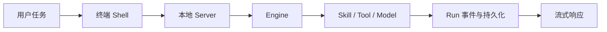

# 01 · 产品设计与定位

## 本章结论

Smith 是一个 local-first、terminal-native 的单 Agent 工作台：它把终端输入、可控执行、工具副作用、流式展示和可恢复 Run 串成一条本地工作流。本文只描述当前能力，不将多 Agent、团队协作或桌面应用写成现有功能。

## 总体架构

## 核心概念：产品一句话

Smith 在用户当前项目目录中提供一条可恢复、可审计、带审批边界的 Agent 工作流：终端负责交互，FastAPI 负责本地服务，Engine 负责路由、工具、模型调用、记忆和执行生命周期。

它不是“聊天窗口外加几个命令”，而是把一次任务从输入、执行、工具副作用、流式展示到可恢复 Run 的状态串起来。

## 面向谁

主要面向愿意在终端完成知识工作与软件开发任务的个人用户。当前最完整的路径是代码理解、规划、架构、实施和验证；同时保留通用问答、文件操作、网络检索、PDF 读取和 Git 操作能力。

## 已实现的产品支柱

| 支柱 | 用户可见结果 | 运行时支撑 |
| --- | --- | --- |
| 终端交互 | `smith` 命令、会话、命令面板、流式转录和结构化 Markdown | `shell/` 的 Ink/React 客户端 |
| 可控执行 | 工具先经过策略、文件边界与按请求审批；Run 可以恢复 | `engine/safety/`、`engine/execution/` |
| 声明式工作流 | 匹配到 coding 身份时执行可检查的 skill chain；也可显式选择技能 | `agents/identities/`、`agents/pipelines/`、`engine/skill/` |
| 本地持续性 | 会话、运行状态、可观测性投影、token 统计和记忆在重启后保留 | SQLite、`~/.agent-smith/agent/` |
| 可替换模型 | OpenAI-compatible 与 Anthropic 两种协议接入，可按 interactive/gate/background 路由 | `engine/llm/` |

## Agent 模型

系统只有一个 Smith 运行实体。`agents/identities/*.yaml` 定义的是“本次任务使用哪种能力档案”，可改变提示词、允许的工具/技能集合和路由到的 pipeline；它不会启动第二个 Agent，也不会建立团队消息总线。

目前有两个 shipped identity：

- `smith`：默认本地工作流身份，Git 类请求可直接进入 ReAct；
- `coding`：编码能力域身份，按意图把请求路由到三条 skill chain——需求调研
  （`grilling → research → ecc-plan`）、TDD 开发（`diagnosing-bugs → tdd-workflow → verification-loop`）
  与代码评审（`code-review → verification-loop`）。普通编码、修复与重构请求不命中关键词，
  留在直接 ReAct。

这条设计选择的目的，是先把单条运行链路的权限、恢复、事件和交付语义做完整，再评估是否值得引入调度成本。这个评估已经做过一轮：2026-08-28 落地了**临时子 Agent 委派**——一次隔离的 ReAct 对话，跑完只回摘要，无记忆、无 session、无 profile 记录（见 [24 · 子 Agent 委派系统](../subsystems/24-子Agent委派.md)）。它省的是父对话的上下文预算，**没有**引入第二个常驻 Agent，也没有引入路由。

## 核心使用场景

1. **可验证的软件变更**：用户要求修 bug、重构或实现功能。系统按意图匹配进入编码 skill chain 或直接 ReAct，组织阶段产出，并在需要工具副作用时请求审批。
2. **项目持续协作**：用户通过 `SMITH.md` 提供全局或项目规则；会话和三层记忆视图让已验证的偏好、近期工作和项目决定可以复用。
3. **本地知识工作**：通过文件、PDF、网络与 MCP 工具收集证据，再把结果以流式终端输出；外部工具的结果不拥有额外权限。

## 当前边界

| 范围 | 当前选择 |
| --- | --- |
| 客户端 | Ink/React Shell |
| 协作 | 单用户、本地 server；没有 team API、圆桌会议，也没有第二个常驻 Agent。可把范围明确的工作委派给**临时子 Agent**（隔离执行、只回摘要、无记忆），见 [24](../subsystems/24-子Agent委派.md)。 |
| 扩展 | 本地 tool provider、SKILL.md、声明式 identity/pipeline、MCP client；没有 plugin marketplace 或 webhook 插件 API。 |
| 知识库 | 可经 MCP 接入外部能力；没有内建 RAG/向量库和知识库管理 API。 |
| 安全 | 面向本机可信用户环境的审批、路径/命令规则和本地 token；不是多租户或企业级隔离平台。 |

## 不变的产品原则

- **先事实，后表达**：UI 文案不能替代 Engine 的真实状态与安全决定。
- **副作用可见**：文件写入、shell 和其他受控能力应经过统一策略与必要审批。
- **当前实现优先**：功能说明必须能落到源码和测试；调研资料不等于功能承诺。
- **进化不破坏主链**：新 identity、skill、MCP 或研究能力不得绕开现有 Run、ToolGuard、审批与记忆准入。

更细的架构和执行链路见[系统架构](../architecture/10-系统架构.md)。
