# 13 · Common 基础设施

> **定位**：`common/` 1.3k 行，五个文件——路径根、YAML 读写与合并、SQLite 连接、审计哈希链、惰性配置。**零业务逻辑。**
> **适合**：想知道"基础设施层到底该放什么"的人；要改路径或数据库连接的人。

这一层只有五个文件、两个依赖（`pyyaml` + `aiosqlite`）。**依赖数量就是边界纪律的度量**——一个基础设施层如果开始长依赖，说明它在偷偷做业务。

---

## 1. 五个文件

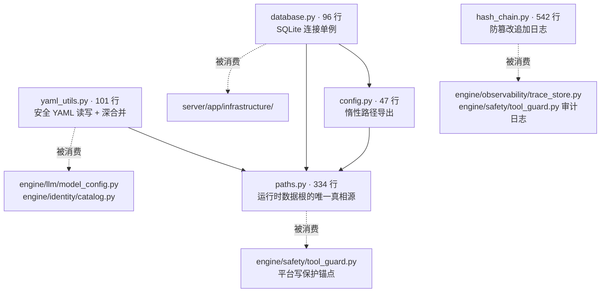

| 文件 | 行数 | 职责 |
|---|---|---|
| `hash_chain.py` | 542 | 防篡改追加日志（见 [06 · 安全与安全边界](../subsystems/23-工具与安全.md) §10） |
| `paths.py` | 334 | 路径根、权限强制、内建技能镜像 |
| `yaml_utils.py` | 101 | 安全读写 + 深合并 |
| `database.py` | 96 | 连接单例 + 健康检查 |
| `config.py` | 47 | 惰性单例与遗留导出 |

---

## 2. `paths.py`：不只是拼路径

完整讨论见 [01 · 总览](../guide/01-产品定位.md) §3.1 和 [02 · 快速上手](../guide/02-快速上手.md) §15。这里补齐路径属性表和几个未讲的实现。

### 2.1 全部路径属性

```python
@dataclass(frozen=True)
class AppPaths:
    data_dir: Path        # ~/.agent-smith
    project_root: Path    # 仓库根
```

| 属性 | 值 |
|---|---|
| `agent_dir` | `data_dir / "agent"` |
| `sqlite_path` | `data_dir / "sqlite" / "agent-smith.sqlite"` |
| `builtin_skills_dir` | `data_dir / "builtin" / "skills"` |
| `smith_profile_dir` | `project_root / "agents" / "smith"` |
| `builtin_tools_dir` | `project_root / "agents" / "tools"` |
| `builtin_identities_dir` | `project_root / "agents" / "identities"` |
| `safety_rules_path` | `project_root / "agents" / "safety" / "dangerous_commands.json"` |
| `bundled_skills_dir` | **安装位优先，源码树兜底** |

### 2.2 `bundled_skills_dir` 的双路径

```python
@property
def bundled_skills_dir(self) -> Path:
    """Skill assets shipped with Smith, with a source-tree fallback for development."""
    installed = Path(sysconfig.get_path("data")) / "agent_smith_common" / "builtin_skills"
    if installed.is_dir():
        return installed
    return self.project_root / "agents" / "skills"
```

wheel 安装后技能在 `sysconfig` 的 data 目录（由 `common/pyproject.toml` 的 `[tool.setuptools.data-files]` 放置）；开发时回落到源码树。

**同一个属性在两种部署形态下指向不同位置**，调用方无感知。

### 2.3 项目根发现：三级回落 + 签名校验

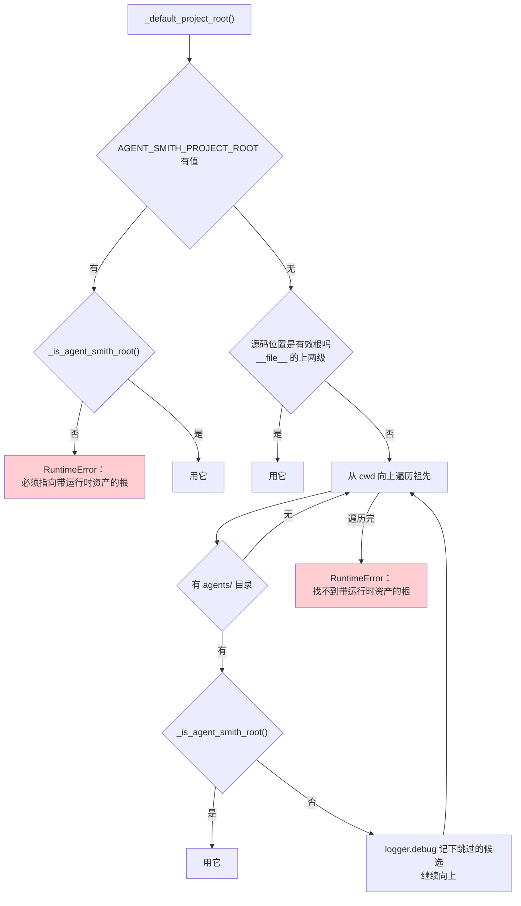

**签名校验**：

```python
def _is_agent_smith_root(project_root: Path) -> bool:
    agents_dir = project_root / "agents"
    return (
        (agents_dir / "smith" / "config.yaml").is_file()
        and (agents_dir / "identities" / "smith.yaml").is_file()
        and any((agents_dir / "skills").glob("*/SKILL.md"))
    )
```

三个条件缺一不可。注释说明了为什么不能只看 `agents/` 存不存在：

> Stricter validation: check for Agent-Smith signature files **to avoid mistaking another project's agents/ directory**.

而且跳过的候选会打 `logger.debug`：

> Log skipped candidates to make root-discovery mismatches diagnosable.

**"我在 X 目录跑，为什么根被认成了 Y"** 这类问题，没有这行日志就只能靠猜。

### 2.4 受管路径的四个辅助函数

| 函数 | 作用 |
|---|---|
| `_ensure_real_path()` | 逐段拒绝软链 |
| `_ensure_real_descendant()` | 拒绝逃出受管根的路径 + 逐段拒绝软链 |
| `_ensure_managed_directory()` | 建私有目录树，**替换冲突的普通文件** |
| `_prepare_managed_file()` | 保证文件的父目录是真实受管目录，且目标不是别的类型 |
| `_remove_managed_path()` | 删除时不跟随最终软链 |

`_remove_managed_path()` 的注释解释了一个微妙之处：

```python
# A stale leaf symlink is safe to unlink: unlink() removes the link itself
# and cannot touch its target.  Its parents must still be real managed
# directories, otherwise a path such as ``target/link/stale`` could escape
# the managed tree.
```

**叶子软链可以直接 `unlink()`**（只删链接不碰目标），但**它的父级必须都是真实受管目录**——否则 `target/link/stale` 这样的路径能逃出受管树。

### 2.5 内建技能的增量镜像

`_install_builtin_skills()` 是 `paths.py` 里最长的函数（100 行）。它维护一份 `.manifest.json`：

```json
{
  "skills": ["grilling", "research", ...],
  "files": {
    "grilling/SKILL.md": {
      "source": {"mtime_ns": ..., "size": ..., "sha256": "..."},
      "target": {"mtime_ns": ..., "size": ...}
    }
  }
}
```

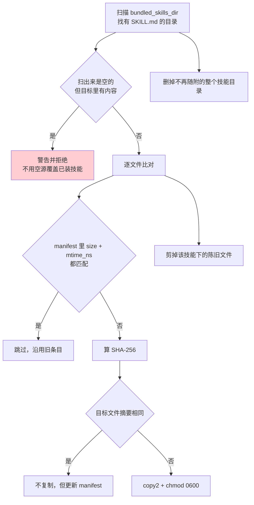

**三级判定**：先比元数据（便宜），元数据不符再比摘要（贵），摘要也不同才复制。

**空源防呆**很重要：

```python
if not shipped and any(child.is_dir() for child in target.iterdir()):
    logger.warning("refusing to replace installed builtin skills with an empty source: %s", source)
    return
```

一次路径解析错误（比如 `bundled_skills_dir` 指到了空目录）会把用户已装的技能全删掉。这条检查把它变成一条警告。

**陈旧文件剪除按路径深度倒序**：

```python
stale_paths = sorted(..., key=lambda path: len(path.parts), reverse=True)
```

先删深层再删浅层，否则删父目录时子文件还在。

---

### 2.6 符号链接防护：四个函数挡住的三种逃逸

§2.4 介绍了四个辅助函数各自做什么，这里换成攻击者视角看它们**一起**挡住了什么。

威胁模型很具体：`~/.agent-smith/` 下的受管目录会被程序自动创建、覆盖、删除。如果攻击者能在这棵树里放一个符号链接指向树外，就能让 Smith 用**自己的权限**去写或删任意文件。

**逃逸方式一：末段符号链接。**

```
~/.agent-smith/builtin/skills/evil  →  /etc/cron.d/
```

程序要往 `builtin/skills/evil/SKILL.md` 写文件，跟随链接后实际写到了 `/etc/cron.d/SKILL.md`。

**逃逸方式二：中间段符号链接。**

```
~/.agent-smith/builtin  →  /tmp/attacker/
```

这次链接不在末端，而在路径中间。只检查最后一段的实现会完全看不见它。`_ensure_real_path` 因此**逐段检查**：

```python
current = Path(absolute_path.anchor)
for part in absolute_path.parts[1:]:
    current /= part
    if current.is_symlink():
        raise RuntimeError(f"Refusing to use symlinked {label}: {current}")
```

从根开始一段段拼，每拼一段查一次。这比 `path.resolve()` 之后比较前缀更严格——`resolve()` 会跟随链接得到真实路径，而这里是**发现链接就拒绝**，根本不去解析它指向哪。

**逃逸方式三：删除时的父目录替换。**

`_remove_managed_path` 的注释描述的正是这个：

```python
# A stale leaf symlink is safe to unlink: unlink() removes the link itself
# and cannot touch its target.  Its parents must still be real managed
# directories, otherwise a path such as ``target/link/stale`` could escape
# the managed tree.
```

这里有个微妙的不对称：

| 位置 | 是符号链接时 | 为什么 |
|---|---|---|
| **末段** | **允许**，直接 `unlink()` | `unlink()` 删的是链接本身，**碰不到目标**。清理一个陈旧的符号链接是正常操作 |
| **父目录任一段** | **拒绝** | `target/link/stale` 里的 `link` 若指向树外，删 `stale` 就删到了树外的文件 |

所以代码先校验 `path.parent`，再判断 `path` 本身是不是链接：

```python
_ensure_real_descendant(root, path.parent)   # 父目录必须全是真的
if path.is_symlink():
    path.unlink(missing_ok=True)             # 末段是链接：安全删除
    return
_ensure_real_descendant(root, path)          # 不是链接：再全路径校验一次
```

**第四道：路径逃出根。**

`_ensure_real_descendant` 还挡住一种不涉及符号链接的逃逸——用 `..` 拼出树外路径：

```python
try:
    parts = path.relative_to(root).parts
except ValueError as exc:
    raise RuntimeError(f"Managed path escapes its root: {path}") from exc
```

`Path.relative_to()` 在目标不在 root 之下时抛 `ValueError`，这里把它转成明确的拒绝。用标准库的语义做边界检查，比自己写字符串前缀比较可靠——后者容易被 `/root-evil/` 这种前缀相同但目录不同的路径骗过。

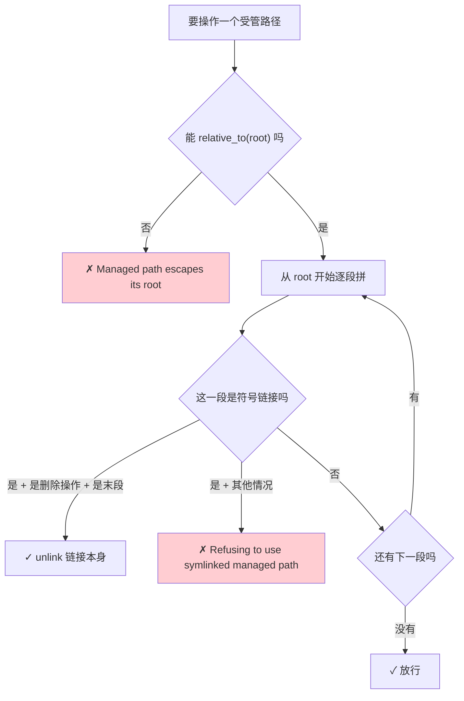

**为什么创建目录时也要逐段校验。** `_ensure_managed_directory` 在**每创建一段之前**都调一次 `_ensure_real_descendant`：

```python
for part in parts:
    current /= part
    _ensure_real_descendant(root, current)      # 每段都查
    if current.exists() and not current.is_dir():
        _remove_managed_path(root, current)     # 类型冲突：删掉重建
    current.mkdir(exist_ok=True, mode=PRIVATE_DIR_MODE)
    current.chmod(PRIVATE_DIR_MODE)
```

一次性校验完整路径再逐段创建是不够的——检查和使用之间存在时间窗（TOCTOU），攻击者可以在两者之间插入链接。逐段"检查后立即创建"把这个窗口压到最小。同时每段都显式 `chmod(0o700)`，因为 `mkdir(mode=...)` 同样受 umask 影响，和 §6.11 是同一个坑。

`if current.exists() and not current.is_dir()` 处理的是另一种情况：路径上某一段被替换成了普通文件。直接 `mkdir` 会失败，所以先删掉冲突项——而删除本身又走 `_remove_managed_path`，再过一遍全部检查。

### 2.7 项目根发现的三级回落

`_default_project_root()` 按三个来源依次尝试，**任何一级都要通过签名校验**：

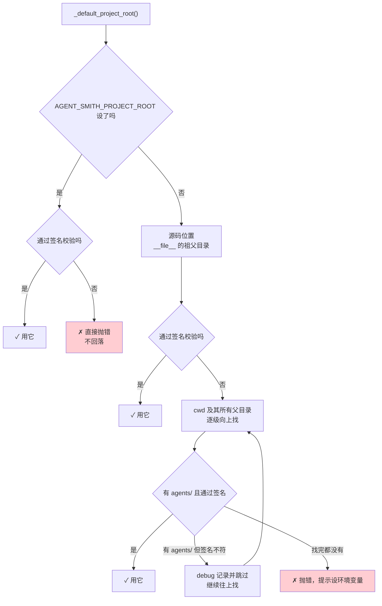

**显式配置错了不回落**，这是关键取舍：

```python
if configured_root:
    project_root = Path(configured_root).expanduser().resolve()
    if not _is_agent_smith_root(project_root):
        raise RuntimeError(f"{PROJECT_ROOT_ENV} must point to an Agent-Smith root ...")
    return project_root
```

用户明确设了 `AGENT_SMITH_PROJECT_ROOT` 却指错了地方，静默回落到别处会更糟——程序看起来正常工作，但读的是用户没预期的那套资产。直接报错让问题立刻暴露。

**签名是三个具体文件**：

```python
def _is_agent_smith_root(project_root: Path) -> bool:
    agents_dir = project_root / "agents"
    return (
        (agents_dir / "smith" / "config.yaml").is_file()
        and (agents_dir / "identities" / "smith.yaml").is_file()
        and any((agents_dir / "skills").glob("*/SKILL.md"))
    )
```

只看有没有 `agents/` 目录是不够的——别的项目也可能有同名目录。三个签名文件缺一不可，其中第三条 `glob("*/SKILL.md")` 和整个项目对"什么算一个 skill"的判定标准一致（见 `CLAUDE.md`：技能必须在自己目录下有顶层 `SKILL.md`）。**同一个判据在计数、发现、校验三处复用**，不会出现"这里算 24 个那里算 16 个"的分歧。

向上搜索时被跳过的候选会记 debug 日志：

```python
logger.debug("Skipping %s: has agents/ but missing Agent-Smith markers", candidate)
```

注释说明了理由："make root-discovery mismatches diagnosable"。用户在一个有 `agents/` 目录的无关项目里跑 Smith 时，能从日志看到"我确实看到了这个目录，但它不像 Agent-Smith 的根"，而不是只得到一句笼统的"找不到项目根"。

---

## 3. `yaml_utils.py`：101 行里的四个安全决定

### 3.1 读：拒绝非 mapping 根

```python
def load_yaml(path) -> dict[str, Any]:
    if not p.is_file():
        return {}                      # 文件不存在 → 空 dict，不抛
    data = yaml.safe_load(f)           # safe_load，不是 load
    if data is None:
        return {}                      # 空文件 → 空 dict
    if not isinstance(data, dict):
        raise YamlConfigError(f"YAML root in {p} must be a mapping")
```

四个分支各有语义：**不存在 → 空**、**空文件 → 空**、**非 mapping → 报错**、**语法错 → 报错**。

用 `yaml.safe_load` 而不是 `yaml.load`——后者能构造任意 Python 对象。

### 3.2 写：原子 + fsync + 私有权限

```python
fd, temp_name = tempfile.mkstemp(dir=p.parent, prefix=f".{p.name}.", suffix=".tmp", text=True)
with os.fdopen(fd, "w", encoding="utf-8") as f:
    f.write(content)
    f.flush()
    os.fsync(f.fileno())      # 落盘
os.chmod(temp_path, PRIVATE_FILE_MODE)   # 0600，在 replace 之前
os.replace(temp_path, p)                 # 原子替换
```

四个细节：

1. **临时文件建在同一个目录**（`dir=p.parent`）——跨文件系统的 `os.replace` 不是原子的
2. **`fsync` 之后才替换**——否则崩溃可能留下一个内容为空的新文件
3. **`chmod` 在 `replace` 之前**——否则存在一个窗口，文件已就位但权限还是 `mkstemp` 的默认值
4. **失败时清理临时文件**（`except BaseException` + `unlink`）

写之前还会检查路径软链（`_ensure_real_path`）和父目录（`_ensure_private_parent`）。

`_ensure_private_parent()` 有一个先收集再创建的写法：

```python
missing: list[Path] = []
current = path
while not current.exists():
    missing.append(current)
    current = current.parent
...
for directory in reversed(missing):
    directory.mkdir(mode=PRIVATE_DIR_MODE)
    directory.chmod(PRIVATE_DIR_MODE)
```

**先向上找到第一个存在的祖先，再自顶向下逐级创建并 chmod**。用 `mkdir(parents=True)` 做不到这一点——中间层级的权限不受控。

`FileExistsError` 分支处理竞态：另一个进程刚建了这个目录，要重新确认它不是软链、且确实是目录。

### 3.3 `merge_configs`：`None` 不覆盖

```python
def merge_configs(*configs: dict[str, Any]) -> dict[str, Any]:
    """Deep merge dicts. Later overrides earlier."""
    for cfg in configs:
        for key, value in cfg.items():
            if value is None:
                continue                          # ← 这一行是全部语义
            if key in result and isinstance(result[key], dict) and isinstance(value, dict):
                result[key] = merge_configs(result[key], value)
            else:
                result[key] = value
```

**`None` 表示"我不表态"，不是"清空"。** 这一行是五层 LLM 配置合并（见 [02 · 快速上手](../guide/02-快速上手.md) §3.2 坑 2）的全部机制。

`agents/smith/config.yaml` 里的 `model: null` 因此不会覆盖下层——这是**刻意的默认值**，让种子层可以留空而不破坏平台层的配置。

深合并只对**两边都是 dict** 的键递归，其余直接覆盖。所以 `llm.routes` 会合并，但一个列表字段会被整体替换。

---

## 4. `database.py`：96 行的连接单例

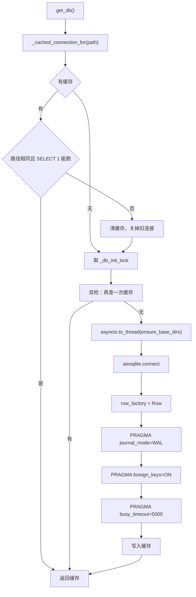

### 4.1 两把锁，各管一件事

```python
_db_lock = asyncio.Lock()        # 保护 _db / _db_path 这两个变量
_db_init_lock = asyncio.Lock()   # 保护"初始化"这个动作
```

注释解释了为什么要分开：

```python
# Directory setup hashes and copies files.  It is synchronous by design,
# so run it in a worker and keep the database-state lock available.
async with _db_init_lock:
    ...
    await asyncio.to_thread(paths.ensure_base_dirs)
```

`ensure_base_dirs()` 会做 SHA-256 和文件复制（内建技能镜像），耗时可观。如果它拿着"数据库状态锁"，所有想读缓存的协程都会被阻塞。所以：**初始化锁保护慢操作，状态锁只保护变量读写**。

而且初始化锁内部有**双重检查**——等锁期间另一个协程可能已经建好了连接。

### 4.2 缓存连接的健康检查

```python
async def _check_connection_health(conn) -> bool:
    try:
        cursor = await conn.execute("SELECT 1")
        await cursor.close()
    except (sqlite3.Error, ValueError):
        return False
    return True
```

**一个缓存的连接可能已经死了**（进程被 fork、底层文件被删、连接被别处关闭）。每次取缓存都跑一次 `SELECT 1`，代价近乎为零。

捕获 `ValueError` 是因为 aiosqlite 在连接已关闭时抛的是这个。

### 4.3 三个 PRAGMA

| PRAGMA | 值 | 理由 |
|---|---|---|
| `journal_mode` | `WAL` | 读写不互相阻塞 |
| `foreign_keys` | `ON` | SQLite **默认关闭**外键约束；不显式打开，`ON DELETE CASCADE` 就是摆设 |
| `busy_timeout` | `5000` ms | 注释：等一个并发写者（server 与 CLI 共享这个文件）而不是立刻报 `database is locked` |

第二条是 SQLite 最经典的坑：schema 里写了 `REFERENCES ... ON DELETE CASCADE`，不开 PRAGMA 就完全不生效，删会话不会删消息。

### 4.4 连接失败要关掉半成品

```python
db = await aiosqlite.connect(str(sqlite_path))
try:
    ...三个 PRAGMA...
except BaseException:
    await db.close()      # PRAGMA 失败时连接已经建好了，必须关
    raise
```

---

### 4.5 双重检查锁定

`get_db()` 的结构是经典的 double-checked locking，但在 asyncio 里写法不同：

```python
cached = await _cached_connection_for(sqlite_path)     # ① 快路径，无 init 锁
if cached is not None:
    return cached

async with _db_init_lock:                              # ② 慢路径，拿初始化锁
    cached = await _cached_connection_for(sqlite_path)  # ③ 拿到锁后再查一次
    if cached is not None:
        return cached
    ...真正建立连接...
```

第③步的重查是必须的：并发的多个协程可能同时通过第①步的检查，然后在 `_db_init_lock` 前排队。第一个建好连接后，后面的拿到锁时缓存已经有了——不重查就会重复建立连接，把前一个泄漏掉。

这解释了对应的两个测试名：`get_db_initializes_once_for_concurrent_callers` 和 `get_app_db_runs_schema_setup_once_for_concurrent_callers`——"只跑一次"正是双重检查要保证的性质。

### 4.6 为什么 `_cached_connection_for` 在锁外关连接

```python
async with _db_lock:
    if _db is None:
        return None
    if _db_path == sqlite_path and await _check_connection_health(_db):
        return _db
    db_to_close = _db          # 记下来
    _db = None                 # 先摘掉
    _db_path = None

assert db_to_close is not None
with suppress(sqlite3.Error, ValueError):
    await db_to_close.close()  # ← 出了锁才关
```

`close()` 是 I/O 操作，可能慢，也可能抛异常。把它放在 `_db_lock` 之外，意味着**关闭旧连接的耗时不会阻塞其他协程读写连接状态**。锁内只做三件极快的事：判断、记录、置空。

这和 [12 · MCP 集成](../subsystems/26-MCP集成.md) §8.2 的锁设计是同一条纪律——**锁内绝不跨越 I/O**。

`with suppress(...)` 而不是 try/except：旧连接关不掉不影响任何事（它已经从缓存里摘掉了），静默忽略是对的。

### 4.7 探活为什么是 `SELECT 1`

```python
async def _check_connection_health(conn) -> bool:
    try:
        cursor = await conn.execute("SELECT 1")
        await cursor.close()
    except (sqlite3.Error, ValueError):
        return False
    return True
```

判断一个缓存的连接是否还能用，最可靠的方式是**真的执行一次查询**。检查 `conn.closed` 之类的标志不够——连接可能因为底层文件被删、事件循环被换、aiosqlite 的工作线程退出而失效，这些都不会更新任何标志位。

`SELECT 1` 不读表、不加锁、不产生 I/O，是代价最小的真实查询。测试名 `uses_a_lightweight_liveness_probe_for_cached_connections` 里的 "lightweight" 就是在钉住这一点：探活不能变成一次昂贵的检查，否则每次 `get_db()` 都要付出代价。

捕获 `ValueError` 是因为 aiosqlite 在连接已关闭时抛的是 `ValueError` 而非 `sqlite3.Error`——两个都要接。

### 4.8 建连失败要关掉半成品

```python
db = await aiosqlite.connect(str(sqlite_path))
try:
    db.row_factory = aiosqlite.Row
    await _execute_pragma(db, "PRAGMA journal_mode=WAL")
    await _execute_pragma(db, "PRAGMA foreign_keys=ON")
    await _execute_pragma(db, "PRAGMA busy_timeout=5000")
except BaseException:
    await db.close()
    raise
```

连接已经建立、但 PRAGMA 没设完就失败——这时连接**必须关掉**。不关的话，aiosqlite 的后台线程会一直挂着，而没有任何变量引用它，成为一个既不可用也不可回收的泄漏。

`except BaseException` 覆盖 `CancelledError`：请求在设 PRAGMA 期间被取消同样要清理。这和 [12 · MCP 集成](../subsystems/26-MCP集成.md) §11.1 握手失败清理是完全一样的模式。

### 4.9 `close_db()` 的锁顺序

```python
async with _db_init_lock:        # 外层
    async with _db_lock:         # 内层
        ...摘掉引用...
    await db.close()             # 出内层锁才关
```

获取顺序是 `_db_init_lock` → `_db_lock`，和 `get_db()` 里一致（`get_db` 先拿 init 锁，再在内部拿 `_db_lock`）。**两处锁顺序相同**是避免死锁的基本要求——如果 `close_db` 反过来先拿 `_db_lock` 再拿 `_db_init_lock`，两个协程分别持有一把等另一把就会死锁。

拿 `_db_init_lock` 的作用是让关闭和"正在建立连接"互斥：否则可能刚关掉连接，一个还在初始化流程里的协程立刻又把新连接塞回缓存，导致关闭无效。

---

## 5. `config.py`：惰性单例的两个理由

47 行，全部是为了"路径实例什么时候创建"。

### 5.1 为什么惰性

```python
def _get_paths() -> AppPaths:
    """Lazy initialization: allows runtime environment changes before first access."""
```

`AppPaths.defaults()` 会读 `AGENT_SMITH_PROJECT_ROOT` 环境变量并做项目根发现。如果在 import 时就执行，**测试没法在导入之后再设环境变量**。

### 5.2 `__getattr__` 做遗留导出

```python
def __getattr__(name: str):
    paths = _get_paths()
    mapping = {"DATA_DIR": paths.data_dir, "AGENT_DIR": paths.agent_dir, ...}
```

模块级 `__getattr__`（PEP 562）让 `common.config.DATA_DIR` 这类老写法继续工作，**同时保持惰性**——一个模块级常量赋值会在 import 时求值，而 `__getattr__` 是访问时求值。

### 5.3 `reset_paths()` 的一条重要警告

```python
"""Replace the lazy path instance for tests or runtime reconfiguration.

Later ``config.PATHS`` lookups observe the replacement.  A value imported
with ``from common.config import PATHS`` is an ordinary Python snapshot and
intentionally keeps the instance that was bound at import time."""
```

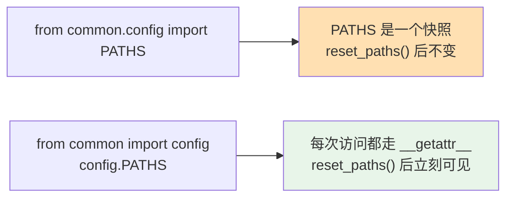

**两种 import 写法行为不同**，而且这是 Python 的固有语义不是 bug。文档把它写下来，是因为测试里 monkeypatch 路径时踩这个坑会非常困惑——你以为换了路径，但某个模块在 import 时就把旧的绑住了。

实践中有一条相关教训：一个 service 的 `_config_path` 是**类属性**，环境变量隔离对它无效，必须 monkeypatch，否则测试会改到真实的 `~/.agent-smith/config.yaml`。**同一类问题的另一个表现形式。**

---

### 5.4 九个遗留导出的映射表

`__getattr__` 里那张表是全部的兼容面：

| 遗留常量 | 现在的来源 |
|---|---|
| `DATA_DIR` | `paths.data_dir` |
| `AGENT_DIR` | `paths.agent_dir` |
| `SQLITE_PATH` | `paths.sqlite_path` |
| `SMITH_PROFILE_DIR` | `paths.smith_profile_dir` |
| `BUILTIN_SKILLS_DIR` | `paths.builtin_skills_dir` |
| `BUILTIN_TOOLS_DIR` | `paths.builtin_tools_dir` |
| `BUILTIN_IDENTITIES_DIR` | `paths.builtin_identities_dir` |
| `SAFETY_RULES_PATH` | `paths.safety_rules_path` |
| `PATHS` | `paths` 本身 |

映射表**每次访问都重建**——看起来浪费，实际上是必要的：`_get_paths()` 返回的实例可能已被 `reset_paths()` 换掉，缓存这张表会让替换失效。九个 `Path` 对象的构造开销可以忽略，而路径访问本身也不在热路径上。

表外的名字抛标准的 `AttributeError`：

```python
raise AttributeError(f"module {__name__!r} has no attribute {name!r}")
```

这一行不能省。模块级 `__getattr__` 如果对未知名字返回 `None` 或静默失败，会破坏 Python 的正常语义——`hasattr()` 会永远返回 `True`，`from common.config import 拼错的名字` 不会报错而是拿到一个 `None`，问题被推迟到实际使用时才炸。

### 5.5 惰性的两个层次

这个模块里有两层惰性，容易混淆：

| 层次 | 机制 | 解决什么 |
|---|---|---|
| **实例惰性** | `_get_paths()` 首次访问才构造 `AppPaths` | 导入 `common.config` 时不去做项目根发现——那需要文件系统访问，且此时环境变量可能还没设好 |
| **属性惰性** | 模块级 `__getattr__` | 每次读 `common.config.DATA_DIR` 都走一遍当前实例，而不是导入时固化 |

只有第一层的话，`reset_paths()` 之后模块常量仍是旧值；只有第二层的话，导入模块就会触发项目根发现。两层都要。

`AppPaths.defaults()` 内部会调 `_default_project_root()`（见 §2.7），而后者可能**抛异常**——在一个不是 Agent-Smith 项目的目录里导入 `common.config` 不该炸掉导入。惰性把这个失败推迟到真正需要路径的时候，那时报错也更有上下文。

### 5.6 `reset_paths()` 的两个用途

```python
def reset_paths(paths: AppPaths | None = None) -> None:
    global _paths_instance
    _paths_instance = paths
```

一行赋值，两个场景：

- **测试**：传一个指向临时目录的 `AppPaths`，让测试不碰真实的 `~/.agent-smith`
- **运行时重配**：传 `None` 清空，下次访问重新走一遍发现流程

传 `None` 是"重置"而不是"设成空"——因为 `_get_paths()` 看到 `None` 会重新构造。这个双重语义让同一个函数既能注入也能清除。

docstring 里那句警告（§5.3 引用过）在这里有了完整背景：

> A value imported with `from common.config import PATHS` is an ordinary Python snapshot and **intentionally keeps** the instance that was bound at import time.

"intentionally" 这个词是关键——这不是缺陷而是 Python 的既定语义，文档只能把它说清楚，无法在代码里修掉。对应的测试 `config_module_access_observes_reset_paths_but_from_imports_are_snapshots` 把两种行为**同时**断言下来，防止有人为了"修复"快照问题而改坏惰性访问。

真正的防线在消费方：三个 `resolves_paths_when_it_runs` 测试（见 §10.5）确保关键模块都在运行时取路径。这是"用测试约束使用方式"而不是"用代码限制可能性"的例子——后者在 Python 里做不到，前者足够。

---

## 6. `hash_chain.py`

完整讨论见 [06 · 安全与安全边界](../subsystems/23-工具与安全.md) §10。这里只补参数表：

| 常量 | 值 |
|---|---|
| `CHAIN_VERSION` | 1 |
| `CHAIN_FILE_MODE` | `0o600` |
| `_PRIVATE_DIR_MODE` | `0o700` |

核心 API：

| 函数 / 方法 | 作用 |
|---|---|
| `canonical_json(value)` | 稳定序列化（哈希的前提） |
| `sha256_hex(text)` | 摘要 |
| `genesis_hash(namespace)` | 链的起点，按命名空间隔离 |
| `record_hash(record)` | 一条记录的哈希 |
| `HashChainLog.append(record, *, sync=False)` | 追加，**默认不 fsync** |
| `HashChainLog.seal()` | 封存锚点到 `<log>.head` |
| `HashChainLog.verify(anchor)` | 校验，返回 `ChainVerification` |
| `HashChainLog.unseal()` | 解封 |
| `verify_chain(...)` | 独立校验函数 |

两个消费方：

- `engine/observability/trace_store.py` —— 每次 run 一条链
- `engine/safety/tool_guard.py` —— 装机级审计日志（`~/.agent-smith/audit.jsonl`）

### 6.1 `append()` 的六个步骤

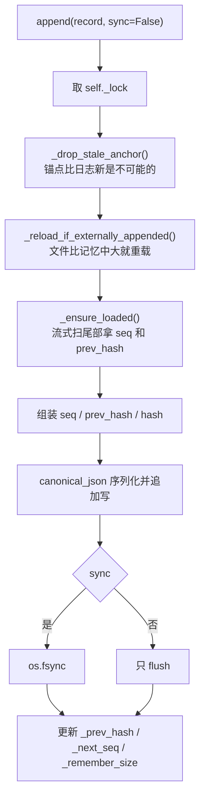

**两条写路径**：

```python
handle = self.ensure_handle()
if handle is not None:
    handle.write(...); handle.flush()
    if sync: os.fsync(handle.fileno())
else:
    fd = os.open(self.path, os.O_WRONLY | os.O_CREAT | os.O_APPEND, CHAIN_FILE_MODE)
    ...
    if created: self.path.chmod(CHAIN_FILE_MODE)
```

有长驻句柄时走句柄（高频场景，比如 trace），没有时走一次性 `os.open` + `O_APPEND`（低频场景，比如审计日志）。

**新建文件时额外 `chmod`**——`os.open` 的 mode 参数同样会被 umask 削弱，和 `paths.py` 的处理一致。

### 6.2 `legacy_linked` 标记

```python
if self._legacy_linked and self._next_seq == 1:
    chained["legacy_linked"] = True
```

一个**在哈希链机制引入之前就存在的日志**，第一条链式记录会带上这个标记。这样校验时能区分"链从这里开始"和"链断了"。

**兼容旧数据的正确做法是标注而不是假装**——把老日志当成没有前驱的新链，会让校验器无法判断中间是不是被删过。

### 6.3 `seal()` 的顺序：先 fsync 日志，再写锚点

```python
"""The log is fsynced first so every previously appended record (including
deferred-sync ones) is durable before the anchor names the head."""
```

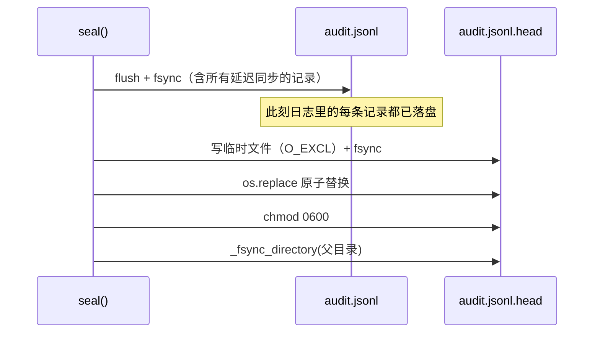

**如果先写锚点再 fsync 日志**，一次断电可能留下"锚点说链头是第 100 条，但日志里只有 87 条"——一个**看起来像被回滚**的正常状态，会在下次校验时误报。

而且没有句柄时也要 fsync（用 `O_RDONLY` 打开再 fsync），失败只记 warning 不抛——**封存尽力而为，但不能因为 fsync 失败就不写锚点**。

### 6.4 锚点写入的五重保险

```python
temp = self.anchor_path.with_name(f".{self.anchor_path.name}.{uuid4().hex}.tmp")
fd = os.open(temp, os.O_WRONLY | os.O_CREAT | os.O_EXCL, CHAIN_FILE_MODE)
... write + flush + fsync ...
os.replace(temp, self.anchor_path)
self.anchor_path.chmod(CHAIN_FILE_MODE)
_fsync_directory(self.anchor_path.parent)
```

| 措施 | 防什么 |
|---|---|
| 临时文件名带 `uuid4()` | 两个进程同时封存时不撞名 |
| `O_EXCL` | 临时文件必须是新建的，不复用别人的 |
| 写完 `fsync` | 内容落盘后再替换 |
| `os.replace` | 原子替换 |
| **`_fsync_directory(parent)`** | **目录项本身落盘** |

最后一条容易被漏掉：`os.replace` 改的是**目录项**，只 fsync 文件内容不保证这个改名操作本身持久。断电后可能出现"新文件内容在盘上但名字还是临时名"。

### 6.5 `_ensure_loaded()` 的流式尾扫描

docstring 里那条被测试固化的约束：

> `_ensure_loaded` 通过**逐行流式**扫描文件尾部；它**绝不能**调用 `Path.read_text`（`test_trace_store_recovers_sequence_without_reading_the_whole_file` 把它 monkeypatch 成抛异常）。

实现用 `collections.deque(maxlen=...)`——**只保留最后 N 行**，内存占用与文件大小无关。

一个跑了几个月的审计日志可能有几百 MB，`read_text()` 会把它整个读进内存，而恢复链状态只需要最后一条记录。

**有一个测试通过 monkeypatch 让 `read_text` 抛异常来固化这个约束**——这比注释可靠，因为注释不会在 CI 里失败。

---

### 6.6 `verify_chain()`：八种失败，报第一个

校验是单遍扫描，遇到第一个问题就返回，不继续往下看：

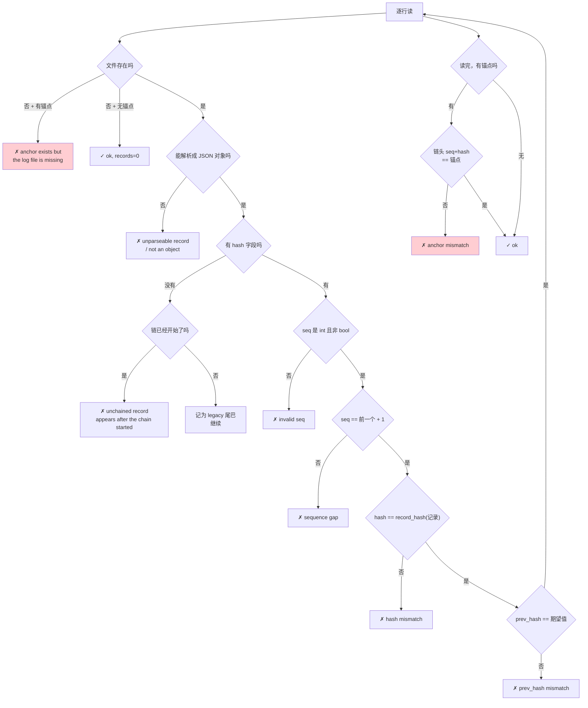

八种失败各自挡住一类改法：

| 失败 | 挡住的攻击 |
|---|---|
| `anchor exists but the log file is missing` | **删掉整个日志文件** |
| `unparseable record` / `not an object` | 写入垃圾数据 |
| `unchained record appears after the chain started` | 链中间插入无哈希记录 |
| `invalid seq` | 序号被改成非整数 |
| `sequence gap` | 删除、重排、重复记录 |
| `hash mismatch` | 修改记录内容 |
| `prev_hash mismatch` | 断开链接、伪造链首 |
| `anchor mismatch` | **封存后整体回滚** |

第一条和最后一条只有配合独立的 `.head` 锚点文件才能发现——这正是 `seal()` 存在的全部理由。哈希链本身能证明"这串记录内部自洽"，但证明不了"这串记录就是当初写下的那串"。把一个完整的、更早的历史版本整个换上去，链依然自洽；只有外部锚点记着"当时的链头是 seq=847 / hash=3f2a…"，才能识破。

失败时返回的 `records` 是**失败之前**的有效记录数（`index - 1`），所以调用方知道前多少条仍然可信。这比简单返回"校验失败"有用得多——被篡改的日志里，篡改点之前的部分通常仍是完好的证据。

### 6.7 `legacy_linked` 挡住的伪造攻击

§6.2 讲的是写入侧怎么打这个标记，真正的价值在校验侧。源码里那段注释描述了一个**如果不这样做就会存在**的攻击：

```python
# The first chained record must *declare* a preceding legacy
# tail before one is admitted.  Inferring it from the absence
# of a ``hash`` key is forgeable: ``record_hash`` excludes that
# key, so deleting it from record k turns k into a "legacy"
# record whose record_hash() is, by construction, exactly the
# prev_hash record k+1 already stores — letting any prefix be
# dropped and refilled.  The declaration itself is covered by
# the record's hash, so it cannot be added after the fact.
```

拆开看这个攻击：

**前提**：`record_hash(record)` 计算时**排除 `hash` 键本身**（否则无法自指）。

**攻击步骤**（假设不要求显式声明，而是"没有 hash 字段就当成 legacy"）：


关键在第 F 步：**k+1 存的 `prev_hash` 就是 k 的 `hash`，而 k 的 `hash` 按定义等于 `record_hash(k)`**。删掉 `hash` 字段不改变 `record_hash(k)` 的值（因为它本来就不参与计算）。于是伪造出的"legacy 尾巴"恰好能对上 k+1 的 `prev_hash`——校验器毫无察觉。

攻击者由此可以**砍掉任意长的前缀**，只要把断点那条记录的 `hash` 字段删掉。日志里最早的记录往往最有价值（谁在什么时候批准了什么），这个洞等于让整个哈希链形同虚设。

**防御**是要求显式声明：

```python
declared_legacy = value.get("legacy_linked") is True
if declared_legacy and last_legacy is None:
    return ...failure("declares a legacy tail but none precedes it")
if not declared_legacy and last_legacy is not None:
    return ...failure("unchained records precede chained record N, "
                      "which does not declare a legacy tail")
```

两个方向都检查——**声明了必须真有**，**真有必须声明过**。而 `legacy_linked` 这个字段**参与 `record_hash` 计算**（只有 `hash` 键被排除），所以攻击者没法事后加上它：加了字段，`hash` 就对不上了；不加，`last_legacy is not None` 那条就会触发。

> 这是本套文档里最值得记住的一个设计现场：**"从缺失推断意图"永远是可伪造的，必须让意图被显式声明并纳入完整性保护**。同样的原则在 [05 · 记忆系统](../subsystems/21-记忆系统.md) 的证据溯源守卫里也出现过。

### 6.8 `isinstance(seq, bool)` 为什么要单独排除

```python
if not isinstance(seq, int) or isinstance(seq, bool):
    return ...failure(f"chained record {index} has an invalid seq")
```

第二个条件看起来多余——bool 怎么会是 int？在 Python 里**确实是**：

```python
>>> isinstance(True, int)
True
>>> True + 1
2
```

`bool` 是 `int` 的子类。不排除的话，一条 `{"seq": true, ...}` 的记录会通过类型检查，然后 `True + 1 == 2` 参与连续性判断，让序号校验出现意料之外的行为。

这类"合法但不该接受"的值在 JSON 边界上很常见——JSON 的 `true` 反序列化成 Python 的 `True`，而 Python 的 `True` 在数值上下文里等于 `1`。凡是从 JSON 读整数的地方，`isinstance(x, int) and not isinstance(x, bool)` 都是更严谨的写法。

### 6.9 四个哈希原语

链的全部密码学部分只有四个小函数：

```python
def canonical_json(value: Any) -> str: ...     # 确定性序列化
def sha256_hex(text: str) -> str: ...          # SHA-256 十六进制
def genesis_hash(namespace: str) -> str: ...   # 每个命名空间一个链首
def record_hash(record: dict) -> str: ...      # 排除 hash 键后取摘要
```

| 函数 | 关键点 |
|---|---|
| `canonical_json` | **确定性**是全部前提：同一个字典必须永远序列化成同一个字符串，否则同一条记录两次计算出的哈希不同，链立刻断 |
| `genesis_hash(namespace)` | 每个命名空间有**自己的链首**，所以 A 日志的记录不能被整段搬到 B 日志里冒充——它的 `prev_hash` 对不上 B 的 genesis |
| `record_hash` | 排除 `hash` 键，其余全部纳入。这个"其余全部"包括 `legacy_linked`（见 §6.7）和 `seq` |
| `CHAIN_VERSION = 1` | 格式版本号，为将来更换哈希算法或记录结构留的位置 |

`genesis_hash` 的命名空间设计值得单独提：它让"跨日志搬运记录"这种攻击在结构上不可能。如果所有链都从同一个固定值开始，一段从审计日志里剪下来的记录可以原样粘进 trace 日志且校验通过。

---

### 6.10 三个防止**误报**的机制

一个防篡改系统真正的难点不只是"能发现改动"，还有"**不把正常操作报成改动**"。误报率高的告警最终会被无视，等于没有。`HashChainLog` 有三个方法专门处理这件事，各自对应一种会被误判的正常场景。

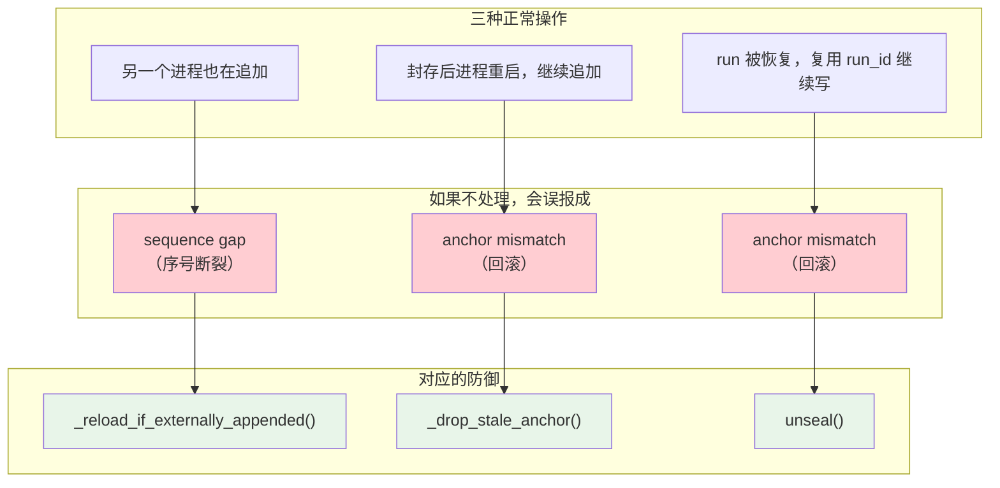

**① 并发写者会让链分叉。**

```python
"""``seq``/``prev_hash`` are cached in memory and ``_ensure_loaded`` only
ever runs once per instance, so a second writer on the same file forks
the chain: both assign the same ``seq`` from the same ``prev_hash``, and
:func:`verify_chain` then reports a sequence gap on a log nobody
tampered with — a false tamper alarm produced by ordinary concurrent use."""
```

两个 `HashChainLog` 实例打开同一个文件，各自在内存里缓存 `seq` 和 `prev_hash`，而 `_ensure_loaded()` **每个实例只跑一次**。于是两边都认为下一条是 seq=100、prev_hash=X，各写一条——文件里出现两条 seq=100，校验立刻报 `sequence gap`。**没有人篡改，但告警响了。**

检测方式极其便宜：

```python
size = self.path.stat().st_size
if self._observed_size is not None and size == self._observed_size:
    return                      # 单写者场景，直接跳过
self._loaded = False            # 有人动过，重扫尾部
...
self._ensure_loaded()
```

拿"文件当前大小"和"我自己上次写完时的大小"比。相等说明中间没别人写过——这是**绝大多数情况**，代价只有一次 `stat`。不相等才重新扫描尾部恢复状态。注释里 "in the overwhelmingly common single-writer case, skips the rescan entirely" 说的就是这个取舍：为罕见情况付出的代价必须小到可以忽略，否则常见路径会被拖慢。

**② 封存后重启会被当成回滚。**

```python
"""The install-wide audit trail is sealed at shutdown and extended again
on the next start, which would otherwise make every post-restart
verification look like tampering."""
```

全局审计日志在进程关闭时 `seal()`，下次启动继续往后追加。而 `verify_chain` 要求锚点指向**当前**链头——链一长过锚点，校验就报 `anchor mismatch`。**每次正常重启都会触发一次"疑似回滚"告警。**

`_anchor_pending_clear` 这个布尔标志解决它：

```python
def _drop_stale_anchor(self) -> None:
    if not self._anchor_pending_clear:
        return                              # 普通 append 零成本
    self._anchor_pending_clear = False
    self.anchor_path.unlink(missing_ok=True)
```

它在两个时刻被置为 `True`：**构造时**（因为上个进程可能在关闭时封过）和**每次 `seal()` 之后**。所以每封存一次，最多清理一次锚点，之后的所有 append 都是一次布尔判断就返回。下一次 `seal()` 会重新锚定新的链头。

**③ 恢复的 run 复用 run_id。**

`unseal()` 的 docstring 描述的场景，和 [10 · 可观测性与诊断](../subsystems/27-可观测性.md) §10.2 的 `reopen()` 是同一件事的底层实现：

> A resumed run reuses its run_id: the previous run finished and sealed an anchor, then a recoverable run is continued with new records. The stale anchor would make any `verify` report an `anchor mismatch` for a **legitimate extension**.
>
> **The chain itself is untouched** — only the "this run is done" marker is dropped; the final `RUN_FINISHED` seals a fresh anchor.

最后那句是关键：`unseal()` **只删锚点文件，不碰日志**。它抹掉的是"这次 run 结束了"这个断言，而不是任何记录。所以它不削弱防篡改能力——链本身的每一条 `prev_hash` 依然完整，只是允许链继续长。

三者放在一起看，是同一条设计原则的三种表现：**完整性检查必须能区分"改动"和"增长"**。只会说"和上次不一样"的校验器没有价值。

### 6.11 两条写入路径

`append()` 里有一个 `keep_handle` 决定的分支，两条路径的权限处理**不一样**：

```python
handle = self.ensure_handle()
if handle is not None:                    # ① 持久句柄
    handle.write(...); handle.flush()
    if sync: os.fsync(handle.fileno())
else:                                     # ② 每次打开
    fd = os.open(self.path, os.O_WRONLY | os.O_CREAT | os.O_APPEND, CHAIN_FILE_MODE)
    os.write(fd, payload)
    if sync: os.fsync(fd)
    os.close(fd)
    if created: self.path.chmod(CHAIN_FILE_MODE)
```

| | ① 持久句柄（`keep_handle=True`） | ② 每次打开 |
|---|---|---|
| 适用 | 高频写入（trace） | 低频写入（审计） |
| 开销 | 一次打开，长期复用 | 每条一次 `open`/`close` |
| 权限 | `open(path,"a")` **受 umask 影响**，必须显式 `chmod` | `os.open(..., mode)` 直接指定 |
| 原子性 | 依赖 `flush` | `O_APPEND` **内核级原子追加** |

路径①的注释是中文写的，直接点出了坑：

```python
# open("a") 受 umask 影响；审计日志必须 0600，与 O_APPEND 分支一致。
```

Python 的 `open(path, "a")` 创建文件时权限是 `0666 & ~umask`。在 umask 为 `022` 的系统上得到 `0644`——**同组和其他用户可读**。审计日志必须是 `0600`，所以路径①创建后立刻 `os.chmod`。路径②用 `os.open` 可以直接传 mode，但**也**受 umask 影响，所以在 `created` 时同样补一次 `chmod`。

> 两条路径都要 chmod，理由不同但结论一样。这类"两个分支必须保持一致"的地方是回归 bug 的高发区——只改一条会留下一个只在某种配置下出现的权限泄漏。

`sync` 参数默认 `False`：普通追加只 `flush` 到操作系统，不强制落盘。真正的持久化由 `seal()` 统一 fsync（见 §6.3）。这是吞吐和持久性的取舍——trace 每秒可能写几百条，逐条 fsync 会让写入变成瓶颈；而崩溃时最多丢失最后未封存的一小段，可以由 [10 · 可观测性与诊断](../subsystems/27-可观测性.md) §10.1 的恢复逻辑处理。

### 6.12 `_read_anchor()` 的静默降级

```python
def _read_anchor(self) -> dict | None:
    if not self.anchor_path.is_file():
        return None
    try:
        value = json.loads(self.anchor_path.read_text(encoding="utf-8"))
        return value if isinstance(value, dict) else None
    except (OSError, json.JSONDecodeError):
        return None
```

锚点读不出来（文件不存在、读失败、JSON 坏了、不是对象）一律返回 `None`，而 `None` 的含义是"**没有锚点**"——校验会退回到只检查链本身。

这看起来像是给攻击者留了后门（毁掉锚点就绕过了回滚检测），但实际上没有更好的选择：锚点文件被删和从未封存过，在文件系统层面无法区分。真正的防线在别处——`verify_chain` 里那条 `anchor exists but the log file is missing` 说明**反过来的情况**（有锚点没日志）会被抓住，而完整的部署应当把锚点和日志一起纳入备份和权限保护（`0600` + 私有目录 `0700`）。

---

## 7. 参数速查

| 参数 | 值 | 位置 |
|---|---|---|
| 私有目录权限 | `0o700` | `paths.py` |
| 私有文件权限 | `0o600` | `paths.py` |
| 项目根环境变量 | `AGENT_SMITH_PROJECT_ROOT` | `paths.py` |
| 根签名文件 | 3 个（smith config / smith identity / 任一 SKILL.md） | `paths.py` |
| 摘要块大小 | 64 KB | `paths.py` |
| SQLite journal 模式 | WAL | `database.py` |
| SQLite 外键 | ON | `database.py` |
| SQLite 忙等 | 5000 ms | `database.py` |
| 哈希链版本 | 1 | `hash_chain.py` |
| 哈希链文件权限 | `0o600` | `hash_chain.py` |
| YAML 合并语义 | `None` 不覆盖 | `yaml_utils.py` |
| 依赖 | `pyyaml`、`aiosqlite` | `pyproject.toml` |

---

## 8. 这一层该放什么、不该放什么

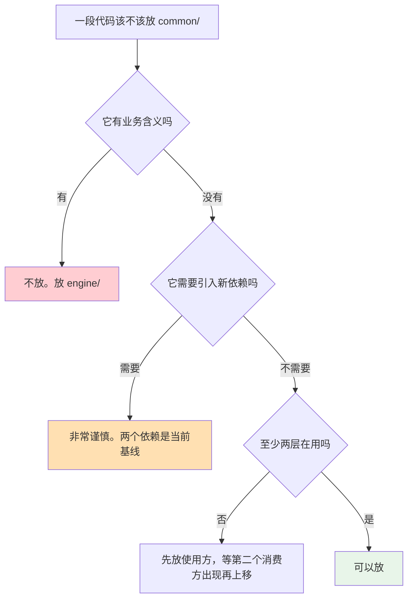

现有五个文件都满足这三条：

| 文件 | 业务含义 | 依赖 | 消费方 |
|---|---|---|---|
| `paths.py` | 无 | 标准库 | engine + server |
| `hash_chain.py` | 无 | 标准库 | engine（两处） |
| `yaml_utils.py` | 无 | `pyyaml` | engine + server + agents 内容 |
| `database.py` | 无 | `aiosqlite` | server |
| `config.py` | 无 | 无 | 全部 |

`database.py` 严格说只有 server 在用，但它是"SQLite 连接管理"这类纯基础设施，放这里符合直觉。

### 8.1 反例

这些**不该**放进来：

| 反例 | 为什么 |
|---|---|
| 一个"顺手"的字符串工具 | 只有一个消费方，放使用方 |
| 记忆策略解析 | 有业务含义 |
| LLM 配置合并 | 有业务含义（`merge_configs` 是通用深合并，`resolve_llm_config` 不是） |
| HTTP 客户端封装 | 引入 `httpx` 依赖，且 `common/` 不该知道网络 |

`merge_configs` 和 `resolve_llm_config` 的分界值得注意：**通用的深合并算法在 `common/`，"哪五层、什么优先级"在 `engine/llm/`。**

---

## 9. 设计取舍

**① 两个依赖是纪律。** 依赖数量是这一层是否守住边界的最直接指标。

**② 权限强制两步走。** `mkdir(mode=...)` 会被 umask 削弱，必须再 `chmod`。

**③ 软链逐段拒绝，且删除时特殊处理叶子。** 因为整个平台写保护锚在路径根上。

**④ 惰性单例 + 模块级 `__getattr__`。** 让环境变量能在 import 之后再设，同时保住老的常量写法。代价是两种 import 写法行为不同——只能靠文档说明。

**⑤ 原子写的四个细节缺一不可。** 同目录临时文件、fsync、chmod 在 replace 之前、失败清理。

**⑥ `None` 不覆盖是一行代码的语义。** 它撑起了整个五层配置合并。

**⑦ 两把锁分工。** 慢初始化不阻塞状态读取。

**⑧ 缓存连接每次都健康检查。** 一次 `SELECT 1` 换掉一整类"连接已死"的疑难杂症。

---

## 9.1 五个文件共用的六条手法

1 400 行代码分在五个文件里，但同样的手法反复出现。认出它们，读这一层就不必逐文件从头理解。

**① 只保护自己创建的东西。** `_ensure_private_dir` 对已存在的目录直接返回不 chmod；`yaml_utils` 的写入保留已有父目录权限。程序要保护自己的数据，但不能因此改动用户的家目录或已有结构。两处都有对应测试（§10.1、§10.3）。

**② 锁内绝不跨越 I/O。** `_cached_connection_for` 在锁外关连接；`HashChainLog._lock` 只护内存状态；`_db_lock` 与 `_db_init_lock` 分工明确。一次慢 I/O 若发生在锁内，会把并发退化成串行。

**③ 失败要清理半成品。** 建连失败关连接、握手失败关传输、`_connect_all` 出错关已连上的——都用 `except BaseException` 覆盖 `CancelledError`，因为取消同样会留下需要清理的资源。

**④ 显式声明胜过隐式推断。** `legacy_linked` 必须写明而不能从"没有 hash 字段"推断（§6.7）；项目根必须匹配三个签名文件而不能只看有没有 `agents/`（§2.7）。**从缺失推断意图总是可伪造的**，从相似推断身份总是会误判。

**⑤ 逐段校验而非一次性校验。** 符号链接检查逐段进行，受管目录逐段创建并立即校验。一次性校验完再批量操作，中间存在 TOCTOU 窗口。

**⑥ 昂贵的检查要有便宜的前置判断。** manifest 先比 mtime+size 再算 SHA-256；`_reload_if_externally_appended` 先比文件大小再决定是否重扫；连接探活用 `SELECT 1` 而不是重建。**为罕见情况付出的代价必须小到常见路径感觉不到**——否则正确性的代价会变成性能问题，最后被人以性能为由删掉。

第⑥条尤其值得记：这一层的每一处安全检查都配了一条快路径。这不是过早优化，而是让安全措施**可持续存在**的前提。一个每次启动都要哈希几百个文件的完整性校验，迟早会被某个赶进度的改动关掉。

这六条里，②③在 [12 · MCP 集成](../subsystems/26-MCP集成.md) 同样成立，④在 [05 · 记忆系统](../subsystems/21-记忆系统.md) 的证据守卫里成立，①⑤是这一层特有的——因为只有它直接操作用户的文件系统。

### 9.2 改这一层之前先问三个问题

`common/` 被三层依赖（`engine/`、`server/`，以及通过运行时加载的 `agents/`），改动的影响面比行数暗示的大得多。动手前值得确认：

**① 这个改动会不会让某处的权限变宽？** 目录默认 `0700`、文件默认 `0600`，任何新增的创建路径都要显式设权限——`mkdir(mode=...)` 和 `open(path,"a")` **都受 umask 影响**，不能只依赖默认值。§6.11 那两条注释就是被这个坑教出来的。

**② 这个改动会不会引入一条绕过校验的路径？** 受管路径的每个入口都过 `_ensure_real_descendant`；新增一个直接 `mkdir` 或 `open` 的地方，就等于开了一个不检查符号链接的旁路。§2.6 的三种逃逸都指向同一件事：**只要有一条路不检查，全部检查都白做**。

**③ 这个改动会不会让完整性校验产生误报？** 任何影响哈希链写入时机、文件大小、锚点生命周期的改动，都可能让正常操作被报成篡改（§6.10）。误报比漏报更容易毁掉一个防篡改系统——因为它会让人学会忽略告警。

三个问题对应三类真实存在过的缺陷。改完之后跑 `server/tests/test_common_infrastructure.py`（38 个）和 `engine/tests/observability/test_hash_chain*.py`（20 个）是最低要求，它们把上面每一条都钉成了可执行的断言。

还有一条不属于自检、但同样重要：**这一层不该增长**。1 400 行支撑起上面三万多行，靠的是它只做"所有人都需要且没有业务含义"的事。一个看起来放这里很方便的函数，如果只有一个调用方，或者带上了任何领域知识，就应该待在调用方那里——`common/` 一旦开始装业务逻辑，依赖方向就会开始反转（见 §8.1 的反例）。

---

## 10. 测试锁住了什么

`common/` 自己没有测试目录——它的测试寄居在消费方那里，这本身就说明了这一层的定位：**它不是一个独立产品，而是被别人用的地基**。

| 测试文件 | 数量 | 覆盖 |
|---|---|---|
| `server/tests/test_common_infrastructure.py` | 38 | 路径、YAML、数据库、惰性配置 |
| `engine/tests/observability/test_hash_chain.py` | 13 | 哈希链的篡改检测 |
| `engine/tests/observability/test_hash_chain_downgrade.py` | 7 | 老格式兼容与降级 |
| `server/tests/test_profile_files.py` | 2 | profile 种子文件的复制一次语义 |

### 10.1 路径与权限（7 个）

| 测试 | 锁住的行为 |
|---|---|
| **`creates_private_runtime_dirs_without_restricting_existing_parents`** | 只对**自己创建**的目录设 `0700`，**不改已存在的父目录** |
| `reports_a_file_conflicting_with_the_runtime_data_directory` | 数据目录位置被普通文件占了要明确报错 |
| `rejects_a_symlinked_runtime_data_parent` | 父目录是符号链接直接拒绝（§2.6 逃逸方式二） |
| `honors_explicit_project_root` | 环境变量优先 |
| `rejects_an_explicit_root_without_smith_runtime_assets` | **显式配置错了不回落**（§2.7） |
| `cwd_discovery_skips_unrelated_agents_directories` | 别的项目的 `agents/` 不会被误认 |
| `requires_an_explicit_root_when_a_wheel_has_no_runtime_assets` | wheel 安装缺资产时要求显式指定，而不是猜 |

第一条尤其值得单独说，它是文档正文没展开的一个边界：`_ensure_private_dir()` 里

```python
if path.exists():
    if not path.is_dir():
        raise NotADirectoryError(...)
    return                                     # ← 已存在就原样返回，不 chmod
path.mkdir(parents=True, exist_ok=True, mode=PRIVATE_DIR_MODE)
path.chmod(PRIVATE_DIR_MODE)                   # ← 只有新建的才设权限
```

已存在的目录**直接返回**，不去改它的权限。这条边界很重要：`~/.agent-smith` 的父目录是用户的家目录，程序绝不该因为要保护自己的数据就把 `~` 改成 `0700`——那会影响用户的其他一切。只保护自己创建的东西，是这一层的分寸。

### 10.2 内建技能镜像（12 个）

这是 38 个里占比最大的一组，全部围绕 `_install_builtin_skills()`：

| 测试 | 场景 |
|---|---|
| `installs_shipped_skills_separately_from_user_skills` | `builtin/skills` 与 `agent/skills` 分开 |
| `reconciles_existing_builtin_skill_directory` | 已有目录要能增量对齐 |
| **`keeps_installed_skills_when_the_shipped_source_is_empty`** | **空源不覆盖**（§2.5 的防呆） |
| `rejects_symlinked_builtin_skill_target` | 目标是链接 → 拒绝 |
| `prunes_a_stale_builtin_skill_symlink_without_following_it` | 陈旧链接**删链接本身**（§2.6 的不对称） |
| `prunes_an_obsolete_builtin_skill_symlink_without_following_it` | 同上，不再随附的技能 |
| `rejects_a_symlinked_builtin_skill_manifest` | manifest 也不能是链接 |
| `recovers_from_an_invalid_builtin_skill_manifest` | manifest 坏了要能重建而不是崩 |
| `replaces_a_directory_that_conflicts_with_a_shipped_file` | 类型冲突：目录 → 文件 |
| `replaces_a_file_that_conflicts_with_a_shipped_directory` | 类型冲突：文件 → 目录 |
| **`restores_tampered_shipped_skill_files`** | 用户改了内建技能要被**还原** |
| **`uses_the_manifest_to_skip_hashing_unchanged_skill_files`** | 元数据没变**不算 SHA-256** |

最后两条是一对：既要能发现篡改并还原，又不能为此每次启动都把所有文件哈希一遍。manifest 的两级判定（元数据 → 摘要）正是为了同时满足这两个要求，而这两个测试分别从正反两面把它钉住——去掉增量优化，`skip_hashing` 会失败；去掉摘要校验，`restores_tampered` 会失败。

`test_wheel_data_files_reproduce_every_bundled_skill_file` 则守着另一条线：`common/pyproject.toml` 的 `[tool.setuptools.data-files]` 需要**逐个技能声明**，漏一个就会导致 wheel 安装后少一个技能。这个测试让"忘了加声明"在 CI 就暴露，而不是等用户装完发现技能不见了。

### 10.3 YAML（6 个）

| 测试 | 锁住的行为 |
|---|---|
| `requires_a_mapping_and_preserves_private_atomic_file` | 根必须是 mapping；写入原子且 `0600` |
| **`save_preserves_existing_parent_permissions`** | 和 §10.1 同一条分寸：不改已有父目录 |
| `save_rejects_a_symlinked_parent_directory` | 父目录是链接 → 拒绝 |
| `save_rejects_a_symlinked_destination` | 目标本身是链接 → 拒绝 |
| `surfaces_invalid_documents_and_unsafe_values` | 坏文档和不安全值要报出来，不静默 |
| `save_rejects_a_non_mapping_document` | 写入侧同样校验根类型 |

读写两侧都拒绝非 mapping 根，是对称的——只在读侧校验的话，一个写坏的文件要等到下次读才暴露。

### 10.4 数据库连接（6 个）

| 测试 | 锁住的行为 |
|---|---|
| `initializes_once_for_concurrent_callers` | 并发首次调用只初始化一次 |
| `reconnects_when_runtime_paths_change` | `reset_paths()` 之后要换连接 |
| **`uses_a_lightweight_liveness_probe_for_cached_connections`** | 复用缓存连接前做**轻量**探活，不是重建 |
| `reconnects_a_closed_cached_connection` | 连接被关掉了要能自愈 |
| **`runs_directory_setup_without_blocking_the_event_loop`** | 目录准备走 worker，**不占事件循环** |
| `get_app_db_runs_schema_setup_once_for_concurrent_callers` | schema 初始化同样只跑一次 |

加粗那两条对应 §4.1 那段注释说的"两把锁各管一件事"：目录准备是同步且慢的（要哈希和复制文件），必须挪出事件循环，同时不能占着数据库状态锁——否则一次冷启动会把所有并发请求卡住。

### 10.5 惰性配置（4 个）

| 测试 | 锁住的行为 |
|---|---|
| `config_exposes_paths_as_a_lazy_app_paths_value` | `paths` 是惰性求值的 |
| **`module_access_observes_reset_paths_but_from_imports_are_snapshots`** | **访问方式决定语义** |
| `runtime_catalog_resolves_paths_when_it_runs` | 目录在运行时解析而非导入时 |
| `llm_config_resolves_paths_when_it_runs` | 同上 |
| `config_service_resolves_paths_when_it_runs` | 同上 |

加粗那条把 §5.2 的 `__getattr__` 后果写成了可执行的断言，也是这一层最容易踩的坑：

```python
import common.config
common.config.paths          # ✓ 每次访问走 __getattr__，能看到 reset_paths()

from common.config import paths
paths                        # ✗ 导入时就取值了，是一个快照，reset 之后仍是旧的
```

后三条 `resolves_paths_when_it_runs` 则从消费方那一侧确认这条纪律被遵守了——三个模块都必须在**运行时**取路径，不能在模块级别 `from ... import paths` 固化下来。测试写在消费方而不是 `common/` 里，正是因为要验证的是"使用方式"而不是"实现"。

---

## 11. 接下来

| 想深入 | 读 |
|---|---|
| 路径根怎么支撑写保护 | [06 · 安全与安全边界](../subsystems/23-工具与安全.md) §3.5 |
| 哈希链的能力边界 | [06 · 安全与安全边界](../subsystems/23-工具与安全.md) §10 |
| 五层配置合并 | [02 · 快速上手](../guide/02-快速上手.md) §3 |
| 8 张表的 schema 与迁移 | [09 · Server API 层](43-Server.md) |
| 层归属决策树 | [03 · 架构总览](../architecture/10-系统架构.md) §10 |
