# 12 · MCP 集成

> **定位**：`engine/mcp/` 1.2k 行——两种传输、协议协商、工具名归一化、会话级连接池、以及四道防止一个坏 MCP server 拖垮整个运行的边界。
> **适合**：要接 MCP server 的人；被 MCP 的流式协议坑过的人。

---

## 1. 全景

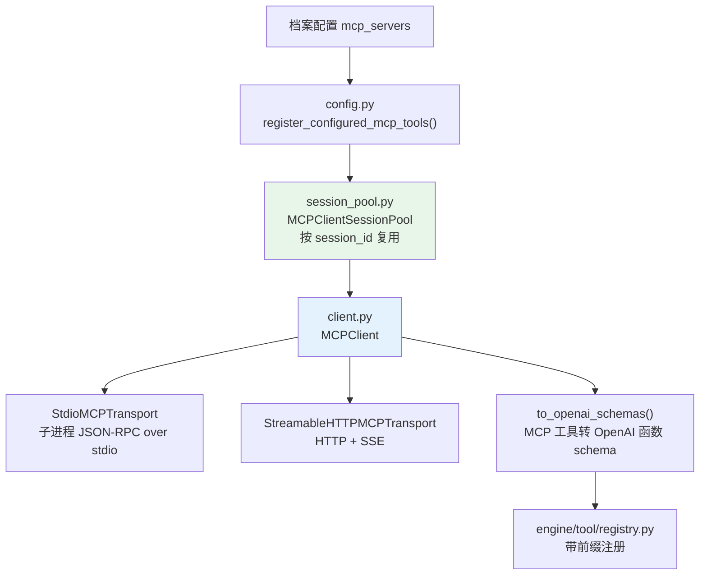

---

## 2. 协议版本

```python
PROTOCOL_VERSION = "2025-11-25"
SUPPORTED_PROTOCOL_VERSIONS = {
    "2025-11-25",
    "2025-06-18",
    "2025-03-26",
    "2024-11-05",
}
CLIENT_INFO = {"name": "agent-smith", "version": "0.2.0"}
```

**声明最新版，接受四个版本**。MCP 协议演进较快，server 的实现分布在多个版本上，只接受最新版会让大部分现成 server 用不了。

---

## 3. 两种传输

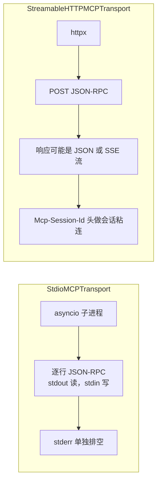

两者都实现同一个 `MCPTransport` 协议：

```python
class MCPTransport(Protocol):
    async def connect(self) -> None: ...
    async def send_request(self, method: str, params: dict) -> dict: ...
    async def send_notification(self, method: str, params: dict) -> None: ...
    async def close(self) -> None: ...
```

### 3.1 stdio 的子进程环境白名单

```python
_MCP_SAFE_ENV_KEYS = ("LANG", "LC_ALL", "LC_CTYPE", "TERM", "TZ", "NO_COLOR")

def _mcp_subprocess_environment(env: dict[str, str] | None) -> dict[str, str]:
```

和 Seatbelt 沙箱同一套思路（见 [06 · 安全与安全边界](23-工具与安全.md) §9.1）：**只有六个变量能进 MCP 子进程**，其余一律不继承——一个 MCP server 不该看到你的 `AWS_SECRET_ACCESS_KEY`。

源码注释把威胁模型说得很直接：

```python
# Locale/terminal keys safe to forward to an MCP stdio server.  Everything else
# is deliberately NOT inherited from the parent process: a configured-but-
# untrusted server (an arbitrary npx package) must not be able to read the
# engine's API keys, DB credentials, or other secrets from its environment.
```

关键词是 **"an arbitrary npx package"**。stdio 传输的本质是"跑一个用户指定的本地命令"，而典型配置是 `npx -y @某某/server`——等于在你的机器上执行一个刚从 npm 下载的包。它继承什么环境变量，就等于能读走什么凭据。

实际构造出来的环境只有三部分：

```python
environment: dict[str, str] = {
    "PATH": os.environ.get("PATH") or os.defpath,   # ① 必需
}
for key in _MCP_SAFE_ENV_KEYS:                       # ② 六个白名单
    value = os.environ.get(key)
    if value:
        environment[key] = value
if env is not None:
    environment.update(env)                          # ③ 用户显式授予
```

| 部分 | 来源 | 数量 | 为什么安全 |
|---|---|---|---|
| ① `PATH` | 父进程 | 1 | 不给就找不到 `npx`/`node`，子进程根本起不来。`os.defpath` 是父进程连 PATH 都没有时的兜底 |
| ② 语言/终端 | 父进程 | 最多 6 | `LANG` `LC_ALL` `LC_CTYPE` `TERM` `TZ` `NO_COLOR`——影响输出编码和时区，**不含任何凭据语义** |
| ③ `env` 配置 | 用户显式写的 | 任意 | 是操作者主动授予的，不是默认继承的 |

三条实现细节：

- **`if value:` 而不是 `if value is not None:`**——空字符串的 `TERM` 不如不传，避免子进程把 `TERM=""` 当成一个有效但无意义的终端类型。
- **`update` 放在最后**，所以用户配的 `env` **可以覆盖**白名单里的同名键（比如强行指定 `TZ=UTC`），也可以覆盖 `PATH`。这是有意的：操作者的显式配置优先级最高。
- **`os.environ` 全程只读**，从不修改——父进程环境不受影响，多个 server 之间也不会互相污染。

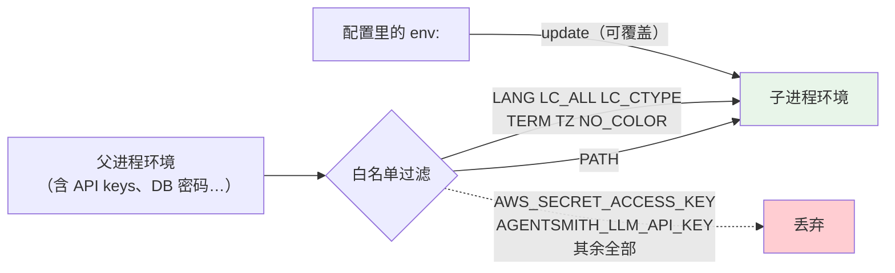

docstring 里 "Mirrors the credential-free `_safe_environment` used for model-requested shells" 这句是在指认同源：模型请求执行 shell 命令时走的是同一套构造逻辑（见 [06 · 安全与安全边界](23-工具与安全.md)）。**两处必须保持一致**——如果只加固 shell 而忘了 MCP，攻击者换条路照样能读到凭据。

### 3.2 日志脱敏

```python
def _redact_command(command: list[str]) -> str: ...
def _redact_url(url: str) -> str: ...
```

MCP server 的启动命令和 URL 里经常带 token（`npx some-server --api-key=xxx`、`https://host/mcp?token=xxx`）。记日志前必须脱敏。

---

## 4. 四道边界

这是这个模块最值得学的部分。四个上限各防一种失效，**缺一个就有一条路能挂住整个运行**。

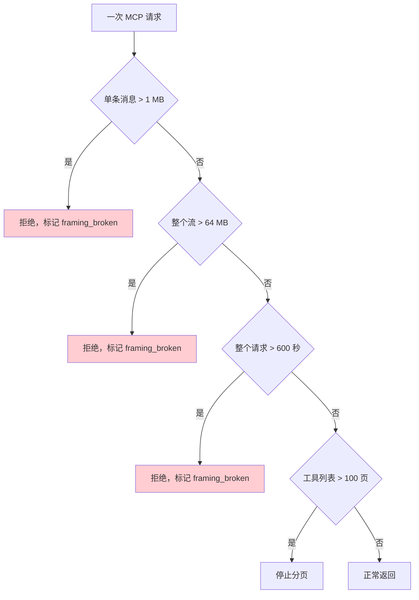

| 常量 | 值 | 防什么 |
|---|---|---|
| `MAX_MCP_RESPONSE_BYTES` | 1 MB | 单条消息过大 |
| `MAX_MCP_SSE_STREAM_BYTES` | 64 MB | 整个流的总量 |
| `MAX_MCP_REQUEST_SECONDS` | 600 秒 | 整个请求的墙钟 |
| `MAX_MCP_TOOL_LIST_PAGES` | 100 | 无限分页 |

### 4.1 为什么字节上限不够，还要墙钟

这段注释把问题讲得非常清楚：

```python
# A whole-request wall clock.  Both transports reset their read timeout on
# every line, so a server that trickles progress notifications keeps a request
# open for as long as it likes; the byte ceilings above cannot stop that,
# because a trickle is precisely what does not spend bytes.  Loose enough that
# a legitimately slow tool call is unaffected, finite so a hung one ends.
```

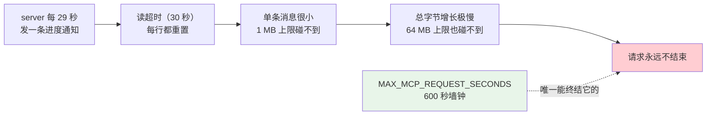

代码里的注释更直白：

> a byte budget alone would let ~1M tiny notifications run for months.
> （单靠字节预算，一百万条微小通知能跑几个月。）

**"涓流"恰恰是不花字节的那种攻击。** 对应提交：`efe49d2 fix(mcp): bound a trickling response by time, not only by bytes`。

实现上，每次读的超时取 `min(30, remaining)`：

```python
deadline = loop.time() + MAX_MCP_REQUEST_SECONDS
while True:
    remaining = deadline - loop.time()
    if remaining <= 0:
        self._framing_broken = True
        raise RuntimeError("MCP stdio response exceeded maximum total time")
    line = await asyncio.wait_for(self._process.stdout.readline(), timeout=min(30, remaining))
```

**最后一次读被剩余时间限制，所以它先到期**——不会出现"墙钟到了但还在等一个 30 秒的读"。

### 4.2 `framing_broken`：一次超限之后整条连接作废

```python
_FRAMING_BROKEN_MESSAGE = (
    "MCP stdio transport retired: an earlier response exceeded the maximum "
    "size and left the stream desynchronized"
)
```

理由写在超限分支的注释里：

> Same reasoning as the byte cap below: **we abandon the read mid-stream, so the next request would desynchronize.**

stdio 是**逐行 JSON-RPC**，没有帧长度前缀。中途放弃读取意味着流里还剩半条消息，下一个请求会读到那个残骸并把它当成自己的响应。

所以超限不是"这次失败"，是**这条传输永久报废**，必须重连。

### 4.3 死连接的三种消息

```python
_STDIO_DEAD_CONNECTION_MESSAGES = frozenset({
    "MCP server closed stdout unexpectedly",     # 子进程死了
    "MCP stdio transport not connected",         # 从没连上
    _FRAMING_BROKEN_MESSAGE,                     # 帧同步坏了
})
```

注释：

> A dead subprocess surfaces as EOF, and a retired transport refuses all future requests. **Both mean the session must reconnect, not retry.**

`is_fatal_connection_error(exc)` 用这个集合判定"该重连还是该重试"——**这两件事的处理完全不同**，重试一个死连接只是浪费时间。

---

## 5. 三个 JSON-RPC 方法

Agent-Smith 只用 MCP 协议的一个子集：

| 方法 | 类型 | 用途 |
|---|---|---|
| `initialize` | 请求 | 握手，协商协议版本 |
| `notifications/initialized` | 通知 | 握手完成 |
| `tools/list` | 请求 | 发现工具，支持游标分页 |
| `tools/call` | 请求 | 调用工具 |

**没有实现的**：`resources/*`、`prompts/*`、`sampling/*`、以及任何 server → client 的主动请求。

### 5.1 握手

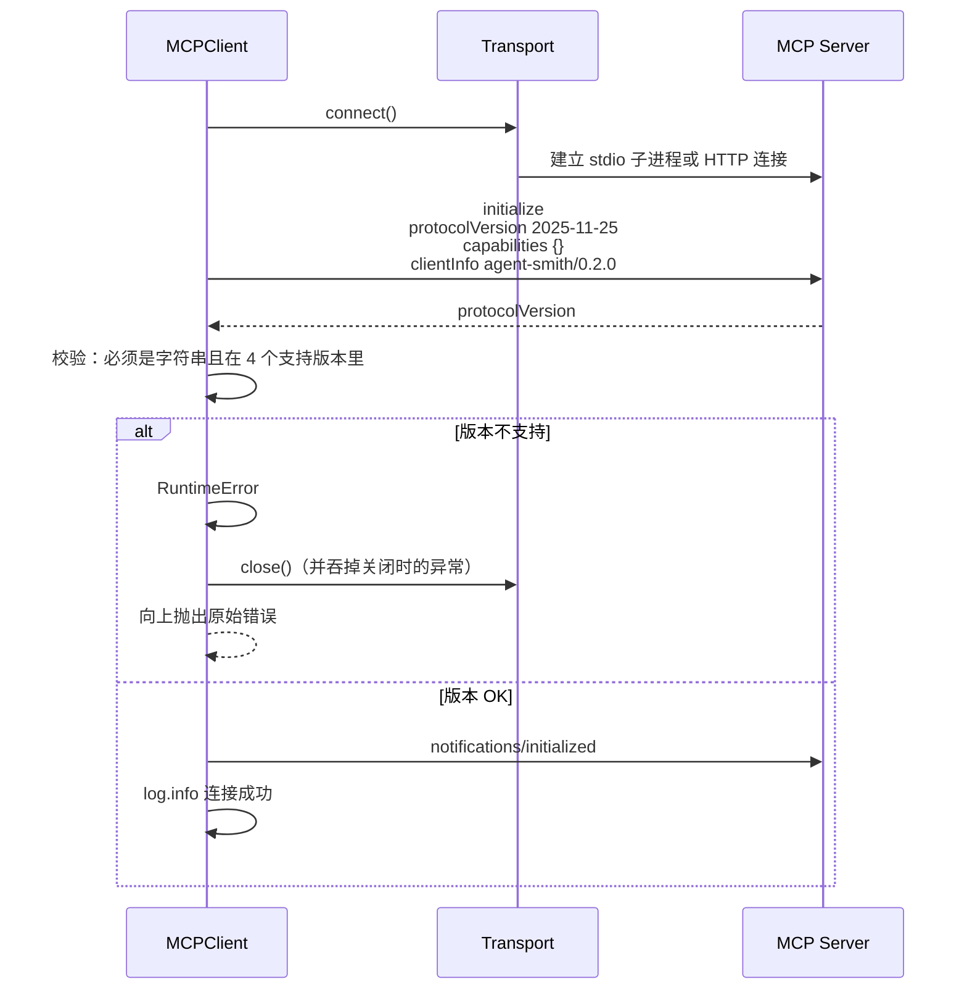

两个细节：

**① `capabilities: {}`。** 客户端**不声明任何能力**——因为它不处理 server 发起的请求（sampling、roots 之类）。声明了却不实现比不声明更糟。

**② 握手失败时先关传输再抛。**

```python
except BaseException:
    try:
        await self.close()
    except BaseException:
        log.warning("failed to close MCP transport after connect failure", exc_info=True)
    raise
```

**关闭时的异常被吞掉并记日志**，因为原始的连接错误才是用户要看的那个。如果 `close()` 抛出，它会替换掉真正的失败原因。

### 5.2 `tools/list` 的游标分页

```python
cursor: str | None = None
seen_cursors: set[str] = set()
for _page in range(MAX_MCP_TOOL_LIST_PAGES):
    result = await self._send("tools/list", {"cursor": cursor} if cursor else {})
    ...
    next_cursor = result.get("nextCursor")
    if not isinstance(next_cursor, str) or not next_cursor:
        return tools                                     # 正常结束
    if next_cursor in seen_cursors:
        raise RuntimeError("MCP tools/list returned a repeated cursor")   # 环
    seen_cursors.add(next_cursor)
    cursor = next_cursor
raise RuntimeError(f"MCP tools/list exceeded maximum page limit ({MAX_MCP_TOOL_LIST_PAGES})")
```

**两道独立的防线**：

| 防线 | 防什么 |
|---|---|
| `seen_cursors` | server 返回一个**重复的游标**——分页环 |
| 100 页上限 | server 每页返回一个**新**游标，永不结束 |

只有页数上限挡不住环（环会在上限内跑满 100 页才报错，而且报的是错误的原因）；只有 `seen_cursors` 挡不住"每页都给新游标"的无限分页。

### 5.3 逐工具的宽容校验

```python
for t in result.get("tools", []):
    if not isinstance(t, dict):
        continue                                    # 静默跳过
    name = t.get("name")
    if not isinstance(name, str) or not name:
        continue                                    # 静默跳过
    description = t.get("description", "")
    input_schema = t.get("inputSchema", {})
    if not isinstance(description, str) or not isinstance(input_schema, dict):
        log.warning("Skipping MCP tool with invalid metadata: %s", name)
        continue                                    # 记日志后跳过
```

**三级处理**：

- **不是对象 / 没有名字** → 静默跳过（连名字都没有，日志也没法写有用的信息）
- **元数据类型不对** → 记 warning 再跳过（有名字，能写进日志让人排查）
- **其余** → 收下

**一个坏工具不让整个 server 的工具列表失败。** 这和 §9 的"一个坏 server 不影响其余的"是同一条原则的不同粒度。

### 5.4 `tools/call` 的错误约定

```python
result = await self._send("tools/call", {"name": name, "arguments": arguments})
content = _content_to_text(result.get("content", []))
if result.get("isError") is True:
    raise MCPToolError(content or f"MCP tool failed: {name}")
return content
```

MCP 的工具错误**不是 JSON-RPC 错误**，而是一个成功响应里 `isError: true`。所以要显式检查这个字段，否则一个失败的工具调用会被当成成功并把错误信息返回给模型当结果。

`isError` 的判定用 `is True` 而不是真值判断——一个 `"false"` 字符串不该被当成错误。

`_content_to_text()` 把 MCP 的 content 块数组（可能含 text、image、resource 等类型）压成一段文本。

---

## 6. 工具名归一化

MCP server 的工具名可以是任意字符串，但 provider 的函数名有格式和长度限制（实测踩过 **113 字符的工具名超出 provider 限制**）。

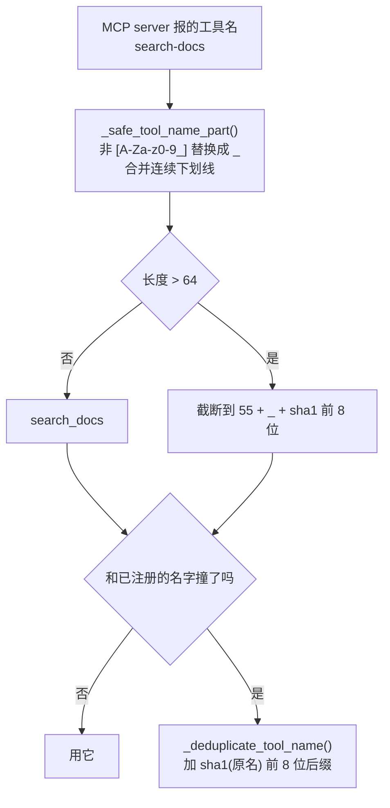

### 6.1 清洗是有损的，所以会撞名

```python
def _deduplicate_tool_name(registered_name: str, original: str, taken: set[str]) -> str:
    """Cleaning is intentionally lossy — ``safe-tool`` is meant to become
    ``safe_tool`` — but two server-side names can fold onto one registered name
    (``search-docs`` and ``search_docs``), and the loser used to hit
    ``register()``'s duplicate-name error and vanish from the session behind a
    warning.  Suffix only the actual collision, so names that do not collide keep
    their exact spelling."""
```

`search-docs` 和 `search_docs` 都会变成 `search_docs`。旧行为是**后来的那个静默消失**（只留一条 warning），用户完全不知道有个工具没注册上。

修法有一个克制之处：**只给真正撞名的那个加后缀**，没撞的保持原拼写。否则所有工具名都会带一串哈希，可读性全无。

### 6.2 广告的名字必须等于注册的名字

```python
def _mcp_registered_name(prefix: str, tool_name: str, taken: set[str]) -> str | None:
    """Two server-side names can fold onto one registered name; ``taken`` applies
    the same collision suffix the registry would, so an advertised schema name
    always equals the name actually registered.  Returns None when the tool
    name cleans down to nothing."""
```

**注册和广告用同一个函数**。如果 schema 里写的名字和注册表里的不一样，模型会调一个不存在的工具。

返回 `None` 的情况：工具名清洗后变成空（比如名字全是中文或符号）——这时干脆不注册。

### 6.3 注册时的四条安全默认值

名字定下来之后，工具被登记进 `ToolRegistry`。这四个参数是整篇文档里安全含量最高的地方：

```python
registry.register(
    name=registered_name,
    description=tool.description,
    parameters=tool.input_schema,
    func=_execute,
    # A remote MCP tool's real side effect cannot be inferred
    # safely from server-supplied metadata.  Default to explicit
    # approval and serialize calls until a trusted integration
    # can declare a narrower contract.
    permission_level="execute",
    approval_policy="always",
    side_effect="external",
    concurrency="serial",
)
```

| 参数 | 取值 | 含义 | 如果放宽会怎样 |
|---|---|---|---|
| `permission_level` | `execute` | 按最高权限档对待 | 落进只读档，会绕过写操作的审批 |
| `approval_policy` | `always` | **每次调用都要用户批准** | 远程 server 可以静默产生副作用 |
| `side_effect` | `external` | 声明会影响进程外的世界 | 会被当成纯函数，可能被缓存或重放 |
| `concurrency` | `serial` | 同一时刻只跑一个 | 并发调用可能压垮 server 或触发竞态 |

注释里那句 **"cannot be inferred safely from server-supplied metadata"** 是全部理由。MCP 协议里 server 自己描述工具，但这个描述**不可信**：

- 一个名叫 `read_file` 的工具完全可以在实现里删库
- `description` 是 server 写的自由文本，模型会读它，但它不构成任何保证
- `inputSchema` 只约束入参形状，跟副作用无关

因此引擎不做任何推断，一律按**最危险的情况**登记。代价是每次 MCP 工具调用都会弹审批——这对交互体验是实打实的摩擦。注释也承认了这是临时状态："until a trusted integration can declare a narrower contract"——将来若某个 server 能被证明可信，应当由**引擎侧的白名单**来放宽，而不是相信 server 的自述。

这条设计和 [06 · 安全与安全边界](23-工具与安全.md) 的整体取向一致：**信任必须来自本地配置，不能来自网络对端**。

### 6.4 闭包捕获：为什么要写这么怪的默认参数

```python
async def _execute(*, _client: MCPClient = client, _name: str = tool.name, **kwargs: Any) -> str:
    return await _client.call_tool(_name, kwargs)
```

`_client` 和 `_name` 写成带默认值的关键字参数，而不是直接在函数体里引用 `client` 和 `tool.name`。这是在防 Python 的**闭包晚绑定**陷阱。

如果写成直觉版本：

```python
async def _execute(**kwargs):
    return await client.call_tool(tool.name, kwargs)   # ← 错
```

`tool` 是循环变量，闭包捕获的是**变量本身而不是当时的值**。循环结束后 `tool` 指向最后一个工具，于是**注册的十个工具全都会去调用最后那一个**。默认参数在 `def` 执行时求值，把当次迭代的值固定下来，是标准解法。

下划线前缀则是为了不和 MCP 工具自己的入参撞名——工具参数经 `**kwargs` 透传，如果某个 server 的工具恰好有个参数叫 `name`，没有下划线就会覆盖掉绑定值。

### 6.5 调用失败时的驱逐回调

`_execute` 的完整实现还带了一层错误处理：

```python
except BaseException as exc:
    if on_connection_failure is not None and is_fatal_connection_error(exc):
        try:
            await on_connection_failure()
        except Exception:
            log.warning("MCP connection-failure handler raised (tool=%s)", _name, exc_info=True)
    raise
```

三个细节：

1. **捕获 `BaseException`**：连 `CancelledError` 也要判定一次——请求被取消时连接可能同样已经死了。
2. **回调自己抛异常不能掩盖原异常**：内层 `try/except Exception` 只记 warning。如果驱逐逻辑出了问题，用户看到的仍然是**真正的工具调用错误**，而不是"驱逐失败"这种无关的次生错误。
3. **无条件 `raise`**：驱逐只是副作用，异常照常向上传播。调用方（ReAct 循环）该看到失败还是会看到失败。

这个回调就是 §8.8 里 `_evict_dead_session` 的接入点——`config.py` 把它传进来，形成"工具调用发现连接死了 → 驱逐会话池条目 → 下次 acquire 重连"的闭环。

### 6.6 注册失败的两级处理

```python
except ValueError as exc:
    log.warning("Skipping MCP tool %s: %s", tool.name, exc)
except Exception:
    log.exception("Failed to register MCP tool: %s", tool.name)
```

分开是有意的：`ValueError` 是 `ToolRegistry` 对**预期内**的坏输入抛的（schema 不合法、名字仍然冲突等），记一行 warning 跳过就够；其他异常是**意外**，用 `log.exception` 带完整堆栈。两种情况都**只跳过这一个工具**，同一个 server 的其余工具照常注册。

### 6.7 结果内容的转换

```python
def _content_to_text(content: Any) -> str:
    if not isinstance(content, list):
        return ""
    parts: list[str] = []
    for part in content:
        if not isinstance(part, dict):
            parts.append(str(part))
        elif part.get("type") == "text" and isinstance(part.get("text"), str):
            parts.append(part["text"])
        else:
            parts.append(json.dumps(part, ensure_ascii=False))
    return "\n".join(parts)
```

MCP 的工具结果是一个 content 数组，元素可以是 text、image、resource 等类型。引擎最终要给模型一段**文本**，所以要压平：

| 元素形态 | 处理 | 理由 |
|---|---|---|
| `{"type":"text","text":"..."}` | 取 `text` 原文 | 最常见，直接用 |
| 其他 dict（image/resource/未知类型） | `json.dumps(ensure_ascii=False)` | **不丢弃**——模型至少能看到有这么个东西 |
| 非 dict 元素 | `str(part)` | 协议外的东西也不炸 |
| `content` 不是列表 | 返回 `""` | 畸形响应降级成空串，不抛异常 |

`ensure_ascii=False` 让中文在序列化后仍是中文而不是 `\uXXXX`，模型读得懂，也省 token。整体思路是**宁可给模型一段 JSON，也不要静默丢内容**——未知类型不代表无用。

---

## 7. SSE 流的三重防护

Streamable HTTP 的响应可以是 SSE 流。解析在 `_iter_sse_data_stream()`，三个上限同时生效：

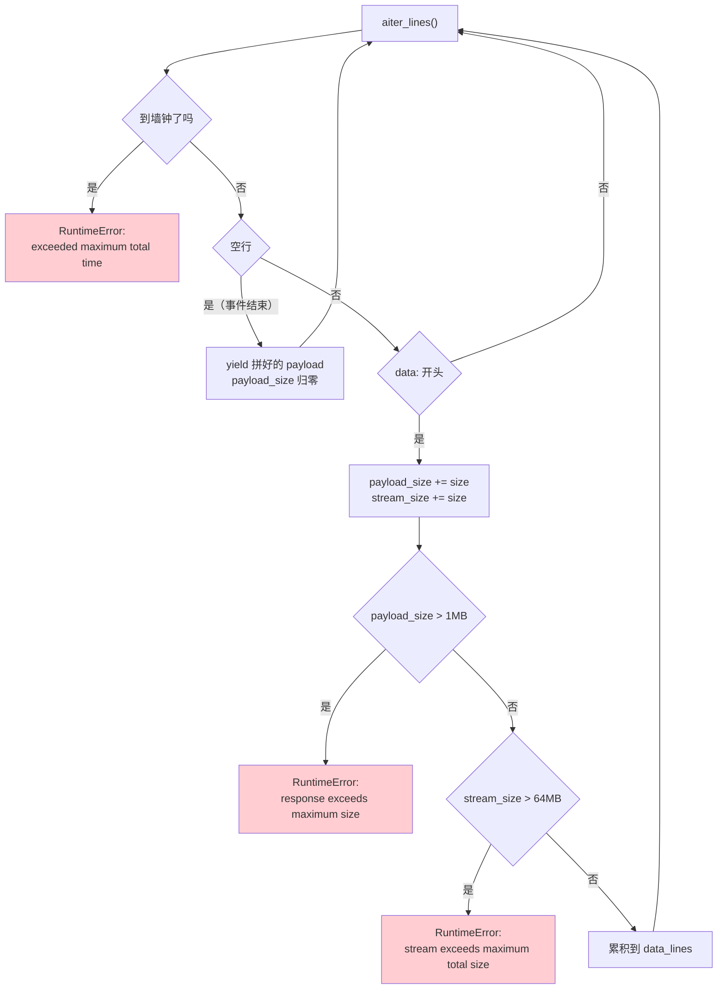

关键在**哪个计数器会重置**：

| 计数器 | 重置时机 | 防的是 |
|---|---|---|
| `payload_size` | **每个事件结束时归零** | 单条消息过大 |
| `stream_size` | **从不重置** | 大量事件累积成洪水 |
| `deadline` | **从不重置**（连接建立时定死） | 慢速滴流 |

源码注释罕见地把自己的局限也写了出来：

```python
# Keep a deliberately loose ceiling so legitimate long calls are unaffected — and
# note that this one stops a flood, not a trickle: MAX_MCP_REQUEST_SECONDS
# above is what actually bounds the trickle this comment names.
```

**字节上限挡不住滴流**——一个每秒发一字节的 server 永远撞不到 64 MB，但能把请求永久挂住。挡它的只能是墙钟。反过来墙钟也挡不住洪水：600 秒内可以塞进几个 GB。两者互补，缺一不可。这正是 §4「四道边界」那句"缺一个就有一条路能挂住整个运行"的具体展开。

`payload_size` **必须**每事件重置，否则一次合法的长调用（server 先发几百条进度通知再发结果）会被误杀——注释里 "a long call legitimately streams many small progress notifications before its response arrives" 说的就是这个场景。

### 7.1 按 id 匹配响应

```python
async def _response_from_sse_stream(response: Any, request_id: int) -> dict:
    async for payload in _iter_sse_data_stream(response):
        if not payload:
            continue
        message = _parse_json_object(payload, label="MCP SSE response")
        if message.get("id") == request_id:
            return message
        log.debug("Ignoring MCP SSE message while waiting for id %s: %s", request_id, message)
    raise RuntimeError(f"MCP SSE stream ended before response id {request_id}")
```

流里混着进度通知和真正的响应。**只有 `id` 对得上的才是答案**，其余记 debug 日志后忽略——这是 JSON-RPC 在流式传输上的标准做法，也是 §12 里"server → client 消息当前不处理"的具体表现：那些消息被看见了、被记录了，但没有被回应。

流走完还没等到匹配 id 就抛错。这条路径覆盖了"server 提前关闭流"的情况，错误信息里带上期待的 id，排错时能直接对上请求。

非 SSE 的普通 HTTP 响应走 `_read_bounded_response()`，逻辑简单得多：边收边累加，超 1 MB 就抛错。它没有整流上限也没有墙钟——因为不是流，httpx 自己的 `timeout` 就够了。

---

## 8. 会话连接池

`engine/mcp/session_pool.py`（194 行）。

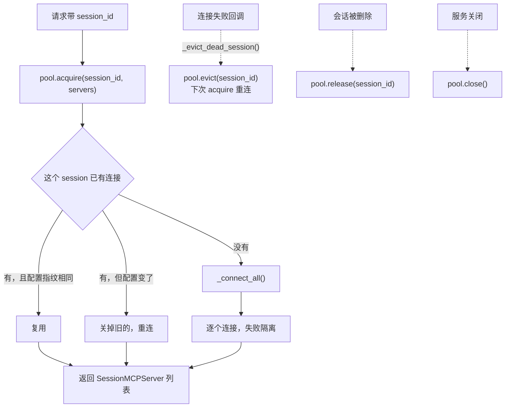

连接池的类 docstring 就把所有权说死了：

> A runtime receives **borrowed** clients from this pool; it must **never close** them. Session deletion and process shutdown own cleanup instead.

这句话是整个模块的地基。运行时拿到的是**借来的**客户端——它可以调用、可以报错，但**不能关闭**。关闭权只属于两个时刻：会话被删除、进程退出。如果运行时也能关，那么两个并发请求里跑得快的那个结束时会关掉连接，跑得慢的那个下一次调用就撞上死连接——而配置指纹没变，池还会把这个死客户端继续借出去。

### 8.1 配置指纹

```python
def _fingerprint(configured_servers: list[dict[str, Any]]) -> str:
    """Create an in-memory stable key; it is never logged or persisted."""
    return json.dumps(configured_servers, sort_keys=True, separators=(",", ":"), default=str)
```

用户改了 `mcp_servers` 配置后，池里的旧连接必须被替换。指纹变化就是替换的触发条件。

三个实现细节都不是随手写的：

| 细节 | 作用 |
|---|---|
| `sort_keys=True` | 同一份配置换个键序不该算改了配置，否则每次读 YAML 都可能触发全量重连 |
| `separators=(",", ":")` | 去掉空格，让指纹只反映内容 |
| `default=str` | 配置里混进不可序列化的对象时兜底转字符串，而不是抛异常炸掉整个 acquire |

docstring 里那句 **"never logged or persisted"** 是安全约束不是说明文：配置字典里装着 `headers` 的 `Authorization`、`env` 的 API key，指纹是这些明文的完整拷贝。它只能待在内存的 `_SessionEntry.fingerprint` 字段里——一旦被记进日志或写进数据库，等于把所有 MCP 凭据明文落盘。真正要记日志时走的是另一条路：`mcp_server_log_summary()`（见 §9.5）。

### 8.2 三把锁，各管一件事

容易简化成"每个会话一把锁"，但实际是**三把**，职责严格分开：

| 锁 | 保护什么 | 持有时长 | 关键约束 |
|---|---|---|---|
| `_lock` | `_entries` 和 `_session_locks` 两个字典的读写 | 极短，纯内存操作 | **绝不跨越网络 I/O** |
| `_lifecycle_lock` | "操作加入会话"这个时点与进程关闭的协调 | 短，**在任何网络 I/O 前释放** | 释放早，所以慢的 MCP server 不会变成进程级瓶颈 |
| `_session_locks[sid]` | 单个会话的 acquire / release / evict 顺序 | 长，覆盖整个连接过程 | 每会话一把，互不阻塞 |

源码注释把为什么要分开讲得很直白：

```python
# Session operations must remain serialized so that a reconnect cannot
# race a release or replace a newer configuration.  The locks are
# intentionally separate from ``_lock``: connecting to a remote MCP
# server can take seconds and must not stall unrelated sessions.
```

如果只用一把全局锁，一个连着慢速远端 MCP server 的会话会把**所有**会话的 MCP 操作卡住几秒钟。分成三把之后，慢的只慢自己。

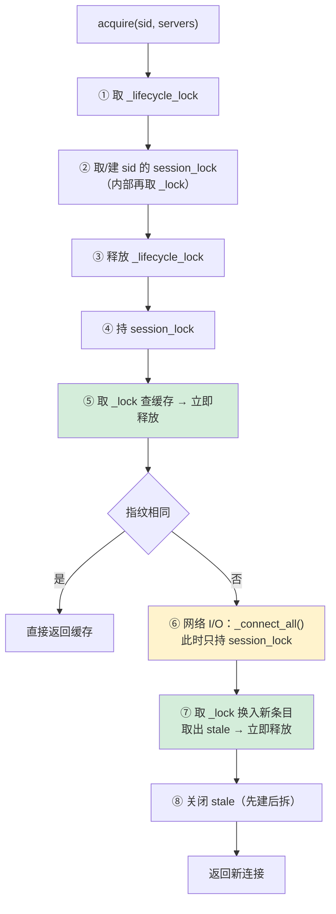

黄色那一步是唯一的慢操作，而它**只持有本会话的锁**。绿色两步持有全局 `_lock`，但都是纯字典操作。

### 8.3 `_session_locks` 为什么是弱引用字典

```python
self._session_locks: weakref.WeakValueDictionary[str, asyncio.Lock] = (
    weakref.WeakValueDictionary()
)
```

这里有一对互相矛盾的要求，注释写明了：

> Locks must **stay alive** while an acquire/release task holds one, but a long-lived server must **not retain a lock for every deleted session**.

- 用普通 `dict`：每个见过的 `session_id` 都留一把锁，永不回收。一个跑几个月的 server 会攒下几十万把没用的锁——一条缓慢但确定的内存泄漏。
- 用弱引用字典：没有任何任务持有时，锁自动被 GC 回收；而只要有协程正 `async with` 着它，强引用就在栈上，不会被回收。

`WeakValueDictionary` 恰好同时满足两条。这是"用对数据结构就不用写清理代码"的典型——没有定时器、没有 LRU、没有手动 `del`。

### 8.4 `_connect_all` 的两级异常处理

```python
try:
    for config in configured_servers:
        try:
            client, tools = await self._connect_server(config)
            servers.append(...)
        except Exception:
            failures += 1
            logger.exception(...)
except BaseException:
    await _close_servers(servers)
    raise
if configured_servers and failures == len(configured_servers):
    raise MCPConnectError(...)
```

两层 `try` 各防一件事：

| 层 | 捕获 | 行为 | 防的是 |
|---|---|---|---|
| 内层 | `Exception` | 计数 + 记日志，**继续连下一个** | 一个坏 server 拖垮其余 server |
| 外层 | `BaseException` | 关掉**已连上**的，重新抛出 | `CancelledError` / `KeyboardInterrupt` 导致的**连接泄漏** |

外层捕获 `BaseException` 而不是 `Exception` 是有意的：请求被取消时抛的 `asyncio.CancelledError` 在 Python 3.8+ 继承自 `BaseException`，`except Exception` 抓不到。如果不处理，前几个已经连上的子进程就成了没人认领的孤儿进程。

**全失败要抛错**这条尤其值得看注释：

```python
# Never cache an empty server list under a fingerprint whose
# connect failed: that would silently remove every MCP tool for
# the session while still short-circuiting the retry on the next
# acquire.  Surface a typed error the caller can act on instead.
```

这是一个很隐蔽的坑。如果全失败时返回空列表，会发生：

1. 空列表被缓存到当前指纹下
2. 用户的 MCP 工具**全部消失**，但没有任何报错
3. 下一次 `acquire` 发现指纹没变，**直接返回缓存的空列表**——重试被永久短路了
4. 用户只能重启进程或改配置才能恢复

抛 `MCPConnectError` 则让调用方拿到一个有类型的失败，且**什么都没缓存**，下次 acquire 会真的重连。

注意这条判定是 `failures == len(configured_servers)`：**部分失败仍然缓存**。三个 server 挂了两个，剩下那个的工具照常可用——这才是"故障隔离"该有的样子。

### 8.5 先建后拆的替换顺序

```python
servers = await self._connect_all(configured_servers)   # ① 先连新的

async with self._lock:
    current = self._entries.get(session_id)
    if current is not None:
        stale = current.servers                          # ② 取出旧的
    self._entries[session_id] = _SessionEntry(...)       # ③ 换入新的

await _close_servers(stale)                              # ④ 最后才关旧的
```

顺序是 **连新 → 换入 → 关旧**，不是"关旧 → 连新"。中间任何一刻，`_entries[session_id]` 要么是完整的旧连接、要么是完整的新连接，**不存在两者都不可用的窗口**。如果反过来先关旧的，新连接又恰好失败，这个会话就会在一段时间里既没有旧工具也没有新工具。

`_close_servers` 还做了一件小事：

```python
for server in reversed(servers):
```

**逆序关闭**——和获取顺序相反，后开的先关。这是资源管理的通用纪律（和 `with` 嵌套的退出顺序一致）；MCP 场景下 server 之间通常无依赖，但保持这个习惯不花任何成本。同时每个 `close()` 都单独包了 `try/except`，一个关不掉的 server 不会让剩下的泄漏。

### 8.6 `release` 与 `evict`：拆会话还是弃连接

两个方法都清连接，语义完全不同：

| | `release(sid)` | `evict(sid)` |
|---|---|---|
| 触发 | 会话被删除 | 借出的客户端抛了致命错误 |
| 会话之后还在吗 | 不在了 | **还在** |
| 下次 acquire | 不会有了 | **重连全部 server** |
| 实现 | 直接调 `evict` | 弹出条目 + 关闭连接 |

`release` 目前就是 `evict` 的别名（`await self.evict(session_id)`），但**保留两个名字是对的**：它们表达的是调用方的意图，将来会话拆除若要加上额外清理（比如通知服务端），改 `release` 不会影响故障驱逐路径。

evict 的 docstring 把使用场景列全了：stdio 崩溃、HTTP 会话过期、网络失败——都是"这个连接再也不能用了，但用户还在对话中"。

### 8.7 `close()`：进程关闭时的死锁防护

```python
async with self._lifecycle_lock:
    async with self._lock:
        session_locks = list(self._session_locks.values())   # 快照
    held_locks: list[asyncio.Lock] = []
    try:
        for session_lock in session_locks:
            await session_lock.acquire()
            held_locks.append(session_lock)                  # 逐把记录
        async with self._lock:
            entries = list(self._entries.values())
            self._entries.clear()
    finally:
        for session_lock in reversed(held_locks):            # 逆序释放
            session_lock.release()
```

进程关闭要拿到**所有**会话锁才能安全清空——否则可能在某个会话正连接到一半时把它的条目抹掉。这段有三个防护：

1. **先快照再遍历**：`list(...)` 拿到快照后释放 `_lock`，避免持有全局锁时去等会话锁
2. **`held_locks` 逐把记录**：如果拿到第 5 把时超时或被取消，`finally` 只释放已拿到的 4 把——不会去 release 一把没拿到的锁（那会抛 `RuntimeError`）
3. **逆序释放**：与获取顺序相反，标准的防死锁纪律

`_lifecycle_lock` 在最外层，保证关闭过程中不会有新的 `acquire` 挤进来建立新会话锁。

### 8.8 死会话驱逐

`config.py` 里注册工具时传入回调：

```python
async def _evict_dead_session() -> None:
    """Reconnect the next acquire instead of reusing a dead client."""
    await session_pool.evict(session_id)
```

**连接失败的正确处理是驱逐而不是重试**——因为一个死掉的 stdio 子进程不会自己活过来。

---

## 9. 故障隔离

`engine/mcp/config.py` 的 docstring：

> Iterates `profile_config["mcp_servers"]` and connects each server, **isolating failures so one broken server cannot prevent the rest from registering**. The caller receives the clients and applies its own ownership policy; **this module never reaches into an execution container.**

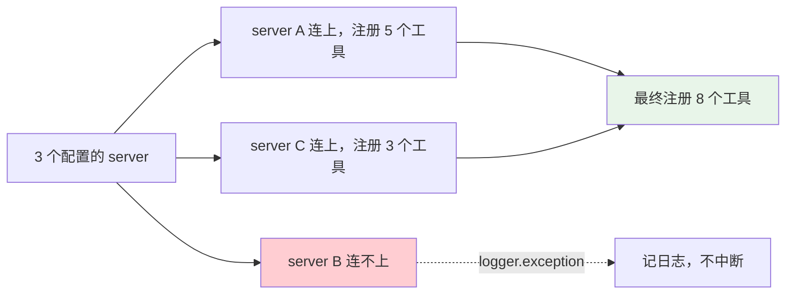

两条边界：

- **一个坏 server 不影响其余的**
- **这个模块不碰执行容器**——它返回 client 列表，由调用方决定所有权（`owns_mcp_clients`）

第二条是层边界的体现：MCP 注册不该知道谁负责关这些连接。

### 9.1 配置字段

`mcp_servers` 是 profile 配置里的一个列表，每项一个 server。字段全集：

| 字段 | 适用传输 | 类型 | 默认 | 说明 |
|---|---|---|---|---|
| `type` | both | str | 推断 | `stdio` / `http` / `streamable_http`；`-` 会被换成 `_` |
| `name` | both | str | 无 | 决定工具名前缀 `mcp_{name}` |
| `alias` | both | str | 无 | `name` 的备选写法，二者取其一 |
| `command` | stdio | list[str] | 无 | 非空列表才有效，否则整项被跳过 |
| `env` | stdio | dict | 无 | 显式授予子进程的环境变量，会**覆盖**白名单同名键 |
| `url` | http | str | 无 | 非空字符串才有效 |
| `headers` | http | dict | 无 | 自定义请求头（通常放 `Authorization`） |
| `timeout` | http | number | `30.0` | 单次 HTTP 读超时秒数 |

一份合成的完整示例：

```yaml
mcp_servers:
  - name: fs
    type: stdio
    command: ["npx", "-y", "@modelcontextprotocol/server-filesystem", "/tmp"]
    env:
      FS_ROOT: /tmp
  - name: remote
    type: streamable-http          # 连字符写法同样接受
    url: https://mcp.example.com/mcp
    headers:
      Authorization: "Bearer <token>"
    timeout: 45
```

### 9.2 类型推断与归一化

```python
transport_type = str(config.get("type") or "").strip().lower().replace("-", "_")
if not transport_type:
    transport_type = "streamable_http" if config.get("url") else "stdio"
```

两条便利设计：

- **归一化**：`strip().lower().replace("-", "_")`，所以 `Streamable-HTTP`、`streamable_http`、` STREAMABLE-HTTP ` 都识别为同一种。MCP 生态里两种写法都有人用，这里不挑刺。
- **省略推断**：不写 `type` 时，**有 `url` 就是 HTTP，否则是 stdio**。绝大多数配置因此可以少写一行。

### 9.3 三种无效配置，两种下场

这是个容易踩的不一致，值得单独记：

| 情况 | 行为 | 用户看到什么 |
|---|---|---|
| `stdio` 但 `command` 缺失/非列表/空 | `return None` → **静默跳过** | 工具没出现，日志里没有这一条 |
| `http` 但 `url` 缺失/非字符串/空 | `return None` → **静默跳过** | 同上 |
| `type` 是无法识别的值 | `raise ValueError` → 被外层捕获并 `logger.exception` | 日志里有明确报错 |

前两种返回 `None`，`register_configured_mcp_tools` 里 `if transport is None: continue` 直接跳过——**不记日志**。所以配置里少写一个 `command`，表现是"这个 server 就像不存在一样"，排查时容易困惑。

第三种反而更友好，因为拼错的 `type` 会抛异常，被外层 `except Exception` 接住并写进日志。

> **排错提示**：MCP 工具没出现又没有任何日志，先检查 `command` 是不是空列表或写成了字符串（YAML 里 `command: npx foo` 是字符串，不是列表，会被静默跳过）。

### 9.4 工具名前缀

```python
def mcp_tool_prefix_from_config(config: dict) -> str:
    name = config.get("name") or config.get("alias")
    if isinstance(name, str) and name:
        return f"mcp_{name}"
    return "mcp"
```

`name` 优先，`alias` 兜底，都没有就退化成裸 `mcp`。这意味着**两个都没配 `name` 的 server 会共享 `mcp` 前缀**——它们的同名工具就要靠 §6.1 的哈希后缀去重了。配了 `name` 不只是好看，是在避免撞名。

### 9.5 日志摘要的四类脱敏

`mcp_server_log_summary()` 是唯一允许把 server 配置写进日志的通道。它的 docstring 说明了危险来源：

> `command` reduces to its executable name and `url` strips any query string and embedded credentials: command arguments and URL query parameters **routinely carry tokens** that must never reach a log.

| 字段 | 处理 | 结果示例 |
|---|---|---|
| `command` | `_redact_command` → 只留 `argv[0]` | `["npx","-y","@x/server","--key=SECRET"]` → `"npx"` |
| `url` | `_redact_url` → 剥 query、fragment、userinfo | `https://u:p@h/mcp?token=X` → `https://h/mcp` |
| `headers` | **只留排序后的键名** | `{"Authorization": "Bearer X"}` → `["Authorization"]` |
| `env` | **只留排序后的键名** | `{"API_KEY": "X"}` → `["API_KEY"]` |
| `type` / `name` / `alias` / `timeout` | 原样保留 | 这四个不含凭据 |

`headers` 和 `env` 只记键名是很聪明的取舍：排错时你需要知道"有没有传 Authorization"，但永远不需要知道它的值。

`_redact_url` 里还藏了一个边界处理：

```python
try:
    netloc = f"{host}:{parsed.port}" if parsed.port else host
except ValueError:
    # Malformed port in the netloc: keep the host only, never the
    # credentials, and never fail the redaction path on user input.
    netloc = host
```

访问 `parsed.port` 在端口号畸形时（`https://h:99999/`）会抛 `ValueError`。如果不接住，**脱敏函数本身会崩溃**——而它崩溃的场景恰恰是在记录一条含凭据的日志。注释里 "never fail the redaction path on user input" 说的就是这条：脱敏路径必须比它保护的数据更健壮。同样地，`urlsplit` 本身失败时返回 `"<invalid-url>"` 而不是原串。

### 9.6 两条注册路径，隔离粒度并不相同

`register_configured_mcp_tools` 有两条分支，走哪条取决于**有没有传 `session_pool` 且有没有 `session_id`**：

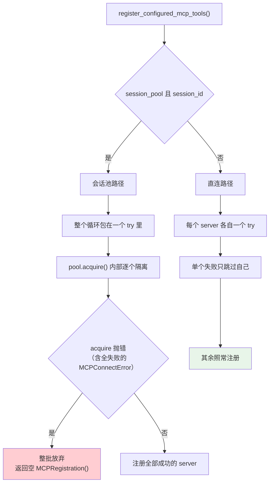

差别在哪：

| | 会话池路径 | 直连路径 |
|---|---|---|
| `try` 的粒度 | **整个循环一个** | **每个 server 一个** |
| 单个 server 连不上 | 在 `_connect_all` 内部被隔离，不影响其余 | 被自己的 `except` 接住，不影响其余 |
| 单个 server **注册**工具时抛错 | **整批丢失**，返回空注册 | 只丢这一个 |
| 全部连不上 | `MCPConnectError` → 整批放弃，**什么都不缓存** | 每个各记一条日志，返回 0 个工具 |

也就是说：**连接阶段两条路径的隔离粒度一样细，注册阶段则不同**。会话池路径里 `register_mcp_tools_with_prefix` 若对第二个 server 抛异常，第一个 server 已注册的工具会随着 `return MCPRegistration()` 一起被丢弃。

这不算 bug——注册阶段抛异常意味着工具注册表本身出了问题，整批放弃比留下半套工具更安全。但它和 §9 开头那句 "isolating failures so one broken server cannot prevent the rest" 只在**连接**语境下严格成立，读文档时值得分清。

### 9.7 `MCPRegistration`：一个冻结的返回值

```python
@dataclass(frozen=True)
class MCPRegistration:
    clients: tuple[Any, ...] = ()
    registered_tools: int = 0
```

两个细节：`frozen=True` 且 `clients` 是 **tuple 不是 list**。调用方拿到的是不可变快照，改不了也 append 不了——想管理连接就得回到 `session_pool`，而不是就地修改这个返回值。两个字段都有默认值，所以所有失败路径都能简单地 `return MCPRegistration()` 表示"什么也没注册"。

---

## 10. 类型与错误

```python
@dataclass
class MCPTool: ...

class MCPToolError(RuntimeError): ...        # 工具调用失败
class MCPConnectError(RuntimeError): ...     # 连接失败
class MCPSessionExpiredError(RuntimeError): ...  # HTTP 会话过期
```

`MCPSessionExpiredError` 是 Streamable HTTP 特有的——server 可以让 `Mcp-Session-Id` 失效，客户端要重新初始化而不是当成普通错误。

三个异常都继承 `RuntimeError` 而不是自定义基类。这样即使调用方只写了 `except RuntimeError`，也不会漏掉 MCP 的失败；想精细处理时再按具体类型分支。

| 异常 | 抛出时机 | 连接还能用吗 | 该驱逐吗 |
|---|---|---|---|
| `MCPToolError` | server 返回 `isError: true` | **能** | 否 |
| `MCPConnectError` | 配置的 server **全部**连接失败 | 没建立起来 | 无连接可驱逐 |
| `MCPSessionExpiredError` | HTTP 返回 404，`Mcp-Session-Id` 已失效 | **不能** | **是** |

`MCPConnectError` 的 docstring 点明了它的存在理由：

> Catchable by a session pool: **nothing is cached** for a fingerprint whose connect failed, so the caller can surface the failure instead of losing all MCP tools for the session.

它是一个专门为 §8.4 那个"空列表被缓存"陷阱设计的类型——用异常而不是返回值来表达"这次彻底失败了"，从根上杜绝了把失败结果当成功缓存的可能。

`MCPSessionExpiredError` 的 docstring 则规定了抛出前的义务：

> The transport **clears its stale session id before raising** so a later request can re-initialize.

先清 `_session_id` 再抛异常。顺序反了的话，即使上层驱逐重连，传输对象里还留着那个已失效的 session id，重新初始化时会带上它，server 再次返回 404——陷入死循环。

### 10.1 `is_fatal_connection_error`：驱逐还是重试

这个函数是整个容错模型的开关。它回答一个问题：**出错之后，这条连接还能不能用？**

```python
def is_fatal_connection_error(exc: BaseException) -> bool:
    if isinstance(exc, MCPSessionExpiredError):
        return True
    if isinstance(exc, RuntimeError):
        message = str(exc)
        if message in _STDIO_DEAD_CONNECTION_MESSAGES:
            return True
    return False
```

docstring 把两边都列清楚了：

> A session that expires server-side (HTTP 404), a stdio subprocess that closed stdout, and a framing-retired transport **can never serve another request**: the caller must drop and reconnect rather than retry against a dead connection. Tool-level failures (`MCPToolError`), timeouts, and other transient errors are **explicitly NOT fatal** — they do not evict.

| 判定 | 覆盖的情况 | 后果 |
|---|---|---|
| **致命** | HTTP 会话过期（404） | 驱逐 → 下次 acquire 重连 |
| **致命** | stdio 子进程关闭了 stdout | 同上 |
| **致命** | 传输因超限报废（framing broken） | 同上 |
| 非致命 | `MCPToolError`（工具自己报错） | 保留连接，正常返回错误文本给模型 |
| 非致命 | 超时 | 保留连接 |
| 非致命 | 其他一切 | 保留连接 |

**默认非致命**是这里最重要的取舍。判错方向不对称：

- 把致命错当成非致命：下一次请求撞上死连接，再报一次错，然后才被正确识别——**代价是一次多余的失败**。
- 把非致命错当成致命：每次工具报错都重启一遍全部 MCP 子进程——**代价是把一个正常的业务错误放大成全套连接重建**。

后者明显更糟，所以函数只在**三个确切已知**的情况下返回 `True`，其余一律 `False`。

### 10.2 用字符串集合判定死连接

```python
_STDIO_DEAD_CONNECTION_MESSAGES = frozenset({
    "MCP server closed stdout unexpectedly",
    "MCP stdio transport not connected",
    _FRAMING_BROKEN_MESSAGE,
})
```

用**异常消息的精确匹配**来判定连接是否死亡，看起来脆弱——改一个字就失效。但换个角度看，这是在没有为 stdio 定义专门异常类的前提下，代价最小的做法：

- 三条消息都是**本模块自己抛的**，不是第三方库的文本，不会因为依赖升级而变
- `frozenset` 保证不可变，且 `in` 是 O(1)
- 用的是 `==` 语义的精确匹配（`message in frozenset`），不是子串匹配——不会误伤包含这些词的其他错误

注释说明了两条消息为什么等价：

```python
# A dead subprocess surfaces as EOF, and a retired transport refuses all
# future requests.  Both mean the session must reconnect, not retry.
```

一个是子进程真的死了，一个是传输自己宣布报废（见 §4.2）。对调用方而言后果相同：**重连，别重试**。

如果将来要加第四种致命情况，正确做法是往这个 frozenset 里加常量、并让抛出点引用同一个常量——而不是在 `is_fatal_connection_error` 里写子串匹配。

### 10.3 严格的 JSON 校验

```python
def _require_json_object(value: Any, *, label: str) -> dict[str, Any]:
    if not isinstance(value, dict):
        raise RuntimeError(f"{label} must be a JSON object")
    return value

def _parse_json_object(payload: str, *, label: str) -> dict[str, Any]:
    try:
        value = json.loads(payload)
    except (json.JSONDecodeError, RecursionError) as exc:
        raise RuntimeError(f"{label} contains invalid JSON") from exc
    return _require_json_object(value, label=label)
```

**每一处解析都带 `label`**，所以错误信息能说清是哪一步的哪个字段出了问题——而不是一个孤零零的 `JSONDecodeError`。

两个细节值得单独说。

**① 为什么要接 `RecursionError`。** 合法 JSON 也能打垮解析器：`[[[[[...]]]]]` 嵌套几万层，语法完全正确，但 `json.loads` 是递归下降实现，会直接撞穿 Python 的递归深度限制抛 `RecursionError`。它继承自 `RuntimeError`，**不是** `json.JSONDecodeError`，只写 `except json.JSONDecodeError` 会漏。

漏了的后果不是"解析失败"这么简单：`RecursionError` 会沿调用栈一路上抛，而此时栈已经接近耗尽，沿途任何一个 `except` 块或 `finally` 里的函数调用都可能再次触发递归错误。一个恶意或有 bug 的 MCP server 只要回一行深度嵌套的 JSON，就能让整个请求处理路径以难以预料的方式崩掉。接住它并转成普通 `RuntimeError`，等于**把栈溢出降级成一次普通的协议错误**——连接照常按 §8.1 的规则判定是否致命。

注意这里防的是**深度**不是**体积**：§4 的 1 MB 字节上限对此完全无效，因为 `[` 只占一个字节，1 MB 足够嵌套五十万层。这是"四道边界"之外的第五道防线，也是为什么字节上限不能是唯一防护。

**② `from exc` 保留了原始异常。** 抛出的是干净的 `RuntimeError`，但 `__cause__` 链上挂着真正的 `JSONDecodeError`（含出错的行列位置）。日志里 `logger.exception` 会把整条链打出来，排错时既有"哪一步失败"（label），也有"第几个字符出错"（原始异常）。

**③ 两个函数分开的理由。** `_require_json_object` 校验的是**已经解析好的值**，用在响应体里嵌套字段的检查（比如 `result` 必须是对象）；`_parse_json_object` 校验的是**原始文本**。分开之后，已经在内存里的对象不必先序列化再解析一遍。两者共用同一套 `label` 约定，所以错误信息风格统一。

---

## 11. `MCPClient`：薄到几乎透明

`MCPClient` 是传输之上唯一的一层，全类只有 120 行，四个公开方法。它的薄是有意的——协议语义在这里，字节处理在传输里，两者不混。

```python
def __init__(self, command=None, env=None, *, transport=None):
    if transport is None:
        if command is None:
            raise ValueError("MCPClient requires a command or transport")
        transport = StdioMCPTransport(command, env=env)
```

构造函数接受两种形态：给 `transport` 用现成的，给 `command` 则**自动包一个 stdio 传输**。后者是便利路径，测试和早期代码用得多；生产路径都走 `config.py` 显式构造传输。两个都不给直接抛 `ValueError`——不存在"默认连到某处"的隐式行为。

### 11.1 `connect()` 的失败清理

```python
await self._transport.connect()
try:
    result = await self._send("initialize", {...})
    # …校验协议版本…
    await self._notify("notifications/initialized", {})
except BaseException:
    try:
        await self.close()
    except BaseException:
        log.warning("failed to close MCP transport after connect failure", exc_info=True)
    raise
```

握手失败**必须关掉已经建立的传输**，否则 stdio 的子进程会活着但没人跟它说话——一个孤儿进程。这里的两层 `BaseException` 同样是为了覆盖 `CancelledError`。

内层那个 `except BaseException` 尤其重要：如果 `close()` 自己也失败了，**原始的握手错误不能被它顶掉**。用户需要看到的是"协议版本不支持"，不是"关闭传输失败"。记一行 warning，然后 `raise` 把原异常抛出去。

注意 `self._transport.connect()` 在 `try` **之外**。传输都没连上时无需清理，此时抛出的是传输自己的错误。

### 11.2 协议版本的双向校验

```python
protocol_version = result.get("protocolVersion")
if not isinstance(protocol_version, str) or protocol_version not in SUPPORTED_PROTOCOL_VERSIONS:
    raise RuntimeError(f"Unsupported MCP protocol version: {protocol_version!r}")
self.protocol_version = protocol_version
```

客户端在请求里声明 `PROTOCOL_VERSION`（`2025-11-25`），但**接受 server 回的任意一个受支持版本**——协议允许 server 降级协商。校验有两步：先确认是字符串（防 server 回个 `null` 或数字），再确认在 `SUPPORTED_PROTOCOL_VERSIONS` 这四个之内。

通过之后 `self.protocol_version` 被**改写成协商后的实际版本**，而不是保留客户端的期望值。后续所有请求都按这个版本走。`{protocol_version!r}` 用 `repr` 而非 `str`，所以错误信息里能看出到底是 `None`、`""` 还是某个未知字符串——排错时这个区别很关键。

### 11.3 `call_tool` 的错误约定

```python
result = await self._send("tools/call", {"name": name, "arguments": arguments})
content = _content_to_text(result.get("content", []))
if result.get("isError") is True:
    raise MCPToolError(content or f"MCP tool failed: {name}")
return content
```

三处值得看：

- **`is True` 而不是 truthy 判断**。MCP 的 `isError` 是布尔字段；写成 `if result.get("isError"):` 的话，server 回一个非空字符串 `"false"` 也会被当成出错。严格比较避免了这类协议噪声。
- **出错时也先把 content 转成文本**，因为错误详情就装在 content 里。`raise MCPToolError(content or ...)` 优先用 server 给的说明，为空才退回通用文案。
- **成功和失败走同一条内容提取路径**，所以模型无论如何都能拿到 server 想说的话。

### 11.4 `to_openai_schemas`：广告名必须等于注册名

```python
def to_openai_schemas(self, tools, *, prefix="mcp") -> list[dict]:
    schemas, taken = [], set()
    for tool in tools:
        registered_name = _mcp_registered_name(prefix, tool.name, taken)
        if registered_name is None:
            continue
        taken.add(registered_name)
        schemas.append({"type": "function", "function": {...}})
```

这个方法把 MCP 工具转成 OpenAI 函数调用格式。它**复用了和注册完全相同的名字生成路径**——同一个 `_mcp_registered_name`、同一套 `taken` 去重集合。docstring 明说了理由：

> Names follow the same per-prefix, de-duplicated path as `register_mcp_tools_with_prefix` so **advertised names always equal the names actually registered**. Pass the same prefix used for registration.

如果两边各写一套名字逻辑，撞名时的哈希后缀就可能不一致：模型看到的是 `mcp_fs_read_a1b2c3d4`，注册表里却是 `mcp_fs_read_e5f6a7b8`，模型每次调用都报"工具不存在"。**共用同一个函数**是唯一能保证两边永远一致的做法。

最后那句 "Pass the same prefix used for registration" 是给调用方的义务：prefix 不同，生成的名字也不同，一致性就断了。

---

## 12. 已知限制

`CLAUDE.md` 的记录与实测结论：

| 项 | 状态 |
|---|---|
| **stdio 单条消息 1 MB 硬墙** | 超限即报废传输，需重连 |
| **工具名长度** | 归一化到 64 字符内；实测遇到过 113 字符的原始名 |
| **server → client 消息** | 当前实现**不处理**服务端主动发起的请求 |
| **lazy-load / HTTP 重连 / Resources** | 历史记录里提过，**代码里不存在** |

最后一条值得强调：早期的记录里写过"已实现 MCP lazy-load、HTTP 自动重连、Resources 支持"，但**代码里找不到这些机制**。这正是 `CLAUDE.md` 那句 "Trust code over docs" 的由来。

**server → client 消息为什么没做。** MCP 协议允许 server 反向发起请求（`sampling/createMessage` 让 server 借用客户端的模型、`roots/list` 问客户端要工作目录）。当前实现看得见这些消息——`_response_from_sse_stream` 会把 id 对不上的消息记进 debug 日志——但**不回应**。

不做的理由是这两个方法都在**扩大信任面**：`sampling` 等于让一个远程 server 支配你的模型配额和上下文，`roots` 等于把本地目录结构告诉它。而 §6.3 已经确立了相反的方向——远程 server 的自述一律不可信、每次调用都要审批。在没有一套"哪个 server 能借用什么能力"的本地授权模型之前，实现它们只会开一个和现有安全取向矛盾的口子。**不实现比实现了再限制更安全**，这也是为什么它被记在"已知限制"而不是"待办"里。

---

## 13. 参数速查

| 参数 | 值 |
|---|---|
| 声明协议版本 | `2025-11-25` |
| 接受协议版本 | 4 个（2024-11-05 起） |
| 客户端标识 | `agent-smith` / `0.2.0` |
| 单条消息上限 | 1 MB |
| 整流上限 | 64 MB |
| 请求墙钟 | 600 秒 |
| 单次读超时 | `min(30, 剩余时间)` 秒 |
| 工具列表最大页数 | 100 |
| 工具名最大长度 | 64 |
| 撞名后缀 | sha1(原名) 前 8 位 |
| 子进程环境变量白名单 | 6 个 |
| 传输实现 | stdio、Streamable HTTP |

---

## 14. 两种传输的对比

| 维度 | stdio | Streamable HTTP |
|---|---|---|
| 连接形态 | 子进程（`asyncio.create_subprocess_exec`） | `httpx` 客户端 |
| 消息帧 | **逐行 JSON**（无长度前缀） | HTTP body 或 SSE 事件 |
| 会话标识 | 进程本身 | `Mcp-Session-Id` 响应头 |
| 超限后果 | **整条传输永久报废** | 单次请求失败，连接可复用 |
| 死连接信号 | stdout EOF | HTTP 错误 / 会话过期 |
| 环境隔离 | 6 个环境变量白名单 | 不适用 |
| stderr 处理 | `_drain_stderr()` 单独排空 | 不适用 |
| 杀进程后的收尾 | `_drain_stdout_after_kill()` | 不适用 |
| 典型部署 | 本机 npm/pip 包 | 远端服务 |

### 14.1 stdio 特有的两个排空函数

```python
@staticmethod
async def _drain_stderr(stream: asyncio.StreamReader) -> None: ...

@staticmethod
async def _drain_stdout_after_kill(process: asyncio.subprocess.Process) -> None: ...
```

**`_drain_stderr`**：MCP server 的 stderr 是日志通道。不排空它，管道缓冲区满了之后**子进程会在写日志时阻塞**——一个只是话多的 server 会变成一个挂住的 server。

**`_drain_stdout_after_kill`**：杀进程后要把 stdout 里剩下的数据读完再关，否则子进程可能在 `write()` 上收到 SIGPIPE 而不是干净退出。

这两个函数是"和子进程打交道"的标准税，和 Shell 侧处理 `uv run uvicorn` 的进程组信号属于同一类。

### 14.2 HTTP 的会话粘连

```python
def _capture_session(self, headers: Any) -> None: ...
def _request_headers(self, *, accept: str, include_protocol: bool) -> dict[str, str]: ...
```

Streamable HTTP 的 server 可以在响应里给一个 `Mcp-Session-Id`，之后的请求都要带上它。`_capture_session()` 抓这个头，`_request_headers()` 在后续请求里回填。

`include_protocol` 参数控制要不要带协议版本头——**握手请求本身不能带**（那时还没协商出版本），之后的请求要带。

`MCPSessionExpiredError` 对应 server 让会话失效的情况：这时要**重新初始化**而不是当成普通错误重试。

---

## 15. 接一个 MCP server 的实操

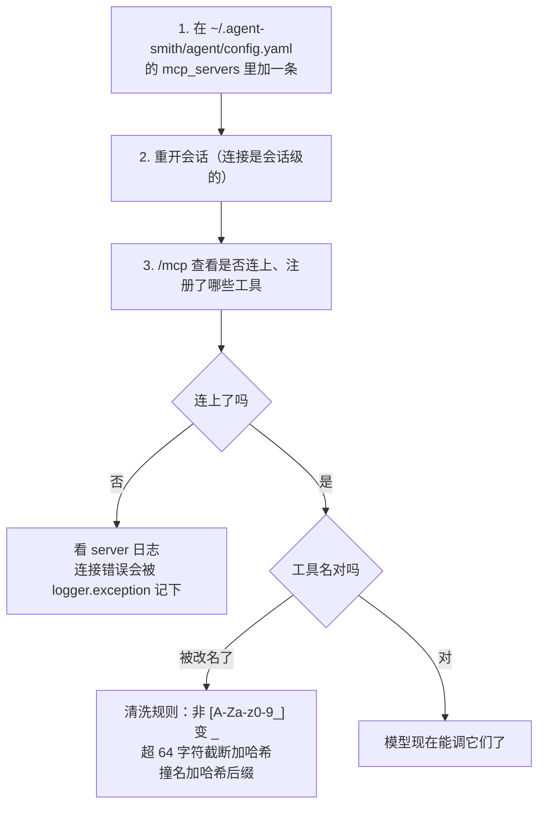

四个常见问题：

| 症状 | 原因 |
|---|---|
| server 连上了但工具名很怪 | 名字被清洗/截断/去重了，见 §6 |
| 某个工具完全没出现 | 名字清洗后变成空字符串（比如全是中文或符号） |
| 改了配置没生效 | 连接是**会话级**的，要开新会话或让池驱逐 |
| server 挂住不返回 | 600 秒墙钟会终结它，但那之后传输报废需重连 |

---

## 16. 设计取舍

**① 四道边界，每道防一种失效。** 单消息、整流、墙钟、分页。墙钟是后加的，因为前三道都拦不住"涓流"。

**② 超限即报废传输而不是重试。** 逐行 JSON-RPC 没有帧长度前缀，中途放弃读取会让流永久失同步。

**③ 区分"该重连"和"该重试"。** 三种死连接消息构成一个显式集合，判错了只是浪费时间。

**④ 工具名清洗有损，所以要处理撞名。** 而且只给真正撞的加后缀，保住其余名字的可读性。

**⑤ 注册和广告用同一个命名函数。** 否则模型会调一个不存在的名字。

**⑥ 子进程环境白名单。** 一个 MCP server 不该看到宿主的全部环境变量。

**⑦ 故障逐 server 隔离。** 一个坏 server 不能让其余的都注册不上。

**⑧ 这一层不管所有权。** 返回 client 列表，由调用方按 `owns_mcp_clients` 决定谁关。

---

## 17. 测试锁住了什么

`engine/tests/mcp/` 两个文件、**51 个测试**（client 43 + session_pool 8）。测试名在这里几乎就是行为规格——想确认某条设计是不是真的成立，读测试名比读实现快。

| 本文章节 | 对应测试 |
|---|---|
| §2 协议版本协商 | `connect_rejects_unsupported_protocol_version` |
| §3.1 环境隔离 | `stdio_transport_does_not_inherit_parent_credentials`、`forwards_explicitly_configured_variables`、`merges_env_with_parent_environment` |
| §3.2 日志脱敏 | `stdio_transport_label_logs_executable_only`、`http_transport_label_redacts_query_and_credentials` |
| §4 四道边界 | `raises_when_response_stream_exceeds_budget`、`rejects_oversized_json_response`、`reads_response_above_default_stream_limit` |
| §4 墙钟（滴流） | `sse_stream_bounds_a_slow_event_drip_by_time`、`stdio_transport_bounds_a_slow_notification_drip_by_time` |
| §4.2 报废后不再服务 | `stdio_transport_retires_itself_after_an_oversized_response` |
| §5 分页与游标 | `limits_tool_list_pages`、`rejects_repeated_tool_list_cursor` |
| §5 宽容校验 | `list_tools_skips_malformed_entries` |
| §6 名字清洗/截断/去重 | `openai_schema_helper_sanitizes_tool_names`、`tool_names_are_capped_with_stable_hash_suffix`、`registration_rejects_non_ascii_tool_names`、`openai_schemas_deduplicate_colliding_names` |
| §6.3 强制审批 | **`registered_mcp_tools_always_require_approval`** |
| §6.5 驱逐回调 | `registered_mcp_tool_evicts_dead_connection_before_re_raise` |
| §6.6 坏工具不拖累好工具 | `registration_skips_bad_tool_and_keeps_good_tool` |
| §8.2 会话锁不互相阻塞 | `session_pool_does_not_block_another_session_during_connect` |
| §8.3 弱引用不留锁 | **`session_pool_does_not_retain_inactive_session_locks`** |
| §8.4 全失败抛错且不缓存 | **`session_pool_connect_all_fail_surfaces_typed_error_and_does_not_cache`** |
| §8.4 部分失败仍保留 | `session_pool_keeps_healthy_servers_when_other_connects_fail` |
| §8.5 配置变更触发替换 | `session_pool_replaces_connections_when_server_config_changes` |
| §8.6 驱逐后重连 | `session_pool_evict_drops_cached_connections_and_next_acquire_reconnects` |
| §8.7 关闭等待在途连接 | **`session_pool_close_waits_for_an_inflight_connect`** |
| §9.5 配置摘要脱敏 | `server_log_summary_redacts_command_args_and_url_query`、`redacts_secret_values` |
| §9.6 不碰执行容器 | `configured_mcp_registration_returns_clients_without_runtime_container` |
| §10.1 致命错误分类 | `is_fatal_connection_error_classifies_transport_deaths` |
| §10.3 严格 JSON 校验 | `rejects_non_object_jsonrpc_response`、`rejects_non_object_mcp_result` |
| §11.1 握手失败清理 | `connect_closes_transport_when_initialize_fails` |
| §11.3 `isError` 约定 | `mcp_tool_is_error_becomes_registry_error` |
| §11.4 广告名 = 注册名 | **`openai_schemas_match_registered_names_for_prefix`** |

加粗的六个是**只要改坏就一定会红**的关键测试——它们锁住的都是本文里最容易在重构中被无意破坏的性质：强制审批、锁不泄漏、失败不缓存、关闭不截断在途连接、两套名字必须一致。

还有三个测试覆盖了正文没展开的 stdio 进程管理细节：

| 测试 | 锁住的行为 |
|---|---|
| `stdio_transport_serializes_concurrent_requests` | 共享管道上的请求必须串行，否则两个等待者会互相吃掉对方的响应 |
| `stdio_transport_cancellation_kills_and_reaps_process` | 取消时不只是 kill，还要 **reap**——否则留下僵尸进程 |
| `stdio_transport_waits_after_killing_timed_out_process` | 超时 kill 之后要等进程真正退出，不能立刻返回 |
| `stdio_transport_drains_server_stderr_before_response` | stderr 必须持续排空，否则管道写满会让子进程阻塞在写 stderr 上，看起来像"server 卡住了" |

最后一条是很典型的子进程陷阱：父进程不读 stderr，子进程写满 64 KB 管道缓冲区后就永久阻塞——症状是 MCP server 毫无反应，但进程还活着。

---

## 18. 接下来

| 想深入 | 读 |
|---|---|
| MCP 工具怎么进工具注册表 | [04 · Engine 核心执行](20-Agent-Loop.md) §6 |
| 连接池的所有权语义 | [03 · 架构总览](../architecture/10-系统架构.md) §2.3 |
| 怎么配置 MCP server | [02 · 快速上手](../guide/02-快速上手.md) §11 |
| 沙箱的同类环境白名单 | [06 · 安全与安全边界](23-工具与安全.md) §9.1 |
