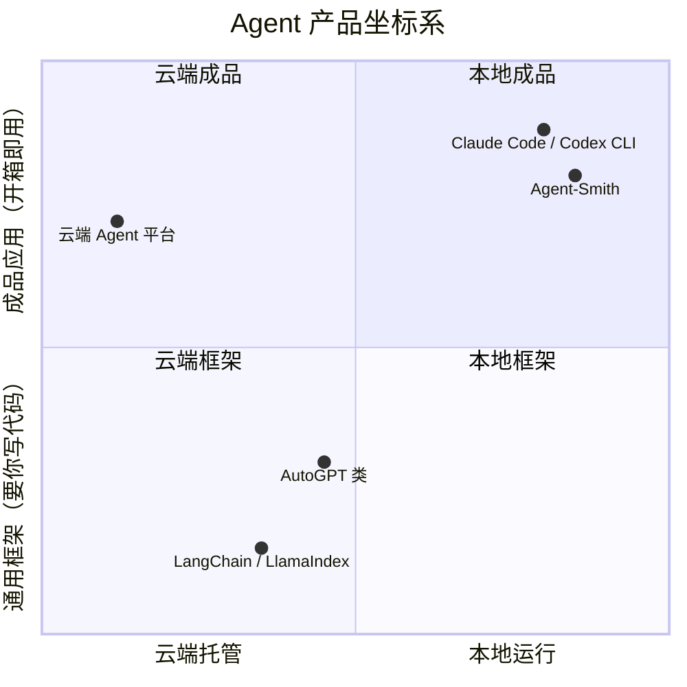
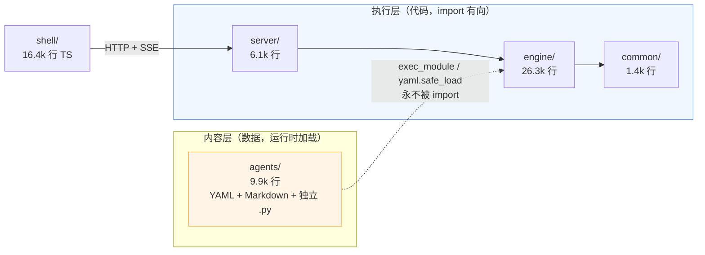
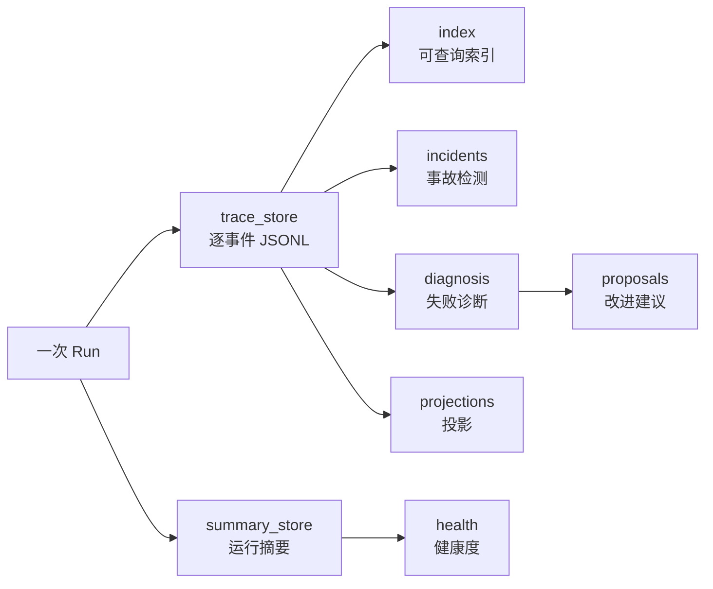
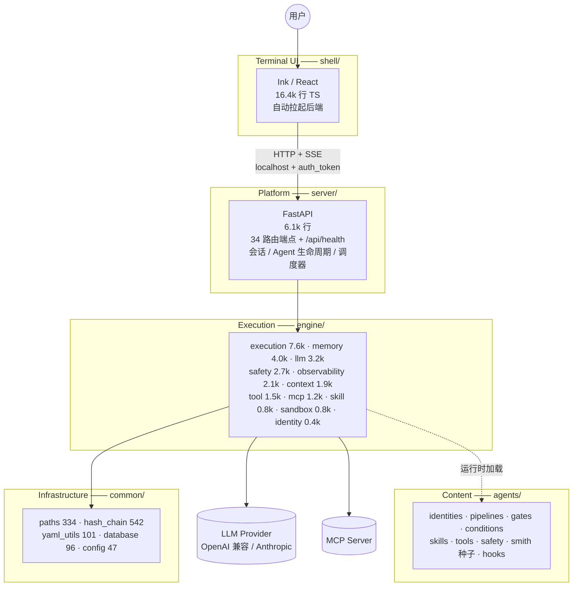
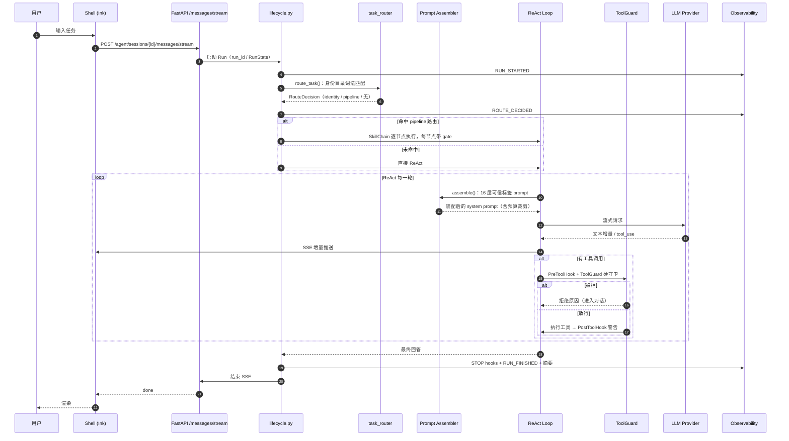
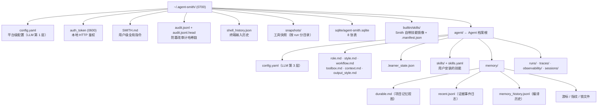
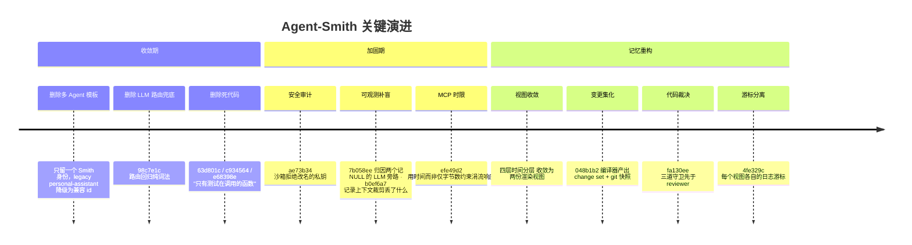

# 01 · 总览

> **定位**：Agent-Smith 是一个**本地优先（local-first）的单 Agent 终端工作台**。它不是一个 Agent 框架，也不是一个云端平台——它是一个能长期驻留在你机器上、跨会话累积记忆、按任务类型切换工作流的助手程序。
> **适合**：第一次接触这个仓库的人；想判断"这套设计值不值得抄"的人。

---

## 1. 一句话定位

> Agent-Smith 是一个本地 Agent 工作台。Smith 是你唯一的常驻助手——它保留上下文、跨会话累积记忆、通过 skill 切换工作流。

三个词组决定了全部架构：

| 词组 | 落到架构上的含义 |
|------|-----------------|
| **本地优先** | 所有状态落在 `~/.agent-smith`，一个 SQLite 文件 + 若干 Markdown/JSONL。没有服务端账号、没有远程数据库、没有向量服务 |
| **单 Agent** | 没有子 Agent、没有 Agent 间路由、没有编排器。一次运行只有一个 ReAct 循环在跑（管线模式下是"一个循环跑多个节点"，不是"多个 Agent"） |
| **skill 切换工作流** | 能力扩展的唯一正确姿势是加 `SKILL.md`，不是加 Agent、不是加代码分支 |

---

## 2. 它解决什么问题——和三类东西的边界

Agent-Smith 的定位只有放在坐标系里才清楚。



### 2.1 和云端 Agent 平台的区别

云端平台（Dify、Coze、各家 Assistant API）把 Agent 做成**多租户服务**：租户隔离、向量库、Redis 队列、消息中间件、水平扩容。Agent-Smith 把这一整套全部删掉了：

- 没有租户概念——机器就是边界
- 没有队列——`asyncio.create_task` 就是队列（`server/app/services/scheduler.py`）
- 没有 Redis——SQLite 的 `lease_until` / `lease_token` 两列就是分布式锁（`server/app/infrastructure/schema.py` 的 `auto_tasks` 表）
- 没有向量库——记忆是两个 Markdown 文件，整份注入

代价是显式的：**不能多人共享，不能横向扩容，记忆容量受 prompt 预算硬约束**。收益也是显式的：**没有一行代码在处理不存在的并发**，整个后端 6.1k 行就能跑完全流程。

### 2.2 和 Claude Code / Codex CLI 的区别

同为终端 Agent，Agent-Smith 的差别在三处：

| 维度 | Claude Code / Codex CLI | Agent-Smith |
|------|------------------------|-------------|
| 记忆 | 会话内上下文 + 手工维护的 `CLAUDE.md` | 会话内上下文 + **自动编译的两份记忆视图**（`context.md` / `durable.md`），由带证据裁决的编译管线产出 |
| 工作流 | skill/命令被动匹配，不成链 | 三条**声明式技能链**（`agents/pipelines/*.yaml`），每个节点带门禁（gate），门禁不过就带反馈重试 |
| 后端 | 单进程 | Shell 与 Engine 分离，中间隔一层本地 FastAPI（HTTP + SSE），Shell 自动拉起后端 |

第三点是最容易被质疑的："为什么终端应用要跑个 HTTP 服务？"答案在 §7.2。

### 2.3 和 LangChain 类框架的区别

框架卖的是**可组合的抽象**：你写 Chain、写 Tool、写 Memory 类。Agent-Smith 卖的是**已经装好的机器**：ReAct 循环、工具注册表、安全守卫、记忆管线都是固定件，你只往里放**内容**（YAML + Markdown + 一个 `execute` 函数）。

这就是 `agents/` 这一层存在的意义——它是"内容层"，不 import 任何其它层：

```python
# agents/tools/*.py 的全部契约（engine/tool/registry.py 通过 exec_module 加载）
TOOL_META = {...}          # 名字、描述、参数 schema、风险等级
def execute(...): ...      # 干活
```

没有基类，没有装饰器，没有类型依赖。所以 `agents/` 里拿不到 `common/paths.py` 的路径常量，只能重复推导路径——这是**故意付的代价**，换来内容层可以被任意替换、复制、分发。

---

## 3. 六条设计哲学

这一节是全部文档里最值得先读的部分。后面每一个子系统的设计，都是这六条的推论。

### 3.1 Local-first：机器就是信任边界

`common/paths.py` 是运行时数据根的唯一真相源，它做的事远超"拼个路径"：

```python
PRIVATE_DIR_MODE = 0o700
PRIVATE_FILE_MODE = 0o600
```

- **权限强制**：每个受管目录 `mkdir(mode=0o700)` 后再 `chmod(0o700)`（`_ensure_private_dir`）。因为 `mkdir` 的 mode 会被 umask 削弱，只有显式 `chmod` 才保证结果。
- **软链拒绝**：`_ensure_real_path()` 逐段遍历路径，**任何一段是 symlink 就抛异常**。这堵的是"把 `~/.agent-smith/agent` 换成指向 `/etc` 的软链，然后诱导 Agent 写文件"这类攻击。
- **项目根签名校验**：`_is_agent_smith_root()` 要求同时存在 `agents/smith/config.yaml`、`agents/identities/smith.yaml`、以及至少一个 `agents/skills/*/SKILL.md`。只看有没有 `agents/` 目录会把别人的项目误认成 Agent-Smith 的根。

这些不是过度设计——`engine/safety/tool_guard.py` 的**不可绕过的平台写保护**就锚在这个路径根上。如果路径根能被软链劫持，整个安全模型就没了。

### 3.2 单 Agent：拒绝多 Agent 编排

`CLAUDE.md` 把这一条写成了产品语言禁令：

> Use: "Smith", "Agent", "skill", "session", "memory", "tool", "template"
> Avoid: "sub-agent", "employee", "digital employee", "hire"

技术上的理由是：多 Agent 编排的收益（并行、专精）在**本地单用户场景**下几乎为零，而代价（上下文复制、prefix cache 失效、错误归因困难、成本翻倍）是实打实的。

`AGENTS.md` §10 里记了一条重要的未来约束——如果将来真要做委派：

> 每一个被委派或旁路查询的 Agent 必须从父 Agent 继承**不可变、逐字节缓存对齐的前缀**：system/developer prompt、工具定义、模型配置、消息前缀、推理配置。任务相关的委派数据只能放在共享前缀之后的后缀里。

这条约束的本质是：**多 Agent 的成本必须由 prefix cache 吃掉，否则不做**。

### 3.3 Harness 优先，而非 Prompt 优先

"Harness"指的是包在模型外面的那套机器：循环、工具、门禁、预算、守卫。Agent-Smith 的一个反复出现的模式是——**能用确定性代码判定的，绝不交给模型判定**。

三个最典型的例子：

| 场景 | 反模式（Prompt 优先） | Agent-Smith 的做法 |
|------|---------------------|-------------------|
| 记忆写入是否可信 | 让 reviewer 模型判断这条记忆有没有证据 | `engine/memory/_guards.py` 用**三道确定性守卫**先裁决（引用是否真实存在、quote 是否逐字、留存规则、放置规则），只把幸存的变更给模型看 |
| 任务该走哪条工作流 | 用一个分类器模型判断意图 | `engine/identity/catalog.py` 纯**词法关键词/示例匹配** + 优先级，没有 LLM 兜底（提交 `98c7e1c refactor(routing): delete the LLM fallback the docs still promised`） |
| 工具调用是否危险 | 在 system prompt 里写"不要 rm -rf" | `engine/safety/tool_guard.py` 1365 行的**硬守卫**，先于任何软挑战执行；有测试强制它排第一 |

路由那条尤其能说明取舍。曾经存在一个 LLM 兜底分类器，删掉的理由记在 `CLAUDE.md`：

> 在每次关键词未命中时都跑它，拖慢了普通 direct-ReAct 轮次，而且可能启动用户根本没要求的多步工作流。所以现在进入管线**必须**有一个声明过的、高置信度的意图。

即：**宁可漏路由（退回普通 ReAct），也不误路由（劫持成多步工作流）**。

### 3.4 内容与执行分离



依赖是单向的，并且**由 import 图验证，不是靠约定**。`agents/` 唯一的"被使用"方式是：

- `engine/tool/registry.py` 用 `importlib` 的 `exec_module` 执行 `agents/tools/*.py`
- `engine/identity/catalog.py` 用 `yaml.safe_load` 读 `agents/identities/*.yaml`
- `engine/skill/registry.py` 扫描目录里的 `SKILL.md`

### 3.5 Fail-closed 的安全默认

系统里所有"不确定"的分支都倒向拒绝：

| 位置 | fail-closed 表现 |
|------|-----------------|
| 工具白名单 | `agents/smith/config.yaml` 的 `tools.enabled` 是**严格白名单**，再与 identity 的 `tools.enabled` 取**交集**。未列入即调不到 |
| 自动任务 | `auto_tasks.working_dir` 迁移默认为 `''`，"保留行但让执行失败关闭，直到用户显式设置 working_dir"（`schema.py` 注释） |
| 记忆编译 | 全部变更被拒时**什么都不写**——"降级草稿会变成下一轮受信任的基线"（`CLAUDE.md`） |
| 路径根发现 | 找不到带签名的根就 `raise RuntimeError`，不猜 |
| 记忆守卫 | `work` 类证据**不能**建立 `Verified Outcomes` 条目（placement 守卫） |

### 3.6 可观测性是一等公民

`engine/observability/` 2100 行，比 `engine/tool/`（1527 行）还大。它不是"加个日志"，而是一套完整的运行档案系统：



而且它有**崩溃后自愈**：`server/app/main.py` 的 `lifespan` 启动时会 `recover_interrupted()` 找出上次崩溃留下的运行，再用 `_reconcile_startup_observability()` 补上丢失的终态事件——注释写得很清楚，它专门处理"崩溃发生在写 trace 之后、写 summary 之前"这个窗口。

---

## 4. 五层架构速览



层职责与硬规则：

| 层 | 目录 | 非测试行数 | 职责 | 硬规则 |
|---|---|---|---|---|
| 基础设施 | `common/` | 1.4k | 路径根、SQLite 连接、YAML 读写与合并、审计哈希链 | 零业务逻辑 |
| 执行 | `engine/` | 26.3k | LLM、ReAct + 管线、记忆、技能、工具、安全、可观测 | **不得知道 FastAPI、HTTP、Agent 实例管理** |
| 内容 | `agents/` | 9.9k | Smith 身份种子、管线、门禁、条件、工具、技能、钩子 | 不 import 任何其它层 |
| 平台 | `server/` | 6.1k | FastAPI 编排、会话/Agent 生命周期、34 端点 | `routers/` 保持薄：取参 → 调 service → 返回 |
| 终端 UI | `shell/` | 16.4k TS（含测试） | Ink 终端 UI、SSE 流式渲染、后端自启 | 只通过本地 HTTP 与 server 通信 |

> **计数口径**：行数按"消费方的判定标准"数，不是按目录列表数。`engine/tool/registry.py` 只接受同时定义了 `TOOL_META` 和 `execute` 的模块；一个 skill 只有当目录里有顶层 `SKILL.md` 才算数。

---

## 5. 一次请求的完整旅程



细节全在 [03 · 架构总览](./03-架构总览.md) 和 [04 · Engine 核心执行](./04-Engine-核心执行.md)。

---

## 6. 核心概念

按出现顺序，这些名字贯穿全部文档：

| 概念 | 定义 | 代码锚点 |
|------|------|---------|
| **Agent** | Smith 本身。运行时唯一实体，有一份档案（`agent_profiles` 表 + `~/.agent-smith/agent/`） | `server/app/services/agent_profile_service.py` |
| **Identity（身份）** | 一组「角色提示 + 工具白名单 + 技能白名单 + 路由声明」。目前两个：`smith`（默认）、`coding` | `agents/identities/*.yaml` |
| **Route（路由）** | 身份内声明的意图条目：`keywords` / `examples` / `pipeline` / `priority`。纯词法匹配 | `engine/identity/catalog.py` |
| **Pipeline（管线）** | 一条声明式技能链：若干 step，每 step 绑定 `skill` + `gate` + `allowed_tools` + `instructions` | `agents/pipelines/*.yaml` |
| **Gate（门禁）** | 节点产出的契约检查。不过则带 `CTX_RETRY_HINT` 重试该节点 | `agents/gates/`、`engine/execution/pipeline/gate.py` |
| **Skill（技能）** | 一个含顶层 `SKILL.md` 的目录，描述某类任务的工作方法 | `agents/skills/*/SKILL.md` |
| **Tool（工具）** | 一个定义了 `TOOL_META` + `execute` 的 Python 模块 | `agents/tools/*.py` |
| **Hook（钩子）** | 工具生命周期三段：`PreToolHook`（可阻断）、`PostToolHook`（只警告）、`StopHook`（回合末批处理） | `engine/execution/hooks/`、`agents/smith/hooks/` |
| **Run（运行）** | 一次任务执行。有 `run_id`、状态机、trace、摘要，可中断可恢复 | `engine/execution/orchestration/run_state.py` |
| **Session（会话）** | 一串消息 + 上下文摘要 + 模型档案绑定 | `sessions` 表 |
| **Memory（记忆）** | 两份渲染视图 `context.md` / `memory/durable.md`，整份注入 prompt；证据日志 `memory/recent.jsonl` | `engine/memory/` |
| **ChangeSet（变更集）** | 记忆编译器的输出单位。不是文档，是一组带证据的变更 | `engine/memory/_changeset.py` |
| **Dream** | 记忆维护周期：清洗渲染视图、回收过期证据前缀 | `engine/memory/dream.py` |

---

## 7. 技术选型与理由

### 7.1 全栈技术清单

| 层 | 技术 | 版本约束 | 用途 |
|---|---|---|---|
| 语言（后端） | **Python** | `>=3.11` | Engine / Server / 内容层工具 |
| 包管理 | **uv** | — | 三个可编辑本地包（`common` / `engine` / `server`）之间的路径依赖 |
| HTTP 框架 | **FastAPI** | `>=0.115` | 34 个端点 |
| ASGI 服务器 | **uvicorn[standard]** | `>=0.34` | Shell 用 `uv run uvicorn app.main:app` 拉起 |
| 流式 | **sse-starlette** | `>=2.2` | 逐 token 推送到终端 |
| 校验 | **pydantic[email]** | `>=2.10` | 请求/响应 schema |
| 数据库 | **SQLite + aiosqlite** | `>=0.21` | 8 张表，单文件 `~/.agent-smith/sqlite/agent-smith.sqlite` |
| HTTP 客户端 | **httpx** | `>=0.28` | LLM provider、web 工具、MCP HTTP 传输 |
| 配置 | **PyYAML** | `>=6.0` | 全部内容层与配置文件 |
| PDF | **pypdf** + **pdfplumber** | `>=6.0` / `>=0.11` | `read_pdf` / `render_pdf_page` 工具 |
| 分词计数 | **tiktoken** | `>=0.13` | Server 侧 token 统计 |
| 版本比较 | **packaging** | `>=26.2` | 版本判定 |
| 浏览器（可选） | **playwright** | `>=1.50` | `browser` 可选依赖组 |
| 语言（前端） | **TypeScript** | — | Shell |
| 终端 UI | **Ink / React** | ink 7 | 富终端渲染 |
| 运行时（前端） | **Node.js** | `>=22` | — |

### 7.2 为什么终端应用要跑本地 HTTP 服务

这是最容易被质疑的一条。理由有四：

1. **语言边界**。终端 UI 用 Ink/React 写体验最好（React 的 diff 模型天然适配终端重绘），执行层用 Python 写生态最好（LLM/PDF/沙箱）。两边必须有个协议，HTTP + SSE 是成本最低的那个。
2. **进程边界即崩溃边界**。UI 崩了不影响正在跑的 Run；Run 崩了 UI 还能显示诊断。`RunStateStore.recover_interrupted()` 就建立在"服务端有独立生命周期"这个前提上。
3. **流式天然**。SSE 把"逐 token 渲染"变成免费的——不需要在两个进程间自造帧协议。
4. **未来的多前端**。同一个 server 可以被 Web UI、编辑器插件复用。

代价也很明确，而且代码里能看到它们在被认真处理：

- **端口竞争**：`/api/health` 返回 `nonce`，回显启动器传入的 `SMITH_SERVER_NONCE`，让 Shell 分辨"这个端口上的 server 是不是我拉起来的"。手工启动的 server 返回 `null`，启动器视为"不是我的"。
- **代码陈旧**：`_running_stale_code()` 遍历 `sys.modules`，比较每个已加载源文件的 mtime 与进程启动时间。注释说得很直白——"一个只探测 API 形状的 shell 看不出来，因为每条路由都还在，于是修复可能在磁盘上躺几个小时而运行中的 server 还在跑它启动时的代码"。它还排除了 `.venv` / `site-packages` / `node_modules`，因为虚拟环境就在仓库里，`uv sync` 碰一下依赖会被误读成"工作树前进了"。
- **鉴权**：CORS 只允许 `localhost` / `127.0.0.1`（正则 `^https?://(localhost|127\.0\.0\.1)(:\d+)?$`），所有路由挂 `Depends(require_auth)`，token 存 `~/.agent-smith/auth_token`（`0o600`）。

### 7.3 为什么是 SQLite 而不是 Postgres

因为**没有并发写压力**。单用户、单机、一个 server 进程。真正需要互斥的只有自动任务的领取，用两列（`lease_until` / `lease_token`）就解决了：

```sql
-- server/app/infrastructure/schema.py:_reset_stuck_auto_tasks
UPDATE auto_tasks SET status='idle', lease_until=NULL, lease_token=NULL
WHERE status='running' AND (lease_until IS NULL OR lease_until <= ?)
```

注释解释了为什么不能无脑重置：共享 DB 可能被多个进程打开（server worker、CLI 会话、dev 热重载），重置一个**活着的** lease 会让第二个进程认领仍在执行的任务，导致同一条指令跑两遍。

另外两个细节值得抄：

- **时间戳统一格式**。所有默认值用 `strftime('%Y-%m-%dT%H:%M:%f+00:00','now')` 而不是 `datetime('now')`，因为后者产出 `YYYY-MM-DD HH:MM:SS`（空格分隔），和仓库层写入的 ISO-8601（`T` 分隔）混在一起会破坏 TEXT 排序。`_normalize_legacy_timestamps()` 幂等地把老行迁移过来。
- **迁移即代码**。没有 Alembic，只有一串 `_ensure_*_column()` 函数，每个先 `PRAGMA table_info` 再按需 `ALTER TABLE`。对单文件本地库来说，这比引入迁移框架便宜一个数量级。

### 7.4 为什么不用官方 LLM SDK

`engine/llm/adapters/` 直接用 `httpx` 手写了 OpenAI 兼容与 Anthropic 两个适配器（654 + 482 行，共享 `_http.py` 239 行和 `_retry.py` 45 行）。理由：

1. **SDK 的重试/超时策略不可控**。这里需要按用途区分超时（`INTERACTIVE` / `GATE` / `BACKGROUND` 三套 `connect` / `read` / `stream_read` / `write` / `pool` 参数）。
2. **中转站兼容性**。实测教训：中转站 `/v1/models` 列出的模型不等于能用，有的模型只走 Responses API。自己写适配器才能针对性处理。
3. **流式中断的精细处理**。提交 `586f92f fix(llm): retry a mid-stream provider overload on the OpenAI path`——SDK 通常把流当成不可重试的。
4. **可录制可回放**。`engine/llm/replay.py`（337 行）能把真实运行录成 JSONL 再回放。注释强调：**只写响应，绝不写 prompt**，所以录制文件不会泄漏对话内容，回放也不需要 prompt（按录制顺序供给，而不是匹配消息）。

### 7.5 为什么没有向量检索

记忆系统里**没有 embedding、没有 FTS 索引、没有 episodes 层、没有查询时检索**。两份视图整份注入。

理由是预算算术：记忆的 prompt 预算是 24k（`engine/memory/MEMORY_POLICY.md`）。在 24k 以内，"整份注入"和"检索 top-k 注入"的召回率差距，远小于"检索错了导致模型看不到关键事实"的损失。而且整份注入让记忆**可审计**——用户能直接打开 `durable.md` 看到 Agent 记住了什么。

`agents/smith/config.yaml` 里保留了一段被注释掉的可选语义检索配置：

```yaml
# knowledge:
#   embeddings:
#     enabled: true
#     base_url: https://api.openai.com/v1
#     model: text-embedding-3-small
#     api_key_env: OPENAI_API_KEY
```

注意它的措辞——"默认关闭；启用后**仅在 durable 已命中领域时**使用"。即便加了向量，它也只是既有视图的补充，不是替代。

### 7.6 为什么 Shell 用 Ink 而不是 blessed / textual

Ink 把终端当成 React 的渲染目标。对一个需要"流式追加 + 局部重绘 + 复杂面板"的 UI，React 的声明式模型省掉了大量手工光标管理。

但代价很真实，实践中踩到两条：

- **ink 6 的粘贴崩溃**（上游 issue #901）与 `Static` 重复重印，是升级到 ink 7 才修掉的；peer 依赖锁 `^6` 用 `overrides` 绕过（因为只用了 `Box` / `Text` / `useInput` 三个 API）。
- **Ink 的 `Box` 只 wrap 不裁剪**，所以超宽内容的断行行为无法用普通断言测到——必须用真 PTY（`script` + `stty -icrnl` 逐字符喂键）验证。

---

## 8. 数据落盘全景

一切状态都在 `~/.agent-smith`（`0o700`）：



### 8.1 SQLite 的 8 张表

| 表 | 作用 | 关键约束 |
|---|---|---|
| `agent_profiles` | Agent 档案 | `UNIQUE(name, role)`；建索引前先去重 |
| `sessions` | 会话 | `identity_id` / `model_profile` / `context_summary` / `context_summary_cutoff` |
| `messages` | 消息 | `role IN ('user','assistant','system')`；按 `session_id` 建索引 |
| `auto_tasks` | 自动任务 | `trigger_type IN ('manual','cron','interval')`；`lease_until` / `lease_token` 做租约 |
| `auto_task_runs` | 自动任务运行记录 | 崩溃重启时置 `failed` + `error='interrupted by restart'` |
| `token_usage_events` | Token 用量事件 | 全部计数列 `CHECK (>= 0)`；`source_key` 唯一索引做幂等导入 |
| `observability_trace_cursors` | trace 导入游标 | 按 `run_id` 记 `byte_offset` |
| `llm_generations` | 每次模型调用的细粒度指标 | 含 `cache_read_tokens` / `cache_write_tokens` / `reasoning_tokens` / `ttft_ms` |

`llm_generations` 这张表值得单独说：它把**缓存命中**和**首 token 延迟**当成一等指标记录，这是成本优化能落地的前提。

### 8.2 为什么内建技能要镜像一份

`~/.agent-smith/builtin/skills/` 是 `agents/skills/` 的镜像，理由写在 `common/paths.py:_install_builtin_skills` 的 docstring：

> `agent/skills` 保留给**用户安装**的技能。把自带技能放在 `builtin/skills` 下，让已安装的 Smith 保留默认能力，同时不把它们当成用户定制。

同步是**增量**的：manifest 记 `size` + 纳秒级 `mtime`，元数据一致就跳过；不一致才算 SHA-256 决定要不要恢复。还有一条防呆——如果源目录扫不出任何技能而目标里有内容，**拒绝用空源覆盖**并打 warning。

---

## 9. 模块地图

### engine/（26.3k 行，11 个子域）

| 子域 | 行数 | 职责 | 最大的文件 |
|---|---|---|---|
| `execution/` | 7.6k | ReAct 循环、运行编排、管线与技能链、钩子框架、路由 | `react/react_loop.py` 1386 |
| `memory/` | 4.0k | 两视图编译、守卫裁决、Dream、历史 | `compile.py` 879 |
| `llm/` | 3.2k | 配置解析、客户端、适配器、录制回放、用量 | `adapters/anthropic.py` 654 |
| `safety/` | 2.7k | ToolGuard、审批、事实门、工具策略、风险 | `tool_guard.py` 1365 |
| `observability/` | 2.1k | trace/summary 存储、事故、健康、诊断、建议 | `summary_store.py` 336 |
| `context/` | 1.9k | Prompt 装配、压缩、裁剪、预算、摘要 | `assembler.py` 792 |
| `tool/` | 1.5k | 工具注册表、账本、快照、截断 | `registry.py` 966 |
| `mcp/` | 1.2k | MCP 客户端、会话池、配置 | `client.py` 848 |
| `skill/` | 0.8k | 技能注册、加载、执行、存储 | `executor.py` 296 |
| `sandbox/` | 0.8k | macOS Seatbelt、宿主执行 | `macos_seatbelt.py` 491 |
| `identity/` | 0.4k | 身份目录与词法路由 | `catalog.py` 354 |

### server/（6.1k 行）

| 文件 | 行数 | 职责 |
|---|---|---|
| `services/session_service.py` | 845 | 聊天与执行的主入口 |
| `services/token_stats_service.py` | 684 | Token 统计与 trace 导入 |
| `services/auto_task_service.py` | 630 | 自动任务生命周期 |
| `services/config_service.py` | 555 | 配置读写 |
| `routers/agent.py` | 278 | 31 个端点 |
| `routers/config.py` | 105 | 3 个端点 |
| `infrastructure/schema.py` | 266 | 建表 + 迁移 |

### agents/（9.9k 行）

| 目录 | 内容 |
|---|---|
| `identities/` | `smith.yaml`（默认，1 条 `git` 路由无管线）、`coding.yaml`（3 条管线路由） |
| `pipelines/` | `requirements-research.yaml` / `tdd-development.yaml` / `code-review.yaml` |
| `gates/` | `common/gates.py` 193 行 + `coding/gates.py` 655 行，按身份按需加载 |
| `conditions/` | 管线节点的执行条件，如 `coding_bugfix_needs_diagnosis` |
| `skills/` | 30+ 个技能目录，判定标准是有没有顶层 `SKILL.md` |
| `tools/` | 20+ 个工具模块，最大的是 `web_crawl.py` 801 行 |
| `safety/` | `dangerous_commands.json`，ToolGuard 的规则源 |
| `smith/` | Smith 身份种子：`role.md` / `style.md` / `workflow.md` / `context.md` / `toolbox.md` / `config.yaml` / `hooks.yaml` / `hooks/` |

---

## 10. 明确的非目标

写在这里是为了让读者不要把路线图误当成能力。

| 非目标 | 状态 | 依据 |
|---|---|---|
| **知识注入** | 未实现。`agent_profiles.knowledge` 是一个 `list[str]` 列，**prompt 装配器根本不读它** | `CLAUDE.md` §10 |
| **多 Agent 编排** | 未实现，且明确要求"不得用临时的子 Agent 调用近似实现" | `AGENTS.md` §10 |
| **查询时记忆检索** | 未实现且不打算实现。没有 FTS、没有 embedding、没有 episodes | `CLAUDE.md` §3 |
| **LLM 意图分类兜底** | 曾实现，已删除 | 提交 `98c7e1c` |
| **多租户 / 云端同步** | 不在范围内 | 产品定位 |

---

## 11. 演进脉络

从提交历史能读出这个项目的三条演进主线：



其中"记忆重构"是最能体现设计取向的一条线：**从"让模型写一份文档"改成"让模型提交一组带证据的变更，由代码逐条裁决"**。这一步把不可验证的生成任务，变成了可验证的审批任务。

---

## 12. 关键设计决策记录

下面这些是这个代码库里最值得单独拿出来讲的决策。格式统一为「背景 → 备选 → 决定 → 代价」，因为只讲结论的文档没有价值——真正有用的信息是"当时还有什么别的选项，为什么没选"。

### ADR-01 · 路由用词法匹配，不用模型分类

**背景**：用户输入一句话，系统要决定它走普通 ReAct 还是走某条多步技能链。

**备选**：
1. 用一个小模型做意图分类（曾经实现过）
2. 纯关键词/示例词法匹配 + 优先级
3. 让主模型自己在第一轮决定是否进入管线

**决定**：选 2。`engine/identity/catalog.py` 按身份声明的 `keywords` / `examples` 打分，`priority` 破平局，没有任何 LLM 参与。

**理由**：分类器要在**每次关键词未命中时**都跑一遍——而绝大多数轮次都是未命中（普通编码、解释、诊断请求被刻意排除在管线之外）。于是普通对话的首 token 延迟被一次额外的模型往返拖慢，换来的是"偶尔猜对一个用户没明说的意图"。更糟的是猜错的后果不对称：误入管线会启动一条三节点、每节点带门禁的工作流，用户要花好几轮才能挣脱。

**代价**：用户必须用系统认识的词。想走 TDD 链就得说出 `tdd` / `测试驱动` / `先写测试` 之一。这被认为是可接受的——因为它是**可预测的**，而可预测性在一个每天用几十次的工具里比智能更重要。

**对应提交**：`98c7e1c refactor(routing): delete the LLM fallback the docs still promised`

### ADR-02 · 记忆编译产出变更集，不产出文档

**背景**：Agent 要把对话里的事实沉淀成长期记忆。最直觉的做法是"让模型读证据日志，重写一份记忆文档"。

**备选**：
1. 模型全量重写记忆文档
2. 模型产出增量补丁（diff）
3. 模型产出结构化变更集，每条变更自带证据引用，由代码逐条裁决

**决定**：选 3。`engine/memory/_changeset.py` 定义变更集结构，`engine/memory/_guards.py` 实现三道确定性守卫。

**理由**：方案 1 的致命问题是**没法验证**——模型可以悄悄删掉一条它"觉得"过时的结论，也可以凭空编一条从没发生过的事实，而输出看起来一样合理。方案 2 好一点但仍然只能验证格式不能验证内容。方案 3 把"生成"变成了"提案"，把不可验证的创作任务变成了可验证的审批任务：

- **可追溯守卫**：`evidence.ref` 必须指向真实存在的事件，`quote` 必须与原事件逐字一致，可证伪的锚点必须落在被引用事件之内
- **留存守卫**：一条结论只能被 `forget` 或 `correction` 类事件抹掉，不能被"重写"顺手删掉
- **放置守卫**：`work` 类证据不足以建立一条 `Verified Outcomes` 条目

**代价**：模型要学会输出一种结构化格式，格式错了整条变更被拒。为此付出的是更长的 prompt 和更高的首轮失败率——但失败是**逐条**的，一条坏变更不会拖垮整批。

**对应提交**：`048b1b2` → `fa130ee` → `4fe329c` → `6b59de3` → `9142d06`

### ADR-03 · 记忆全量注入，不做检索

**背景**：记忆越攒越多，prompt 装不下。

**备选**：
1. 向量检索 top-k 注入
2. 全文检索（FTS5）按查询召回
3. 分时间层，近期全量 + 远期摘要
4. 两份渲染视图，预算内全量注入，超预算就压缩视图本身

**决定**：选 4。预算 24k（`engine/memory/MEMORY_POLICY.md`），超了就在**编译期**压缩视图，而不是在查询期挑选。

**理由**：检索的失败模式是"该看到的没看到"，而且**用户完全无感**——他不知道 Agent 本来记得这件事，只是这次没检索到。全量注入的失败模式是"预算超了"，这个是**编译期就能发现并处理**的。把不确定性从运行时挪到编译时，是这个项目反复出现的手法。

另一个理由是可审计性：用户可以直接 `cat ~/.agent-smith/agent/memory/durable.md` 看到 Agent 记住了什么、没记住什么。检索式记忆做不到这一点——记忆库里有什么和这次注入了什么是两回事。

**代价**：记忆总量有硬上限。项目历史上确实做过四层时间分层 + episodes + FTS 的版本，最后全删了。删除理由记在 `CLAUDE.md`：中文 FTS 实际失效、memory_ops 写入失联、路径穿越漏洞、零管线测试——一套没人能验证的复杂机制，不如一套能验证的简单机制。

### ADR-04 · 硬守卫先于软挑战

**背景**：怎么防止 Agent 干坏事（删库、写配置、读私钥）。

**备选**：
1. 全靠 system prompt 约束
2. 全靠人工审批
3. 分两层：不可绕过的硬守卫 + 可重试的软挑战

**决定**：选 3，且**顺序不可颠倒**——有测试强制 `tool_guard` 排在 `fact_gate` 之前。

**理由**：这两层解决的是不同的问题。

- `engine/safety/tool_guard.py`（1365 行）拦的是**后果不可逆**的操作：写平台目录、执行危险命令、读私钥。它没有"再试一次"的分支，被拦就是被拦。
- `engine/safety/fact_gate.py`（483 行）拦的是**流程不规范**：第一次编辑前没有做过调查。它只是"挑战"，模型补上调查就能通过。

如果顺序反了，一个能被重试挤过去的软挑战会先于硬守卫执行——攻击者只要触发足够多次挑战就有机会。

**代价**：两套机制、两处配置、两类测试。但这两类问题的性质差别太大，合并成一套只会让两边都做不好。

### ADR-05 · Shell 与 Engine 分进程

见 §7.2。核心权衡是：**多付一层 HTTP 的复杂度，换语言自由 + 崩溃隔离 + 免费流式**。

值得补充的是这个决策的**隐性成本**——代码里有大量篇幅在处理"两个进程怎么确认对方是谁、状态是否同步"：

- `/api/health` 的 `nonce`（我拉起来的吗）
- `/api/health` 的 `stale`（它跑的是不是旧代码）
- `RunStateStore.recover_interrupted()`（上次崩在哪）
- `_reconcile_startup_observability()`（崩在写 trace 和写 summary 之间怎么补）

这些在单进程架构里全都不存在。所以这个决策的真实成本大约是**几百行专门处理进程边界的代码**——判断它值不值，取决于你是否真的需要多前端和崩溃隔离。

### ADR-06 · 内容层不 import 任何代码层

**背景**：工具、技能、身份、管线这些"内容"要不要用类型系统约束？

**备选**：
1. 定义 `Tool` 基类，内容层继承
2. 定义 Protocol/TypedDict，内容层实现
3. 鸭子类型：`TOOL_META` + `execute`，用 `exec_module` 加载

**决定**：选 3。

**理由**：一旦内容层 import 了执行层，它就不再是内容了——它变成了代码库的一部分，不能单独分发、不能被用户替换、改一次要跟着升级。用 `exec_module` 加载意味着一个工具文件可以从任何地方来（内建目录、用户目录、别人的仓库），只要它定义了那两个符号。

**代价**：写在 `CLAUDE.md` 里的一句话——"路径常量没法共享进去，预期会有重复的路径推导"。这是真实的重复代码。但重复几行路径拼接，换来内容层的完全独立，这笔账是划算的。

### ADR-07 · 门禁按身份动态加载

**背景**：管线每个节点后面挂一个门禁（gate）检查产出契约。门禁怎么组织？

**备选**：
1. 全部硬编码在 engine 里
2. 一个大文件放所有门禁
3. 两层结构：通用门禁 + 领域门禁，按身份按需加载

**决定**：选 3。`agents/gates/common/gates.py`（193 行）+ `agents/gates/coding/gates.py`（655 行）。

**理由**：门禁是**领域知识**——`tdd_evidence` 门禁要检查 RED 命令、GREEN 命令、变更的测试文件，这是编码领域特有的。把它硬编码进 engine 会让 engine 知道"什么是 TDD"，违反"engine 零平台知识"的边界。

**代价**：加载路径变复杂，要处理"身份声明了一个不存在的门禁"这类错误。`validate_execution_assets()`（在 `server/app/services/engine_runtime.py` 启动时调用）就是为此存在的——它在**启动时**校验目录里声明的技能名、工具名都真实存在，而不是等到运行时才炸。

### ADR-08 · 记忆写入带 git 快照

**背景**：记忆视图被编译器覆盖写。写坏了怎么办？

**备选**：
1. 一份 `.bak`
2. 多代备份文件
3. git 仓库快照

**决定**：选 3。`engine/memory/_snapshot.py`（107 行）在每次接受的写入后 git commit 两份视图。

**理由**：`.bak` 只能回退一代。记忆编译是**每轮都可能发生**的，一个坏写入之后再来两轮正常写入，`.bak` 里就只剩坏的了。git 给的是完整历史 + 便宜的 diff + 现成的工具链。

**代价**：多一个 git 仓库要维护（在 `~/.agent-smith` 下）。用 git 而不是自己实现版本管理，是"已装依赖优先"的直接应用——git 一定在，而且比任何自研方案都可靠。

### ADR-09 · 每个视图各自的日志游标

**背景**：`recent.jsonl` 是共享的证据事件日志，两份视图（context / durable）都从它编译。用一个游标还是两个？

**备选**：
1. 一个共享游标
2. 每个视图一个游标

**决定**：选 2。`.compile_offset`（durable）与 context 视图各自的游标独立推进。

**理由**：两份视图关心的事件类型不同，且**预算不同**。共享游标意味着：只要有一个视图把某段事件消化了，游标就前进，另一个视图永远看不到那段——这是一个静默的数据丢失。

更微妙的一点是游标只推进过**真正装进 24k 预算的事件**。如果一批事件超预算被截断，游标不能跳过被截掉的部分，否则下一轮永远补不上。

**代价**：Dream 回收日志前缀时要取两个游标里更靠后的那个（更保守），并 rebase 两个游标。逻辑复杂度上升，但换来"不会静默丢证据"。

**对应提交**：`4fe329c fix(memory): give each view its own log cursor, and separate deferred from rejected`

### ADR-10 · 区分 deferred / rejected / failed

**背景**：一轮记忆编译可能什么都没写。原因不同，后续处理应该不同。

**决定**：三种终态分开计数：

| 终态 | 含义 | 是否计入"跳过"计数 |
|---|---|---|
| `deferred` | 这批证据没有可应用的内容 | **是**。连续三次 deferred 就跳过这批（只推游标，仍然不写） |
| `rejected` | 草稿不安全或格式错误 | **否** |
| `failed` | Provider 挂了 | **否** |

**理由**：`CLAUDE.md` 一句话说清了——"`rejected`（不安全/格式错误的草稿）和 `failed`（provider 故障）都不计入跳过，因为这两者都不是证据的错"。如果混为一谈，一次 provider 故障会导致一批合法证据被永久跳过。

**代价**：状态机变复杂，多两个计数器。但把"是谁的错"编码进状态机，是让系统能自愈的前提。

---

## 13. 性能、成本与测试特征

### 13.1 成本模型

这个系统的钱花在三个地方，每个都有对应的观测点：

| 花费来源 | 观测点 | 优化手段 |
|---|---|---|
| 交互轮次（主对话） | `llm_generations` 表的 `purpose='interactive'` | Prompt prefix 稳定 → 缓存命中；`cache_read_tokens` 直接可查 |
| 门禁判定 | `purpose='gate'`，走 `LLMUsage.GATE` 路由 | 门禁可以配更小的模型（`llm.routes.gate`） |
| 后台任务（记忆编译、自动任务） | `purpose='background'` | 同上，`llm.routes.background` |

三条路由独立配置模型，是这个成本模型能生效的前提——否则门禁和记忆编译会用和主对话一样贵的模型。

`agents/smith/hooks/cost_tracker.py`（132 行）作为 `StopHook` 在每次回合末把用量写进 `~/.agent-smith/metrics/costs.jsonl`。

### 13.2 延迟特征

一次普通交互的延迟构成：


关键点：**路由不产生模型往返**（ADR-01 的直接收益），所以从回车到首 token 之间只有一次模型调用。`ttft_ms` 被单独记进 `llm_generations`，就是为了让这段可度量。

### 13.3 测试基线

```bash
cd engine && uv run --with pytest --with pytest-asyncio pytest   # 1100 passed
cd server && uv run --with pytest --with pytest-asyncio pytest   # 243 passed (5 skipped)
cd shell  && npm run build && npm test                            # 303 passed
```

两个必须知道的环境事实：

1. **engine 的 ~59 个跳过是 macOS 专属的 Seatbelt 测试**，每个都带 `@pytest.mark.skipif(sys.platform != "darwin")`。在 macOS 上它们**会跑**而不是跳过。一个 Seatbelt 测试在 Linux 上**失败而不是跳过**，说明有人漏加了这个 marker。
2. **shell 有 12 个依赖鉴权的测试**，在没有 `~/.agent-smith/auth_token` 的容器里会失败——它们调用真实的 `localAuthHeaders`，而那个函数会读这个文件。造一个就绿：

```bash
mkdir -p ~/.agent-smith && printf token > ~/.agent-smith/auth_token && chmod 600 ~/.agent-smith/auth_token
```

这两条不是"已知缺陷"，是**环境噪声**——它们在 `main` 上表现一致，不是你的改动引入的回归。文档里显式写出来，是为了避免每个新人重新调查一遍。

---

### 13.1 通读全部源码之后的四个观察

这套文档是逐个子系统读源码写出来的。读完之后有四个跨越所有模块的观察，它们比任何单个机制都更能说明这个代码库的性格。

### 观察零：行数要看口径

上面几处提到的行数需要说明口径，否则会互相对不上：

| 层 | 本文用的数字 | 口径 |
|---|---|---|
| `common/` | 1.4k | 全部 `.py`（这一层没有独立测试目录，测试寄居在消费方） |
| `engine/` | 26.3k | **不含**测试与 `.venv`/`.cache` |
| `agents/` | 9.9k | `.py` 6.0k + `.md` 3.6k（技能文档也是这一层的产物） |
| `server/` | 6.1k | 不含测试 |
| `shell/` | 16.4k | **含测试**（实现 10.7k + 测试 5.7k） |

`shell` 那一行是唯一含测试的——因为 TypeScript 的测试文件和实现放在同一目录（`*.test.ts`），分开统计反而不符合直觉。[03 · 架构总览](./03-架构总览.md) §1.3 给的是统一的"不含测试"口径（shell 10.7k），两处数字不同是口径不同，不是矛盾。

顺带一提，直接 `find engine -name '*.py' | xargs wc -l` 会得到 387 818 行——`engine/.cache` 里有 36 万行 uv 包缓存。统计前必须排除，具体见 [03 · 架构总览](./03-架构总览.md) §1.4。

### 观察一：注释写的是"不这样会怎样"

绝大多数注释不描述代码在做什么（那看代码就知道），而是**记录一个具体的失败**：

> "the shell tool read a key that `read_file` refuses without high-risk approval"（[06](./06-安全与安全边界.md) §9.2）
>
> "left a wedged uvicorn orphaned holding the port and auth token"（[11](./11-Shell-终端UI.md) §10.2.1）
>
> "a false tamper alarm produced by ordinary concurrent use"（[13](./13-Common-基础设施.md) §6.10）
>
> "the shell would abandon a perfectly current server"（[09](./09-Server-API层.md) §10.2）

这种写法的价值在于**它让代码难以被误删**。看到"这行防止 X"，重构的人会先想清楚 X 还会不会发生；看到"这里做了 Y"，他只会想 Y 是不是还有必要。

本套文档能写出这么多"设计现场"，很大程度上是因为源码里已经记着了。这也解释了为什么文档里大量直接引用英文注释原文——**翻译会损失精确性，而这些注释每一句都是精确的**。

### 观察二：同一条原则在不同层各自被发现

写作过程中反复出现一种情况：在 A 模块总结出一条原则，读到 B 模块时发现它独立地也这么做了，措辞不同但内核一致。

| 原则 | 独立出现在 |
|---|---|
| 结构化字段可信，自由文本不可信 | LLM 重试分类、事故检测、trace 脱敏 |
| 昂贵检查要有便宜前置 | 技能镜像、哈希链重扫、连接探活、硬链接检查 |
| 失败路径不能让状态变差 | 续跑、记忆编译、连接池替换、录制 |
| 显式声明胜过隐式推断 | 哈希链 legacy 标记、项目根签名、工具能力、MCP 工具风险 |

这些不是从一份设计文档里推下来的——**它们是被同一类问题反复教出来的**。这也是为什么 [14 · 术语表](./14-术语表.md) §11 要把它们汇总：分散在各处时看不出这是一套一致的判断标准。

### 观察三：安全的成本集中在"多处一致"而非"单点复杂"

`tool_guard.py` 1 365 行是全仓库第二大文件，但它的逻辑并不难。它大的原因是**同一条规则要在多个入口各挡一次**——"不能读 SSH 私钥"这一条就要出现在七个地方（[06](./06-安全与安全边界.md) §12.2）。

其中三处因为层边界不能共享代码，只能复制。已知的漂移有两次，方向相反——一次沙箱严工具松，一次反过来。这说明问题不在实现质量，而在结构本身。

项目的选择是**保留边界、接受代价、用注释和测试对抗漂移**。这不优雅，但它是诚实的：把代价写下来，比假装不存在好。

### 观察四：可用性被当作安全属性对待

最容易被忽视的一组设计：

| 设计 | 防的是 |
|---|---|
| 普通读不弹审批（[06](./06-安全与安全边界.md) §11.1.2） | 用户养成盲批习惯 |
| `.env.example` 明确放行（[08](./08-Agents-内容层.md) §10.1.2） | 安全层被整个关掉 |
| FactGate 可以用环境变量关（[06](./06-安全与安全边界.md) §7.4） | 紧急时无路可走 |
| 审批摘要限长 240 字符（[06](./06-安全与安全边界.md) §6.2） | 提示太长看不清就盲批 |
| 全屏面板时强制切回聊天（[11](./11-Shell-终端UI.md) §7.0 ③） | 批准看不见的命令 |

共同逻辑：**一个让人烦的安全措施，实际防护为零**——它会被关掉、被绕过、或者变成机械点击。所以"不误伤"和"能拦住"在这里是同等重要的要求。

这一点在 FactGate 与 ToolGuard 的分工上体现得最清楚：纪律可以关（有环境变量开关），边界不能关（没有任何开关）。**把两者混在一起，要么边界形同虚设，要么用户在紧急时被彻底挡死。**

### 这四条观察对读者意味着什么

如果你打算抄这套设计里的东西，四条观察对应四个可移植的做法：

**① 注释写失败而不写行为。** 这一条零成本，且对任何项目都成立。判断标准很简单：读完这条注释，能不能知道**删掉这行代码会发生什么**？不能就重写。

**② 把散落的原则汇总成一处。** 各子系统独立总结出的判断标准，分开看是经验，汇总看才是标准。汇总本身会暴露不一致——本套文档就是在汇总时发现"同一条约束三处实现且漂移过两次"的。

**③ 承认多处一致的代价，而不是假装 DRY。** 层边界和 DRY 冲突时，选一个并**把代价写下来**。最糟的做法是既保留边界又假装没有重复——那样漂移会在无人注意时发生。

**④ 把可用性当安全需求写进验收。** "普通读不弹审批"应该和"敏感读必须拦"一样是一条要测的性质。只测后者的安全层，最终会因为太烦而被关掉。

---

## 14. 常见误解

**"它是不是一个 Agent 框架？我能拿它搭自己的 Agent 吗？"**
不能，也不该。它是成品应用。你能做的扩展是加 skill（Markdown）、加 tool（一个 `.py` 两个符号）、加 identity/pipeline/gate（YAML + 一个函数）。想改执行模型就是在改这个产品本身。

**"记忆是不是 RAG？"**
不是。没有检索、没有向量、没有索引。两份 Markdown 视图整份进 prompt。见 ADR-03。

**"pipeline 是不是多 Agent？"**
不是。一条 pipeline 是**同一个 ReAct 循环**依次执行多个节点，每个节点换一套技能提示和工具白名单，节点之间通过门禁传递产物。全程只有一个 Agent、一段对话。

**"门禁不过会怎样？"**
节点带着 `CTX_RETRY_HINT`（门禁给的反馈）重跑。不是失败退出，也不是跳过。

**"engine 里为什么有 `sandbox/` 但只有 macOS 实现？"**
`engine/sandbox/macos_seatbelt.py`（491 行）是 macOS 的 Seatbelt 实现，`host.py`（282 行）是无沙箱的宿主执行。Linux 上目前走宿主路径。这不是遗漏，是取舍——Seatbelt 在 macOS 上是内建能力，Linux 侧要引入的方案（bubblewrap / seccomp / 容器）都需要额外依赖。

**"`agents/smith/config.yaml` 里的 `tools.enabled` 改了为什么不生效？"**
因为它只对**全新安装**生效。档案种子是 copy-once 的：`init_smith_profile_files` 会跳过任何已经存在于 `~/.agent-smith/` 的文件。已有安装要改就改 `~/.agent-smith/agent/config.yaml`。这一条在 `agents/smith/config.yaml` 顶部的注释里写着，因为它坑过人。

**"为什么 `role: personal-assistant` 还在？"**
遗留兼容 id（`SMITH_TEMPLATE_ID`，定义在 `engine/llm/model_config.py`）。老的 API 路径和数据路径还在用它。改它会破坏已有安装的数据定位。

---

## 15. 阅读路线

### 快速了解（40 分钟）

1. `CLAUDE.md` —— 一页纸工作简报，且**它是最新的**（`docs/` 根目录那套不是）
2. 本文 §3 六条设计哲学 + §4 五层架构
3. `docs/04e-Engine-全链路白盒地图.md` —— 一次对话从输入到输出，逐节点

### 深入理解（一天）

4. [03 · 架构总览](./03-架构总览.md) —— 层边界与请求时序
5. `engine/execution/orchestration/lifecycle.py`（875 行）—— 运行生命周期的主干
6. `engine/execution/react/react_loop.py`（1386 行）—— 核心循环
7. `engine/context/assembler.py`（792 行）—— 16 层 prompt 怎么拼
8. `engine/safety/tool_guard.py`（1365 行）—— 不可绕过的安全边界
9. `engine/memory/compile.py` + `_guards.py` —— 记忆编译与裁决

### 按主题

| 想搞清楚 | 读 |
|---|---|
| 一次工具调用被拦下的完整路径 | [06 · 安全与安全边界](./06-安全与安全边界.md) |
| 记忆为什么这样写、怎么防伪造 | [05 · 记忆系统](./05-记忆系统.md) |
| 模型配置怎么合并、超时怎么分档 | [07 · LLM 集成](./07-LLM-集成.md) |
| 加一个技能/工具/门禁要动哪些文件 | [08 · Agents 内容层](./08-Agents-内容层.md) |
| 一次运行的档案里都有什么 | [10 · 可观测性与诊断](./10-可观测性与诊断.md) |
