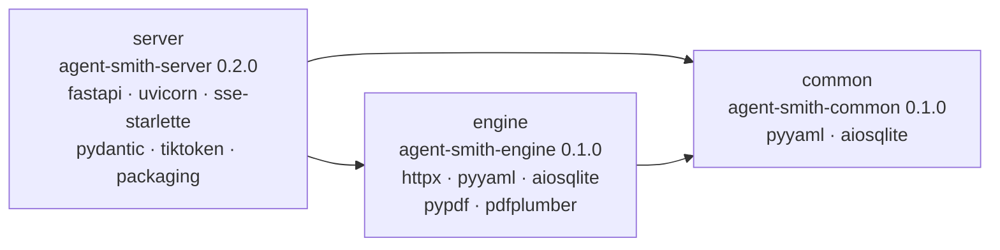
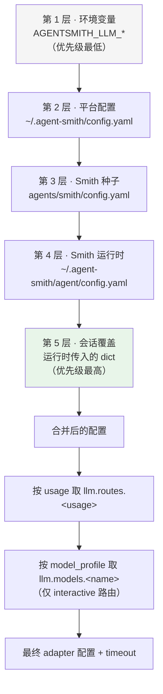
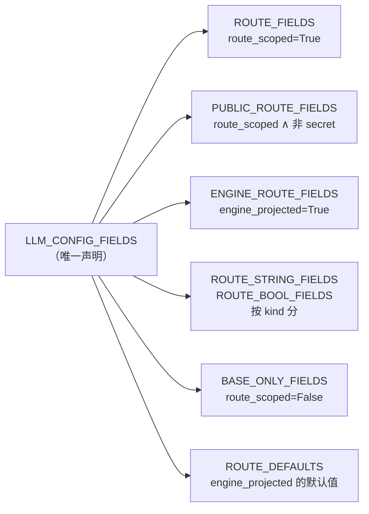
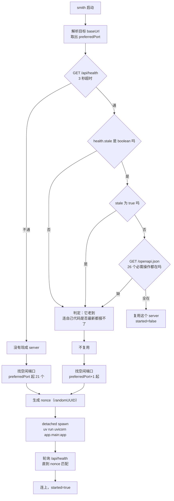
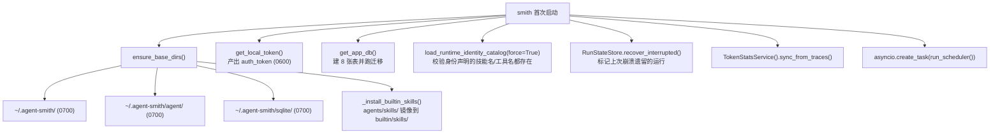
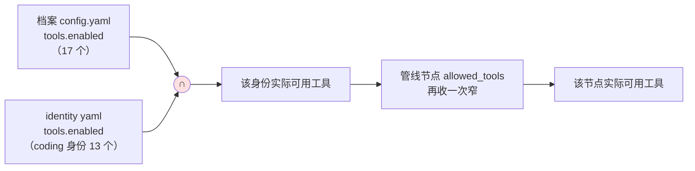
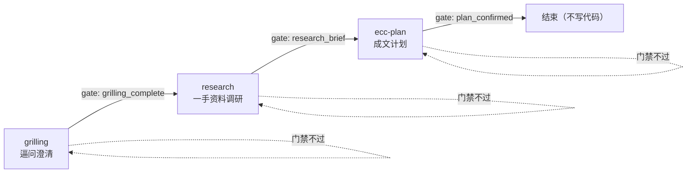

# 02 · 快速上手

> **定位**：从零把 Agent-Smith 跑起来，并且**理解每一个配置项在哪一层生效、被谁覆盖**。
> **适合**：第一次装的人；配置改了不生效来查原因的人；想知道 `smith` 这条命令启动时到底干了什么的人。

本文不是"照抄这几行命令"的速查表——那种东西 `README.md` 里已经有了。本文回答的是**为什么是这几行**，以及每一处容易踩的坑背后的机制。

---

## 1. 前置条件

| 依赖 | 版本 | 为什么需要 |
|---|---|---|
| **Python** | `>= 3.11` | Engine / Server。3.11 是 `pyproject.toml` 里三个包共同的 `requires-python` |
| **uv** | 任意近期版本 | 三个本地包（`common` / `engine` / `server`）之间用 `[tool.uv.sources]` 的路径依赖串起来，是可编辑安装。用 pip 也能装，但 `uv run` 是 Shell 拉起后端时写死的命令 |
| **Node.js** | `>= 22` | Ink 7 与 Shell 的构建 |
| **git** | 任意 | 记忆快照（`engine/memory/_snapshot.py`）依赖 git 做版本化 |
| **macOS** | 可选 | Seatbelt 沙箱只在 macOS 上生效；Linux 走无沙箱的宿主路径 |

三个 Python 包的依赖关系：



注意 `common` 只有两个依赖。这是"零业务逻辑"这条边界在依赖清单上的体现——一个基础设施层如果开始长依赖，说明它在偷偷做业务。

---

## 2. 安装

### 2.1 后端

```bash
cd server && uv sync
```

`uv sync` 会顺带把 `common` 和 `engine` 以可编辑模式装进 `server/.venv`，因为 `server/pyproject.toml` 里声明了：

```toml
[tool.uv.sources]
agent-smith-common = { path = "../common", editable = true }
agent-smith-engine = { path = "../engine", editable = true }
```

**可编辑**意味着改 `engine/` 的源码不需要重装。但注意——**改了源码运行中的 server 不会自动生效**，这正是 `/api/health` 要报 `stale` 的原因（见 §6.3）。

### 2.2 终端 Shell

```bash
cd ../shell && npm ci && npm run build && npm link
```

三步各有各的必要性：

| 命令 | 作用 | 省掉会怎样 |
|---|---|---|
| `npm ci` | 严格按 lock 文件装 | `npm install` 会重算依赖树。这个项目里有一个**幽灵 peer 依赖**（`@assistant-ui/tap`，代码里没有任何 `import` 但运行时必需），只有 `npm ci` 能暴露这类洞 |
| `npm run build` | TypeScript → `dist/` | `bin/smith.js` 指向的是构建产物，不是源码。改了 `src/` 不 build，运行的还是旧代码 |
| `npm link` | 把全局 `smith` 软链到这个工作副本 | 否则 `smith` 不在 PATH 上 |

**`npm link` 的语义要理解清楚**：它是软链不是复制。所以：

- ✅ `smith` 在任何目录下都能用，并且通过自己的安装路径找到 `server/`
- ❌ 仓库一旦移动位置就断
- ❌ 改了 `src/` 之后必须 `npm run build`，链接本身不会重新编译

验证链接指向：

```bash
ls -l "$(which smith)"   # → .../lib/node_modules/smith-shell/bin/smith.js
```

### 2.3 清理旧的 Python CLI

早期版本用 `uv tool install` 装过一个 Python 入口，它会**遮蔽**现在的 shell 入口：

```bash
uv tool uninstall agent-smith-server
```

这一步不是可选的。旧的 `smith` 指向已删除的 Python CLI，症状是"命令存在但行为完全不对"，比"命令找不到"难查得多。

---

## 3. 配置：五层合并

这是整个上手过程中最需要理解的一节。**配置改了不生效**的问题，99% 出在没搞清楚层次。

### 3.1 五层优先级

`engine/llm/model_config.py:resolve_llm_config()` 按下面的顺序合并，**下层覆盖上层**：



一句话记忆法：**离运行时越近，优先级越高**。环境变量是"默认值"，会话覆盖是"这一次就这么办"。

### 3.2 三个最常踩的坑

**坑 1：改 `agents/smith/config.yaml` 的 `tools.enabled` 对已有安装不生效。**

档案种子是 **copy-once** 的。`init_smith_profile_files` 跳过任何已经存在于 `~/.agent-smith/` 的文件。所以：

- 新装的机器：读到你改的种子
- 已有安装：读的是 `~/.agent-smith/agent/config.yaml`，那份是第一次安装时复制过去的

`agents/smith/config.yaml` 顶部的注释直接写了这一点：

```yaml
# ⚠️ llm.*  五层 merge，本文件是第 3 层，改这里生效（model_config.py:366）
#    tools  只读 ~/.agent-smith/agent/config.yaml，改这里对已有安装不生效（preparation.py:213）
```

注意 `llm.*` 和 `tools` 的行为**不一样**——`llm` 走五层合并所以种子层有效，`tools` 只读运行时那一份。

**坑 2：`null` 不覆盖下层。**

```yaml
llm:
  model: null   # 这不是"清空 model"，是"我不表态，用下层的"
```

`common/yaml_utils.py` 的合并语义把 `null` 当成"不覆盖"。想真的清空要写空字符串。

**坑 3：配置被缓存。**

`_merged_base_config()` 按**文件指纹**（路径 + 纳秒 mtime + 大小）缓存合并结果，因为路由解析在每次模型查找时都会跑，重复读没变的 YAML 是纯浪费。指纹变了缓存自然失效——**包括环境变量的变化**，因为环境变量层也参与指纹计算。

所以正常编辑文件会立刻生效。但如果你用某种保留 mtime 的方式改文件（比如 `cp -p`），缓存不会失效。

### 3.3 最小配置

环境变量方式：

```bash
export AGENTSMITH_LLM_PROVIDER=openai          # openai / anthropic
export AGENTSMITH_LLM_API_KEY="sk-..."
export AGENTSMITH_LLM_BASE_URL="https://api.openai.com/v1"
export AGENTSMITH_LLM_MODEL="your-model"
```

只有这四个键有环境变量入口（`_ENV_LLM_KEYS`）。其它配置项必须写文件。

配置文件方式（`~/.agent-smith/config.yaml`）：

```yaml
llm:
  provider: openai
  api_key: sk-...
  base_url: https://api.openai.com/v1
  model: your-model
```

---

## 4. LLM 配置全参数

### 4.1 字段清单

全部可配字段在 `engine/llm/config_fields.py` 里**声明一次**，其它地方全是派生：

| 字段 | 类型 | 默认 | 可路由覆盖 | 传给 adapter | 说明 |
|---|---|---|---|---|---|
| `provider` | string | `""` | ✅ | ✅ | `openai` / `anthropic`，会做名称归一化 |
| `api_key` | string | `""` | ✅ | ✅ | **只写不读**：读 API 永远不返回它 |
| `base_url` | string | `""` | ✅ | ✅ | 支持任意 OpenAI 兼容中转 |
| `model` | string | `""` | ✅ | ✅ | 模型 id |
| `stream` | bool | `true` | ✅ | ✅ | 是否流式 |
| `thinking` | bool | `false` | ✅ | ✅ | 是否开启推理模式 |
| `max_output_tokens` | positive int | `None` | ✅ | ✅ | 输出上限 |
| `context_window` | positive int | `None` | ✅ | ✅ | 上下文窗口（供预算计算用） |
| `timeout_profile` | usage 名 | `None` | ✅ | ❌ | 选一个共享超时档；解析成 `timeout` 后 adapter 才看得到，所以**故意不投影** |
| `vendor` | string | `""` | ❌ | ❌ | 供应商显示名。**只能写在顶层**，是身份元数据，不是每路由覆盖，也不进请求 |

`config_fields.py` 的模块 docstring 解释了这个设计的由来，值得整段引用：

> 同一份字段列表曾经存在于四个并不完全一致的地方：engine 的路由投影、server 接受的字段集、server 公开可读的字段集（必须排除只写的密钥）、以及 HTTP patch schema。**任何一处漏了一个字段都会静默失败**——一个路由级的值会干脆到不了 adapter。

于是改成"声明一次，四处派生"：



这是整个仓库里最值得抄的一个小设计：**当一个列表被四个消费方以不同投影使用时，把投影规则编码成字段上的 flag，而不是维护四份列表**。

### 4.2 三条用途路由

```yaml
llm:
  provider: openai
  api_key: sk-...
  base_url: https://api.example.com/v1
  model: big-model            # 基线，未被路由覆盖的都用它

  routes:
    interactive:              # 主对话
      model: big-model
    gate:                     # 门禁判定
      model: small-model      # 门禁只做契约检查，用便宜模型
    background:               # 记忆编译、自动任务
      model: small-model
      max_output_tokens: 4096
```

**省略的路由继承基线模型**，不需要写全。这是成本优化最直接的杠杆——门禁和记忆编译的调用量不小，但它们不需要主对话那档模型。

### 4.3 命名模型档案

```yaml
llm:
  models:
    fast:
      model: small-model
      thinking: false
    deep:
      model: big-model
      thinking: true
      max_output_tokens: 32000
```

`model_profile` 只作用于 **interactive** 路由，且**优先级高于路由/基线的 model 字段**，但**超时档仍然共享**。终端里用 `/model` 切换。

### 4.4 超时档：三档 × 五字段

`_TIMEOUT_DEFAULTS`（秒）：

| 字段 | `interactive` | `gate` | `background` |
|---|---|---|---|
| `connect` | 10.0 | 10.0 | 10.0 |
| `read` | 90.0 | 90.0 | **240.0** |
| `stream_read` | 120.0 | 90.0 | **300.0** |
| `write` | 30.0 | 30.0 | 30.0 |
| `pool` | 10.0 | 10.0 | 10.0 |

设计意图很清楚：

- **`connect` / `write` / `pool` 三档一致**——建连和发请求的耗时与用途无关。
- **`background` 的 `read` / `stream_read` 是其它两档的 2.5~3 倍**。记忆编译要读一批证据再产出结构化变更集，这本来就慢；用交互档的超时会把正常的编译判成超时。
- **`gate` 的 `stream_read` 比 `interactive` 短**（90 vs 120）。门禁的输出是短判定，流拖过 90 秒说明出问题了，早失败比晚失败好。

自定义：

```yaml
llm:
  timeout_profiles:
    background:
      read: 600
      stream_read: 900
```

### 4.5 被移除的 `vision` 路由

`normalize_legacy_llm_config()` 会静默丢弃 `routes.vision` 和 `timeout_profiles.vision`。它的注释说明了为什么放在这个位置：

> 配置由 server 和 engine 各自直接解析，所以这个兼容步骤属于它们的**共享边界**，而不是只放在 settings API 里。它刻意保留格式错误的值，让正常的校验路径去报告；同时允许既有配置在下一次普通保存时自然脱掉过时的路由数据。

"保留格式错误的值让正常校验去报"——这是个好细节。兼容层顺手"修好"错误配置，会掩盖真正的配置问题。

---

## 5. 上下文文件

Smith 读三个层次的指令文件：

| 文件 | 作用域 | 何时读 |
|---|---|---|
| `~/.agent-smith/SMITH.md` | 用户级，对每次运行生效 | 每次构建 run 时读 |
| `<repo>/.smith/SMITH.md` | 项目级，只对该仓库生效 | 同上 |
| `~/.agent-smith/agent/*.md` | Agent 档案：`role` / `style` / `workflow` / `toolbox` / `context` / `output_style` | 同上 |

**都是每次构建 run 时读**，所以编辑之后下一个请求就生效，不用重启后端。

但终端里已经开着的会话仍然带着旧上下文的对话历史。想让新上下文从干净状态开始，用：

```
/reload
```

它开一个新会话并把当前会话留在历史里。`/init` 则会在当前项目下生成一份 `.smith/SMITH.md` 模板。

---

## 6. 第一次运行

```bash
smith        # 在任何项目目录下
```

看起来是一条命令，背后是一套相当讲究的启动协商。

### 6.1 启动决策流程



### 6.2 为什么要检查 openapi

Shell 里写死了一张 `REQUIRED_API_OPERATIONS` 表（26 条），启动时拿 `/openapi.json` 逐条比对：

```ts
{ method: "POST", path: "/api/agent/sessions/{session_id}/messages/stream" },
{ method: "GET",  path: "/api/agent/observability/runs/{run_id}/diagnosis" },
// ...
```

这解决的是**版本漂移**：你更新了 shell 但复用了一个老 server，某个新端点还不存在，症状会是"某个功能莫名其妙不工作"而不是"启动失败"。把契约检查放在启动，把运行时的怪异故障提前成启动期的明确报错。

### 6.3 为什么要检查 stale

`/api/health` 的 `stale` 字段由 server 自己算：遍历 `sys.modules`，比较每个**已加载**的仓库内源文件的 mtime 与进程启动时间。

Shell 侧的判定有个精巧的地方——**`stale` 不是 boolean 也视为不可复用**：

```ts
if (typeof payload.stale !== "boolean") return "it is too old to report whether its code is current";
```

注释解释了为什么：最陈旧的后端恰恰最不可能报告自己陈旧（因为它跑的是还没有这个字段的老代码）。所以"缺字段"必须和"报告 true"同等对待，否则这个机制对它最该防的目标失效。

### 6.4 进程组的坑

```ts
// `uv run uvicorn ...` spawns uvicorn as a grandchild; signalling only the `uv`
// wrapper lets the port-holding uvicorn survive as an orphan.
```

`uv run uvicorn` 的进程树是 `shell → uv → uvicorn`。只给 `uv` 发信号，握着端口的 `uvicorn` 会变成孤儿继续跑。所以：

- `spawn` 时用 `detached: true`，让子进程自己领一个进程组
- 结束时给**负 pid** 发信号，覆盖整个进程组

而且 `stopOwnedServer()` 在硬超时后**故意不清空** `ownedServer` 引用——注释写了原因：如果子进程扛过了硬超时，下次还得找到它并再发信号，而不是留一个握着端口又够不着的孤儿。

### 6.5 端口选择

```ts
async function findAvailablePort(startPort: number, maxPort = startPort + 20)
```

从首选端口开始最多试 21 个。有个细节：如果探测到**已有一个健康但不可复用**的 server（比如它 stale），新 server 从 `preferredPort + 1` 开始找——不去抢占那个端口，让它自己活着。

---

## 7. 斜杠命令全表

| 命令 | 作用 |
|---|---|
| `/help` | 命令清单 |
| `/new` | 开新会话，当前会话进历史 |
| `/reload` | 改完 `SMITH.md` 等上下文文件后开新会话 |
| `/init` | 在当前项目生成 `.smith/SMITH.md` 模板 |
| `/clear` | **删除**当前会话并开新的（和 `/new` 的区别：不留历史） |
| `/compress` | 摘要并持久化当前会话上下文 |
| `/model` | 发现中转站模型，配置主模型或评审模型 |
| `/config [advanced]` | 编辑基础配置，或带 `advanced` 编辑分路由配置 |
| `/sessions` | 最近会话 |
| `/token` | 本地 token 用量看板 |
| `/runs` | 最近的 Agent 运行与结果指标 |
| `/trace [run-id]` | 诊断最近一次运行或指定 Run |
| `/skills` | 查看或运行一个标准 `SKILL.md` 技能 |
| `/skill <name> [prompt]` | 装载一个技能，或直接带 prompt 运行 |
| `/hooks` | 查看运行时生命周期钩子 |
| `/mcp` | 查看已配置的 MCP 服务器与工具 |
| `/resume [session-id]` | 恢复最近一次被中断的运行；`/resume run <run-id>` 指定运行 |
| `/compact` | 切紧凑视图（`Ctrl+O` 在紧凑/全文之间切） |
| `/reconnect` | 启动失败后重试本地服务连接 |
| `/exit` | 退出 |

**技能不走这个命令面板**——代码注释明确写了："Skills are reached through `@name` and `/skill`, never through this palette."（技能通过 `@名字` 和 `/skill` 触达，绝不通过这个面板）。理由是技能数量会增长，混进命令面板会淹没真正的命令。

---

## 8. 环境变量全表

| 变量 | 作用 | 层 |
|---|---|---|
| `AGENTSMITH_LLM_PROVIDER` | LLM 供应商 | 配置第 1 层 |
| `AGENTSMITH_LLM_API_KEY` | API Key | 配置第 1 层 |
| `AGENTSMITH_LLM_BASE_URL` | API 基址 | 配置第 1 层 |
| `AGENTSMITH_LLM_MODEL` | 模型 id | 配置第 1 层 |
| `AGENT_SMITH_PROJECT_ROOT` | 强制指定项目根 | 必须指向带运行时资产的真实 Agent-Smith 根，否则 `RuntimeError` |
| `AGENT_DIR` | Agent 档案目录 | 覆盖默认 `~/.agent-smith/agent` |
| `SMITH_PROFILE_DIR` | 档案目录（另一入口） | 同上 |
| `SMITH_SERVER_NONCE` | 启动器身份标记 | 由 Shell 生成并注入，`/api/health` 回显 |
| `AGENT_SMITH_RECORD_LLM` | 录制 LLM 响应到 JSONL | 只录响应，绝不录 prompt |
| `AGENT_SMITH_FACT_GATE` | 事实门开关 | 调试用 |
| `AGENT_SMITH_E2E` | 端到端测试模式 | 测试用 |
| `AGENT_SMITH_OBSERVABILITY_MAX_RUNS` | 保留的运行数上限 | 可观测归档策略 |
| `AGENT_SMITH_OBSERVABILITY_MAX_BYTES` | 可观测数据字节上限 | 同上 |
| `AGENT_SMITH_OBSERVABILITY_MAX_AGE_DAYS` | 可观测数据保留天数 | 同上 |
| `AGENT_SMITH_PROVIDER_SECRET` | 供应商密钥（测试/替代通道） | — |
| `SMITH_RUNTIME_SECRET` | 运行时密钥 | — |
| `SMITH_TEST_SECRET` | 测试密钥 | 仅测试 |

---

## 9. 首次运行会产生什么



`load_runtime_identity_catalog` 里那句 `validate_execution_assets()` 值得单独说：它在**启动时**校验每个身份声明的技能名和工具名都真实存在。声明了一个不存在的技能，是启动就报错，而不是等到用户触发那条路由才炸。

---

## 10. 运行时配置文件完整参考

`~/.agent-smith/agent/config.yaml` 是 Agent 的运行时档案配置。它和 `~/.agent-smith/config.yaml`（平台级）的分工是：平台级放"这台机器怎么连模型"，档案级放"这个 Agent 有什么"。

```yaml
name: 个人助手
role: personal-assistant        # 遗留兼容 id，勿改（SMITH_TEMPLATE_ID）
description: ...

# ① LLM —— 五层合并的第 4 层，优先级高于种子和平台
llm:
  model: null                   # null = 不覆盖下层
  routes: {...}
  models: {...}
  timeout_profiles: {...}
  pricing: {...}

# ② 工具白名单 —— 严格白名单，fail-closed
#    最终可用工具 = 这里 ∩ identity.tools.enabled
tools:
  enabled:
    - read_file
    - write_file
    - edit_file
    - shell
    # ... 未列入即调不到

# ③ MCP 服务器（可选）
mcp_servers:
  - name: my-server
    # 传输与命令参数见 engine/mcp/config.py

# ④ 领域知识语义检索（可选，默认关闭）
knowledge:
  embeddings:
    enabled: false
    base_url: https://api.openai.com/v1
    model: text-embedding-3-small
    api_key_env: OPENAI_API_KEY
```

### 10.1 工具白名单的交集语义

这一条值得画出来，因为它是"我明明开了这个工具怎么还是调不到"的唯一原因：



三级收窄，**每一级都只能变窄不能变宽**。例如 `code-review` 管线的第一个节点：

```yaml
allowed_tools: [read_file, read_pdf, render_pdf_page, list_dir, glob_files, grep, shell, git_ops, get_current_time]
```

注意没有 `write_file` / `edit_file`——评审链是**只读**的，这个约束由白名单强制，不是靠 prompt 里写"请不要改文件"。

### 10.2 `memory_ops` 为什么调不到

`agents/tools/memory_ops.py`（263 行）存在，但**没有出现在 `agents/smith/config.yaml` 的 `tools.enabled` 里**。所以默认调不到。这是刻意的：记忆写入必须走编译管线的证据裁决，不能让模型直接改记忆文件。

---

## 11. MCP 配置

MCP（Model Context Protocol）服务器在档案配置的 `mcp_servers` 列表里声明。注册逻辑在 `engine/mcp/config.py:register_configured_mcp_tools()`。

三条关键设计：

**① 故障隔离**。docstring 明确写了——"隔离故障，让一个坏掉的 server 不能阻止其余的注册"。一个 MCP server 连不上，其它的照常工作。

**② 工具名带前缀**。`register_mcp_tools_with_prefix()` 给每个 MCP 工具加服务器前缀，避免不同服务器的同名工具打架。**注意有实测踩过的坑**：工具名过长会超出 provider 的限制（曾出现 113 字符的工具名）。

**③ 会话级连接池**。有 `session_pool` 时按 `session_id` 复用连接；连接失败时 `_evict_dead_session()` 把这个会话的连接踢掉，让下次 acquire 重连而不是复用一个死客户端。

终端里用 `/mcp` 查看已配置的服务器与它们注册进来的工具。

---

## 12. Hooks 配置

`agents/smith/hooks.yaml` 声明内建钩子，`~/.agent-smith/hooks.yaml` 声明用户钩子（在内建之后加载）。

```yaml
hooks:
  pre:                                    # 工具执行前，可阻断
    - id: config-protection
      enabled: true
      module: "agents/smith/hooks/config_protection.py"
      class: "ConfigProtectionHook"
      priority: 1                         # 数字越小越先执行
      description: "Block modifications to linter/formatter/type-checker config files"

  post:                                   # 工具执行后，只能警告
    - id: console-warn
      enabled: true
      module: "agents/smith/hooks/console_warn.py"
      class: "ConsoleWarnHook"
      description: "Warn about debug statements"

    - id: quality-gate
      enabled: true
      module: "agents/smith/hooks/quality_gate.py"
      class: "QualityGateHook"
      description: "Run format and lint checks after file edits"

  stop:                                   # 每次回合末
    - id: cost-tracker
      enabled: true
      module: "agents/smith/hooks/cost_tracker.py"
      class: "CostTrackerHook"
      description: "Track token usage and costs per session"
```

四个内建钩子：

| 钩子 | 类型 | 默认 | 干什么 |
|---|---|---|---|
| `config-protection` | Pre | ✅ | 阻止改 linter / formatter / 类型检查器的配置文件 |
| `console-warn` | Post | ✅ | 警告 `console.log` / `print()` 之类的调试语句 |
| `quality-gate` | Post | ✅ | 跑格式化和 lint 检查（异步） |
| `cost-tracker` | Stop | ✅ | 把 token 用量写进 `~/.agent-smith/metrics/costs.jsonl` |

`config-protection` 这个钩子的意图值得说：它防的不是"用户改配置"，而是**Agent 为了让检查通过而去放宽检查**。一个 Agent 发现 lint 报错，最省事的"修复"是把那条规则关掉——这个钩子堵的就是这条路。

**注意事实门（fact gate）不是钩子**。它曾经是可插拔钩子，现在住在 `engine/safety/fact_gate.py`，由 `lifecycle.py` 按请求接线（`use_fact_gate`），**始终生效，只挑战不阻断**。这个改动是为了让它不能被配置关掉。

终端里用 `/hooks` 查看当前生效的钩子。

---

## 13. 自动任务配置

自动任务让 Smith 按计划跑指令。三种触发方式：

| `trigger_type` | `trigger_config` | 说明 |
|---|---|---|
| `manual` | 忽略 | 只能手工触发 |
| `cron` | 5 字段 cron 表达式 | 必填，空则校验失败 |
| `interval` | 秒数（整数） | 必填，**最小 60 秒** |

字段约束（`server/app/schemas/auto_task.py`）：

| 字段 | 约束 |
|---|---|
| `title` | ≤ 200 字符 |
| `description` | ≤ 2000 字符 |
| `instruction` | ≤ 100000 字符 |
| `working_dir` | 1~2000 字符，**不能为空白** |
| `max_retries` | 0 ~ 10 |
| interval 最小值 | 60 秒 |

这几个边界不是随便定的，注释写了理由：

> 这些边界防止单个任务变成永久重试循环（无上限的 LLM 花费）或让数据库无限增长。

### 13.1 cron 解析器

`server/app/utils/cron.py`（167 行）是自己实现的最小 cron 解析器，支持标准 5 字段：`minute hour day_of_month month day_of_week`。

每个字段是逗号分隔的项，每项可以是 `*`、单值、或 `a-b` 范围，都可以带 `/step`。另外：

- 月份接受 `JAN`–`DEC`
- 星期接受 `SUN`–`SAT`
- **星期 0 和 7 都表示周日**
- **越界值直接拒绝，而不是静默地永不匹配**

最后一条是重点。`0 25 * * *`（25 点）如果被静默接受，任务会永远不跑，而用户完全看不出哪里错了。

### 13.2 租约机制

自动任务用 `lease_until` + `lease_token` 两列做互斥（见 [01 · 总览](./01-总览.md) §7.3）。崩溃重启时只重置**租约已过期**的任务——重置活着的租约会让两个进程跑同一条指令。

---

## 14. 第一次会话：把三条工作流各走一遍

装完之后最有效的验证方式，是把三条声明式技能链各触发一次，看它们的节点和门禁是否按预期推进。

### 14.1 普通对话（不进管线）

```
帮我看看 engine/memory 目录都有什么
```

这句话**不会**进任何管线。它没有命中任何路由关键词，所以走普通 ReAct。这是刻意的——`agents/identities/coding.yaml` 的 `instructions` 明确写了：

> 普通编码、解释和诊断请求保持普通 ReAct；只有明确识别为需求调研、TDD 开发或代码评审的意图才进入对应 SkillChain。

用 `/trace` 可以看到 `ROUTE_DECIDED` 事件里 pipeline 为空。

### 14.2 需求调研链（3 节点）

```
需求调研：给 Smith 加一个导出会话为 Markdown 的功能
```

命中 `requirements-research` 路由（priority 30）。



三个节点的关键约束（全部写在 `agents/pipelines/requirements-research.yaml` 的 `instructions` 里）：

| 节点 | 工具白名单 | 硬约束 |
|---|---|---|
| `grilling` | 只读工具，**无 shell** | **每次回复只解决一个用户自己该定的决策**，并给推荐；仓库或资料里查得到的事实必须自己查，不许问用户 |
| `research` | 加 `write_file` / `web_search` / `web_fetch` | `web_search` 只用来发现一手资料 URL，`web_fetch` 只用来读它们；产出必须写到 `docs/research/YYYY-MM-DD-<slug>.md`，且恰好包含 5 个指定标题 |
| `ecc-plan` | 回到只读 | 内联 Markdown 引用模式：不许建 `.claude` 产物、不许开 Plan Canvas、不许调 subagent |

**注意 `grilling` 有 `await_user_input_marker`**：

```yaml
await_user_input_marker: "<!-- agent-smith:await-user-input -->"
infer_await_user_input_from_question: true
```

节点输出这个标记（或被推断为在提问）时，链会**暂停等用户**，而不是自己往下走。这是"逼问澄清"这个动作能真正生效的机制基础——否则模型会自问自答一路冲到底。

### 14.3 TDD 开发链（3 节点，第一个带条件）

```
用 TDD 给会话导出加一个 Markdown 序列化函数
```

命中 `tdd-development`（priority 20）。


第一个节点带 `condition: coding_bugfix_needs_diagnosis`——只在"这是个 bugfix 且需要先诊断"时才跑。新功能开发直接从 `tdd-workflow` 开始。

这条链里有一组很具体的**反幻觉约束**，值得抄：

> Agent-Smith 从目标工作区既有的 manifest、lock 文件、CI 文件和测试配置里解析测试命令。**不许**运行上游 ECC 宿主命令 `node scripts/setup-package-manager.js --detect`、不许依赖 `.claude` 或全局包管理器设置、不许调用可能下载包的命令（比如裸 `npx`）、不许装工具。如果工作区没提供可运行的命令，**停下来问用户，而不是发明一个**。
> 把 80% 覆盖率当作项目配置的目标，**绝不当作发明出来的普适通过条件**。

这两段解决的是 Agent 最常见的两种编造：编造一条测试命令，和编造一条验收标准。

### 14.4 代码评审链（2 节点，全程只读）

```
code review 一下这个分支的改动
```

命中 `code-review`（priority 10）。


只读约束是**三重**的：

1. `allowed_tools` 里没有 `write_file` / `edit_file`
2. `instructions` 里限定 `git_ops` 只能用读操作（`status` / `diff` / `discover`）
3. 明确禁止"发评论、批准、建 PR、发布任何东西"

第一个节点还有一条容易忽略但很重要的约束：

> 运行时只有一个常驻 agent，所以按顺序跑 Matt 的 Standards 轴和 Spec 轴，同时保持 `## Standards` 和 `## Spec` 两节完全分离。

这是"单 Agent"这条产品约束落到管线指令上的直接体现——上游技能假设可以并行开两个 subagent，这里必须显式改写成顺序执行。

---

## 15. 权限与安全默认

装完之后值得确认一遍文件权限，因为整个安全模型建立在它们之上。

```bash
ls -ld ~/.agent-smith                    # 应为 drwx------  (0700)
ls -l  ~/.agent-smith/auth_token         # 应为 -rw-------  (0600)
```

### 17.1 权限是强制的，不是建议的

`common/paths.py` 对每个受管目录做两步：

```python
path.mkdir(parents=True, exist_ok=True, mode=PRIVATE_DIR_MODE)
path.chmod(PRIVATE_DIR_MODE)
```

`mkdir` 的 `mode` 会被 umask 削弱（`umask 022` 下 `0700` 会变成 `0700 & ~022 = 0700`，但 `0777` 会变成 `0755`），所以必须再 `chmod` 一次才保证结果确定。

### 17.2 软链一律拒绝

`_ensure_real_path()` **逐段**遍历路径，任何一段是 symlink 就抛：

```
Refusing to use symlinked private runtime path: /Users/x/.agent-smith/agent
```

这不是洁癖。`engine/safety/tool_guard.py` 的平台写保护是**按路径前缀**判定的——如果 `~/.agent-smith/agent` 是一个指向别处的软链，写保护就会保护错地方，而攻击者获得了一个绕过点。

删除受管路径时也有对应处理：`_remove_managed_path()` 对叶子软链用 `unlink()`（只删链接不碰目标），但要求它的**所有父级都是真实的受管目录**——否则 `target/link/stale` 这样的路径就能逃出受管树。

### 17.3 审计哈希链

`~/.agent-smith/audit.jsonl` + `audit.jsonl.head` 是防篡改审计链（`common/hash_chain.py`，542 行）。

`server/app/main.py` 的关闭流程里有一句 `close_audit_chains()`，注释解释了为什么必须在这个时刻做：

> 在唯一定义良好的边界上锚定审计链的头：此时没有任何 run 还在往这个装机级日志里追加。这样，对已封存日志的回滚就能在下一次校验时被检测到。

即：链头只在"确定没人在写"的时刻封存，否则封存的头本身就是不可信的。

### 17.4 密钥永不回读

`api_key` 在 `config_fields.py` 里标了 `secret=True`，于是 `PUBLIC_ROUTE_FIELDS` 自动把它排除。读配置的 API 永远不返回它——不是靠调用方记得过滤，而是靠派生规则。

---

## 16. 故障排查

| 症状 | 原因 | 修复 |
|---|---|---|
| `smith` 存在但行为完全不对 | 旧的 `uv tool install` 入口在遮蔽 | `uv tool uninstall agent-smith-server` |
| 改了 `src/` 没生效 | `npm link` 是软链不是编译 | `npm run build` |
| 仓库移动后 `smith` 断了 | `npm link` 指的是路径 | 重新 `npm link` |
| 改了 `agents/smith/config.yaml` 的 `tools` 没生效 | 种子是 copy-once | 改 `~/.agent-smith/agent/config.yaml` |
| 配置写了 `null` 没清空 | `null` 语义是"不覆盖" | 写空字符串 |
| Shell 报 server 太旧 | 复用到的 server 跑着旧代码，或老到没有 `stale` 字段 | 让它自己起新的，或手工重启后端 |
| Shell 报缺少 API 操作 | 复用到的 server 版本不匹配 | 同上 |
| 端口被占且起不来 | 首选端口起 21 个都被占 | 释放端口或改 baseUrl |
| shell 测试挂 12 个 | 没有 `~/.agent-smith/auth_token` | `mkdir -p ~/.agent-smith && printf token > ~/.agent-smith/auth_token && chmod 600 ~/.agent-smith/auth_token` |
| Seatbelt 测试在 Linux 上失败而非跳过 | 漏了 `@pytest.mark.skipif(sys.platform != "darwin")` | 补 marker |
| 模型 `/v1/models` 里有但调不通 | 中转站列出不等于可用；有的模型只走 Responses API | 换模型前先用 `curl` 直接打一次 |
| 启动报 `Unable to locate an Agent-Smith project root` | 当前目录及其祖先都没有带签名的根 | 设 `AGENT_SMITH_PROJECT_ROOT` |
| 启动报 `Refusing to use symlinked ...` | 运行时路径里有一段是软链 | 换成真实目录 |

---

## 17. 开发者工作流

### 17.1 测试

```bash
cd engine && uv run --with pytest --with pytest-asyncio pytest   # 1100 passed
cd server && uv run --with pytest --with pytest-asyncio pytest   # 243 passed (5 skipped)
cd shell  && npm run build && npm test                            # 303 passed
cd shell  && npm run check                                        # 类型检查
```

### 17.2 手工启后端

```bash
cd server && uv run uvicorn app.main:app --port 8000
```

这样起的 server 没有 `SMITH_SERVER_NONCE`，`/api/health` 的 `nonce` 返回 `null`，Shell 会认为"不是我拉起来的"——但只要它健康、不 stale、契约齐全，仍然会被复用。

### 17.3 录制与回放

```bash
export AGENT_SMITH_RECORD_LLM=/tmp/case.jsonl
smith        # 之后每一次模型往返都会追加到这个文件
```

回放用 `engine/llm/replay.py`。注意它的两条设计约束：

1. **只写响应，不写 prompt**——所以录制文件不会泄漏对话内容
2. **按录制顺序供给，不按消息匹配**——所以回放不需要 prompt，也就不要求重放时 prompt 完全一致

这让"录一个真实的 provider 交互，拿来跑确定性测试"成本极低。

### 17.4 真 PTY 测试

Ink 的 `Box` 只 wrap 不裁剪，所以超宽内容的断行行为**用普通断言测不到**。需要真 PTY（`script` + `stty -icrnl` 逐字符喂键）。这是实践中总结出来的方法，写在这里是为了不让下一个人重新发现。

---

## 18. 下一步

装完之后，按你的目的选路：

| 目的 | 读 |
|---|---|
| 想知道刚才那条命令背后跑了什么 | [03 · 架构总览](./03-架构总览.md) |
| 想改 prompt 里的某一层 | [04 · Engine 核心执行](./04-Engine-核心执行.md) |
| 想加一个工具 | [08 · Agents 内容层](./08-Agents-内容层.md) |
| 想调模型配置 | [07 · LLM 集成](./07-LLM-集成.md) |
| 想看运行档案 | [10 · 可观测性与诊断](./10-可观测性与诊断.md)，或直接 `/runs`、`/trace` |
