# 03 · 架构总览

> **定位**：五层的边界在哪、跨层的契约长什么样、一次请求从回车到渲染完整走过哪些函数。
> **适合**：要动这个代码库的人。读完这篇，你应该能判断"我这个改动该放哪一层"。

---

## 1. 五层与依赖方向

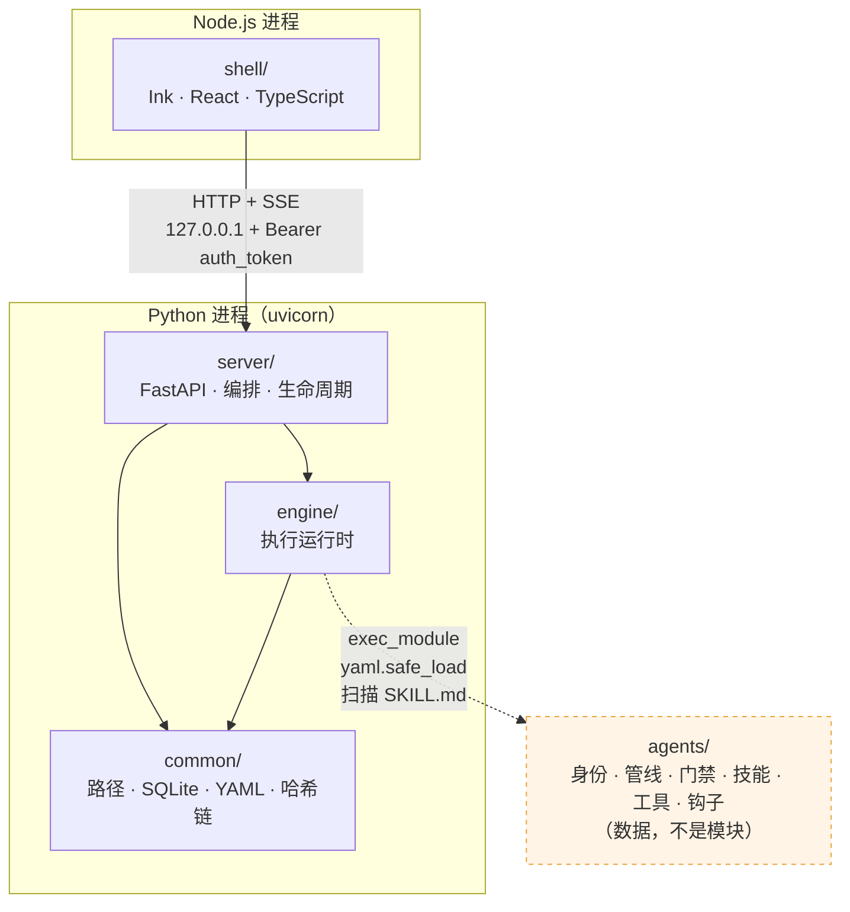

### 1.1 三条硬规则

| 规则 | 违反的表现 | 怎么发现 |
|---|---|---|
| `engine/` 不得 import FastAPI / HTTP / Agent 实例管理 | engine 变得只能在这个 server 里跑 | import 图检查 + code review |
| `agents/` 不 import 任何其它层 | 内容层变成代码库的一部分，不能独立分发 | 内容层文件里出现 `from engine...` |
| `server/app/routers/` 保持薄 | 业务逻辑散进路由，service 层形同虚设 | 路由函数超过"取参 → 调 service → 返回" |

`CLAUDE.md` 强调这三条是"由 import 图验证，不是靠约定"。这句话的分量在于：**边界如果只靠人的自觉，它三个月内一定会烂**。

### 1.2 `agents/` 为什么不是一个 Python 包

它有 `.py` 文件，但它不是包。工具的加载方式是：

```python
# engine/tool/registry.py 的语义（简化）
spec = importlib.util.spec_from_file_location(name, path)
module = importlib.util.module_from_spec(spec)
spec.loader.exec_module(module)          # ← 执行，不是 import
if hasattr(module, "TOOL_META") and hasattr(module, "execute"):
    register(module)
```

契约是**两个符号的存在性**，不是类型。带来的三个后果：

1. 工具文件可以放在任何路径（内建目录、`~/.agent-smith`、别人的仓库）
2. 工具文件里拿不到 `common/paths.py` 的常量，**路径推导会重复**——这是有意接受的成本
3. 一个坏掉的工具文件不会让整个注册表崩掉（注册是逐文件隔离的）

---

### 1.3 五层的实际规模（可复现）

行数不是重点，但它能说明每一层承担了多少。这里给出统计口径和可复现的命令，因为**用错口径会得到相差十几倍的数字**。

| 层 | 非测试源码行数 | 语言 | 占比 |
|---|---|---|---|
| `common/` | 1 406 | Python | 3% |
| `engine/` | **26 286** | Python | 50% |
| `agents/` | 9 619（py 6 022 + md 3 597） | Python + Markdown | 18% |
| `server/` | 6 101 | Python | 12% |
| `shell/src/` | 10 729 | TypeScript | 20% |

`engine/` 内部的分布：

| 子域 | 行数 | 对应文档 |
|---|---|---|
| `execution/` | 7 635 | [04 · Engine 核心执行](./04-Engine-核心执行.md) |
| `memory/` | 4 014 | [05 · 记忆系统](./05-记忆系统.md) |
| `llm/` | 3 182 | [07 · LLM 集成](./07-LLM-集成.md) |
| `safety/` | 2 749 | [06 · 安全与安全边界](./06-安全与安全边界.md) |
| `observability/` | 2 100 | [10 · 可观测性与诊断](./10-可观测性与诊断.md) |
| `context/` | 1 871 | [04 · Engine 核心执行](./04-Engine-核心执行.md) §2 |
| `tool/` | 1 527 | [04 · Engine 核心执行](./04-Engine-核心执行.md) §5 |
| `mcp/` | 1 212 | [12 · MCP 集成](./12-MCP-集成.md) |
| `skill/` | 829 | [04 · Engine 核心执行](./04-Engine-核心执行.md) §8 |
| `sandbox/` | 789 | [06 · 安全与安全边界](./06-安全与安全边界.md) §9 |
| `identity/` | 378 | [08 · Agents 内容层](./08-Agents-内容层.md) §3 |

### 1.4 统计口径：四个必须排除的目录

直接 `find engine -name '*.py' | xargs wc -l` 会得到 **387 818** 行——比真实值大十四倍。污染来自四类目录：

| 目录 | 为什么要排除 |
|---|---|
| `engine/.cache/` | **uv 的包缓存，361 532 行**——最大的污染源 |
| `engine/.venv/` | 虚拟环境里的第三方包 |
| `**/__pycache__/` | 字节码目录（本身不含 `.py`，但保险起见） |
| `**/tests/` + `test_*.py` | 测试代码，统计"实现规模"时不算 |

可复现的统计（Python 版，比 `find` 的路径匹配更可靠）：

```python
import pathlib
root = pathlib.Path("engine")
skip = {".venv", ".cache", "__pycache__", "tests"}
total = sum(
    len(p.read_text(errors="ignore").splitlines())
    for p in root.rglob("*.py")
    if not (set(p.parts) & skip)
    and "egg-info" not in str(p)
    and not p.name.startswith("test_")
)
print(total)   # → 26286
```

用 `set(p.parts) & skip` 判断**路径的任何一段**是否命中排除集，比 `-not -path '*/.venv/*'` 这类 glob 可靠——后者对相对路径、符号链接、不同的路径写法都可能失效，这次 `engine/.cache` 就是这样漏掉的。

> **这是本套文档自己踩过的坑。** 第一次统计时 `find` 的排除条件写漏了 `.cache`，得到 387 818 这个荒谬的数字。之所以能发现，是因为它和其他四层（都在 1k–11k 量级）差了两个数量级——**数字之间的比例关系比单个数字更容易看出错误**。写文档时把口径和命令一起给出，就是为了让读者能自己复算。

`CLAUDE.md` 里记的是 25.3k，本文实测 26 286。差异来自统计时点不同（代码在增长），不是口径分歧。**以能复现的实测为准**，这也是 `CLAUDE.md` 自己那条 "Trust code over docs" 的应用。

---

## 2. 跨层契约

Engine 对外只暴露五个数据结构。理解了它们，就理解了 server 和 engine 之间的全部通信。

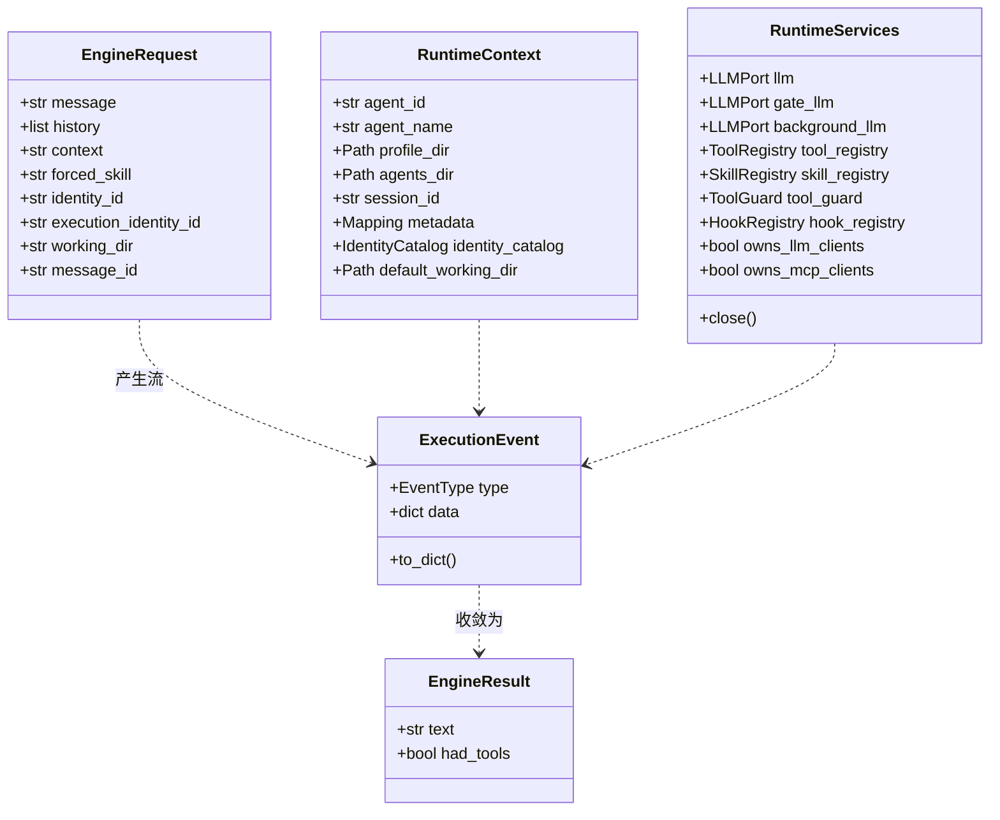

### 2.1 `EngineRequest` 里的两个 identity

这是最容易读错的一处。它有**两个**身份字段，含义完全不同（docstring 写得很清楚）：

| 字段 | 含义 |
|---|---|
| `identity_id` | 会话对**普通 ReAct 执行**偏好的身份。**它不是路由命名空间**——显式的 SkillChain 意图每一轮都在全局范围内解析 |
| `execution_identity_id` | 只在**恢复一个持久化的 run** 时才有值。它把恢复绑定到上一轮实际执行的身份，而这个身份可能和会话的 ReAct 偏好不同 |

为什么要分开：会话可能偏好 `smith` 身份，但上一轮因为说了"code review"而进了 `coding` 身份的管线。恢复那个 run 必须回到 `coding`，否则恢复出来的是一个上下文不匹配的 run。

### 2.2 `RuntimeContext` 里的一条安全约束

```python
default_working_dir: Path | None = None
# caller-supplied fallback for trusted embeddings and tests.
# The engine never derives a workspace from its own process current directory.
```

**引擎绝不从自己进程的当前目录推导工作区**。这条约束很重要：uvicorn 的 cwd 是启动它的地方，如果引擎默认用它，一个没带 `working_dir` 的请求就会在错误的目录里读写文件。所以工作区必须由调用方显式给。

### 2.3 `RuntimeServices` 的资源所有权

两个布尔字段决定了"谁负责关"：

| 字段 | `True`（默认） | `False` |
|---|---|---|
| `owns_llm_clients` | 本次请求结束时关掉 LLM 客户端 | 客户端是进程级共享的，请求结束不关 |
| `owns_mcp_clients` | 同上，关 MCP 客户端 | 由会话池管理 |

`server/app/services/engine_runtime.py` 构建运行时时把两个都设成 `False`，因为它用的是**进程级缓存的客户端**（`LLMClientManager` + `MCPClientSessionPool`）。如果设成 `True`，第一个请求结束就会关掉所有后续请求要用的连接。

`close()` 的实现里有一段值得抄的中文注释：

```python
# 逐资源隔离：第一个 close 抛异常不许掐断其余资源的清理，
# 否则 MCP 子进程/LLM 连接会在长期运行的进程里泄漏。
```

而且它对 `asyncio.CancelledError` 有特殊处理——记下来但**继续清理剩余资源**，最后再重新抛出。取消信号不能变成资源泄漏的借口。

关 LLM 时还做了去重（`closed_llms: set[int]`），因为 `llm` / `gate_llm` / `background_llm` 很可能指向同一个对象。

---

## 3. 事件模型

Engine 是一个**事件流生成器**。`EventType` 枚举有 **27 种**事件类型：

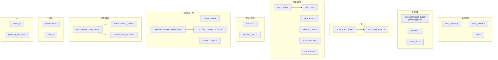

全表：

| 事件 | 何时发 | 消费方关心什么 |
|---|---|---|
| `RUN_STARTED` | run 开始 | 建 trace 文件、写 RunState |
| `ROUTE_DECIDED` | 路由完成 | 显示走了哪条链或 direct ReAct |
| `RAW_RESPONSE_EVENT` | 每个 provider 原始事件 | 归一化后提取文本增量 |
| `THINKING` | 推理内容 | 折叠显示 |
| `TEXT_DELTA` | 归一化的文本增量 | 终端追加渲染 |
| `TOOL_CALL_START` | 工具调用发起 | 显示工具名和参数 |
| `TOOL_CALL_RESULT` | 工具返回 | 显示结果（可能被截断） |
| `SKILL_START` / `SKILL_END` | 技能节点起止 | 管线进度 |
| `GATE_RESULT` | 门禁判定 | 通过/不通过 |
| `GATE_EVIDENCE` | 门禁依据 | 为什么这样判 |
| `BACKTRACK` | 回退到更早节点 | 管线进度回卷 |
| `BLOCKED` | 被守卫/钩子阻断 | 显示拒绝原因 |
| `AWAITING_INPUT` | 节点等用户回答 | 暂停并提示 |
| `TOKEN_USAGE` | 用量统计 | 写 `token_usage_events` |
| `CONTEXT_USAGE` | 上下文占用 | HUD 显示 |
| `CONTEXT_COMPRESSION_START` / `_END` | 压缩上下文 | 提示"正在压缩" |
| `PROVISIONAL_TEXT_DELTA` | 试探性文本 | 先渲染，可能被撤回 |
| `PROVISIONAL_COMMIT` | 试探性文本转正 | 落库 |
| `PROVISIONAL_RETRACT` | 试探性文本撤回 | 从界面抹掉 |
| `SMITH_UI` / `SMITH_UI_FALLBACK` | 结构化 UI 组件 | 富渲染，降级为文本 |
| `INCOMPLETE` | 未完成 | 标注并可恢复 |
| `FAILED` | 失败 | 显示错误 |
| `DONE` | 一段执行结束 | 停止追加 |
| `RUN_FINISHED` | run 结束 | 写摘要、跑 StopHook |

### 3.1 为什么有 `RAW_RESPONSE_EVENT` 又有 `TEXT_DELTA`

`raw_text_delta()` 这个辅助函数解释了两者的关系：

```python
def raw_text_delta(event, *, include_provisional=True) -> str | None:
    # RAW_RESPONSE_EVENT + data.type == OUTPUT_TEXT_DELTA → 提取 data.data.delta
```

`RAW_RESPONSE_EVENT` 是**provider 原始事件的透传**，保留全部字段用于诊断和录制；`TEXT_DELTA` 是**归一化后的产品级事件**。两条通道并存，让"看原始协议"和"渲染文本"互不干扰。

注意 `include_provisional` 参数——原始事件里带 `provision_id` 的是试探性输出，某些消费方（比如落库）必须排除它们。

### 3.2 试探性输出（Provisional）

这是管线场景特有的机制：一个节点的输出**先流式渲染出来**，但如果门禁不过要重跑这个节点，已经渲染的部分必须撤回。

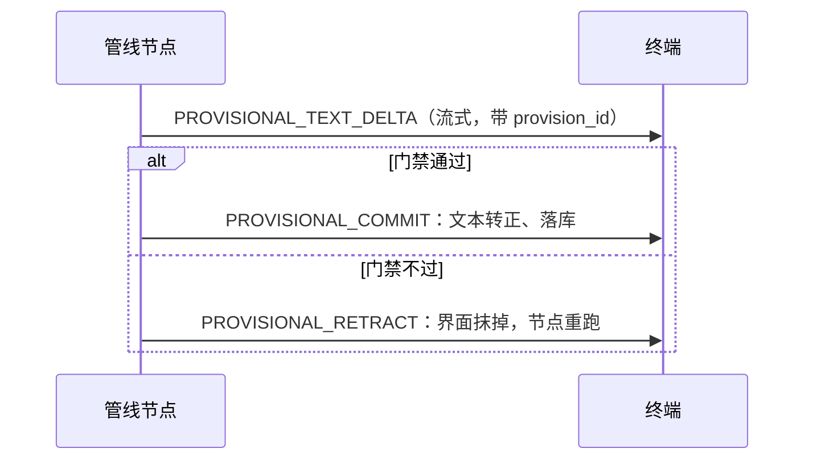

`_apply_session_checkpoint()` 里还有一句相关注释——恢复一个暂停的节点时要带上试探性输出的账本：

> P6: carry the provisional-streaming ledger so the resumed run does not re-render text that was already streamed before the pause.

---

### 3.3 事件设计的三条原则

27 种事件不是随手加出来的，它们遵循三条可以从枚举本身读出来的原则。

**① 成对的事件必须成对。**

```
SKILL_START               ↔  SKILL_END
CONTEXT_COMPRESSION_START ↔  CONTEXT_COMPRESSION_END
TOOL_CALL_START           ↔  TOOL_CALL_RESULT
PROVISIONAL_TEXT_DELTA    ↔  PROVISIONAL_COMMIT / PROVISIONAL_RETRACT
```

四对事件，每一对都是"开始了什么"配"它怎么结束的"。这让消费方可以维护一个"进行中"的集合——收到 START 加进去，收到 END 移出来。

代价是**每一条 START 路径都必须保证有对应的 END**，包括异常路径。[11 · Shell 终端 UI](./11-Shell-终端UI.md) §7.0 ⑥ 那条"结果没到的工具要清理"就是这个契约被打破时的兜底：一个只有 START 没有 RESULT 的工具会让 HUD 的转圈图标永远不停。

`TOOL_CALL_START` 配的是 `TOOL_CALL_RESULT` 而不是 `TOOL_CALL_END`——命名上的差别反映了语义：结束时**必须带回结果**，不能只是一个"完了"的信号。

**② 原始与归一化并存。**

| 原始 | 归一化 |
|---|---|
| `RAW_RESPONSE_EVENT` | `TEXT_DELTA` / `THINKING` |
| `SMITH_UI`（结构化） | `SMITH_UI_FALLBACK`（降级文本） |

两条通道服务不同的消费方：诊断和录制需要**完整的原始协议**（§3.1），渲染只需要**产品级的语义**。合并成一条的话，要么渲染方被迫理解 provider 协议，要么诊断方丢失细节。

`SMITH_UI_FALLBACK` 是同一个思路在 UI 层的应用：结构化组件校验失败时降级成代码块，而不是丢弃或报错。**降级路径本身是一个事件类型**，意味着"降级发生了"这件事是可观测的。

**③ 终态有四个，但语义不重叠。**

```
DONE          — 一段执行结束（可能还有后续）
INCOMPLETE    — 没做完（可恢复）
FAILED        — 失败
RUN_FINISHED  — 整个 run 结束（写摘要、跑 StopHook）
```

`DONE` 和 `RUN_FINISHED` 的区别最容易混：一次 run 里可能有多段执行（管线的多个节点），每段结束发 `DONE`，整个 run 结束才发 `RUN_FINISHED`。消费方据此区分"这一步说完了"和"这次任务结束了"——终端要在前者停止追加文本，在后者才收起进度指示。

`INCOMPLETE` 与 `FAILED` 的区别在**可恢复性**：前者进 [04 · Engine 核心执行](./04-Engine-核心执行.md) §7.1.1 那张状态转移表里"可以回到 RUNNING"的一档。这个区分一路传到终端文案（[11 · Shell 终端 UI](./11-Shell-终端UI.md) §5.8）：`incomplete + awaiting_user_input` 显示成"等你回复"而不是"失败了"。

### 3.4 为什么事件类型只增不改

`EventType` 是一个 `str` 枚举，值是稳定的字符串（`"tool_call_start"` 这类）。这些字符串会：

1. 写进 trace 文件（JSONL，长期保存）
2. 走 SSE 传给终端
3. 被 `_execution_events()` 从旧文件读回来重建（[10 · 可观测性与诊断](./10-可观测性与诊断.md) §10.4）

三个用途都跨版本：**今天的引擎要能读懂上个月写下的 trace**。所以事件类型的字符串值一旦发布就不能改——改了等于让所有历史 trace 变成无法解析的数据。

这也是为什么读侧到处是 `except ValueError: continue`（[10 · 可观测性与诊断](./10-可观测性与诊断.md) §10.4）和 `.get(key, default)`：**新版本要容忍旧数据里没有的字段，旧版本要容忍新版本加的类型**。枚举只增不改，加上读侧宽容，两者共同保证了向前向后兼容。

---

## 4. 运行状态机

`engine/execution/orchestration/run_state.py` 定义 7 个状态和一张**显式的转移表**：

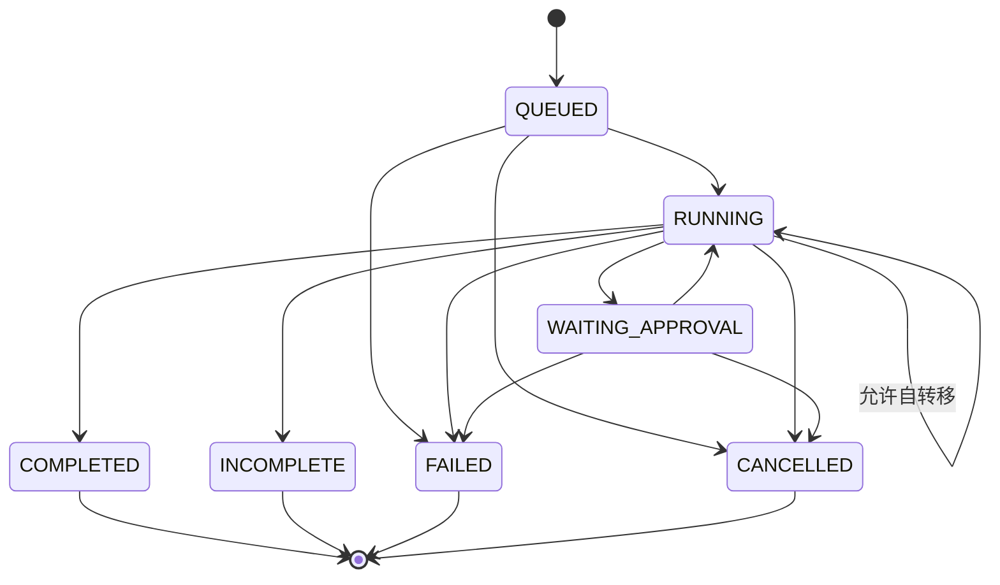

有三点值得注意：

1. **`RUNNING → RUNNING` 是允许的**。一个 run 内部会多次写状态（推进节点、更新元数据），自转移合法。
2. **非法转移会抛 `RunStateTransitionError`**，而不是静默接受。这让"某个分支忘了走完整流程"变成显式错误。
3. **有独立的 `RunScopeMismatchError`**：恢复请求如果不属于这个持久化的 run，报的是"作用域不匹配"而不是通用错误——错误类型本身就是诊断信息。

四个终态（`COMPLETED` / `INCOMPLETE` / `FAILED` / `CANCELLED`）在 `server/app/main.py` 里被复用为 `_TERMINAL_RUN_STATUSES`，用于启动时的可观测对账。

---

## 5. 一次请求的完整旅程（详版）

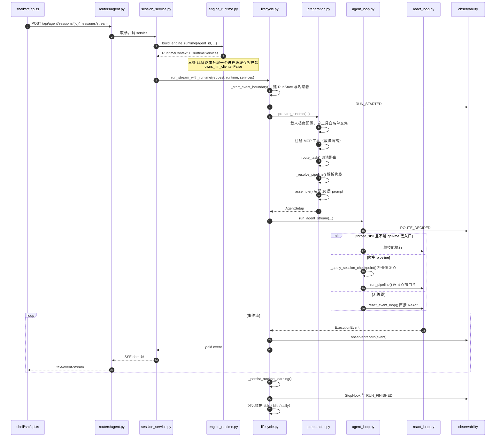

### 5.1 `prepare_runtime()` 做的九件事

`engine/execution/orchestration/preparation.py:254` 是整个装配的核心。它按顺序做：

| # | 动作 | 关键函数 |
|---|---|---|
| 1 | 载入 Agent 档案配置 | `_load_profile_config()` |
| 2 | 算出启用的工具集 | `enabled_tools_from_config()` |
| 3 | 注册 MCP 工具 | `_register_mcp_tools()` |
| 4 | 处理"上一轮在等用户输入"的路由 | `_route_pending_user_input()` |
| 5 | 处理 `grill-me` 的链入口别名 | `_route_grill_me_entry()` |
| 6 | 词法路由 | `route_task()` |
| 7 | 解析管线 | `_resolve_pipeline()` |
| 8 | 组装运行时上下文 | `runtime_execution_context()` / `_runtime_prompt_context()` |
| 9 | 装配 prompt | `engine/context/assembler.py` |

第 4 步值得展开：如果上一轮的节点以"等用户回答"结束，这一轮的用户消息**是那个问题的答案**，不是一个新任务。所以路由必须被短路，直接回到那个节点——而不是把答案当成新请求重新走一遍词法匹配。

### 5.2 三岔分发

`agent_loop.py:run_agent_stream()` 的分发逻辑：

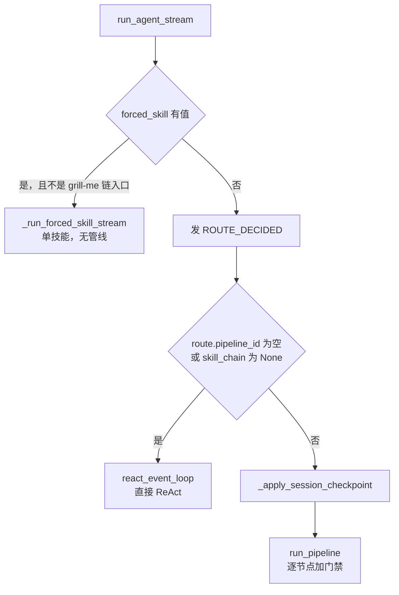

**`grill-me` 的特例**值得单说。上游 Matt 的 `grill-me` 是 `grilling` 的一个入口包装。在 Agent-Smith 里，用户输入 `/grill-me` 时：

```python
grill_me_chain_entry = (
    forced_skill == "grill-me"
    and route.route_id == "requirements-research"
    and route.pipeline_id == "requirements-research"
    and skill_chain is not None
)
```

四个条件同时成立才算"链入口"，此时**不走强制技能分支**，而是进完整的需求调研链。注释解释了意图："it enters the full requirements chain rather than bypassing it as a one-off forced skill invocation."

### 5.3 强制技能分支里的两个防御

`_run_forced_skill_stream()` 里有两处 code review 留下的修复，都值得学：

**P12：终态事件必须晚于文本发出。**

```python
if event.type in {EventType.INCOMPLETE, EventType.FAILED}:
    terminal_event = event      # 扣住不发
    continue
# ... 先把累积的文本作为 TEXT_DELTA 发出，再发 terminal_event
```

注释：把 `FAILED` / `INCOMPLETE` 当作停止点的消费方，如果终态先到，就永远不会渲染后到的累积文本。

**空文本不算回复。**

```python
if output_parts:      # 守卫：空的 TEXT_DELTA 不是回复
    yield ExecutionEvent(EventType.TEXT_DELTA, data)
```

注释：消费方会把收到的任何文本落库，所以发一个空 `TEXT_DELTA` 会在数据库里留下一条空回复。

---

## 6. 崩溃恢复与检查点

`_apply_session_checkpoint()` 是这个系统里逻辑密度最高的一段。它要区分四种情况：

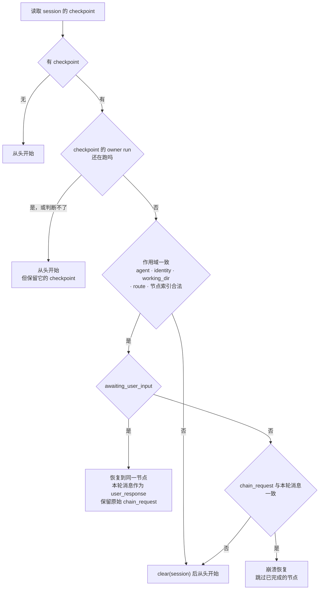

### 6.1 `_checkpoint_owner_still_running()` 解决的具体 bug

docstring 描述了这个 bug 的现场：

> 仅凭请求身份无法区分"上一个 run 崩了"和"上一个 run 还在跑"，所以重新提交一条完全相同的消息（超时后的客户端重试、第二次点击）曾经会接管那个活着的 run 的半成品状态——于是两个 run 在**同一个 working_dir 上写，彼此毫无协调**。

修法有两层保守：

1. `QUEUED` 也算"活着"——那个 run 还没执行，把它的 checkpoint 交给别人是同一个竞态，只是更早发生
2. **查不出状态就当它活着**（`except: return True`），fail-closed

而且发现 owner 还活着时，**故意不清 checkpoint**：

> 落到下面的 `clear()` 会删掉一个仍在执行的 run 的崩溃恢复点——正是这个检查要保护的状态。

### 6.2 恢复语义的两种差别

| 情形 | 从哪个节点继续 | 用户消息怎么用 |
|---|---|---|
| `awaiting_user_input` | **同一个**节点（`checkpoint.skill_chain_index`） | 作为 `user_response`，原始请求保留在 `chain_request` |
| 崩溃恢复 | **下一个**节点（`index + 1`） | 必须与原始 `chain_request` 完全一致才认 |

崩溃恢复要求消息**逐字一致**（exact-message only），这是刻意的保守：稍有不同就可能是一个新任务，接管旧状态会产生难以理解的行为。

---

### 6.1 检查点与恢复的四个前提

崩溃恢复不是一个函数，而是**四个子系统各自留下的痕迹**共同支撑的能力。少任何一个，恢复就不完整：

| 前提 | 谁负责 | 少了会怎样 |
|---|---|---|
| run 状态可持久化且状态转移合法 | `run_state.py`（[04](./04-Engine-核心执行.md) §7.1） | 不知道这个 run 崩在哪一步、能不能续 |
| trace 完整且可验证 | `trace_store.py` + 哈希链（[13](./13-Common-基础设施.md) §6） | 无法重建事件序列，也无法判断记录是否被改过 |
| summary 与 trace 可对账 | `runtime.py` 的四条分支（[10](./10-可观测性与诊断.md) §10.1） | 重复累加 token，或者 run 在列表里消失 |
| 用户消息绑定到 run | `message_id` 字段（[09](./09-Server-API层.md) §4.7 第 5 条） | 不知道该重放哪一轮对话 |

最后一条是**后加的**——早期的 run 没有 `message_id`，所以续跑时会明确拒绝："Run predates message-bound resume and cannot be resumed safely"。宁可拒绝也不猜，因为猜错会把一段无关的回复插进会话中间。

### 6.2 恢复的三条时序纪律

**① 校验全部在改状态之前。** 七道校验（[09](./09-Server-API层.md) §4.7）跑完才开 SSE 流。一旦流开了就只能在流里报错，客户端已经在读了。

**② 旧输出直到新输出产生才丢弃。** 续跑失败时原来那半截回复还在（[09](./09-Server-API层.md) §4.8）。这让续跑成为"要么改进要么不变"的操作。

**③ 锚点要先清后写。** `reopen → append → seal` 三步（[04](./04-Engine-核心执行.md) §7.1.2）。不先清陈旧锚点，合法的续写会被哈希链校验报成篡改——这是"防篡改系统必须能区分改动与增长"的又一个实例（[13](./13-Common-基础设施.md) §6.10）。

三条纪律跨越了四个子系统，而它们必须协同才成立。这也是为什么崩溃恢复是这个代码库里最容易写错的部分：**它的正确性不在任何单个文件里**。

### 6.3 为什么恢复选择"保守失败"

翻遍恢复路径，会发现所有不确定的情况都倒向同一个方向：**拒绝、隔离、保留，而不是猜测、修补、清理**。

| 情况 | 选择 | 拒绝的选项 |
|---|---|---|
| trace 校验失败 | 隔离，只写合成终态摘要 | 在损坏的记录后继续追加 |
| 状态文件损坏 | 跳过并保留原文件 | 覆盖成默认值 |
| 缺 `message_id` | 拒绝续跑 | 猜一个最近的用户消息 |
| 会话已有更新的用户轮次 | 拒绝续跑 | 把旧回复插进当前对话 |
| 续跑本身失败 | 保留原有的半截回复 | 清空重来 |

五条的共同逻辑：**恢复操作面对的是已经出过一次问题的数据**。此时任何"聪明的补救"都建立在对现场的猜测上，而猜错的代价是把一个可诊断的故障变成一个不可解释的错误状态——用户会看到一段来历不明的回复，或者一份内容被悄悄改过的记录。

保守失败的代价是有些本可以恢复的 run 恢复不了。这个交换是划算的，因为**恢复失败是可见的、可以人工介入的**，而恢复错误是隐蔽的、会被当成正常结果继续用下去。

---

## 7. SSE 传输层

Server 把 `ExecutionEvent` 序列化成 SSE 帧推给 Shell：

```
event: message
data: {"type":"text_delta","data":{"text":"..."}}

event: message
data: {"type":"tool_call_start","data":{"name":"read_file"}}
```

`ExecutionEvent.to_dict()` 是唯一的序列化入口，注释说它产出的是"transport-safe dictionary"。

Shell 侧的解析在 `shell/src/api.ts`（1053 行）与 `shell/src/bridge.ts`（1103 行）。这里有一个踩过的坑值得记：**SSE 的 CRLF 会产生幻影帧**——如果按 `\n\n` 切帧而不处理 `\r\n\r\n`，会解析出空事件。

---

## 8. 并发与进程生命周期

### 8.1 一个事件循环，三类任务

后端是**单进程、单事件循环**。上面跑着三类任务：

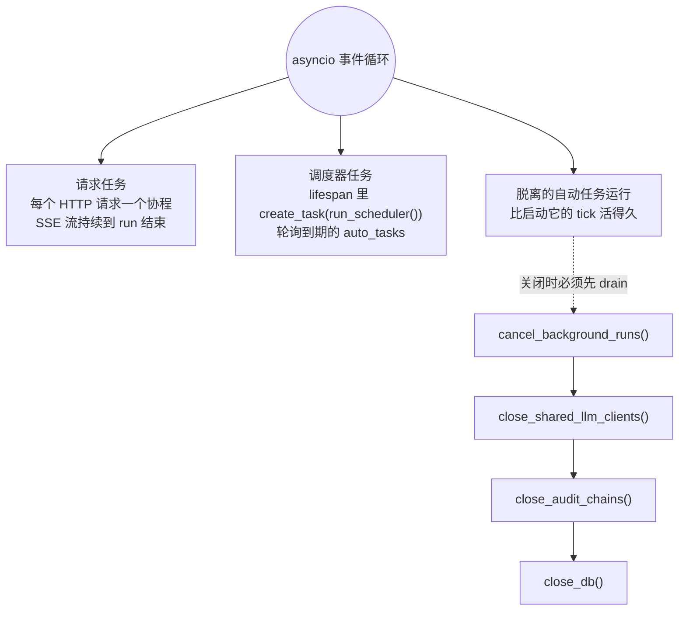

关闭顺序不是随便排的，`server/app/main.py` 的 `lifespan` 里有注释：

> 脱离的自动任务运行比请求、也比启动它的 tick 活得更久，所以要在**它们还在使用的 LLM 客户端消失之前**把它们排空。

四步顺序的依赖关系是：**运行中的任务 → 它们用的客户端 → 审计链头 → 数据库连接**。任何一步提前，前一步就会在半路失去它依赖的资源。

### 8.2 没有工作进程池

`uvicorn` 用单 worker 跑。原因回到产品定位：单用户、单机。多 worker 会带来 SQLite 写竞争、进程间状态不共享、审计链头无法确定这三个新问题，换来的并发能力对一个人来说没有意义。

但代码里仍然为"多进程打开同一个 DB"做了防御——`_reset_stuck_auto_tasks()` 的注释列举了这种情况的真实来源：server worker、CLI 会话、dev 热重载。**不追求多进程，但不能在多进程下损坏数据**，这是两件事。

### 8.3 阻塞操作怎么处理

工具执行（读文件、跑 shell、解析 PDF）是同步阻塞的。它们通过线程池离开事件循环，否则一次 `shell` 调用会冻住所有 SSE 流。

这里有过一个真实的教训：记忆模块的 `dream.py` 曾经在错误的线程上下文里调用 asyncio，属于同一类问题的另一面——**判断一段代码跑在哪个线程上，是这套架构里最容易出错的地方之一**。

---

## 9. 错误传播与失败模式

一个 Agent 系统的质量，很大程度上取决于它出错时的行为。这里有五类失败，各有各的处理策略：

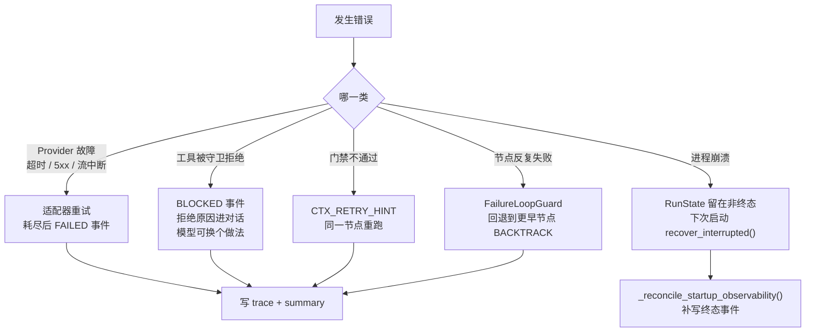

### 9.1 五类失败的设计取向

| 失败类型 | 谁负责 | 用户看到什么 | 为什么这样设计 |
|---|---|---|---|
| Provider 故障 | `engine/llm/adapters/_retry.py` | 重试无声，耗尽后报错 | 瞬时故障不该打扰用户；持久故障必须显式 |
| 工具被拒 | `ToolGuard` / `PreToolHook` | `BLOCKED` + 原因文本 | **拒绝原因进对话**，让模型有机会换一条路，而不是整个 run 失败 |
| 门禁不过 | `engine/execution/pipeline/gate.py` | 节点重跑 | 门禁的反馈是给模型的，不是给用户的 |
| 循环失败 | `FailureLoopGuard` | `BACKTRACK` | 同一个节点反复失败说明问题在更早的节点 |
| 进程崩溃 | `RunStateStore` | 下次启动看到"可恢复" | 崩溃不该丢掉已完成的节点 |

第二行是最能体现设计取向的：**被拒绝的工具调用不是 run 的失败，而是对话的一部分**。模型收到"这个操作被拒绝了，因为 X"，可以选择换个方式达成目标。如果直接让 run 失败，用户就得自己重新组织请求。

### 9.2 崩溃后的可观测对账

`server/app/main.py:_reconcile_startup_observability()` 处理一个很窄但很讨厌的窗口：**崩溃发生在写 trace 之后、写 summary 之前**。

```python
if state.run_id not in recovered and summaries.get(state.run_id) is not None:
    continue
```

判定逻辑分两种情形：

- **被恢复的 run**：即使之前的尝试已经有 summary，也**需要一个新的终态事件**
- **其它终态 run**：只在"崩溃落在写 trace 之后、写 summary 之前"时才重访

如果不做这件事，运行档案里会出现"有 trace 没结论"的孤儿运行，而健康度统计会把它们算成永远未完成。

### 9.3 失败也要留证据

`_execution_error_details()`（`lifecycle.py:222`）把异常转成结构化的错误详情写进事件。这一条的意义是：**一个 Agent 系统里，失败的运行往往比成功的运行更值得分析**。`/trace` 和 `/api/agent/observability/runs/{run_id}/diagnosis` 消费的就是这些数据。

---

## 10. 层归属决策树

要改一个东西，先判断它属于哪层：

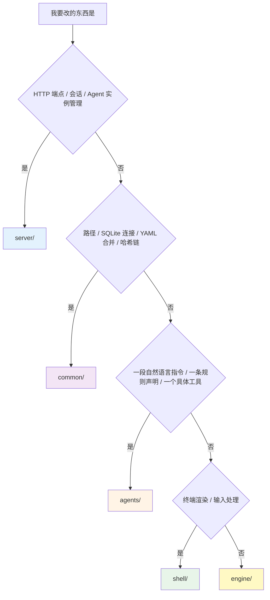

判断口诀：

- **"它需要知道 HTTP 吗？"** 需要就是 `server/`
- **"它是一句话还是一段逻辑？"** 一句话就是 `agents/`
- **"换个前端它还有用吗？"** 有用就是 `engine/`
- **"它有业务含义吗？"** 没有才是 `common/`

---

### 10.1 测试的分层全景

三个测试套件，**1 565 个测试**，分布本身就是一张架构地图：

| 套件 | 数量 | 跑法 |
|---|---|---|
| `engine/` | 1 041 | `cd engine && uv run --extra test pytest tests` |
| `shell/` | 304 | `cd shell && npm test` |
| `server/` | 220 | `cd server && uv run --extra dev pytest tests` |

按子系统拆开（各篇的"测试锁住了什么"一节有详表）：

| 子系统 | 测试数 | 对应文档 |
|---|---|---|
| 工具与守卫 | 196 + 156 | [08](./08-Agents-内容层.md) §10.1、[06](./06-安全与安全边界.md) §11.1 |
| 记忆 | 157 | [05 · 记忆系统](./05-记忆系统.md) §14.1 |
| LLM | 97 | [07 · LLM 集成](./07-LLM-集成.md) §18 |
| MCP | 51 | [12 · MCP 集成](./12-MCP-集成.md) §17 |
| 可观测性 | 47 | [10 · 可观测性与诊断](./10-可观测性与诊断.md) §15 |
| Common 基础设施 | 38 + 20 | [13 · Common 基础设施](./13-Common-基础设施.md) §10 |
| Shell | 304 | [11 · Shell 终端 UI](./11-Shell-终端UI.md) §13.0 |
| Server 各 service | 220 | [09 · Server API 层](./09-Server-API层.md) §13 |

### 10.2 测试分布揭示的三件事

**① 安全与工具占了最大比重（352 个）。** 这不是因为它们代码最多（`safety/` 2 749 行只占 engine 的 10%），而是因为**每一条安全规则都要在多个入口各测一遍**（[06 · 安全与安全边界](./06-安全与安全边界.md) §12.2）。测试数与代码量的比例，反映的是"这段代码错了有多严重"。

**② 记忆的 157 个里有 32 个只测三道守卫。** 守卫代码只有 283 行，却占了记忆测试的五分之一——因为它是唯一"判错会污染长期记忆"的地方，而记忆会被注入未来每一次 prompt（[05 · 记忆系统](./05-记忆系统.md) §15.1）。

**③ Shell 的 304 个是第二多。** 终端 UI 通常被认为"测不了"，这里的做法是把可测的部分（状态转换、SSE 解码、输入路由、注入防护）和不可测的部分（实际渲染效果）分开。304 个测试覆盖前者，后者靠真实终端手动验证（[11 · Shell 终端 UI](./11-Shell-终端UI.md) §14.2 末尾）。

### 10.3 跨层验证：三处必须一起改

架构的一个真实代价是**有些约束跨越层边界，代码无法共享**。这些地方只能靠测试和文档对抗漂移：

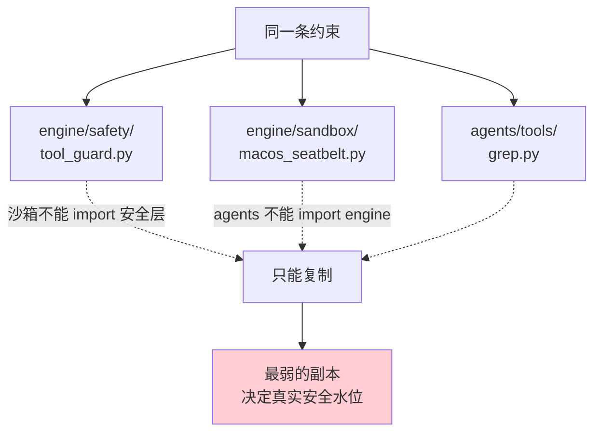

已知的三处同步点：

| 约束 | 三处实现 | 漂移记录 |
|---|---|---|
| 凭据配置文件名 | `_CREDENTIAL_CONFIG_NAMES` / `_CREDENTIAL_CONFIGS` / `SECRET_EXCLUDED` | [06](./06-安全与安全边界.md) §3.4（`.npmrc`） |
| SSH 私钥文件名 | `_SENSITIVE_KEY_NAME_RE` / `_PRIVATE_KEY_NAME_RE` | [06](./06-安全与安全边界.md) §9.2（`id_rsa_old`） |
| 子进程环境白名单 | `_safe_environment` / `_MCP_SAFE_ENV_KEYS` / `_OPTIONAL_ENV_KEYS` | 三处措辞一致，尚无记录在案的漂移 |

**两次已知漂移的方向相反**——一次是沙箱严而工具松，一次是工具严而沙箱松。这说明问题不在某个模块，而在"同一约束三处实现"这个结构。

架构选择保留边界（`agents/` 独立、沙箱不依赖安全层）并接受这个代价。缓解手段有三层：源码注释里写明"Change all three together"、各处测试分别覆盖、本套文档把三处列在一起。**这不是一个优雅的解法，但它是诚实的**——把代价写下来，比假装不存在好。

---

## 11. 跨层反模式清单

这些写法在 review 时应当被打回：

| 反模式 | 为什么错 | 正确做法 |
|---|---|---|
| 在 `engine/` 里 `from fastapi import ...` | 引擎绑死在一个 web 框架上 | 用普通数据类和生成器，让 server 去适配 |
| 在 `agents/tools/*.py` 里 `from common.paths import PATHS` | 内容层不再独立 | 在工具文件内重新推导路径（重复是有意的） |
| 在 router 里写业务判断 | service 层被架空 | 取参，调 service，返回 |
| 在 `common/` 里加一个"顺手"的业务函数 | 基础设施层开始长业务 | 放 `engine/` |
| 让引擎从 `os.getcwd()` 取工作区 | uvicorn 的 cwd 不是用户的项目目录 | 由调用方显式传 `working_dir` |
| 共享客户端配 `owns_llm_clients=True` | 第一个请求结束就关掉别人要用的连接 | 共享客户端一律 `owns_*=False` |
| 在管线节点的 `instructions` 里写"请不要修改文件" | 提示词不是约束 | 从 `allowed_tools` 里去掉写工具 |
| 门禁逻辑写进 `engine/` | 引擎开始知道"什么是 TDD" | 放 `agents/gates/<domain>/` |

---

### 11.1 十个"这该放哪一层"的实例

§10 的决策树是抽象规则，这里是具体案例。每一条都能从现有代码里找到对应。

| 我要做的事 | 放哪一层 | 为什么 |
|---|---|---|
| 加一个新工具 | `agents/tools/` | 内容层。契约是 `TOOL_META` + `execute`，不需要引擎知道它 |
| 让工具能读一种新文件格式 | `agents/tools/` | 同上。解析逻辑属于工具自己 |
| 改工具执行前的权限判定 | `engine/safety/` | 安全边界是引擎的职责，不能让内容层自己声明"我很安全" |
| 加一个新的事件类型 | `engine/execution/events.py` | 事件是跨层契约，四个消费方都要认它 |
| 改事件在终端里怎么显示 | `shell/src/` | 渲染是前端的事，引擎只管发事件 |
| 加一个 HTTP 端点 | `server/app/routers/` + 对应 service | 路由取参，逻辑进 service（§1.1 第三条） |
| 改会话历史的裁剪策略 | `server/app/services/` | 这是编排逻辑，engine 只接受传进来的 history |
| 改 prompt 里某一层的内容 | `agents/smith/*.md` | 人格是内容 |
| 改 prompt 有几层、顺序如何 | `engine/context/assembler.py` | 装配机制是引擎 |
| 加一个路径工具函数 | `common/paths.py` **仅当**三层都要用 | 只有一个调用方就放调用方那里（[13](./13-Common-基础设施.md) §9.1 末尾） |

三条容易搞反的：

**① "改工具能做什么" vs "改工具允许做什么"。** 前者在 `agents/`，后者在 `engine/safety/`。一个工具可以声明自己需要 `write` 权限，但**它不能声明自己不需要审批**——`approval_policy` 虽然写在 `TOOL_META` 里，最终仍要过守卫这一关（[06](./06-安全与安全边界.md) §1）。内容层的声明是**输入**，不是**结论**。

**② "会话历史" vs "prompt 上下文"。** 会话历史（哪些消息、裁剪到几条）是 server 的编排职责；prompt 上下文（16 层怎么拼、超预算怎么裁）是 engine 的装配职责。两者在 `EngineRequest.history` 这个字段上交接——server 决定传什么进来，engine 决定怎么用。

**③ "事件发不发" vs "事件长什么样"。** 事件类型的定义在 `engine/execution/events.py`，是跨层契约（§3.4 说了它只增不改）；但**某个具体场景要不要发这个事件**是各子系统自己的决定。加一个事件类型的成本远高于发一次已有事件——前者影响四个消费方，后者只影响自己。

### 11.2 三个常见的架构疑问

**Q：为什么 `agents/` 里有 `.py` 却不算代码层？**

因为它不被 import，只被 `exec_module` 执行（§1.2）。判据不是"文件后缀是什么"，而是"依赖关系怎么走"。`agents/tools/grep.py` 里的 Python 代码和 `agents/smith/role.md` 里的 Markdown 在架构上是同一种东西——**运行时读取的内容**，可以被用户替换，不参与构建。

**Q：为什么 `server/` 比 `engine/` 小这么多（6.1k vs 26.3k）？**

因为 `server/` 只做编排：接请求、查权限、调 engine、转发事件。所有"怎么执行一个任务"的知识都在 engine 里。这个比例是健康的——如果 server 开始变大，通常意味着业务逻辑正在从 service 层漏进路由层，或者 engine 该提供的能力被 server 用胶水代码补上了。

**Q：`shell/` 10.7k 行是不是太多了？**

终端 UI 的复杂度不在功能而在**约束**：没有 DOM、没有 CSS、宽度要自己算、重绘代价高、还要防终端转义注入（[11](./11-Shell-终端UI.md) §5.9）。这 10.7k 行里，`index.tsx` 1 299 行 + `bridge.ts` 1 103 行 + `api.ts` 1 053 行就占了三分之一，剩下的是十几个渲染组件。相比之下一个同等功能的 Web 前端不会更小。

### 11.3 判断改动是否越界的三个信号

**① 你需要新增一个跨层的数据字段。** 这通常意味着抽象漏了。先问：接收方真的需要这个字段，还是它应该自己算出来？`EngineRequest` 八个字段、`RuntimeContext` 八个字段——数量少是有意维持的，每加一个都在扩大层间耦合。

**② 你需要在两层各写一份相同的逻辑。** 大多数情况说明这个逻辑放错了层，应该下沉到共同依赖（`common/`）或上移到共同调用方。**只有当层边界明确禁止共享时**（§10.3 那三处），复制才是正确答案——而那时必须留下注释和测试。

**③ 你需要让下层知道上层的存在。** 比如让 `engine/` 判断"当前是 HTTP 请求还是自动任务"。这是最明确的越界信号。正确做法是让上层把差异**作为参数**传下去（`RuntimeServices.owns_llm_clients` 就是这么做的——engine 不知道谁在调它，只知道该不该关连接）。

---

## 12. 这一层结构的代价

诚实地列出来：

**① 一个改动经常要动三层。** 加一个工具要：写 `agents/tools/x.py`、在 `agents/smith/config.yaml` 的白名单里加名字、可能还要在 identity 的 `tools.enabled` 里加。三处漏一处就静默不生效。

**② 内容层的错误发现得晚。** `agents/` 是数据，类型检查器看不到它。缓解手段是 `validate_execution_assets()` 在**启动时**校验身份声明的技能名和工具名——把运行时错误提前成启动错误，但仍然不是编译期。

**③ 路径推导重复。** 已经在 `CLAUDE.md` 里被显式接受为代价。

**④ 事件流是弱类型的。** `ExecutionEvent.data` 是 `dict[str, Any]`。好处是加字段不用改契约，坏处是消费方拿到的字段没有静态保证。目前靠测试和 `raw_text_delta()` 这类提取函数收敛。

这四条都是**知道且接受**的，不是疏忽。判断一个架构好不好，看的不是它有没有代价，而是它的代价是不是被写下来了。

---

### 12.1 五层各自的"最贵约束"

每一层都有一条最贵的约束——它带来的成本最高，但去掉它整层就不成立了。理解这五条，比记住五层的名字有用得多。

**`common/`：不能有业务逻辑。** 代价是有些明显可以复用的东西不能放进去（只有一个调用方的函数、带领域含义的常量）。收益是三层都能安全依赖它——一旦它开始装业务逻辑，依赖方向就会开始反转（[13](./13-Common-基础设施.md) §9.1 末尾）。

**`engine/`：不能知道 FastAPI、HTTP、Agent 实例管理。** 代价是所有平台相关的东西都要作为参数传进来——`RuntimeContext` 八个字段、`RuntimeServices` 十一个字段，都是这条约束的产物。收益是引擎可以被嵌进任何宿主（CLI、测试、别的服务），而不只是这一个 server。

**`agents/`：不能 import 任何层。** 代价是**路径推导重复、安全规则要复制三份**（§10.3）。收益是内容层可以被完整替换——用户可以拿自己的 `agents/` 目录跑同一个引擎。

**`server/`：路由必须薄。** 代价是每加一个端点都要写两处（router + service）。收益是同一套逻辑能被 HTTP、自动任务、续跑三条入口复用（[09](./09-Server-API层.md) §12.1 末尾）。

**`shell/`：所有后端通信走 `bridge.ts`。** 代价是加一个 API 调用要在 bridge 里加方法而不能在组件里直接 fetch。收益是竞态防护、状态更新、批处理都能集中实现（[11](./11-Shell-终端UI.md) §5.5）。

五条的共同形状：**用局部的不便，换整体的可替换性**。这也是判断一个改动是否值得的标准——如果它让某一层变得更难被单独替换或测试，那么再方便也是在透支。

### 12.2 什么时候应该打破这些约束

架构约束不是教条。三种情况下打破它是对的：

**① 约束保护的性质已经不需要了。** 比如如果将来确定引擎永远只跑在这一个 server 里，那"engine 不知道 FastAPI"这条就可以放松。判断标准是**收益是否还存在**，不是"以前就这么写的"。

**② 遵守约束的代价开始产生正确性问题。** §10.3 那三处同步点已经漂移过两次，每次都是真实的安全漏洞。如果第三次、第四次还在发生，那么"保持边界"的收益可能已经小于"规则不一致"的代价——那时应该考虑换一种架构（比如把安全规则做成三层都读的数据文件，而不是三份代码）。

**③ 有更好的机制能保证同样的性质。** 现在靠注释和测试防止漂移，如果将来有了自动化的一致性检查（比如一个测试直接比对三处常量集合是否相等），那么"复制"的风险就被机制消除了，边界可以保持而代价降低。

**不应该打破的情况**：赶时间、觉得麻烦、"就这一次"。这三个理由累积起来就是架构腐化的全部原因。真要走捷径，至少留一条注释说明这是捷径以及为什么——**记录在案的技术债还能被还，无声的技术债只会被继承**。

### 12.3 这套架构解决的三个真实问题

抽象地谈分层没有意义。这五层的划分回应的是三个具体问题，每个都能在代码里找到痕迹。

**① 引擎要能脱离这个 server 存在。** 这不是假设——`RecordingLLM` / `ReplayLLM`（[07](./07-LLM-集成.md) §12）、`engine/tests/` 里的 1 041 个测试、以及 `RuntimeContext.default_working_dir` 那条"引擎绝不从自己进程的 cwd 推导工作区"（§2.2），三者都建立在"引擎不知道谁在调它"这个前提上。如果引擎里有一行 `from fastapi import ...`，这 1 041 个测试就都要起一个 HTTP 服务才能跑。

**② 内容要能被用户完整替换。** `agents/` 不被 import 的代价很实在（三处安全规则复制、路径推导重复），换来的是用户可以把整个 `agents/` 目录换成自己的——自己的人格文件、自己的工具、自己的技能，跑同一个引擎。这是"workbench"这个定位的技术前提：**如果内容和代码耦合，它就只是一个固定的产品，不是一个工作台**。

**③ 安全边界不能被内容层削弱。** 这是最关键的一条。工具由用户提供（甚至可以是从网上抄来的），如果工具能声明"我不需要审批"，整个安全模型就崩了。所以 `TOOL_META` 里的 `approval_policy` 只是**输入**，最终结论由 `engine/safety/` 给出（§11.1 ①）。层边界在这里承担的是**信任边界**的职责——下层不信任上层的自述。

三个问题的共同点：它们都是**关于"什么可以变"的问题**。分层的本质不是把代码分成几堆，而是**声明哪些部分可以独立变化**。判断一个改动是否合适，最终也回到这个问题：它让"可以变的部分"更容易变了，还是把它们粘得更紧了？

---

## 12.4 一句话记住每一层

读完这篇如果只能记住五句话，是这五句：

- **`common/`**：所有人都需要、且没有业务含义的东西。它一旦长出业务逻辑，依赖方向就开始反转。
- **`engine/`**：知道怎么执行一个任务，但不知道谁在调它。它的每一个"外部事实"都是参数传进来的。
- **`agents/`**：数据不是代码。它可以被用户整个换掉，代价是拿不到任何共享常量。
- **`server/`**：只做编排。它变大通常意味着逻辑漏进了路由层，或者 engine 该提供的能力被胶水代码补上了。
- **`shell/`**：所有后端通信走一个出口。它的复杂度不在功能而在终端的约束。

五句话的共同结构是"这一层知道什么、不知道什么"。**分层的本质是划定无知的边界**——一层不该知道的东西，就是它可以被独立替换的空间。

判断一个改动是否合适，最终都回到同一个问题：**它让"可以变的部分"更容易变了，还是把它们粘得更紧了？**

---

## 13. 接下来

| 想深入 | 读 |
|---|---|
| ReAct 循环、管线、门禁、工具执行的细节 | [04 · Engine 核心执行](./04-Engine-核心执行.md) |
| 16 层 prompt 的每一层是什么 | [04 · Engine 核心执行](./04-Engine-核心执行.md) |
| 事件怎么变成运行档案 | [10 · 可观测性与诊断](./10-可观测性与诊断.md) |
| 端点清单与 service 分工 | [09 · Server API 层](./09-Server-API层.md) |
| Shell 怎么消费这个事件流 | [11 · Shell 终端 UI](./11-Shell-终端UI.md) |

---

> **一句话收尾**：五层的划分不是为了好看，而是为了回答"什么可以独立变化"。引擎要能脱离这个 server 存在，内容要能被用户整个替换，安全边界不能被内容层削弱——三个需求各自砍出一条边界，代价是三处必须手工同步的常量和几处重复的路径推导。**这些代价是明码标价的，写在注释里、测试里、和这份文档里。** 判断一个改动是否合适，最终都回到同一个问题：它让"可以变的部分"更容易变了，还是把它们粘得更紧了？

补充一句：这五层里最容易被忽视的是 `common/`。它只有 1 406 行，却被另外三层依赖——正因如此，它的每一处改动影响面都比行数暗示的大得多。往里加东西之前先确认三层是真的都要用，而不是「放这里比较方便」。

最后提醒一点：本篇给出的所有行数都附了统计口径（§1.3、§1.4）。跨篇比对数字时先确认口径是否一致——`shell` 在 [01 · 总览](./01-总览.md) 里记的是 16.4k（含测试），本篇记的是 10.7k（不含测试），两个都对。口径不同不是矛盾，但把它们直接相比就会得出错误结论。

如果这一篇只读一节，读 §10.3「跨层验证：三处必须一起改」——它是这套分层最贵的代价，也是最容易在重构中被忽视的地方。
