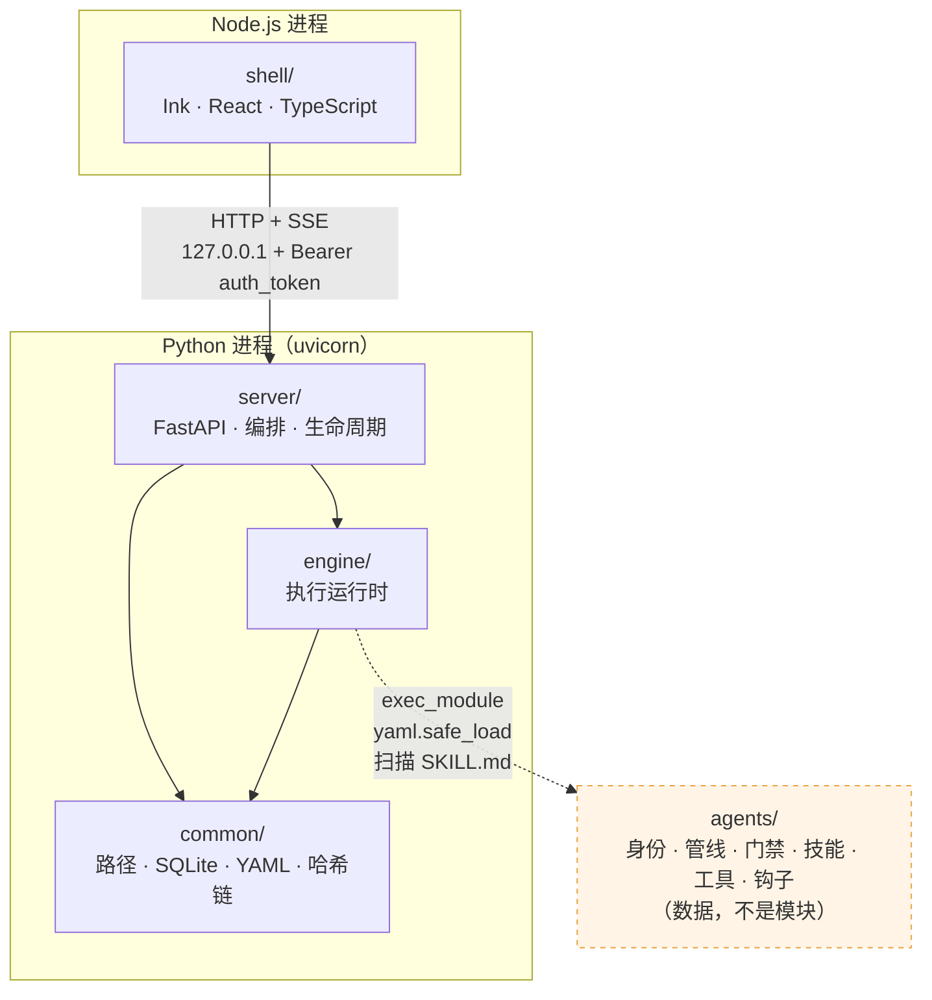
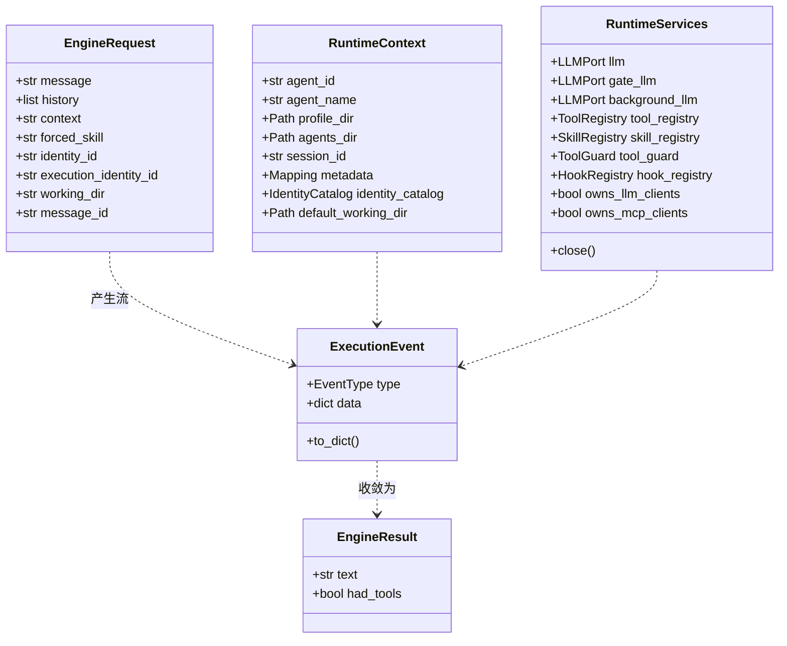
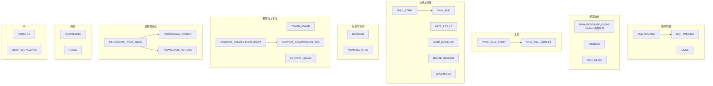
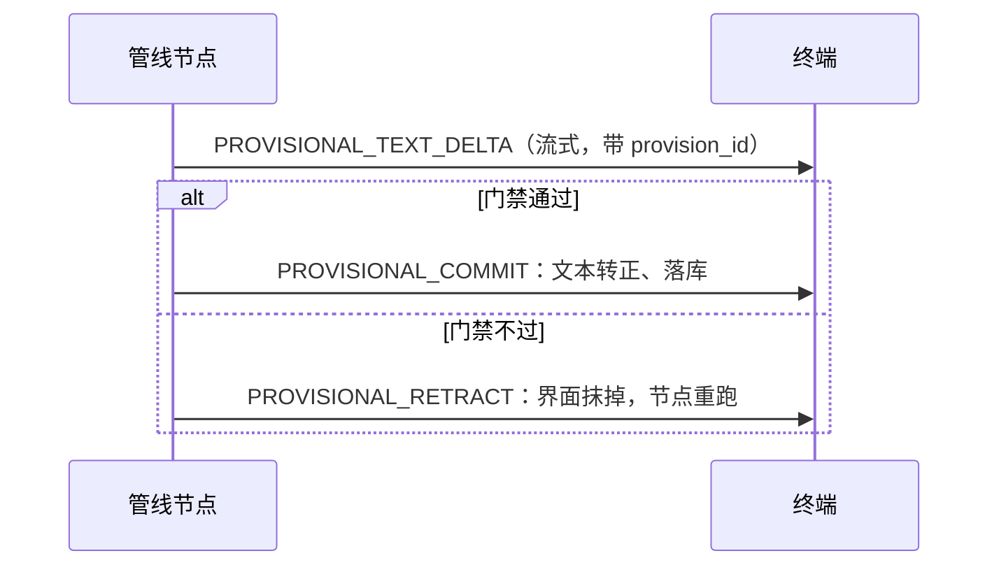
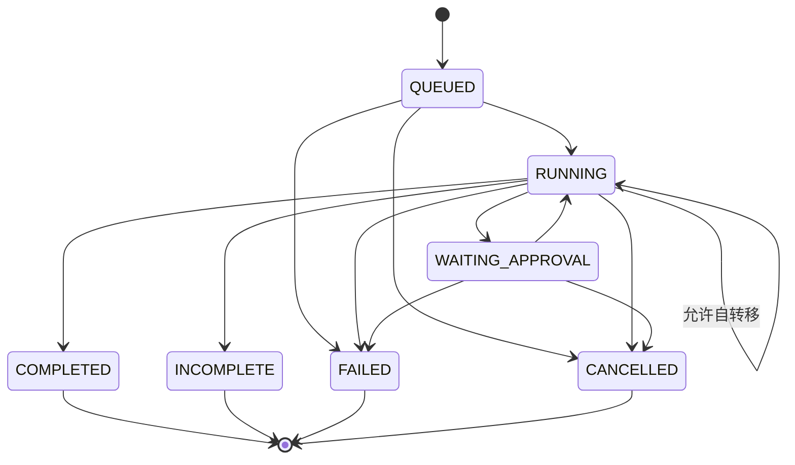
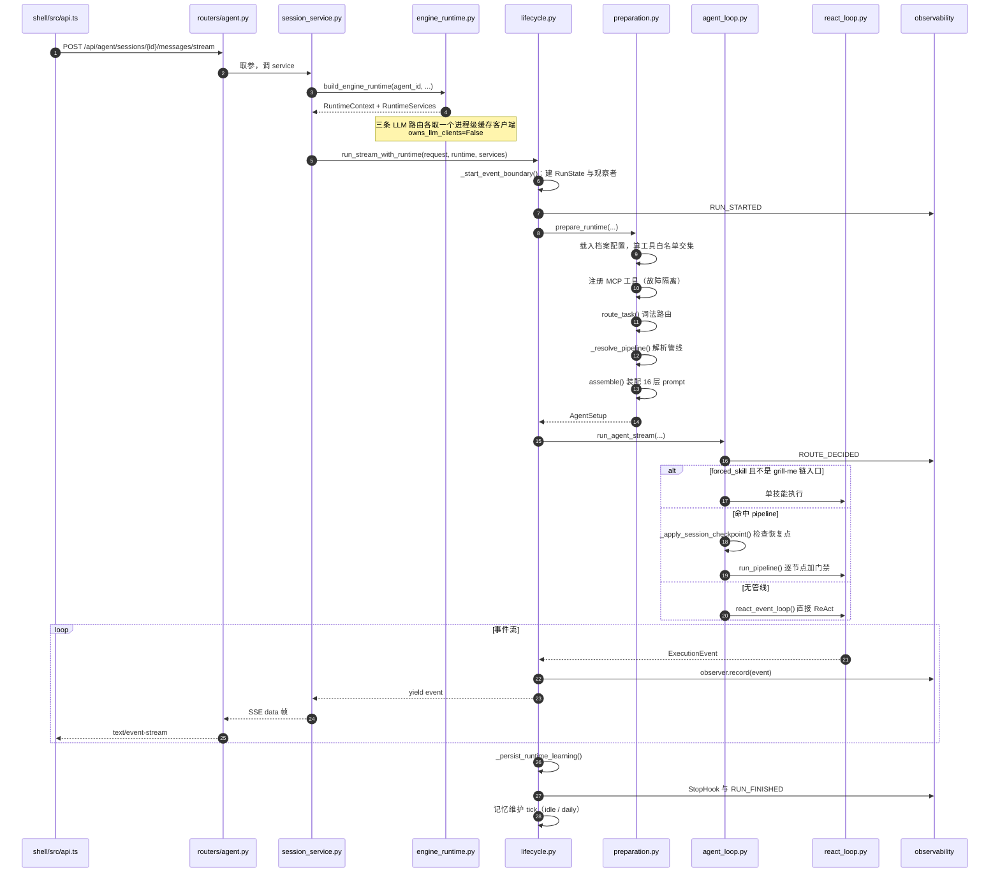
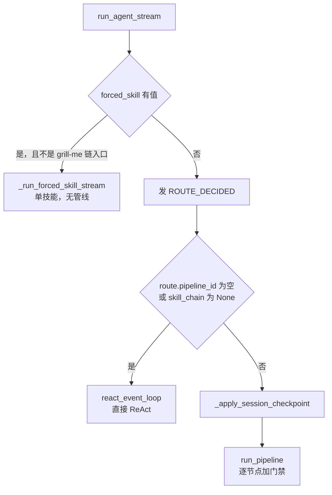
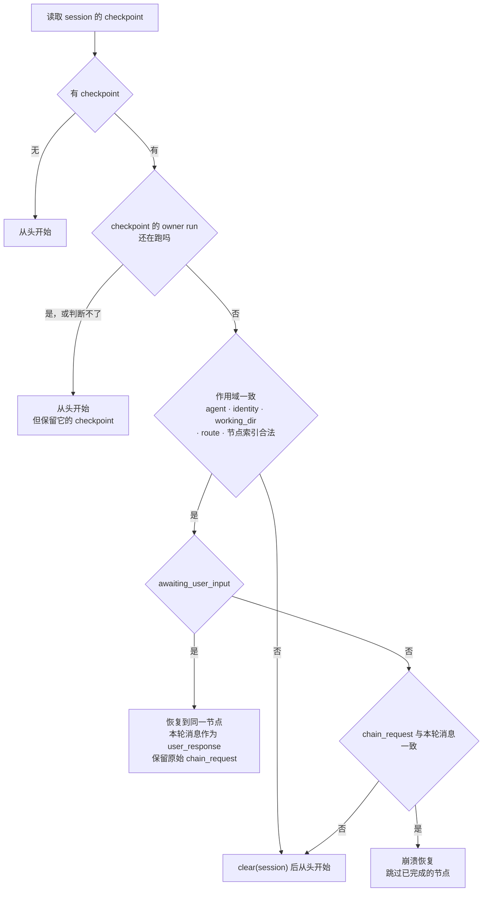
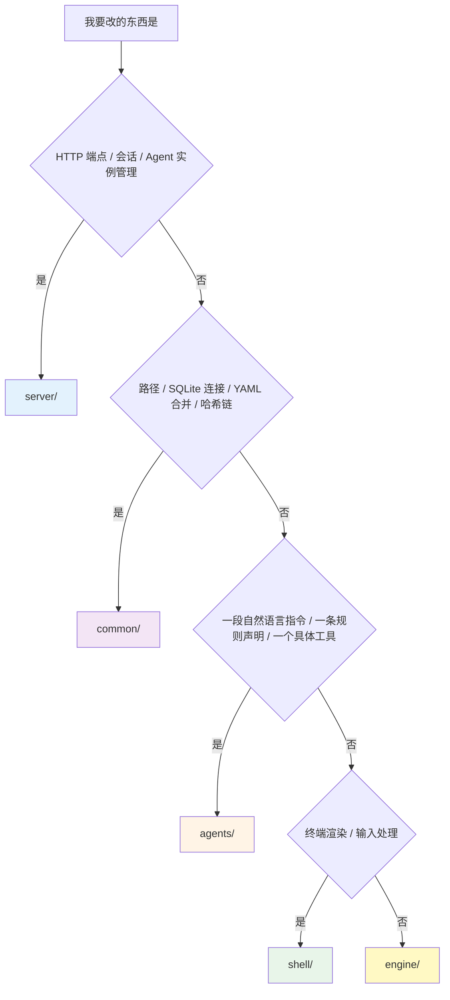

# 03 · 架构总览

> **定位**：五层的边界在哪、跨层的契约长什么样、一次请求从回车到渲染完整走过哪些函数。
> **适合**：要动这个代码库的人。读完这篇，你应该能判断"我这个改动该放哪一层"。

---

## 1. 五层与依赖方向



### 1.1 三条硬规则

| 规则 | 违反的表现 | 怎么发现 |
|---|---|---|
| `engine/` 不得 import FastAPI / HTTP / Agent 实例管理 | engine 变得只能在这个 server 里跑 | import 图检查 + code review |
| `agents/` 不 import 任何其它层 | 内容层变成代码库的一部分，不能独立分发 | 内容层文件里出现 `from engine...` |
| `server/app/routers/` 保持薄 | 业务逻辑散进路由，service 层形同虚设 | 路由函数超过"取参 → 调 service → 返回" |

`CLAUDE.md` 强调这三条是"由 import 图验证，不是靠约定"。这句话的分量在于：**边界如果只靠人的自觉，它三个月内一定会烂**。

### 1.2 `agents/` 为什么不是一个 Python 包

它有 `.py` 文件，但它不是包。工具的加载方式是：

```python
# engine/tool/registry.py 的语义（简化）
spec = importlib.util.spec_from_file_location(name, path)
module = importlib.util.module_from_spec(spec)
spec.loader.exec_module(module)          # ← 执行，不是 import
if hasattr(module, "TOOL_META") and hasattr(module, "execute"):
    register(module)
```

契约是**两个符号的存在性**，不是类型。带来的三个后果：

1. 工具文件可以放在任何路径（内建目录、`~/.agent-smith`、别人的仓库）
2. 工具文件里拿不到 `common/paths.py` 的常量，**路径推导会重复**——这是有意接受的成本
3. 一个坏掉的工具文件不会让整个注册表崩掉（注册是逐文件隔离的）

---

## 2. 跨层契约

Engine 对外只暴露五个数据结构。理解了它们，就理解了 server 和 engine 之间的全部通信。



### 2.1 `EngineRequest` 里的两个 identity

这是最容易读错的一处。它有**两个**身份字段，含义完全不同（docstring 写得很清楚）：

| 字段 | 含义 |
|---|---|
| `identity_id` | 会话对**普通 ReAct 执行**偏好的身份。**它不是路由命名空间**——显式的 SkillChain 意图每一轮都在全局范围内解析 |
| `execution_identity_id` | 只在**恢复一个持久化的 run** 时才有值。它把恢复绑定到上一轮实际执行的身份，而这个身份可能和会话的 ReAct 偏好不同 |

为什么要分开：会话可能偏好 `smith` 身份，但上一轮因为说了"code review"而进了 `coding` 身份的管线。恢复那个 run 必须回到 `coding`，否则恢复出来的是一个上下文不匹配的 run。

### 2.2 `RuntimeContext` 里的一条安全约束

```python
default_working_dir: Path | None = None
# caller-supplied fallback for trusted embeddings and tests.
# The engine never derives a workspace from its own process current directory.
```

**引擎绝不从自己进程的当前目录推导工作区**。这条约束很重要：uvicorn 的 cwd 是启动它的地方，如果引擎默认用它，一个没带 `working_dir` 的请求就会在错误的目录里读写文件。所以工作区必须由调用方显式给。

### 2.3 `RuntimeServices` 的资源所有权

两个布尔字段决定了"谁负责关"：

| 字段 | `True`（默认） | `False` |
|---|---|---|
| `owns_llm_clients` | 本次请求结束时关掉 LLM 客户端 | 客户端是进程级共享的，请求结束不关 |
| `owns_mcp_clients` | 同上，关 MCP 客户端 | 由会话池管理 |

`server/app/services/engine_runtime.py` 构建运行时时把两个都设成 `False`，因为它用的是**进程级缓存的客户端**（`LLMClientManager` + `MCPClientSessionPool`）。如果设成 `True`，第一个请求结束就会关掉所有后续请求要用的连接。

`close()` 的实现里有一段值得抄的中文注释：

```python
# 逐资源隔离：第一个 close 抛异常不许掐断其余资源的清理，
# 否则 MCP 子进程/LLM 连接会在长期运行的进程里泄漏。
```

而且它对 `asyncio.CancelledError` 有特殊处理——记下来但**继续清理剩余资源**，最后再重新抛出。取消信号不能变成资源泄漏的借口。

关 LLM 时还做了去重（`closed_llms: set[int]`），因为 `llm` / `gate_llm` / `background_llm` 很可能指向同一个对象。

---

## 3. 事件模型

Engine 是一个**事件流生成器**。26 种事件类型：



全表：

| 事件 | 何时发 | 消费方关心什么 |
|---|---|---|
| `RUN_STARTED` | run 开始 | 建 trace 文件、写 RunState |
| `ROUTE_DECIDED` | 路由完成 | 显示走了哪条链或 direct ReAct |
| `RAW_RESPONSE_EVENT` | 每个 provider 原始事件 | 归一化后提取文本增量 |
| `THINKING` | 推理内容 | 折叠显示 |
| `TEXT_DELTA` | 归一化的文本增量 | 终端追加渲染 |
| `TOOL_CALL_START` | 工具调用发起 | 显示工具名和参数 |
| `TOOL_CALL_RESULT` | 工具返回 | 显示结果（可能被截断） |
| `SKILL_START` / `SKILL_END` | 技能节点起止 | 管线进度 |
| `GATE_RESULT` | 门禁判定 | 通过/不通过 |
| `GATE_EVIDENCE` | 门禁依据 | 为什么这样判 |
| `BACKTRACK` | 回退到更早节点 | 管线进度回卷 |
| `BLOCKED` | 被守卫/钩子阻断 | 显示拒绝原因 |
| `AWAITING_INPUT` | 节点等用户回答 | 暂停并提示 |
| `TOKEN_USAGE` | 用量统计 | 写 `token_usage_events` |
| `CONTEXT_USAGE` | 上下文占用 | HUD 显示 |
| `CONTEXT_COMPRESSION_START` / `_END` | 压缩上下文 | 提示"正在压缩" |
| `PROVISIONAL_TEXT_DELTA` | 试探性文本 | 先渲染，可能被撤回 |
| `PROVISIONAL_COMMIT` | 试探性文本转正 | 落库 |
| `PROVISIONAL_RETRACT` | 试探性文本撤回 | 从界面抹掉 |
| `SMITH_UI` / `SMITH_UI_FALLBACK` | 结构化 UI 组件 | 富渲染，降级为文本 |
| `INCOMPLETE` | 未完成 | 标注并可恢复 |
| `FAILED` | 失败 | 显示错误 |
| `DONE` | 一段执行结束 | 停止追加 |
| `RUN_FINISHED` | run 结束 | 写摘要、跑 StopHook |

### 3.1 为什么有 `RAW_RESPONSE_EVENT` 又有 `TEXT_DELTA`

`raw_text_delta()` 这个辅助函数解释了两者的关系：

```python
def raw_text_delta(event, *, include_provisional=True) -> str | None:
    # RAW_RESPONSE_EVENT + data.type == OUTPUT_TEXT_DELTA → 提取 data.data.delta
```

`RAW_RESPONSE_EVENT` 是**provider 原始事件的透传**，保留全部字段用于诊断和录制；`TEXT_DELTA` 是**归一化后的产品级事件**。两条通道并存，让"看原始协议"和"渲染文本"互不干扰。

注意 `include_provisional` 参数——原始事件里带 `provision_id` 的是试探性输出，某些消费方（比如落库）必须排除它们。

### 3.2 试探性输出（Provisional）

这是管线场景特有的机制：一个节点的输出**先流式渲染出来**，但如果门禁不过要重跑这个节点，已经渲染的部分必须撤回。



`_apply_session_checkpoint()` 里还有一句相关注释——恢复一个暂停的节点时要带上试探性输出的账本：

> P6: carry the provisional-streaming ledger so the resumed run does not re-render text that was already streamed before the pause.

---

## 4. 运行状态机

`engine/execution/orchestration/run_state.py` 定义 7 个状态和一张**显式的转移表**：



有三点值得注意：

1. **`RUNNING → RUNNING` 是允许的**。一个 run 内部会多次写状态（推进节点、更新元数据），自转移合法。
2. **非法转移会抛 `RunStateTransitionError`**，而不是静默接受。这让"某个分支忘了走完整流程"变成显式错误。
3. **有独立的 `RunScopeMismatchError`**：恢复请求如果不属于这个持久化的 run，报的是"作用域不匹配"而不是通用错误——错误类型本身就是诊断信息。

四个终态（`COMPLETED` / `INCOMPLETE` / `FAILED` / `CANCELLED`）在 `server/app/main.py` 里被复用为 `_TERMINAL_RUN_STATUSES`，用于启动时的可观测对账。

---

## 5. 一次请求的完整旅程（详版）



### 5.1 `prepare_runtime()` 做的九件事

`engine/execution/orchestration/preparation.py:254` 是整个装配的核心。它按顺序做：

| # | 动作 | 关键函数 |
|---|---|---|
| 1 | 载入 Agent 档案配置 | `_load_profile_config()` |
| 2 | 算出启用的工具集 | `enabled_tools_from_config()` |
| 3 | 注册 MCP 工具 | `_register_mcp_tools()` |
| 4 | 处理"上一轮在等用户输入"的路由 | `_route_pending_user_input()` |
| 5 | 处理 `grill-me` 的链入口别名 | `_route_grill_me_entry()` |
| 6 | 词法路由 | `route_task()` |
| 7 | 解析管线 | `_resolve_pipeline()` |
| 8 | 组装运行时上下文 | `runtime_execution_context()` / `_runtime_prompt_context()` |
| 9 | 装配 prompt | `engine/context/assembler.py` |

第 4 步值得展开：如果上一轮的节点以"等用户回答"结束，这一轮的用户消息**是那个问题的答案**，不是一个新任务。所以路由必须被短路，直接回到那个节点——而不是把答案当成新请求重新走一遍词法匹配。

### 5.2 三岔分发

`agent_loop.py:run_agent_stream()` 的分发逻辑：



**`grill-me` 的特例**值得单说。上游 Matt 的 `grill-me` 是 `grilling` 的一个入口包装。在 Agent-Smith 里，用户输入 `/grill-me` 时：

```python
grill_me_chain_entry = (
    forced_skill == "grill-me"
    and route.route_id == "requirements-research"
    and route.pipeline_id == "requirements-research"
    and skill_chain is not None
)
```

四个条件同时成立才算"链入口"，此时**不走强制技能分支**，而是进完整的需求调研链。注释解释了意图："it enters the full requirements chain rather than bypassing it as a one-off forced skill invocation."

### 5.3 强制技能分支里的两个防御

`_run_forced_skill_stream()` 里有两处 code review 留下的修复，都值得学：

**P12：终态事件必须晚于文本发出。**

```python
if event.type in {EventType.INCOMPLETE, EventType.FAILED}:
    terminal_event = event      # 扣住不发
    continue
# ... 先把累积的文本作为 TEXT_DELTA 发出，再发 terminal_event
```

注释：把 `FAILED` / `INCOMPLETE` 当作停止点的消费方，如果终态先到，就永远不会渲染后到的累积文本。

**空文本不算回复。**

```python
if output_parts:      # 守卫：空的 TEXT_DELTA 不是回复
    yield ExecutionEvent(EventType.TEXT_DELTA, data)
```

注释：消费方会把收到的任何文本落库，所以发一个空 `TEXT_DELTA` 会在数据库里留下一条空回复。

---

## 6. 崩溃恢复与检查点

`_apply_session_checkpoint()` 是这个系统里逻辑密度最高的一段。它要区分四种情况：



### 6.1 `_checkpoint_owner_still_running()` 解决的具体 bug

docstring 描述了这个 bug 的现场：

> 仅凭请求身份无法区分"上一个 run 崩了"和"上一个 run 还在跑"，所以重新提交一条完全相同的消息（超时后的客户端重试、第二次点击）曾经会接管那个活着的 run 的半成品状态——于是两个 run 在**同一个 working_dir 上写，彼此毫无协调**。

修法有两层保守：

1. `QUEUED` 也算"活着"——那个 run 还没执行，把它的 checkpoint 交给别人是同一个竞态，只是更早发生
2. **查不出状态就当它活着**（`except: return True`），fail-closed

而且发现 owner 还活着时，**故意不清 checkpoint**：

> 落到下面的 `clear()` 会删掉一个仍在执行的 run 的崩溃恢复点——正是这个检查要保护的状态。

### 6.2 恢复语义的两种差别

| 情形 | 从哪个节点继续 | 用户消息怎么用 |
|---|---|---|
| `awaiting_user_input` | **同一个**节点（`checkpoint.skill_chain_index`） | 作为 `user_response`，原始请求保留在 `chain_request` |
| 崩溃恢复 | **下一个**节点（`index + 1`） | 必须与原始 `chain_request` 完全一致才认 |

崩溃恢复要求消息**逐字一致**（exact-message only），这是刻意的保守：稍有不同就可能是一个新任务，接管旧状态会产生难以理解的行为。

---

## 7. SSE 传输层

Server 把 `ExecutionEvent` 序列化成 SSE 帧推给 Shell：

```
event: message
data: {"type":"text_delta","data":{"text":"..."}}

event: message
data: {"type":"tool_call_start","data":{"name":"read_file"}}
```

`ExecutionEvent.to_dict()` 是唯一的序列化入口，注释说它产出的是"transport-safe dictionary"。

Shell 侧的解析在 `shell/src/api.ts`（1053 行）与 `shell/src/bridge.ts`（1103 行）。这里有一个踩过的坑值得记：**SSE 的 CRLF 会产生幻影帧**——如果按 `\n\n` 切帧而不处理 `\r\n\r\n`，会解析出空事件。

---

## 8. 层归属决策树

要改一个东西，先判断它属于哪层：



判断口诀：

- **"它需要知道 HTTP 吗？"** 需要就是 `server/`
- **"它是一句话还是一段逻辑？"** 一句话就是 `agents/`
- **"换个前端它还有用吗？"** 有用就是 `engine/`
- **"它有业务含义吗？"** 没有才是 `common/`

---

## 9. 跨层反模式清单

这些写法在 review 时应当被打回：

| 反模式 | 为什么错 | 正确做法 |
|---|---|---|
| 在 `engine/` 里 `from fastapi import ...` | 引擎绑死在一个 web 框架上 | 用普通数据类和生成器，让 server 去适配 |
| 在 `agents/tools/*.py` 里 `from common.paths import PATHS` | 内容层不再独立 | 在工具文件内重新推导路径（重复是有意的） |
| 在 router 里写业务判断 | service 层被架空 | 取参，调 service，返回 |
| 在 `common/` 里加一个"顺手"的业务函数 | 基础设施层开始长业务 | 放 `engine/` |
| 让引擎从 `os.getcwd()` 取工作区 | uvicorn 的 cwd 不是用户的项目目录 | 由调用方显式传 `working_dir` |
| 共享客户端配 `owns_llm_clients=True` | 第一个请求结束就关掉别人要用的连接 | 共享客户端一律 `owns_*=False` |
| 在管线节点的 `instructions` 里写"请不要修改文件" | 提示词不是约束 | 从 `allowed_tools` 里去掉写工具 |
| 门禁逻辑写进 `engine/` | 引擎开始知道"什么是 TDD" | 放 `agents/gates/<domain>/` |

---

## 10. 这一层结构的代价

诚实地列出来：

**① 一个改动经常要动三层。** 加一个工具要：写 `agents/tools/x.py`、在 `agents/smith/config.yaml` 的白名单里加名字、可能还要在 identity 的 `tools.enabled` 里加。三处漏一处就静默不生效。

**② 内容层的错误发现得晚。** `agents/` 是数据，类型检查器看不到它。缓解手段是 `validate_execution_assets()` 在**启动时**校验身份声明的技能名和工具名——把运行时错误提前成启动错误，但仍然不是编译期。

**③ 路径推导重复。** 已经在 `CLAUDE.md` 里被显式接受为代价。

**④ 事件流是弱类型的。** `ExecutionEvent.data` 是 `dict[str, Any]`。好处是加字段不用改契约，坏处是消费方拿到的字段没有静态保证。目前靠测试和 `raw_text_delta()` 这类提取函数收敛。

这四条都是**知道且接受**的，不是疏忽。判断一个架构好不好，看的不是它有没有代价，而是它的代价是不是被写下来了。

---

## 11. 接下来

| 想深入 | 读 |
|---|---|
| ReAct 循环、管线、门禁、工具执行的细节 | [04 · Engine 核心执行](./04-Engine-核心执行.md) |
| 16 层 prompt 的每一层是什么 | [04 · Engine 核心执行](./04-Engine-核心执行.md) |
| 事件怎么变成运行档案 | [10 · 可观测性与诊断](./10-可观测性与诊断.md) |
| 端点清单与 service 分工 | [09 · Server API 层](./09-Server-API层.md) |
| Shell 怎么消费这个事件流 | [11 · Shell 终端 UI](./11-Shell-终端UI.md) |
