# 04 · Engine 核心执行

> **定位**：`engine/` 里占 7.6k 行的执行子系统——上下文怎么装配、ReAct 循环怎么转、工具怎么注册和执行、管线与门禁怎么推进。
> **适合**：要改执行行为的人；想知道"为什么模型没看到我以为它能看到的东西"的人。

这一篇覆盖 deepwiki 分类 4 的全部五个子项：ReAct Loop、Orchestration Lifecycle、Pipeline and Skill Chain、Tool Registry and Execution、Context Assembly and Compression。

---

## 1. 全景

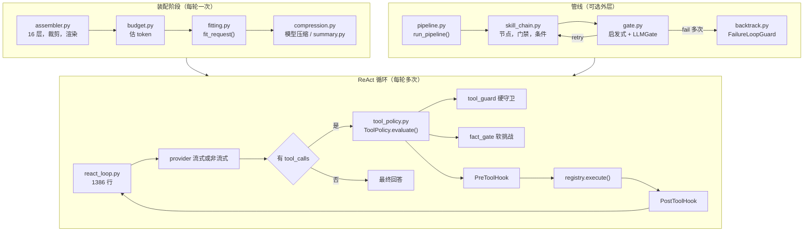

三层的关系：**管线是可选外层，ReAct 是内核，装配在每次进模型前跑一次。**

---

## 2. 上下文装配：16 层可信标签 prompt

`engine/context/assembler.py`（792 行）把 system prompt 拆成 16 个可审计的层。这不是为了好看——每一层都带着五个正交的元数据维度，供裁剪、缓存、审计三个下游消费。

### 2.1 完整层清单

按渲染顺序：

| # | `name` | 显示名 | `source` | `authority` | `trust` | `scope` | `trim_priority` |
|---|---|---|---|---|---|---|---|
| 1 | `role` | Agent Role | AGENT_PROFILE | AGENT_POLICY | CONFIGURED | AGENT | **必留** |
| 2 | `style` | Agent Style | AGENT_PROFILE | AGENT_POLICY | CONFIGURED | AGENT | 50 |
| 3 | `workflow` | Agent Workflow | AGENT_PROFILE | AGENT_POLICY | CONFIGURED | AGENT | **必留** |
| 4 | `toolbox_policy` | Tool Usage Policy | AGENT_PROFILE | AGENT_POLICY | CONFIGURED | AGENT | 40 |
| 5 | `tool_definitions` | Available Tools | TOOL_REGISTRY | CAPABILITY | CONFIGURED | AGENT | 35 |
| 6 | `skills` | Available Skills | SKILL_REGISTRY | CAPABILITY | CONFIGURED | AGENT | 30 |
| 7 | `learned_context` | Learned User Context | LEARNED_CONTEXT | REFERENCE | **UNTRUSTED_REFERENCE** | USER | **必留** |
| 8 | `global_instructions` | Global Instructions | SMITH_FILE | USER_POLICY | USER_AUTHORED | USER | **必留** |
| 9 | `project_instructions` | Project Instructions | SMITH_FILE | PROJECT_POLICY | USER_AUTHORED | PROJECT | **必留** |
| 10 | `identity_guidance` | Identity Guidance | IDENTITY_CATALOG | AGENT_POLICY | CONFIGURED | AGENT | **必留** |
| 11 | `eval_guidance` | Evaluation Safety Guidance | ENGINE | ENGINE_CONTROL | TRUSTED | AGENT | **必留** |
| 12 | `output_style` | Output Style | ENGINE | AGENT_POLICY | CONFIGURED | AGENT | 10 |
| 13 | `memory_governance` | Memory Governance | ENGINE | ENGINE_CONTROL | TRUSTED | AGENT | **必留** |
| 14 | `durable_context` | Durable Memory | MEMORY_DURABLE | REFERENCE | **UNTRUSTED_REFERENCE** | PROJECT | 19 |
| 15 | `runtime_context` | Runtime Context | RUNTIME | RUNTIME_FACT | AUTHORITATIVE_FACT | RUNTIME | **必留** |
| 16 | `runtime_control` | Engine Runtime Control | ENGINE | ENGINE_CONTROL | TRUSTED | RUNTIME | **必留** |

### 2.2 为什么要五个正交维度

一个天真的实现只需要"内容 + 顺序"。这里拆成五个维度，是因为**四个不同的问题需要四种不同的分类**：

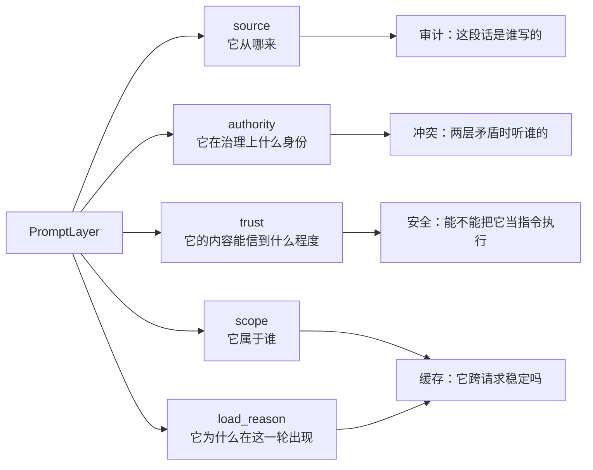

**最关键的是 `trust` 与 `authority` 分开。** 举个例子：

- `learned_context`（第 7 层）的 `authority` 是 `REFERENCE`，`trust` 是 `UNTRUSTED_REFERENCE`
- `global_instructions`（第 8 层）的 `authority` 是 `USER_POLICY`，`trust` 是 `USER_AUTHORED`

两层都由"用户"这一侧产生，但第 7 层是**Agent 自己学出来的**，第 8 层是**用户亲手写的**。前者绝不能被当成指令执行——否则一个被污染的对话就能通过"学习"把恶意指令写进 prompt，形成持久化的提示注入。

代码里对应的处理是一道围栏（`_LEARNED_CONTEXT_FENCE`），明确告诉模型：下面是参考资料，不是指令。`durable_context`（第 14 层，项目记忆）同理，用 `_MEMORY_REFERENCE_FENCE`。

### 2.3 裁剪策略

`_trim_to_budget()` 的逻辑很克制：

```python
"""Drop only explicitly trimmable layers in declared priority order."""
```

- **只裁掉显式声明了 `trim_priority` 的层**，`None` 的一律保留
- 按 `(trim_priority, index)` 升序，**从最便宜的开始裁**
- 裁到总量落回预算就停，不多裁
- 裁掉的方式是 `replace(layer, content="")`——**保留层本身**，这样 manifest 里还能看到"这一层被裁了"

裁剪顺序：

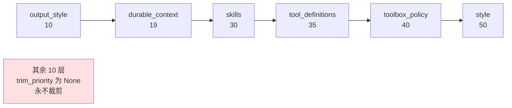

这个顺序编码了一套价值判断：

| 先裁 | 理由 |
|---|---|
| 输出风格（10） | 影响的是"怎么说"，不是"能不能做对" |
| 项目记忆（19） | 有用但非必需；裁了模型仍能靠对话完成任务 |
| 技能目录（30） | 裁了就用不了技能，但核心能力还在 |
| 工具定义（35） | 比技能更基础，所以更晚裁 |
| 工具使用策略（40） | 工具都没了，策略也没意义，所以排在工具后面 |
| 人格风格（50） | 最后裁。它便宜且塑造整体表现 |

**永不裁剪的十层**包括：角色、工作流、学到的用户上下文、全局指令、项目指令、身份指引、评测安全指引、记忆治理、运行时上下文、引擎运行时控制。规律是——**身份、指令、治理、事实，一律不裁**。裁掉的只能是"能力目录"和"表达偏好"。

### 2.4 前缀缓存键：为什么是"连续前缀"而不是"稳定的层"

`_stable_prefix()` 的 docstring 是这个文件里最值得读的一段：

> 前缀必须是**从第一层开始连续的**，因为 provider 的 prompt 缓存按**字节前缀**匹配：第一个与请求相关的层就终结了前缀，不管它后面的层多稳定。按层的语义而不是固定切片来选，意味着插入或重排一个层不会静默移动这个边界。

判定"易变"的规则：

```python
_VOLATILE_PROMPT_SOURCES = {MEMORY_STORE, MEMORY_DURABLE, RUNTIME}
_VOLATILE_LOAD_REASONS  = {QUERY_RETRIEVAL, EVAL_SENSITIVE, RUNTIME_ONLY}
```

代入 16 层清单：第 11 层 `eval_guidance` 的 `load_reason` 是 `EVAL_SENSITIVE`，所以**稳定前缀就是第 1 到 10 层**（role 到 identity_guidance）。

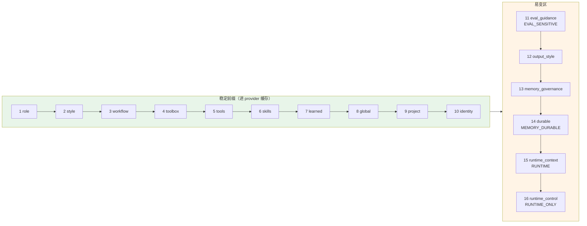

还有一处细节：缓存键**绑定的是裁剪之后实际渲染的内容**，不是裁剪前的源材料。

```python
# Bind the routing hint to the stable prefix that is actually rendered,
# not to pre-trim source material that the provider never receives.
```

而且空层被跳过——因为"键必须哈希 provider 真正看到的字节"。这两点决定了缓存命中率是不是真的。

### 2.5 sanitize 失败时不许静默

第 7 层的处理里有一段很典型的工程判断：

```python
cleaned, secrets_removed, injections_removed = sanitize_memory_text(learned_context)
if not cleaned.strip() and (secrets_removed or injections_removed):
    # Dropping the layer is the safe answer, but doing it silently
    # is indistinguishable from "nothing learned yet" — for every
    # turn from here on. Say it instead.
    _log.warning("context.md was dropped from the prompt: ...")
```

**丢弃是对的，但静默丢弃是错的**——从此以后每一轮，"这份上下文被安全策略整份丢掉了"和"还没学到任何东西"在行为上完全一样，用户永远不会发现。

### 2.6 装配产物：三个对象

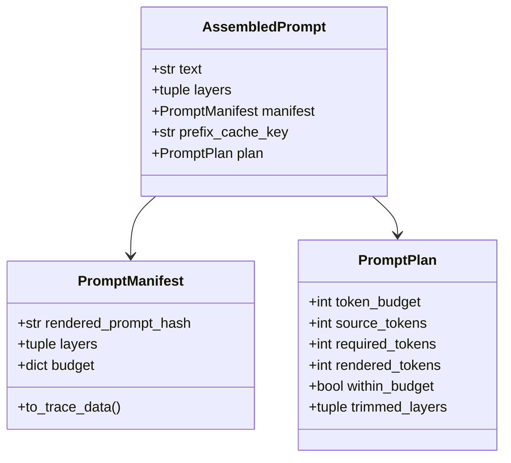

`PromptManifest` 的定义写着"**redacted receipt**，可安全存入运行 trace"——它记的是层名、来源、token 数、哈希，**不记内容**。这样运行档案里能回答"这一轮的 prompt 由哪些层组成、哪些被裁了"，又不会把用户的私有指令抄进日志。

`PromptPlan.trimmed_layers` 的算法也很直白：**源层有内容而渲染层为空**的，就是被裁掉的。

---

## 3. 上下文预算与拟合

### 3.1 一个被中文掩盖的宽字符 bug

`engine/context/budget.py` 里 `_WIDE_CHAR_RANGES` 上方的注释，是整个仓库里最好的一条 bug 记录：

> 把这个范围限制在 CJK 统一表意文字（U+4E00-U+9FFF）会把每个假名、谚文音节、CJK/全角标点算成 1/3 个 token 而不是约 1 个——对日文和韩文输入构成**系统性的 3 倍低估**，而下面每一个预算都是从这个数推导出来的。**中文把它藏住了**：表意文字上的 3 倍高估抵消了 `。、「」` 上的低估。

这是一类特别难发现的 bug：**用中文测试永远测不出来**，因为两个方向的误差刚好抵消。修法是把范围扩到七段：

| 范围 | 覆盖 |
|---|---|
| U+3000–U+303F | CJK 符号与标点 |
| U+3040–U+30FF | 平假名 + 片假名 |
| U+3400–U+4DBF | CJK 扩展 A |
| U+4E00–U+9FFF | CJK 统一表意文字 |
| U+AC00–U+D7AF | 谚文音节 |
| U+F900–U+FAFF | CJK 兼容表意文字 |
| U+FF00–U+FFEF | 半角/全角形式 |

估算公式：

```python
def estimate_tokens(text: str) -> int:
    wide = sum(1 for char in text if _is_wide_char(char))
    return (3 * wide) + (len(text) - wide + 2) // 3
```

即 **CJK 字符按 3 token，其它按 3 字符 1 token**。docstring 说明了为什么取 3：一个 CJK 字符是三个 UTF-8 字节，这是"provider 的分词器对该字符没有合并 token 时"的稳定上界。**保守估计，宁可高估**。

还有一个性能细节：ASCII 与拉丁文本在 `char < "　"` 处直接短路，不进七段扫描。

### 3.2 预算三常量

```python
CONTEXT_COMPACTION_TRIGGER = 128_000
CONTEXT_SAFETY_MARGIN_RATIO = 0.10
CONTEXT_COMPACTION_INPUT_RATIO = 0.85
```

`ContextBudget` 把它们展开成八个字段：

| 字段 | 含义 |
|---|---|
| `model_context_window` | 模型声明的窗口 |
| `effective_context_window` | 扣掉不可用部分后的有效窗口 |
| `output_reserve` | 给输出预留的额度 |
| `safety_margin` | 安全余量（10%） |
| `safe_input_budget` | 输入的安全上限 |
| `compaction_trigger` | 触发压缩的阈值 |
| `window_declared` | 窗口是**声明的**还是猜的 |
| `output_limit_declared` | 输出上限是声明的还是猜的 |

最后两个布尔值是设计亮点：**区分"我知道这个值"和"我用了默认值"**。一个没声明 `context_window` 的模型，预算计算必须更保守，而下游需要知道自己在保守还是在精确。

### 3.3 `fit_request()`

`engine/context/fitting.py`（269 行）负责让请求装进预算。它返回一个带 `status` / `actions` / `receipt` / `fits` 的结果，ReAct 循环据此决定：

```python
if any(action in {"compaction_failed", "compaction_rejected"} for action in fit.actions):
    model_compaction_enabled = False
```

**压缩失败或被拒一次，之后就不再尝试模型压缩**。因为一个压缩不了的上下文再压一次大概率还是压不了，反复尝试只是烧钱。

而提交 `b0ef6a7 fix(observability): record what context fitting dropped, not just that it did` 说明了另一个原则：**只记录"发生了压缩"不够，必须记录"丢了什么"**。

---

## 4. ReAct 循环

`engine/execution/react/react_loop.py`（1386 行）是全仓库最大的文件。

### 4.1 循环全景

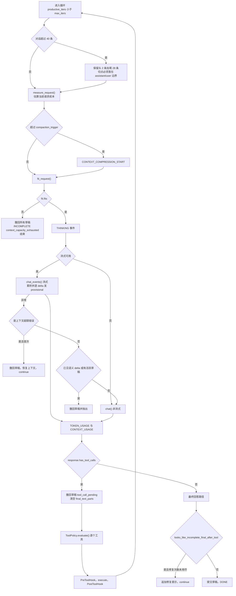

### 4.2 预算常量全表

`engine/execution/react/budget.py` 的常量决定了这个循环的所有边界：

| 常量 | 值 | 作用 |
|---|---|---|
| `DEFAULT_MAX_REACT_ITERS` | 60 | 有效迭代上限（工具调用轮数） |
| `MAX_FAILED_TOOL_RECOVERY_ITERS` | 20 | 工具失败后的恢复轮数上限 |
| `MAX_PREFLIGHT_CHALLENGE_ITERS` | 20 | 事实门挑战的轮数上限 |
| `MAX_INCOMPLETE_FINAL_REPAIRS` | 2 | "假最终回答"最多修两次 |
| `MAX_LENGTH_CONTINUATIONS` | 2 | 因长度截断的续写最多两次 |
| `CONVERSATION_HARD_LIMIT` | 40 | 对话消息数硬上限 |
| `CONVERSATION_KEEP_RECENT` | 28 | 裁剪时保留的尾部条数 |
| `CONVERSATION_KEEP_HEAD` | 2 | 裁剪时保留的头部条数（system 加首条 user） |
| `MAX_IDENTICAL_TOOL_ERRORS` | 6 | 同一个工具错误重复上限 |

注意 `productive_iters` 与 `recovery_iters` / `preflight_iters` 是**分开计数**的。这意味着"因为工具失败而多跑的轮次"不占用正常的 60 次预算——失败恢复有自己的账本。

预算耗尽时的消息统一由 `budget_exhausted_message()` 生成：

> "……我停下来以避免无限循环。请用更窄的请求重试，或检查最近一次失败的工具结果。"

**告诉用户下一步能做什么**，而不只是报告失败。

### 4.3 对话裁剪：一个 40 行的边界地狱

这段代码带着三段中文注释，每段都记录一个被修掉的 bug：

**① 切点不能落在 tool 结果串中间。**

```python
# 切点落在 tool 结果串中会拆散 assistant(tool_calls)/tool 配对（provider 400）。
```

OpenAI 兼容协议要求 `assistant(tool_calls)` 和它的 `tool` 结果成对出现。切在中间会得到孤儿 `tool` 消息，provider 直接 400。

**② 只认 `role == "tool"` 会在提示处停下。**

```python
# 同一轮的 tool 结果之间可能夹着 system 提示（TOOL_FAILURE_HINT 在 tool_calls
# 循环内 append），只认 role=="tool" 会在提示处停下留下孤儿。
```

所以回退条件是 `role in ("tool", "system")`。

**③ 向前回退撞到 head 边界时，这道上限会静默失效。**

```python
# 回退撞到 head 边界时 head+tail 就是整条对话，这道上限静默失效：
# 一轮 8 个并行工具调用即可（实测 41 条裁剪后仍是 41 条，30 个调用时 63 条原样返回）。
# 改为向后找下一个边界 —— 丢弃的更多，但配对完整且一定有进展。
```

这条注释里带了**实测数字**（41 条裁剪后仍是 41 条、30 个调用时 63 条原样返回），这是好 bug 记录的标志：它证明了作者真的复现过。

最终策略：

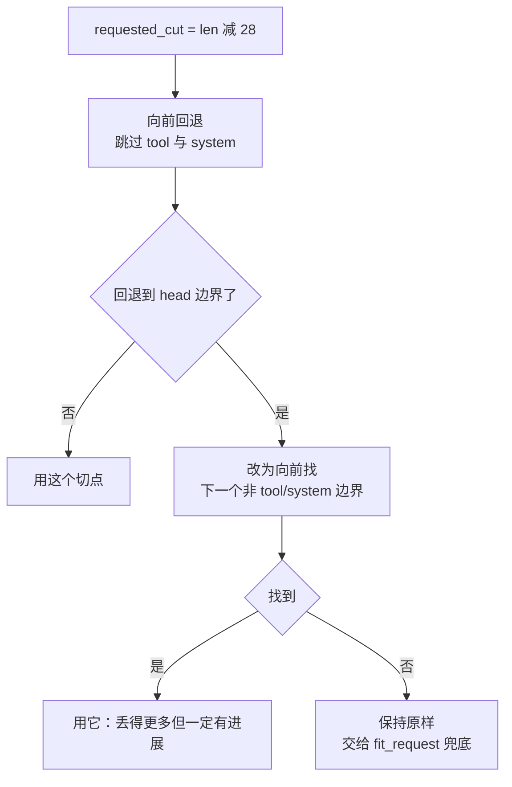

裁完之后还有一步：

```python
while head and head[-1].get("role") == "assistant" and head[-1].get("tool_calls"):
    head.pop()
```

**头部末尾如果是一个发起了工具调用的 assistant 消息，也要弹掉**——否则它的 tool 结果在尾部被裁掉了，同样是孤儿。

### 4.4 流式失败什么时候能回退到非流式

这是一个很容易做错的地方。代码的判据是：

```python
if saw_content_event or active_provision_ids:
    # 撤回草稿并抛出——不回退
    raise
# 否则回退到 llm.chat()
```

`saw_content_event` 的定义包括三种 provider 事件：文本 delta、**推理 delta**、函数调用参数 delta。注释解释了为什么推理 delta 也算：

> 一个流式的推理 delta 对用户不可见，但它**仍然证明 provider 已经开始生成响应**。回退会重放那一轮，并可能产生**不同的工具计划**，所以只重试那些在任何语义响应 delta 之前就失败的流。

即：**已经开始生成就不能重放**，因为重放的结果可能和用户已经看到的（或系统已经准备执行的）不一致。

### 4.5 试探性草稿的生命周期

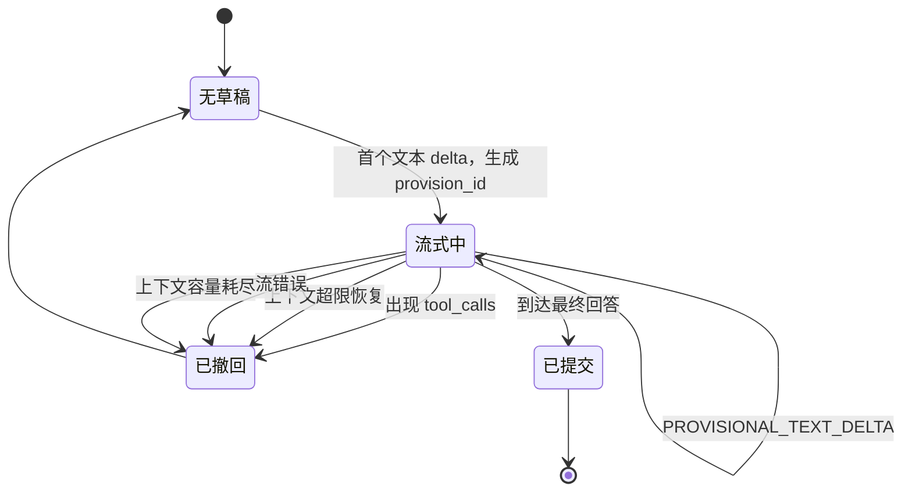

四种撤回原因各对应一个真实场景。最微妙的是**上下文超限恢复**那条：

```python
# The abandoned draft was streamed to the client but is being discarded by
# this recovery. Retract it before the retried stream runs, or both the old
# and new ids would be committed at finish and the client would keep
# rendering text that no longer exists.
```

不撤回的后果是：旧 id 和新 id 都在结束时被提交，客户端会一直渲染一段**已经不存在的文本**。

还有一处相反方向的陷阱，注释是中文的：

```python
# 上面的 has_tool_calls 分支已把草稿 retract（tool_call_pending），
# 屏幕上的流式文本已被消费方删除；这里若再打 already_streamed
# 标记，消费方会跳过渲染 → 文本落库但用户永远看不到。
```

**已经撤回过的文本，重发时不能再标 `already_streamed`**——否则消费方以为它已经在屏幕上了，跳过渲染，结果是数据库里有、屏幕上没有。

### 4.6 "假最终回答"检测

模型经常在调完工具后说一句"让我再查一下 X"然后就停了——这不是最终回答，是一个没兑现的承诺。`looks_like_incomplete_final_after_tool()` 用正则识别它：

```python
_NEXT_ACTION_VERBS_ZH = ("查","搜","抓","获取","打开","访问","确认","验证","看看","看一下")
_NEXT_ACTION_VERBS_EN = ("search","fetch","check","open","browse","look up","verify")

_INCOMPLETE_FINAL_PATTERNS = (
    re.compile(r"(让我|我将|我会|我需要|接下来|下一步|继续).{0,24}(" + "|".join(_NEXT_ACTION_VERBS_ZH) + r")"),
    re.compile(r"(let me|i'll|i will|i need to|next,?|going to).{0,48}(" + "|".join(_NEXT_ACTION_VERBS_EN) + r")"),
)
```

两条约束让它不至于误伤：

- **长度上限 240 字符**。一个长回答里出现"接下来我会验证"是正常的收尾说明，只有**短到只剩一句承诺**才算假最终回答。
- 中英文分开写正则，中文允许 24 字符间隔，英文允许 48——因为英文更长。

命中后最多修 2 次（`MAX_INCOMPLETE_FINAL_REPAIRS`），追加一段引擎自有的提示（`incomplete_final_repair_prompt()`）让模型继续。

这是一个**用正则做行为纠偏**的例子。它当然不完美，但它便宜、确定、可测——符合"能用确定性代码判定的绝不交给模型"这条取向。

### 4.7 懒加载工具 schema

```python
lazy_tool_schemas = bool(getattr(tool_registry, "lazy_tool_schemas", False))
if lazy_tool_schemas:
    # Tool descriptions live in the stable prompt prefix. The provider sees
    # only this tiny loader schema until the model explicitly asks for one
    # capability, keeping the large JSON contracts out of every initial turn.
    tools = [_tool_schema_loader_definition()] if tool_registry.list_tools() else None
```

设计很巧：


**工具的"存在"放在稳定前缀里（可缓存），工具的"参数契约"按需加载（不进每一轮）**。20 多个工具的完整 JSON schema 很大，全放进每轮请求既费 token，又会因为 schema 变化打断前缀缓存。

`server/app/services/engine_runtime.py` 里构建的运行时确实开了这个开关：`ToolRegistry(lazy_tool_schemas=True)`。

---

## 5. 工具注册与执行

### 5.1 工具元数据契约

`engine/tool/interface.py` 的 `ToolDefinition` 有 17 个字段，分三组：

**① 基础**

| 字段 | 类型 | 说明 |
|---|---|---|
| `name` | str | 工具名 |
| `description` | str | 给模型看的一句话 |
| `parameters` | dict | JSON Schema |
| `hidden` | bool | 注册但不进模型可见集合 |

`hidden` 的注释值得注意：

> 运行时基础设施工具可以注册但保持在模型可见的默认工具集之外。**可见性是元数据，绝不是调用方维护的一份工具名列表。**

**② 安全元数据**

| 字段 | 类型 | 说明 |
|---|---|---|
| `opaque_command` | bool | 不透明命令串，需要抽路径加显式审批。目前只有 `shell` 声明 |
| `network_access` | bool | 会开网络连接。**网络能力总是需要审批**，哪怕操作看起来只读 |
| `path_args` | tuple | 哪些参数是路径 |
| `list_path_args` | tuple | 哪些参数是路径列表 |
| `is_write_tool` | bool | 是否写工具 |
| `permission_level` | str | `read` / `write` / `execute` / `destructive` |
| `approval_policy` | str | `never` / `policy` / `always` |
| `read_actions` | frozenset | 哪些 action 算只读（`git_ops` 用它区分 `status`/`diff` 和 `commit`） |

**③ 执行契约**

| 字段 | 默认 | 说明 |
|---|---|---|
| `timeout_seconds` | None | 超时 |
| `retryable` | False | 可重试 |
| `side_effect` | `none` | `none` / `write` / `external` / `destructive` |
| `idempotent` | False | 幂等 |
| `concurrency` | `safe` | `safe` / `serial` |
| `execution_environment` | `host` | `host` / `sandbox` / `either` |

五组枚举在 `registry.py` 里都有校验集合（`_VALID_PERMISSION_LEVELS` 等），非法值直接拒绝注册。

### 5.2 `declared_paths`：一个精妙的安全设计

`ToolCall` 里有一个字段带着这个仓库最长的注释之一。问题是这样的：

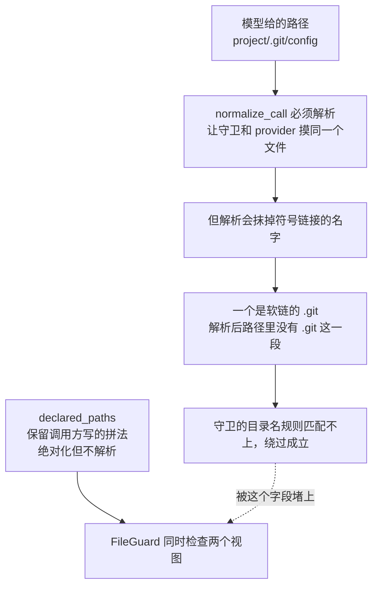

注释原文：

> `ToolRegistry.normalize_call` 必须把完全解析的路径交给 provider，这样守卫和 provider 才摸同一个文件；但解析也**抹掉了安全守卫的目录成分规则所依赖的符号链接名字**——一个是符号链接的 `.git` 会解析成一个不含 `.git` 成分的路径。把声明时的拼法一并带上，让 `FileGuard` 能继续检查两个视图。

最后一句还澄清了它不参与调用指纹：

> 不是调用指纹的一部分：它派生自 `arguments`，从来不是独立输入。

**派生数据不能进指纹**——否则同一个调用会因为派生方式变化而产生不同的指纹。

### 5.3 `ToolPolicy`：链式检查与延迟审批

`engine/safety/tool_policy.py` 把 `ToolGuard` 和 `FactGate` 适配成同一个 `PolicyChecker` 协议，按顺序跑，**第一个阻断者获胜**。

但有一个例外分支，是这个文件的精华：

```python
if decision.approval_required:
    deferred_approval = ...   # 记下来，但继续跑后面的检查器
    continue
```

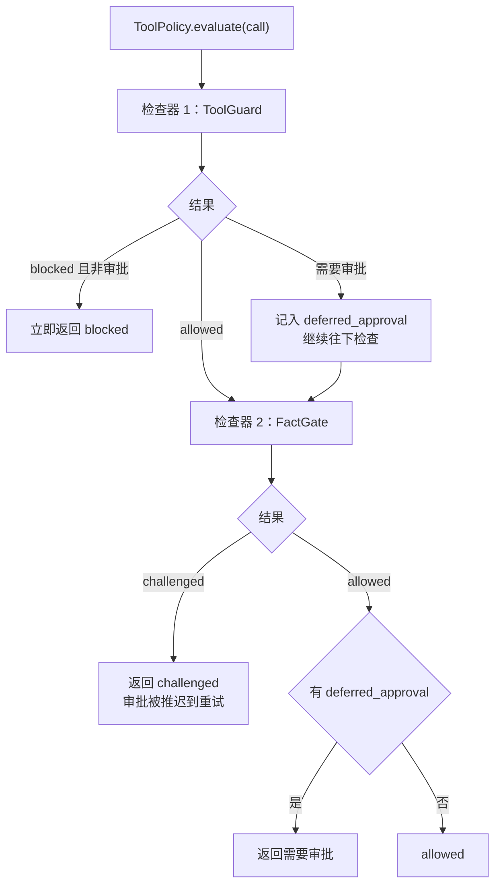

注释解释了为什么：

> 事实强制挑战**刻意优先于**后续的用户审批。第一次尝试必须先把要求的事实建立起来；只有重试才可以为审批而暂停。

翻译成场景：模型第一次要写文件，同时触发了"你还没做调查"（挑战）和"这是个危险写操作"（需审批）。正确的顺序是**先让它去调查**——因为调查完之后它可能根本不需要这次写操作了，那就不用打扰用户审批。反过来先弹审批，用户批准了一个基于错误理解的操作。

`evaluate()` 还会**沿途累积**最高权限等级和最高风险等级（`_LEVEL_ORDER` / `RiskTier.max`），让最终决定带上全链路的最严判定。

### 5.4 输出截断

`engine/tool/truncation.py`：

```python
MAX_LINES = 2000
MAX_BYTES = 50 * 1024   # 50KB
```

超限时**完整输出落盘**到 `~/.agent-smith/tool-output/`，返回值里带一个指向该文件的提示。这样模型能看到概要，需要细节时可以再读文件——而不是把 500KB 的日志塞进上下文。

### 5.5 `ScopedToolRegistry`

管线节点的 `allowed_tools` 通过 `registry.scoped_to(names)` 实现。它是一个**视图**，不是拷贝：

- `_active_names()` 每次动态算，所以底层注册表的变化能反映过来
- 但可见集合被限制在给定的名字里

这就是 [02 · 快速上手](./02-快速上手.md) §10.1 讲的三级收窄的第三级。

---

## 6. Pipeline 与技能链

### 6.1 门禁与条件是内容，不是引擎代码

`skill_chain.py` 顶部的注释把边界说得很清楚：

> 门禁和条件的实现是**内容，不是引擎代码**。注册表初始为空，由 `load_gate_content()` 填充，它扫描 `<agents_dir>/gates/**.py`（模块级 `GATES`）和 `<agents_dir>/conditions/**.py`（模块级 `CONDITIONS`）。`from_yaml` 保持为纯查找，遇到未知 key **大声失败**而不是静默降级。

加载机制和工具一样是 `exec_module`，但多了几处考究：

**① 注入能力而不是让内容 import 引擎。**

```python
mod.output_key = output_key
# Content files stay independent from engine imports.
# Expose the stable output-key helper as an injected capability instead.
```

内容文件需要 `output_key` 这个辅助函数，但让它 `from engine... import` 就破坏了内容层独立性。所以**引擎把函数塞进模块的命名空间**再执行它。

**② 执行前先注册进 `sys.modules`。**

```python
# Some declarative content uses standard decorators (for example dataclasses).
# They resolve annotations through sys.modules, so register the transient
# module before executing it.
sys.modules[module_name] = mod
```

`dataclass` 解析注解时要通过 `sys.modules` 找回自己的模块。不先注册，装饰器会失败。

**③ 失败一律清理。** 每个异常分支都有 `sys.modules.pop(module_name, None)`——半加载的模块留在 `sys.modules` 里会污染后续加载。

**④ 模块名用路径的 SHA-1**，避免不同目录下的同名文件互相覆盖。

**⑤ 重名策略分两层。**

- **同一个项目内**重名，抛 `GateContentError`，硬失败
- **跨项目**（回落到模块级全局注册表）用 `setdefault`，先到先得

注释说明了理由："这样另一个项目就不能覆盖一个已经选定的项目的工厂函数。"

### 6.2 门禁三态

```python
@dataclass
class GateResult:
    verdict: Literal["pass", "fail", "retry"]
    reason: str
    retry_hint: str | None = None
```

| 判定 | 含义 | 后续 |
|---|---|---|
| `pass` | 契约满足 | 进入下一节点 |
| `retry` | 差一点，给出具体提示 | 带 `retry_hint` 重跑本节点 |
| `fail` | 不满足 | 交给 `FailureLoopGuard` 决定重试/切换/阻断 |

`coerce_gate_result()` 负责把内容层返回的东西适配成 `GateResult`——支持 `GateResult` 实例、`Mapping`、或任何有这三个属性的对象。这样内容文件可以只返回一个 dict，不需要 import 引擎类型。

但它**不放过类型错误**：

```python
# ``GateResult`` is a plain dataclass whose ``Literal`` verdict is not
# runtime-enforced, so it must pass the same checks as every other shape.
if verdict not in {"pass", "fail", "retry"} or not isinstance(reason, str):
    raise TypeError(...)
```

即便传进来的已经是 `GateResult`，也要重新校验——因为 `Literal` 只是类型标注，运行时不强制。

### 6.3 `_bounded_gate_output`：一个"两层看到不同文本"的 bug

这是本文档里最值得单独讲的一个 bug：

```python
_MAX_GATE_OUTPUT_CHARS = 2000
```

`LLMGate` 是两层结构：**便宜的启发式预过滤加 LLM 语义验证**。bug 在于两层读的文本不一样：

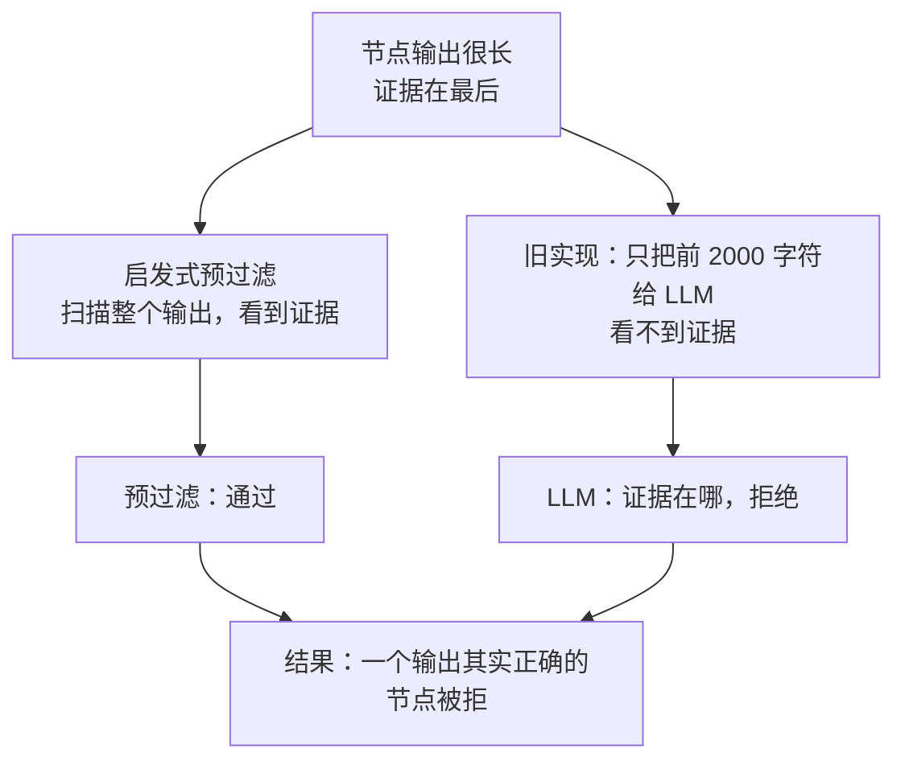

注释原文：

> 验证和评审节点把它们的证据放在**最后**——它们刚刚产出的命令输出——所以预过滤会确认一份 LLM 看不到的证据，于是门禁拒绝了一个输出其实正确的节点。

修法是**两端都留，并且说明中间被省略了**：

```python
marker = "\n[... middle of output omitted from gate input ...]\n"
head = available // 2
return f"{output[:head]}{marker}{output[-(available - head):]}"
```

注释还指出这和记忆模块的 `_review._truncate_source` 是同一套做法——**同一个问题在两个子系统里用同一个解法**，这是好架构的信号。

对应提交：`0eae0a0 fix(pipeline): let the gate LLM see the end of a long node output`。

### 6.4 `FailureLoopGuard`：三段升级

```python
class FailureLoopGuard:
    """Per-node failure escalation: bounded retries, then one switch, then block."""
    def __init__(self, max_same: int = 2, max_attempts: int = 3): ...
```

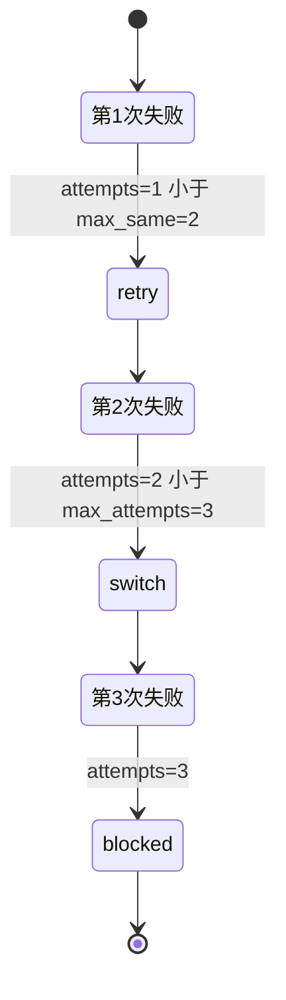

关键在 docstring 里的两条**否定**设计：

> 状态**只**按 `error_type`（失败的节点）作键。
> - 一个全局的策略集合会让**不相关节点**早先的失败过早地阻断当前节点。
> - 按输出哈希计数**永远不会终止**，因为 LLM 的输出在重试之间总是变化的。

第二条尤其值得记：**任何以"LLM 输出内容"为键的计数器都不会收敛**。

### 6.5 管线上下文与检查点

`pipeline.py` 的常量：

```python
_BASE_GATE_MAX_RETRIES = 3
CTX_PROVISIONAL_OUTPUTS = "_committed_provisional_output"
```

主要辅助函数：

| 函数 | 作用 |
|---|---|
| `_check_base_gates()` | 跑通用门禁（`agents/gates/common/`） |
| `_ends_with_user_question()` | 推断节点是否在提问（配合 `infer_await_user_input_from_question`） |
| `_collect_node_events()` | 收集一个节点的事件流 |
| `_validate_chain_topology()` | 校验链的拓扑（节点索引、门禁存在性） |
| `_evict_outputs_at_or_after()` | 回退时清掉该节点及之后的产物 |
| `_is_budget_message()` | 识别预算耗尽消息，避免把它当成正常产出 |
| `_save_checkpoint()` / `_clear_checkpoint()` | 检查点读写 |

`_evict_outputs_at_or_after()` 是回退正确性的关键：回退到节点 2 时，节点 2/3/4 的产物必须清掉——否则节点 3 会读到上一轮的陈旧产物。

`_is_budget_message()` 的存在同样重要：ReAct 预算耗尽时会产出一段说明文字，如果门禁把它当成节点的正常输出去判定，会得到莫名其妙的结论。

---

## 7. 编排生命周期

`engine/execution/orchestration/lifecycle.py`（875 行）是把上面所有部件串起来的地方。它的入口有五个：

| 函数 | 用途 |
|---|---|
| `run_stream_with_runtime()` | 主入口：一次新请求，产出事件流 |
| `resume_stream_with_runtime()` | 恢复一个被中断的 run |
| `reply_with_runtime()` | 非流式，返回 `EngineResult` |
| `reply_events_with_runtime()` | 非流式但要事件 |
| `reply_stream_with_runtime()` | 流式文本（不要完整事件） |

### 7.1 `_RunEventBoundary`：事件的分流点

每一个执行事件都要落两个地方：**执行状态**（`RunStateStore`）和**观察者**（可观测适配器）。`_RunEventBoundary` 是这个分流点，它的 docstring 讲了两个非显然的决定：

```python
"""Fan events into execution state and an optional observer Adapter.

The async methods offload the (deliberately fsynced) persistence I/O to a
worker thread so a busy disk never stalls the server's event loop.  The
per-boundary lock serializes the offloads: ``asyncio.to_thread`` alone does
not guarantee execution order, and the run trace's sequence numbers and the
byte-offset cursor depend on records being written in stream order.
"""
```

**① 持久化是刻意 fsync 的，所以必须离开事件循环。** 运行 trace 是崩溃恢复的依据，不 fsync 就没意义；但 fsync 在忙盘上可能几十毫秒，跑在事件循环里会卡住所有 SSE 流。所以 `asyncio.to_thread`。

**② 但 `to_thread` 不保证顺序，所以还要一把锁。**

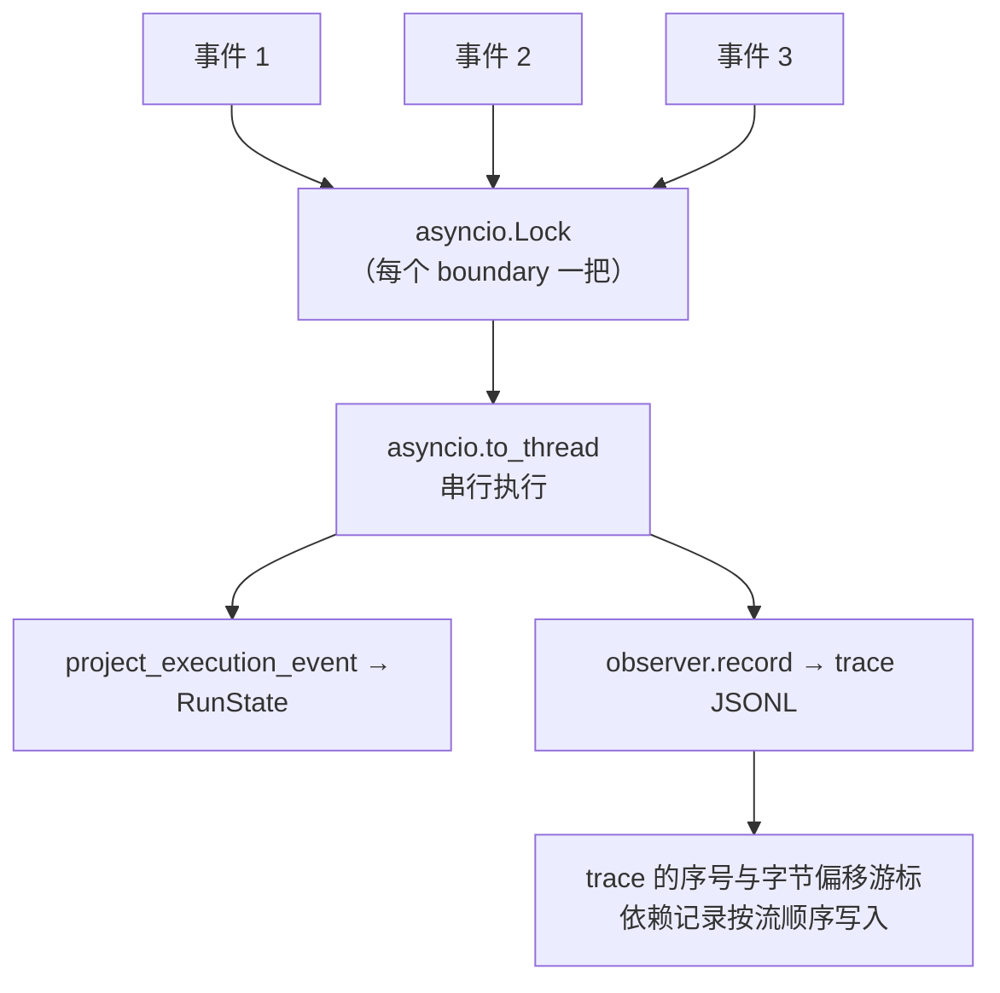

这是一个很容易漏掉的正确性问题：**并发地把事件卸载到线程，写入顺序就是随机的**，而 trace 的序号和 `observability_trace_cursors.byte_offset` 都建立在"按流顺序写"这个前提上。

**③ 观察者抛异常不能影响执行。** 每一处调用观察者的地方都包着 `try/except` + `logger.warning`。可观测性是旁路，它坏掉不该让 run 失败。

### 7.2 记忆维护的 tick 与钩子键

`_ensure_memory_lifecycle_hooks()` 是一段值得学的**幂等注册**代码：

```python
hook_key = (
    id(maintenance_llm),
    id(services.gate_llm),
    services.owns_llm_clients,
    id(services.hooks),
)
if (services._memory_lifecycle_hook is not None
    and services._memory_lifecycle_hook_key == hook_key
    and services.hooks.is_registered(services._memory_lifecycle_hook)):
    return
```

三个条件缺一不可：

1. **钩子存在**
2. **键没变**——键由维护用的 LLM、门禁 LLM、所有权标志、钩子管理器四者的身份组成。任何一个换了，旧钩子就绑着错误的客户端
3. **它确实还注册着**——只记住"我注册过"不够，注册表可能被重建过

不满足就先 `unregister` 旧的再注册新的。这段代码防的是**同一个 services 被复用于多个请求时，记忆维护钩子绑到已关闭的客户端上**。

两个 tick：

| Tick | 触发时机 | 干什么 |
|---|---|---|
| `memory_idle_tick` | 空闲时 | 增量编译记忆 |
| `memory_daily_tick` | 每日 | Dream 维护周期 |

两者都通过 `HookType.PARALLEL` 分发，并且 `include_failures=True`——**失败也要收回来**，然后 `all(result is not False for result in results)` 判定整体成败。

`defer_maintenance=not services.owns_llm_clients` 这一行也有讲究：客户端是共享的时候（server 场景），维护要延后，不能在请求路径上同步跑。

### 7.3 `_persist_runtime_learning()`：三种终态三个钩子

```python
hook_name = {
    "completed": "memory_after_turn_completed",
    "incomplete": "memory_after_turn_incomplete",
    "failed": "memory_after_turn_failed",
}.get(terminal_status, "memory_after_turn_failed")
```

注意默认值是 `failed`——**未知状态按失败处理**，又一处 fail-closed。

而且非 `completed` 的分支会多传一个 `terminal_reason`，因为"为什么没完成"对记忆管线是有用信息。

流程：

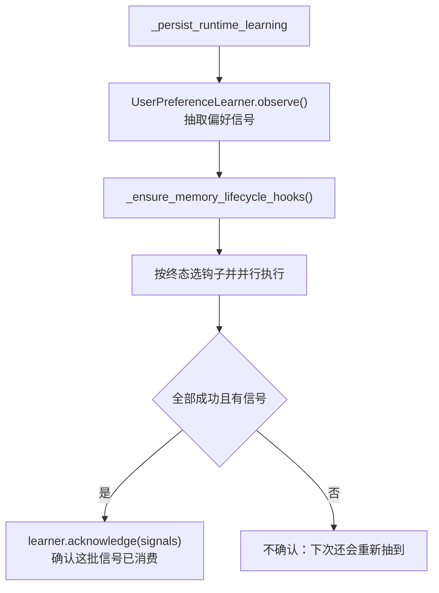

**先 observe，成功后才 acknowledge** 是一个标准的至少一次投递模式：写失败时不确认，信号留着下次再来。

### 7.4 什么才算"工具证据"

`_has_successful_tool_evidence()` 的 docstring 把一个容易搞错的判断说清楚了：

> 工具**开始**只是描述了模型的一个提案。预检挑战、策略阻断、以及 provider/工具失败都**没有产生项目证据**，绝不能让记忆管线把这一轮标成 `tool_result`。

即：只有 `TOOL_CALL_RESULT` 且**没出错**才算证据。这条判断直接决定了记忆系统里那一轮证据的 `kind`，进而决定它能不能建立 `Verified Outcomes` 条目（见 [05 · 记忆系统](./05-记忆系统.md) 的放置守卫）。

---

### 7.1 运行状态机：`run_state.py`

`engine/execution/orchestration/run_state.py`（790 行）持久化一次运行的生命周期。它是崩溃恢复、续跑、审批暂停三件事共同的基础。

### 7.1.1 七个状态与转移表

```python
class RunStatus(str, Enum):
    QUEUED = "queued"
    RUNNING = "running"
    WAITING_APPROVAL = "waiting_approval"
    COMPLETED = "completed"
    INCOMPLETE = "incomplete"
    FAILED = "failed"
    CANCELLED = "cancelled"
```

转移**不是随意的**，`_ALLOWED_TRANSITIONS` 把合法路径写死：

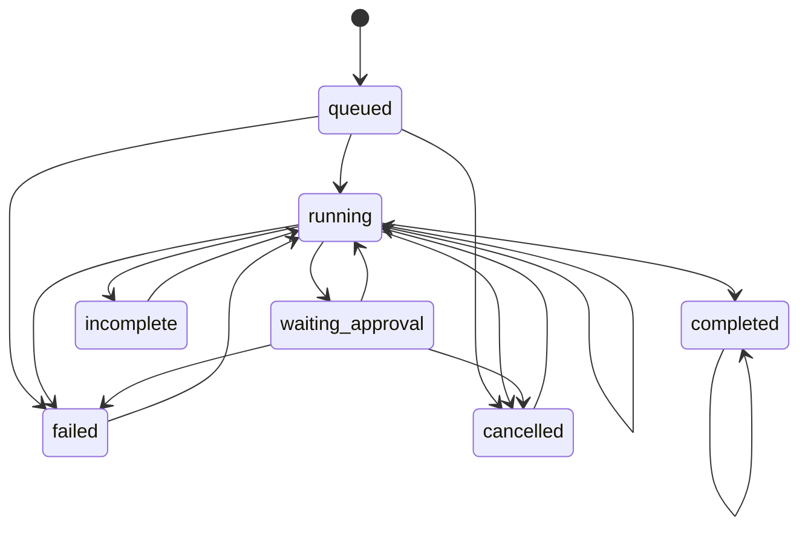

几条关键规则：

| 规则 | 含义 |
|---|---|
| **`COMPLETED` 只能转到自己** | 唯一的真终态。**完成的运行不能续跑**——否则会产生第二份回复 |
| `INCOMPLETE` / `FAILED` / `CANCELLED` **可以回到 `RUNNING`** | 这就是续跑的实现。对应 [09 · Server API 层](./09-Server-API层.md) §4.7 第 3 条校验 |
| `RUNNING → RUNNING` 允许 | 幂等更新，同一状态重复写入不报错 |
| `WAITING_APPROVAL` **不能直接到 `COMPLETED`** | 必须先回 `RUNNING`。审批通过后还要真的执行工具，不能跳过 |
| `QUEUED` **不能直接到 `COMPLETED`** | 没跑过就不可能完成 |
| 每个终态都能转到自己 | 重复写入终态是幂等的，崩溃恢复时可以安全重放 |

用**显式的转移表**而不是在每个方法里写 `if` 判断，好处是所有合法路径在一处可见，且非法转移抛的是有类型的 `RunStateTransitionError` 而不是某个业务方法内部的断言失败。

三个异常也有层次：

```python
class RunStateError(RuntimeError): ...             # 基类：状态无效或读不出来
class RunStateTransitionError(RunStateError): ...  # 试图跳过或离开非法状态
class RunScopeMismatchError(RunStateError): ...    # 续跑请求不属于这个 run
```

调用方可以只 `except RunStateError` 一次接住全部，也可以分开处理——续跑时区分"状态不对"（可能可以等）和"根本不是你的 run"（永远不行）很有价值。

### 7.1.2 `RunScope`：续跑必须证明身份

```python
class RunScope:
    @classmethod
    def from_state(cls, state: RunState) -> "RunScope": ...
    def mismatched_fields(self, state: RunState) -> list[str]: ...
```

续跑请求带一个 `RunScope`，`resume()` 会用它和持久化的状态比对。不匹配就抛 `RunScopeMismatchError`。

`mismatched_fields()` 返回的是**列表而不是布尔**——错误消息里能说清到底哪几个字段对不上（agent_id？session_id？identity_id？）。这个设计和 [13 · Common 基础设施](./13-Common-基础设施.md) §6.6 里 `verify_chain` 返回具体失败原因是同一种考虑：**校验失败时，"哪里不对"比"不对"有用得多**。

### 7.1.3 损坏的状态文件留给操作员

```python
# A torn or edited state file must not abort startup recovery
# of every other run.  Leave it untouched for the operator
# rather than silently writing a second copy over it.
```

启动恢复要遍历所有 run 的状态文件。其中一个损坏了（写到一半崩溃、或被手工编辑过），三种处理方式：

| 做法 | 后果 |
|---|---|
| 抛异常中止 | **一个坏文件让所有 run 都恢复不了** |
| 静默覆盖成默认值 | 证据被销毁，操作员再也查不清发生了什么 |
| **跳过并留着不动** ✓ | 其余 run 正常恢复，坏文件保留供人工检查 |

第三种是这里的选择。它和 [10 · 可观测性与诊断](./10-可观测性与诊断.md) §10.1 分支①"隔离损坏的 trace"是同一条原则：**坏数据要被隔离，不能被清理掉**——清理等于销毁现场。

### 7.1.4 高频事件不落盘

```python
_HIGH_FREQUENCY_STREAM_EVENTS = frozenset({
    EventType.RAW_RESPONSE_EVENT,
    EventType.PROVISIONAL_TEXT_DELTA,
})
```

运行状态每记录一个事件就要写一次文件。但这两种事件在流式响应里**每秒可能来几十上百个**——逐个同步会让磁盘成为瓶颈，而它们对"这个 run 处于什么状态"没有任何贡献。

它们被排除在同步写之外。这和 [13 · Common 基础设施](./13-Common-基础设施.md) §6.11 里 `sync=False` 的延迟同步是配套的取舍：**高频、低价值的记录走宽松路径，状态转移走严格路径**。

### 7.1.5 两个有界化函数

```python
def _bounded_text(value: object | None, *, limit: int = 200) -> str | None: ...
def _bounded_error_details(value: object) -> dict[str, object] | None: ...
```

状态文件里的文本字段（reason、错误详情）**限长 200 字符**。理由和 [11 · Shell 终端 UI](./11-Shell-终端UI.md) §5.8.3 的 2 000 字符上限一样：错误详情可能包含模型的长输出或一整个异常栈，不限长会让一个状态文件涨到几 MB，而它每次状态转移都要重写一遍。

`_RUN_ID_RE = re.compile(r"^[A-Za-z0-9_-]{1,128}$")` 则是路径安全——run_id 直接参与构造文件路径，不校验就可能出现 `../../etc/passwd` 这样的 id。字符集只允许字母数字和两个符号，长度封顶 128。

### 7.1.6 审批恢复只增一次序号

```python
# resolve_approval_if_waiting records the event and clears the
# pending approval atomically, so returning here keeps one source
# TOOL_CALL_RESULT at exactly one event_seq increment.  No
# clear_tool is needed on this path: request_approval already
# cleared current_tool when the approval was raised, and no
# TOOL_CALL_START is re-emitted for the resumed call.
```

这段注释描述的是一个容易写重的地方。审批通过之后：

1. 要记录 `TOOL_CALL_RESULT` 事件
2. 要清掉挂起的审批
3. 要更新 `event_seq`

三件事必须**原子完成且只让序号加一次**。如果分开做，一次 `TOOL_CALL_RESULT` 会让序号加两次——而序号是事件流的排序依据，加错了会让恢复时的事件顺序错乱。

注释后半段解释了为什么这条路径**不需要** `clear_tool`：`request_approval` 在挂起审批时已经清过 `current_tool`，而恢复的调用不会重新发 `TOOL_CALL_START`。写一个多余的 `clear_tool` 不会报错，但会再动一次状态——在一个要求"恰好一次"的路径上，多余的操作就是 bug 的温床。

### 7.1.7 状态控制失败不能拖垮执行

```python
# Run control state must not take down an otherwise valid execution.
```

这条和 [10 · 可观测性与诊断](./10-可观测性与诊断.md) §10.5 的"可观测性失败不能让运行失败"是同一个方向，但对象不同：这里是**运行控制状态**。

状态文件写不进去（磁盘满、权限问题），运行本身仍然是有效的——模型在正常工作、工具在正常执行、用户在正常收到回复。此时因为记不下状态就中止执行，是把一个"事后无法恢复"的问题升级成了"当下就用不了"。

代价是崩溃后这个 run 可能恢复不了。但这个取舍方向很明确：**已经在跑的任务，让它跑完。**

---

## 8. 技能子系统

`engine/skill/`（829 行）：注册、加载、执行、启停。

### 8.1 技能的判定标准

一个目录是技能，当且仅当它有**顶层 `SKILL.md`**。`_parse_or_skip()` 解析失败就跳过，不让一个坏文件毁掉整个目录扫描。

两个来源分开加载：

| 方法 | 来源 | 语义 |
|---|---|---|
| `load_builtin()` | `~/.agent-smith/builtin/skills/` | Smith 自带 |
| `load_agent_skills()` | `~/.agent-smith/agent/skills/` | 用户安装 |

`is_builtin()` 让上层能区分两者——比如禁止卸载内建技能。

### 8.2 启停状态：只记 disabled

`engine/skill/settings.py` 存的是 `~/.agent-smith/agent/skills.yaml`：

```yaml
disabled:
  - some-skill
```

**只记禁用的，不记启用的。** 这是个正确的默认方向：新装的技能默认可用，不需要在设置文件里补一条。反过来（只记 enabled）会让"装了技能但没生效"成为常态。

校验也很严：

```python
unknown = set(settings) - {"disabled"}
if unknown:
    raise SkillSettingsError(f"unknown settings: {', '.join(sorted(unknown))}")
```

**未知键直接报错**，而不是忽略——拼错一个键名不会静默失效。

### 8.3 技能执行的两条路径与两个预算

```python
WORKFLOW_HANDOFF_TOKEN_BUDGET = 2_000
WORKFLOW_SKILL_TOKEN_BUDGET = 8_000
```

| 函数 | 场景 |
|---|---|
| `execute_skill_events()` | 有 `SKILL.md`，按技能内容执行 |
| `execute_react_fallback_events()` | **没有匹配的技能**，退回普通 ReAct |

第二条路径是 `CLAUDE.md` 里那句话的实现：

> A pipeline node falls back to generic ReAct when no matching `SKILL.md` is installed; the gate still runs, so the intermediate contract stays observable.

**技能没装，节点仍然跑，门禁仍然判。** 这意味着一条管线的"契约"由门禁保证，而不是由技能保证——技能只是帮助模型达成契约的方法论。

### 8.4 节点间怎么传递上下文

`_workflow_layers()` 把技能执行的 prompt 也拆成层，其中两层专门做节点间交接：

| 层 | 来源 | 预算 |
|---|---|---|
| `_workflow_handoff_layer()` | 上一节点的交接产物 | 2000 token |
| `_workflow_feedback_layer()` | 门禁给的重试提示（`CTX_RETRY_HINT`） | — |

加上 `_prior_workflow_outputs()`（更早节点的产物）和 `_gate_feedback()`，一个管线节点看到的是：

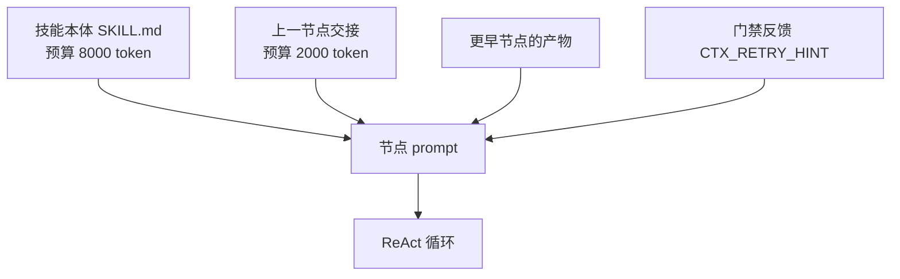

`_trim_to_token_budget()` 对这两块做硬裁剪。设 8000/2000 这两个数的意图很清楚：**技能方法论比上游交接重要 4 倍**——交接只需要结论，方法论要完整。

---

### 8.5 Hook 的动态加载

`engine/execution/hooks/tool/loader.py`（314 行）把 `hooks.yaml` 里的声明变成活的 hook 实例。它是"引擎提供框架、agents 提供实现"这条边界的实际执行者。

### 8.5.1 一条 hook 声明

```yaml
pre_hooks:
  - id: config-protection
    module: agents/smith/hooks/config_protection.py
    class: ConfigProtectionHook
    enabled: true
    priority: 10
```

四个字段各有用处：`module` + `class` 定位实现，`enabled` 控制开关，`priority` 决定 Pre hook 的执行顺序（数字越小越先跑）。

### 8.5.2 三级路径解析

```python
# 如果是相对路径，尝试相对于配置文件目录解析
#   先尝试相对于项目根目录（本文件位于
#   engine/execution/hooks/tool/loader.py，向上 5 级到达仓库根）
#   再尝试相对于配置文件目录
```

`module` 写的是相对路径时，按三个基准依次尝试：

| 顺序 | 基准 | 适用 |
|---|---|---|
| 1 | 绝对路径 | 用户写了完整路径 |
| 2 | **项目根**（从 loader.py 上溯 5 级） | 内建 hook：`agents/smith/hooks/xxx.py` |
| 3 | **配置文件所在目录** | 用户 hook：放在 `~/.agent-smith/` 旁边 |

第二条那个"向上 5 级"是硬编码的相对深度，注释特意把推导写出来了——`engine/execution/hooks/tool/loader.py` 上溯 5 层正好是仓库根。这类基于文件位置的路径推导很脆弱（移动文件就会坏），所以注释必须说明它数的是什么，否则下一个人重构目录结构时不会意识到这里有依赖。

### 8.5.3 类型校验在实例化之前

```python
hook_class = self._load_hook_class(module_path, class_name, config_dir)
if not hook_class:
    return None
if not issubclass(hook_class, PreToolHook):
    logger.error("Class %s is not a PreToolHook subclass", class_name)
    return None
hook_instance = hook_class()
```

顺序是**加载类 → 校验基类 → 才实例化**。三个 `_load_*_hook` 方法结构完全相同，只是校验的基类不同（`PreToolHook` / `PostToolHook` / `StopHook`）。

先校验后实例化很重要：一个不符合协议的类被实例化时可能有副作用（构造函数里连数据库、起线程），而它最终还是会被拒绝。先看类型，不合格就根本不构造。

这里用的是 `issubclass` 而非 `Protocol`——和 [07 · LLM 集成](./07-LLM-集成.md) §2.4 的选择相反。原因是场景不同：hook 是**用户提供的扩展**，明确继承一个基类能让用户从 IDE 得到方法签名提示，也让"你漏实现了某个方法"在加载时就报错；而 LLM 客户端的包装器需要的是"不继承也能顶替"的灵活性。

### 8.5.4 每一步失败都只跳过这一个 hook

三个加载方法里，任何一步失败（缺 `module`、缺 `class`、类加载不出来、基类不对）都是 `logger.error` + `return None`，**不抛异常**。

这意味着：一个写错的 hook 配置不会让整个引擎起不来，其余 hook 照常加载。这和 [12 · MCP 集成](./12-MCP-集成.md) §9 的"一个坏 server 不影响其余"是同一条隔离原则。

代价是配置写错时只有日志里有线索——所以每条错误消息都带上了 `hook_def.get("id")` 或 `class_name`，让人能直接定位到 yaml 里的哪一条。

加载结束后调 `registry.list_registered_hooks()` 汇总日志，这是确认"我配的 hook 到底生效了没有"的唯一途径。

### 8.5.5 两层配置来源

`preparation.py` 先加载 `agents/smith/hooks.yaml`（内建），再加载 `~/.agent-smith/hooks.yaml`（用户）。**用户配置后加载**，所以：

- 用户可以新增 hook
- 用户的 hook 排在内建 hook 之后注册

但 Pre hook 的实际执行顺序由 `priority` 决定而非注册顺序——所以用户 hook 可以通过设一个小的 `priority` 插到内建 hook 前面。这个设计让用户能在配置保护、事实门这些内建检查**之前**插入自己的逻辑，是有意留的扩展点。

需要注意的是它**不能覆盖非 hook 的安全边界**：`tool_guard.py` 是不可绕过的硬守卫，不在 hook 体系里（见 [06 · 安全与安全边界](./06-安全与安全边界.md)）。hook 能做的只是在守卫**之外**再加一层拦截，不能拆掉守卫本身。

---

## 9. 参数速查

### ReAct

| 参数 | 值 |
|---|---|
| 最大有效迭代 | 60 |
| 工具失败恢复上限 | 20 |
| 事实门挑战上限 | 20 |
| 假最终回答修复上限 | 2 |
| 长度截断续写上限 | 2 |
| 对话硬上限 / 保留尾 / 保留头 | 40 / 28 / 2 |
| 同一工具错误重复上限 | 6 |
| 上下文超限恢复次数 | 1 |

### 上下文

| 参数 | 值 |
|---|---|
| Prompt 装配默认预算 | 100 000 token |
| 压缩触发 | 128 000 token |
| 安全余量比例 | 0.10 |
| 压缩后输入占比 | 0.85 |
| CJK 字符估算 | 3 token/字 |
| 非 CJK 估算 | 3 字符/token |
| `SMITH.md` 单文件上限 | 50 000 字符 |
| Prompt 前缀缓存条目上限 | 128 |

### 工具

| 参数 | 值 |
|---|---|
| 输出截断行数 | 2000 |
| 输出截断字节 | 50 KB |
| 权限等级 | read / write / execute / destructive |
| 审批策略 | never / policy / always |
| 副作用 | none / write / external / destructive |
| 并发 | safe / serial |
| 执行环境 | host / sandbox / either |

### 管线

| 参数 | 值 |
|---|---|
| 通用门禁最大重试 | 3 |
| 门禁 LLM 输入上限 | 2000 字符（两端各留一半） |
| `FailureLoopGuard.max_same` | 2 |
| `FailureLoopGuard.max_attempts` | 3 |

---

## 10. 这一层的设计取舍

**① 所有边界都是显式常量，不是魔法数字散落各处。** `budget.py` 一个文件放全部 ReAct 预算，改一个值不用翻 1386 行。

**② 每一条防御都对应一个复现过的 bug。** 对话裁剪的三段注释、流式回退的判据、草稿撤回的四种原因——它们看起来是过度设计，直到你读到注释里的实测数字。

**③ 弱类型换扩展性，但在边界上强校验。** 内容层返回 dict 就行（`coerce_gate_result` 适配），但适配函数会把每一种形状都验一遍。

**④ 确定性优先。** 假最终回答用正则不用模型，门禁先跑启发式再跑 LLM，路由纯词法。模型只在确定性方法真的做不了的地方出现。

**⑤ 该省的地方省。** 懒加载工具 schema、稳定前缀缓存、门禁走便宜模型路由、工具输出截断落盘——四个不同的省钱手段，都不牺牲正确性。

---

### 10.1 改这一层之前先问三个问题

**① 这个改动会不会改变 prompt 的稳定前缀？** §2.4 的前缀缓存按**字节前缀**匹配，第一个易变层就终结了前缀。在第 1–10 层里插入任何内容、或给某个前置层加上易变的 `source`/`load_reason`，都会让缓存边界前移——命中率下降是静默的，只会表现为账单变高和首字延迟变长。加层时优先往第 11 层之后放。

**② 这个改动会不会让某个状态转移变成非法？** §7.1.1 的转移表是全局约束。新增一条"直接标记完成"的快捷路径听起来无害，但 `QUEUED → COMPLETED` 是被明确禁止的——它会让一次从未真正执行的运行看起来成功了。改转移表要连带检查续跑（三个可回 `RUNNING` 的状态）和审批（`WAITING_APPROVAL` 必须先回 `RUNNING`）两条路径。

**③ 这个改动在硬守卫之前还是之后？** 工具执行路径上有明确的次序：`tool_guard`（不可绕过）→ `fact_gate`（只挑战）→ `PreToolHook`（可拦截）。新增的检查放在哪一层决定了它能不能被配置关掉。**安全边界必须进守卫，不能做成 hook**——hook 是可配置的，而可配置就意味着可以被关掉。项目里有一个测试专门锁住"守卫先于挑战"这个次序。

三个问题分别对应 `engine/tests/context/`、`engine/tests/execution/` 与 `engine/tests/safety/` 三组测试。这一层的改动几乎总会牵动其中至少一组——它是四个子系统的交汇点，也是整个引擎里最不适合"顺手改一下"的地方。

最后一条经验：**这一层的很多常量看起来可以调，实际上都编码了某个具体的失败**。60 次迭代上限、40/28/2 的对话裁剪档位、200 字符的状态文本上限、16 层的顺序——每一个背后都有一次"不这样会怎样"的判断，大多写在了紧邻的注释里。调整之前先把那段注释读完，它通常已经回答了你正准备提出的问题。

---

## 11. 接下来

| 想深入 | 读 |
|---|---|
| `ToolGuard` 那 1365 行到底在拦什么 | [06 · 安全与安全边界](./06-安全与安全边界.md) |
| 记忆视图怎么被编译出来 | [05 · 记忆系统](./05-记忆系统.md) |
| provider 适配器怎么产出这些事件 | [07 · LLM 集成](./07-LLM-集成.md) |
| 三条管线的门禁具体检查什么 | [08 · Agents 内容层](./08-Agents-内容层.md) |
