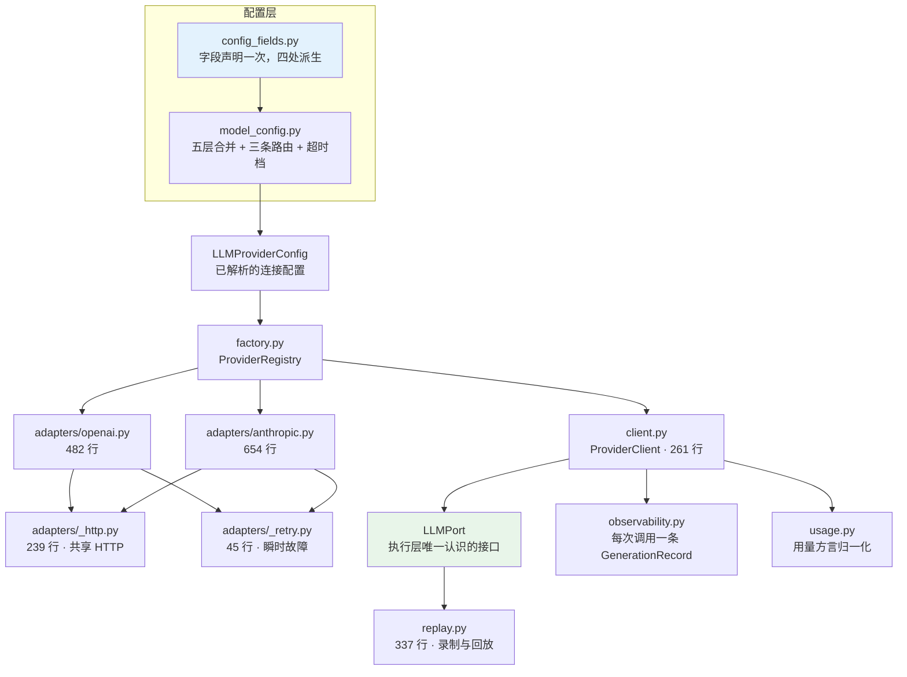
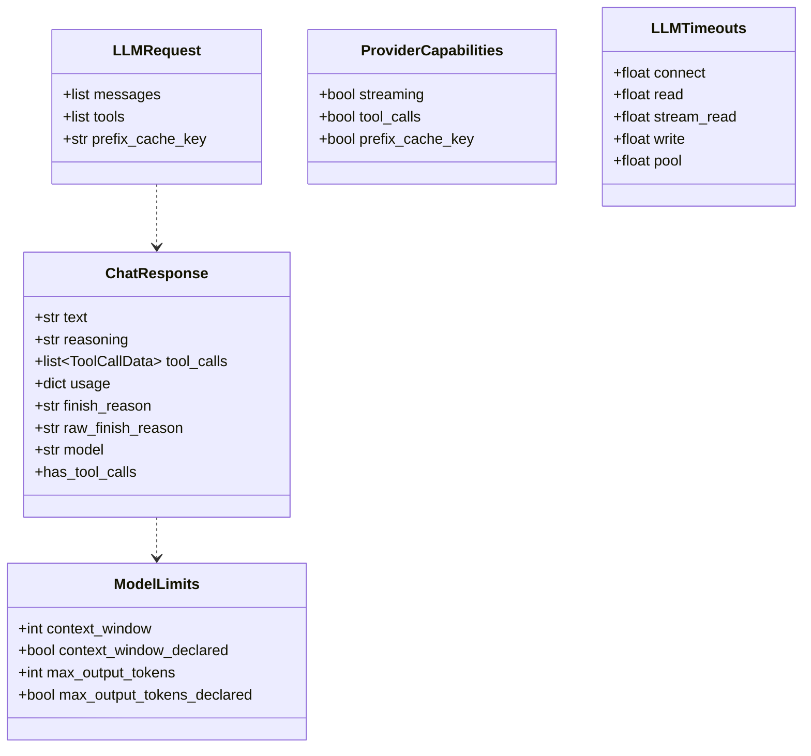
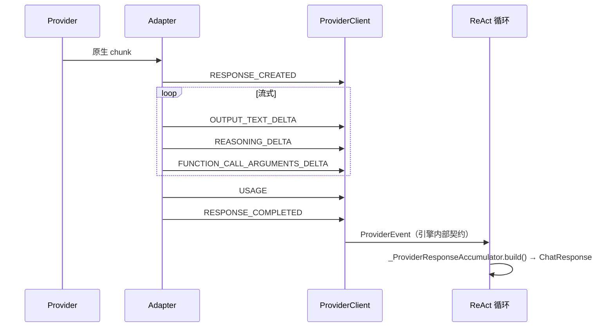
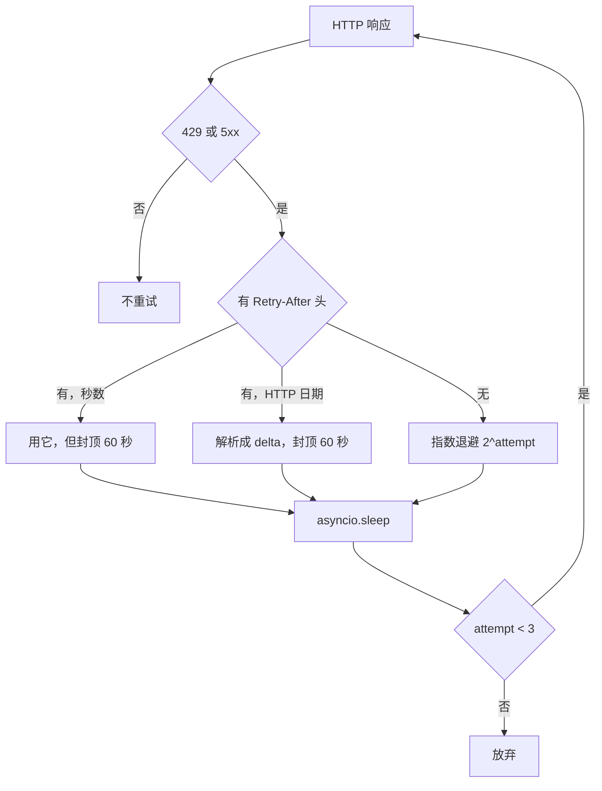
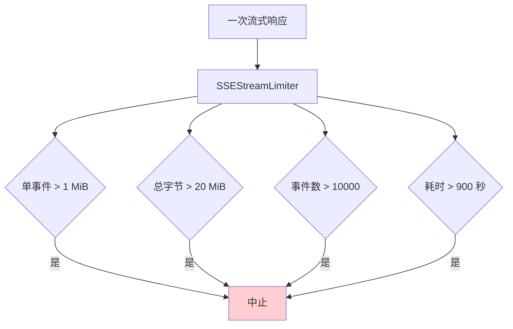
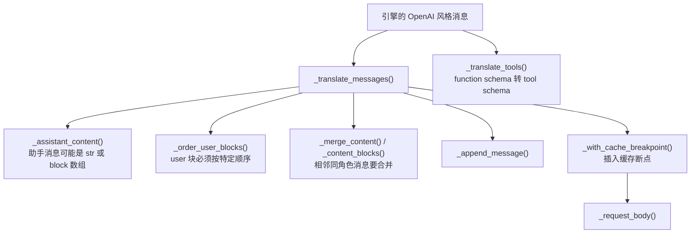
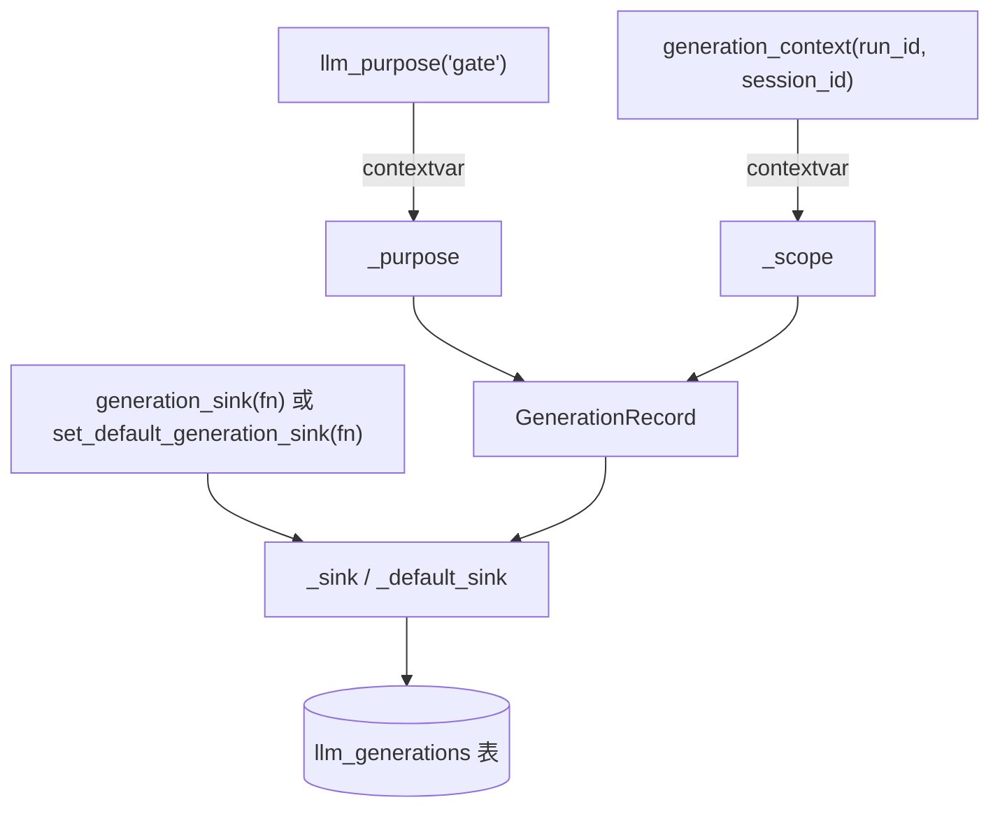
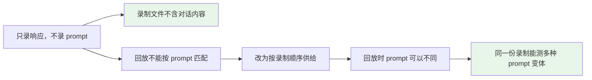
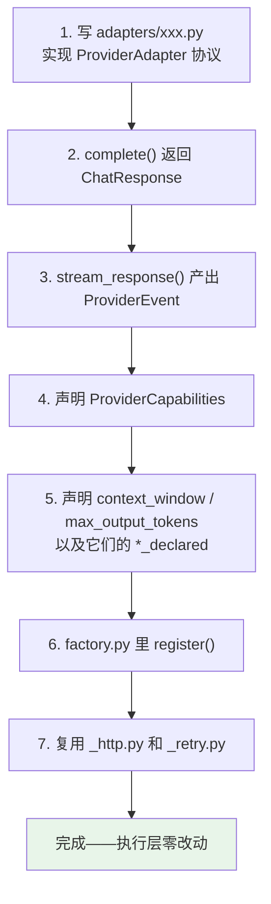

# 07 · LLM 集成

> **定位**：`engine/llm/` 3.2k 行——配置怎么解析成一次请求、Provider 适配器怎么写、流式协议怎么归一化、用量怎么记账、怎么录制回放。
> **适合**：要接一个新 provider 的人；调模型成本和延迟的人；被中转站坑过的人。

---

## 1. 全景



分层的核心是两个 Protocol：

| Protocol | 谁实现 | 谁消费 |
|---|---|---|
| `LLMPort` | `ProviderClient`、`RecordingLLM`、`ReplayLLM`、测试替身 | **执行层**（ReAct 循环、门禁、记忆编译） |
| `ProviderAdapter` | `OpenAIAdapter`、`AnthropicAdapter` | **只有 `ProviderClient`** |

执行层**只认识 `LLMPort`**，完全不知道 provider 的存在。这条边界让"换 provider"和"加录制"变成同一类操作——都是换一个 `LLMPort` 实现。

---

## 2. 配置解析

### 2.1 五层合并

见 [02 · 快速上手](./02-快速上手.md) §3.1 的完整图。这里补三个实现细节。

**① 缓存按文件指纹。**

```python
# Deep-merge of the three static config levels, cached per file fingerprint
# (path + mtime + size).  Config resolution runs on every model route lookup,
# so re-reading unchanged YAML files on each call is wasted disk I/O; edits to
# any level are still picked up because the fingerprint changes.  Environment
# overrides (AGENTSMITH_LLM_*) are the lowest-precedence layer and are part of
# the fingerprint so a change invalidates the cache.
```

**环境变量也参与指纹**——否则改一个环境变量不会让缓存失效。

**② 只有四个键有环境变量入口。**

```python
_ENV_LLM_KEYS = (
    ("AGENTSMITH_LLM_API_KEY", "api_key"),
    ("AGENTSMITH_LLM_BASE_URL", "base_url"),
    ("AGENTSMITH_LLM_MODEL", "model"),
    ("AGENTSMITH_LLM_PROVIDER", "provider"),
)
```

**③ `vendor` 是展示元数据，不进请求。**

```python
# Supplier identity is display metadata only. It deliberately stays out of
# route overrides and adapter construction, but must reach runtime prompt
# metadata for truthful model identity responses.
if "vendor" in llm:
    selected["vendor"] = llm["vendor"]
```

`vendor` 的用处是：用户问"你是什么模型"时，运行时上下文（prompt 第 15 层）里有一个诚实的答案。它不进 adapter 构造，也不进 HTTP 请求。

`engine_runtime.py` 的 `_config_fingerprint()` 在算客户端缓存键时会**显式剔除 `vendor`**：

```python
# Display metadata must never affect client reuse or provider requests.
normalized.pop("vendor", None)
```

否则两个只有 `vendor` 不同的配置会各建一个客户端。

### 2.2 `config_fields.py`：一处声明，六处派生

这是 [02 · 快速上手](./02-快速上手.md) §4.1 讲过的设计，这里补一下它解决的具体故障：

> 同一份字段列表曾经存在于四个并不完全一致的地方……**任何一处漏了一个字段都会静默失败**——一个路由级的值会干脆到不了 adapter。

"静默失败"是关键词。你在 `llm.routes.gate.max_output_tokens` 写了一个值，配置读 API 也能读回来，但 adapter 从没收到过它——因为 `ENGINE_ROUTE_FIELDS` 里漏了这个名字。

三个 flag 编码了投影规则：

| flag | 含义 |
|---|---|
| `secret=True` | 只写不读：接受 patch，读 API 永不返回 |
| `route_scoped=False` | 只能写在顶层，不能按路由覆盖 |
| `engine_projected=False` | 不进 adapter 配置 |

只有两个字段用了非默认值：`api_key`（`secret`）、`vendor`（`route_scoped=False` + `engine_projected=False`）、`timeout_profile`（`engine_projected=False`）。

### 2.3 三条路由与超时档

见 [02 · 快速上手](./02-快速上手.md) §4.2/§4.4。补一条：`LLMTimeouts` 把五个字段翻译成 **两个** `httpx.Timeout`：

```python
def request_timeout(self) -> httpx.Timeout:
    return httpx.Timeout(connect=..., read=self.read, write=..., pool=...)

def stream_timeout(self) -> httpx.Timeout:
    return httpx.Timeout(connect=..., read=self.stream_read, write=..., pool=...)
```

**流式和非流式用不同的 read 超时**。流式的 `read` 语义是"两个 chunk 之间的最大间隔"，非流式是"整个响应的最大等待"——同一个数字对两者意义完全不同。

---

## 3. Provider 注册表

`engine/llm/factory.py` 的 `ProviderRegistry` 只有 94 行，但它的每条校验都有理由：

```python
def register(self, provider, builder, *, aliases=()):
    if canonical in self._builders:
        raise ValueError(f"LLM provider is already registered: {canonical}")
    ...
    if normalized_alias in self._aliases:
        raise ValueError(f"LLM provider alias is already registered: {normalized_alias}")
```

**重复注册硬失败**——一个被静默覆盖的 provider 会让"我明明配了 X 为什么走了 Y"变成无解的问题。

```python
def normalize(self, provider: object) -> str:
    if provider is None or (isinstance(provider, str) and not provider.strip()):
        return "openai"        # 空值默认 openai
    if not isinstance(provider, str):
        raise UnsupportedProviderError("LLM provider must be a string.")
    ...
    raise UnsupportedProviderError(
        f"Unsupported LLM provider {provider!r}; supported providers: {supported}."
    )
```

**错误信息里列出支持的名字**——用户拼错 `anthropics` 时，报错直接告诉他有哪些选项。

名称清洗：`strip().lower().replace("-", "_")`。所以 `OpenAI`、`open-ai`、`OPENAI` 都归一到 `openai`。

当前注册表：

| 规范名 | 别名 | 适配器 |
|---|---|---|
| `openai` | `openai_compatible` | `OpenAIAdapter`（482 行） |
| `anthropic` | — | `AnthropicAdapter`（654 行） |

`openai_compatible` 这个别名是给中转站用的——语义上"我不是 OpenAI，但我说 OpenAI 的协议"。

---

## 4. 归一化契约

执行层只认识 `engine/llm/contracts.py` 里的这些类型：



### 4.1 `finish_reason` 与 `raw_finish_reason` 并存

```python
finish_reason: str | None = None
raw_finish_reason: str | None = None
```

`normalize_finish_reason()` 把 provider 的方言映射到六个标准值：

| 标准值 | 接受的原始值 |
|---|---|
| `stop` | `stop`、`end_turn`、`stop_sequence` |
| `length` | `length`、`max_tokens` |
| `tool_calls` | `tool_calls`、`function_call`、`tool_use` |
| `content_filter` | `content_filter`、`content-filter`、`refusal` |
| `error` | `error` |
| `other` | 其它任何值 |

**保留原始值**是关键：归一化成 `other` 之后，诊断时还能看到 provider 到底说了什么。

### 4.2 `*_declared` 布尔值

```python
@dataclass(frozen=True)
class ModelLimits:
    context_window: int
    context_window_declared: bool
    max_output_tokens: int
    max_output_tokens_declared: bool
```

保守回退值：

```python
DEFAULT_CONTEXT_WINDOW = 128_000
DEFAULT_MAX_OUTPUT_TOKENS = 4_096
```

**区分"模型声明了 128k"和"没声明所以我猜 128k"**。上下文预算计算需要知道自己在精确还是在猜——一个猜出来的窗口应该配更保守的安全余量。

### 4.3 `ProviderCapabilities`

```python
streaming: bool = True
tool_calls: bool = True
prefix_cache_key: bool = False
```

`prefix_cache_key` 默认 `False` 很关键。ReAct 循环里：

```python
provider_prefix_cache_key = (
    fit.prefix_cache_key
    if bool(getattr(getattr(llm, "capabilities", None), "prefix_cache_key", False))
    else None
)
```

**只有声明支持的 adapter 才会收到缓存键**。给不支持的 provider 传一个未知参数，轻则被忽略，重则 400。

### 4.4 `thinking` 默认关

```python
# Ask the model to think before answering.  Off by default: the request
# shape is rejected outright by models that do not support it, and the
# engine cannot tell from a relay's model name whether this one does.
# Each route builds its own client, so this is already per-route.
thinking: bool = False
```

**引擎无法从中转站给的模型名判断这个模型支不支持推理**——中转站的模型名可以是任意字符串。所以默认关，由用户显式开。

### 4.5 三级异常

```python
LLMError                    # 基类
└── LLMResponseError        # payload 不符合内部契约
    └── LLMContextLengthError   # 上下文超限（带 http_status + provider_code）
UnsupportedProviderError    # 配置里的 adapter 名没注册
```

`LLMContextLengthError` 被单独提出来，是因为 ReAct 循环要**专门处理**它——`_is_context_limit_error()` 命中后会触发一次上下文恢复重试（见 [04 · Engine 核心执行](./04-Engine-核心执行.md) §4.1），而不是直接失败。

而且它是"typed, **sanitized** rejection"——错误消息经过清洗，不把 provider 返回的原始 payload 抛给上层。

---

## 5. 流式事件

`engine/llm/events.py` 定义六种归一化的 provider 事件：



模块 docstring 划清了边界：

> 这些名字刻意镜像了 OpenAI Responses 流式词汇里有用的那部分。它们是**引擎内部契约，不是 HTTP/SSE 线格式**：provider 适配器把它们的原生 chunk 翻译到这里，执行层决定哪些事件变成用户可见的进度。

`ProviderEvent.data` 也有一条约束：

> `data` 刻意被限制在引擎需要的信息上；**原始 provider payload 留在 provider 适配器内部，不会被意外暴露给前端**。

这一条是安全考量：provider 的原始响应里可能有请求 id、内部字段、甚至回显的 prompt 片段。

### 5.1 三种 delta 的意义差别

在 ReAct 循环里，这三种事件都算 `saw_content_event`：

| 事件 | 用户可见 | 为什么算"已开始生成" |
|---|---|---|
| `OUTPUT_TEXT_DELTA` | ✅ | 显然 |
| `REASONING_DELTA` | ❌ | **不可见，但证明 provider 已经开始响应**——重放会产生不同的工具计划 |
| `FUNCTION_CALL_ARGUMENTS_DELTA` | ❌ | 工具调用参数已经开始成形 |

---

## 6. 重试策略

`engine/llm/adapters/_retry.py` 只有 45 行：

```python
MAX_RETRIES = 3
MAX_RETRY_AFTER_SECONDS = 60.0

def is_retryable_status(status: int) -> bool:
    return status == 429 or status >= 500
```



`retry_after_seconds()` 的三条防御：

1. **接受两种格式**：纯秒数，或 HTTP 日期（`parsedate_to_datetime`）
2. **无时区的日期按 UTC 处理**（`retry_at.replace(tzinfo=timezone.utc)`）
3. **封顶 60 秒**，并拒绝非有限值和负值

第 3 条防的是：一个错误的 `Retry-After: 86400` 会让请求挂一天。

### 6.1 流式中断的重试

`586f92f fix(llm): retry a mid-stream provider overload on the OpenAI path` 处理的是一个 SDK 通常不管的场景：**流已经建立，中途 provider 返回过载**。

重试它的前提在 ReAct 循环那一侧（§5.1）：只有**还没出现任何语义 delta**才能重放。

---

## 7. `HTTPAdapterMixin`：六道流式边界

`engine/llm/adapters/_http.py`（239 行）的 docstring：

> 为 provider 适配器提供共享的 HTTP 管道：重试/退避循环、非流式 JSON 请求周期、**有界的响应读取**、以及每个基于 HTTP 的适配器都需要的错误体提取。适配器在实现 `ProviderAdapter` 协议的同时继承 `HTTPAdapterMixin`。

**六个上限**：

| 常量 | 值 | 防什么 |
|---|---|---|
| `MAX_RESPONSE_BYTES` | 20 MiB | 非流式响应过大 |
| `MAX_STREAM_TOTAL_BYTES` | 20 MiB | 整个流的总量 |
| `MAX_STREAM_EVENT_BYTES` | 1 MiB | 单个 SSE 事件过大 |
| `MAX_STREAM_EVENTS` | 10 000 | 事件条数 |
| `MAX_STREAM_DURATION_SECONDS` | 900（15 分钟） | 流的墙钟 |
| `MAX_ERROR_BODY_BYTES` | 64 KiB | 错误体读取上限 |



这套上限和 MCP 的四道边界（见 [12 · MCP 集成](./12-MCP-集成.md) §4）**是同一个设计模式的两次应用**：一个外部服务的响应流必须同时被字节、条数和时间三个维度约束，因为任何单一维度都有绕过方式。

**`MAX_ERROR_BODY_BYTES = 64 KiB`** 单独存在，是因为错误体也要读——一个返回 500 并附带 100 MB HTML 错误页的中转站，不该在读错误信息时把内存吃光。

### 7.1 上下文超限的文本识别

```python
_CONTEXT_LIMIT_MARKERS = (...)
```

provider 报告"上下文超了"的方式五花八门：HTTP 状态码可能是 400 也可能是 413，错误码字段可能叫 `code` / `type` / `error.code`，而有些中转站只在消息文本里说。

所以要**按文本标记识别**，然后抛 `LLMContextLengthError`——ReAct 循环的 `_is_context_limit_error()` 靠这个类型决定要不要触发一次上下文恢复重试（见 [04 · Engine 核心执行](./04-Engine-核心执行.md) §4.1）。

**把一个模糊的外部信号收敛成一个精确的内部类型**，是适配器层的核心价值。

---

## 8. Anthropic 适配器的四个翻译难点

`adapters/anthropic.py` 654 行，比 OpenAI 的 482 行大 35%。差额几乎全在**消息格式翻译**上——引擎内部用 OpenAI 风格的消息数组，Anthropic 的 Messages API 结构不同。



| 难点 | 处理 |
|---|---|
| **system 消息位置不同** | OpenAI 放在消息数组里，Anthropic 是顶层 `system` 字段 |
| **相邻同角色消息** | Anthropic 要求 user/assistant 交替，相邻同角色必须合并（`_merge_content`） |
| **内容可以是字符串或块数组** | `_content_blocks()` / `_copy_content()` / `_text_content()` 三个函数处理这个多态 |
| **user 块顺序有要求** | `_order_user_blocks()` 保证 tool_result 块排在文本块前面 |

### 8.1 缓存断点

```python
def _with_cache_breakpoint(...)
```

Anthropic 的 prompt 缓存需要在消息里插一个显式的 `cache_control` 标记。**断点位置就是 `prefix_cache_key` 对应的那个稳定前缀边界**（见 [04 · Engine 核心执行](./04-Engine-核心执行.md) §2.4）。

这解释了为什么 `ProviderCapabilities.prefix_cache_key` 默认是 `False`：OpenAI 的缓存是自动的（按前缀匹配），Anthropic 需要显式断点。**同一个概念在两个 provider 上的实现完全不同**，所以能力必须显式声明。

### 8.2 流式错误的可重试子集

```python
_RETRYABLE_STREAM_ERROR_TYPES = frozenset({...})

class _AnthropicStreamError(LLMResponseError):
    def __init__(self, message: str, *, retryable: bool) -> None: ...

class _AnthropicStreamTruncatedError(LLMResponseError): ...
```

Anthropic 的 SSE 流里可以携带 `error` 事件。**只有一部分错误类型值得重试**（比如 `overloaded_error`），其余（比如 `invalid_request_error`）重试只会得到同样的结果。

`_AnthropicStreamTruncatedError` 单独一个类型：流在没有收到结束事件的情况下断了。这和"收到了一个错误事件"是两回事——前者可能是网络问题，后者是 provider 明确的拒绝。

### 8.3 `_ANTHROPIC_VERSION = "2023-06-01"`

API 版本头。Anthropic 用日期做版本，写死一个已知可用的值比跟随最新更稳——**新版本可能改变响应结构**。

---

## 9. `ProviderClient`：适配器与 `LLMPort` 之间

`engine/llm/client.py`（261 行）做四件事，每件都有一处非显然的细节。

### 9.1 能力校验

```python
def _validate_requested_capabilities(self, ...) -> ...
```

调用方传了 `prefix_cache_key` 但适配器不支持时，**在这里被拦下**而不是传给适配器。

这是 [04 · Engine 核心执行](./04-Engine-核心执行.md) §4.1 里那段 `getattr(getattr(llm, "capabilities", None), "prefix_cache_key", False)` 的另一半——调用方先问，客户端再验，**两层都不信任对方**。

### 9.2 非流式伪装成事件流

```python
async def _complete_as_events(self, request: LLMRequest) -> AsyncIterator[ProviderEvent]:
```

`stream=False` 时 `chat_events()` 仍然要产出事件——它调 `complete()` 拿完整响应，再**合成**一串事件（`RESPONSE_CREATED` → 一个大的 `OUTPUT_TEXT_DELTA` → `USAGE` → `RESPONSE_COMPLETED`）。

**调用方不需要写两套代码。** ReAct 循环里的流式/非流式分支处理的是"provider 能不能流"，而不是"事件流存不存在"。

### 9.3 首 token 延迟怎么测

```python
_CONTENT_EVENT_TYPES = (...)

async def _observed_stream(self, request: LLMRequest) -> AsyncIterator[ProviderEvent]:
```

`ttft_ms` 的定义是"第一个**内容**事件的时间"，不是"第一个事件的时间"。`RESPONSE_CREATED` 立刻就到，用它测 TTFT 会得到一个恒定的小数字。

所以有 `_CONTENT_EVENT_TYPES` 这个集合——只有文本 delta、推理 delta、函数参数 delta 三种算内容。

### 9.4 记账在 finally 里

```python
async def _emit_generation(self, ...) -> None: ...
```

无论流正常结束、抛异常、还是被取消，**都要产出一条 `GenerationRecord`**（`ok` 字段区分）。一个只在成功路径记账的系统，会让"失败的调用"在成本报表里完全消失——而失败的调用**同样花钱**（provider 通常按输入 token 计费）。

---

## 10. 用量记账

`engine/llm/usage.py` 的 docstring 描述了一个现实问题：

> Provider 和网关用不同的方言报告 token 用量；**单个响应甚至可能混用方言**（一个 OpenAI 兼容网关代理 DeepSeek 时会同时返回 `prompt_tokens_details.cached_tokens` 和 `prompt_cache_hit_tokens`）。因此归一化是**按优先级匹配已知字段名**，而不是按 provider 分支。

六个归一化键：

```python
USAGE_KEYS = (
    "input_tokens", "output_tokens", "total_tokens",
    "cache_read_tokens", "cache_write_tokens", "reasoning_tokens",
)
```

加一个不是 token 计数的标志位：

```python
# Not a token count — 1 when the provider sent a usage payload, 0 when it did not.
# Kept out of USAGE_KEYS so anything iterating token keys stays unaffected.
USAGE_REPORTED_KEY = "usage_reported"
```

**区分"用了 0 个 token"和"provider 没报"**——这两件事在成本统计里意义完全不同。而且它被刻意排除在 `USAGE_KEYS` 之外，所以任何遍历 token 键的代码都不受影响。

`_number()` 的三条拒绝：

```python
if isinstance(value, bool) or not isinstance(value, (int, float)):
    return None      # bool 是 int 的子类，必须先排除
if value < 0:
    return None      # 负数不是合法用量
```

docstring 最后一句是原则：

> 细节字段**严格尽力而为**：缺失就是零，**绝不估算**。

---

## 11. Generation 级可观测

`engine/llm/observability.py`：**每一次模型调用都产生一条 `GenerationRecord`**——主循环和旁路一视同仁。

```python
@dataclass(frozen=True)
class GenerationRecord:
    provider: str
    model: str
    purpose: str          # interactive / gate / background / compaction / memory / routing / other
    usage: dict[str, int]
    ttft_ms: int | None   # 首 token 延迟
    total_ms: int
    stream: bool
    ok: bool
    run_id: str | None
    session_id: str | None
    occurred_at: str
    source_key: str       # uuid，落库时做幂等键
```

三个 contextvar 负责归因：



**为什么用 contextvar 而不是参数传递**：一次记忆编译要经过 `maintenance → compile → _generate_view → ProviderClient`，把 `purpose='memory'` 一层层传下去会污染四个函数的签名。

docstring 里的一条硬约束：

> 记录严格是**尽力而为**：一个缺失或失败的 sink **绝不影响模型调用本身**。

`7b058ee fix(observability): attribute the two LLM side channels that logged NULL` 修的就是这个机制的两个漏网之鱼——两条旁路调用没设 `purpose`，落库时是 NULL，导致成本统计里出现归属不明的支出。

Server 侧在 `lifespan` 里装上默认 sink：

```python
set_default_generation_sink(TokenStatsService().record_generation)
```

关闭时置空：`set_default_generation_sink(None)`。

---

## 12. 录制与回放

`engine/llm/replay.py`（337 行）。`engine_runtime.py` 的 `_maybe_record()` 是入口：

```python
"""Set ``AGENT_SMITH_RECORD_LLM=/path/to/case.jsonl`` and every model turn of
every subsequent run appends there, ready to replay via engine.llm.replay.
Only the *responses* are written, never the prompt — so a recording cannot
leak conversation content, and replay does not need it (turns are served in
recorded order rather than matched against messages)."""
```

两条设计约束互相支撑：



一个看起来是"隐私约束"的决定，副产品是**回放的适用范围更广**——因为不要求 prompt 一致，你可以改 prompt 再跑同一份录制，观察 harness 的行为变化。

`RecordingLLM` 和 `ReplayLLM` 都实现 `LLMPort`，所以它们对执行层完全透明。

---

## 13. 客户端缓存

`engine/llm/client.py`（261 行）是 adapter 和 `LLMPort` 之间的那一层。它做四件事：

| 职责 | 说明 |
|---|---|
| 协议适配 | `ProviderAdapter.complete/stream_response` 转成 `LLMPort.chat/chat_events/chat_stream` |
| 流式开关 | `stream=False` 时 `chat_events` 走非流式路径 |
| 用量归一化 | 调 `usage.py` |
| 生成记录 | 每次调用产出一条 `GenerationRecord` |

`chat_stream()` 是一个只产出文本的简化接口，给不需要完整事件的调用方用。

### 13.1 指纹

`server/app/services/engine_runtime.py` 的 `LLMClientManager`：

```python
def get_for_config(self, config) -> LLMPort:
    fingerprint = _config_fingerprint(config)
    with self._lock:
        client = self._clients.get(fingerprint)
        if client is None:
            client = _maybe_record(build_llm_client(config))
            self._clients[fingerprint] = client
        return client
```

**按解析后的完整配置做指纹**，所以三条路由如果配置相同就共享一个客户端。关闭时去重：

```python
clients = list({id(client): client for client in self._clients.values()}.values())
```

因为多个指纹可能映射到同一个对象（不会，但防御性写法），且 `RuntimeServices.close()` 那边也有同样的去重。

---

## 14. 接一个新 Provider 要做什么



四个协议成员是全部契约：

```python
provider: str
capabilities: ProviderCapabilities
context_window / context_window_declared
max_output_tokens / max_output_tokens_declared

async def complete(self, request: LLMRequest) -> ChatResponse
def stream_response(self, request: LLMRequest) -> AsyncIterator[ProviderEvent]
async def close(self) -> None
```

**执行层不需要改一行。** 这是把 `LLMPort` 和 `ProviderAdapter` 分成两个 Protocol 的收益。

---

## 15. 中转站的现实问题

用中转站（relay）而不是官方端点时，有三条实测教训：

**① `/v1/models` 列出的模型不等于能用。**
中转站的模型列表往往是从上游抄的，实际没开通道。**换模型前先 `curl` 直接打一次**。

**② 有的模型只走 Responses API，不走 Chat Completions。**
同一个中转站的不同模型可能需要不同的端点形状。

**③ 模型名是任意字符串。**
这就是 `thinking` 默认关的原因——引擎无法从名字推断能力。

对应的设计选择：

| 现实问题 | 设计应对 |
|---|---|
| 模型能力不可推断 | `thinking` / `prefix_cache_key` 默认关，显式开启 |
| 用量方言混乱 | 按字段名优先级匹配，不按 provider 分支 |
| 上游过载 | 429/5xx 重试，尊重 `Retry-After` 但封顶 60 秒 |
| 窗口未声明 | `*_declared` 布尔值让下游知道自己在猜 |
| 协议方言 | `openai_compatible` 别名 + `normalize_finish_reason` |

---

## 16. 参数速查

| 参数 | 值 | 位置 |
|---|---|---|
| 默认上下文窗口（未声明时） | 128 000 | `contracts.py` |
| 默认最大输出（未声明时） | 4 096 | `contracts.py` |
| 最大重试次数 | 3 | `_retry.py` |
| `Retry-After` 上限 | 60 秒 | `_retry.py` |
| 可重试状态码 | 429、>= 500 | `_retry.py` |
| 退避策略 | `2^attempt` 秒 | `_retry.py` |
| interactive 超时 | connect 10 / read 90 / stream 120 / write 30 / pool 10 | `model_config.py` |
| gate 超时 | connect 10 / read 90 / stream 90 / write 30 / pool 10 | 同上 |
| background 超时 | connect 10 / read 240 / stream 300 / write 30 / pool 10 | 同上 |
| 支持的 provider | `openai`（别名 `openai_compatible`）、`anthropic` | `factory.py` |
| `stream` 默认 | `true` | `config_fields.py` |
| `thinking` 默认 | `false` | `config_fields.py` |
| 归一化用量键 | 6 个 + `usage_reported` | `usage.py` |
| 归一化 finish_reason | 6 个标准值 | `events.py` |
| provider 事件类型 | 6 种 | `events.py` |

---

## 17. 设计取舍

**① 两个 Protocol 而不是一个。** `LLMPort` 给执行层，`ProviderAdapter` 给 provider 实现。多一层，但换来"加录制/回放/测试替身"和"加 provider"是两件互不干扰的事。

**② 手写适配器而不是用官方 SDK。** 换来超时分档、流式中断重试、中转站兼容、录制回放四件事的完全控制。代价是 1.1k 行适配器代码要自己维护。

**③ 归一化时保留原始值。** `raw_finish_reason` 与 `finish_reason` 并存。归一化让代码简单，原始值让诊断可能。

**④ 能力默认关。** `thinking`、`prefix_cache_key` 都默认 `false`。因为引擎无法探测能力，而错误开启的代价是请求直接被拒。

**⑤ 记账严格但尽力而为。** 用量缺失就是零、绝不估算；sink 失败绝不影响模型调用。**观测不能反过来伤害被观测的东西。**

**⑥ 用 contextvar 做归因。** 避免把 `purpose` 沿四层调用链传递。代价是归因错误比较难查——`7b058ee` 修的就是两条忘了设 purpose 的旁路。

---

## 18. 接下来

| 想深入 | 读 |
|---|---|
| 配置怎么从 YAML 到请求 | [02 · 快速上手](./02-快速上手.md) §3–§4 |
| 事件怎么变成 ReAct 循环的行为 | [04 · Engine 核心执行](./04-Engine-核心执行.md) §4 |
| `GenerationRecord` 怎么落库 | [10 · 可观测性与诊断](./10-可观测性与诊断.md) |
| 门禁与记忆编译各走哪条路由 | [05 · 记忆系统](./05-记忆系统.md) §9.4 |
| `/api/config/llm` 端点 | [09 · Server API 层](./09-Server-API层.md) |
