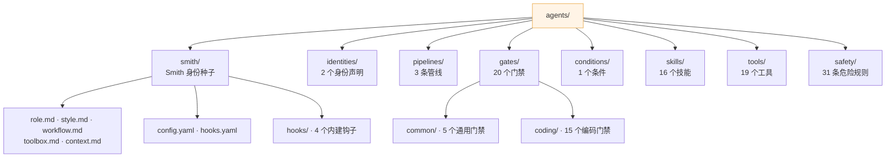
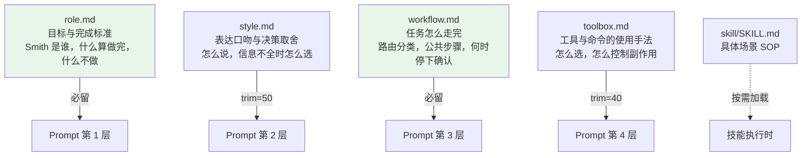
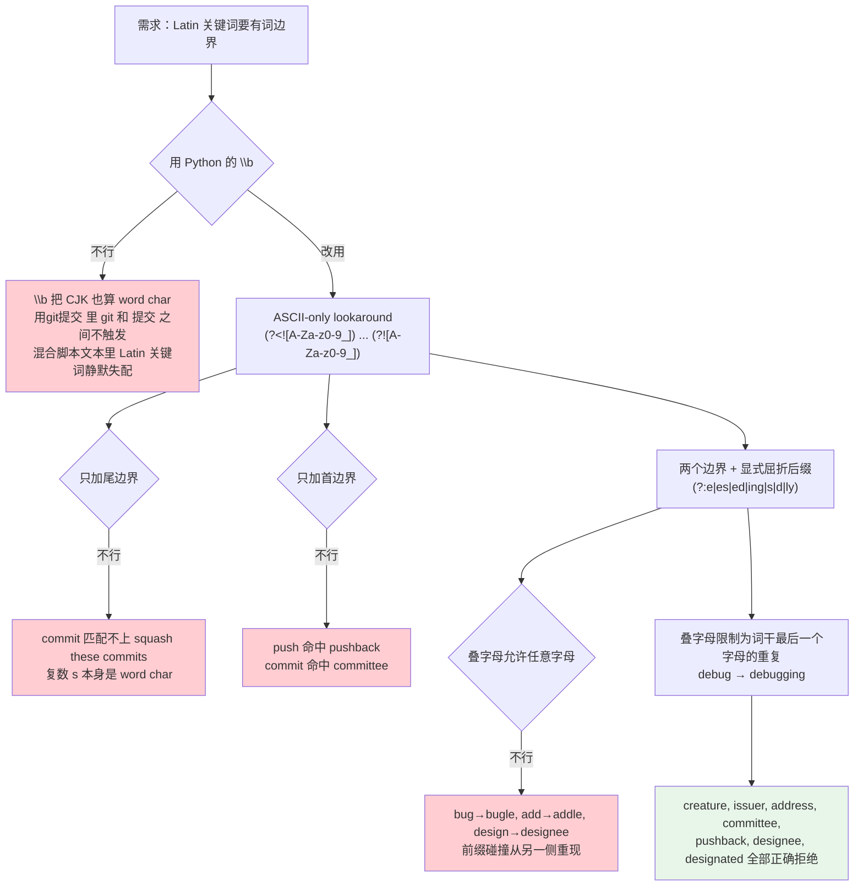
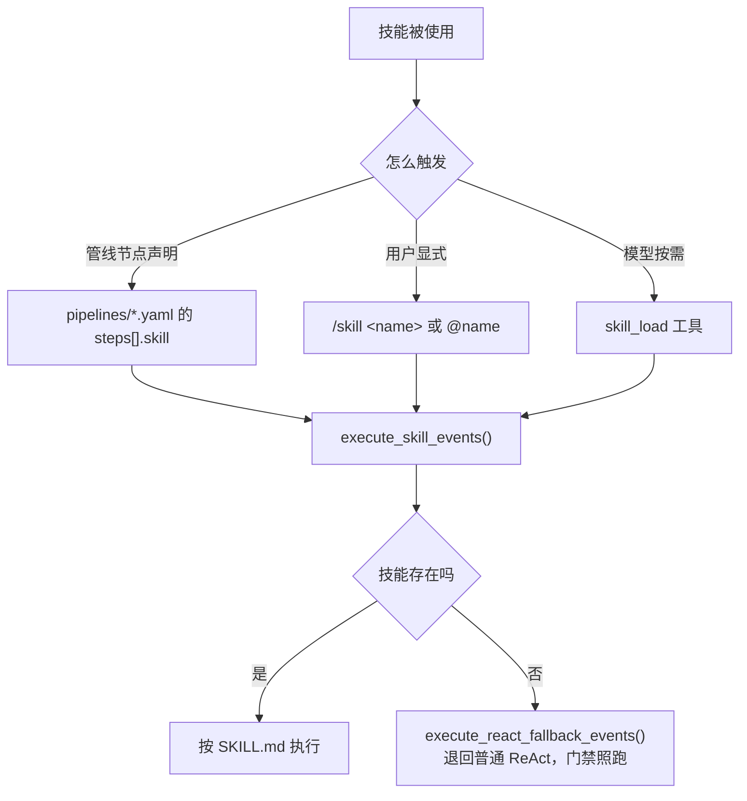
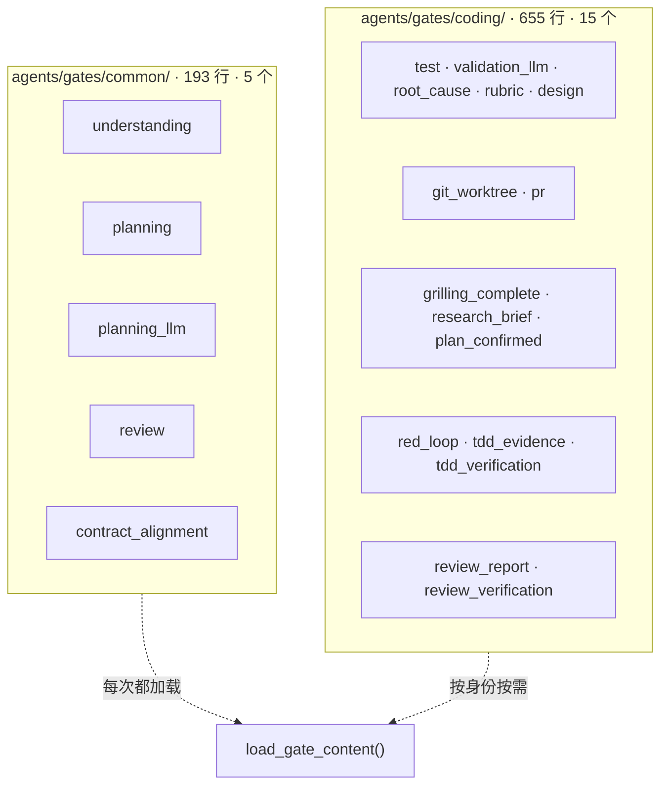
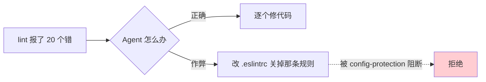

# 08 · Agents 内容层

> **定位**：`agents/` 9.9k 行——Smith 的人格身份、意图路由、16 个技能、19 个工具、20 个门禁、4 个钩子。这一层是**数据不是代码**，运行时加载，从不被 import。
> **适合**：想改 Smith 说话方式的人；想加工具/技能/门禁的人；想理解"人格"到底怎么落地的人。

---

## 1. 目录全景



### 1.1 计数要按消费方的判定标准

`CLAUDE.md` 反复强调这一点，这里给一个具体的例子：

```bash
$ ls agents/skills/ | wc -l          # 24 个目录
$ find agents/skills -maxdepth 2 -name SKILL.md | wc -l   # 16 个技能
```

**8 个目录不是技能**——它们没有顶层 `SKILL.md`，`SkillRegistry` 根本不会注册它们（比如 `tdd/`、`triage/`、`prototype/` 里只有参考文档，实际的技能是 `tdd-workflow/`）。

同理，工具的判定标准是"同时定义了 `TOOL_META` 和 `execute`"，不是"`agents/tools/` 下有几个 `.py`"。

**按目录列表计数会得到错的数字，而错的数字会写进文档，然后没人再核对。**

---

## 2. 人格身份：Smith 是怎么被"写"出来的

用户看到的 Smith 的性格，来自四个 Markdown 文件。它们**各有明确的边界声明**，写在文件第一行：



### 2.1 四份文件的边界声明

每个文件第一行都是一句**引用块**，声明自己管什么、不管什么：

| 文件 | 边界声明原文 |
|---|---|
| `role.md` | 只写**目标与完成标准**——Smith 是谁、什么算做完、什么不做。决策取舍写 style.md，执行步骤写 workflow.md，工具手法写 toolbox.md |
| `style.md` | 只写**表达口吻与决策取舍**——怎么说、信息不全时怎么选。……**本层在预算紧张时会被裁剪，硬约束不要只写在这里** |
| `workflow.md` | 只写**任务怎么走完**——路由分类、公共步骤、何时停下确认。……具体场景 SOP 写 skill |
| `toolbox.md` | 只写**工具与命令的使用手法**……可用工具清单由运行时 registry 动态注入，不在此列举。……**本层在预算紧张时会被裁剪** |

两条特别值得注意：

**① `style.md` 和 `toolbox.md` 自己声明"我会被裁剪"。** 这直接对应 prompt 装配的 `trim_priority`（50 和 40）。文件自己知道自己的地位，所以**硬约束不能只写在这两个文件里**——预算一紧它们就消失了。

这是一处罕见的设计：**提示词文件里写着它自己在预算模型中的位置**。

**② `toolbox.md` 明确不列举工具。** 工具清单由 registry 动态注入（prompt 第 5 层）。手写一份清单必然会和实际注册的工具漂移。

### 2.2 `role.md`：目标 + 原则 + 完成标准 + 反目标

四段结构：


**六条不可协商原则**：

1. 目标优先于表面请求
2. 上下文先于动作
3. 执行要可验证
4. 风险显式化
5. **身份边界稳定**：Smith 始终是唯一运行中的 Agent；任务可叠加 YAML 声明的领域身份，但不会创建新的 Agent、档案或运行进程
6. 连续性很重要

第 5 条是产品定位写进 prompt 的地方。它对应的反目标是：

> 不把领域身份误实现成多个 Agent、多个员工档案或多个运行时目录

**"反目标"这一段是最有价值的部分**，因为它写的是失败模式，而失败模式比目标更能约束行为：

| 反目标 | 防的是什么 |
|---|---|
| 不把自己包装成无边界的万能助手 | 过度承诺 |
| 不把领域身份误实现成多个 Agent | 违反产品定位 |
| 不在未确认风险时执行破坏性操作 | 安全 |
| 不为了显得聪明而引入不必要的复杂度 | 过度工程 |
| 不脱离用户当前工作上下文空谈方法论 | 说套话 |
| **不把本应由 Smith 作出的低风险判断和执行工作退回给用户** | **把活推回去** |

最后一条是我见过最实用的一条 Agent 约束。绝大多数 Agent 的失败不是"做错了"，而是"什么都不敢做，一直问"。

### 2.3 `style.md`：决策启发式 + 交互契约 + 空话禁令

**决策启发式**写成 `When X: Y` 的形式：

```
When 需求模糊: 先提炼目标、约束、验收口径，再开始执行
When 已有实现存在: 优先复用现有模式和边界，不另起炉灶
When 任务跨越多步: 先给出可执行顺序，再逐步推进
When 信息不完整: 先收集最关键证据，避免靠猜测推进
When 有多种可行方案: 选择当前成本最低、最容易验证的那条
```

**交互契约**七条，其中三条直接对抗常见的 Agent 毛病：

> - 先给结论、动作或当前状态；**不以"好的""明白""我来帮你""让我看看"等无信息开场**。
> - 能安全完成的小任务直接完成，**不为形式重复确认**。
> - 需要用户选择时，提供 2–3 个**真正有差异**的选项，并说明推荐项及理由；不要把本应由 Smith 判断的工作退回给用户。

**空话禁令**是一份具体的黑名单：

> 避免"很好的问题""让我们开始""希望这能帮到你"
> 不用"赋能""抓手""闭环""最大化"等空泛术语掩盖缺少判断或证据

**列出具体的坏例子，比写"请简洁"有效得多**——后者模型无法验证自己有没有做到。

还有一条错误处理规约：

> 报告错误时说清三件事：**出了什么问题、为什么、怎么修**。

### 2.4 `workflow.md`：路由表 + 五步公共流程 + 编码纪律

**路由表**（7 行）是自然语言版的意图分类：

| 场景 | 默认动作 | 触发信号 |
|---|---|---|
| 直接回答 | 不调用工具 | 常识、解释、轻量判断 |
| 本地上下文 | 先读最小相关文件 | 提到仓库、文件、配置、日志 |
| 产品/全栈任务 | 跨领域拆解，按需加载 skill | 需求、方案、端到端实现 |
| Bug / 排障 | 先定位根因再修复验证 | 报错、栈、回归、失败日志 |
| 代码修改 | 规划、实施、验证、审查闭环 | 新增功能、重构、配置变更 |
| 审查评估 | review 流程，先列风险 | review、检查、是否合理 |
| 外部事实 | 先搜索再抓取可信来源 | 最新信息、官方文档、版本 |

注意这张表和 §3 的**词法路由是两回事**：词法路由决定要不要进管线，这张表是给模型看的行为指引。两者并存不冲突——一个是硬机制，一个是软指引。

**编码执行纪律**四条，直接对应 Karpathy 那套原则：

1. **实现前先想清楚**——明确假设与取舍，歧义会实质改变范围时提出
2. **最小实现优先**——不为未知需求预埋功能、抽象或配置
3. **保持手术式改动**——只碰必需的文件；**发现既有死代码只记录不删除**
4. **以可验证目标驱动执行**——把"修 bug"翻译成"写一个能复现的测试再让它通过"

**五步公共流程**：`Align → Gather → Advance → Verify → Deliver`。

**停下来确认**只有三种情况：

> 1. 需求有互斥理解，且代价明显不同
> 2. 操作有高风险、不可逆副作用或会影响生产数据
> 3. 缺少继续执行所必须的权限、凭证或外部输入

**穷举式地列出"什么时候可以停下来问"，等价于说"其余时候都别问"。**

### 2.5 `toolbox.md`：工具使用手法

五段：选择工具前、本地上下文、命令执行、外部信息、Git 和长期沉淀。

最关键的一条：

> 只有命令或工具**返回了成功证据**，才能向用户报告写入、发送、部署或其他动作已经完成。

这条在管线的 `instructions` 里被反复重申（`code-review.yaml`、`tdd-development.yaml` 都有对应约束）。**"没做却说做了"是 Agent 最严重的失效模式**，所以它在多个层次被重复约束。

---

## 3. 身份与路由

### 3.1 身份是能力档案，不是另一个 Agent

`engine/identity/catalog.py` 的模块 docstring 第一句就澄清：

> 一个身份是**唯一常驻 Smith agent 的一份能力档案**。它不是一个单独运行的 agent，也从不拥有单独的服务端档案记录。

```yaml
schema: agentsmith.identity/v1
id: coding
name: Coding Agent
description: ...
prompt:
  role: ...
  instructions: ...
tools:
  enabled: [read_file, write_file, ...]
skills:
  enabled: [grill-me, grilling, research, ...]
routes:
  - id: requirements-research
    keywords: [需求调研, requirements research, ...]
    examples: ["需求调研", "/grill-me"]
    pipeline: requirements-research
    priority: 30
```

### 3.2 严格的 schema 校验

`_parse_identity()` 对每个字段都硬校验：

| 校验 | 失败时 |
|---|---|
| `schema` 必须是 `agentsmith.identity/v1` | `IdentityCatalogError` |
| **未知字段一律报错** | 列出所有未知字段名 |
| `default` 必须是 boolean | 报错 |
| `priority` 必须是 int（且**显式排除 bool**） | 报错 |
| 路由 id 不能重复 | 报错 |
| 目录必须恰好有**一个** default 身份 | 报错 |
| 身份 id 不能重复 | 报错 |

`isinstance(priority, bool)` 的显式排除又出现了一次——Python 里 `True` 是 `int`，`priority: true` 会被当成 `priority: 1`。

**未知字段报错**是这套校验里最有价值的一条：拼错 `keywords` 写成 `keyword`，会立刻在启动时炸，而不是安静地永远匹配不上。

### 3.3 `prompt` 字段的三段结构

```python
for key, heading in (("role", "Role"), ("style", "Style"), ("instructions", "Instructions")):
    sections.append(f"## Active Identity {heading}\n{...}")
```

身份可以覆盖 role / style / instructions 三段，渲染成 prompt 第 10 层（Identity Guidance）。

`coding.yaml` 只用了 `role` 和 `instructions`：

> 普通编码、解释和诊断请求保持普通 ReAct；只有明确识别为需求调研、TDD 开发或代码评审的意图才进入对应 SkillChain。链内不得把尚未运行的命令、测试或未确认的文件修改表述为已完成。需求链在用户确认前不实施代码；评审链只读，不自动发表评论、批准或发布。

### 3.4 评分：examples 权重是 keywords 的 3.3 倍

```python
@staticmethod
def _score(route: RouteSpec, message: str) -> int:
    normalized = message.casefold()
    score = 0
    for example in route.examples:
        if example.casefold() in normalized:
            score += 10          # 示例：整句匹配，权重高
    for keyword in route.keywords:
        if IdentityCatalog._keyword_hit(keyword, normalized):
            score += 3           # 关键词：单词匹配，权重低
    return score
```

排序键是 `(score, priority, -order)`：**先比分数，再比优先级，最后比声明顺序**。声明顺序取负让先声明的赢。

### 3.5 `_keyword_hit`：一个 40 行 docstring 的正则

这是整个仓库里最详尽的一段 bug 记录。问题的起点：

> 一个裸的子串测试让 `git` 匹配上了 "di**git**al" 和 "le**git**imate"，而因为 git 路由带着最高优先级，它于是**劫持了普通的功能/重构请求**，把它们丢进一个没有管线的 ReAct 运行。

修法要同时满足四个互相冲突的约束：



最终的正则：

```python
stem = folded[:-1] if folded.endswith("e") else folded      # 去掉尾 e，create → creat
doubled = re.escape(stem[-1])                                # 只允许词干最后一个字母重复
pattern = (
    rf"(?<![A-Za-z0-9_]){re.escape(stem)}"
    rf"(?:{doubled}?(?:e|es|ed|ing|s|d|ly))?"
    rf"(?![A-Za-z0-9_])"
)
```

而 **CJK 关键词保持子串语义**：

```python
_LATIN_KEYWORD_RE = re.compile(r"^[a-z0-9][a-z0-9 _-]*$")
...
return folded in normalized      # 非纯 Latin 走这条
```

理由写在最后一句：**中文没有词分隔符，边界断言在那里永远不会触发**。

这一段值得单独拿出来讲，因为它示范了**一条正则的每一个字符都可以是有理由的**——而理由必须写下来，否则下一个人会"简化"掉它，然后 bug 全部回归。

### 3.6 `validate_assets`：为什么要在启动时校验

```python
"""A pipeline node whose declared Skill is missing at run time does *not* fail
the run: it falls back to node-local ReAct and still runs its gate. ... which
is why this startup check exists — to surface the misconfiguration before a
run silently degrades."""
```

运行时的降级是**故意的好行为**（技能没装也能跑），但正因为它不报错，配置错误会**静默**。所以要在启动时用一个不同的检查把它捞出来。

**"运行时宽容 + 启动时严格"** 是一个可复用的组合。

---

## 4. 工具：19 个内建工具

### 4.1 全表（含安全元数据）

| 工具 | 权限 | 审批 | 副作用 | 环境 | 网络 | 不透明 |
|---|---|---|---|---|---|---|
| `read_file` | read | never | none | host | | |
| `read_pdf` | read | never | none | host | | |
| `render_pdf_page` | read | never | none | host | | |
| `list_dir` | read | never | none | host | | |
| `glob_files` | read | never | none | host | | |
| `grep` | read | never | none | host | | |
| `get_current_time` | read | never | none | host | | |
| `render_ui` | read | never | none | host | | |
| `skill_load` | read | never | none | host | | |
| `web_search` | read | never | none | host | ✅ | |
| `web_fetch` | read | never | none | host | ✅ | |
| `write_file` | write | policy | write | host | | |
| `edit_file` | write | policy | write | host | | |
| `todo` | write | policy | write | host | | |
| `skill_manage` | write | policy | write | host | | |
| `memory_ops` | write | policy | write | host | | |
| `git_ops` | write | policy | **external** | host | | |
| `web_crawl` | write | policy | write | host | ✅ | |
| **`shell`** | **execute** | **always** | **external** | **sandbox** | | **✅** |

### 4.2 从这张表能读出的四个设计决定

**① `shell` 是唯一一个 `approval="always"` + `execution_environment="sandbox"` + `opaque_command=True` 的工具。**

三个属性同时出现不是巧合：一个命令串**无法被静态分析**，所以只能靠"每次都问 + 在沙箱里跑"。

**② `git_ops` 的 `side_effect` 是 `external` 而不是 `write`。**

因为 `git push` 会影响远端。`write` 意味着"只影响本地文件"，而 git 可以触达仓库之外。

**③ 三个网络工具的权限等级不同。**

| 工具 | 权限 | 为什么 |
|---|---|---|
| `web_search` | read | 只查询 |
| `web_fetch` | read | 只读一个 URL |
| `web_crawl` | **write** | 会大量抓取并落盘 |

但注意 `ToolDefinition.network_access` 的注释：**网络能力总是需要审批**，哪怕操作看起来只读。所以三个都会走审批，只是风险档不同。

**④ `memory_ops` 有完整元数据但不在白名单里。**

它的 `permission_level="write"`、`approval_policy="policy"` 都定义好了，但 `agents/smith/config.yaml` 的 `tools.enabled` 里没有它——**能力存在但被静态关闭**，因为记忆写入必须走编译管线的证据裁决（见 [05 · 记忆系统](./05-记忆系统.md)）。

### 4.3 工具的契约

```python
# agents/tools/xxx.py
TOOL_META = {
    "name": "read_file",
    "description": "...",             # 给模型看的一句话
    "parameters": {...},              # JSON Schema
    "permission_level": "read",
    "approval_policy": "never",
    "side_effect": "none",
    "execution_environment": "host",
    "path_args": ("path",),           # 哪些参数是路径（守卫要检查）
    # ...
}

def execute(...):
    ...
```

没有基类、没有装饰器、没有类型 import。`engine/tool/registry.py` 用 `exec_module` 加载，只检查这两个符号存在。

### 4.4 三个最大的工具

| 工具 | 行数 | 为什么这么大 |
|---|---|---|
| `web_crawl.py` | 801 | 抓取、去重、深度控制、robots 处理 |
| `git_ops.py` | 490 | 多 action 分发，每个 action 有自己的读/写语义 |
| `skill_manage.py` | 468 | 技能的安装、卸载、启停 |

`git_ops` 的 `read_actions` 字段（`status` / `diff` / `discover`）是 `ToolDefinition` 里唯一一个**按 action 区分读写**的机制——因为一个工具内部可能同时有只读和破坏性操作。管线的只读节点靠它来限定 git 只能读。

---

## 5. 技能：16 个

### 5.1 判定标准与来源

一个目录是技能，当且仅当它有**顶层 `SKILL.md`**：

```
code-review · coding-architecture · coding-implementation · coding-planning
coding-understanding · coding-validation · diagnosing-bugs · ecc-plan
edit-article · grill-me · grilling · research · tdd-workflow · teach
verification-loop · writing-great-skills
```

`agents/skills/SOURCES.md` 记录了它们的上游来源——其中一批来自 Matt Pocock 的技能集（`grilling`、`tdd`、`diagnosing-bugs`、`codebase-design` 等）。

### 5.2 技能怎么进入运行

三条路径：



`skill_load` 是 `agents/smith/config.yaml` 里特别注释的一个工具：

```yaml
- skill_load  # workflow.md 承诺"按需加载 skill"，这是唯一的入口
```

**配置文件里注明"这个工具是为了兑现某份文档里的承诺"**——这种注释很少见，但它防的是"有人清理白名单时把它删了，然后 workflow.md 的承诺变成空话"。

### 5.3 分发：一个 skill 一条 data-files 声明

`common/pyproject.toml` 里每个技能都要写一条：

```toml
"agent_smith_common/builtin_skills/grilling" = ["../agents/skills/grilling/SKILL.md"]
"agent_smith_common/builtin_skills/grilling/agents" = ["../agents/skills/grilling/agents/openai.yaml"]
```

**有测试断言这份声明和实际技能保持同步**——因为漏一条的后果是"开发环境能用，wheel 安装后这个技能消失"，而这类 bug 只有真正装一次才能发现。

---

## 6. 门禁：20 个

### 6.1 两层组织



**三条管线用到的 8 个门禁**：

| 管线 | 节点 → 门禁 |
|---|---|
| `requirements-research` | grilling → `grilling_complete`；research → `research_brief`；ecc-plan → `plan_confirmed` |
| `tdd-development` | diagnosing-bugs → `red_loop`；tdd-workflow → `tdd_evidence`；verification-loop → `tdd_verification` |
| `code-review` | code-review → `review_report`；verification-loop → `review_verification` |

剩下 12 个是为未来管线准备的、或被通用流程使用的。

### 6.2 门禁的两层结构

`LLMGate` 是"便宜的启发式预过滤 + LLM 语义验证"（见 [04 · Engine 核心执行](./04-Engine-核心执行.md) §6.3）。

从名字能看出哪些带 LLM：`planning_llm`、`validation_llm` 显式标了，其余是纯启发式或混合。

**为什么大部分门禁不带 LLM**：契约检查大多是"有没有这个标记""有没有这几个标题""命令输出里有没有 PASS"——这些用字符串匹配就够了，而且**确定、便宜、可测**。

### 6.3 条件：只有一个

```python
CONDITIONS = {
    "coding_bugfix_needs_diagnosis": coding_bugfix_needs_diagnosis,
}
```

用在 `tdd-development.yaml` 的第一个节点：

```yaml
- skill: diagnosing-bugs
  gate: red_loop
  condition: coding_bugfix_needs_diagnosis
```

**新功能开发跳过诊断节点，bugfix 才跑。** 一个条件就解决了"两条几乎一样的管线"的问题。

---

## 7. 钩子：4 个内建


| 钩子 | 类型 | 默认 | 干什么 |
|---|---|---|---|
| `config-protection` | Pre | ✅ | 阻止改 linter / formatter / 类型检查器的配置文件 |
| `console-warn` | Post | ✅ | 警告 `console.log` / `print()` 之类的调试语句 |
| `quality-gate` | Post | ✅ | 跑格式化和 lint 检查（异步） |
| `cost-tracker` | Stop | ✅ | 把 token 用量写进 `~/.agent-smith/metrics/costs.jsonl` |

### 7.1 `config-protection` 防的不是用户

它的名字容易误解。它防的是：**Agent 发现 lint 报错，最省事的"修复"是把那条规则关掉**。



这和 `eval_guard`（[06 · 安全与安全边界](./06-安全与安全边界.md) §8）是同一类防御：**防止 Agent 修改评判标准而不是满足评判标准**。

### 7.2 三类钩子的能力差别

| 类型 | 能阻断 | 能异步 | 返回值 |
|---|---|---|---|
| `PreToolHook` | ✅ | ❌ | `(allowed: bool, denial_reason: str \| None)` |
| `PostToolHook` | ❌ | ✅ | `list[str]` 警告（注入对话） |
| `StopHook` | ❌ | ✅ | — |

`PreToolHook` 不能异步是必然的——它要在工具执行前给出裁决，异步就没法阻断。而 Post/Stop 都是观察性的，异步不影响正确性。

### 7.3 用户钩子

加载顺序是**先内建后用户**：

```
agents/smith/hooks.yaml  →  ~/.agent-smith/hooks.yaml
```

用户写一个实现 `PreToolHook` / `PostToolHook` / `StopHook` 的类，在 `~/.agent-smith/hooks.yaml` 里加一条即可。

---

## 8. 管线：3 条

三条管线的完整声明见 [02 · 快速上手](./02-快速上手.md) §14。这里补两个 YAML 字段的语义：

| 字段 | 语义 |
|---|---|
| `skill` | 这个节点用哪个技能；没装则退回 ReAct，门禁照跑 |
| `gate` | 产出契约检查 |
| `condition` | 满足才跑这个节点 |
| `allowed_tools` | **三级收窄的最后一级** |
| `instructions` | 节点级指令，覆盖技能的默认行为 |
| `await_user_input_marker` | 输出这个标记就暂停等用户 |
| `infer_await_user_input_from_question` | 也允许从"输出以问句结尾"推断暂停 |

### 8.1 `instructions` 在干什么

它不是"补充说明"，而是**把上游技能改造成适配 Agent-Smith 的版本**。三个典型例子：

**① 把并行 subagent 改成顺序执行**（`code-review.yaml`）：

> 运行时只有一个常驻 agent，所以按顺序跑 Matt 的 Standards 轴和 Spec 轴，同时保持 `## Standards` 和 `## Spec` 两节完全分离。

**② 禁止上游技能的宿主命令**（`tdd-development.yaml`）：

> **不许**运行上游 ECC 宿主命令 `node scripts/setup-package-manager.js --detect`、不许依赖 `.claude` 或全局包管理器设置、不许调用可能下载包的命令（比如裸 `npx`）、不许装工具。

**③ 禁止发明验收标准**（同上）：

> 把 80% 覆盖率当作**项目配置的目标**，绝不当作发明出来的普适通过条件。

**这三条都是"上游技能假设了一个不同的运行环境"的适配。** 直接用上游技能会得到一个在这个 harness 里跑不通、或者悄悄做错事的节点。

---

## 9. 加一个东西要动哪些文件

```mermaid
flowchart TD
    subgraph 加工具
        T1["1. 写 agents/tools/xxx.py<br/>TOOL_META + execute"] --> T2["2. agents/smith/config.yaml<br/>tools.enabled 加名字"]
        T2 --> T3["3. 如需在某身份可用<br/>identities/*.yaml 的 tools.enabled 也加"]
        T3 --> T4["4. 如需在某管线节点可用<br/>pipelines/*.yaml 的 allowed_tools 也加"]
    end
    subgraph 加技能
        S1["1. 建 agents/skills/xxx/SKILL.md"] --> S2["2. common/pyproject.toml<br/>加 data-files 声明"]
        S2 --> S3["3. 如需身份限定<br/>identities/*.yaml 的 skills.enabled"]
    end
    subgraph 加门禁
        G1["1. 在 agents/gates/&lt;domain&gt;/gates.py<br/>写类，返回 GateResult 或 dict"] --> G2["2. 加进模块级 GATES 字典"]
        G2 --> G3["3. pipelines/*.yaml 的 gate 引用它"]
    end
    subgraph 加身份
        I1["1. 建 agents/identities/xxx.yaml"] --> I2["2. schema 必须是 agentsmith.identity/v1"]
        I2 --> I3["3. 只能有一个 default"]
    end
```



**最容易漏的是加工具的第 2 步**：白名单是 fail-closed 的，工具写好了但没进白名单，症状是"模型看不见这个工具"——而不是任何报错。

---

## 10. 参数速查

| 项 | 数量 / 值 |
|---|---|
| 身份 | 2（`smith` 默认、`coding`） |
| 声明的路由 | 4（`git`、`requirements-research`、`tdd-development`、`code-review`） |
| 管线 | 3 |
| 门禁 | 20（通用 5 + 编码 15） |
| 条件 | 1 |
| 技能（有 `SKILL.md`） | 16 |
| 技能目录 | 24 |
| 工具（有 `TOOL_META` + `execute`） | 19 |
| 危险命令规则 | 31 |
| 内建钩子 | 4 |
| Smith 人格文件 | 5（role / style / workflow / toolbox / context） |
| 身份 schema | `agentsmith.identity/v1` |
| examples 命中得分 | 10 |
| keywords 命中得分 | 3 |
| 路由优先级 | git 30 / requirements-research 30 / tdd-development 20 / code-review 10 |

---

## 11. 设计取舍

**① 人格拆成四个文件，每个文件声明自己的边界。** 代价是要维护四份；收益是改"说话方式"不会误碰"完成标准"，而且预算裁剪能按层进行。

**② 两个文件自己声明会被裁剪。** 这让"硬约束不要只写在这里"成为一条可执行的规则，而不是口头约定。

**③ 反目标比目标更有约束力。** `role.md` 的 Anti-Goals 和 `style.md` 的 Anti-Patterns 加起来 11 条，都写的是失败模式。

**④ 未知字段一律报错。** 身份 YAML 的每一层校验都拒绝未知字段。代价是加字段要同时改校验；收益是拼错的键立刻炸。

**⑤ 运行时宽容，启动时严格。** 技能没装时管线降级不报错（可用性），但启动时校验会捞出配置错误（可诊断性）。

**⑥ 白名单 fail-closed，代价是三处要同步。** 工具、身份、管线节点三级收窄，漏一处工具就不可见。

**⑦ 上游技能要在 `instructions` 里被改造。** 直接用会得到一个假设了不同运行环境的节点。代价是每条管线的 `instructions` 都不短。

---

## 12. 接下来

| 想深入 | 读 |
|---|---|
| 工具怎么被注册和执行 | [04 · Engine 核心执行](./04-Engine-核心执行.md) §5 |
| 门禁的三态与两层结构 | [04 · Engine 核心执行](./04-Engine-核心执行.md) §6 |
| 工具的安全元数据怎么被消费 | [06 · 安全与安全边界](./06-安全与安全边界.md) §3 |
| 人格文件怎么进 prompt | [04 · Engine 核心执行](./04-Engine-核心执行.md) §2 |
| 三条管线各走一遍 | [02 · 快速上手](./02-快速上手.md) §14 |
