# 09 · Server API 层

> **定位**：`server/` 6.1k 行——34 个路由端点 + `/api/health`、13 个 service、并发控制、自动任务调度器、本地鉴权。
> **适合**：要加端点的人；想理解"一个 6k 行的后端怎么撑起完整 Agent 生命周期"的人。

---

## 1. 分层

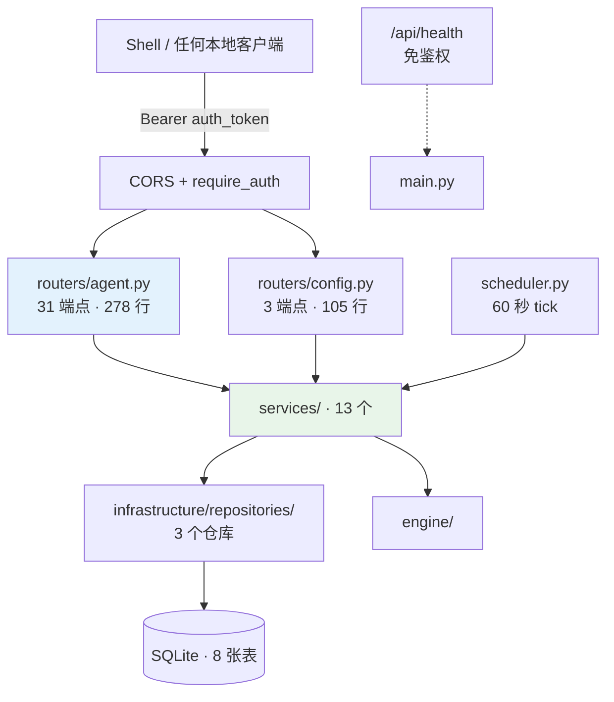

**路由极薄**：31 个端点 278 行，平均每个端点 9 行——取参、调 service、返回。所有逻辑在 service 层。

---

## 2. 端点全表

### 2.1 Agent 档案（2）

| 方法 | 路径 | 作用 |
|---|---|---|
| GET | `/api/agent` | 取 Agent 档案 |
| POST | `/api/agent/ensure` | 幂等创建档案（201） |

### 2.2 会话（7）

| 方法 | 路径 | 作用 |
|---|---|---|
| GET | `/api/agent/sessions` | 会话列表 |
| POST | `/api/agent/sessions` | 建会话（201） |
| PATCH | `/api/agent/sessions/{id}/model` | 切换模型档案 |
| POST | `/api/agent/sessions/{id}/compress` | 压缩并持久化上下文 |
| DELETE | `/api/agent/sessions/{id}` | 删会话（204） |
| GET | `/api/agent/sessions/{id}/messages` | 消息列表 |
| **POST** | **`/api/agent/sessions/{id}/messages/stream`** | **主入口：SSE 事件流** |

### 2.3 技能 / MCP / 项目指令（4）

| 方法 | 路径 | 作用 |
|---|---|---|
| GET | `/api/agent/skills` | 技能列表 |
| PUT | `/api/agent/skills/{name}` | 启停某个技能 |
| GET | `/api/agent/mcp` | MCP 服务器与工具 |
| PUT | `/api/agent/project-instructions` | 生成项目 `.smith/SMITH.md` 模板 |

### 2.4 记忆与用量（2）

| 方法 | 路径 | 作用 |
|---|---|---|
| GET | `/api/agent/memory/status` | 记忆维护状态 |
| GET | `/api/agent/token-stats` | Token 用量看板 |

### 2.5 可观测（7）

| 方法 | 路径 | 作用 |
|---|---|---|
| GET | `/api/agent/observability/runs` | 运行列表 |
| GET | `/api/agent/observability/runs/{id}` | 运行摘要 |
| GET | `/api/agent/observability/runs/{id}/trace` | 逐事件 trace |
| GET | `/api/agent/observability/incidents` | 事故列表 |
| GET | `/api/agent/observability/health` | Agent 健康度 |
| GET | `/api/agent/observability/runs/{id}/diagnosis` | 失败诊断 |
| GET | `/api/agent/observability/runs/{id}/improvement-proposal` | 改进建议 |

### 2.6 运行控制（3）

| 方法 | 路径 | 作用 |
|---|---|---|
| GET | `/api/agent/runs/{id}` | 运行状态 |
| POST | `/api/agent/runs/{id}/resume` | 恢复被中断的运行 |
| POST | `/api/agent/runs/{id}/approval` | **提交审批结果** |

### 2.7 自动任务（6）

| 方法 | 路径 | 作用 |
|---|---|---|
| GET | `/api/agent/auto-tasks` | 任务列表 |
| POST | `/api/agent/auto-tasks` | 建任务（201） |
| PUT | `/api/agent/auto-tasks/{id}` | 改任务 |
| POST | `/api/agent/auto-tasks/{id}/trigger` | 手工触发（**202 Accepted**） |
| DELETE | `/api/agent/auto-tasks/{id}` | 删任务（204） |
| GET | `/api/agent/auto-tasks/{id}/runs` | 运行记录 |

**`trigger` 返回 202 而不是 200**——因为它启动一个脱离的后台运行，不等结果。

### 2.8 配置（3）+ 健康（1）

| 方法 | 路径 | 作用 |
|---|---|---|
| GET | `/api/config/llm` | 读配置（**不含 `api_key`**） |
| GET | `/api/config/llm/models` | 发现可用模型 |
| POST | `/api/config/llm` | 写配置 |
| GET | `/api/health` | **免鉴权**，返回 `status` / `version` / `started_at` / `stale` / `nonce` |

---

## 3. 鉴权

`server/app/infrastructure/auth.py` 只有 83 行，但每一处都有安全考量。

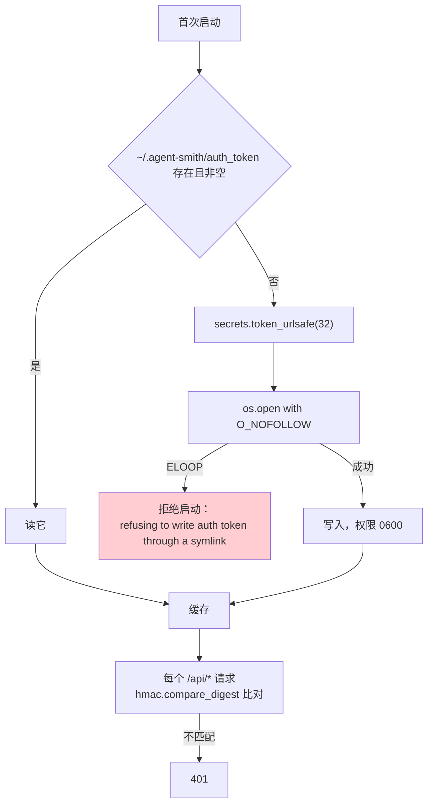

三个细节：

**① `O_NOFOLLOW`。**

```python
# O_NOFOLLOW: a pre-planted symlink at the token path must not be truncated
# or overwritten through, which would let a local attacker clobber an
# arbitrary file. Refuse to start instead.
```

一个预先埋好的软链会让"写 token"变成"覆盖任意文件"。捕获 `ELOOP` 后**拒绝启动**而不是绕过。

**② `hmac.compare_digest` 而不是 `==`。**

常数时间比较，防时序攻击。本地场景下威胁不高，但成本为零。

**③ `/api/health` 免鉴权。**

因为 Shell 要在拿到 token 之前先探测服务是否活着。它返回的字段（版本、启动时间、stale、nonce）都不敏感。

CORS 只允许本地：

```python
allow_origin_regex=r"^https?://(localhost|127\.0\.0\.1)(:\d+)?$"
```

---

## 4. 会话并发：一把带引用计数的锁

`session_service.py` 里 40 行的锁管理，注释密度极高，因为它修过一个真实的竞态。

### 4.1 问题

一个会话同时来两个请求，两边都要"读历史 → 插入用户消息"。不加锁的话两轮会交错，得到错乱的历史。

### 4.2 为什么不能用 `Lock.locked()` 做驱逐

```python
# Eviction is refcounted, NOT keyed on asyncio.Lock.locked(): locked() reports
# False in the window between release() and a queued waiter's wake-up, so
# evicting on it could drop a lock that a waiter is about to acquire and let two
# turns interleave the exact history-read/insert window this serializes.
```

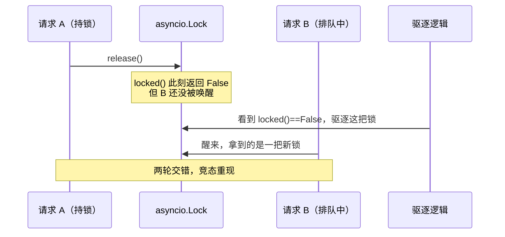

正确做法是**引用计数**：一个调用方（持锁者或排队者）从 `acquire()` 之前就算 in-use，直到 `release()` 之后；只有零用户的条目才能驱逐。

### 4.3 锁的边界

```python
"""Held only for the history-read + user-insert window, never across the
streaming generator, so an abandoned stream cannot deadlock a session."""
```

**锁只覆盖"读历史 + 插消息"这个窗口，不覆盖整个流式生成器。** 否则一个用户关掉终端留下的僵尸流会永久锁死这个会话。

### 4.4 有界的锁表

```python
_SESSION_STREAM_LOCKS_MAX = 64
```

超过 64 个时驱逐零用户的条目。**一个被遗弃（永不删除）的会话不能永远泄漏一把锁。**

### 4.5 三个上下文预算

```python
_HISTORY_LIMIT = 40
_COMPRESS_MESSAGE_CAP = 50_000
_COMPRESS_BYTE_CAP = 20_000_000
```

`_HISTORY_LIMIT = 40` 的注释解释了为什么不是 10：

> 每轮只存**可见的回复文本**——工具调用、文件读取和命令输出永远不会进入下一轮——所以即使一轮跑了几十个工具，在这里也只花一条短消息。**取 10（5 个来回）时，一个工作中的会话在活还没干完之前就看不见自己最初的问题了。**

两个 compress 上限一个管条数一个管字节：

> 字节预算：一旦对话内容超过这个值就停止取数，这样一个巨大的会话不会被整个缓冲进内存再发给摘要器。

---

### 4.5.1 历史裁剪：两处"绝对索引 vs 相对窗口"

压缩之后，会话上下文里存了两样东西：一段 `context_summary`，和一个 `context_summary_cutoff`（表示前多少条已被总结）。之后每次组装历史都要**跳过被总结的前缀，只取最近 40 条**（`_HISTORY_LIMIT`）。

看起来简单，但两个函数在这里都踩过同一类坑，注释把踩坑过程留下了。

**坑一：cutoff 不能直接当分页 offset。**

```python
# cutoff counts from the start of the session, so it cannot be
# paged from directly: get_messages caps a page at 200, and
# taking the last rows of that page yields cutoff+190..cutoff+199
# rather than the newest messages.  Offset from the end instead,
# never reaching back into the summarized prefix.
total = await counter(session_id)
start = max(cutoff, total - _HISTORY_LIMIT)
rows = await self.session_repo.get_messages(session_id, limit=_HISTORY_LIMIT, offset=start)
```

直觉写法是 `get_messages(offset=cutoff, limit=200)` 然后取最后 40 条。问题在于**这一页最多 200 条**：假设 cutoff=100、总共 500 条消息，这样取到的是第 100–299 条，末尾 40 条是第 260–299 条——而真正的"最近 40 条"是第 460–499 条。

用户会看到 Agent 记得的是几百条之前的对话，完全跟不上当前话题。而且这个 bug **只在长会话里出现**（消息数超过 cutoff+200），短会话完全正常，很难被发现。

正确做法是**从末尾算起点**：`total - _HISTORY_LIMIT` 就是最后 40 条的起始位置，再用 `max(cutoff, ...)` 保证不会退回到已被总结的前缀里去。两个约束用一个 `max` 同时满足。

**坑二：绝对 cutoff 不能直接切相对窗口。**

```python
# cutoff is absolute; prior_rows is a window of at most
# _HISTORY_LIMIT rows ending at message_id.  Slicing by the raw
# cutoff emptied the window for any cutoff >= its length.
# Translate to a window-relative index via the window's own
# absolute start.
window_start = await counter(session_id, prior_rows[0].get("id"))
drop = max(0, cutoff - window_start)
prior_rows = prior_rows[drop:]
```

`_history_before_message`（续跑时用）先取"目标消息之前的最多 40 条"，得到一个**窗口**。此时 `prior_rows[0]` 不是会话的第一条消息，而是窗口的第一条。

直接写 `prior_rows[cutoff:]` 就错了：`cutoff` 是从会话开头算的绝对位置（可能是 100），而窗口只有 40 条——`prior_rows[100:]` 得到**空列表**，续跑时 Agent 完全没有上下文。

修法是先问出窗口的绝对起点（`count_messages(session_id, prior_rows[0].id)`），再把绝对 cutoff 转成窗口内的相对位置：`drop = max(0, cutoff - window_start)`。`max(0, ...)` 处理窗口整体在 cutoff 之后的情况（不需要丢弃任何一条）。

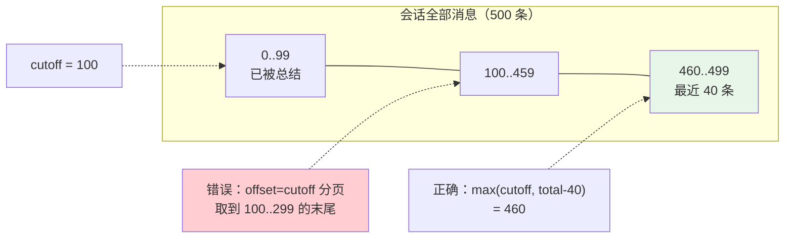

两处的共同教训：**一个绝对位置和一个相对窗口混用时，必须显式转换**。这类 bug 的特征是"短数据正常、长数据出错"，而开发和测试环境的数据往往都短。对应的回归测试在 `test_session_history_cutoff.py`（6 个）。

`getattr(self.session_repo, "get_context", None)` 这种写法在两个函数里都出现——仓库方法用可选调用而非直接调用，是为了让测试可以传一个只实现部分方法的假仓库。这是可测性对实现风格的影响，代价是每次都要判空。

### 4.6 会话压缩的三个细节

`compress_session()` 把整段对话交给模型总结，换成一段 summary 存进会话上下文。三处不显眼但关键：

**① 必须显式传上限，不能用默认值。**

```python
# Compression summarizes the WHOLE conversation, so fetch it all
# explicitly (the get_messages default cap of 200 would silently drop the
# tail), bounded by both row count and content bytes so a pathological
# session cannot be buffered whole.
rows = await self.session_repo.get_messages(
    session_id,
    limit=_COMPRESS_MESSAGE_CAP,      # 50 000 条
    max_content_bytes=_COMPRESS_BYTE_CAP,  # 20 MB
)
```

`get_messages` 的默认上限是 200 条。压缩如果用默认值，一个 300 条消息的会话会**只总结前 200 条**——而且没有任何提示，用户拿到一份看起来正常但漏掉了三分之一内容的摘要。

同时又不能真的无上限：`_COMPRESS_MESSAGE_CAP = 50_000` 和 `_COMPRESS_BYTE_CAP = 20_000_000` 两个维度一起限制。只限行数不够，因为单条消息可以很大（贴了一个大文件）；只限字节也不够，因为几十万条小消息同样会撑爆内存。

**② 手动压缩要自己装 generation scope。**

```python
# Manual /compress runs outside any agent run, so nothing has
# installed a generation scope.  Without this the compaction's own
# LLM call lands in llm_generations with a NULL session_id we are
# holding right here.
with generation_context(session_id=session_id):
    summary_result = await summarize_session(...)
```

压缩本身要调一次 LLM，这次调用也要计入用量统计。正常的 agent run 会在开始时装好 generation scope，而用户手动触发的 `/compress` 走的是另一条路径——**没有任何东西装过 scope**。

不加这一行，这次 LLM 调用会以 `session_id = NULL` 落进 `llm_generations` 表。注释末尾那句 "a NULL session_id **we are holding right here**" 点出了荒谬之处：session_id 就在手里，只是没人把它传下去。这类 bug 不会报错，只会让成本统计里出现一堆无主的记录。

**③ `finally` 里兼容同步和异步的 close。**

```python
finally:
    close = getattr(services, "close", None)
    if close is not None:
        result = close()
        if inspect.isawaitable(result):
            await result
```

`services` 是临时构建的运行时，用完必须释放（里面可能有 MCP 连接、HTTP 客户端）。用 `getattr` 而非直接调用，是因为不是所有 services 实现都有 `close`；用 `inspect.isawaitable` 判断，是因为它可能是同步方法也可能是协程。

这段写法有点啰嗦，但它处在 `finally` 里——**清理路径出错的代价比多写四行大得多**。

### 4.7 续跑的七道校验

`prepare_resume_run()` 是这个 service 里防御最密的函数。方法名里的 "prepare" 有确切含义，docstring 说明了：

> Validate recovery and discard stale output **before opening an SSE response**.

一旦 SSE 流开了，就没法再返回一个干净的 HTTP 错误码了——客户端已经在读流。所以全部校验必须在流打开前同步完成。

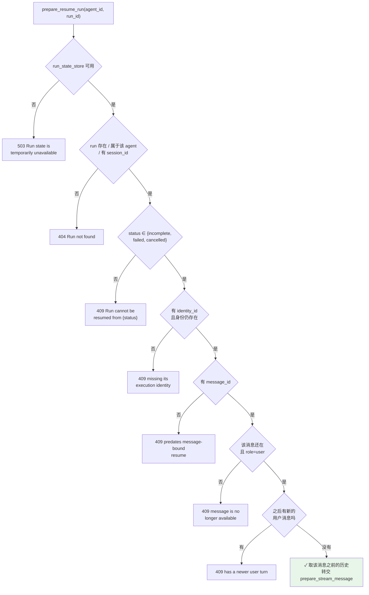

七道校验对应七种"不能安全续跑"的情况：

| # | 校验 | 状态码 | 为什么不能续 |
|---|---|---|---|
| 1 | run state 存储可用 | 503 | 基础设施暂时不可用，可重试 |
| 2 | run 存在且归属正确 | 404 | 不存在，或试图续别人的 run |
| 3 | 状态可续 | 409 | 已完成的 run 续跑会产生重复回复 |
| 4 | 有执行身份且身份仍存在 | 409 | 身份被删了，续跑会用错误的配置 |
| 5 | 有 `message_id` | 409 | **老数据**，无法确定该续哪条消息 |
| 6 | 该消息仍存在且是用户消息 | 409 | 消息被删了 |
| 7 | 之后没有新的用户消息 | 409 | **会话已经往前走了** |

第 5 条的错误文案很直白：`"Run predates message-bound resume and cannot be resumed safely"`。早期版本的 run 没有绑定具体消息，续跑时无法确定该重放哪一轮对话。宁可拒绝也不猜——猜错会把一段无关的回复插进会话中间。

第 7 条是最容易被忽略的：

```python
# A newer user turn after this run's message means the session moved past
# it; the check is bounded to the tail, which is all that can invalidate
# a resume.
after_rows = await self.session_repo.get_messages_since(
    state.session_id, state.message_id, limit=20
)
if any(row.get("role") == "user" for row in after_rows):
    raise HTTPException(409, "Run has a newer user turn ...")
```

假设一次 run 崩了，用户没等它恢复就又问了一个新问题。这时再去续跑那个旧 run，产出的回复会插在**一段已经完成的对话之后**，答非所问。

检查只看尾部 20 条（`limit=20`）——注释解释了为什么这样够：只有在目标消息**之后**出现的用户消息才能让续跑失效，而这些一定在尾部。全表扫描不会带来更多正确性，只会更慢。

### 4.8 陈旧输出何时才被丢弃

函数末尾那段注释是整个续跑设计的核心：

> This completes ownership and identity validation **synchronously, before any state is mutated**. The stale partial assistant output is discarded **only once the resumed stream actually produces a replacement reply** (see `_stream_message`'s finally), so **a failed resume never loses it**.

两个时序保证：

| | 时机 | 保证 |
|---|---|---|
| **校验** | 全部在改动任何状态之前 | 失败的续跑请求不留任何副作用 |
| **丢弃旧输出** | 直到新回复真的产出 | 续跑本身失败时，原来那半截回复还在 |

第二条尤其重要。朴素实现会在续跑开始时就删掉旧的部分回复（"反正要重新生成"），但如果续跑本身也失败了——模型不可用、又一次崩溃——用户就**同时失去了旧的半截回复和新的回复**，比不续跑还糟。

正确做法是把删除推迟到 `_stream_message` 的 `finally`，且只在确实产生了替代内容时执行。这让续跑成为一个**要么改进要么不变**的操作，永远不会让状态变差。

---

## 5. 自动任务：四道并发防线

`auto_task_service.py`（630 行）是这一层最复杂的部分。

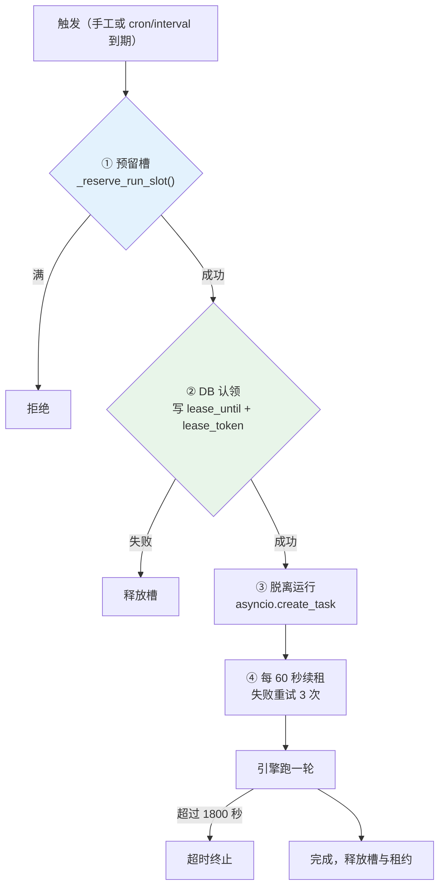

### 5.1 为什么要"预留槽"这一步

```python
# Reserved-but-not-yet-started slots.  start_auto_task checks len(_BACKGROUND_RUNS)
# against the cap and then awaits a DB claim before adding the task, so two
# concurrent triggers could both pass the check.  Reserving the slot BEFORE the
# first await closes that TOCTOU window.
_RESERVED_SLOTS = 0
```

**TOCTOU**（检查与使用之间的时间差）：检查 `len(_BACKGROUND_RUNS) < 4` 之后要 `await` 一次数据库认领，在那个 await 期间另一个触发也通过了检查。所以要在**第一个 await 之前**就把槽占住。

### 5.2 为什么 `_BACKGROUND_RUNS` 是模块级的

```python
# Module-scoped, not an instance attribute: AutoTaskService is rebuilt per HTTP
# request and per scheduler tick, so an instance would drop its strong reference
# and let the event loop garbage-collect a run that is still going.
_BACKGROUND_RUNS: set[asyncio.Task] = set()
```

`asyncio.Task` 只被弱引用持有，**丢掉强引用等于让一个正在跑的任务被 GC 掉**。而 `AutoTaskService` 每个 HTTP 请求都重建，所以实例属性活不过请求。

这是 asyncio 最经典的坑之一，注释把它写清楚了。

### 5.3 租约续期的重试

```python
_LEASE_RENEW_INTERVAL_SECONDS = 60
# Transient renewal errors (SQLITE_BUSY, connection hiccups) are retried before
# the lease is treated as lost; an immediately-cancelled healthy run would leave
# the task to be re-executed after expiry (double cost).
_LEASE_RENEW_RETRIES = 3
```

一次 `SQLITE_BUSY` 不该杀掉一个健康的运行——因为杀掉之后任务会在租约过期后**再跑一遍**，成本翻倍。

### 5.4 四个并发常量

| 常量 | 值 | 作用 |
|---|---|---|
| `_MAX_CONCURRENT_RUNS` | 4 | 同时脱离运行的上限 |
| `_TASK_EXECUTION_TIMEOUT_SECONDS` | 1800 | 单次运行的兜底超时 |
| `_LEASE_RENEW_INTERVAL_SECONDS` | 60 | 续租间隔 |
| `_LEASE_RENEW_RETRIES` | 3 | 续租重试 |

超时的注释说明它是**兜底**而不是主要机制：

> 单个 LLM 请求和工具调用有它们自己的超时；这个上限管住一个病态的多轮循环，让一个挂住的运行不能永远占着一个槽（和它的租约）。

### 5.5 错误文本要脱敏

```python
def _redact_error_text(exc: BaseException) -> str:
    """httpx/engine errors can echo the full request URL or provider response;
    strip the credential shapes the trace store redacts before the text is
    stored and later served to any authenticated caller."""
    return _redact_secrets_in_text(str(exc))[:500]
```

一个 httpx 异常可能把完整请求 URL（含 `?api_key=...`）回显出来，而这段文本会**落库并被后续 API 返回**。

### 5.6 关闭时不做额外记账

```python
async def cancel_background_runs() -> None:
    """A cancelled run leaves its task at status='running'; _reset_stuck_auto_tasks()
    in the schema migration resets exactly that on the next startup, so there is
    no extra bookkeeping to do here."""
```

**复用已有的启动恢复逻辑**，而不是在关闭路径上再写一遍状态清理。关闭路径是最容易被中断的地方，代码越少越好。

---

## 6. 调度器

`scheduler.py` 只有 53 行：

```python
TICK_INTERVAL = 60  # seconds

async def run_scheduler() -> None:
    while True:
        try:
            count = await run_scheduler_tick()
        except asyncio.CancelledError:
            raise                       # 取消要传播
        except Exception:
            log.exception(...)          # 其它异常吞掉，继续循环
        await asyncio.sleep(TICK_INTERVAL)
```

每个 tick 做两件事：

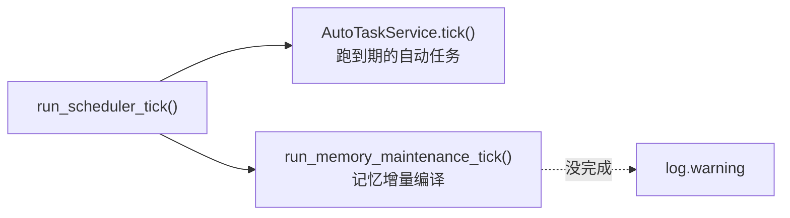

**记忆维护也挂在调度器上**，注释解释了为什么：

> Retry due memory maintenance **even when no new conversation arrives**.

否则用户一整天不对话，积压的证据就永远不会被编译。

`run_scheduler_tick()` 被单独拆出来的理由写在 docstring 里：**"split out for deterministic tests"**——测试可以调一次 tick 而不用跑无限循环。

异常处理的两个分支是标准的后台循环写法：`CancelledError` 必须传播（否则关不掉），其它异常必须吞掉（否则一次瞬时错误会杀死调度器）。

---

### 6.1 自带的 cron 解析器

`server/app/utils/cron.py`（167 行）不依赖任何第三方库。支持标准五字段：

```
minute hour day_of_month month day_of_week
  0-59  0-23     1-31     1-12      0-7
```

每个字段是逗号分隔的项，每项可以是 `*`、单值、`a-b` 范围，任一形式都能带 `/step`。月份接受 `JAN`-`DEC`，星期接受 `SUN`-`SAT`。

| 表达式 | 含义 |
|---|---|
| `*/5 * * * *` | 每 5 分钟 |
| `0 9 * * MON-FRI` | 工作日上午 9 点 |
| `0 0 1 JAN,JUL *` | 1 月和 7 月的 1 号午夜 |
| `30 2 * * 0` / `30 2 * * 7` | 周日凌晨 2:30（两种写法等价） |

### 6.2 三个经典的 cron 怪癖

**① 星期的上界是 7，不是 6。**

```python
# Upper bound 7, not 6: cron accepts both 0 and 7 for Sunday, and the range
# check added below would otherwise reject a legal "* * * * 7".
weekdays = _parse_field(parts[4], 0, 7, _WEEKDAY_NAMES)
```

传统 cron 里 `0` 和 `7` **都表示周日**。一个只允许 0-6 的实现会拒绝 `* * * * 7`——而这是完全合法且常见的写法。范围放到 0-7 之后，转换时用取模统一：

```python
py_weekdays = [(d - 1) % 7 for d in weekdays] if parts[4] != "*" else None
```

cron 的 0=周日，Python 的 `weekday()` 是 0=周一。`(0-1) % 7 == 6` 正好是 Python 的周日，`(7-1) % 7 == 6` 也是——两种写法自动归一。

**② day-of-month 与 day-of-week 是 OR 不是 AND。**

```python
if day_of_month_restricted and day_of_week_restricted:
    day_matches = day_of_month_matches or day_of_week_matches      # ← OR
else:
    day_matches = day_of_month_matches and day_of_week_matches
```

这是 cron 最反直觉的规则，来自 POSIX：**两个日期字段都不是 `*` 时，任一匹配就触发**。

```
0 0 1 * MON    →  每月 1 号，*以及*每个周一
```

而不是"每月 1 号且恰好是周一"。只有其中一个被限定时才是普通的 AND（另一个是 `*`，恒真，AND 也不影响结果）。

很多手写的 cron 实现会在这里写成 AND，表现是"设了 `0 0 1 * MON` 结果几个月才跑一次"。这段代码显式区分了 `day_of_month_restricted` 和 `day_of_week_restricted` 两个布尔量，正是为了实现这条规则。

**③ 单值带步长要报错，不能静默接受。**

```python
if slash:
    # Vixie cron reads "5/15" as "5-max/15". Accepting it here without that
    # meaning would silently drop the step and schedule a single value the
    # user did not ask for, so name the problem instead.
    raise ValueError(f"cron step needs a range or '*', not the single value {base!r}")
```

`5/15` 在 Vixie cron 里等价于 `5-59/15`（从 5 开始每 15 分钟）。本实现不支持这个扩展语义——但**关键是不能装作支持**。如果解析成"就是 5 分"，用户写的 `5/15` 会变成每小时只跑一次，而他期待的是每小时四次。少跑三次且毫无提示，比直接报错糟糕得多。

同样的取向贯穿整个模块，docstring 第一句就点明了：

> **Out-of-range values are rejected rather than silently never matching.**

一个 `70 * * * *`（分钟 70）如果不校验，会永远不匹配——任务再也不执行，且没有任何错误。宁可在保存时就拒绝。

### 6.3 为什么搜索上界是八年

```python
# A 5-field expression can legitimately wait across a skipped century leap
# year (for example, 29 February from 2096 to 2104), so cover the longest
# Gregorian leap-day gap while still bounding unsatisfiable expressions.
limit = after + timedelta(days=366 * 8)
```

必须有上界，否则一个永不满足的表达式（比如 `0 0 30 2 *`——2 月 30 日）会让搜索死循环。但上界定多少？

答案由格里高利历的一个特例决定：**能被 100 整除但不能被 400 整除的年份不是闰年**。2100 就不是闰年。所以 `0 0 29 2 *`（每年 2 月 29 日）从 2096 年之后，下一次是 **2104 年**——间隔八年，是可能出现的最长闰日间隔。

上界小于八年会让这个完全合法的表达式在某些年份报"找不到下次执行时间"。这是那种平时永远不会触发、但一旦触发就极难排查的 bug——注释把推导过程留下来，是为了让将来想"优化"这个常量的人先看到理由。

### 6.4 逐级跳过的搜索

朴素实现是从下一分钟开始逐分钟试，最坏情况要试八年 × 五十多万分钟。这里按字段从粗到细跳：

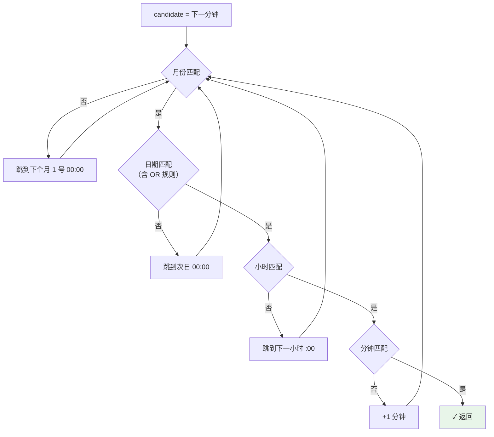

每次不匹配都把更细的字段归零后跳到下一个粗粒度单位。跳月那两行有个小技巧：

```python
candidate = candidate.replace(day=1, hour=0, minute=0) + timedelta(days=32)
candidate = candidate.replace(day=1, hour=0, minute=0)
```

先归到本月 1 号，加 32 天（保证跨过任何长度的月份），再归到 1 号。两步是因为"加一个月"在 `timedelta` 里没有直接表示——月份长度不固定。32 天是安全余量（最长的月份 31 天）。

搜索从 `after + 1 分钟` 开始，而不是 `after`：否则一个刚好在整点触发的任务会立刻返回当前时间，导致同一分钟内被反复调度。

### 6.5 `next_interval_time`：另一种触发

```python
def next_interval_time(seconds: int, after: datetime | None = None) -> datetime:
    if seconds <= 0:
        raise ValueError("Interval must be positive")
    return after + timedelta(seconds=seconds)
```

固定间隔触发，三行。它和 cron 的区别是**基准点**：cron 对齐到墙钟（`*/5` 总在 :00 :05 :10 触发），间隔则从上次执行时间往后推。前者适合"每天早上九点"，后者适合"每隔十分钟检查一次"——后者不会因为某次执行慢了而累积漂移。

`seconds <= 0` 直接拒绝：0 会导致立即重复触发的忙循环，负数则会让下次执行时间落在过去，被调度器当成"已到期"无限触发。

---

## 7. Service 层：13 个

| Service | 行数 | 职责 |
|---|---|---|
| `session_service` | 845 | 聊天与执行主入口、并发锁、上下文压缩 |
| `token_stats_service` | 684 | Token 统计、trace 导入、generation 落库 |
| `auto_task_service` | 630 | 自动任务生命周期与并发 |
| `config_service` | 555 | LLM 配置读写与校验 |
| `agent_service` | 263 | Agent 档案聚合门面 |
| `engine_runtime` | 196 | 引擎装配、LLM 客户端缓存、MCP 会话池 |
| `mcp_service` | 145 | MCP 服务器与工具查询 |
| `skill_service` | 114 | 技能列表与启停 |
| `project_instruction_service` | 111 | 项目指令模板 |
| `run_state_service` | 90 | 运行状态查询与恢复 |
| `observability_service` | 85 | 可观测数据查询 |
| `agent_profile_service` | 59 | 档案文件初始化 |
| `scheduler` | 53 | 后台调度循环 |

### 7.1 `agent_service` 是门面

31 个端点里有 20 多个都注入 `AgentService`。它把多个专门 service 聚合成一个，让路由层只依赖一个东西。

### 7.2 `config_service` 为什么有 555 行

因为配置写入要做的事很多：

- 校验字段名（用 `config_fields.py` 派生的集合）
- 校验类型（string / bool / positive_int / usage_name）
- 处理 `secret` 字段（写入但不回读）
- 处理 legacy 路由清理（`normalize_legacy_llm_config`）
- 原子写 YAML

**一个"改配置"的端点，一半代码在拒绝非法输入。**

### 7.3 `token_stats_service` 的两个数据源

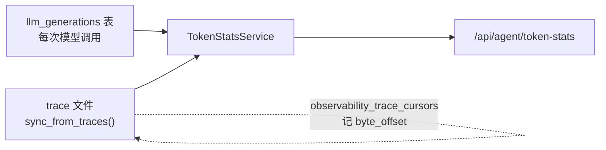

启动时 `sync_from_traces()` 把 trace 里的用量导进 `token_usage_events` 表，用 `observability_trace_cursors.byte_offset` 做增量。`source_key` 唯一索引保证幂等——同一条记录导两次不会翻倍。

---

### 7.4 `config_service`：一半代码在拒绝非法输入

555 行里有 **18 个 `_validate_*` / `_apply_*` 方法**。为什么一个"改配置"的端点要这么多？

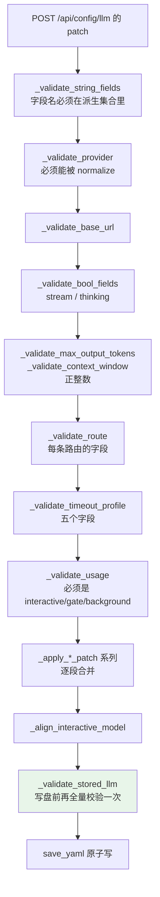

### 7.4.1 字段集合全部派生

```python
_USAGES = frozenset(usage.value for usage in LLMUsage)
_BASE_STRING_FIELDS = ROUTE_STRING_FIELDS
_ROUTE_STRING_FIELDS = ROUTE_STRING_FIELDS
_ROUTE_FIELDS = frozenset(ROUTE_FIELDS)
_PUBLIC_ROUTE_FIELDS = PUBLIC_ROUTE_FIELDS
_TIMEOUT_FIELDS = frozenset(("connect", "read", "stream_read", "write", "pool"))
```

**五个集合里有四个直接来自 `engine/llm/config_fields.py`**，只有超时字段是本地的。这就是那份"声明一次、四处派生"的设计在服务端的落点（见 [07 · LLM 集成](./07-LLM-集成.md) §2.2）。

`_PUBLIC_ROUTE_FIELDS` 用在读路径上——`_public_routes()` / `_public_models()` 按它投影，**`api_key` 自动被排除**，不需要调用方记得过滤。

### 7.4.2 写盘前再校验一次

`_validate_stored_llm()` 在 patch 应用完之后、写盘之前跑一遍**全量**校验。

为什么要两遍：patch 校验只看**这次改了什么**，但一次合法的 patch 可能和既有配置组合出一个非法状态（比如 patch 给某条路由设了一个 `timeout_profile`，而那个 profile 已经被删了）。

**"每个改动都合法"不等于"结果合法"。**

### 7.4.3 `list_relay_models` 的响应体上限

```python
_MAX_RELAY_BODY_BYTES = 5 * 1024 * 1024
```

`/api/config/llm/models` 会去打中转站的 `/v1/models`。**5 MB 上限**防的是一个返回巨大响应的中转站把服务端内存吃光。

实测提醒：**中转站列出的模型不等于能用**（见 [07 · LLM 集成](./07-LLM-集成.md) §12）。这个端点只做发现，不做可用性验证。

### 7.4.4 `_align_interactive_model`

改基线 `model` 时，`interactive` 路由如果显式写了一个旧值就会覆盖掉新基线——用户会觉得"我改了模型但没生效"。这个方法处理这类对齐。

---

### 7.5 `token_stats_service`：684 行做什么

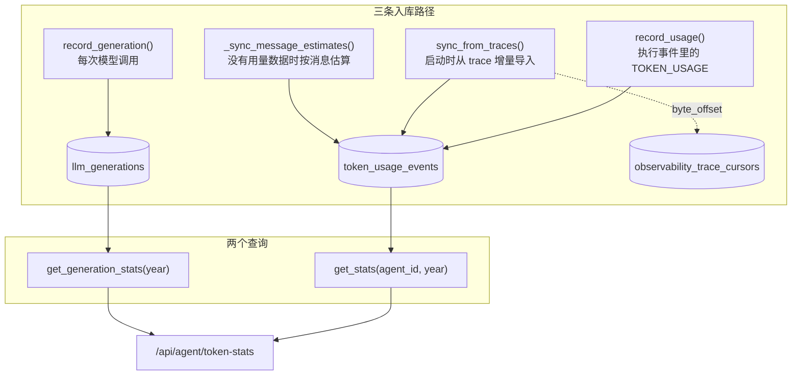

### 7.5.1 `local-estimate`：没有用量数据时的兜底

```python
_NON_MODEL_STAT_KEYS = frozenset({"unknown", "local-estimate"})
```

不是所有 provider 都返回用量。`_sync_message_estimates()` 用 `tiktoken` 对消息内容做本地估算，记在 `model="local-estimate"` 下。

**这两个键在按模型分组统计时被排除**——否则"local-estimate"会作为一个虚构的模型出现在成本报表里。

这又是"区分数据来源"的一个实例：估算值有用（总量还能看），但不能和真实计量混在一起。

### 7.5.2 成本计算

```python
@staticmethod
def _load_price_table() -> dict[str, dict[str, float]]: ...
def _generation_cost(...) -> ...
```

按模型的价格表算成本。价格表是本地的——**没有联网查价格**，因为价格表联网就意味着终端要在启动时打外网。

### 7.5.3 连续活跃天数

```python
@staticmethod
def _streaks(active_dates: list[date]) -> tuple[int, int]:
```

返回（当前连续天数，历史最长连续天数）。这是 `/token` 面板的一个展示项——它不是成本指标，是**使用习惯指标**。

### 7.5.4 幂等导入

`sync_from_traces()` 用两个机制保证重复运行不翻倍：

| 机制 | 作用 |
|---|---|
| `observability_trace_cursors.byte_offset` | 只读新增的字节 |
| `token_usage_events.source_key` 唯一索引 | 同一条记录插两次会被拒 |

**游标是性能优化，唯一索引是正确性保证。** 只有游标的话，一次游标写失败就会导致重复计数。

---

## 8. 仓库层

只有 3 个：

| 仓库 | 表 |
|---|---|
| `session_repo` | `sessions`、`messages` |
| `agent_profile_repo` | `agent_profiles` |
| `auto_task_repo` | `auto_tasks`、`auto_task_runs` |

其余三张表（`token_usage_events`、`observability_trace_cursors`、`llm_generations`）由 `token_stats_service` 直接操作——因为它们只有一个消费方，加一层仓库是纯开销。

**不为只有一个消费方的表建仓库**，这是一个务实的取舍。

### 8.1 `session_repo`：19 个方法里的两组

`SessionRepo` 有 19 个方法，其中两组值得看：

**① 所有权在方法名里。**

```python
async def exists(self, session_id: str, agent_id: str) -> bool
async def get_owned(self, session_id: str, agent_id: str) -> dict | None
async def delete_owned(self, session_id: str, agent_id: str) -> bool
async def exists_by_id(self, session_id: str) -> bool          # ← 不带 agent_id
```

**`_owned` 后缀表示"这个查询带 `agent_id` 条件"**。这不是命名洁癖——把所有权检查编码进方法名，让"忘了校验归属"变成一个能在 review 里被看见的错误（调用了不带 `_owned` 的版本）。

`exists_by_id` 是唯一不带所有权的，用在确实不需要归属的场景。

**② 六个消息查询方法。**

```python
async def get_recent_messages(session_id, limit)      # 给引擎的短期上下文
async def get_messages(session_id, ...)               # 分页列表
async def count_messages(session_id, ...)
async def get_message(session_id, message_id)
async def get_messages_since(session_id, ...)
async def get_messages_before(session_id, ...)
```

`since` / `before` 两个方向都有，因为**压缩要向前取**（`_COMPRESS_BYTE_CAP` 边取边算字节），**恢复要向后取**。

**③ `discard_assistant_messages_after_user`。**

用在中断恢复：一次运行被打断后，那条用户消息之后的助手消息是半成品，重跑前要丢掉。**否则重跑会在一段残缺回复的基础上继续写。**

### 8.2 `auto_task_repo`：租约的三个方法

```python
async def claim_running(self, task_id: str) -> str | None      # 认领，返回 lease_token
async def renew_lease(self, task_id: str, lease_token: str) -> bool
async def finish_task(self, ...)
```

`claim_running()` 返回 `str | None`——**`None` 表示没抢到**（别的进程先认领了）。这个返回值就是分布式锁的获取结果。

`renew_lease(task_id, lease_token)` 要求带上 token：**只有持有当前租约的那个进程才能续期**。一个已经被抢走的任务续期会返回 `False`，执行方据此知道自己该退出了。

`list_due_tasks()` 是调度器每 60 秒调的那个查询。

`_row_to_dict` 是唯一的静态方法——把 `aiosqlite.Row` 转成普通 dict，避免 Row 对象泄漏到 service 层。

---

## 9. 启动与关闭

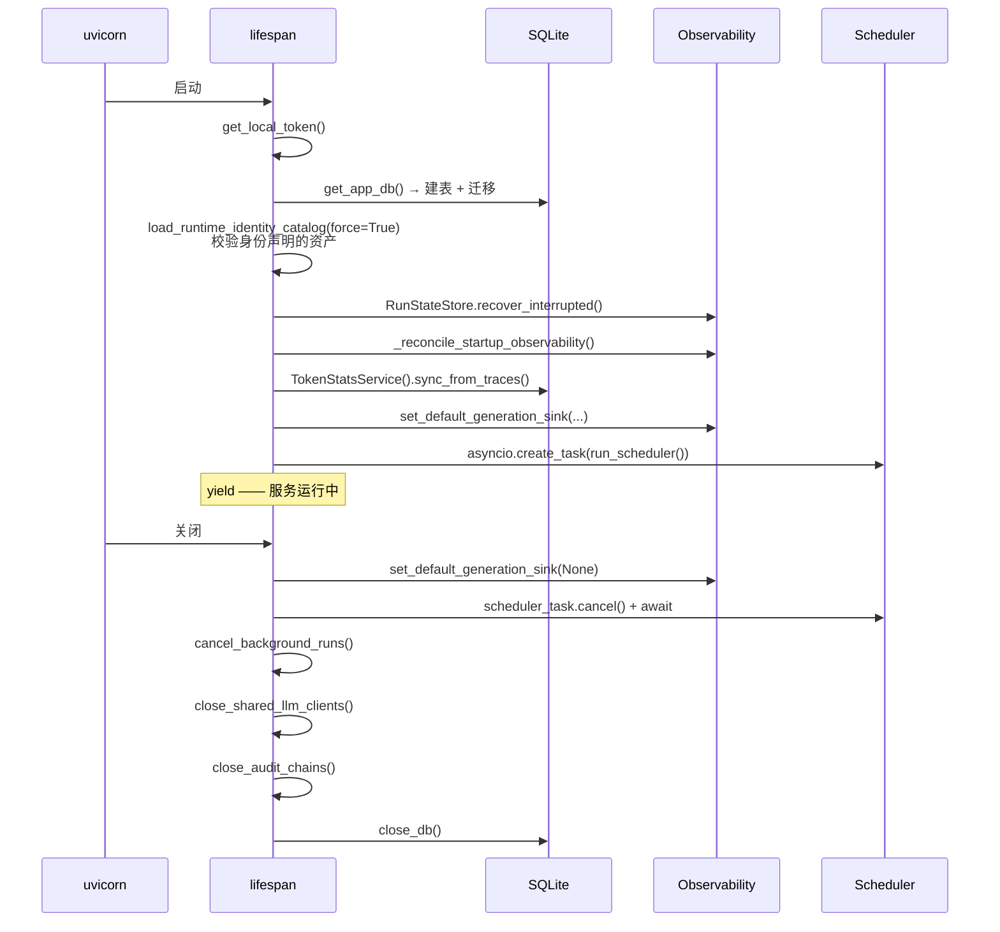

关闭顺序的依赖链（见 [03 · 架构总览](./03-架构总览.md) §8.1）：**运行中的任务 → 它们用的客户端 → 审计链头 → 数据库连接**。

启动时的 `_reconcile_startup_observability()` 处理"崩在写 trace 之后、写 summary 之前"这个窗口——这是 [03 · 架构总览](./03-架构总览.md) §9.2 讲过的。

---

### 9.1 关闭顺序不能改

`lifespan` 的关闭段有六步，**每一步的位置都由依赖关系决定**：

```python
set_default_generation_sink(None)        # ① 先摘掉用量记录 sink
scheduler_task.cancel()                  # ② 停调度器
await scheduler_task                     # ③ 等它真的停（吞 CancelledError）
await cancel_background_runs()           # ④ 排空脱离的后台 run
await close_shared_llm_clients()         # ⑤ 关 LLM 客户端
close_audit_chains()                     # ⑥ 封存审计链
await close_db()                         # ⑦ 关数据库
```

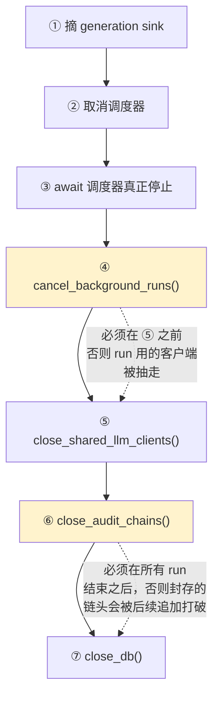

两处注释直接写出了顺序约束：

**④ 必须在 ⑤ 之前。**

```python
# Detached auto-task runs outlive the request and the tick that started them,
# so drain them before the LLM clients they are still using go away.
```

自动任务的 run 是**脱离式**的——启动它的 HTTP 请求早就返回了，触发它的调度 tick 也早就结束了，但 run 本身还在跑。如果先关 LLM 客户端，这些还活着的 run 下一次调用模型时会拿到一个已关闭的 httpx client，报出一堆和真实原因无关的错误。

**⑥ 的位置是唯一定义良好的边界。**

```python
# Anchor the audit chain head at the only boundary where it is well
# defined: no run is still appending to the install-wide log.  A rollback
# of the sealed log is then detectable on the next verification.
```

审计链的封存（`seal()`）要记下"此刻的链头是谁"。这个断言只有在**没有任何 run 还在往日志里追加**的时候才成立——所以必须排在 ④ 之后。如果提前封存，之后又有 run 追加了几条，下次校验会看到链长过锚点，报成回滚（见 [13 · Common 基础设施](./13-Common-基础设施.md) §6.10 的误报问题）。

`await scheduler_task` 那里显式吞掉 `CancelledError`：

```python
scheduler_task.cancel()
try:
    await scheduler_task
except asyncio.CancelledError:
    pass
```

`cancel()` 只是**请求**取消，任务可能还在 `await` 中间。必须 `await` 它才能确保真的停了——而 `await` 一个被取消的任务会抛 `CancelledError`，这是预期行为，不是错误。少了这个 `await`，关闭流程会在调度器还在跑的时候继续往下走，可能出现"调度器启动了一个新 run，而 LLM 客户端正在被关闭"的竞态。

### 9.2 启动的两处 best-effort

启动段有两步失败了也继续：

```python
try:
    state_store = RunStateStore(...)
    recovered = state_store.recover_interrupted()
    _reconcile_startup_observability(state_store, recovered_run_ids=recovered)
except (RunStateError, OSError):
    logger.warning("failed to recover interrupted runs during startup", exc_info=True)

try:
    await TokenStatsService().sync_from_traces()
except Exception:
    logger.warning("failed to sync token statistics during startup", exc_info=True)
```

| 步骤 | 失败了会怎样 | 为什么不阻断启动 |
|---|---|---|
| 恢复中断的 run | 那些 run 保持"运行中"状态，不可续跑 | 是**历史数据**的问题，不该让新会话也用不了 |
| 同步 token 统计 | 统计数字暂时不准 | 纯观测数据，不影响任何功能 |

而前面三步（本地令牌、数据库、身份目录）**没有** try——它们失败了服务就该起不来。这条分界很清楚：**功能依赖必须成功，历史数据修复和观测可以失败**。

注意两个 `except` 的宽度不同：恢复用 `(RunStateError, OSError)`（预期内的失败），统计用 `Exception`（更宽）。这和 [10 · 可观测性与诊断](./10-可观测性与诊断.md) §2.2 的纪律一致——越是"纯观测"的东西，捕获得越宽，因为它绝不该影响主流程。

### 9.3 CORS 只放行本地

```python
app.add_middleware(
    CORSMiddleware,
    allow_origin_regex=r"^https?://(localhost|127\.0\.0\.1)(:\d+)?$",
    allow_methods=["GET", "POST", "PUT", "PATCH", "DELETE", "OPTIONS"],
    allow_headers=["Authorization", "Content-Type", "Accept"],
)
```

用 `allow_origin_regex` 而不是 `allow_origins=["*"]`，正则把来源限定为 `localhost` 或 `127.0.0.1`，端口任意。这是 local-first 定位的直接体现：服务只服务本机，一个网页（哪怕用户被诱导打开）无法从别的域发起跨源请求。

正则里三个细节：`^` 和 `$` 锚定两端（不加的话 `evil-localhost.com` 会匹配）、`127\.0\.0\.1` 的点做了转义（不转义时 `.` 匹配任意字符，`127x0x0x1` 也能过）、端口部分 `(:\d+)?` 可选。

`allow_headers` 只列了三个必需的——`Authorization` 用于本地令牌鉴权（见 §3），另两个是常规内容协商。不用 `["*"]` 是同样的收紧思路。

---

## 10. `/api/health` 的两个字段

```python
return {
    "status": "ok",
    "version": "0.2.0",
    "started_at": _STARTED_AT,
    "stale": _running_stale_code(),
    "nonce": os.environ.get("SMITH_SERVER_NONCE") or None,
}
```

注释把两个非显然字段的用途讲清楚了：

> 两个独立的启动器关注点，都是必需的：`stale` 告诉一个 shell 它的 server 正在跑比工作树更旧的代码，`nonce` 回显启动器提供的值，这样一个 shell 能把自己的进程和一个赢得同一个端口的外来进程区分开。缺失（手工启动的 server）→ null，启动器视为"不是我的"。

### 10.1 `stale` 解决的是什么问题

docstring 描述了一个很具体的开发体验问题：

> uvicorn imports each module once; editing the file afterwards changes nothing until a restart. A shell that only probes the API shape **cannot see that** — every route still exists — so **a fix could sit on disk for hours while the running server kept serving the code it started with**.

改了代码但没重启，服务器还在跑旧版本。这件事**从外部完全看不出来**：

- 所有路由都在
- 版本号没变（它是硬编码的）
- 请求都正常返回

于是你改了一行代码，反复测试，反复看到旧行为，怀疑自己的修改没生效、怀疑逻辑写错了——真正的原因只是进程没重启。`stale` 字段把这个不可见的状态变成一个布尔值。

实现是比对**已加载模块**的文件 mtime 与进程启动时间：

```python
for module in list(sys.modules.values()):
    path = getattr(module, "__file__", None)
    if not path or not path.startswith(_REPO_ROOT):
        continue
    if _VENDORED.search(path):
        continue
    if os.path.getmtime(path) > _STARTED_AT:
        return True
```

只看 `sys.modules` 里已导入的——docstring 说 "which is exactly the code in memory"。没被导入的文件改了也不影响当前进程行为，不该报 stale。

### 10.2 为什么要排除 vendored 路径

```python
_VENDORED = re.compile(r"[/\\](?:\.venv|site-packages|node_modules)[/\\]")
```

```python
# The virtualenv lives inside the repo, so a prefix match alone counts
# every third-party package as our own source: `uv sync` touching a
# dependency would then read as "the working tree moved on", and the
# shell would abandon a perfectly current server.
```

这是个真实踩过的坑。虚拟环境 `.venv/` 就在仓库目录**里面**，所以 `path.startswith(_REPO_ROOT)` 会把每一个第三方包都算成"我们自己的源码"。

后果：跑一次 `uv sync`（哪怕只是重新安装了一个依赖），几百个 site-packages 文件的 mtime 被更新 → `stale` 变成 `true` → shell 判定"服务器在跑旧代码"→ **杀掉一个完全正确的服务器并重启**。用户看到的是"每次 uv sync 之后 shell 都要重启一遍后端"，而完全不知道为什么。

正则同时匹配 `/` 和 `\`（`[/\\]`）以兼容 Windows 路径，且两端都要有分隔符——避免一个叫 `my-node_modules-helper.py` 的文件被误伤。

`OSError` 被静默跳过：

```python
except OSError:
    # A deleted or unreadable module file says nothing about staleness.
    continue
```

文件被删或读不了，说明不了任何关于"代码是否陈旧"的事情。当成"不陈旧"处理是保守的选择——误报 stale 会导致不必要的重启，比漏报代价更大。

### 10.3 `nonce` 解决的是端口竞争

`stale` 和 `nonce` 是**两个独立的问题**，注释强调 "both required"。

nonce 处理的是启动竞争：shell 启动后端时会设一个环境变量 `SMITH_SERVER_NONCE`，服务器把它回显在 health 响应里。

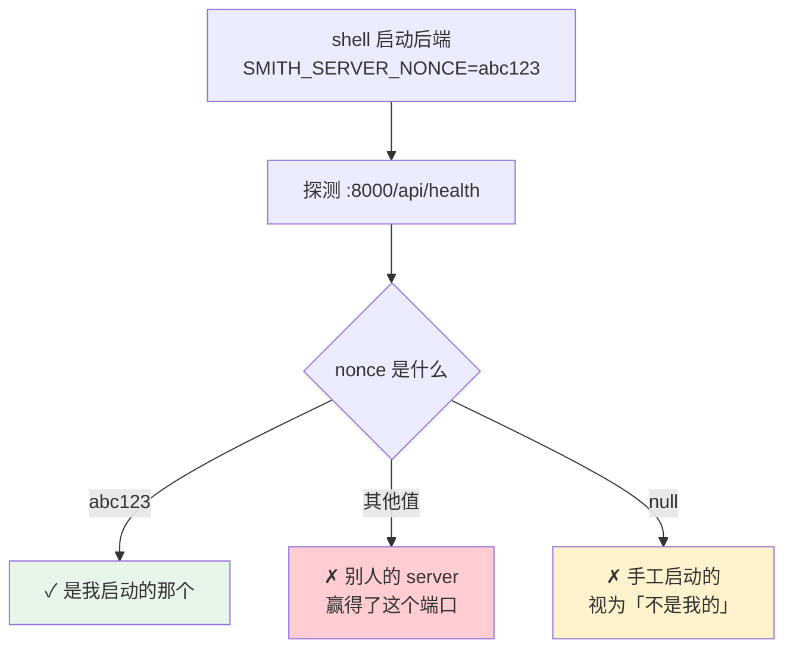

为什么需要它：两个 shell 同时启动，都想占 8000 端口，只有一个能成功。失败的那个如果只检查"端口上有没有服务在响应"，会误以为是自己启动成功了，然后把生命周期管理（包括退出时关闭）绑到一个**别人的进程**上。

`or None` 那一段让手工启动的服务器（没设环境变量）返回 `null` 而不是空字符串——启动器把 `null` 当成"不是我的"，于是不会去管理一个用户自己起的服务器。这个默认方向是对的：**宁可不管，也不要误杀用户手动启动的进程**。

---

### 10.4 端点计数的口径

§2 的全表列了 34 个路由端点，加 `/api/health` 共 35 个。这个数字值得说明口径，因为旧文档里写的是 52。

计数标准是 `server/app/routers/` 下的 `@router.<method>` 装饰器数量：

```bash
grep -rhoE '@router\.(get|post|put|patch|delete)' server/app/routers/*.py | wc -l
# → 34
```

`/api/health` 定义在 `main.py` 上（`@app.get`）而不是 router 里，所以单独算。旧文档的 52 大概率是把 schema 里的模型数、或者路由与其 HTTP 方法变体重复计入了——这正是 `CLAUDE.md` 那条"按消费方的判据计数，不要按目录列表计数"的由来。同一条纪律在技能计数（按 `SKILL.md` 而非目录数）和工具计数（按 `TOOL_META` + `execute` 而非 `.py` 文件数）上同样适用。

---

## 11. 参数速查

| 参数 | 值 | 位置 |
|---|---|---|
| 路由端点 | 34（agent 31 + config 3） | `routers/` |
| 免鉴权端点 | 1（`/api/health`） | `main.py` |
| Token 长度 | `token_urlsafe(32)` | `auth.py` |
| Token 文件权限 | `0o600` | `auth.py` |
| CORS 允许来源 | localhost / 127.0.0.1 | `main.py` |
| 会话锁表上限 | 64 | `session_service.py` |
| 历史消息上限 | 40 | `session_service.py` |
| 压缩条数上限 | 50 000 | `session_service.py` |
| 压缩字节上限 | 20 MB | `session_service.py` |
| 并发自动任务 | 4 | `auto_task_service.py` |
| 自动任务超时 | 1800 秒 | `auto_task_service.py` |
| 租约续期间隔 | 60 秒 | `auto_task_service.py` |
| 租约续期重试 | 3 | `auto_task_service.py` |
| 错误文本上限 | 500 字符 | `auto_task_service.py` |
| 调度器 tick | 60 秒 | `scheduler.py` |
| interval 最小值 | 60 秒 | `schemas/auto_task.py` |
| `max_retries` 上限 | 10 | `schemas/auto_task.py` |
| SQLite 表 | 8 | `infrastructure/schema.py` |
| 仓库 | 3 | `infrastructure/repositories/` |
| Service | 13 | `services/` |

---

## 12. 设计取舍

**① 路由极薄。** 31 个端点 278 行。所有逻辑在 service，所以换一个前端协议（比如 WebSocket）不需要重写业务。

**② 不为单消费方的表建仓库。** 三张表直接在 service 里操作。少一层间接，代价是这三张表的 SQL 散在 service 里。

**③ 并发控制全部用 asyncio 原语 + SQLite 列。** 没有 Redis、没有 Celery。四个并发常量（4/1800/60/3）就是全部的并发模型。

**④ 每一处并发都有注释解释竞态。** 会话锁的引用计数、自动任务的槽预留、`_BACKGROUND_RUNS` 的模块级作用域——三处都写清了"不这么做会发生什么"。

**⑤ 关闭路径复用启动恢复。** 取消的运行留在 `running` 状态，下次启动的 `_reset_stuck_auto_tasks()` 收拾。**关闭路径最容易被中断，代码越少越好。**

**⑥ 错误文本落库前脱敏。** 因为它会被 API 返回给任何已鉴权的调用方。

---

## 12.1 这一层反复出现的五条手法

`server/` 6 100 行里，同样的处理方式在不同 service 之间重复出现。它们构成了这一层的"默认写法"：

**① 校验全部在改状态之前，且同步完成。** `prepare_resume_run` 的七道校验、`prepare_stream_message` 在返回生成器前校验、配置写盘前再校验一次（§7.4.2）。理由是共同的：**一旦开始产生副作用（写库、开 SSE 流、启动 run），就没有干净的回退路径了**。HTTP 的错误码只在响应头发出去之前有意义。

**② 失败路径不能让状态变差。** 续跑失败保留旧回复（§4.8）、拒绝旧 run 时不删后来的对话、预留的并发槽在启动取消时归还。一个操作要么改进状态要么保持不变，**不存在"试了一半"的中间态**。§13.1 的五个测试全都在守这条。

**③ 归属校验放在仓库层而非路由层。** `get_owned` / `_owned` 后缀的方法（§8.1）让每一条数据访问路径都必须带上 `agent_id`。路由层的检查会被新增端点绕过，仓库层的则是必经之地。这是把安全约束放在**收敛点**而不是**入口点**。

**④ 非法输入在最早的边界拒绝。** cron 表达式在保存时校验（§6.2），而不是等调度器发现它永不触发；配置字段在写盘前校验（§7.4），而不是等加载时报错。**越晚发现，症状离原因越远**——一个永不执行的定时任务，用户会以为是调度器坏了。

**⑤ 后台任务要有超时、租约和归还。** 自动任务的四道防线（§5）——并发上限、槽位预留、租约续期、超时释放——针对的是同一件事：**没有请求生命周期兜底的代码**。一个卡住的 HTTP 请求最终会被客户端断开，而一个脱离的后台 run 不会，必须自己管理自己的边界。

第⑤条也解释了 §9.1 那个关闭顺序：脱离的 run 比启动它的一切都活得久，所以关闭时要专门排空它们。

这五条里，①②在 [12 · MCP 集成](./12-MCP-集成.md) 的连接池同样成立（先建后拆、失败不缓存），④⑤是这一层特有的——因为只有它同时面对外部请求和长时后台任务。

### 12.2 改这一层之前先问三个问题

**① 这个改动会不会在 SSE 流打开之后才发现错误？** 流一旦开始，客户端已经在读，返回不了 HTTP 错误码了。任何新增的校验都要放进 `prepare_*` 系列函数里，而不是流的生成器内部。`prepare_stream_message_validates_before_returning_a_generator` 这个测试就是为此存在的。

**② 这个改动会不会让失败路径留下半成品？** 尤其注意提前删除、提前写库、提前占用资源。判断标准很简单：**如果这一步之后的任何一步失败，用户的状态会不会比操作前更糟？** 会的话就要推迟这一步，或者补上回滚。

**③ 这个改动涉及后台任务吗？** 是的话，四件事一个都不能少：并发上限、超时、失败记账、关闭时排空。少任何一个，症状都是"偶尔有任务卡住/丢失/重复"——最难复现也最难排查的一类问题。

三个问题分别对应 §4.7、§4.8、§5 三节，也对应 `test_session_service.py`（31 个）和 `test_auto_task_service.py`（19 个）这两个最大的测试文件。改动落地前把这两个文件跑绿是最低要求。

还有一条不在问题清单里但同样要守：**路由层不要长胖**。`server/app/routers/` 的职责只有三件——取参数、调 service、返回结果。一旦开始出现条件分支、数据组装或跨 service 的编排，那段逻辑就该下沉到 service 层。理由不是洁癖：路由函数是唯一无法被复用的一层（它绑定在 HTTP 方法和路径上），逻辑留在那里意味着自动任务、续跑、CLI 这些非 HTTP 入口都用不到它，只能各自复制一份。§13.2 里那些自动任务测试之所以能直接调 service，正是因为逻辑没有卡在路由里。反过来说，一个只能通过 HTTP 客户端测试的功能，往往说明它的逻辑放错了层——测试写起来别扭通常是分层出了问题的第一个信号，而不是测试工具不好用。

---

## 13. 测试锁住了什么

`server/tests/` **220 个测试**，分布很能说明这一层的风险在哪：

| 文件 | 数量 | 覆盖 |
|---|---|---|
| `test_common_infrastructure.py` | 38 | 见 [13 · Common 基础设施](./13-Common-基础设施.md) §10 |
| `test_session_service.py` | 31 | 会话、流式、续跑 |
| `test_config_service.py` | 24 | 配置校验 |
| `test_auto_task_service.py` | 19 | 自动任务并发 |
| `test_config_loader.py` | 18 | 五层配置合并 |
| `test_token_stats_service.py` / `test_auto_task_repo.py` / `test_agent_router.py` | 各 9 | 用量、租约、路由 |
| `test_cron.py` / `test_auth.py` | 各 7 | cron 解析、鉴权 |
| 其余 14 个文件 | 40 | 各 service 与端到端冒烟 |

**并发与租约占了最大比重**——19 + 9 个测试围绕自动任务，因为这是唯一一处"请求返回后代码还在跑"的地方。

### 13.1 续跑：五个测试钉住"不丢数据"

§4.8 说续跑是"要么改进要么不变"的操作，这五个测试从五个角度确认：

| 测试 | 验证 |
|---|---|
| `resume_run_reuses_session_scope_and_discards_partial_reply` | 成功续跑**才**丢弃旧的半截回复 |
| **`resume_that_fails_before_text_preserves_the_partial_reply`** | 续跑在产出文本前就失败 → **旧回复还在** |
| **`resume_that_retracts_everything_preserves_the_partial_reply`** | 续跑产出后又全部撤回 → **旧回复还在** |
| `resume_run_rejects_an_older_run_without_deleting_later_turns` | 拒绝旧 run 时**不删除**后来的对话（§4.7 第 7 条） |
| `prepare_resume_rejects_a_retired_identity_without_discarding_partial_reply` | 身份失效时拒绝，且不丢旧回复（§4.7 第 4 条） |

三个测试名里都带 "preserves the partial reply" / "without discarding"——这不是重复，是把"失败路径不能有副作用"这条性质在三种不同的失败时点上分别钉死。任何一次重构如果把删除操作提前，都会至少打红其中一个。

`prepare_stream_message_validates_before_returning_a_generator` 则守着 §4.7 开头那条：**校验必须在返回生成器之前完成**。生成器一旦返回，SSE 就开了，没法再给出干净的 HTTP 错误码。

### 13.2 自动任务：并发防线的逐条验证

| 测试 | 对应 §5 的哪一道 |
|---|---|
| **`concurrent_starts_respect_the_cap_without_a_toctou_window`** | 预留槽（§5.1）——名字直接点出防的是 TOCTOU |
| `reserved_slots_drain_when_starts_are_cancelled` | 预留的槽在启动被取消时要归还 |
| `manual_trigger_respects_the_concurrency_cap` | 手动触发也受并发上限约束 |
| `auto_task_renews_its_lease_while_the_engine_is_running` | 租约续期（§5.3） |
| **`completed_run_is_recorded_completed_when_the_lease_is_lost`** | **租约丢了也要正确记账** |
| `failed_run_is_recorded_before_the_lease_is_released` | 记账在释放租约**之前** |
| `completed_run_survives_a_finish_task_exception` | 收尾抛异常不能让结果丢失 |
| `hung_engine_run_times_out_and_releases_the_slot` | 卡死的 run 要超时并归还槽位 |
| `trigger_returns_while_the_engine_turn_is_still_running` | 触发立即返回，不等 run 结束 |
| `scheduler_tick_starts_due_tasks_without_waiting_for_them` | 调度 tick 不阻塞在任务上 |

中间三条构成一组"记账不能丢"的保证：租约丢失、收尾异常、失败路径——三种情况下运行结果都必须被正确写下。这是因为自动任务是**无人值守**的，一次没记上的失败可能几天都没人发现。

调度相关的两条：

| 测试 | 行为 |
|---|---|
| **`success_schedules_next_run_from_completion_not_start`** | 下次执行从**完成时刻**算，不是开始时刻 |
| `schedule_edited_mid_run_takes_effect_on_completion` | 运行中改了调度，完成时才生效 |

第一条避免了一个漂移问题：如果从开始时刻算，一个执行时间超过间隔的任务会立刻触发下一次，最终排队堆积。从完成时刻算保证两次执行之间至少间隔一个周期。

`auto_task_writes_reject_a_trigger_the_scheduler_can_never_fire` 则把 §6.2 的 cron 校验和写入路径连了起来——一个永远不会触发的表达式在**保存时**就被拒绝，而不是保存成功后任务再也不执行。

### 13.3 鉴权与所有权

`test_auth.py` 7 个测试覆盖 §3 的本地令牌机制。所有权检查则散布在各 service 测试里，命名有统一模式：

- `list_messages_rejects_a_session_not_owned_by_the_agent`
- `auto_task_mutations_reject_a_task_owned_by_another_agent`

对应 §8.1 那组 `_owned` 后缀的仓库方法——**每一个跨 agent 的读写都要过一次归属校验**，而不是只在路由层查一次。这是纵深防御：路由层的检查可能被新加的端点绕过，仓库层的 `get_owned` 则是所有路径的必经之地。

### 13.4 冒烟与回归

`test_e2e_smoke.py` 只有 1 个测试，但它跑通一条完整链路：建 agent → 建会话 → 发消息 → 收 SSE → 查历史。数量上不起眼，作用是**捕获集成层面的断裂**——各单元测试都过但拼起来不工作的情况。这类断裂通常出在契约的两侧各自演进：service 改了返回结构、路由还按旧字段取值，两边的单元测试都用各自的假数据，谁也发现不了。冒烟测试用真实的组装路径跑一遍，是唯一能捕获这种"各自都对、拼起来错"的手段。它跑得慢、覆盖窄，但覆盖的恰好是单元测试结构性看不到的那一层。

`test_health_nonce.py` 3 个测试守着 §10.3 的端口竞争识别，`test_scheduler.py` 1 个守着调度器主循环，`test_session_schema.py` / `test_schema_identity.py` 各 1 个守着数据库 schema 与身份表的结构约束。

---

## 14. 接下来

| 想深入 | 读 |
|---|---|
| 可观测的 7 个端点返回什么 | [10 · 可观测性与诊断](./10-可观测性与诊断.md) |
| 引擎怎么被装配 | [03 · 架构总览](./03-架构总览.md) §2 |
| Shell 怎么消费这些端点 | [11 · Shell 终端 UI](./11-Shell-终端UI.md) |
| 配置校验的字段派生 | [07 · LLM 集成](./07-LLM-集成.md) §2.2 |
| cron 语法与租约 | [02 · 快速上手](./02-快速上手.md) §13 |
