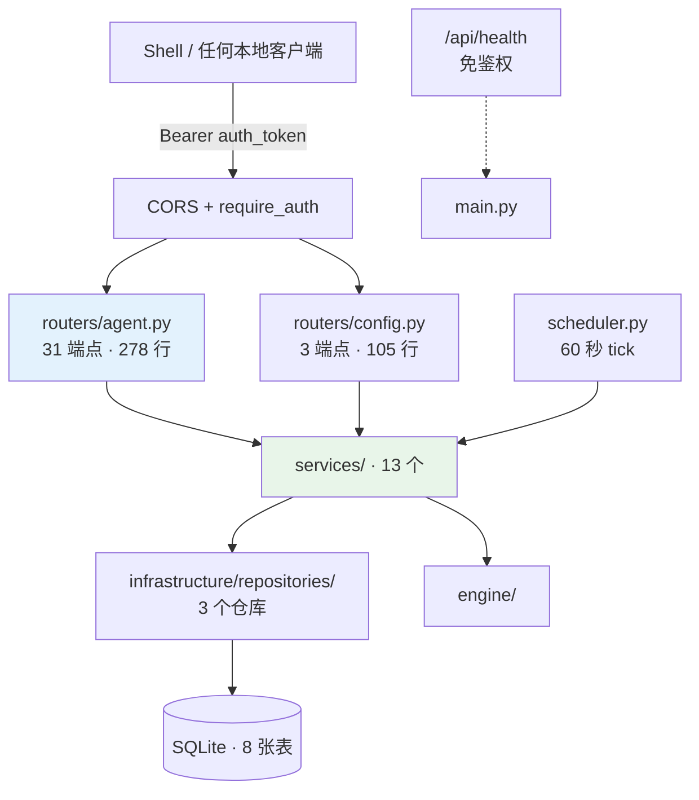
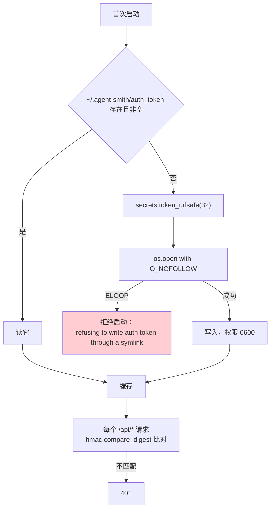
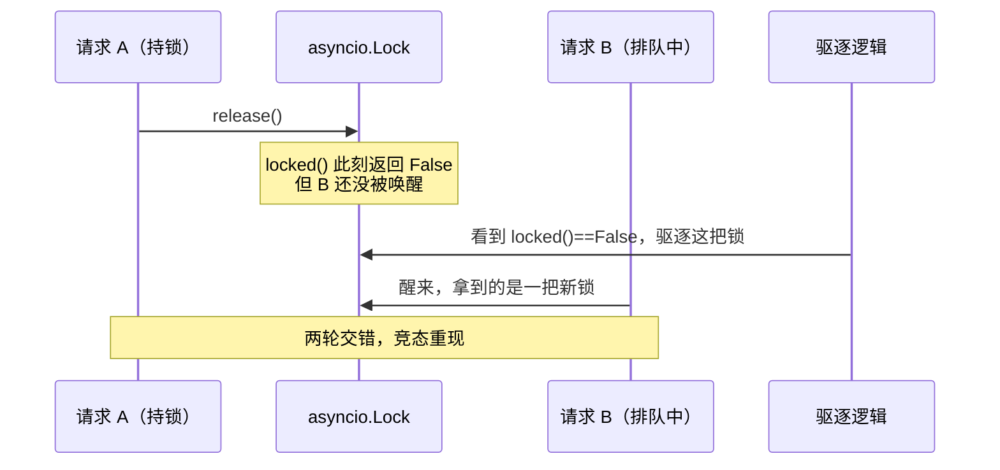
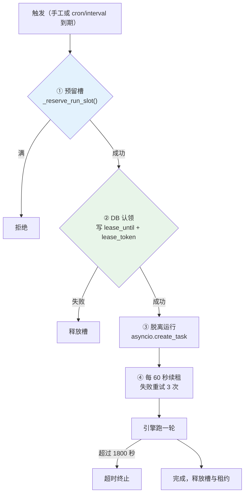
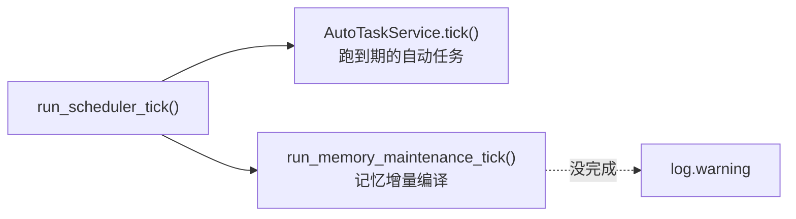
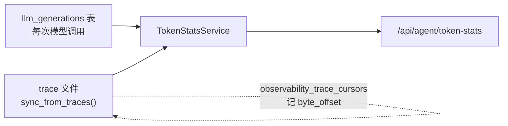
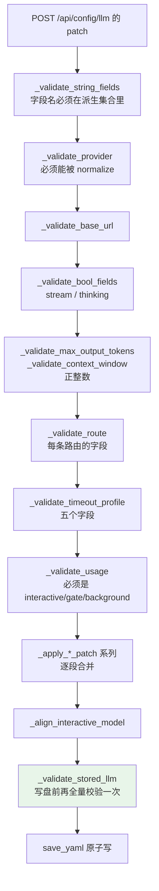
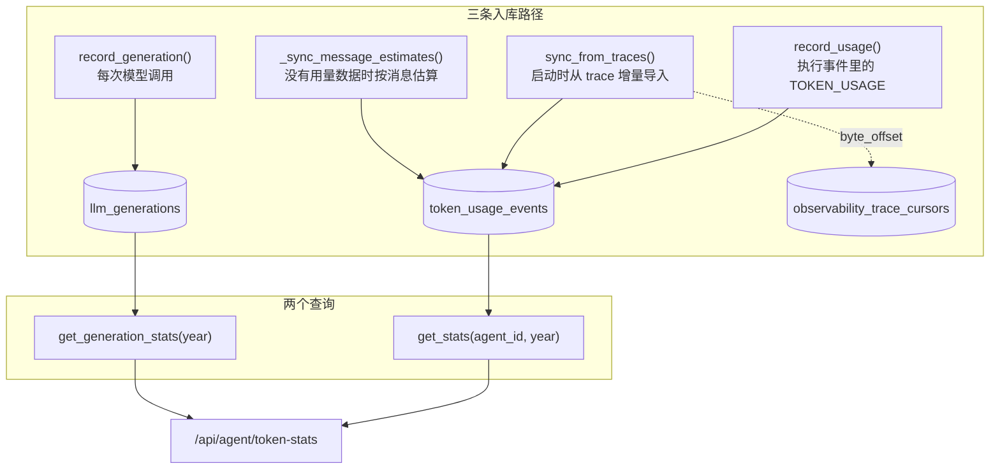
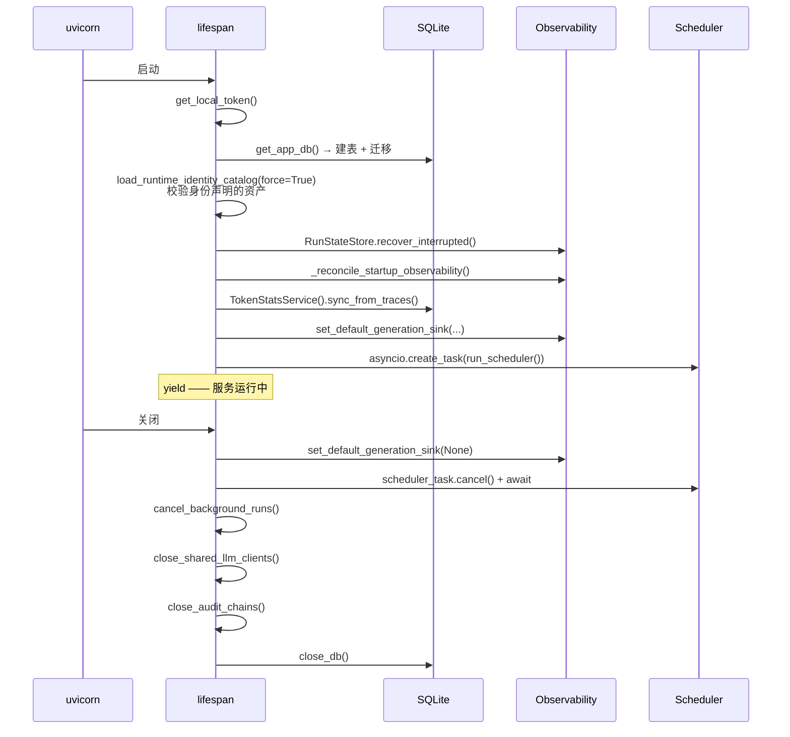

# 09 · Server API 层

> **定位**：`server/` 6.1k 行——34 个路由端点 + `/api/health`、13 个 service、并发控制、自动任务调度器、本地鉴权。
> **适合**：要加端点的人；想理解"一个 6k 行的后端怎么撑起完整 Agent 生命周期"的人。

---

## 1. 分层



**路由极薄**：31 个端点 278 行，平均每个端点 9 行——取参、调 service、返回。所有逻辑在 service 层。

---

## 2. 端点全表

### 2.1 Agent 档案（2）

| 方法 | 路径 | 作用 |
|---|---|---|
| GET | `/api/agent` | 取 Agent 档案 |
| POST | `/api/agent/ensure` | 幂等创建档案（201） |

### 2.2 会话（7）

| 方法 | 路径 | 作用 |
|---|---|---|
| GET | `/api/agent/sessions` | 会话列表 |
| POST | `/api/agent/sessions` | 建会话（201） |
| PATCH | `/api/agent/sessions/{id}/model` | 切换模型档案 |
| POST | `/api/agent/sessions/{id}/compress` | 压缩并持久化上下文 |
| DELETE | `/api/agent/sessions/{id}` | 删会话（204） |
| GET | `/api/agent/sessions/{id}/messages` | 消息列表 |
| **POST** | **`/api/agent/sessions/{id}/messages/stream`** | **主入口：SSE 事件流** |

### 2.3 技能 / MCP / 项目指令（4）

| 方法 | 路径 | 作用 |
|---|---|---|
| GET | `/api/agent/skills` | 技能列表 |
| PUT | `/api/agent/skills/{name}` | 启停某个技能 |
| GET | `/api/agent/mcp` | MCP 服务器与工具 |
| PUT | `/api/agent/project-instructions` | 生成项目 `.smith/SMITH.md` 模板 |

### 2.4 记忆与用量（2）

| 方法 | 路径 | 作用 |
|---|---|---|
| GET | `/api/agent/memory/status` | 记忆维护状态 |
| GET | `/api/agent/token-stats` | Token 用量看板 |

### 2.5 可观测（7）

| 方法 | 路径 | 作用 |
|---|---|---|
| GET | `/api/agent/observability/runs` | 运行列表 |
| GET | `/api/agent/observability/runs/{id}` | 运行摘要 |
| GET | `/api/agent/observability/runs/{id}/trace` | 逐事件 trace |
| GET | `/api/agent/observability/incidents` | 事故列表 |
| GET | `/api/agent/observability/health` | Agent 健康度 |
| GET | `/api/agent/observability/runs/{id}/diagnosis` | 失败诊断 |
| GET | `/api/agent/observability/runs/{id}/improvement-proposal` | 改进建议 |

### 2.6 运行控制（3）

| 方法 | 路径 | 作用 |
|---|---|---|
| GET | `/api/agent/runs/{id}` | 运行状态 |
| POST | `/api/agent/runs/{id}/resume` | 恢复被中断的运行 |
| POST | `/api/agent/runs/{id}/approval` | **提交审批结果** |

### 2.7 自动任务（6）

| 方法 | 路径 | 作用 |
|---|---|---|
| GET | `/api/agent/auto-tasks` | 任务列表 |
| POST | `/api/agent/auto-tasks` | 建任务（201） |
| PUT | `/api/agent/auto-tasks/{id}` | 改任务 |
| POST | `/api/agent/auto-tasks/{id}/trigger` | 手工触发（**202 Accepted**） |
| DELETE | `/api/agent/auto-tasks/{id}` | 删任务（204） |
| GET | `/api/agent/auto-tasks/{id}/runs` | 运行记录 |

**`trigger` 返回 202 而不是 200**——因为它启动一个脱离的后台运行，不等结果。

### 2.8 配置（3）+ 健康（1）

| 方法 | 路径 | 作用 |
|---|---|---|
| GET | `/api/config/llm` | 读配置（**不含 `api_key`**） |
| GET | `/api/config/llm/models` | 发现可用模型 |
| POST | `/api/config/llm` | 写配置 |
| GET | `/api/health` | **免鉴权**，返回 `status` / `version` / `started_at` / `stale` / `nonce` |

---

## 3. 鉴权

`server/app/infrastructure/auth.py` 只有 83 行，但每一处都有安全考量。



三个细节：

**① `O_NOFOLLOW`。**

```python
# O_NOFOLLOW: a pre-planted symlink at the token path must not be truncated
# or overwritten through, which would let a local attacker clobber an
# arbitrary file. Refuse to start instead.
```

一个预先埋好的软链会让"写 token"变成"覆盖任意文件"。捕获 `ELOOP` 后**拒绝启动**而不是绕过。

**② `hmac.compare_digest` 而不是 `==`。**

常数时间比较，防时序攻击。本地场景下威胁不高，但成本为零。

**③ `/api/health` 免鉴权。**

因为 Shell 要在拿到 token 之前先探测服务是否活着。它返回的字段（版本、启动时间、stale、nonce）都不敏感。

CORS 只允许本地：

```python
allow_origin_regex=r"^https?://(localhost|127\.0\.0\.1)(:\d+)?$"
```

---

## 4. 会话并发：一把带引用计数的锁

`session_service.py` 里 40 行的锁管理，注释密度极高，因为它修过一个真实的竞态。

### 4.1 问题

一个会话同时来两个请求，两边都要"读历史 → 插入用户消息"。不加锁的话两轮会交错，得到错乱的历史。

### 4.2 为什么不能用 `Lock.locked()` 做驱逐

```python
# Eviction is refcounted, NOT keyed on asyncio.Lock.locked(): locked() reports
# False in the window between release() and a queued waiter's wake-up, so
# evicting on it could drop a lock that a waiter is about to acquire and let two
# turns interleave the exact history-read/insert window this serializes.
```



正确做法是**引用计数**：一个调用方（持锁者或排队者）从 `acquire()` 之前就算 in-use，直到 `release()` 之后；只有零用户的条目才能驱逐。

### 4.3 锁的边界

```python
"""Held only for the history-read + user-insert window, never across the
streaming generator, so an abandoned stream cannot deadlock a session."""
```

**锁只覆盖"读历史 + 插消息"这个窗口，不覆盖整个流式生成器。** 否则一个用户关掉终端留下的僵尸流会永久锁死这个会话。

### 4.4 有界的锁表

```python
_SESSION_STREAM_LOCKS_MAX = 64
```

超过 64 个时驱逐零用户的条目。**一个被遗弃（永不删除）的会话不能永远泄漏一把锁。**

### 4.5 三个上下文预算

```python
_HISTORY_LIMIT = 40
_COMPRESS_MESSAGE_CAP = 50_000
_COMPRESS_BYTE_CAP = 20_000_000
```

`_HISTORY_LIMIT = 40` 的注释解释了为什么不是 10：

> 每轮只存**可见的回复文本**——工具调用、文件读取和命令输出永远不会进入下一轮——所以即使一轮跑了几十个工具，在这里也只花一条短消息。**取 10（5 个来回）时，一个工作中的会话在活还没干完之前就看不见自己最初的问题了。**

两个 compress 上限一个管条数一个管字节：

> 字节预算：一旦对话内容超过这个值就停止取数，这样一个巨大的会话不会被整个缓冲进内存再发给摘要器。

---

## 5. 自动任务：四道并发防线

`auto_task_service.py`（630 行）是这一层最复杂的部分。



### 5.1 为什么要"预留槽"这一步

```python
# Reserved-but-not-yet-started slots.  start_auto_task checks len(_BACKGROUND_RUNS)
# against the cap and then awaits a DB claim before adding the task, so two
# concurrent triggers could both pass the check.  Reserving the slot BEFORE the
# first await closes that TOCTOU window.
_RESERVED_SLOTS = 0
```

**TOCTOU**（检查与使用之间的时间差）：检查 `len(_BACKGROUND_RUNS) < 4` 之后要 `await` 一次数据库认领，在那个 await 期间另一个触发也通过了检查。所以要在**第一个 await 之前**就把槽占住。

### 5.2 为什么 `_BACKGROUND_RUNS` 是模块级的

```python
# Module-scoped, not an instance attribute: AutoTaskService is rebuilt per HTTP
# request and per scheduler tick, so an instance would drop its strong reference
# and let the event loop garbage-collect a run that is still going.
_BACKGROUND_RUNS: set[asyncio.Task] = set()
```

`asyncio.Task` 只被弱引用持有，**丢掉强引用等于让一个正在跑的任务被 GC 掉**。而 `AutoTaskService` 每个 HTTP 请求都重建，所以实例属性活不过请求。

这是 asyncio 最经典的坑之一，注释把它写清楚了。

### 5.3 租约续期的重试

```python
_LEASE_RENEW_INTERVAL_SECONDS = 60
# Transient renewal errors (SQLITE_BUSY, connection hiccups) are retried before
# the lease is treated as lost; an immediately-cancelled healthy run would leave
# the task to be re-executed after expiry (double cost).
_LEASE_RENEW_RETRIES = 3
```

一次 `SQLITE_BUSY` 不该杀掉一个健康的运行——因为杀掉之后任务会在租约过期后**再跑一遍**，成本翻倍。

### 5.4 四个并发常量

| 常量 | 值 | 作用 |
|---|---|---|
| `_MAX_CONCURRENT_RUNS` | 4 | 同时脱离运行的上限 |
| `_TASK_EXECUTION_TIMEOUT_SECONDS` | 1800 | 单次运行的兜底超时 |
| `_LEASE_RENEW_INTERVAL_SECONDS` | 60 | 续租间隔 |
| `_LEASE_RENEW_RETRIES` | 3 | 续租重试 |

超时的注释说明它是**兜底**而不是主要机制：

> 单个 LLM 请求和工具调用有它们自己的超时；这个上限管住一个病态的多轮循环，让一个挂住的运行不能永远占着一个槽（和它的租约）。

### 5.5 错误文本要脱敏

```python
def _redact_error_text(exc: BaseException) -> str:
    """httpx/engine errors can echo the full request URL or provider response;
    strip the credential shapes the trace store redacts before the text is
    stored and later served to any authenticated caller."""
    return _redact_secrets_in_text(str(exc))[:500]
```

一个 httpx 异常可能把完整请求 URL（含 `?api_key=...`）回显出来，而这段文本会**落库并被后续 API 返回**。

### 5.6 关闭时不做额外记账

```python
async def cancel_background_runs() -> None:
    """A cancelled run leaves its task at status='running'; _reset_stuck_auto_tasks()
    in the schema migration resets exactly that on the next startup, so there is
    no extra bookkeeping to do here."""
```

**复用已有的启动恢复逻辑**，而不是在关闭路径上再写一遍状态清理。关闭路径是最容易被中断的地方，代码越少越好。

---

## 6. 调度器

`scheduler.py` 只有 53 行：

```python
TICK_INTERVAL = 60  # seconds

async def run_scheduler() -> None:
    while True:
        try:
            count = await run_scheduler_tick()
        except asyncio.CancelledError:
            raise                       # 取消要传播
        except Exception:
            log.exception(...)          # 其它异常吞掉，继续循环
        await asyncio.sleep(TICK_INTERVAL)
```

每个 tick 做两件事：



**记忆维护也挂在调度器上**，注释解释了为什么：

> Retry due memory maintenance **even when no new conversation arrives**.

否则用户一整天不对话，积压的证据就永远不会被编译。

`run_scheduler_tick()` 被单独拆出来的理由写在 docstring 里：**"split out for deterministic tests"**——测试可以调一次 tick 而不用跑无限循环。

异常处理的两个分支是标准的后台循环写法：`CancelledError` 必须传播（否则关不掉），其它异常必须吞掉（否则一次瞬时错误会杀死调度器）。

---

## 7. Service 层：13 个

| Service | 行数 | 职责 |
|---|---|---|
| `session_service` | 845 | 聊天与执行主入口、并发锁、上下文压缩 |
| `token_stats_service` | 684 | Token 统计、trace 导入、generation 落库 |
| `auto_task_service` | 630 | 自动任务生命周期与并发 |
| `config_service` | 555 | LLM 配置读写与校验 |
| `agent_service` | 263 | Agent 档案聚合门面 |
| `engine_runtime` | 196 | 引擎装配、LLM 客户端缓存、MCP 会话池 |
| `mcp_service` | 145 | MCP 服务器与工具查询 |
| `skill_service` | 114 | 技能列表与启停 |
| `project_instruction_service` | 111 | 项目指令模板 |
| `run_state_service` | 90 | 运行状态查询与恢复 |
| `observability_service` | 85 | 可观测数据查询 |
| `agent_profile_service` | 59 | 档案文件初始化 |
| `scheduler` | 53 | 后台调度循环 |

### 7.1 `agent_service` 是门面

31 个端点里有 20 多个都注入 `AgentService`。它把多个专门 service 聚合成一个，让路由层只依赖一个东西。

### 7.2 `config_service` 为什么有 555 行

因为配置写入要做的事很多：

- 校验字段名（用 `config_fields.py` 派生的集合）
- 校验类型（string / bool / positive_int / usage_name）
- 处理 `secret` 字段（写入但不回读）
- 处理 legacy 路由清理（`normalize_legacy_llm_config`）
- 原子写 YAML

**一个"改配置"的端点，一半代码在拒绝非法输入。**

### 7.3 `token_stats_service` 的两个数据源



启动时 `sync_from_traces()` 把 trace 里的用量导进 `token_usage_events` 表，用 `observability_trace_cursors.byte_offset` 做增量。`source_key` 唯一索引保证幂等——同一条记录导两次不会翻倍。

---

## 7.4 `config_service`：一半代码在拒绝非法输入

555 行里有 **18 个 `_validate_*` / `_apply_*` 方法**。为什么一个"改配置"的端点要这么多？



### 7.4.1 字段集合全部派生

```python
_USAGES = frozenset(usage.value for usage in LLMUsage)
_BASE_STRING_FIELDS = ROUTE_STRING_FIELDS
_ROUTE_STRING_FIELDS = ROUTE_STRING_FIELDS
_ROUTE_FIELDS = frozenset(ROUTE_FIELDS)
_PUBLIC_ROUTE_FIELDS = PUBLIC_ROUTE_FIELDS
_TIMEOUT_FIELDS = frozenset(("connect", "read", "stream_read", "write", "pool"))
```

**五个集合里有四个直接来自 `engine/llm/config_fields.py`**，只有超时字段是本地的。这就是那份"声明一次、四处派生"的设计在服务端的落点（见 [07 · LLM 集成](./07-LLM-集成.md) §2.2）。

`_PUBLIC_ROUTE_FIELDS` 用在读路径上——`_public_routes()` / `_public_models()` 按它投影，**`api_key` 自动被排除**，不需要调用方记得过滤。

### 7.4.2 写盘前再校验一次

`_validate_stored_llm()` 在 patch 应用完之后、写盘之前跑一遍**全量**校验。

为什么要两遍：patch 校验只看**这次改了什么**，但一次合法的 patch 可能和既有配置组合出一个非法状态（比如 patch 给某条路由设了一个 `timeout_profile`，而那个 profile 已经被删了）。

**"每个改动都合法"不等于"结果合法"。**

### 7.4.3 `list_relay_models` 的响应体上限

```python
_MAX_RELAY_BODY_BYTES = 5 * 1024 * 1024
```

`/api/config/llm/models` 会去打中转站的 `/v1/models`。**5 MB 上限**防的是一个返回巨大响应的中转站把服务端内存吃光。

实测提醒：**中转站列出的模型不等于能用**（见 [07 · LLM 集成](./07-LLM-集成.md) §12）。这个端点只做发现，不做可用性验证。

### 7.4.4 `_align_interactive_model`

改基线 `model` 时，`interactive` 路由如果显式写了一个旧值就会覆盖掉新基线——用户会觉得"我改了模型但没生效"。这个方法处理这类对齐。

---

## 7.5 `token_stats_service`：684 行做什么



### 7.5.1 `local-estimate`：没有用量数据时的兜底

```python
_NON_MODEL_STAT_KEYS = frozenset({"unknown", "local-estimate"})
```

不是所有 provider 都返回用量。`_sync_message_estimates()` 用 `tiktoken` 对消息内容做本地估算，记在 `model="local-estimate"` 下。

**这两个键在按模型分组统计时被排除**——否则"local-estimate"会作为一个虚构的模型出现在成本报表里。

这又是"区分数据来源"的一个实例：估算值有用（总量还能看），但不能和真实计量混在一起。

### 7.5.2 成本计算

```python
@staticmethod
def _load_price_table() -> dict[str, dict[str, float]]: ...
def _generation_cost(...) -> ...
```

按模型的价格表算成本。价格表是本地的——**没有联网查价格**，因为价格表联网就意味着终端要在启动时打外网。

### 7.5.3 连续活跃天数

```python
@staticmethod
def _streaks(active_dates: list[date]) -> tuple[int, int]:
```

返回（当前连续天数，历史最长连续天数）。这是 `/token` 面板的一个展示项——它不是成本指标，是**使用习惯指标**。

### 7.5.4 幂等导入

`sync_from_traces()` 用两个机制保证重复运行不翻倍：

| 机制 | 作用 |
|---|---|
| `observability_trace_cursors.byte_offset` | 只读新增的字节 |
| `token_usage_events.source_key` 唯一索引 | 同一条记录插两次会被拒 |

**游标是性能优化，唯一索引是正确性保证。** 只有游标的话，一次游标写失败就会导致重复计数。

---

## 8. 仓库层

只有 3 个：

| 仓库 | 表 |
|---|---|
| `session_repo` | `sessions`、`messages` |
| `agent_profile_repo` | `agent_profiles` |
| `auto_task_repo` | `auto_tasks`、`auto_task_runs` |

其余三张表（`token_usage_events`、`observability_trace_cursors`、`llm_generations`）由 `token_stats_service` 直接操作——因为它们只有一个消费方，加一层仓库是纯开销。

**不为只有一个消费方的表建仓库**，这是一个务实的取舍。

### 8.1 `session_repo`：19 个方法里的两组

`SessionRepo` 有 19 个方法，其中两组值得看：

**① 所有权在方法名里。**

```python
async def exists(self, session_id: str, agent_id: str) -> bool
async def get_owned(self, session_id: str, agent_id: str) -> dict | None
async def delete_owned(self, session_id: str, agent_id: str) -> bool
async def exists_by_id(self, session_id: str) -> bool          # ← 不带 agent_id
```

**`_owned` 后缀表示"这个查询带 `agent_id` 条件"**。这不是命名洁癖——把所有权检查编码进方法名，让"忘了校验归属"变成一个能在 review 里被看见的错误（调用了不带 `_owned` 的版本）。

`exists_by_id` 是唯一不带所有权的，用在确实不需要归属的场景。

**② 六个消息查询方法。**

```python
async def get_recent_messages(session_id, limit)      # 给引擎的短期上下文
async def get_messages(session_id, ...)               # 分页列表
async def count_messages(session_id, ...)
async def get_message(session_id, message_id)
async def get_messages_since(session_id, ...)
async def get_messages_before(session_id, ...)
```

`since` / `before` 两个方向都有，因为**压缩要向前取**（`_COMPRESS_BYTE_CAP` 边取边算字节），**恢复要向后取**。

**③ `discard_assistant_messages_after_user`。**

用在中断恢复：一次运行被打断后，那条用户消息之后的助手消息是半成品，重跑前要丢掉。**否则重跑会在一段残缺回复的基础上继续写。**

### 8.2 `auto_task_repo`：租约的三个方法

```python
async def claim_running(self, task_id: str) -> str | None      # 认领，返回 lease_token
async def renew_lease(self, task_id: str, lease_token: str) -> bool
async def finish_task(self, ...)
```

`claim_running()` 返回 `str | None`——**`None` 表示没抢到**（别的进程先认领了）。这个返回值就是分布式锁的获取结果。

`renew_lease(task_id, lease_token)` 要求带上 token：**只有持有当前租约的那个进程才能续期**。一个已经被抢走的任务续期会返回 `False`，执行方据此知道自己该退出了。

`list_due_tasks()` 是调度器每 60 秒调的那个查询。

`_row_to_dict` 是唯一的静态方法——把 `aiosqlite.Row` 转成普通 dict，避免 Row 对象泄漏到 service 层。

---

## 9. 启动与关闭



关闭顺序的依赖链（见 [03 · 架构总览](./03-架构总览.md) §8.1）：**运行中的任务 → 它们用的客户端 → 审计链头 → 数据库连接**。

启动时的 `_reconcile_startup_observability()` 处理"崩在写 trace 之后、写 summary 之前"这个窗口——这是 [03 · 架构总览](./03-架构总览.md) §9.2 讲过的。

---

## 10. `/api/health` 的两个字段

```python
return {
    "status": "ok",
    "version": "0.2.0",
    "started_at": _STARTED_AT,
    "stale": _running_stale_code(),
    "nonce": os.environ.get("SMITH_SERVER_NONCE") or None,
}
```

注释把两个非显然字段的用途讲清楚了：

> 两个独立的启动器关注点，都是必需的：`stale` 告诉一个 shell 它的 server 正在跑比工作树更旧的代码，`nonce` 回显启动器提供的值，这样一个 shell 能把自己的进程和一个赢得同一个端口的外来进程区分开。缺失（手工启动的 server）→ null，启动器视为"不是我的"。

`_running_stale_code()` 的实现细节见 [02 · 快速上手](./02-快速上手.md) §6.3。

---

## 11. 参数速查

| 参数 | 值 | 位置 |
|---|---|---|
| 路由端点 | 34（agent 31 + config 3） | `routers/` |
| 免鉴权端点 | 1（`/api/health`） | `main.py` |
| Token 长度 | `token_urlsafe(32)` | `auth.py` |
| Token 文件权限 | `0o600` | `auth.py` |
| CORS 允许来源 | localhost / 127.0.0.1 | `main.py` |
| 会话锁表上限 | 64 | `session_service.py` |
| 历史消息上限 | 40 | `session_service.py` |
| 压缩条数上限 | 50 000 | `session_service.py` |
| 压缩字节上限 | 20 MB | `session_service.py` |
| 并发自动任务 | 4 | `auto_task_service.py` |
| 自动任务超时 | 1800 秒 | `auto_task_service.py` |
| 租约续期间隔 | 60 秒 | `auto_task_service.py` |
| 租约续期重试 | 3 | `auto_task_service.py` |
| 错误文本上限 | 500 字符 | `auto_task_service.py` |
| 调度器 tick | 60 秒 | `scheduler.py` |
| interval 最小值 | 60 秒 | `schemas/auto_task.py` |
| `max_retries` 上限 | 10 | `schemas/auto_task.py` |
| SQLite 表 | 8 | `infrastructure/schema.py` |
| 仓库 | 3 | `infrastructure/repositories/` |
| Service | 13 | `services/` |

---

## 12. 设计取舍

**① 路由极薄。** 31 个端点 278 行。所有逻辑在 service，所以换一个前端协议（比如 WebSocket）不需要重写业务。

**② 不为单消费方的表建仓库。** 三张表直接在 service 里操作。少一层间接，代价是这三张表的 SQL 散在 service 里。

**③ 并发控制全部用 asyncio 原语 + SQLite 列。** 没有 Redis、没有 Celery。四个并发常量（4/1800/60/3）就是全部的并发模型。

**④ 每一处并发都有注释解释竞态。** 会话锁的引用计数、自动任务的槽预留、`_BACKGROUND_RUNS` 的模块级作用域——三处都写清了"不这么做会发生什么"。

**⑤ 关闭路径复用启动恢复。** 取消的运行留在 `running` 状态，下次启动的 `_reset_stuck_auto_tasks()` 收拾。**关闭路径最容易被中断，代码越少越好。**

**⑥ 错误文本落库前脱敏。** 因为它会被 API 返回给任何已鉴权的调用方。

---

## 13. 接下来

| 想深入 | 读 |
|---|---|
| 可观测的 7 个端点返回什么 | [10 · 可观测性与诊断](./10-可观测性与诊断.md) |
| 引擎怎么被装配 | [03 · 架构总览](./03-架构总览.md) §2 |
| Shell 怎么消费这些端点 | [11 · Shell 终端 UI](./11-Shell-终端UI.md) |
| 配置校验的字段派生 | [07 · LLM 集成](./07-LLM-集成.md) §2.2 |
| cron 语法与租约 | [02 · 快速上手](./02-快速上手.md) §13 |
