# 10 · 可观测性与诊断

> **定位**：`engine/observability/` 2.1k 行——一次运行留下什么档案、怎么防篡改、怎么脱敏、怎么自动分类事故、怎么算健康度、怎么产出改进建议。
> **适合**：想知道"Agent 昨天为什么失败"怎么查的人；想抄这套运行档案设计的人。

这个模块比 `engine/tool/`（1527 行）还大。**可观测性在这里不是"加个日志"，是一等公民。**

---

## 1. 全景

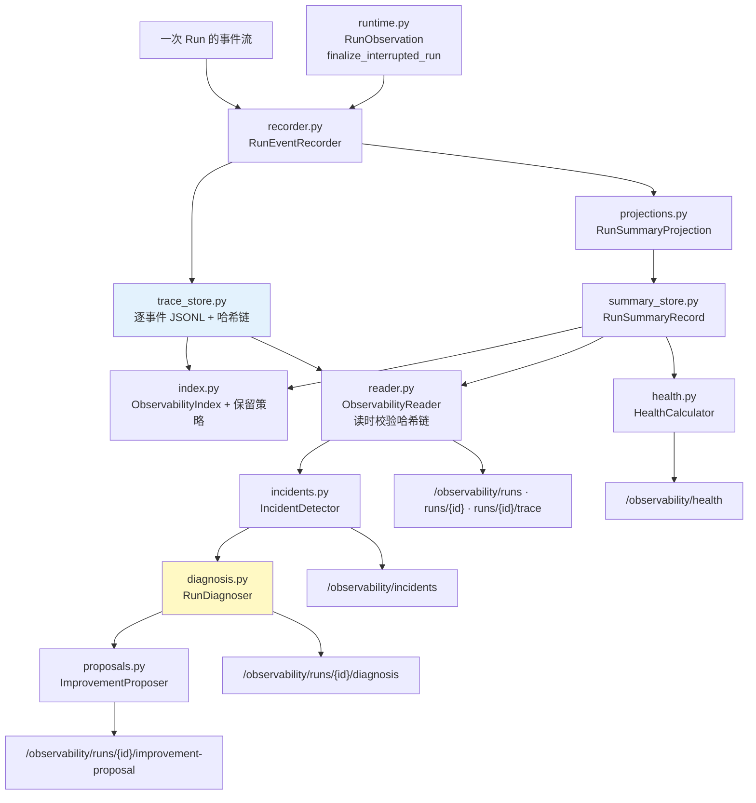

三条主线：

| 主线 | 模块 | 回答的问题 |
|---|---|---|
| **记录** | recorder / trace_store / projections / summary_store | 发生了什么 |
| **分析** | incidents / diagnosis / proposals | 为什么失败，该怎么改 |
| **聚合** | health / index | 整体状况如何，存多久 |

---

## 2. 记录：两条并行的通道

一次 run 同时产出**逐事件 trace** 和**聚合 summary**。

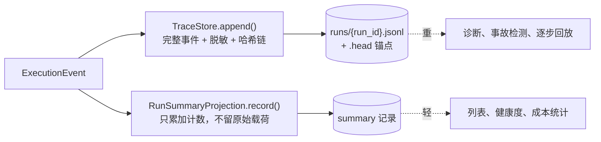

**为什么要两份**：列出最近 50 次运行时不该去读 50 个 trace 文件。summary 是**为查询优化的投影**，trace 是**为诊断保留的原始记录**。

`RunSummaryProjection` 的 docstring 点明了它的边界：

> Project events into a stable summary **without retaining raw payloads**.

它只累加计数：

| 字段 | 来源 |
|---|---|
| `event_count` / `event_counts` | 每种事件类型各多少个 |
| `tool_call_count` | `TOOL_CALL_START` 计数 |
| `backtrack_count` | `BACKTRACK` 计数 |
| `approval_required_count` | `TOOL_CALL_RESULT` 且 `approval_required` |
| `token_usage` | `TOKEN_USAGE` 的六个键累加（且**只接受非负 int**） |
| `outcome` / `reason` | 终态 |

---

### 2.1 扇出点：`RunEventRecorder`

两条通道的分叉发生在 `engine/observability/recorder.py`。一个事件进来，扇出到三个去处：

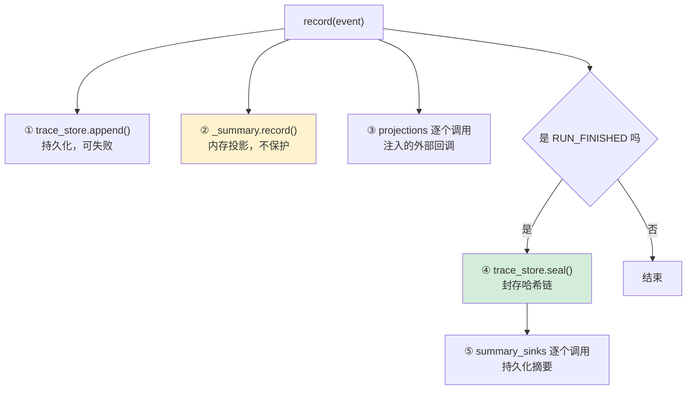

类 docstring 声明了两条原则：

> Trace persistence is deliberately **best-effort**: an unavailable local trace must never turn an otherwise valid agent run into a failed execution.
>
> Runtime-specific projections (such as `RunStateStore`) are **injected** so this observability package remains **independent of execution control**.

第二条是层边界：`observability/` 需要在事件发生时更新运行状态，但它**不能 import** `execution/` 的 `RunStateStore`——那会造成反向依赖。解法是让调用方把回调传进来，可观测性只管调用，不知道对方是谁。

### 2.2 五个失败点，四种捕获策略

`record()` 里每一步都可能失败，而捕获方式**刻意不一致**：

| 步骤 | 捕获 | 为什么 |
|---|---|---|
| ① `trace_store.append()` | `except (OSError, ValueError)` | 自己的代码，只接**预期内**的 IO 和数据错误 |
| ② `_summary.record()` | **不捕获** | 纯内存计算，抛异常就是真 bug |
| ③ `projection(event)` | `except Exception` | **外部注入**的回调，什么都可能抛 |
| ④ `trace_store.seal()` | `except Exception` | 封存路径涉及文件重命名等更多失败模式 |
| ⑤ `sink(summary)` | `except Exception` | 同样是外部注入 |

第②步是全函数**唯一没有保护**的一步，这不是疏漏而是判断：

```python
self._summary.record(event)          # ← 没有 try
```

`RunSummaryProjection.record()` 只做计数累加，没有 IO、没有外部依赖。它抛异常只可能意味着投影逻辑本身有 bug（比如新增了一种事件类型但没处理）。这种错误**必须暴露**——包起来只会让一个静默错误的 summary 一直用下去，而 summary 正是成本统计和健康度的数据源。

反过来，①③④⑤都是"可能因环境而失败"的操作，包起来是对的。而①用窄捕获、③用宽捕获的区别更细：`TraceStore` 是本包自己的类，它抛出 `OSError` / `ValueError` 之外的异常同样说明有 bug，应该暴露；`projections` 是别人塞进来的任意可调用对象，对它做任何假设都不安全。

> 这是一条值得复用的纪律：**窄捕获给自己的代码，宽捕获给别人的代码，不捕获给纯计算。**

### 2.3 构造时的 `reopen()`

```python
if trace_store is not None:
    try:
        # A resumed run reuses this run_id and its previously sealed
        # anchor; clear it so extending the chain is not reported as
        # tampering.  No-op for a brand-new run (no trace yet).
        trace_store.reopen(run_id)
    except Exception:
        logger.warning("failed to reopen run trace (run=%s)", run_id, exc_info=True)
```

和 §10.2 是同一个问题的另一处出口：**被恢复/续跑的 run 复用同一个 `run_id`**，而上一次可能已经 `seal()` 过。锚点里存着旧的链头，现在要往后写。不先清掉，下一次校验会把这次合法续写判成篡改。

对全新的 run 这是 no-op（还没有 trace 文件）。放在构造函数里意味着**每个 recorder 一创建就自动处理**，调用方不需要区分"这是新 run 还是续跑"。

### 2.4 终态才封存

`seal()` 和 summary 持久化都只在 `RUN_FINISHED` 时发生，且**顺序固定**：先 seal，再落 summary。

```python
if event.type is EventType.RUN_FINISHED:
    self._trace_store.seal(self.run_id)      # ④ 先封存 trace
    summary = self._summary.snapshot()
    for sink in self._summary_sinks:
        sink(summary)                         # ⑤ 再落 summary
```

seal 的注释说明了它的用途：

```python
# Anchor this run's trace chain so a later rollback or edit
# of a finished run is detectable by a compliance reader.
```

封存 = 把哈希链头写进 `.head` 锚点文件。之后任何对这个 run 的 trace 的修改——包括**回滚到更早的状态**——都会让链头对不上，被读侧检测到。注意"rollback"这个词：单纯的哈希链能发现内容被改，但发现不了整个文件被替换成一个更早的合法版本；独立的锚点文件才能。

顺序不能反：如果先落 summary 再 seal，中间崩溃就会留下"summary 说这个 run 完成了，但 trace 没封存"的状态——正是 §10.1 分支③要处理的情况。反过来（先 seal 后落 summary）崩溃则留下"trace 完整但 summary 缺失"，这个更好补，因为 trace 是权威，可以直接重算。

`append_prompt_manifest()` 走同一个边界但**不进 summary**——它是溯源数据不是执行事件，这也是 §10.4 里读侧要跳过它的原因。

---

## 3. Trace：防篡改 + 脱敏 + 有界

`engine/observability/trace_store.py` 是这个模块里设计最密的文件。

### 3.1 防篡改

```python
"""Records are hash-chained (``seq``/``prev_hash``/``hash``) so the trace is
tamper-evident: editing, reordering, or deleting a record breaks the chain and
is detected by TraceStore.verify.  TraceStore.seal anchors the chain head at
run end, making a later rollback detectable too."""
```

复用 `common/hash_chain.py`（见 [06 · 安全与安全边界](./06-安全与安全边界.md) §10）。**run 结束时封存锚点**，所以"把 trace 回滚到一个更短但自洽的版本"也能被发现。

### 3.2 两层脱敏

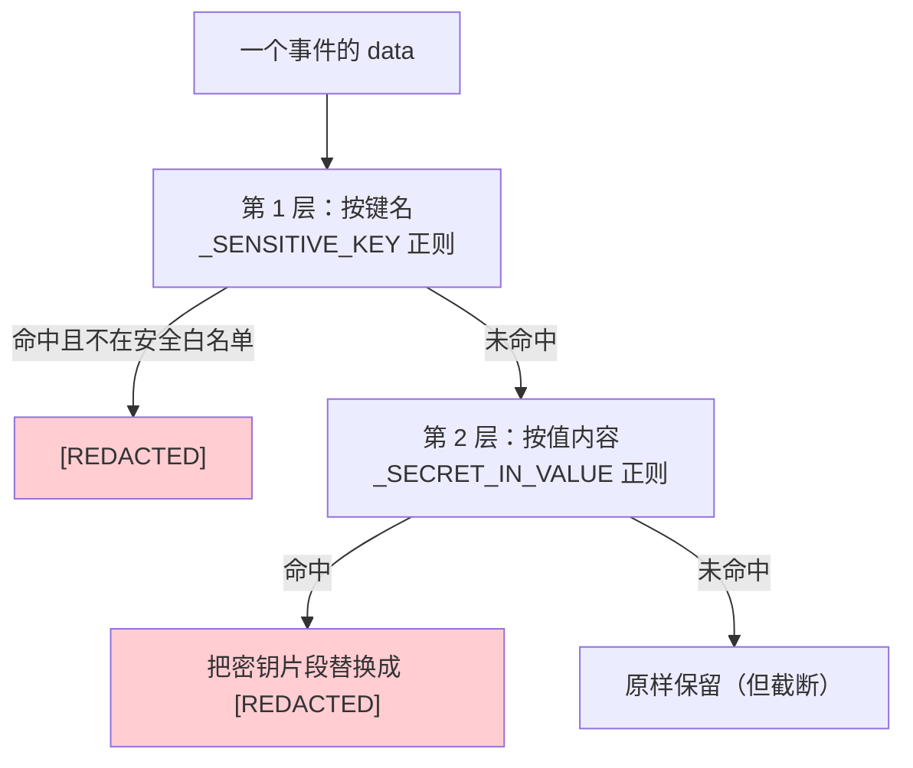

**第 1 层：按键名。**

```python
_SENSITIVE_KEY = re.compile(r"(?:token|secret|password|passwd|api[_-]?key|authorization)", re.I)
```

但这会误伤 token 计数字段，所以有一份白名单：

```python
# Numeric token-metric keys are not secrets and must persist as values, not
# "[REDACTED]" (the name-based redaction would otherwise hit the "token"
# substring).  Keep this in sync with projections.RunSummaryProjection's
# token keys so summary and trace agree about the same run.
_SAFE_METRIC_KEYS = {
    "input_tokens", "output_tokens", "total_tokens",
    "prompt_tokens", "completion_tokens", "context_tokens",
    "cache_read_tokens", "cache_write_tokens", "reasoning_tokens",
}
```

注意最后一句：**要和 `RunSummaryProjection` 的 token 键保持同步，否则 summary 和 trace 会对同一次运行给出不一致的说法**。又一处必须手工同步的清单。

**第 2 层：按值内容。** 这一层的注释记录了一个真实泄漏：

```python
# Name-based redaction cannot see a credential carried *inside* a value, and
# TOOL_CALL_START writes the full tool arguments — so a shell command holding a
# bearer token landed here verbatim, under the innocuous key "command".
```

`TOOL_CALL_START` 会写完整的工具参数。一条带 bearer token 的 shell 命令，键名是无辜的 `"command"`，第 1 层完全看不见。

于是有了 8 种密钥形状的正则：

| 模式 | 匹配 |
|---|---|
| `bearer\|basic <16+ 字符>` | HTTP 认证头 |
| `sk-[A-Za-z0-9_-]{16,}` | OpenAI / Anthropic 风格 |
| `gh[pousr]_[A-Za-z0-9]{20,}` | GitHub 经典 token |
| `github_pat_[A-Za-z0-9_]{20,}` | GitHub 细粒度 PAT |
| `glpat-[A-Za-z0-9_-]{16,}` | GitLab PAT |
| `AIza[0-9A-Za-z_-]{30,}` | Google API key |
| `AKIA[0-9A-Z]{12,}` | AWS key id |
| `xox[abprs]-[A-Za-z0-9-]{10,}` | Slack |
| `eyJ...\....\....` | JWT |

**两条边界条件是承重的**（注释原文）：

```python
# The leading (?<![A-Za-z0-9]) is essential, not decoration: "sk-" occurs inside
# ordinary kebab-case words — ta*sk-*scheduler, di*sk-*usage, ri*sk-*scoring —
# and without a boundary the pattern ate whole filenames.  The auth-header branch
# likewise needs a digit, or "Basic authentication" matched as a credential.
```

- 没有前置边界，`sk-` 会在 `task-scheduler`、`disk-usage`、`risk-scoring` 里命中，**把整个文件名吃掉**
- 认证头分支必须要求含数字（`(?=[A-Za-z0-9._~+/=-]*[0-9])`），否则 `Basic authentication` 这个词组会被当成凭据

这和 [08 · Agents 内容层](./08-Agents-内容层.md) §3.5 的 `\b` 是同一类问题：**边界断言不是装饰，去掉它正则就开始吃掉正常内容**。

### 3.3 有界

```python
_MAX_VALUE_CHARS = 4096
_MAX_DEPTH = 4
```

`_bounded_trace_value()` 递归处理：

| 类型 | 处理 |
|---|---|
| 深度 > 4 | `"[TRUNCATED]"` |
| dict | 逐键判定敏感性，递归 |
| list / tuple | **只取前 100 项**，递归 |
| str | 截断到 4096 字符后脱敏 |
| int / float / bool / None | 原样 |
| 其它 | `str()` 后截断脱敏 |

### 3.4 延迟同步

```python
_DEFERRED_SYNC_EVENTS = {
    EventType.RAW_RESPONSE_EVENT,
    EventType.PROVISIONAL_TEXT_DELTA,
}
```

这两类事件**每秒可能几十上百条**（流式的每一个 delta）。它们不 fsync，其余事件 fsync。

这直接对应 `hash_chain.py` docstring 里那条被测试固化的约束：

> `HashChainLog.append` 每条记录最多一次 `os.fsync`，而且**只在调用方要求时**（`test_trace_store_defers_sync_for_high_frequency_stream_events` 数 fsync 调用次数）。

**有一个测试专门数 fsync 次数**，防止有人"顺手"把所有事件都改成同步写。

---

## 4. 读取：读时校验完整性

`engine/observability/reader.py` 在读 trace 时会**验证哈希链**，失败时不是抛异常了事，而是**把完整性问题本身变成一个事故**：

```python
class TraceIntegrityError(ValueError): ...

def _trace_integrity_incident(...) -> RunIncident: ...
def _trace_integrity_diagnosis(...) -> RunDiagnosis: ...
def _integrity_evidence(verification: ChainVerification) -> dict[str, int | str]: ...
```

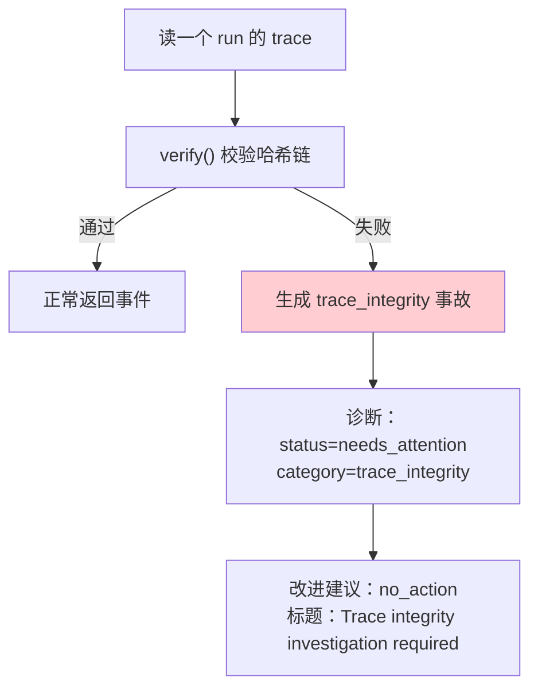

**完整性失败不产出自动改进建议**（`proposals.py` 里有一个专门分支返回 `status="no_action"`）。理由很直白：**trace 被动过的情况下，基于它做出的任何自动建议都不可信**。

还有一个 `_trace_matches_summary()` 做交叉校验——trace 和 summary 是两条独立写入的通道，它们对不上本身就是一个信号。

---

## 5. 事故检测

`engine/observability/incidents.py` 把运行失败**确定性地**分类。

### 5.1 事故的结构

```python
@dataclass(frozen=True)
class RunIncident:
    run_id: str
    agent_id: str
    severity: str
    category: str
    message: str
    reason: str | None
    occurred_at: str
    evidence: dict[str, int | str]
```

**每个事故都带 `evidence`**——不是只说"失败了"，而是给出可核对的数字。

### 5.2 分类依据

```python
if reason in {"preflight_budget", "tool_failure_budget", "tool_call_budget"}:
    ... category="budget_exhausted",
        evidence={"tool_calls": summary.tool_call_count}
```

主要类别：

| 类别 | 触发 |
|---|---|
| `budget_exhausted` | `reason` 是三种预算耗尽之一 |
| `tool_timeout` | trace 里有超时的工具结果 |
| `repeated_backtracks` | 回退次数超阈值 |
| `run_failed` | 终态失败 |
| `trace_integrity` | 哈希链校验失败（由 reader 产生） |

### 5.2.1 互斥的与并存的

`detect()` 的结构不是一条 if/elif 链——它分成两段：

```python
if reason in {"preflight_budget", ...}:      # ┐
    ...budget_exhausted                       # │ 终态类：互斥
elif summary.outcome == "failed":             # │ 一次 run 只可能是
    ...run_failed                             # │ 其中一种
elif summary.outcome in {"cancelled", "incomplete"}:  # ┘
    ...run_cancelled / run_incomplete

if summary.backtrack_count >= 2:              # ┐ 过程类：独立判断
    ...repeated_backtracks                    # │ 可与终态事故并存
                                              # │
if timeouts:                                  # │
    ...tool_timeout                           # ┘
```

**终态是互斥的**（一次 run 不可能既失败又取消），**过程问题是并存的**（一次失败的 run 完全可能既反复回退又有工具超时）。所以 `detect()` 返回的是**列表**而不是单个事故，一次 run 最多可以带三条。

这也解释了为什么 §6 的诊断需要 `_primary_incident()` 去挑主因——检测器负责**全部记下**，诊断器负责**挑一个说**。两个职责分开：检测不做取舍，诊断才做。

### 5.2.2 严重度分级

| 类别 | severity | 判断依据 |
|---|---|---|
| `budget_exhausted` | `error` | 任务没做完就被拦停了 |
| `run_failed` | `error` | 明确失败 |
| `tool_timeout` | `error` | 工具没返回，结果不可用 |
| `run_cancelled` | `warning` | **用户主动取消**，不是系统问题 |
| `run_incomplete` | `warning` | 可能还能续跑 |
| `repeated_backtracks` | `warning` | 效率问题，不影响正确性 |

分级的原则是**"系统出了问题"才是 error**。用户按了取消不是错误，回退两次只是绕了远路——把它们标成 error 会让告警面板充满噪声，真正的故障反而被淹没。

回退阈值是 `>= 2`：回退一次很正常（试了个方向不对就换），连续两次说明路由或技能的退出条件可能有问题。

### 5.2.3 `is_timeout`：工具超时不等于审批超时

这个函数只有一行判断，但 docstring 有五行，因为它划的是一条**很容易划错**的界：

```python
def is_timeout(data: dict[str, Any]) -> bool:
    """Whether a TOOL_CALL_RESULT payload records a genuine tool timeout.

    The react loop marks real tool timeouts with ``timed_out=True`` and
    ``error_kind="timeout"`` (tool/registry.py).  Approval timeouts instead
    carry a ``reason`` such as "Approval timed out" and never set ``timed_out``,
    so they must not be classified as tool timeouts.
    """
    return data.get("timed_out") is True or data.get("error_kind") == "timeout"
```

同一个 `TOOL_CALL_RESULT` 事件里，"超时"有两种完全不同的含义：

| | 工具超时 | 审批超时 |
|---|---|---|
| 发生了什么 | 工具跑了太久没返回 | **用户 300 秒没点批准** |
| 字段 | `timed_out=True` / `error_kind="timeout"` | `reason="Approval timed out"`，**不设** `timed_out` |
| 是谁的问题 | 工具或目标系统 | 没人的问题，用户不在 |
| 该报事故吗 | **该** | **不该** |

如果按 `reason` 里有没有 "timeout" 字样来判断，两者都会命中——于是"用户离开键盘"会被记成"工具故障"，进而拉低健康度、触发诊断、生成一条"检查工具超时和重试策略"的无用建议。

用 `timed_out is True`（而非 truthy）加 `error_kind == "timeout"` 两个**结构化字段**判断，是唯一可靠的区分方式。这条边界在 §8.1 的健康度计算里还要再出现一次——那里同样要把审批相关的结果排除掉。

> 这是本文档里第二次出现同一个教训（第一次见 §3.2 的按值脱敏）：**按结构化字段判断，不要解析人类可读的文本**。文本是给人看的，会变；字段是给程序看的，有契约。

### 5.2.4 `_failure_details` 的保守解析

```python
"""Return only the safe failure classification retained by the runtime.

Some traces predate the structured ``error`` payload.  Their fixed terminal
notice still identifies the exception class, so recognize it only when it
**directly precedes** the terminal failure rather than parsing arbitrary model
output or exception text.
"""
```

老版本的 trace 没有结构化的 `error` 载荷，只有一条固定格式的终止通知。要从中提取异常类名，就得做文本解析——而文本解析在这里有个真实风险：**trace 里还有模型的输出**，模型完全可能在回答里提到某个异常类名。如果全文搜索，会把模型讨论的内容当成真实的失败原因。

限定条件是**紧邻终态失败之前**（`for event in reversed(trace)` 从后往前找，位置必须直接相邻）。这样即使模型在中间某处提过 `ValueError`，也不会被误认。配合 `_ERROR_TYPE = re.compile(r"[A-Za-z_][A-Za-z0-9_]{0,99}\Z")` 这个严格的标识符正则（限长 100 字符、必须是合法 Python 标识符形状、`\Z` 锚定结尾），把可解析的范围压到最小。

四个 frozenset 白名单也是同一思路：

```python
_ERROR_KINDS = frozenset({"internal", "provider_http", "provider_protocol", "provider_transport"})
_ERROR_STAGES = frozenset({"runtime_prepare", "agent_execution"})
_PROVIDERS = frozenset({"anthropic", "openai"})
```

**枚举值必须在白名单内**才被采纳，否则丢弃。日志文件是可以被编辑的，而事故记录会驱动诊断和建议——不校验就等于让任何能写文件的人操纵诊断结论。

### 5.3 输入校验：不信任自己的日志

```python
_ERROR_KINDS = frozenset({"internal", "provider_http", "provider_protocol", "provider_transport"})
_ERROR_STAGES = frozenset({"runtime_prepare", "agent_execution"})
_ERROR_TYPE = re.compile(r"[A-Za-z_][A-Za-z0-9_]{0,99}\Z")
_PROVIDERS = frozenset({"anthropic", "openai"})
```

`_safe_error_details()` 用这些白名单**过滤从 trace 里读出来的错误详情**。为什么要过滤自己写的日志？因为：

1. trace 可能被改过（哈希链只能检测，不能阻止）
2. 错误文本来自 provider，是**外部输入**
3. 这些字段会被 API 返回给前端渲染

`_ERROR_TYPE` 的正则限制类型名必须是标识符形状且 ≤ 100 字符——一个从 provider 响应里抄来的"错误类型"不能是任意长度的任意字符串。

### 5.4 历史格式兼容

```python
_LEGACY_LLM_FAILURE = re.compile(
    r"⚠️ 执行失败：(?P<type>[A-Za-z_][A-Za-z0-9_]{0,99})（详情见服务端日志）\Z"
)
```

老版本把失败信息写成一句中文文本，新版本写结构化字段。这个正则让**老的运行档案仍然可诊断**——归档数据不能因为格式演进而变成不可读的。

---

## 6. 诊断：保守的根因分析

`engine/observability/diagnosis.py` 的类 docstring：

> Evidence-backed RCA that **proposes changes but never applies them**.

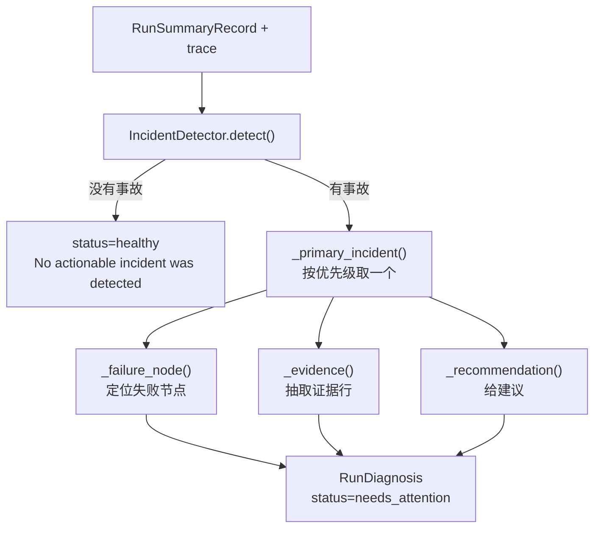

### 6.1 主事故的优先级

```python
def _primary_incident(incidents: list[RunIncident]) -> RunIncident:
    priority = {"tool_timeout": 0, "budget_exhausted": 1, "run_failed": 2}
    return min(incidents, key=lambda incident: priority.get(incident.category, 3))
```

一次运行可能有多个事故。取**最具体的那个**作为主因：

- `tool_timeout` 最具体——知道是哪个工具挂了
- `budget_exhausted` 次之——知道是预算问题，但不知道为什么反复调用
- `run_failed` 最泛——只知道失败了
- 未知类别排最后

**"最具体的失败信号是最有用的根因"**，这是一个可复用的排序原则。

### 6.2 只给一个诊断

不返回"这里有 5 个问题"，而是返回一个主因加它的证据。理由是：一次失败的 5 个事故里通常 4 个是第 1 个的后果。

---

### 6.3 两种终态

`diagnose()` 只有两个出口：

```python
if not incidents:
    return RunDiagnosis(status="healthy", failure_node=None,
                        primary_category=None,
                        summary="No actionable incident was detected for this run.",
                        evidence=[], recommendation=None)
```

无事故 → `healthy`，且 `failure_node` / `primary_category` / `recommendation` 全为 `None`，`evidence` 为空列表。**不编造"看起来还行"之类的软性结论**——没有可行动的事故就明说没有。

有事故 → `needs_attention`，五个字段全部填上。类 docstring 定死了它的权限边界：

> Evidence-backed RCA that **proposes changes but never applies them**.

诊断只产出结论和建议，任何修改都要经过 §7 的审批通道。

### 6.4 `_failure_node`：把事故定位到节点

诊断要回答"哪里坏了"，这个函数把事故类别翻译成一个可读的节点标识：

| 事故类别 | 节点 | 怎么得到的 |
|---|---|---|
| `tool_timeout` | `tool:{name}` | **扫 trace** 找第一个超时的 `tool_call_result`，取其 `name` |
| `tool_timeout`（找不到名字） | `tool` | 降级 |
| `repeated_backtracks` | `routing` | 固定映射 |
| `budget_exhausted` | `execution_budget` | 固定映射 |
| `run_failed` + provider 类错误 | `llm:{provider}` | 从 `evidence.kind` 前缀或 `type == "LLMResponseError"` 判断 |
| `run_failed` + 其他 | `execution:{stage}` | 取 `evidence.stage` |
| 兜底 | `run` | 什么都判断不出时 |

`tool_timeout` 是唯一需要回扫 trace 的分支——因为工具名只存在于事件里，事故记录本身不带。扫描时做了三层校验（事件类型对、`data` 是 dict、`name` 是非空字符串），任何一层不满足就继续找下一个，全都找不到才降级成笼统的 `"tool"`。

provider 类的判定是 `kind.startswith("provider_")` **或** `error_type == "LLMResponseError"`。两个条件并列是因为历史格式：老版本只记了 `LLMResponseError` 这个类型名，没有细分 `kind`。兼容旧数据的同时不影响新数据的精确分类。

### 6.5 建议按失败种类细分

`_recommendation()` 对 `run_failed` 做了四路细分，每一路指向不同的排查方向：

| `evidence.kind` | 建议方向 |
|---|---|
| `provider_http` | 检查 provider 的 HTTP 状态码、凭据、**限流** |
| `provider_transport` | 检查端点可达性、**网络超时** |
| `provider_protocol` | 检查 provider 兼容性、**响应格式** |
| `type == LLMResponseError`（无 kind） | 检查配置和可用性，并**明说无法区分类型** |

最后一条的原文值得引：

> "Check the LLM provider configuration and availability before retrying; **this trace cannot distinguish the provider failure type**."

诊断在这里**承认自己信息不足**，而不是从三种可能里猜一个。这正是类名里 "conservative" 的含义：宁可给一条笼统但正确的建议，也不给一条具体但可能误导的。一个说"检查限流"的错误建议会让人花半小时查限流面板，而真实原因是网络不通。

其余类别走一张查表：

```python
recommendations = {
    "budget_exhausted": "Review the skill plan or tool policy to reduce repeated calls **before increasing the budget**.",
    "tool_timeout": "Review the affected tool's timeout and retry policy; validate the target before retrying.",
    "repeated_backtracks": "Review routing rules and the skill's exit criteria to avoid cycling between steps.",
    "run_cancelled": "Resume only when the user still expects the incomplete work to continue.",
    "run_incomplete": "Review the terminal reason and resume the run only if its prerequisites are still valid.",
}
```

`budget_exhausted` 那条的措辞很克制：**先想办法减少重复调用，而不是先调大预算**。预算耗尽通常是循环或策略问题的症状，调大只是把撞墙时间推后。

### 6.6 未知类别不能炸掉读路径

```python
# A future terminal status (e.g. a new RUN_FINISHED reason) must not crash
# the read path with a KeyError; fall back to the generic failure advice.
return recommendations.get(incident.category, "Inspect the retained trace evidence and ...")
```

同样的防御在 `_primary_incident` 里也有：

```python
priority = {"tool_timeout": 0, "budget_exhausted": 1, "run_failed": 2}
return min(incidents, key=lambda incident: priority.get(incident.category, 3))
```

**未知类别默认优先级 3**（最低），不会 `KeyError`。

这两处是同一个考虑：诊断是**读路径**，读的是可能由**旧版本或新版本**写下的数据。事故类别会随功能演进增加，而一个装了新版本、去读旧数据（或反过来）的用户，不该因为遇到一个不认识的类别就看到 500。用 `.get(key, default)` 而不是 `[key]`，成本为零，换来的是版本间的自由流动。

### 6.7 证据的确定性排序

```python
evidence = [f"{key}={value}" for key, value in sorted(incident.evidence.items())]
...
evidence.extend(f"tool={name}" for name in sorted(set(names)))
```

两处都排了序，工具名还先 `set()` 去重。这让同一次 run 的诊断**每次生成结果完全一致**——字典序在 Python 3.7+ 虽然是插入序（稳定），但事故证据来自不同来源的合并，插入序不可控。

确定性输出的两个好处：测试可以直接断言完整字符串；两次诊断的结果可以用 `diff` 对比，差异就是真实差异而不是排序噪声。

---

## 7. 改进建议：审批门控

`engine/observability/proposals.py` 的类 docstring：

> A suggested local change; **this object never mutates runtime configuration**.

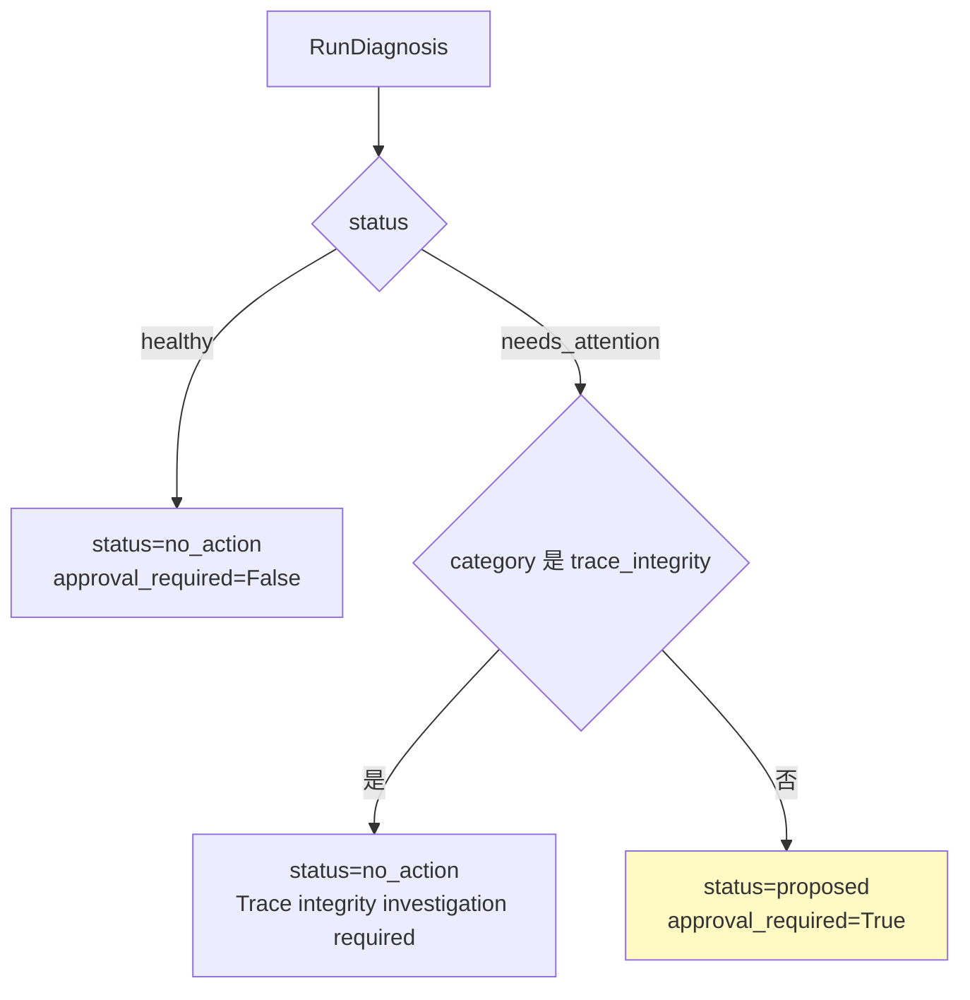

四种类别的建议模板，**每一条都在推迟直接的参数调整**：

| 类别 | 标题 | 建议 |
|---|---|---|
| `tool_timeout` | 审查工具超时策略 | **在验证目标之后**，提议一个范围受限的超时或重试策略调整 |
| `budget_exhausted` | 审查执行预算与计划 | 提议一个减少重复工具调用的技能或 prompt 调整，**而不是先改预算上限** |
| `repeated_backtracks` | 审查路由与技能退出条件 | 提议一个防止观察到的回退循环的路由或技能策略补丁 |
| `run_failed` | 审查失败的执行依赖 | **在检查保留的证据之后**，提议一个针对性的依赖、工具或 prompt 修正 |
| 兜底 | 审查运行前置条件 | **只有在阻塞条件被验证之后**才提议针对性变更 |

`budget_exhausted` 那条最能说明设计取向：**预算耗尽的正确修法不是加预算，是减少重复调用。** 一个会自动建议"把上限从 60 调到 120"的系统，会把一个行为问题掩盖成一个配置问题。

五条建议里有三条包含"验证之后"或"检查证据之后"——**这个模块不假装自己知道根因，它只把注意力引到正确的地方**。

---

### 7.1 三种结果

`ImprovementProposer.propose()` 有三个出口，其中两个都是"不提建议"：

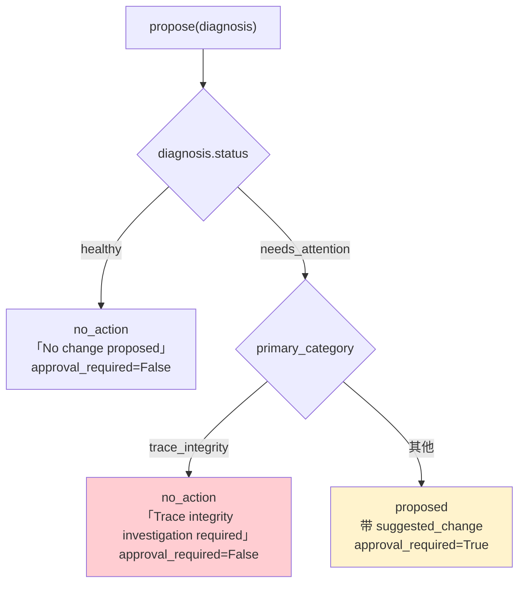

`trace_integrity` 被单独拎出来，是这里最值得注意的判断。哈希链校验失败意味着 trace 被改过或损坏——这**不是一个可以靠调参数解决的问题**。如果对它也生成一条"建议调整超时策略"之类的改进建议，等于把一个潜在的安全事件降级成了性能调优工单。

所以它的产出是"需要调查"（investigation required），`suggested_change` 为 `None`，`approval_required` 也是 `False`——因为**没有变更要批**，只有事要查。

### 7.2 建议的措辞都是"再提一个建议"

四条建议模板的动词全是 `Propose ... after validating / inspecting`：

| 类别 | 标题 | 建议内容（注意后半句） |
|---|---|---|
| `tool_timeout` | Review tool timeout policy | Propose a scoped timeout or retry-policy adjustment **after validating its target** |
| `budget_exhausted` | Review execution budget and plan | Propose a skill or prompt adjustment that reduces repeated tool calls **before changing budget limits** |
| `repeated_backtracks` | Review routing and skill exit criteria | Propose a routing or skill-policy patch that prevents the observed cycle |
| `run_failed` | Review failing execution dependency | Propose a targeted correction **after inspecting the retained evidence** |
| 未知类别 | Review run prerequisites | Propose a targeted change **only after the blocking condition has been validated** |

这是**双重保守**：建议本身不是"改成 X"，而是"在验证过 Y 之后再提一个改 X 的建议"。类 docstring 和字段名把这一层说死了：

> A suggested local change; this object **never mutates runtime configuration**.

`RunImprovementProposal` 是 frozen dataclass，带一个显式的 `approval_required` 布尔字段。整条链路——检测、诊断、建议——**没有任何一处会自己动配置**。系统能观察、能判断、能建议，但改动必须有人点头。

`budget_exhausted` 那条再次强调"先减少重复调用，再考虑改预算上限"，和 §6.5 的建议措辞一致——同一个立场在两个模块里被重复表达，不是巧合而是刻意对齐。

### 7.3 未知类别的兜底

```python
return proposals.get(category, (
    "Review run prerequisites",
    "Propose a targeted change only after the blocking condition has been validated.",
))
```

第三次出现同样的 `.get(key, default)` 模式（前两次见 §6.6）。读路径上的每一张查表都不用 `[]`——这已经是这个包的一条成文纪律。

---

## 8. 健康度

`engine/observability/health.py` 算一个运行窗口的聚合指标：

| 指标 | 含义 |
|---|---|
| `run_count` | 窗口内运行数 |
| `completed_count` / `unsuccessful_count` | 完成 / 未完成 |
| `success_rate` | 成功率（保留 4 位小数） |
| `tool_call_count` | 工具调用总数 |
| `tool_success_rate` | 工具成功率（**没有工具调用时为 `None` 而不是 0**） |
| `average_backtracks` | 平均回退次数 |
| `total_tokens` / `tokens_per_run` | Token 总量与均值 |

### 8.1 工具成功率的三个排除

这段注释是整个模块里最细的一处：

```python
# A pre-approval TOOL_CALL_RESULT (blocked=True, approval_required=True)
# is a gate probe, not an executed tool: the real result arrives later
# under a separate event.  Counting both would double-count one approved
# call as a failure plus a success, so skip the gate probe entirely.
# A denied/timed-out approval (blocked=True, approval_outcome in
# {denied, timed_out}) likewise never executed a tool — the user refused
# it before any side effect — so it must not drag tool_success_rate down
# either.  A granted approval emits the real result under
# approval_outcome="granted" and must still be counted.
```

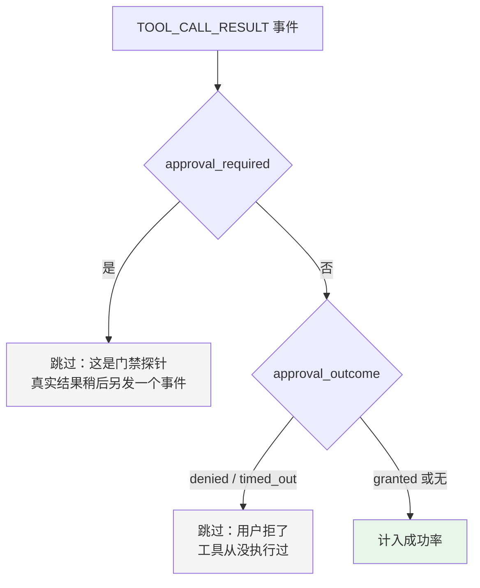

不做这三个排除的后果：

- **门禁探针被计数** → 一次被批准的调用同时算一次失败和一次成功
- **被拒的审批被计数** → 用户主动拒绝一个危险操作，反而拉低了工具成功率

第二条尤其重要：**一个把"用户正确地拒绝了危险操作"记成失败的指标，会诱导用户少拒绝**。

### 8.2 `tool_success_rate` 为什么可以是 `None`

```python
tool_success_rate=_ratio(successful_tools, len(tool_results)) if tool_results else None
```

没有工具调用时返回 `None` 而不是 `0.0`。**"没有数据"和"成功率为零"是两回事**——同 `usage.py` 的 `usage_reported`、`ModelLimits` 的 `*_declared` 是同一条原则。

---

### 8.3 九个字段与它们的分母

`AgentHealth` 是 frozen dataclass，九个字段分成三组：

| 组 | 字段 | 分母 |
|---|---|---|
| 运行 | `run_count` / `completed_count` / `unsuccessful_count` / `success_rate` | `run_count` |
| 工具 | `tool_call_count` / `tool_success_rate` | **`len(tool_results)`**，不是 `tool_call_count` |
| 成本 | `total_tokens` / `tokens_per_run` / `average_backtracks` | `run_count` |

工具那一组的分母**特意和 `tool_call_count` 不同**。`tool_call_count` 来自 summary 的 `TOOL_CALL_START` 计数，包含了所有发起的调用；而 `tool_success_rate` 的分母是**过滤掉审批探针和被拒调用之后**剩下的真实执行数（§8.1 的三个排除）。

两个数字不相等是正常的，且差值本身有意义：`tool_call_count - len(tool_results)` 约等于"有多少次调用卡在了审批上"。把它们强行统一成一个分母，反而会丢掉这个信息。

### 8.4 `_ratio`：除零返回 0.0

```python
def _ratio(numerator: int, denominator: int) -> float:
    return round(numerator / denominator, 4) if denominator else 0.0
```

所有比率都过这一个函数，两件事一起做了：**除零保护**和**统一保留 4 位小数**。

一个刚创建、还没跑过任何 run 的 agent，`run_count` 是 0。没有这层保护，查健康度就是一个 `ZeroDivisionError`——而这是新用户最可能做的第一个操作之一。

保留 4 位是为了让 `success_rate` 这类值在 JSON 里稳定（`0.6667` 而不是 `0.6666666666666666`），前端不必自己截断，两次相同输入的输出也逐字节一致。

### 8.5 `tool_success_rate` 和 `_ratio` 的分工

注意 §8.2 说过 `tool_success_rate` 可以是 `None`，而 `_ratio` 除零返回 `0.0`——两者不矛盾，因为判断在调用之前：

```python
tool_success_rate=_ratio(successful_tools, len(tool_results)) if tool_results else None,
```

没有任何工具执行过 → `None`（**无数据**）；执行过但全失败 → `0.0`（**成功率为零**）。这两种情况在语义上完全不同，前者不该显示成"成功率 0%"吓人一跳。

其余比率（`success_rate`、`average_backtracks`、`tokens_per_run`）则直接用 `_ratio` 的 `0.0`，因为"没跑过 run"和"跑了但都失败"在这些指标上区分意义不大，简单处理即可。这是**只在需要区分的地方才区分**的取舍——不是所有字段都值得引入三态。

### 8.6 `_tool_succeeded` 的两级判断

```python
def _tool_succeeded(data: dict[str, Any]) -> bool:
    if data.get("blocked") or data.get("approval_required"):
        return False
    status = str(data.get("status") or "").lower()
    if status:
        return status in {"ok", "success", "completed", "passed"}
    return not bool(data.get("error"))
```

有 `status` 字段就按**白名单**判定（四个词都算成功），没有就退回"有没有 `error`"。

用白名单而不是黑名单，意味着一个没见过的 status 值（比如未来新增的 `"partial"`）会被判为**失败**。这个方向是对的：健康度指标宁可偏悲观，也不该把未知状态乐观地算成成功——否则一个新引入的失败状态会悄无声息地不影响任何指标。

第一行的 `blocked or approval_required` 是最后一道保险。这两种事件按理已经被 §8.1 的列表推导过滤掉了，这里再判一次属于纵深防御：过滤条件将来若被改动，成功率也不会突然把审批探针算成成功。

---

## 9. 保留策略

`engine/observability/index.py`：

```python
_DEFAULT_MAX_COMPLETED_RUNS = 2_000
_DEFAULT_MAX_AGE_DAYS = 90
_DEFAULT_MAX_BYTES = 512 * 1024 * 1024      # 512 MB
```

三条独立的界，任何一条超了就淘汰最老的。三个环境变量可覆盖：

| 环境变量 | 默认 |
|---|---|
| `AGENT_SMITH_OBSERVABILITY_MAX_RUNS` | 2000 |
| `AGENT_SMITH_OBSERVABILITY_MAX_AGE_DAYS` | 90 |
| `AGENT_SMITH_OBSERVABILITY_MAX_BYTES` | 512 MB |

### 9.1 `0` 表示禁用，非法值回落默认

```python
def _optional_positive_env(name: str, default: int) -> int | None:
    raw = os.environ.get(name)
    if raw is None or not raw.strip():
        return default
    try:
        parsed = int(raw)
    except ValueError:
        return default        # 解析不了 → 用默认，不炸
    if parsed == 0:
        return None           # 0 → 禁用这一条界
    return parsed if parsed > 0 else default   # 负数 → 用默认
```

三条约定：**空/非法 → 默认，`0` → 禁用，负数 → 默认**。

而 `ObservabilityRetentionPolicy.__post_init__` 对**代码构造**的策略更严格——非 `None` 的值必须为正，否则抛 `ValueError`。

**环境变量宽容（用户拼错不该让服务起不来），代码构造严格（程序错误要立刻暴露）。** 同一个概念在两个入口用两套严格度，是有意的。

---

### 9.2 索引：SQLite 只存元数据

保留策略要回答"哪些 run 该删"，而扫描几千个 JSONL 文件来算这个太慢。`engine/observability/index.py` 建了一个**只存元数据**的 SQLite 索引：

```sql
CREATE TABLE IF NOT EXISTS completed_runs (
    run_id     TEXT PRIMARY KEY,
    agent_id   TEXT NOT NULL,
    session_id TEXT,
    identity_id TEXT,
    created_at TEXT NOT NULL,
    finished_at TEXT NOT NULL,
    size_bytes INTEGER NOT NULL DEFAULT 0
);
CREATE INDEX IF NOT EXISTS idx_completed_runs_agent_finished
    ON completed_runs(agent_id, finished_at DESC);
```

类 docstring 一句话说清了边界：

> SQLite metadata index; **observation payloads remain in existing files**.

索引里**没有任何观测内容**——没有事件、没有 prompt、没有工具参数。它只回答"有哪些 run、属于谁、什么时候结束、占多大"。这个划分让索引可以随时重建（`bootstrap()` 扫一遍 summary 文件即可），也让索引损坏不会丢数据。

那个复合索引 `(agent_id, finished_at DESC)` 精确对应 `list_run_ids()` 的查询形状——按 agent 过滤 + 按结束时间倒序 + LIMIT。列顺序不能反：`agent_id` 是等值过滤所以在前，`finished_at` 是排序所以在后。

### 9.3 WAL 不是性能优化，是正确性要求

```python
db.execute("PRAGMA busy_timeout=5000")
# WAL allows concurrent reader/writer access across parallel agent
# runs sharing one index.sqlite3.  Without it a busy writer can
# raise SQLITE_BUSY inside a 5s window; save() treats that as a
# best-effort failure and the run silently stays out of list()
# forever (bootstrap only ever runs once).
db.execute("PRAGMA journal_mode=WAL")
```

这条注释描述的是一个**真实存在过的失败链**，值得逐步拆：

1. 多个 agent run 并发跑，共用一个 `index.sqlite3`
2. 默认的 rollback journal 模式下，写事务会阻塞读事务
3. 5 秒 `busy_timeout` 内没排上队 → 抛 `SQLITE_BUSY`
4. `save()` 是 best-effort 的（见 §10.5 的取舍），异常被吞掉只记 warning
5. 于是这次 run **永远不会出现在 `list()` 里**
6. 而 `bootstrap()` 只在第一次运行，不会再来补——**没有任何自愈路径**

第 6 步是致命的。best-effort 写入本身没问题，但它必须配一个"以后还能补上"的机制；这里没有，所以 best-effort 就变成了**永久丢失**。WAL 让读写不互斥，从源头上把 `SQLITE_BUSY` 的概率降到接近零。

> **教训**：把写入降级成 best-effort 之前，先确认失败之后还有没有第二次机会。没有的话，"尽力而为"实际是"随机丢数据"。

### 9.4 保留判定的三个条件

```python
too_many = policy.max_completed_runs is not None and index >= policy.max_completed_runs
too_old  = parsed < cutoff                      # 按 finished_at
too_large = (policy.max_bytes is not None
             and retained_count > 0
             and retained_bytes + entry_bytes > policy.max_bytes)
if too_many or too_old or too_large:
    candidates.append(run_id)
else:
    retained_bytes += entry_bytes
    retained_count += 1
```

行是按 `finished_at DESC` 排的，所以遍历顺序是**从最新到最旧**，三个条件任一命中就进删除候选：

| 条件 | 判据 | 默认值 |
|---|---|---|
| `too_many` | 序号超过上限（最新的 N 条之外） | 2 000 条 |
| `too_old` | `finished_at` 早于 `now - max_age_days` | 90 天 |
| `too_large` | **累积**字节加上本条会超上限 | 512 MB |

三个细节：

**① `retained_count > 0` 保证至少留一条。** 如果第一条（最新的那次 run）自己就超过 512 MB，没有这个条件它也会被删——用户会发现刚跑完的任务记录立刻消失了。加上之后，第一条无论多大都保留，从第二条起才开始算累积。

**② 时间解析失败按"不算太老"处理。**

```python
try:
    parsed = datetime.fromisoformat(str(finished_at))
    if parsed.tzinfo is None:
        parsed = parsed.replace(tzinfo=timezone.utc)
    too_old = parsed < cutoff
except ValueError:
    too_old = False
```

时间戳畸形时 `too_old = False`——**保守地不删**。删数据是不可逆的，判据本身不可信时应当放过。另外 naive datetime 一律当 UTC，避免和 `datetime.now(timezone.utc)` 比较时抛 `TypeError`（Python 不允许 aware 和 naive 直接比大小）。

**③ `max(0, size_bytes)` 兜底负数。** 写入和读取两处都做了。文件大小理论上不会是负数，但索引里的值来自外部计算，一个负数会让累积字节数**减少**，从而让保留量悄悄超过上限。

### 9.5 环境变量的三态语义

```python
def _optional_positive_env(name: str, default: int) -> int | None:
    raw = os.environ.get(name)
    if raw is None or not raw.strip():
        return default
    try:
        parsed = int(raw)
    except ValueError:
        return default
    if parsed == 0:
        return None
    return parsed if parsed > 0 else default
```

一个变量三种含义：

| 输入 | 结果 | 含义 |
|---|---|---|
| 未设置 / 空白 | 默认值 | 用内置策略 |
| `0` | `None` | **禁用这条上限** |
| 正整数 | 该值 | 自定义上限 |
| 负数 / 非数字 | 默认值 | 输入无效，回落 |

三个变量：`AGENT_SMITH_OBSERVABILITY_MAX_RUNS`、`..._MAX_AGE_DAYS`、`..._MAX_BYTES`。

用 `0` 表示"禁用"而不是另设一个 `..._DISABLED=1` 开关，是因为三条上限需要**独立**开关，那样要多三个变量。而 `0` 在这个语境下本来就没有合理解释（保留 0 条记录 = 全删，没人想要），拿来当哨兵值不会和真实意图冲突。

非法输入回落默认而不是抛异常，同样是可用性优先：一个拼错的环境变量不该让服务起不来。但注意 `ObservabilityRetentionPolicy.__post_init__` **仍然会校验**——直接构造对象时传负数会抛 `ValueError`。宽容只针对环境变量这个不可控入口，代码内部的错误照常暴露。

### 9.6 `upsert` 与幂等

```python
INSERT INTO completed_runs (...) VALUES (...)
ON CONFLICT(run_id) DO UPDATE SET
    agent_id=excluded.agent_id, ...
```

所有写入都是 `INSERT ... ON CONFLICT DO UPDATE`，即幂等 upsert。同一个 run 被记录两次（比如崩溃恢复后重新落一次）不会报错，也不会留两行——直接覆盖。`upsert()` 本身就是 `bootstrap_entry()` 的别名，两个名字对应两种调用意图（单条更新 vs 批量导入），实现共用一套 SQL。

---

## 10. 崩溃恢复

`engine/observability/runtime.py` 的 `finalize_interrupted_run()` 处理"进程崩了，run 没有终态事件"。

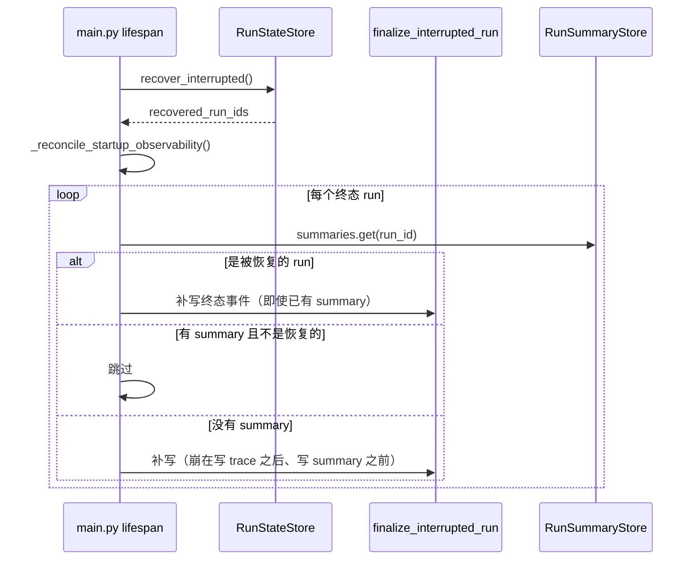

`_terminal_matches()` 用来判断"补写的终态事件是不是和已有的重复"——避免同一个 run 留下两条矛盾的终态。

`_execution_events()` 把持久化的记录读回成 `ExecutionEvent`，再用 `_summary_for()` 重算 summary。**恢复路径复用正常路径的投影逻辑**，而不是另写一套。

### 10.1 四条分支

崩溃发生的时点不同，恢复方式也不同。`finalize_interrupted_run()` 的 docstring 把设计意图写全了：

> Rebuild **only the trace tail since the last terminal event** and merge that tail into an existing summary. For a run whose trace reached its terminal event but whose summary write was interrupted, **materialize the complete trace** instead of appending a second terminal event.
>
> A failed trace verification is **deliberately quarantined**: it is never extended or used as evidence.

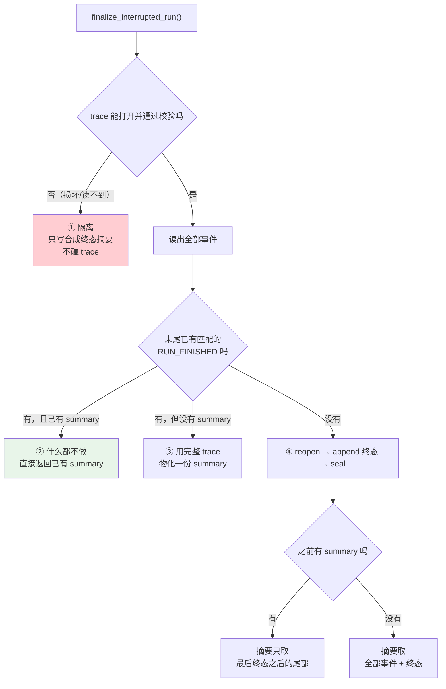

四条分支对应四种崩溃时点：

| 分支 | 崩溃发生在 | 处理 | 为什么这样做 |
|---|---|---|---|
| ① 隔离 | 任意时点，且 trace 已损坏 | 只写一份合成的终态摘要 | 损坏的 trace **不能作为证据**，但 run 必须可被发现 |
| ② 幂等 | summary 写完之后 | 直接返回，不重复追加 | 已经完整了，再补会留下两条矛盾终态 |
| ③ 物化 | trace 写完终态、summary 没写完 | 用完整 trace 重算 summary | trace 是权威，summary 只是投影 |
| ④ 续写 | 运行中途 | 补终态事件 + 增量合并摘要 | 已有的部分不能丢 |

分支①的"隔离"是这里最重要的判断。trace 校验失败意味着哈希链对不上——可能是磁盘损坏，也可能是有人改过。这时**绝不能**在它后面继续追加：那等于给一份不可信的记录背书。所以代码只写一个合成的 `RUN_FINISHED` 摘要，让这次 run 在列表里可见，而 trace 完整性问题由 reader 作为**独立事故**单独上报（见 §4）。可发现 ≠ 可信，两件事分开处理。

### 10.2 `reopen()` 为什么必须

分支④里有一个容易漏掉的调用：

```python
# A resumed run legitimately extends a previously anchored trace.
# Clear that stale anchor before appending the recovery terminal.
trace_store.reopen(context.run_id)
trace_store.append(context.run_id, terminal)
trace_store.seal(context.run_id)
```

trace 用 `.head` 锚点文件封存哈希链头（见 §3.1）。一个被恢复的 run 可能**之前已经封过一次**——比如它先崩溃、恢复过一次、又崩溃。此时锚点记录的是上一次封存时的链头，而现在要往后追加。

不先 `reopen()` 清掉陈旧锚点，追加之后链头就和锚点对不上了，下次校验会把这个**合法的续写**报成篡改。三步顺序 `reopen → append → seal` 缺一不可。

### 10.3 摘要事件的两种取法

```python
summary_events = [*events[last_terminal + 1 :], terminal]
if existing is None:
    # No prior durable summary means the full valid trace is authoritative.
    summary_events = [*events, terminal]
```

同样是分支④，取哪些事件重算摘要取决于**之前有没有落过 summary**：

- **有**：说明之前那一段已经被计入过了，只取最后一个终态**之后**的尾部，避免重复累加 token 和工具调用次数
- **没有**：整条 trace 都没被投影过，全取

这是增量与全量的取舍。如果不分情况一律全取，一个恢复过三次的 run 的 token 统计会是真实值的三倍——而成本统计正是 summary 最主要的用途之一。

### 10.4 `_execution_events` 要跳过 prompt manifest

```python
try:
    events.append(ExecutionEvent(EventType(event_type), dict(data)))
except ValueError:
    # Prompt manifests are stored in the same JSONL file but are not
    # execution events and must not affect the aggregate summary.
    continue
```

同一个 `.jsonl` 文件里混着两类记录：执行事件和 prompt manifest（记录本次 prompt 由哪些层拼成，见 [04 · Engine 核心执行](./04-Engine-核心执行.md)）。manifest 的 `type` 不是合法的 `EventType`，构造时抛 `ValueError`，被接住跳过。

**用异常做类型判别**在这里是合理的：`EventType` 是唯一的真相来源，与其维护一份"哪些 type 算事件"的列表（会和枚举脱节），不如直接让枚举自己判断。同时这条 `except` 也顺带过滤了未来版本新增、当前版本不认识的事件类型——向前兼容是免费得到的。

### 10.5 写侧门面：`RunObservation`

崩溃恢复是**读侧**的补救，正常路径的**写侧**入口是 `RunObservation`——trace、summary、projection 三者唯一的对外面孔。

```python
try:
    trace_store: TraceStore | None = TraceStore(context.profile_dir)
except OSError:
    logger.warning("failed to initialize run trace (run=%s)", ...)
    trace_store = None
```

两个 store 的初始化**都可以失败**，失败了只记 warning 并置 `None`，运行照常继续。类 docstring 里 "best-effort local observation" 说的就是这条：

> **可观测性失败绝不能让运行失败。**

磁盘满了、权限不对、目录被删——这些都是运维问题，不该让用户的任务跑不了。代价是可能丢观测数据，但这个取舍方向很明确：**任务成功 > 记录完整**。反过来的设计（记不下就拒绝执行）会把一个可恢复的运维故障放大成完全不可用。

### 10.6 `metadata_holder`：一个单元素列表的用途

```python
metadata_holder = [metadata]
if summary_store is not None:
    summary_sinks = (
        lambda summary: summary_store.save(metadata_holder[0], summary),
    )

def bind_identity(identity_id: str) -> None:
    metadata_holder[0] = replace(metadata_holder[0], identity_id=identity_id)
```

这个写法初看很怪：为什么不直接用变量？

因为存在一个**时序矛盾**：

1. `summary_sinks` 闭包必须在 `start()` 时就建好（recorder 需要它）
2. 但 `identity_id` / `route_id` / `pipeline_id` 要等到运行中途的 `ROUTE_DECIDED` 事件才知道
3. 而 `RunMetadata` 是 **frozen dataclass**，`replace()` 返回的是新对象，改不了原来那个

如果闭包直接捕获 `metadata` 变量，`replace()` 之后闭包看到的仍是旧对象——身份和路由信息永远不会进 summary。用单元素列表做**可变容器**，闭包捕获的是列表（不变），读的是 `[0]`（可变），于是后来的更新能被看见。

Python 里也可以用 `nonlocal`，但那要求闭包和赋值在同一个函数作用域内；这里 `bind_identity` 是要传出去给别人调的，holder 更直接。

### 10.7 `record()` 自动绑定

```python
def record(self, event: ExecutionEvent) -> None:
    if event.type is EventType.ROUTE_DECIDED:
        identity_id = event.data.get("identity_id")
        if isinstance(identity_id, str) and identity_id:
            self.bind_identity(identity_id)
        ...
    self._recorder.record(event)
```

路由决策的结果不需要调用方额外调一次 `bind_identity`——`RunObservation` 自己**从事件流里认出** `ROUTE_DECIDED` 并提取。这样身份绑定和事件记录不可能不一致，也少了一个调用方会忘记的步骤。

每个字段都做了类型校验（`isinstance(x, str) and x`），事件数据里缺字段或类型不对时静默跳过，不会让一个畸形事件炸掉整条记录路径。

---

## 11. Generation 记账落库

Token 统计有两条数据源，最终汇到 `/api/agent/token-stats`：

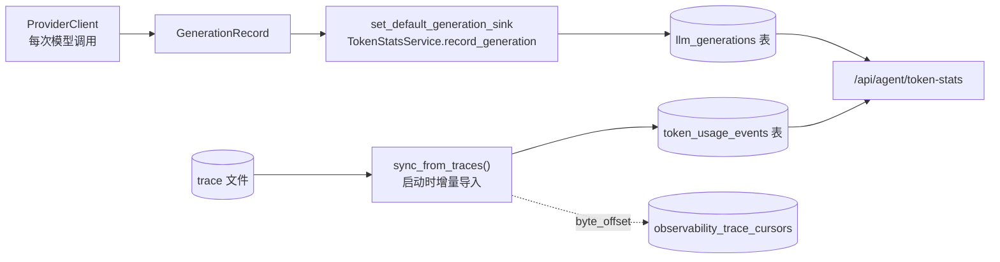

`llm_generations` 的字段设计值得单独说：

| 字段 | 为什么记 |
|---|---|
| `purpose` | 区分 interactive / gate / background / compaction / memory / routing |
| `cache_read_tokens` / `cache_write_tokens` | **prefix cache 命中率可度量**，这是成本优化能落地的前提 |
| `reasoning_tokens` | 推理模式的额外开销 |
| `ttft_ms` | 首 token 延迟——用户体感的主要指标 |
| `total_ms` | 总耗时 |
| `stream` | 流式与否 |
| `ok` | 成功与否 |
| `source_key` | **唯一索引**，保证重复导入不翻倍 |

**把缓存命中和首 token 延迟当成一等指标**，是这张表存在的意义。

---

## 12. 终端里怎么用

| 命令 | 打到哪个端点 |
|---|---|
| `/runs` | `GET /observability/runs` |
| `/trace [run-id]` | `GET /observability/runs/{id}/trace` + `/diagnosis` |
| `/token` | `GET /token-stats` |

`/trace` 不带参数时诊断最近一次运行。

一个典型的排查路径：

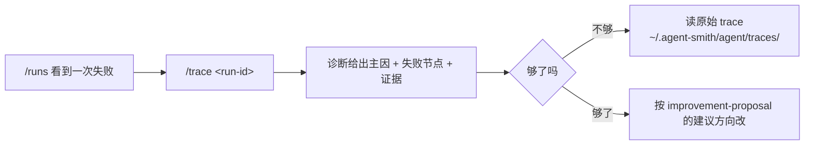

---

## 13. 参数速查

| 参数 | 值 | 位置 |
|---|---|---|
| trace 单值字符上限 | 4096 | `trace_store.py` |
| trace 递归深度上限 | 4 | `trace_store.py` |
| trace 列表项上限 | 100 | `trace_store.py` |
| 延迟 fsync 的事件类型 | 2（原始响应、试探性文本） | `trace_store.py` |
| 密钥值正则形状 | 9 种 | `trace_store.py` |
| 敏感键名正则 | 6 个词 | `trace_store.py` |
| token 安全键白名单 | 9 个 | `trace_store.py` |
| 保留：完成运行数 | 2000 | `index.py` |
| 保留：天数 | 90 | `index.py` |
| 保留：字节 | 512 MB | `index.py` |
| 错误类型名上限 | 100 字符 | `incidents.py` |
| 允许的错误 kind | 4 | `incidents.py` |
| 允许的错误 stage | 2 | `incidents.py` |
| 主事故优先级 | tool_timeout 0 / budget_exhausted 1 / run_failed 2 / 其它 3 | `diagnosis.py` |
| 比率精度 | 4 位小数 | `health.py` |
| summary schema 版本 | 1 | `summary_store.py` |
| run_id 正则 | `^[A-Za-z0-9_-]{1,128}$` | `summary_store.py` |

---

## 14. 设计取舍

**① 两条记录通道，两种优化目标。** trace 为诊断保留一切，summary 为查询保留计数。代价是要保证两者一致（token 键白名单必须同步）。

**② 脱敏分两层，因为键名看不见值里的密钥。** 第 2 层的正则修过一次真实泄漏（`TOOL_CALL_START` 写完整 shell 命令）。两处边界断言是承重的。

**③ 高频事件不 fsync，且有测试数次数。** 这是"可观测不能拖垮被观测者"的具体实现。

**④ 完整性失败不产出自动建议。** trace 被动过时，基于它的任何结论都不可信。

**⑤ 不信任自己写的日志。** 事故检测对 trace 里读出的错误详情做白名单过滤——因为那些文本来自 provider，而且会被 API 返回给前端。

**⑥ 建议永远需要审批，且优先建议行为改动而非参数放宽。** `budget_exhausted` 的建议是"减少重复调用"而不是"调高上限"。

**⑦ 指标要排除"用户正确地拒绝了"。** 否则指标会诱导用户少拒绝。

**⑧ 环境变量宽容，代码构造严格。** 同一个策略对象，两个入口两套校验强度。

---

## 14.1 贯穿全包的六条纪律

读完这一章会发现同样的手法在不同模块里反复出现。它们不是巧合，而是这个包成文的取向，也是判断一处改动是否合乎本包风格的现成检查表：

**① 观测失败不能让运行失败。** 出现在 `RunObservation.start()`（store 初始化失败置 `None`）、`RunEventRecorder.record()`（四处独立 try）、`_save_recovery_summary()`（持久化失败仍返回内存对象）。代价是可能丢观测数据，换来的是磁盘问题不会让用户的任务跑不了。

**② 读路径必须容忍任何版本写下的数据。** `recommendations.get(cat, 默认)`、`priority.get(cat, 3)`、`proposals.get(cat, 默认)`、`_execution_events` 的 `except ValueError`——四处都在处理"遇到不认识的东西"。新旧版本可以自由互读，不会因为多了一个枚举值就 500。

**③ 按结构化字段判断，不解析人类可读文本。** `is_timeout` 用 `timed_out` / `error_kind` 而非 reason 文本；`_failure_details` 只认紧邻终态的固定通知；trace 脱敏用带边界的正则而非子串。文本会变，字段有契约。

**④ 判据不可信时保守处理。** 时间戳解析失败 → 不删；status 是未知值 → 算失败；trace 校验失败 → 隔离而不是修补。**不可逆操作的判据必须可信**，可信度不足就不动。

**⑤ 该区分的地方才区分。** `tool_success_rate` 用 `None` / `0.0` 区分"无数据"和"全失败"，但 `success_rate` 就不区分——因为前者会误导，后者不会。不是所有字段都值得引入三态。

**⑥ 观察者不能改被观察的东西。** 三个类的 docstring 各自声明了这一点：诊断 "proposes changes but **never applies** them"、建议对象 "**never mutates** runtime configuration"、注册进来的投影通过依赖注入而非 import 拿到——`observability/` 不认识 `execution/`。整条链路从记录到建议，没有任何一处会自己动配置或动执行状态。这既是层边界（避免反向依赖），也是信任边界：一个能自动改配置的诊断系统，一旦判断错就会自己把问题放大。

这六条里，②④⑥在其他子系统同样成立（见 [05 · 记忆系统](./05-记忆系统.md) 的三道守卫、[06 · 安全与安全边界](./06-安全与安全边界.md) 的守卫先于挑战），可以当作阅读这套代码的通用预期。

---

## 15. 测试锁住了什么

`engine/tests/observability/` **47 个测试**。哈希链占了将近一半——因为防篡改是这个包唯一"不能只靠代码审查确认"的性质：必须真的构造出被改过的文件，验证它确实会被发现。

**攻击场景（11 个）**：每一个都是一种具体的改法。

| 测试 | 模拟的攻击 |
|---|---|
| `editing_a_record_breaks_the_hash` | 改一条记录的内容 |
| `deleting_a_middle_record_breaks_prev_hash` | 删中间一条 |
| `reordering_records_breaks_prev_hash` | 调换顺序 |
| `duplicate_seq_is_detected` | 伪造重复序号 |
| `plain_prefix_deletion_is_detected` | **砍掉开头一段** |
| `prefix_deletion_and_forged_refill_is_detected` | 砍掉开头再伪造填回 |
| `prefix_deletion_with_stripped_hash_is_detected` | 砍掉开头并抹掉哈希字段 |
| `first_chained_record_claiming_genesis_must_match_genesis` | 伪称自己是链首 |
| `unchained_record_after_chain_start_is_detected` | 链中插入无哈希记录 |
| **`rollback_after_seal_is_detected_by_anchor`** | **整体回滚到更早的合法版本** |
| `editing_a_legacy_record_is_detected` | 改老格式记录 |

最后一类"前缀删除"是链式哈希单独挡不住的：删掉开头 N 条，剩下的部分内部依然自洽。要发现它必须有独立锚点或链首约束——这正是 §2.4 里 `seal()` 存在的理由，也是 `rollback_after_seal_is_detected_by_anchor` 这个名字直接点明的。

**兼容与降级（4 个）**：`legacy_file_links_into_a_verifiable_chain`、`genuine_legacy_tail_still_verifies`、`editing_the_last_legacy_record_is_detected`、`verify_passes_on_missing_file`。老格式文件要能接进新链，且**仍然可被校验**；trace 文件不存在时校验通过（没有记录不等于记录被改）。

**本文各节对应的测试**：

| 章节 | 测试 |
|---|---|
| §2.2 写失败不影响投影 | **`recorder_continues_projecting_when_trace_write_fails`** |
| §2.4 route 绑定 | `observation_persists_the_route_selected_during_execution` |
| §3.2 按值脱敏 | `trace_store_redacts_embedded_credentials_in_values` |
| §3.2 token 指标不脱敏 | `keeps_non_secret_token_metrics`、`keeps_cache_and_reasoning_token_metrics` |
| §3.3 有界 | `trace_store_persists_bounded_event_records` |
| §3.4 延迟同步 | `trace_store_defers_sync_for_high_frequency_stream_events` |
| §4 隔离被篡改的 trace | **`reader_quarantines_a_tampered_trace_from_derived_observability`** |
| §5.2.3 审批超时 ≠ 工具超时 | **`incident_detector_does_not_flag_approval_timeout_as_tool_timeout`** |
| §5.2.3 真超时要报 | `incident_detector_flags_genuine_tool_timeouts` |
| §6.4 超时节点定位 | `diagnosis_recovers_timeout_failure_node_and_evidence` |
| §8.1 排除审批探针 | `health_tool_success_rate_ignores_approval_required_events` |
| §8.1 排除被拒审批 | `health_tool_success_rate_ignores_denied_approvals` |
| §9.4 保留最新的超大 run | **`observability_retention_keeps_the_newest_oversized_run`** |
| §9.5 只有 0 表示禁用 | `observability_retention_environment_only_uses_zero_to_disable` |
| §9.6 upsert 幂等 | `summary_index_reconciles_after_a_failed_upsert` |
| §10.3 只重放未结算的尾部 | **`interrupted_run_finalization_replays_only_the_unsettled_trace_tail`** |

加粗的六个对应本文里最容易在重构中被破坏的性质：写失败不能中断投影、被篡改的 trace 不能污染派生数据、审批超时不能算工具故障、最新记录不能因为太大被删、恢复不能重复累加。

还有三个测试锁住了正文没展开的读取优化：`trace_store_reads_only_the_requested_tail`（只读尾部）、`reads_only_records_appended_after_a_byte_cursor`（字节游标增量读）、`recovers_sequence_without_reading_the_whole_file`（不全文扫描就能恢复序号）。它们共同保证 trace 文件长到几百 MB 时读取代价仍然可控。`cursor_does_not_advance_past_an_incomplete_record` 则处理写到一半崩溃的场景——游标不能越过一条残缺记录，否则下次读会从半行中间开始解析。

---

## 16. 接下来

| 想深入 | 读 |
|---|---|
| 26 种事件类型分别是什么 | [03 · 架构总览](./03-架构总览.md) §3 |
| 哈希链的能力边界 | [06 · 安全与安全边界](./06-安全与安全边界.md) §10 |
| `GenerationRecord` 怎么产生 | [07 · LLM 集成](./07-LLM-集成.md) §8 |
| 7 个可观测端点的签名 | [09 · Server API 层](./09-Server-API层.md) §2.5 |
| 崩溃恢复的完整链路 | [03 · 架构总览](./03-架构总览.md) §9.2 |
