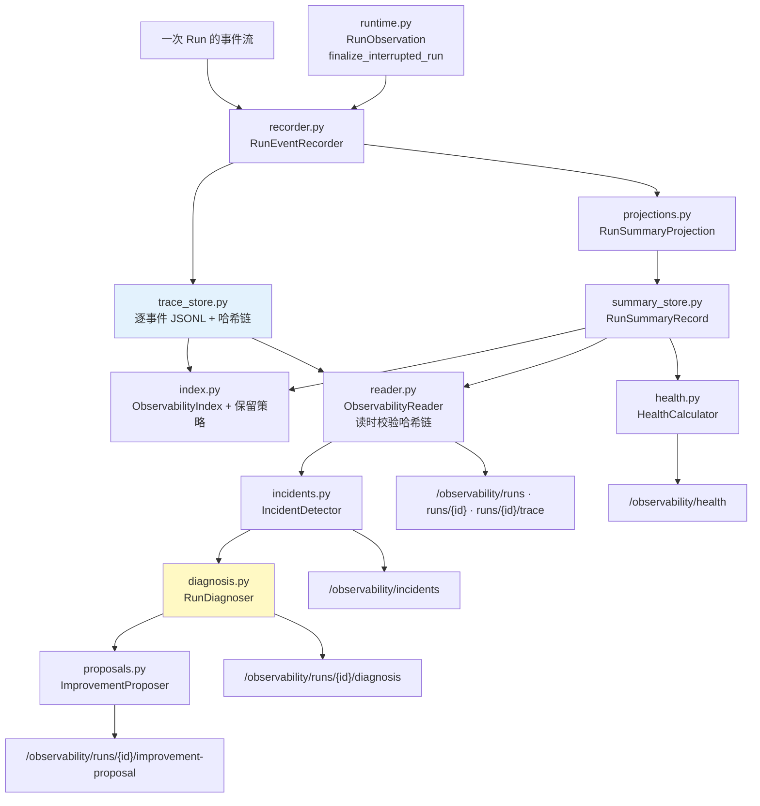
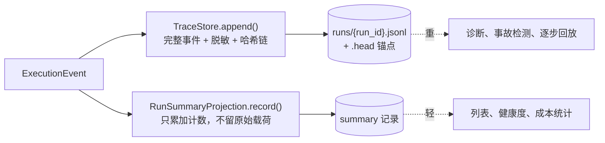
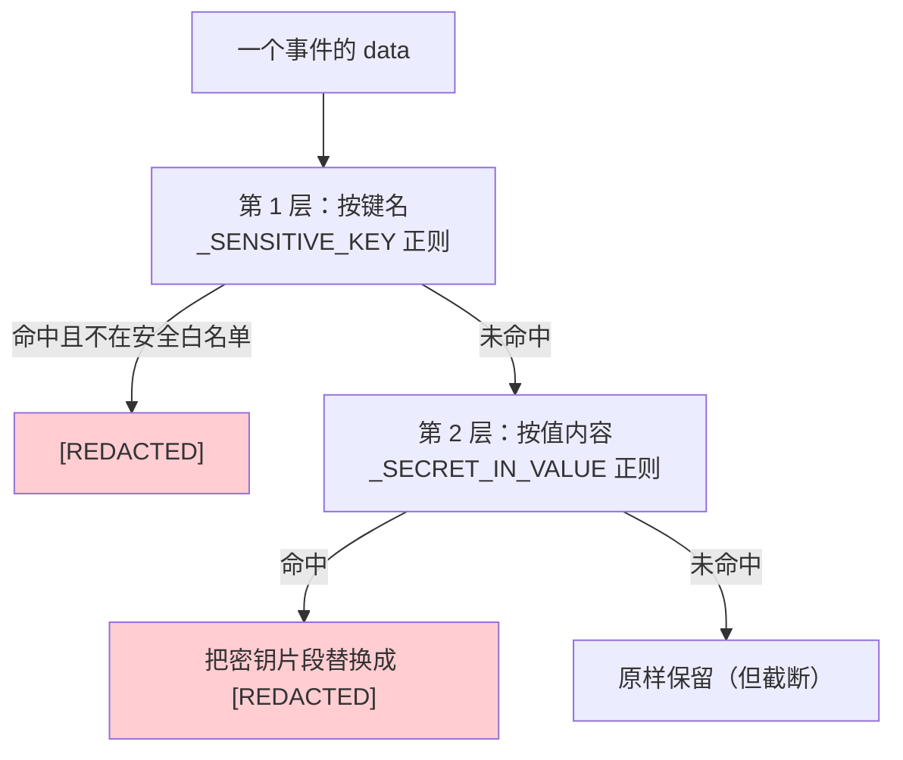
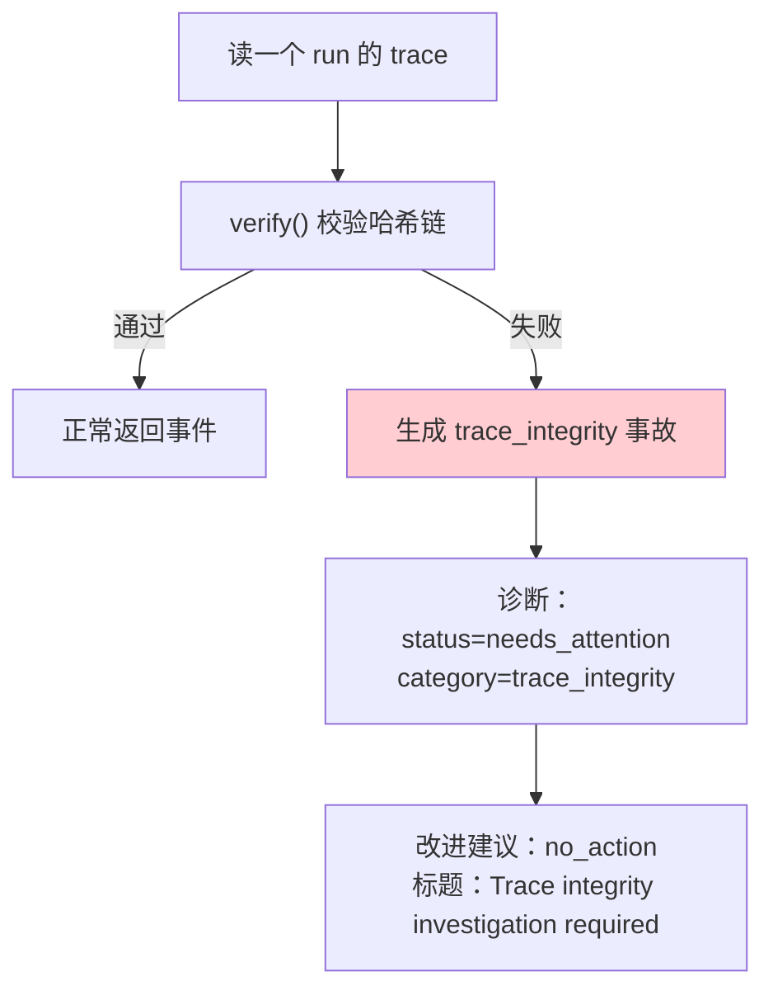
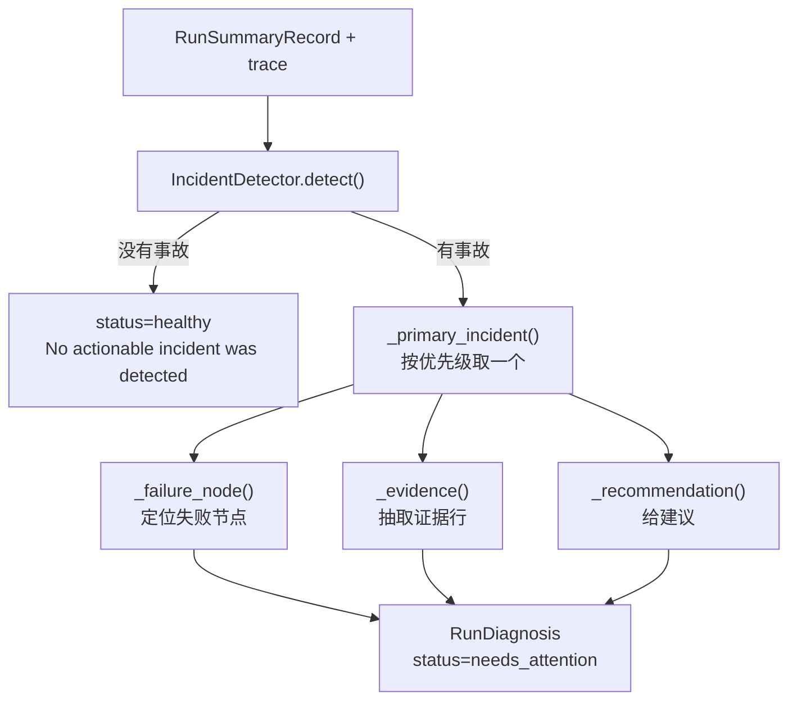
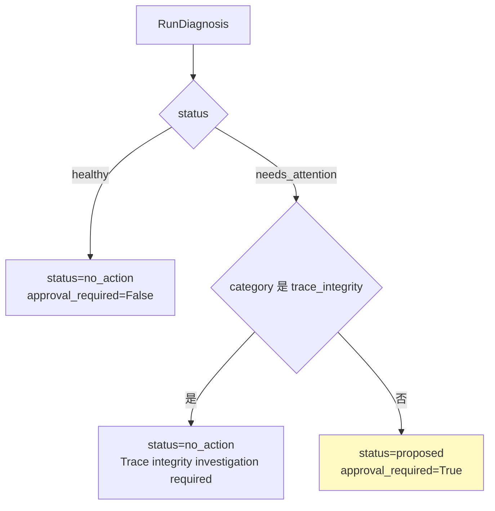
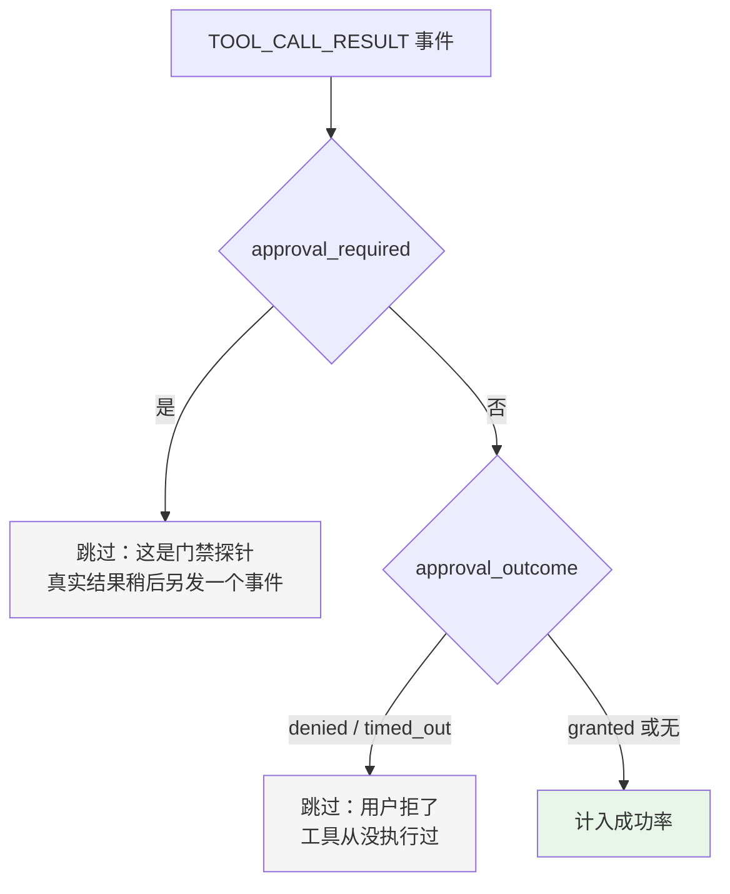
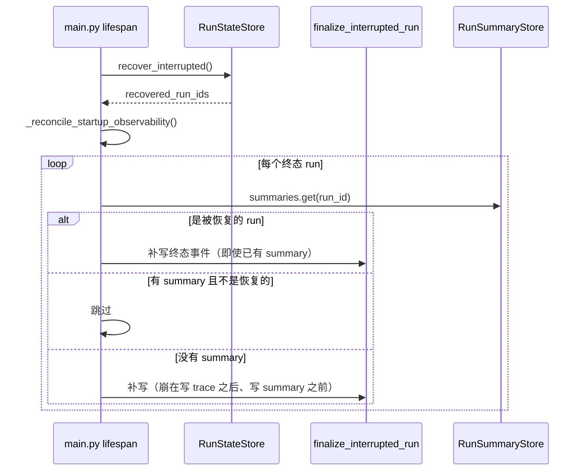
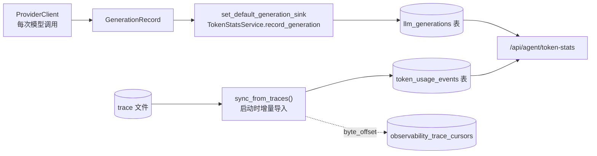
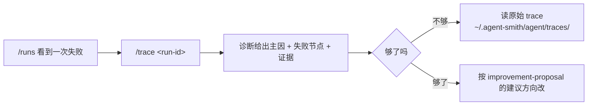

# 10 · 可观测性与诊断

> **定位**：`engine/observability/` 2.1k 行——一次运行留下什么档案、怎么防篡改、怎么脱敏、怎么自动分类事故、怎么算健康度、怎么产出改进建议。
> **适合**：想知道"Agent 昨天为什么失败"怎么查的人；想抄这套运行档案设计的人。

这个模块比 `engine/tool/`（1527 行）还大。**可观测性在这里不是"加个日志"，是一等公民。**

---

## 1. 全景



三条主线：

| 主线 | 模块 | 回答的问题 |
|---|---|---|
| **记录** | recorder / trace_store / projections / summary_store | 发生了什么 |
| **分析** | incidents / diagnosis / proposals | 为什么失败，该怎么改 |
| **聚合** | health / index | 整体状况如何，存多久 |

---

## 2. 记录：两条并行的通道

一次 run 同时产出**逐事件 trace** 和**聚合 summary**。



**为什么要两份**：列出最近 50 次运行时不该去读 50 个 trace 文件。summary 是**为查询优化的投影**，trace 是**为诊断保留的原始记录**。

`RunSummaryProjection` 的 docstring 点明了它的边界：

> Project events into a stable summary **without retaining raw payloads**.

它只累加计数：

| 字段 | 来源 |
|---|---|
| `event_count` / `event_counts` | 每种事件类型各多少个 |
| `tool_call_count` | `TOOL_CALL_START` 计数 |
| `backtrack_count` | `BACKTRACK` 计数 |
| `approval_required_count` | `TOOL_CALL_RESULT` 且 `approval_required` |
| `token_usage` | `TOKEN_USAGE` 的六个键累加（且**只接受非负 int**） |
| `outcome` / `reason` | 终态 |

---

## 3. Trace：防篡改 + 脱敏 + 有界

`engine/observability/trace_store.py` 是这个模块里设计最密的文件。

### 3.1 防篡改

```python
"""Records are hash-chained (``seq``/``prev_hash``/``hash``) so the trace is
tamper-evident: editing, reordering, or deleting a record breaks the chain and
is detected by TraceStore.verify.  TraceStore.seal anchors the chain head at
run end, making a later rollback detectable too."""
```

复用 `common/hash_chain.py`（见 [06 · 安全与安全边界](./06-安全与安全边界.md) §10）。**run 结束时封存锚点**，所以"把 trace 回滚到一个更短但自洽的版本"也能被发现。

### 3.2 两层脱敏



**第 1 层：按键名。**

```python
_SENSITIVE_KEY = re.compile(r"(?:token|secret|password|passwd|api[_-]?key|authorization)", re.I)
```

但这会误伤 token 计数字段，所以有一份白名单：

```python
# Numeric token-metric keys are not secrets and must persist as values, not
# "[REDACTED]" (the name-based redaction would otherwise hit the "token"
# substring).  Keep this in sync with projections.RunSummaryProjection's
# token keys so summary and trace agree about the same run.
_SAFE_METRIC_KEYS = {
    "input_tokens", "output_tokens", "total_tokens",
    "prompt_tokens", "completion_tokens", "context_tokens",
    "cache_read_tokens", "cache_write_tokens", "reasoning_tokens",
}
```

注意最后一句：**要和 `RunSummaryProjection` 的 token 键保持同步，否则 summary 和 trace 会对同一次运行给出不一致的说法**。又一处必须手工同步的清单。

**第 2 层：按值内容。** 这一层的注释记录了一个真实泄漏：

```python
# Name-based redaction cannot see a credential carried *inside* a value, and
# TOOL_CALL_START writes the full tool arguments — so a shell command holding a
# bearer token landed here verbatim, under the innocuous key "command".
```

`TOOL_CALL_START` 会写完整的工具参数。一条带 bearer token 的 shell 命令，键名是无辜的 `"command"`，第 1 层完全看不见。

于是有了 8 种密钥形状的正则：

| 模式 | 匹配 |
|---|---|
| `bearer\|basic <16+ 字符>` | HTTP 认证头 |
| `sk-[A-Za-z0-9_-]{16,}` | OpenAI / Anthropic 风格 |
| `gh[pousr]_[A-Za-z0-9]{20,}` | GitHub 经典 token |
| `github_pat_[A-Za-z0-9_]{20,}` | GitHub 细粒度 PAT |
| `glpat-[A-Za-z0-9_-]{16,}` | GitLab PAT |
| `AIza[0-9A-Za-z_-]{30,}` | Google API key |
| `AKIA[0-9A-Z]{12,}` | AWS key id |
| `xox[abprs]-[A-Za-z0-9-]{10,}` | Slack |
| `eyJ...\....\....` | JWT |

**两条边界条件是承重的**（注释原文）：

```python
# The leading (?<![A-Za-z0-9]) is essential, not decoration: "sk-" occurs inside
# ordinary kebab-case words — ta*sk-*scheduler, di*sk-*usage, ri*sk-*scoring —
# and without a boundary the pattern ate whole filenames.  The auth-header branch
# likewise needs a digit, or "Basic authentication" matched as a credential.
```

- 没有前置边界，`sk-` 会在 `task-scheduler`、`disk-usage`、`risk-scoring` 里命中，**把整个文件名吃掉**
- 认证头分支必须要求含数字（`(?=[A-Za-z0-9._~+/=-]*[0-9])`），否则 `Basic authentication` 这个词组会被当成凭据

这和 [08 · Agents 内容层](./08-Agents-内容层.md) §3.5 的 `\b` 是同一类问题：**边界断言不是装饰，去掉它正则就开始吃掉正常内容**。

### 3.3 有界

```python
_MAX_VALUE_CHARS = 4096
_MAX_DEPTH = 4
```

`_bounded_trace_value()` 递归处理：

| 类型 | 处理 |
|---|---|
| 深度 > 4 | `"[TRUNCATED]"` |
| dict | 逐键判定敏感性，递归 |
| list / tuple | **只取前 100 项**，递归 |
| str | 截断到 4096 字符后脱敏 |
| int / float / bool / None | 原样 |
| 其它 | `str()` 后截断脱敏 |

### 3.4 延迟同步

```python
_DEFERRED_SYNC_EVENTS = {
    EventType.RAW_RESPONSE_EVENT,
    EventType.PROVISIONAL_TEXT_DELTA,
}
```

这两类事件**每秒可能几十上百条**（流式的每一个 delta）。它们不 fsync，其余事件 fsync。

这直接对应 `hash_chain.py` docstring 里那条被测试固化的约束：

> `HashChainLog.append` 每条记录最多一次 `os.fsync`，而且**只在调用方要求时**（`test_trace_store_defers_sync_for_high_frequency_stream_events` 数 fsync 调用次数）。

**有一个测试专门数 fsync 次数**，防止有人"顺手"把所有事件都改成同步写。

---

## 4. 读取：读时校验完整性

`engine/observability/reader.py` 在读 trace 时会**验证哈希链**，失败时不是抛异常了事，而是**把完整性问题本身变成一个事故**：

```python
class TraceIntegrityError(ValueError): ...

def _trace_integrity_incident(...) -> RunIncident: ...
def _trace_integrity_diagnosis(...) -> RunDiagnosis: ...
def _integrity_evidence(verification: ChainVerification) -> dict[str, int | str]: ...
```



**完整性失败不产出自动改进建议**（`proposals.py` 里有一个专门分支返回 `status="no_action"`）。理由很直白：**trace 被动过的情况下，基于它做出的任何自动建议都不可信**。

还有一个 `_trace_matches_summary()` 做交叉校验——trace 和 summary 是两条独立写入的通道，它们对不上本身就是一个信号。

---

## 5. 事故检测

`engine/observability/incidents.py` 把运行失败**确定性地**分类。

### 5.1 事故的结构

```python
@dataclass(frozen=True)
class RunIncident:
    run_id: str
    agent_id: str
    severity: str
    category: str
    message: str
    reason: str | None
    occurred_at: str
    evidence: dict[str, int | str]
```

**每个事故都带 `evidence`**——不是只说"失败了"，而是给出可核对的数字。

### 5.2 分类依据

```python
if reason in {"preflight_budget", "tool_failure_budget", "tool_call_budget"}:
    ... category="budget_exhausted",
        evidence={"tool_calls": summary.tool_call_count}
```

主要类别：

| 类别 | 触发 |
|---|---|
| `budget_exhausted` | `reason` 是三种预算耗尽之一 |
| `tool_timeout` | trace 里有超时的工具结果 |
| `repeated_backtracks` | 回退次数超阈值 |
| `run_failed` | 终态失败 |
| `trace_integrity` | 哈希链校验失败（由 reader 产生） |

### 5.3 输入校验：不信任自己的日志

```python
_ERROR_KINDS = frozenset({"internal", "provider_http", "provider_protocol", "provider_transport"})
_ERROR_STAGES = frozenset({"runtime_prepare", "agent_execution"})
_ERROR_TYPE = re.compile(r"[A-Za-z_][A-Za-z0-9_]{0,99}\Z")
_PROVIDERS = frozenset({"anthropic", "openai"})
```

`_safe_error_details()` 用这些白名单**过滤从 trace 里读出来的错误详情**。为什么要过滤自己写的日志？因为：

1. trace 可能被改过（哈希链只能检测，不能阻止）
2. 错误文本来自 provider，是**外部输入**
3. 这些字段会被 API 返回给前端渲染

`_ERROR_TYPE` 的正则限制类型名必须是标识符形状且 ≤ 100 字符——一个从 provider 响应里抄来的"错误类型"不能是任意长度的任意字符串。

### 5.4 历史格式兼容

```python
_LEGACY_LLM_FAILURE = re.compile(
    r"⚠️ 执行失败：(?P<type>[A-Za-z_][A-Za-z0-9_]{0,99})（详情见服务端日志）\Z"
)
```

老版本把失败信息写成一句中文文本，新版本写结构化字段。这个正则让**老的运行档案仍然可诊断**——归档数据不能因为格式演进而变成不可读的。

---

## 6. 诊断：保守的根因分析

`engine/observability/diagnosis.py` 的类 docstring：

> Evidence-backed RCA that **proposes changes but never applies them**.



### 6.1 主事故的优先级

```python
def _primary_incident(incidents: list[RunIncident]) -> RunIncident:
    priority = {"tool_timeout": 0, "budget_exhausted": 1, "run_failed": 2}
    return min(incidents, key=lambda incident: priority.get(incident.category, 3))
```

一次运行可能有多个事故。取**最具体的那个**作为主因：

- `tool_timeout` 最具体——知道是哪个工具挂了
- `budget_exhausted` 次之——知道是预算问题，但不知道为什么反复调用
- `run_failed` 最泛——只知道失败了
- 未知类别排最后

**"最具体的失败信号是最有用的根因"**，这是一个可复用的排序原则。

### 6.2 只给一个诊断

不返回"这里有 5 个问题"，而是返回一个主因加它的证据。理由是：一次失败的 5 个事故里通常 4 个是第 1 个的后果。

---

## 7. 改进建议：审批门控

`engine/observability/proposals.py` 的类 docstring：

> A suggested local change; **this object never mutates runtime configuration**.



四种类别的建议模板，**每一条都在推迟直接的参数调整**：

| 类别 | 标题 | 建议 |
|---|---|---|
| `tool_timeout` | 审查工具超时策略 | **在验证目标之后**，提议一个范围受限的超时或重试策略调整 |
| `budget_exhausted` | 审查执行预算与计划 | 提议一个减少重复工具调用的技能或 prompt 调整，**而不是先改预算上限** |
| `repeated_backtracks` | 审查路由与技能退出条件 | 提议一个防止观察到的回退循环的路由或技能策略补丁 |
| `run_failed` | 审查失败的执行依赖 | **在检查保留的证据之后**，提议一个针对性的依赖、工具或 prompt 修正 |
| 兜底 | 审查运行前置条件 | **只有在阻塞条件被验证之后**才提议针对性变更 |

`budget_exhausted` 那条最能说明设计取向：**预算耗尽的正确修法不是加预算，是减少重复调用。** 一个会自动建议"把上限从 60 调到 120"的系统，会把一个行为问题掩盖成一个配置问题。

五条建议里有三条包含"验证之后"或"检查证据之后"——**这个模块不假装自己知道根因，它只把注意力引到正确的地方**。

---

## 8. 健康度

`engine/observability/health.py` 算一个运行窗口的聚合指标：

| 指标 | 含义 |
|---|---|
| `run_count` | 窗口内运行数 |
| `completed_count` / `unsuccessful_count` | 完成 / 未完成 |
| `success_rate` | 成功率（保留 4 位小数） |
| `tool_call_count` | 工具调用总数 |
| `tool_success_rate` | 工具成功率（**没有工具调用时为 `None` 而不是 0**） |
| `average_backtracks` | 平均回退次数 |
| `total_tokens` / `tokens_per_run` | Token 总量与均值 |

### 8.1 工具成功率的三个排除

这段注释是整个模块里最细的一处：

```python
# A pre-approval TOOL_CALL_RESULT (blocked=True, approval_required=True)
# is a gate probe, not an executed tool: the real result arrives later
# under a separate event.  Counting both would double-count one approved
# call as a failure plus a success, so skip the gate probe entirely.
# A denied/timed-out approval (blocked=True, approval_outcome in
# {denied, timed_out}) likewise never executed a tool — the user refused
# it before any side effect — so it must not drag tool_success_rate down
# either.  A granted approval emits the real result under
# approval_outcome="granted" and must still be counted.
```



不做这三个排除的后果：

- **门禁探针被计数** → 一次被批准的调用同时算一次失败和一次成功
- **被拒的审批被计数** → 用户主动拒绝一个危险操作，反而拉低了工具成功率

第二条尤其重要：**一个把"用户正确地拒绝了危险操作"记成失败的指标，会诱导用户少拒绝**。

### 8.2 `tool_success_rate` 为什么可以是 `None`

```python
tool_success_rate=_ratio(successful_tools, len(tool_results)) if tool_results else None
```

没有工具调用时返回 `None` 而不是 `0.0`。**"没有数据"和"成功率为零"是两回事**——同 `usage.py` 的 `usage_reported`、`ModelLimits` 的 `*_declared` 是同一条原则。

---

## 9. 保留策略

`engine/observability/index.py`：

```python
_DEFAULT_MAX_COMPLETED_RUNS = 2_000
_DEFAULT_MAX_AGE_DAYS = 90
_DEFAULT_MAX_BYTES = 512 * 1024 * 1024      # 512 MB
```

三条独立的界，任何一条超了就淘汰最老的。三个环境变量可覆盖：

| 环境变量 | 默认 |
|---|---|
| `AGENT_SMITH_OBSERVABILITY_MAX_RUNS` | 2000 |
| `AGENT_SMITH_OBSERVABILITY_MAX_AGE_DAYS` | 90 |
| `AGENT_SMITH_OBSERVABILITY_MAX_BYTES` | 512 MB |

### 9.1 `0` 表示禁用，非法值回落默认

```python
def _optional_positive_env(name: str, default: int) -> int | None:
    raw = os.environ.get(name)
    if raw is None or not raw.strip():
        return default
    try:
        parsed = int(raw)
    except ValueError:
        return default        # 解析不了 → 用默认，不炸
    if parsed == 0:
        return None           # 0 → 禁用这一条界
    return parsed if parsed > 0 else default   # 负数 → 用默认
```

三条约定：**空/非法 → 默认，`0` → 禁用，负数 → 默认**。

而 `ObservabilityRetentionPolicy.__post_init__` 对**代码构造**的策略更严格——非 `None` 的值必须为正，否则抛 `ValueError`。

**环境变量宽容（用户拼错不该让服务起不来），代码构造严格（程序错误要立刻暴露）。** 同一个概念在两个入口用两套严格度，是有意的。

---

## 10. 崩溃恢复

`engine/observability/runtime.py` 的 `finalize_interrupted_run()` 处理"进程崩了，run 没有终态事件"。



`_terminal_matches()` 用来判断"补写的终态事件是不是和已有的重复"——避免同一个 run 留下两条矛盾的终态。

`_execution_events()` 把持久化的记录读回成 `ExecutionEvent`，再用 `_summary_for()` 重算 summary。**恢复路径复用正常路径的投影逻辑**，而不是另写一套。

---

## 11. Generation 记账落库

Token 统计有两条数据源，最终汇到 `/api/agent/token-stats`：



`llm_generations` 的字段设计值得单独说：

| 字段 | 为什么记 |
|---|---|
| `purpose` | 区分 interactive / gate / background / compaction / memory / routing |
| `cache_read_tokens` / `cache_write_tokens` | **prefix cache 命中率可度量**，这是成本优化能落地的前提 |
| `reasoning_tokens` | 推理模式的额外开销 |
| `ttft_ms` | 首 token 延迟——用户体感的主要指标 |
| `total_ms` | 总耗时 |
| `stream` | 流式与否 |
| `ok` | 成功与否 |
| `source_key` | **唯一索引**，保证重复导入不翻倍 |

**把缓存命中和首 token 延迟当成一等指标**，是这张表存在的意义。

---

## 12. 终端里怎么用

| 命令 | 打到哪个端点 |
|---|---|
| `/runs` | `GET /observability/runs` |
| `/trace [run-id]` | `GET /observability/runs/{id}/trace` + `/diagnosis` |
| `/token` | `GET /token-stats` |

`/trace` 不带参数时诊断最近一次运行。

一个典型的排查路径：



---

## 13. 参数速查

| 参数 | 值 | 位置 |
|---|---|---|
| trace 单值字符上限 | 4096 | `trace_store.py` |
| trace 递归深度上限 | 4 | `trace_store.py` |
| trace 列表项上限 | 100 | `trace_store.py` |
| 延迟 fsync 的事件类型 | 2（原始响应、试探性文本） | `trace_store.py` |
| 密钥值正则形状 | 9 种 | `trace_store.py` |
| 敏感键名正则 | 6 个词 | `trace_store.py` |
| token 安全键白名单 | 9 个 | `trace_store.py` |
| 保留：完成运行数 | 2000 | `index.py` |
| 保留：天数 | 90 | `index.py` |
| 保留：字节 | 512 MB | `index.py` |
| 错误类型名上限 | 100 字符 | `incidents.py` |
| 允许的错误 kind | 4 | `incidents.py` |
| 允许的错误 stage | 2 | `incidents.py` |
| 主事故优先级 | tool_timeout 0 / budget_exhausted 1 / run_failed 2 / 其它 3 | `diagnosis.py` |
| 比率精度 | 4 位小数 | `health.py` |
| summary schema 版本 | 1 | `summary_store.py` |
| run_id 正则 | `^[A-Za-z0-9_-]{1,128}$` | `summary_store.py` |

---

## 14. 设计取舍

**① 两条记录通道，两种优化目标。** trace 为诊断保留一切，summary 为查询保留计数。代价是要保证两者一致（token 键白名单必须同步）。

**② 脱敏分两层，因为键名看不见值里的密钥。** 第 2 层的正则修过一次真实泄漏（`TOOL_CALL_START` 写完整 shell 命令）。两处边界断言是承重的。

**③ 高频事件不 fsync，且有测试数次数。** 这是"可观测不能拖垮被观测者"的具体实现。

**④ 完整性失败不产出自动建议。** trace 被动过时，基于它的任何结论都不可信。

**⑤ 不信任自己写的日志。** 事故检测对 trace 里读出的错误详情做白名单过滤——因为那些文本来自 provider，而且会被 API 返回给前端。

**⑥ 建议永远需要审批，且优先建议行为改动而非参数放宽。** `budget_exhausted` 的建议是"减少重复调用"而不是"调高上限"。

**⑦ 指标要排除"用户正确地拒绝了"。** 否则指标会诱导用户少拒绝。

**⑧ 环境变量宽容，代码构造严格。** 同一个策略对象，两个入口两套校验强度。

---

## 15. 接下来

| 想深入 | 读 |
|---|---|
| 26 种事件类型分别是什么 | [03 · 架构总览](./03-架构总览.md) §3 |
| 哈希链的能力边界 | [06 · 安全与安全边界](./06-安全与安全边界.md) §10 |
| `GenerationRecord` 怎么产生 | [07 · LLM 集成](./07-LLM-集成.md) §8 |
| 7 个可观测端点的签名 | [09 · Server API 层](./09-Server-API层.md) §2.5 |
| 崩溃恢复的完整链路 | [03 · 架构总览](./03-架构总览.md) §9.2 |
