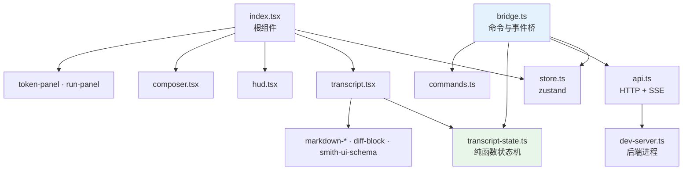
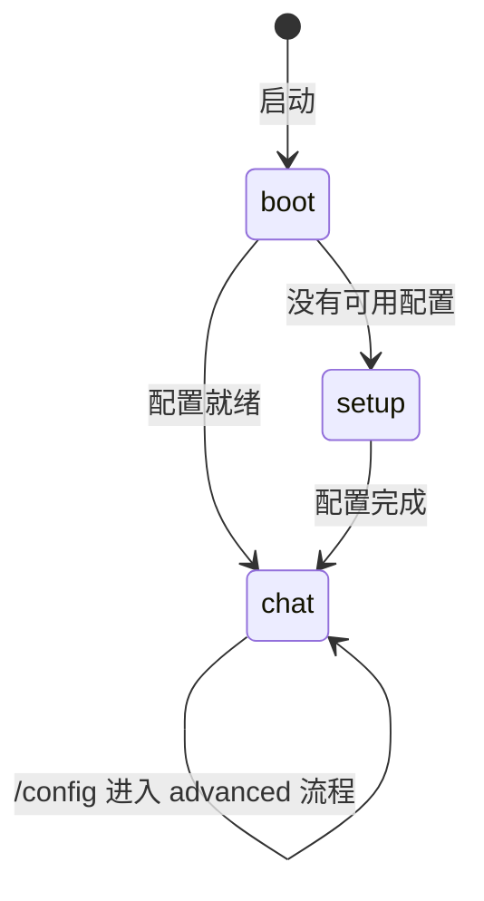
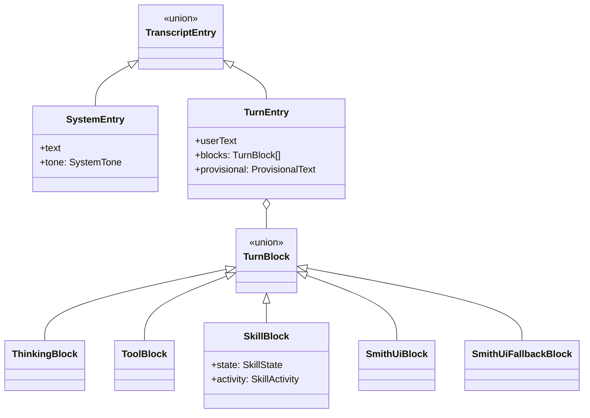
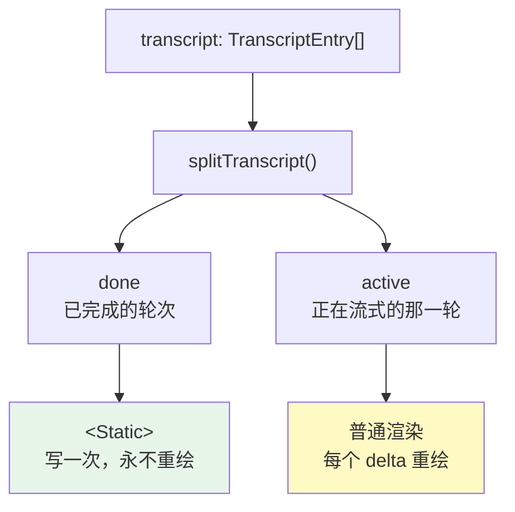
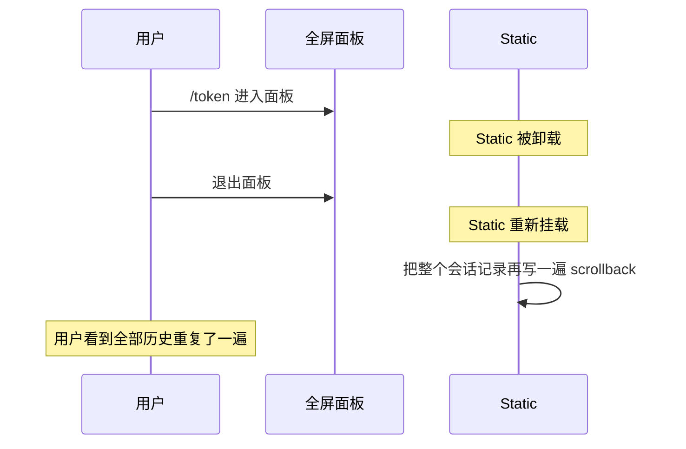
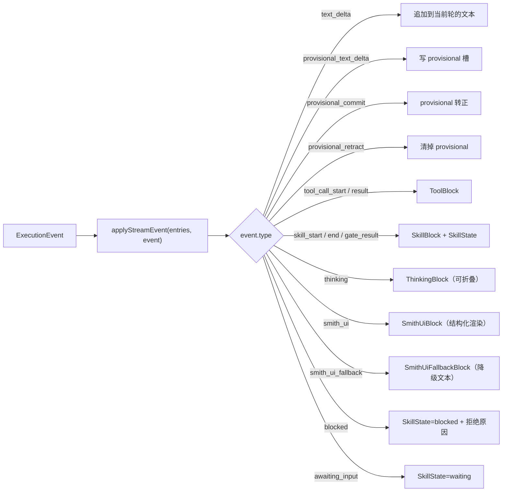
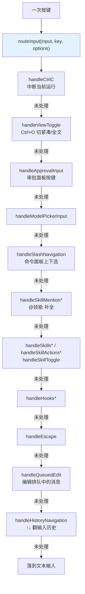
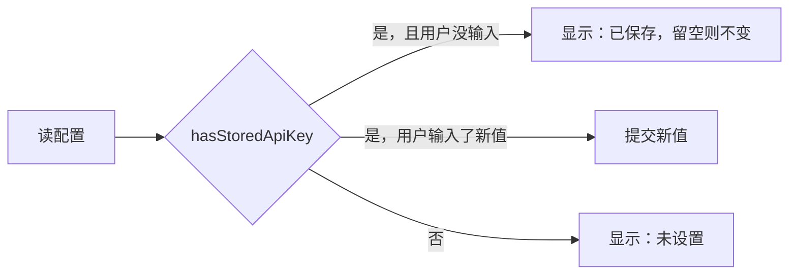
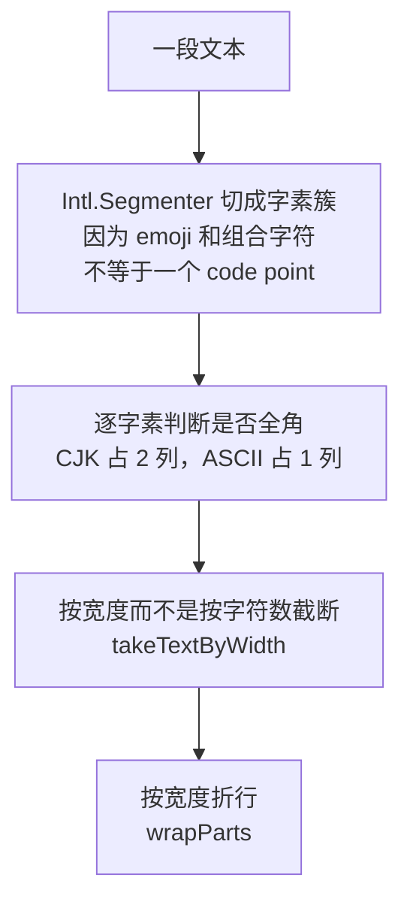
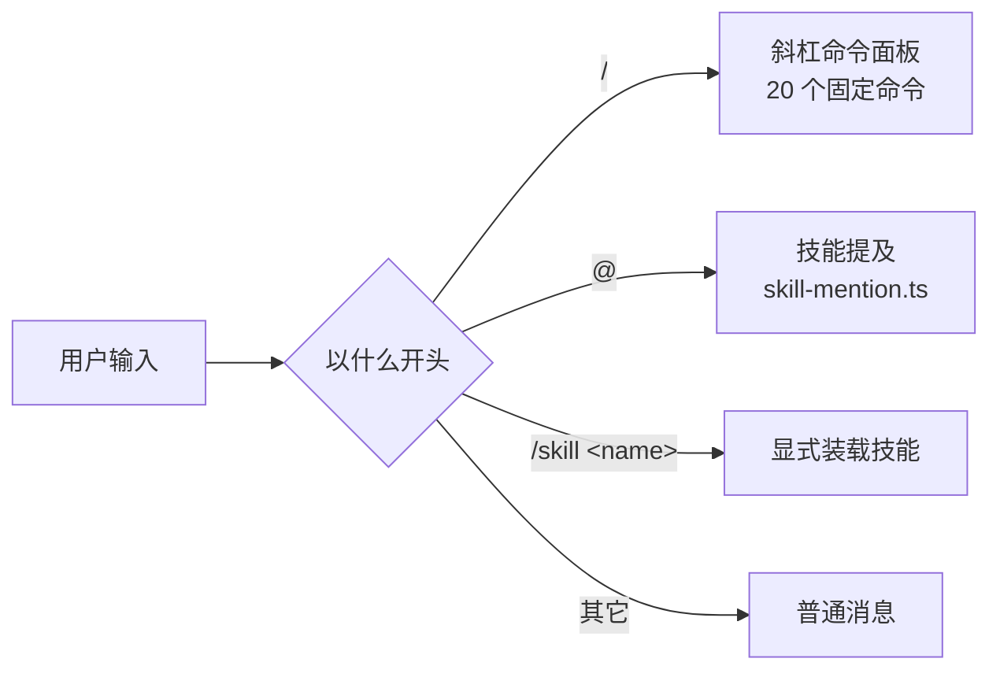

# 11 · Shell 终端 UI

> **定位**：`shell/` 16.4k 行 TypeScript（含测试）——用 Ink/React 把终端当成渲染目标，消费 SSE 事件流，自动拉起并守护后端进程。
> **适合**：要改终端体验的人；想知道"为什么终端 UI 也需要 zustand 和 epoch"的人。

---

## 1. 技术选型

| 技术 | 版本 | 用途 |
|---|---|---|
| **Ink** | `^7.1.1` | 把终端当 React 渲染目标 |
| **React** | `^19.2.0` | 组件与状态 |
| **zustand** | `^5.0.14` | 应用状态容器 |
| **marked** | `^18.0.7` | Markdown 解析 |
| **shiki** | `4.3.1`（**精确锁定**） | 代码高亮 |
| **string-width** | `^8.2.1` | 终端宽字符宽度计算 |
| `@assistant-ui/react-ink-markdown` | `^0.0.30` | Markdown 渲染 |
| `@assistant-ui/tap` | `^0.9.4` | **幽灵 peer 依赖** |
| `@json-render/core` + `/ink` | `^0.19.0` | 结构化 UI 渲染（`render_ui` 工具） |
| `ink-picture` / `ink-spinner` | `^2.1.0` / `^5.0.0` | 图片与加载动画 |
| Node.js | `>= 22` | 运行时 |

### 1.1 三个非显然的依赖决定

**① `overrides: { "ink": "$ink" }`**

某些依赖的 peer 声明锁死 `ink ^6`。因为 Shell 只用了 `Box` / `Text` / `useInput` / `Static` / `render` 这几个稳定 API，用 `overrides` 强制统一到 ink 7 是安全的。

升到 7 修掉了两个真实缺陷：**粘贴导致的崩溃**（上游 issue #901）和 **`Static` 组件的重复重印**。

**② `@assistant-ui/tap` 是幽灵 peer 依赖**

代码里**没有任何 `import` 语句引用它**，但运行时必需。后果：

- 死代码清理工具会建议删掉它
- `npm install` 可能因为依赖树重算而不装它
- 只有 `npm ci` 能暴露这类问题

**③ `shiki` 精确锁定 `4.3.1`（无 `^`）**

高亮器的输出直接影响终端渲染，一个 minor 升级改变了转义序列就会破坏布局。

---

## 2. 模块地图

| 文件 | 行数 | 职责 |
|---|---|---|
| `index.tsx` | 1299 | 根组件、`Static` 管理、面板切换 |
| `bridge.ts` | 1103 | 前后端桥接：命令分发、流式消费、状态写入 |
| `api.ts` | 1053 | HTTP 客户端、SSE 解析、鉴权头 |
| `transcript-state.ts` | 668 | 会话记录的纯函数状态机 |
| `transcript.tsx` | 659 | 会话记录渲染 |
| `store.ts` | 496 | zustand store |
| `hud.tsx` | 476 | 状态栏 |
| `input.ts` | 475 | 输入处理与按键 |
| `dev-server.ts` | 473 | 后端进程生命周期 |
| `commands.ts` | 418 | 20 个斜杠命令 |
| `setup.ts` | 412 | 首次配置向导 |
| `smith-ui-schema.ts` | 391 | 结构化 UI 的 schema 校验 |
| `diff-block.tsx` | 371 | diff 渲染 |
| `markdown-table.tsx` | 285 | 表格渲染 |
| `token-panel.tsx` | 273 | Token 面板 |



**`transcript-state.ts` 是纯函数**——`applyStreamEvent(entries, event) → entries`。所有会话记录的变换都是"旧状态 + 事件 → 新状态"，没有副作用。这让它能被单元测试完整覆盖（`transcript-state.test.ts` 512 行）。

---

## 3. 状态模型

### 3.1 三个顶层模式

```typescript
export type Mode = "boot" | "setup" | "chat";
export type SetupFlow = "initial" | "advanced";
```



### 3.2 会话记录的类型层次



**技能状态有七个**：

```typescript
export type SkillState = "running" | "retry" | "waiting" | "done" | "blocked" | "error" | "cancelled";
```

对应管线的真实语义——`retry` 是门禁不过重跑，`waiting` 是节点等用户输入，`blocked` 是被守卫拦下。**这三个状态在别的 Agent 终端里通常没有对应物**，因为它们没有门禁和管线。

### 3.3 会话记录的上限

```typescript
export const TRANSCRIPT_LIMIT = 200;
export const TRANSCRIPT_TRIM_TARGET = 150;
```

**双阈值**：超过 200 时裁到 150，而不是每超一条裁一条。避免在 200 附近反复触发裁剪（抖动）。

---

## 4. `Static` 与重印问题

这是 Ink 终端 UI 最核心也最容易出错的一件事。

### 4.1 `Static` 是什么

Ink 的 `<Static>` 把内容**一次性写进 scrollback**，之后不再重绘。已完成的会话记录必须走 `Static`，否则每次状态更新都会重绘整个历史——终端会闪烁并且极慢。

```typescript
/** Items rendered once through <Static>: the hero banner plus every completed entry. */
type StaticItem = { kind: "hero"; id: string } | TranscriptEntry;

const { done, active } = useMemo(() => splitTranscript(transcript), [transcript]);
const staticItems = useMemo<StaticItem[]>(() => [{ kind: "hero", id: "hero" }, ...done], [done]);
```

`splitTranscript()` 把会话记录切成 `done`（进 `Static`）和 `active`（正常渲染，会重绘）。



### 4.2 全屏面板导致的整卷重印

```typescript
// Entering or leaving the full-screen tokens/runs panels unmounts and later
// remounts <Static>, which reprints the whole transcript into scrollback.
// Clear and bump the epoch on the transition so it repaints exactly once,
// matching the /clear, /new, and /resume paths.
clearTerminal();
getState().set({ transcriptEpoch: getState().transcriptEpoch + 1 });
```

问题链条：



修法是 **epoch + clearTerminal**：切换时清屏并把 `transcriptEpoch` 加一，强制 `Static` 认为这是全新内容，**正好重绘一次**。

同一套处理还用在 `/clear`、`/new`、`/resume` 三条路径上——它们都会让会话记录整体替换。

### 4.3 `Box` 只 wrap 不裁剪

Ink 的 `Box` 对超宽内容**折行而不裁剪**。这意味着：

- 一个超宽的表格不会被截断，而是折成多行，破坏对齐
- **用普通断言测不出来**——组件树里的文本是完整的，折行发生在终端渲染层

所以宽度相关的行为必须用**真 PTY** 验证：

```bash
script -q /dev/null bash -c 'stty -icrnl; <逐字符喂键>'
```

`string-width` 依赖就是为此存在的——CJK 字符占两列，用 `.length` 算宽度会全错。

---

## 5. SSE 消费

### 5.1 CRLF 幻影帧

SSE 的帧分隔符是空行。如果按 `\n\n` 切帧而不处理 `\r\n\r\n`，在 CRLF 环境下会切出**空帧**，解析成一个空事件对象。

症状是终端里出现莫名其妙的空白块或"幽灵"渲染，而后端日志完全正常。

### 5.2 事件到状态的映射



### 5.3 试探性文本的三态

这是管线场景独有的（见 [03 · 架构总览](./03-架构总览.md) §3.2）：

| 事件 | 终端行为 |
|---|---|
| `PROVISIONAL_TEXT_DELTA` | 边流边显示 |
| `PROVISIONAL_COMMIT` | 转成正式文本，落进 `done` |
| `PROVISIONAL_RETRACT` | **从界面上抹掉** |

撤回是终端 UI 里少见的操作——大多数流式 UI 只追加不回退。这里必须支持，否则门禁不过重跑时用户会看到两份内容。

`ProvisionalText` 是 `TurnEntry` 上的一个独立字段而不是一个 block，正是因为它需要被整体替换或清空。

### 5.4 中断与重启

```typescript
export function interruptLatestTurn(...)
export function restartLatestTurn(entries: TranscriptEntry[]): TranscriptEntry[]
export function closeLatestTurn(entries: TranscriptEntry[]): TranscriptEntry[]
```

三个纯函数分别处理：用户按 Ctrl+C 中断、恢复一个被中断的运行、正常结束一轮。

`restoreTranscript(messages)` 从服务端拉回的历史消息重建会话记录——用于 `/resume` 和切换会话。

---

## 6. 输入路由：19 个处理器的责任链

`input.ts`（475 行）把按键处理拆成 19 个独立函数，`routeInput()` 按顺序调用，**每个返回 `boolean` 表示"我处理了，别再往下传"**。



**责任链而不是一个大 switch** 的收益是可测性：`input.test.ts` 有 570 行，每个 handler 都能被单独喂一个按键断言返回值。

### 6.1 面板导航是一套重复的模式

`handleSlashNavigation` / `handleSkillsNavigation` / `handleHooksNavigation` / `handleSkillMentionNavigation` 结构几乎一样——上下移动一个索引。对应 `store.ts` 里四个独立的索引字段：

```typescript
slashIndex: number;
skillsIndex: number;
skillActionIndex: number;
hooksIndex: number;
skillMentionIndex: number;
```

**每个面板一个索引**而不是共享一个"当前选中项"，因为面板可以嵌套（技能列表 → 技能操作），共享索引会在返回时丢掉位置。

`list-navigation.ts`（64 行）抽出了共同的"上下 + 环绕"逻辑。

### 6.2 输入历史的三个字段

```typescript
inputValue: string;
inputHistory: string[];
historyIndex: number;
historyDraft: string;      // ← 关键
```

`historyDraft` 存的是**开始翻历史之前用户正在写的那一行**。没有它，用户按 ↑ 看了一眼历史再按 ↓ 回来，自己写了一半的内容就没了。

`exitHistoryBrowsing(state)` 是显式的退出函数——任何非导航按键都要调它，把 `historyIndex` 复位。

历史持久化在 `~/.agent-smith/shell_history.json`。

### 6.3 一条注释里的坑

```typescript
// The data-backed panels load through the bridge; setting `panel` alone would
// strand them on their loading placeholder with no request behind it.
```

`tokens` / `runs` 这类面板需要先发请求。**只改 `panel` 状态会让它永远停在"加载中"**——因为没有任何东西去发那个请求。所以打开这类面板必须走 bridge 的方法而不是直接 `set({panel: "tokens"})`。

---

## 7. 状态容器：一个扁平的 `AppState`

`store.ts` 的 `AppState` 有 **45 个字段**，全部扁平。没有嵌套的 `ui.panels.skills.index` 这种结构。

按用途分组：

| 组 | 字段 |
|---|---|
| 模式与面板 | `mode`、`panel`、`viewMode` |
| 连接与配置 | `baseUrl`、`config`、`agent` |
| 数据缓存 | `sessions`、`skills`、`mcpServers`、`tokenStats`、`observability*` |
| 会话记录 | `transcript`、`transcriptEpoch`、`turnCount` |
| 用量 | `turnTokenUsage`、`tokenUsage`、`contextUsage`、`tokenTab` |
| 运行态 | `busy`、`compressing`、`inputLocked`、`runStartedAt`、`recoverableRunId` |
| 审批 | `pendingApproval`、`approvalIndex`、`approvalResolving`、`lastToolCallId` |
| 输入 | `inputValue`、`inputHistory`、`historyIndex`、`historyDraft`、`statusLine` |
| 面板索引 | 五个 `*Index` |
| 配置向导 | `setupDraft`、`setupFlow`、`setupIndex` |
| 其它 | `pendingSkill`、`queuedMessages`、`modelPicker`、`selectedModelProfile`、`welcomeNotice` |

四个字段带着解释性注释，都是"不写下来就会被删掉"的那种：

| 字段 | 注释 |
|---|---|
| `transcriptEpoch` | 会话记录被整体替换时递增——**重挂 `<Static>`** |
| `turnTokenUsage` | 当前这条用户消息**及其 Agent 工作**累积的用量 |
| `recoverableRunId` | 最后一个未完成的运行，**留着让断开的 Shell 能恢复它** |
| `lastToolCallId` | 其结果**可能落定挂起审批**的那次工具调用 |

最后一个尤其微妙：审批面板要知道"我等的那个工具调用回来了没有"，而工具结果事件和审批解析是两条独立的路径。

### 7.1 十个 action

```typescript
set · pushSystemLine · pushHistory · pushTurn · applyEvent
closeTurn · interruptTurn · resetChat · clearChat · startFreshSession · hydrate
```

`resetChat` / `clearChat` / `startFreshSession` **三个都是"开新的"，但语义不同**：

| action | 服务端 | 本地历史 |
|---|---|---|
| `startFreshSession`（`/new`） | 建新会话 | 保留（进 scrollback） |
| `clearChat`（`/clear`） | **删掉**当前会话 | 清空 |
| `resetChat` | — | 清空（内部用） |

---

## 8. 配置向导

`setup.ts`（412 行）驱动首次配置和 `/config`。

### 8.1 两套字段集

```typescript
export const INITIAL_SETUP_FIELDS = [...]   // 首次配置：最小必需
export const SETUP_FIELDS = [...]           // /config advanced：全部
export type SetupField = (typeof INITIAL_SETUP_FIELDS)[number] | (typeof SETUP_FIELDS)[number];
```

`setupFields(flow)` 按 `flow`（`"initial"` / `"advanced"`）返回对应的字段列表。

**首次配置只问最少的问题**——一个上来就要填 13 个字段的向导会把人劝退。

### 8.2 API Key 的三态显示

```typescript
export function isApiKeySetupField(field: SetupField): boolean
export function hasStoredApiKey(config: LlmConfig | null, field: SetupField): boolean

const ROUTE_SECRET_FIELDS = ["interactive_api_key", "gate_api_key", "background_api_key"]
```

因为 `api_key` 是**只写不读**的（见 [07 · LLM 集成](./07-LLM-集成.md) §2.2），配置读回来时这个字段永远是空的。于是向导要区分三种状态：



不做这个区分，用户每次进 `/config` 都会看到一个空的 API Key 框，以为自己没配过。

### 8.3 `PROVIDER_PRESETS` 与 `setProvider`

```typescript
export const PROVIDER_PRESETS = {...}
export function setProvider(draft: SetupDraft, value: string): SetupDraft | null
```

选 provider 时自动填 `base_url` 等预设值。返回 `null` 表示这个 provider 名不认识——**由调用方决定是拒绝还是当自定义值接受**。

### 8.4 三条路由 × 五个超时字段

```typescript
const LLM_USAGES = ["interactive", "gate", "background"] as const satisfies readonly LlmUsage[];
const TIMEOUT_FIELDS = ["connect", "read", "stream_read", "write", "pool"] as const;
```

`as const satisfies readonly LlmUsage[]` 这个写法让 TypeScript **同时**做两件事：保留字面量类型（`"interactive" | "gate" | "background"`）**并且**校验它们确实都是合法的 `LlmUsage`。写错一个名字会在编译期报错。

`buildLlmConfigInput()` 把向导草稿转成 `POST /api/config/llm` 的载荷。

---

## 9. HUD：终端宽度是自己算的

`hud.tsx`（476 行）里有一半是**字符宽度计算**，因为终端没有布局引擎。

```typescript
const GRAPHEME_SEGMENTER = ...              // Intl.Segmenter
function segmentGraphemes(text: string): string[]
function isFullWidthCodePoint(codePoint: number): boolean
function graphemeWidth(grapheme: string): number
function textWidth(text: string): number
function partWidth(part: HudPart): number
function lineWidth(parts: HudPart[]): number
function takeTextByWidth(text: string, maxWidth: number): string
function truncatePart(part: HudPart, maxWidth: number): HudPart
function wrapParts(parts: HudPart[], maxWidth: number): HudPart[][]
```

**十个函数只为回答"这段文本在终端里占几列"**。三层难点：



**用 `.length` 会全错**：一个 emoji 可能是 2–7 个 code point 但占 2 列；一个 CJK 字符是 1 个 code point 但占 2 列。

`SEP_WIDTH = 3` 是分隔符 `" │ "` 的宽度——连它都要显式算进去。

### 9.1 HUD 里的两个后台轮询

```typescript
export const MEMORY_POLL_INTERVAL_MS = 10_000;
export const MEMORY_FAILURE_STREAK_THRESHOLD = 3;

function useGitBranch(cwd: string): string | null
function useMemoryMaintenance(baseUrl: string): MemoryMaintenance | null
export function memoryMaintenanceStalled(maintenance): boolean
export function memoryMaintenanceLabel(maintenance): string | null
```

| 轮询 | 间隔 | 显示 |
|---|---|---|
| git 分支（`execGit`） | 随 cwd 变化 | 当前分支名 |
| 记忆维护状态 | 10 秒 | 编译停滞时的提示 |

**连续 3 次失败才算"停滞"**（`MEMORY_FAILURE_STREAK_THRESHOLD`）——一次瞬时失败不该在状态栏亮红灯。这和记忆系统本身"`rejected` / `failed` 不计入跳过计数"（见 [05 · 记忆系统](./05-记忆系统.md) §9.1）是同一条判断：**区分"这次没成"和"一直不成"**。

`memoryMaintenanceStalled()` 和 `memoryMaintenanceLabel()` 被导出，所以它们有独立的单元测试（`hud.test.ts`）。

---

## 10. 后端进程生命周期

`dev-server.ts`（473 行）的完整决策流见 [02 · 快速上手](./02-快速上手.md) §6.1。这里补三个实现要点。

### 10.1 26 条 API 契约

```typescript
export const REQUIRED_API_OPERATIONS = [
  { method: "GET",  path: "/api/config/llm" },
  { method: "POST", path: "/api/agent/sessions/{session_id}/messages/stream" },
  // ... 共 26 条
] as const;

export function findMissingApiOperations(paths: Record<string, unknown>): string[]
```

启动时拿 `/openapi.json` 逐条比对。**把运行时的怪异故障提前成启动期的明确报错。**

### 10.2 `stale` 缺失等同于 `stale=true`

```typescript
if (typeof payload.stale !== "boolean") return "it is too old to report whether its code is current";
```

注释解释：**最陈旧的后端恰恰最不可能报告自己陈旧**——因为它跑的是还没有这个字段的老代码。所以"缺字段"必须和"报告 true"同等对待。

这是一个可复用的判断模式：**当一个自检字段是后加的，缺失它就等于最坏情况**。

### 10.3 进程组信号

```typescript
// `uv run uvicorn ...` spawns uvicorn as a grandchild; signalling only the `uv`
// wrapper lets the port-holding uvicorn survive as an orphan.
```

`spawn` 用 `detached: true`，结束时给**负 pid** 发信号覆盖整个进程组。

而 `stopOwnedServer()` 在硬超时后**故意不清空**引用：

```typescript
// Do NOT clear ownedServer here: if the child survives the hard timeout, the
// [next attempt must] signal it instead of leaving a port-holding orphan unreachable.
```

三个超时常量：

| 常量 | 值 |
|---|---|
| `SERVER_PROBE_TIMEOUT_MS` | 3000 |
| 端口扫描范围 | `preferredPort` 起 21 个 |
| 复用失败时的起点 | `preferredPort + 1` |

---

## 11. 命令与技能的分离

`commands.ts` 里有一句注释是产品决策：

```typescript
/** Skills are reached through `@name` and `/skill`, never through this palette. */
```



**技能不进命令面板**，因为技能数量会增长（现在 16 个，用户还能装），混进去会淹没真正的命令。

`skill-mention.ts` + `isSkillEnabled()` 负责 `@name` 的补全与校验。

---

## 12. 渲染子系统

| 模块 | 处理 |
|---|---|
| `streaming-markdown.ts` | 流式 Markdown——内容还没写完就要渲染 |
| `markdown-segments.ts` | 把 Markdown 切成可独立渲染的段 |
| `markdown-layout.ts` | 布局计算 |
| `markdown-table.tsx` | 表格（285 行，因为终端表格要手工算列宽） |
| `diff-block.tsx` | diff 高亮（371 行） |
| `text-layout.ts` | 文本布局与换行 |
| `smith-ui-schema.ts` | 结构化 UI 的 schema 校验（391 行） |
| `sanitize.ts` | 输入清洗 |

### 12.1 流式 Markdown 的难点

普通 Markdown 渲染器假设输入是完整的。流式场景下：

```
收到 "```pyth"     → 这是一个代码围栏的开头，还是普通文本？
收到 "```python\nx" → 现在确定是代码块了
```

**代码围栏误判**是踩过的坑——一个未闭合的围栏会让后面所有内容都被当成代码。`streaming-markdown.ts` 要在"内容不完整"的前提下做出可撤销的渲染决定。

### 12.2 `smith-ui-schema.ts`：结构化 UI 要校验

`render_ui` 工具让模型能产出结构化 UI（表单、列表、卡片）。但模型的输出**是不可信的**——一个不符合 schema 的载荷会让渲染器崩溃，进而崩掉整个终端。

所以有 391 行的 schema 校验，校验失败时降级成 `SMITH_UI_FALLBACK` 事件，渲染成纯文本。**一个渲染失败不能杀掉 UI。**

---

## 13. 测试

`shell/src` 里测试文件占 5.7k 行（16.4k 总量的 35%）：

| 测试 | 行数 | 覆盖 |
|---|---|---|
| `api.test.ts` | 760 | HTTP 客户端与 SSE |
| `bridge.test.ts` | 714 | 命令分发与事件消费 |
| `input.test.ts` | 570 | 按键处理 |
| `transcript-state.test.ts` | 512 | 状态机（纯函数，好测） |
| `commands.test.ts` | 426 | 20 个命令 |
| `transcript.test.tsx` | 281 | 渲染 |
| `store.test.ts` | 267 | 状态容器 |
| `panel-components.test.tsx` | 257 | 面板组件 |
| `setup.test.ts` | 194 | 配置向导 |
| `window-size.test.tsx` | 124 | 窗口尺寸 |
| `ink-static-cache.test.tsx` | 119 | **Static 缓存行为** |
| `dev-server.test.ts` | 113 | 后端生命周期 |

**`ink-static-cache.test.tsx` 单独存在**，说明 `Static` 的重印问题被认真对待——它有专门的回归测试。

### 13.1 12 个依赖鉴权的测试

在没有 `~/.agent-smith/auth_token` 的容器里会失败，因为它们调用真实的 `localAuthHeaders()`。造一个就绿：

```bash
mkdir -p ~/.agent-smith && printf token > ~/.agent-smith/auth_token && chmod 600 ~/.agent-smith/auth_token
```

**这是环境噪声不是回归**——它们在 `main` 上表现一致。

---

## 14. 参数速查

| 参数 | 值 | 位置 |
|---|---|---|
| 会话记录上限 / 裁剪目标 | 200 / 150 | `store.ts` |
| 探测超时 | 3000 ms | `dev-server.ts` |
| 端口扫描范围 | 首选端口起 21 个 | `dev-server.ts` |
| 必需 API 操作 | 26 条 | `dev-server.ts` |
| 斜杠命令 | 20 个 | `commands.ts` |
| 顶层模式 | boot / setup / chat | `store.ts` |
| 技能状态 | 7 个 | `transcript-state.ts` |
| 视图模式 | compact / transcript | `transcript-state.ts` |
| Node 版本 | `>= 22` | `package.json` |
| ink 版本 | `^7.1.1`（overrides 强制） | `package.json` |
| shiki 版本 | `4.3.1`（精确锁定） | `package.json` |
| 测试占比 | 约 35%（5.7k / 16.4k 行） | — |

---

## 15. 设计取舍

**① 状态机做成纯函数。** `applyStreamEvent(entries, event) → entries` 没有副作用，所以 512 行测试能覆盖全部分支。代价是每次事件都要重建数组。

**② `Static` 换性能，代价是重印陷阱。** 不用 `Static` 就没有重印问题，但每个 token 都会重绘整个历史。选了性能，然后用 epoch + clearTerminal 处理边缘情况，并留一个专门的回归测试。

**③ 技能不进命令面板。** 命令是固定的 20 个，技能会增长。混在一起会让命令面板变成一个搜索框。

**④ 结构化 UI 必须校验。** 模型输出不可信，渲染崩溃会杀掉整个终端。391 行校验换一个降级路径。

**⑤ 精确锁定 shiki。** 高亮器的转义序列直接影响布局，minor 升级不可信。

**⑥ 用 `overrides` 绕过 peer 锁。** 因为只用了 ink 的几个稳定 API，风险可控——但这是一个需要人工判断的决定，不是可以无脑复制的做法。

**⑦ 宽度相关行为必须真 PTY 测。** `Box` 只 wrap 不裁剪，普通断言看不到折行。

---

## 16. 接下来

| 想深入 | 读 |
|---|---|
| 26 种事件的完整语义 | [03 · 架构总览](./03-架构总览.md) §3 |
| 启动协商的完整流程 | [02 · 快速上手](./02-快速上手.md) §6 |
| 20 个斜杠命令各做什么 | [02 · 快速上手](./02-快速上手.md) §7 |
| Shell 打的端点 | [09 · Server API 层](./09-Server-API层.md) §2 |
| 审批面板显示的内容从哪来 | [06 · 安全与安全边界](./06-安全与安全边界.md) §6.3 |
