# 11 · Shell 终端 UI

> **定位**：`shell/` 16.4k 行 TypeScript（含测试）——用 Ink/React 把终端当成渲染目标，消费 SSE 事件流，自动拉起并守护后端进程。
> **适合**：要改终端体验的人；想知道"为什么终端 UI 也需要 zustand 和 epoch"的人。

---

## 1. 技术选型

| 技术 | 版本 | 用途 |
|---|---|---|
| **Ink** | `^7.1.1` | 把终端当 React 渲染目标 |
| **React** | `^19.2.0` | 组件与状态 |
| **zustand** | `^5.0.14` | 应用状态容器 |
| **marked** | `^18.0.7` | Markdown 解析 |
| **shiki** | `4.3.1`（**精确锁定**） | 代码高亮 |
| **string-width** | `^8.2.1` | 终端宽字符宽度计算 |
| `@assistant-ui/react-ink-markdown` | `^0.0.30` | Markdown 渲染 |
| `@assistant-ui/tap` | `^0.9.4` | **幽灵 peer 依赖** |
| `@json-render/core` + `/ink` | `^0.19.0` | 结构化 UI 渲染（`render_ui` 工具） |
| `ink-picture` / `ink-spinner` | `^2.1.0` / `^5.0.0` | 图片与加载动画 |
| Node.js | `>= 22` | 运行时 |

### 1.1 三个非显然的依赖决定

**① `overrides: { "ink": "$ink" }`**

某些依赖的 peer 声明锁死 `ink ^6`。因为 Shell 只用了 `Box` / `Text` / `useInput` / `Static` / `render` 这几个稳定 API，用 `overrides` 强制统一到 ink 7 是安全的。

升到 7 修掉了两个真实缺陷：**粘贴导致的崩溃**（上游 issue #901）和 **`Static` 组件的重复重印**。

**② `@assistant-ui/tap` 是幽灵 peer 依赖**

代码里**没有任何 `import` 语句引用它**，但运行时必需。后果：

- 死代码清理工具会建议删掉它
- `npm install` 可能因为依赖树重算而不装它
- 只有 `npm ci` 能暴露这类问题

**③ `shiki` 精确锁定 `4.3.1`（无 `^`）**

高亮器的输出直接影响终端渲染，一个 minor 升级改变了转义序列就会破坏布局。

---

## 2. 模块地图

| 文件 | 行数 | 职责 |
|---|---|---|
| `index.tsx` | 1299 | 根组件、`Static` 管理、面板切换 |
| `bridge.ts` | 1103 | 前后端桥接：命令分发、流式消费、状态写入 |
| `api.ts` | 1053 | HTTP 客户端、SSE 解析、鉴权头 |
| `transcript-state.ts` | 668 | 会话记录的纯函数状态机 |
| `transcript.tsx` | 659 | 会话记录渲染 |
| `store.ts` | 496 | zustand store |
| `hud.tsx` | 476 | 状态栏 |
| `input.ts` | 475 | 输入处理与按键 |
| `dev-server.ts` | 473 | 后端进程生命周期 |
| `commands.ts` | 418 | 20 个斜杠命令 |
| `setup.ts` | 412 | 首次配置向导 |
| `smith-ui-schema.ts` | 391 | 结构化 UI 的 schema 校验 |
| `diff-block.tsx` | 371 | diff 渲染 |
| `markdown-table.tsx` | 285 | 表格渲染 |
| `token-panel.tsx` | 273 | Token 面板 |

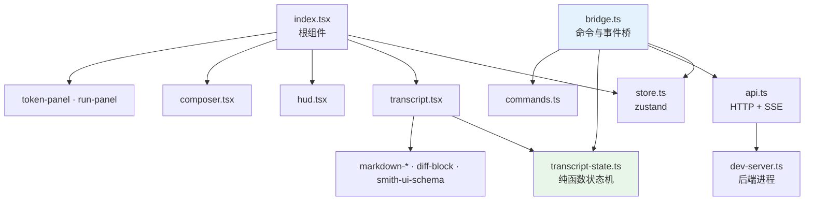

**`transcript-state.ts` 是纯函数**——`applyStreamEvent(entries, event) → entries`。所有会话记录的变换都是"旧状态 + 事件 → 新状态"，没有副作用。这让它能被单元测试完整覆盖（`transcript-state.test.ts` 512 行）。

---

## 3. 状态模型

### 3.1 三个顶层模式

```typescript
export type Mode = "boot" | "setup" | "chat";
export type SetupFlow = "initial" | "advanced";
```

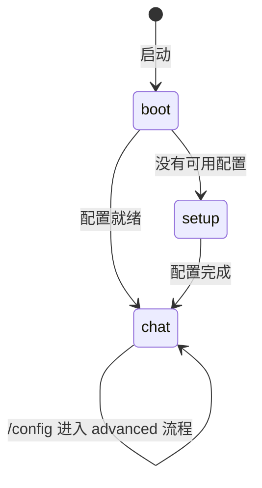

### 3.2 会话记录的类型层次

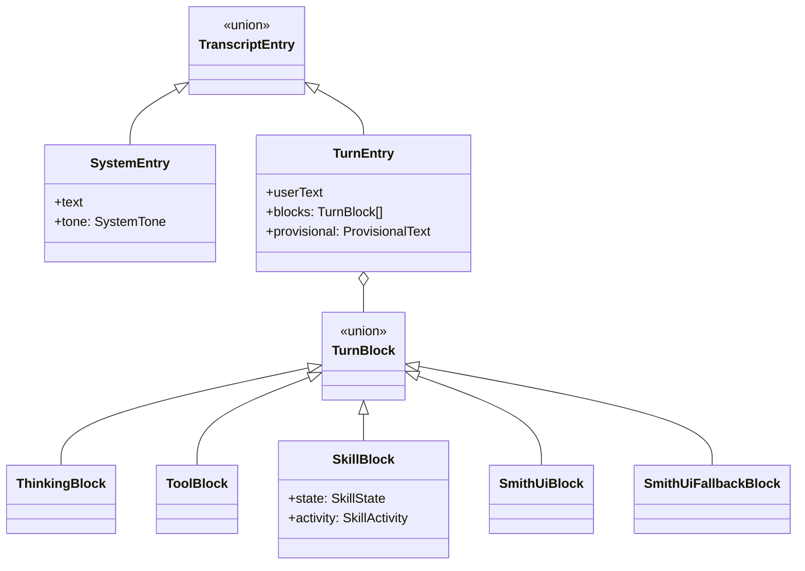

**技能状态有七个**：

```typescript
export type SkillState = "running" | "retry" | "waiting" | "done" | "blocked" | "error" | "cancelled";
```

对应管线的真实语义——`retry` 是门禁不过重跑，`waiting` 是节点等用户输入，`blocked` 是被守卫拦下。**这三个状态在别的 Agent 终端里通常没有对应物**，因为它们没有门禁和管线。

### 3.3 会话记录的上限

```typescript
export const TRANSCRIPT_LIMIT = 200;
export const TRANSCRIPT_TRIM_TARGET = 150;
```

**双阈值**：超过 200 时裁到 150，而不是每超一条裁一条。避免在 200 附近反复触发裁剪（抖动）。

---

## 4. `Static` 与重印问题

这是 Ink 终端 UI 最核心也最容易出错的一件事。

### 4.1 `Static` 是什么

Ink 的 `<Static>` 把内容**一次性写进 scrollback**，之后不再重绘。已完成的会话记录必须走 `Static`，否则每次状态更新都会重绘整个历史——终端会闪烁并且极慢。

```typescript
/** Items rendered once through <Static>: the hero banner plus every completed entry. */
type StaticItem = { kind: "hero"; id: string } | TranscriptEntry;

const { done, active } = useMemo(() => splitTranscript(transcript), [transcript]);
const staticItems = useMemo<StaticItem[]>(() => [{ kind: "hero", id: "hero" }, ...done], [done]);
```

`splitTranscript()` 把会话记录切成 `done`（进 `Static`）和 `active`（正常渲染，会重绘）。

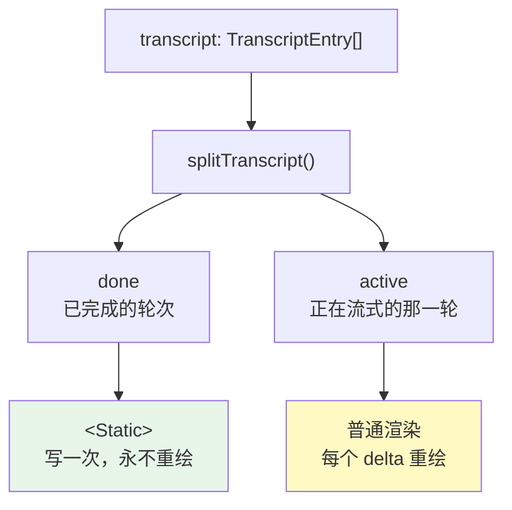

### 4.2 全屏面板导致的整卷重印

```typescript
// Entering or leaving the full-screen tokens/runs panels unmounts and later
// remounts <Static>, which reprints the whole transcript into scrollback.
// Clear and bump the epoch on the transition so it repaints exactly once,
// matching the /clear, /new, and /resume paths.
clearTerminal();
getState().set({ transcriptEpoch: getState().transcriptEpoch + 1 });
```

问题链条：

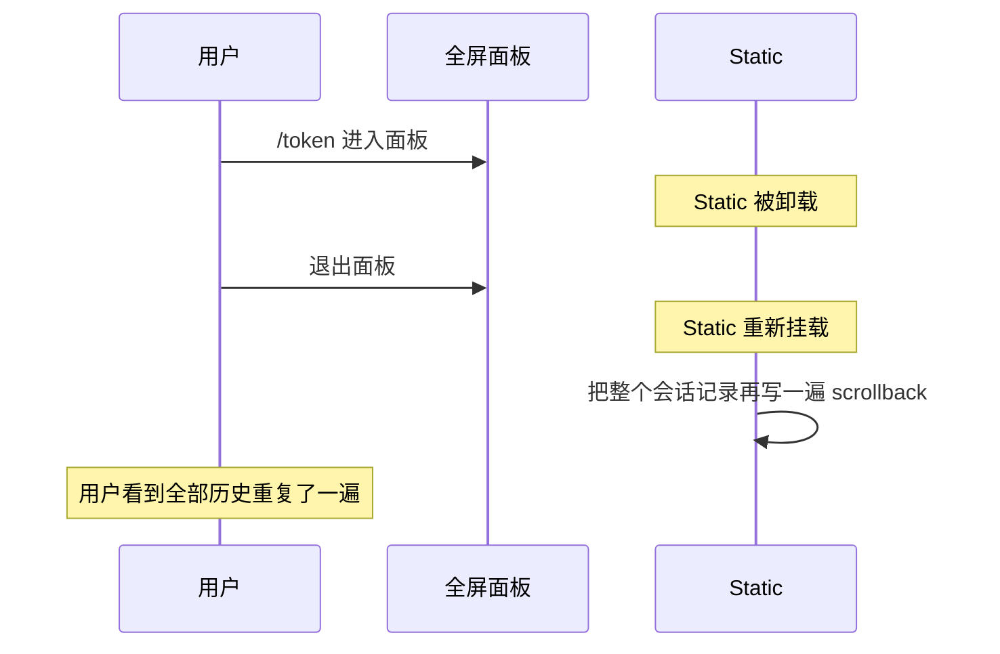

修法是 **epoch + clearTerminal**：切换时清屏并把 `transcriptEpoch` 加一，强制 `Static` 认为这是全新内容，**正好重绘一次**。

同一套处理还用在 `/clear`、`/new`、`/resume` 三条路径上——它们都会让会话记录整体替换。

### 4.3 `Box` 只 wrap 不裁剪

Ink 的 `Box` 对超宽内容**折行而不裁剪**。这意味着：

- 一个超宽的表格不会被截断，而是折成多行，破坏对齐
- **用普通断言测不出来**——组件树里的文本是完整的，折行发生在终端渲染层

所以宽度相关的行为必须用**真 PTY** 验证：

```bash
script -q /dev/null bash -c 'stty -icrnl; <逐字符喂键>'
```

`string-width` 依赖就是为此存在的——CJK 字符占两列，用 `.length` 算宽度会全错。

---

## 5. SSE 消费

### 5.1 CRLF 幻影帧

SSE 的帧分隔符是空行。如果按 `\n\n` 切帧而不处理 `\r\n\r\n`，在 CRLF 环境下会切出**空帧**，解析成一个空事件对象。

症状是终端里出现莫名其妙的空白块或"幽灵"渲染，而后端日志完全正常。

### 5.2 事件到状态的映射

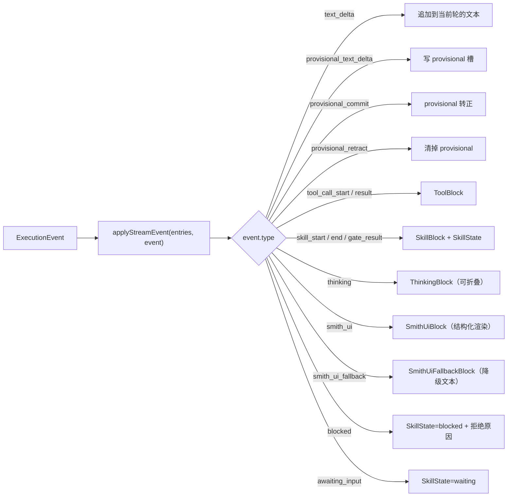

### 5.3 试探性文本的三态

这是管线场景独有的（见 [03 · 架构总览](./03-架构总览.md) §3.2）：

| 事件 | 终端行为 |
|---|---|
| `PROVISIONAL_TEXT_DELTA` | 边流边显示 |
| `PROVISIONAL_COMMIT` | 转成正式文本，落进 `done` |
| `PROVISIONAL_RETRACT` | **从界面上抹掉** |

撤回是终端 UI 里少见的操作——大多数流式 UI 只追加不回退。这里必须支持，否则门禁不过重跑时用户会看到两份内容。

`ProvisionalText` 是 `TurnEntry` 上的一个独立字段而不是一个 block，正是因为它需要被整体替换或清空。

### 5.4 中断与重启

```typescript
export function interruptLatestTurn(...)
export function restartLatestTurn(entries: TranscriptEntry[]): TranscriptEntry[]
export function closeLatestTurn(entries: TranscriptEntry[]): TranscriptEntry[]
```

三个纯函数分别处理：用户按 Ctrl+C 中断、恢复一个被中断的运行、正常结束一轮。

`restoreTranscript(messages)` 从服务端拉回的历史消息重建会话记录——用于 `/resume` 和切换会话。

---

### 5.5 `bridge.ts`：唯一的后端出口

`shell/src/bridge.ts`（1 103 行）是第二大文件，文件头两行说清了它的地位：

```ts
/**
 * NodeBridge — all backend communication goes through here.
 * UI components never call api.ts directly; they call bridge methods.
 */
```

**UI 组件从不直接调 `api.ts`**。这条约束换来三件事：

| | 好处 |
|---|---|
| 竞态防护集中 | 请求序号、AbortController 只在一处管理 |
| 状态更新集中 | 所有 `store.setState` 从 bridge 发起，组件只读 |
| 批处理可行 | 流式文本能在进 store 之前先攒一攒（§5.6） |

如果组件各自调 API，上面三件事都要在每个组件里重复实现一遍，而且不可能做到一致。

### 5.6 两个批处理器：为什么是 40 毫秒

流式响应的每个 delta 可能只有几个字符。如果每个 delta 都触发一次 `setState`，React 会重渲染整棵会话记录树——一秒几十次，终端会明显卡顿。

`bridge.ts` 用两个批处理器把 delta 攒成批：

```ts
function createTextBatcher(emit: (text: string) => void) {
  let pending = "";
  let timer: ReturnType<typeof setTimeout> | null = null;
  return {
    push(text: string): void {
      pending += text;
      if (!timer) timer = setTimeout(flush, 40);   // ← 40ms 窗口
    },
    flush,
    discard(): void { /* 清空且不发出 */ },
  };
}
```

40 毫秒对应约 25 fps——低于人眼察觉逐帧的阈值，文字看起来仍是连续流出的，而重渲染次数降到原来的几十分之一。

`if (!timer)` 那一行是要点：**只在没有计时器时才起一个**。已经有计时器就只累加，不重置——否则持续不断的 delta 会不停推迟 flush，文字永远不显示（经典的 debounce 饥饿问题）。这是 throttle 而不是 debounce。

两个批处理器分工不同：

| | `TextBatcher` | `ProvisionalBatcher` |
|---|---|---|
| 待发内容 | 一个字符串 | `Map<provisionId, string>` |
| 用于 | 普通助手文本 | 试探性文本（§5.3） |
| flush 粒度 | 全部 | 可指定单个 `provisionId`，也可全部 |

试探性文本要按 `provisionId` 分开攒，因为同时可能有多段试探性内容在生成，它们各自会被提交或撤回，不能混成一段。

### 5.7 交替 flush 保证顺序

两个批处理器同时存在带来一个新问题：**普通文本和试探性文本的相对顺序不能乱**。

`applyBatchedStreamEvent` 用交替 flush 解决：

```ts
if (event.type === "message") {
  provisionalBatcher.flush();        // ← 先把试探性的吐出去
  messageBatcher.push(event.text);
  return null;
}
if (event.type === "provisional_text_delta") {
  messageBatcher.flush();            // ← 先把普通文本吐出去
  provisionalBatcher.push(event.provisionId, event.text);
  return null;
}
messageBatcher.flush();              // 其他事件：两个都 flush
if (event.type === "provisional_commit" || event.type === "provisional_retract") {
  provisionalBatcher.flush(event.provisionId);   // 只 flush 相关的那一个
} else {
  provisionalBatcher.flush();
}
applyEvent(event);
```

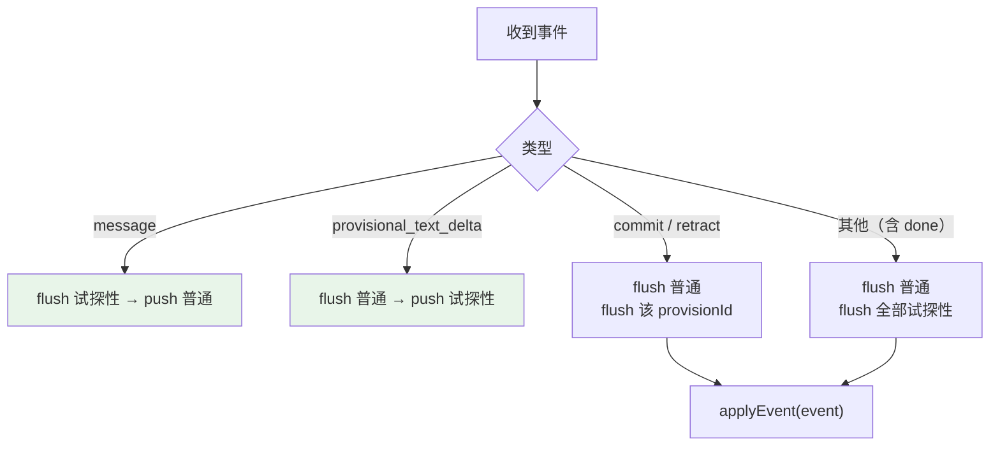

**换一种文本之前，先把另一种攒着的吐出去**。这样两类文本进入 store 的顺序和它们从服务端到达的顺序始终一致。

如果不做交替 flush：普通文本攒了 30ms，此时来了试探性 delta 也开始攒，两个计时器各自到期——先到期的先进 store。攒的顺序和到达顺序就脱钩了，用户会看到试探性内容插在一段普通文本的中间。

`commit` / `retract` 只 flush 对应的 `provisionId`，其余试探性内容继续攒着——因为它们还没有结论，提前吐出去只会让屏幕上多一段马上要被改写的文字。

`discard()` 用于中断（§5.4）：清计时器、清缓冲，**且不 emit**。用户按了中断之后，还在缓冲里的那 40 毫秒文本不该再出现——那是已经被取消的输出。

### 5.8 终态文案的五个分支

流结束时 `terminalStatusMessage()` 把状态码翻译成人话：

```ts
if (status === "incomplete" && reason === "awaiting_user_input")
  return "Waiting for your input. Reply to continue the workflow.";
if (status === "incomplete" && reason === "model_output_limit")
  return "Model output limit reached; the answer may be incomplete.";
if (reason === "blocked")
  return "Agent was blocked; see the transcript for the reason.";
if (status === "incomplete")
  return "Agent did not complete the task; see the transcript for the reason.";
return "Agent execution failed; see the transcript and server log for details.";
```

| 状态 | 文案要点 |
|---|---|
| `incomplete` + `awaiting_user_input` | **这不是错误**——工作流在等你回复 |
| `incomplete` + `model_output_limit` | 答案可能不完整，原因是输出上限 |
| 任意 + `blocked` | 被安全边界拦下，去看会话记录 |
| `incomplete`（其他原因） | 没做完，去看会话记录 |
| 其他 | 执行失败，看会话记录**和服务端日志** |

第一条最重要：`awaiting_user_input` 在协议上是 "incomplete"，但对用户而言是**正常的暂停**。如果统一显示成"Agent 没有完成任务"，用户会以为出错了，而实际上系统正在等他说话。

最后一条多提了"服务端日志"——因为到这一步说明问题不在 Agent 的推理里，会话记录不会有答案，得去看后端。**每条文案都指向下一步该去哪看**，而不只是陈述发生了什么。

判断顺序也有讲究：`blocked` 的检查放在第三，不检查 `status`。因为被拦截既可能以 `incomplete` 结束也可能以 `failed` 结束，但对用户来说原因是同一个。

---

### 5.8.1 `done` 之后还要再读一会儿

流收到 `done` 事件之后不能立刻收工，两处注释解释了为什么：

```ts
// After the terminal event only usage counters are legitimate: a server
// may legally frame token_usage/context_usage after done (even in a later
// TCP read), and dropping them would permanently undercount the session
// totals.  Stale content events after done are dropped.
if (event.type === "token_usage" || event.type === "context_usage") {
  events.push(event);
}
continue;
```

服务端可以**合法地**在 `done` 之后再发用量帧——而且由于 TCP 分包，它可能落在**后续的一次读**里。直接在 `done` 时 return，这些用量数据就永久丢了，会话的 token 总量会一直少算。

但 `done` 之后只接受用量事件，**内容事件一律丢弃**。已经宣告结束的轮次不该再往屏幕上加文字。

排空有严格的时间预算：

```ts
// The server usually closes right after done, but a TCP packet split can
// put a trailing token_usage/context_usage frame in later reads.  Drain
// within a short budget, then stop — never hang the turn waiting for the
// response to close.
const deadline = Date.now() + POST_DONE_DRAIN_MS;
```

**"never hang the turn waiting for the response to close"** 是这里的底线。如果无限期等连接关闭，一个不主动关连接的服务端（或中间的反向代理）会让每一轮对话都挂在最后一步。用 `Promise.race` 加截止时间，到点就走。

这是一个典型的"两害相权"：等太短会漏用量（数据不准），等太长会卡界面（不可用）。选择很明确——**宁可少算 token，也不能让界面卡住**。

### 5.8.2 子路径反向代理的 URL 陷阱

```ts
function buildUrl(baseUrl: string, pathname: string): string {
  // Resolve as a relative reference: `new URL("/api/x", "http://gw/smith/")`
  // discards `/smith`, so behind a sub-path reverse proxy the health probe
  // (which concatenates strings and keeps the prefix) passed while every real
  // request 404'd.
  return new URL(pathname.replace(/^\//, ""), `${baseUrl.replace(/\/$/, "")}/`).toString();
}
```

这个 bug 的症状极具迷惑性：**健康检查通过，但每个真实请求都 404**。

原因是两处代码用了不同的拼接方式：

| | 写法 | `http://gw/smith/` + `/api/x` 的结果 |
|---|---|---|
| 健康探测 | 字符串拼接 | `http://gw/smith/api/x` ✓ |
| 真实请求 | `new URL(path, base)` | `http://gw/api/x` ✗ |

`new URL()` 的第一个参数**以 `/` 开头时是绝对路径**，会丢掉 base 里的路径前缀 `/smith`。这是 URL 标准的行为，不是 bug——但和字符串拼接的直觉不一致。

修法是两步：`pathname.replace(/^\//, "")` 去掉开头的斜杠（让它变成相对引用），`baseUrl.replace(/\/$/, "") + "/"` 保证 base 以斜杠结尾（否则相对解析会替换掉最后一段）。两个 `replace` 缺一不可。

> 部署在子路径反向代理后面的人才会遇到这个。它值得记在文档里，正是因为"健康检查绿灯但功能全挂"这种症状会把排查方向引到完全错误的地方。

### 5.8.3 错误文本要限长

```ts
// FastAPI 422 bodies embed the failing input value verbatim, which can be a
// megabyte-sized message or a secret; cap display text so an error body can
// never flood the status line or the persisted transcript.
const TERMINAL_TEXT_MAX_LENGTH = 2_000;
```

FastAPI 的 422 校验错误会把**出错的输入值原样嵌进响应体**。如果那个值是用户发的一条几 MB 的消息，或者是一个被误填进某字段的 API key，它就会：

1. 灌进状态栏（一行变几千行）
2. **被持久化进会话记录**（密钥落盘）

2 000 字符的上限同时挡住这两件事。注意它和 §5.9 的净化是**两个独立的关注点**：净化处理"内容是否危险"，限长处理"体积是否失控"，两者都要做。

### 5.9 终端注入防护：`sanitize.ts`

这是 Shell 里安全价值最高的 87 行。文件头的威胁模型写得很直白：

> Everything the server sends is **untrusted** for this purpose: model output, tool results (**arbitrary command output, file contents, fetched pages**), and skill or hook text.

注意括号里那三样——工具结果可以是任意命令的输出、任意文件的内容、任意网页的抓取结果。这些内容**最终要打进用户的终端**，而终端会解释控制序列。

**为什么 Ink 挡不住：**

> Ink passes strings straight through to stdout, and while it happens to absorb CSI sequences via its own line handling, **OSC sequences arrive at the terminal intact**.

Ink 因为自己的换行处理**碰巧**吸收了 CSI 序列——注意 "happens to"，这是巧合不是保证。而 OSC 序列原封不动地到达终端。

### 5.10 四个真实的 OSC 攻击

> That is not cosmetic — **OSC 52 writes the system clipboard** (default-allowed in kitty/wezterm/alacritty), **OSC 7 forges the reported cwd**, **OSC 0 forges the window title**, and **OSC 8 hides a phishing target behind innocuous link text**.

| 序列 | 能做什么 | 危害 |
|---|---|---|
| **OSC 52** | 写系统剪贴板 | 在 kitty / wezterm / alacritty 里**默认允许**。一段工具输出就能把用户的剪贴板换成攻击者的内容——用户下次粘贴时粘出的不是自己复制的东西 |
| **OSC 7** | 伪造终端上报的 cwd | 让终端以为你在别的目录，影响新开标签页的起始位置 |
| **OSC 0** | 伪造窗口标题 | 社会工程学：把标题改成看起来像另一个应用 |
| **OSC 8** | 超链接 | 链接文字显示 `https://docs.example.com`，实际指向钓鱼站 |

OSC 52 是最严重的一个：它不需要用户做任何操作，一段被渲染的文本就能改写剪贴板，而且三个主流现代终端默认放行。

### 5.11 三层过滤与它们的顺序

```ts
export function sanitizeTerminalText(text: string): string {
  if (!text) return text;
  return text
    .replace(ESCAPE_SEQUENCE, "")     // ① 转义序列
    .replace(UNSAFE_CONTROL, "")      // ② 控制字符
    .replace(BIDI_OVERRIDE, "");      // ③ 双向格式字符
}
```

**顺序不能换**，注释说明了原因：

> Order matters: escape sequences go first, because stripping the lone ESC byte would leave its payload (`]52;c;<base64>`) behind as visible text.

如果先剥控制字符，`ESC` 这个字节被删掉了，但它后面的 `]52;c;<base64>` 是普通可打印字符——会原样显示在屏幕上。攻击虽然失效了，但用户看到一堆垃圾。先按完整序列匹配再删，才能把整段拿掉。

**① `ESCAPE_SEQUENCE` 的三个分支**，OSC 排在最前：

```ts
// OSC: ESC ] ... (BEL | ESC \), payload stops at either terminator
"\\u001b\\][^\\u0007\\u001b]*(?:\\u0007|\\u001b\\\\)?",
// CSI: ESC [ params intermediates final
"\\u001b\\[[0-9;?]*[\\u0020-\\u002f]*[\\u0040-\\u007e]",
// 其他：ESC + 可选中间字节 + 一个终止字节
"\\u001b[\\u0020-\\u002f]*[\\u0030-\\u007e]",
```

> OSC is matched first because **its payload may contain characters that would otherwise look like the start of a CSI sequence**.

OSC 的载荷是任意数据，里面完全可能出现 `[`。如果 CSI 分支先匹配，会从 OSC 载荷中间截断，剩下半截 OSC 逃逸。

OSC 分支末尾的 `?` 让终止符可选——**未终止的 OSC 也要吃掉**。攻击者可以故意不加终止符，让序列吞掉后续所有输出。

第三个分支的终止字节范围 `0x30-0x7e` 覆盖得很宽，注释解释了为什么不能只挑几个：

> The final byte spans 0x30-0x7e because the dangerous ones are spread across all three classes — **Fp (ESC 7/8, cursor save/restore)**, **Fe (0x40-0x5f)**, and **Fs (ESC c, full reset, at 0x63)**.

危险序列分散在 ANSI 的三个类别里：`ESC 7`/`ESC 8` 存取光标位置（Fp 类，0x37/0x38），`ESC c` 是全屏复位（Fs 类，0x63），Fe 类还有一堆。挑着删一定会漏，不如整段范围都算。

**② `UNSAFE_CONTROL` 保留什么、不保留什么：**

```ts
new RegExp("[\\u0000-\\u0008\\u000b-\\u001f\\u007f-\\u009f]", "g")
```

| 字符 | 处理 | 理由 |
|---|---|---|
| Tab (0x09) | **保留** | markdown 需要 |
| LF (0x0a) | **保留** | markdown 需要 |
| **CR (0x0d)** | **删除** | 在终端上**重写当前行**——工具结果可以借此覆盖 shell 刚打印的内容 |
| C1 (0x80-0x9f) | 删除 | CSI 和 OSC 的 **8 位形式** |

CR 不被豁免这一条值得注意：它是"看起来无害的空白字符"，但在终端语义里是光标回到行首。一段以 CR 结尾的工具输出可以把上一行（比如一条安全警告）整个盖掉。

C1 那一段同样关键——注释说 "stripping the introducer leaves the payload behind as inert visible text"，8 位形式的 CSI/OSC 用单个字节表示 `ESC [`，不处理的话前面那个正则完全匹配不到。

**③ `BIDI_OVERRIDE`：针对人的 trojan source。**

```ts
new RegExp("[\\u202a-\\u202e\\u2066-\\u2069]", "g")
```

> Same threat as an escape sequence — **the rendered line does not say what the bytes say** — but they survive a control-character filter because they are **ordinary printable code points**.
>
> The **approval prompt renders model-supplied tool arguments**, so an RLO can make the command the user reads differ from the one they are approving: the **trojan-source trick, aimed at a human rather than a compiler**.

这是最阴险的一个。双向格式字符（RLO 等）是**普通可打印码点**，前两层过滤全都放行，但它们能让文本的**显示顺序和字节顺序不一致**。

危险点非常具体：**审批提示要渲染模型给的工具参数**。用户看到的是 `rm -rf /tmp/cache`，实际要执行的可能是完全不同的命令——他批准的和他读到的不是一回事。这就是 2021 年 trojan source 漏洞的手法，只不过目标从编译器换成了人眼。

注释也说明了为什么可以放心删：

> text that legitimately needs RTL still renders from its own strong characters, which these only override.

真正的阿拉伯语、希伯来语文本靠字符自身的方向性（strong characters）就能正确渲染，这些显式覆盖标记只是**强行覆盖**默认行为——删掉它们不影响正常的 RTL 文本。

### 5.12 两个自指的设计决定

**① 为什么在解码边界净化。**

> Sanitising happens at the **decode boundary** rather than inside each renderer, so **a new render path cannot forget to do it**.

`api.ts` 里有九处 `sanitizeTerminalText` 调用，覆盖会话标题、run 的 reason/outcome、事故消息、恢复的历史、技能名与描述、MCP server 与工具名、维护错误信息——**全部在数据从 HTTP 解码出来的那一刻**。

如果改成"每个渲染组件自己净化"，加一个新面板的人就有可能忘记。放在解码边界，数据进入前端时就已经是干净的，之后无论经过多少渲染路径都安全。这和 [13 · Common 基础设施](./13-Common-基础设施.md) §9.1 ② 的"把约束放在收敛点"是同一条思路。

**② 为什么正则不用字面量。**

```ts
// biome-ignore lint/complexity/useRegexLiterals: a literal would put control
// characters in the source, where they are invisible in review — the exact
// failure this module defends against. See the file header.
```

文件头也说了同一件事：

> The patterns are built with `new RegExp` from escaped strings so this file holds **no literal control characters** — a control byte pasted into source is **invisible in review**, which is exactly the failure being defended against.

用 `/\[/g` 这样的字面量在功能上完全等价，但一旦有人（或某次自动格式化）把真实的控制字节写进源码，它在代码审查时**看不见**——而"不可见的字符能造成危害"正是这个模块要防的东西。让防御模块自己免疫同一类问题，是很讲究的自洽。

代价是要写 `"\\u001b\\]"` 这种双重转义，可读性下降，还要压制两处 linter 规则。两处 `biome-ignore` 都附了完整理由并指向文件头——**压制静态检查时必须说明为什么**，否则下一个人会以为是偷懒。

---

## 6. 输入路由：19 个处理器的责任链

`input.ts`（475 行）把按键处理拆成 19 个独立函数，`routeInput()` 按顺序调用，**每个返回 `boolean` 表示"我处理了，别再往下传"**。

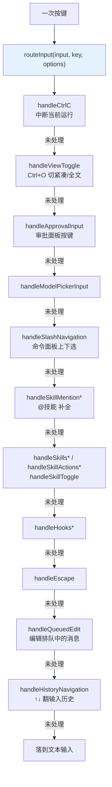

**责任链而不是一个大 switch** 的收益是可测性：`input.test.ts` 有 570 行，每个 handler 都能被单独喂一个按键断言返回值。

### 6.1 面板导航是一套重复的模式

`handleSlashNavigation` / `handleSkillsNavigation` / `handleHooksNavigation` / `handleSkillMentionNavigation` 结构几乎一样——上下移动一个索引。对应 `store.ts` 里四个独立的索引字段：

```typescript
slashIndex: number;
skillsIndex: number;
skillActionIndex: number;
hooksIndex: number;
skillMentionIndex: number;
```

**每个面板一个索引**而不是共享一个"当前选中项"，因为面板可以嵌套（技能列表 → 技能操作），共享索引会在返回时丢掉位置。

`list-navigation.ts`（64 行）抽出了共同的"上下 + 环绕"逻辑。

### 6.2 输入历史的三个字段

```typescript
inputValue: string;
inputHistory: string[];
historyIndex: number;
historyDraft: string;      // ← 关键
```

`historyDraft` 存的是**开始翻历史之前用户正在写的那一行**。没有它，用户按 ↑ 看了一眼历史再按 ↓ 回来，自己写了一半的内容就没了。

`exitHistoryBrowsing(state)` 是显式的退出函数——任何非导航按键都要调它，把 `historyIndex` 复位。

历史持久化在 `~/.agent-smith/shell_history.json`。

### 6.3 一条注释里的坑

```typescript
// The data-backed panels load through the bridge; setting `panel` alone would
// strand them on their loading placeholder with no request behind it.
```

`tokens` / `runs` 这类面板需要先发请求。**只改 `panel` 状态会让它永远停在"加载中"**——因为没有任何东西去发那个请求。所以打开这类面板必须走 bridge 的方法而不是直接 `set({panel: "tokens"})`。

---

## 7. 状态容器：一个扁平的 `AppState`

`store.ts` 的 `AppState` 有 **45 个字段**，全部扁平。没有嵌套的 `ui.panels.skills.index` 这种结构。

按用途分组：

| 组 | 字段 |
|---|---|
| 模式与面板 | `mode`、`panel`、`viewMode` |
| 连接与配置 | `baseUrl`、`config`、`agent` |
| 数据缓存 | `sessions`、`skills`、`mcpServers`、`tokenStats`、`observability*` |
| 会话记录 | `transcript`、`transcriptEpoch`、`turnCount` |
| 用量 | `turnTokenUsage`、`tokenUsage`、`contextUsage`、`tokenTab` |
| 运行态 | `busy`、`compressing`、`inputLocked`、`runStartedAt`、`recoverableRunId` |
| 审批 | `pendingApproval`、`approvalIndex`、`approvalResolving`、`lastToolCallId` |
| 输入 | `inputValue`、`inputHistory`、`historyIndex`、`historyDraft`、`statusLine` |
| 面板索引 | 五个 `*Index` |
| 配置向导 | `setupDraft`、`setupFlow`、`setupIndex` |
| 其它 | `pendingSkill`、`queuedMessages`、`modelPicker`、`selectedModelProfile`、`welcomeNotice` |

四个字段带着解释性注释，都是"不写下来就会被删掉"的那种：

| 字段 | 注释 |
|---|---|
| `transcriptEpoch` | 会话记录被整体替换时递增——**重挂 `<Static>`** |
| `turnTokenUsage` | 当前这条用户消息**及其 Agent 工作**累积的用量 |
| `recoverableRunId` | 最后一个未完成的运行，**留着让断开的 Shell 能恢复它** |
| `lastToolCallId` | 其结果**可能落定挂起审批**的那次工具调用 |

最后一个尤其微妙：审批面板要知道"我等的那个工具调用回来了没有"，而工具结果事件和审批解析是两条独立的路径。

### 7.0 审批提示的六道竞态防护

`store.ts` 里注释最密的一段全都围绕**工具审批**。这是 Shell 里唯一一处"UI 状态错了会造成真实危害"的地方——用户点 Allow 的那一下必须对应他屏幕上看到的那个命令。

**① 只有对应的工具能结算审批。**

```ts
// Only the tool that the pending approval is FOR may settle the prompt.  A
// stray or duplicate result (SSE retry, gate-blocked, a different overlapping
// stream) must not silently discard the user's Allow/Deny.  When no tool_call
// has been seen for this run (lastToolCallId null), fall back to clearing.
```

三种杂散结果都可能到达：SSE 重试导致的重复事件、被门禁拦下的调用、另一条重叠的流。如果任何一个 `tool_call_result` 都能清掉审批提示，用户正在看的那个提示会**凭空消失**——他的决定还没做出就被丢弃了。

**② 陈旧的审批不能跨 run 显示。**

```ts
// A stale approval_required (resumed stream, replayed buffer) must never
// display run A's command while the user's decision resolves run B: only
// accept it when it names the run currently being streamed.
```

这是六条里最危险的一条。续跑的流或重放的缓冲可能带来上一个 run 的 `approval_required` 事件。如果照单全收，屏幕上显示的是 **run A 的命令**，而用户按下 Allow 之后解决的是 **run B 的审批**——他批准了一个自己根本没看到的操作。

防御是要求事件**指名当前正在流式的 run**，不匹配就丢弃。

**③ 全屏面板必须先关掉。**

```ts
// The full-screen tokens/runs panels replace the footer that renders the
// approval prompt, so leaving the panel up would ask the user to approve
// a tool call they cannot see.  Return to chat and let them read it.
```

审批提示渲染在页脚，而全屏面板（token 统计、run 浏览器）会把页脚整个盖掉。用户在看面板时来了一个审批请求——提示存在于状态里，但**屏幕上看不见**。此时任何一次 Enter 都可能盲批。

处理方式是**强制切回聊天视图**。打断用户当前的浏览是有代价的，但比让他批准看不见的东西好。

**④ 重复重发不能释放在途的锁。**

```ts
// A duplicate re-emission of the SAME approval while a resolve POST is in
// flight must not drop the in-flight lock (which would let a second Enter
// race the first).
```

用户按了 Enter，解决请求正在发往服务端；此时同一个审批事件又被重发了一次。如果重发会重置"正在处理中"的标志，用户再按一次 Enter 就会发出**第二个**解决请求——两个请求竞态，结果不确定。

**⑤ 新 run 使旧的 tool-call id 失效。**

```ts
// A new run invalidates the previous run's tool-call id for approval
// settlement matching.
```

①的匹配依据是 `lastToolCallId`。新 run 开始时必须清掉，否则上一轮的 id 会继续参与匹配。

**⑥ 结果没到的工具要清理。**

```ts
// A tool whose result never arrived would otherwise stay in the running
// map for the rest of the session, leaving the HUD spinner on for every
// later turn. The transcript converges the same blocks on done.
```

不是安全问题但影响可用性：一个永远没有结果的工具调用会一直留在 running 表里，HUD 的转圈图标从此再也不停——**后面每一轮对话都显示"正在执行工具"**。

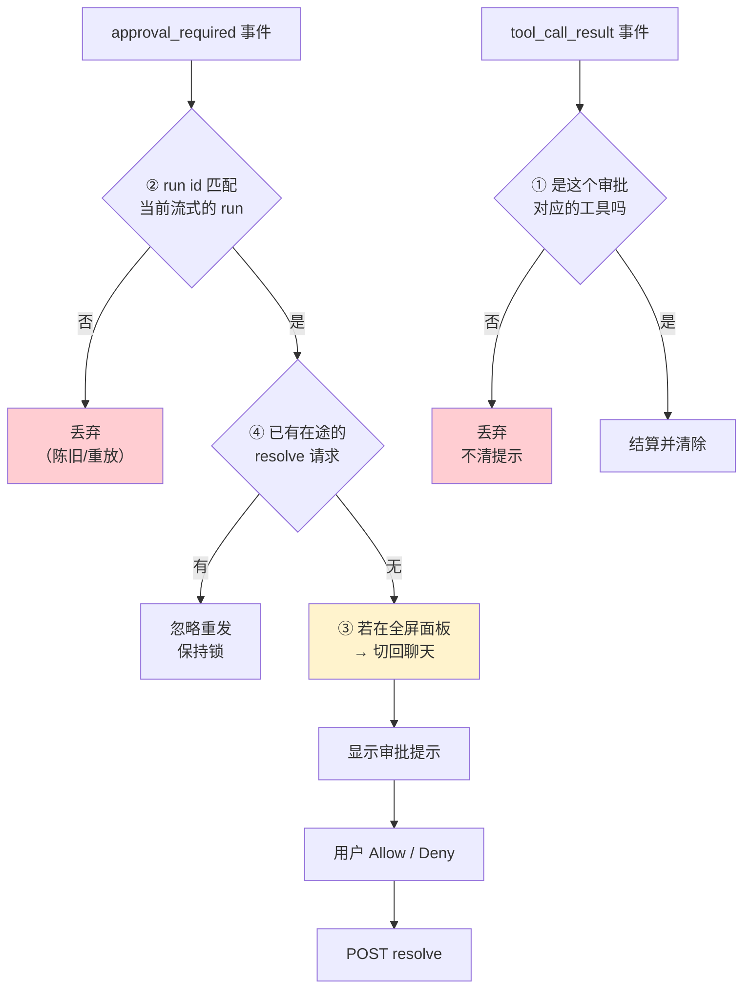

六条防的是同一件事的六个侧面：**屏幕上显示的、用户决定的、实际执行的，三者必须是同一个工具调用**。对应的测试在 `approval.test.ts`（7 个）。

### 7.0.1 会话记录的三条渲染纪律

`transcript-state.ts` 里另有三条注释值得单看。

**① `awaiting_input` 必须在终态之前被识别。**

```ts
// The engine emits SKILL_END(status="awaiting_input") immediately before the
// AWAITING_INPUT event when a chain node pauses for the user.  Without this
// mapping the block falls through to "done", and by the time the awaiting_input
// event tries to flip it to "waiting" it is already terminal — the workflow
// card would claim "Agent complete" while the run is paused.
```

两个事件紧挨着到达，顺序是 `SKILL_END` 在前。如果 `SKILL_END` 无条件映射成 `done`，这个 block 就**已经进入终态**；随后的 `AWAITING_INPUT` 想把它改成 `waiting` 已经晚了（终态不可再变）。

用户看到的结果是工作流卡片写着"Agent 完成"，而实际上运行正停下来等他回话——**他不会知道该说话**。修法是在映射 `SKILL_END` 时就检查 `status`。

**② 内部遥测不进聊天。**

```ts
// System notices for route / gate / backtrack / awaiting_input used to be
// pushed into the transcript here, but the workflow step card already
// reflects running / retry / waiting state, and these notices were just
// internal pipeline telemetry that polluted the chat. Keep them in the
// skill block's `state` field; drop the rendered copy.
```

路由决策、门禁结果、回退——这些曾经每条都在聊天里插一行系统消息。问题是工作流卡片**已经**通过 `state` 字段展示了同样的信息，两份显示互相重复，而聊天区被管线的内部细节淹没。

处理是保留状态、去掉渲染副本。**同一个事实只显示一次**，选信息密度最高的那种呈现方式。

**③ 不能擦掉服务端已持久化的草稿。**

```ts
// The server persists whatever draft was visible as the assistant message.
// Erasing it here would show the user an empty turn while the stored
// session — and the next request's history — held text they never saw.
```

中断时前端可能想"把没写完的清掉"，但服务端已经把当时可见的草稿存成了助手消息。前端擦掉之后就出现分歧：**屏幕上是空的，会话历史里有内容**，而下一次请求会带上那段用户从未看见的文本。

这条和 [09 · Server API 层](./09-Server-API层.md) §4.8 是同一个原则在两侧的体现——**显示的和存储的必须一致**，任何一侧单方面清理都会制造幻觉。

### 7.1 十个 action

```typescript
set · pushSystemLine · pushHistory · pushTurn · applyEvent
closeTurn · interruptTurn · resetChat · clearChat · startFreshSession · hydrate
```

`resetChat` / `clearChat` / `startFreshSession` **三个都是"开新的"，但语义不同**：

| action | 服务端 | 本地历史 |
|---|---|---|
| `startFreshSession`（`/new`） | 建新会话 | 保留（进 scrollback） |
| `clearChat`（`/clear`） | **删掉**当前会话 | 清空 |
| `resetChat` | — | 清空（内部用） |

---

## 8. 配置向导

`setup.ts`（412 行）驱动首次配置和 `/config`。

### 8.1 两套字段集

```typescript
export const INITIAL_SETUP_FIELDS = [...]   // 首次配置：最小必需
export const SETUP_FIELDS = [...]           // /config advanced：全部
export type SetupField = (typeof INITIAL_SETUP_FIELDS)[number] | (typeof SETUP_FIELDS)[number];
```

`setupFields(flow)` 按 `flow`（`"initial"` / `"advanced"`）返回对应的字段列表。

**首次配置只问最少的问题**——一个上来就要填 13 个字段的向导会把人劝退。

### 8.2 API Key 的三态显示

```typescript
export function isApiKeySetupField(field: SetupField): boolean
export function hasStoredApiKey(config: LlmConfig | null, field: SetupField): boolean

const ROUTE_SECRET_FIELDS = ["interactive_api_key", "gate_api_key", "background_api_key"]
```

因为 `api_key` 是**只写不读**的（见 [07 · LLM 集成](./07-LLM-集成.md) §2.2），配置读回来时这个字段永远是空的。于是向导要区分三种状态：

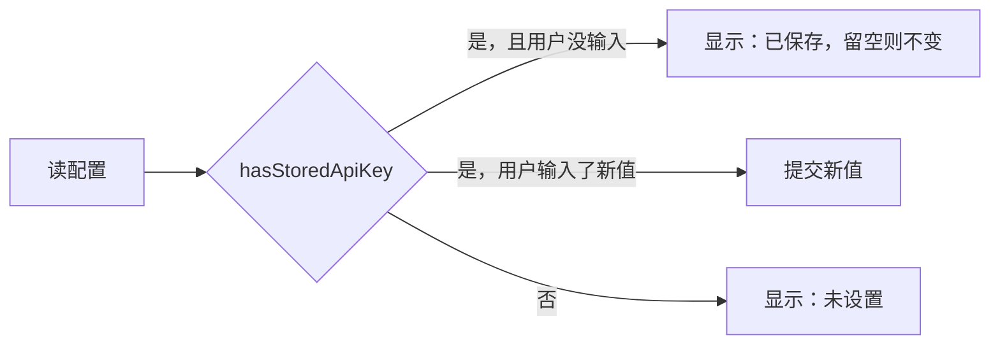

不做这个区分，用户每次进 `/config` 都会看到一个空的 API Key 框，以为自己没配过。

### 8.3 `PROVIDER_PRESETS` 与 `setProvider`

```typescript
export const PROVIDER_PRESETS = {...}
export function setProvider(draft: SetupDraft, value: string): SetupDraft | null
```

选 provider 时自动填 `base_url` 等预设值。返回 `null` 表示这个 provider 名不认识——**由调用方决定是拒绝还是当自定义值接受**。

### 8.4 三条路由 × 五个超时字段

```typescript
const LLM_USAGES = ["interactive", "gate", "background"] as const satisfies readonly LlmUsage[];
const TIMEOUT_FIELDS = ["connect", "read", "stream_read", "write", "pool"] as const;
```

`as const satisfies readonly LlmUsage[]` 这个写法让 TypeScript **同时**做两件事：保留字面量类型（`"interactive" | "gate" | "background"`）**并且**校验它们确实都是合法的 `LlmUsage`。写错一个名字会在编译期报错。

`buildLlmConfigInput()` 把向导草稿转成 `POST /api/config/llm` 的载荷。

---

## 9. HUD：终端宽度是自己算的

`hud.tsx`（476 行）里有一半是**字符宽度计算**，因为终端没有布局引擎。

```typescript
const GRAPHEME_SEGMENTER = ...              // Intl.Segmenter
function segmentGraphemes(text: string): string[]
function isFullWidthCodePoint(codePoint: number): boolean
function graphemeWidth(grapheme: string): number
function textWidth(text: string): number
function partWidth(part: HudPart): number
function lineWidth(parts: HudPart[]): number
function takeTextByWidth(text: string, maxWidth: number): string
function truncatePart(part: HudPart, maxWidth: number): HudPart
function wrapParts(parts: HudPart[], maxWidth: number): HudPart[][]
```

**十个函数只为回答"这段文本在终端里占几列"**。三层难点：

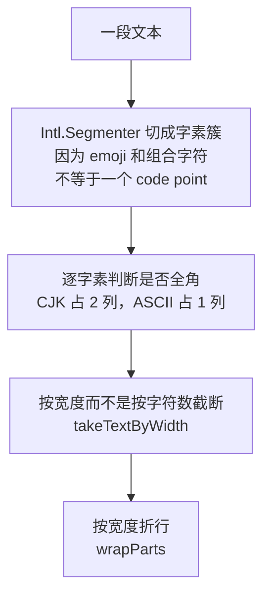

**用 `.length` 会全错**：一个 emoji 可能是 2–7 个 code point 但占 2 列；一个 CJK 字符是 1 个 code point 但占 2 列。

`SEP_WIDTH = 3` 是分隔符 `" │ "` 的宽度——连它都要显式算进去。

### 9.1 HUD 里的两个后台轮询

```typescript
export const MEMORY_POLL_INTERVAL_MS = 10_000;
export const MEMORY_FAILURE_STREAK_THRESHOLD = 3;

function useGitBranch(cwd: string): string | null
function useMemoryMaintenance(baseUrl: string): MemoryMaintenance | null
export function memoryMaintenanceStalled(maintenance): boolean
export function memoryMaintenanceLabel(maintenance): string | null
```

| 轮询 | 间隔 | 显示 |
|---|---|---|
| git 分支（`execGit`） | 随 cwd 变化 | 当前分支名 |
| 记忆维护状态 | 10 秒 | 编译停滞时的提示 |

**连续 3 次失败才算"停滞"**（`MEMORY_FAILURE_STREAK_THRESHOLD`）——一次瞬时失败不该在状态栏亮红灯。这和记忆系统本身"`rejected` / `failed` 不计入跳过计数"（见 [05 · 记忆系统](./05-记忆系统.md) §9.1）是同一条判断：**区分"这次没成"和"一直不成"**。

`memoryMaintenanceStalled()` 和 `memoryMaintenanceLabel()` 被导出，所以它们有独立的单元测试（`hud.test.ts`）。

---

## 10. 后端进程生命周期

`dev-server.ts`（473 行）的完整决策流见 [02 · 快速上手](./02-快速上手.md) §6.1。这里补三个实现要点。

### 10.1 26 条 API 契约

```typescript
export const REQUIRED_API_OPERATIONS = [
  { method: "GET",  path: "/api/config/llm" },
  { method: "POST", path: "/api/agent/sessions/{session_id}/messages/stream" },
  // ... 共 26 条
] as const;

export function findMissingApiOperations(paths: Record<string, unknown>): string[]
```

启动时拿 `/openapi.json` 逐条比对。**把运行时的怪异故障提前成启动期的明确报错。**

### 10.2 `stale` 缺失等同于 `stale=true`

```typescript
if (typeof payload.stale !== "boolean") return "it is too old to report whether its code is current";
```

注释解释：**最陈旧的后端恰恰最不可能报告自己陈旧**——因为它跑的是还没有这个字段的老代码。所以"缺字段"必须和"报告 true"同等对待。

这是一个可复用的判断模式：**当一个自检字段是后加的，缺失它就等于最坏情况**。

### 10.2.1 四条防孤儿进程的措施

后端是 Shell 起的子进程，退出时必须收干净。留下一个孤儿 uvicorn 的后果很具体：**它占着端口和 auth token**，下次启动会失败或连到一个错误的实例。`dev-server.ts` 有四处针对这件事。

**① 崩溃路径直接 SIGKILL。**

```ts
// Last-resort reap for paths that cannot await: the process 'exit' event.  A
// setTimeout scheduled here never fires — the event loop is already tearing
// down — so the previous SIGTERM-then-timer-SIGKILL escalation delivered only
// SIGTERM and left a wedged uvicorn orphaned holding the port and auth token.
```

这是一个修过的真实 bug。Node 的 `process.on('exit')` 回调里**事件循环已经在拆除**，`setTimeout` 永远不会触发。原先的逻辑是"先 SIGTERM，定时器到了再 SIGKILL"——在这条路径上只发出了 SIGTERM，卡死的 uvicorn 收到后没反应，定时器又永远不来，结果留下孤儿。

修法是在这条路径上**直接 SIGKILL**。注释解释了为什么可以这么粗暴：这条路只在崩溃/未捕获异常时走，此时子进程没有其他客户端，保证回收比优雅退出重要。正常退出走的是另一条可 await 的 `stopOwnedServer()`，那里有真正的宽限期。

**② 硬超时后不能清掉引用。**

```ts
// Do NOT clear ownedServer here: if the child survives the hard timeout, the
// sync `exit`-event fallback (cleanupOwnedServer) must still be able to see
// and signal it instead of leaving a port-holding orphan unreachable.
```

优雅停止超时之后，直觉是"放弃了，清掉引用"。但那样一来 ① 的兜底路径就**找不到这个子进程了**——它还活着、还占着端口，而唯一能杀它的代码已经看不见它。

保留引用直到它真的退出，是让最后一道防线仍然可用。

**③ 只在真正退出后才遗忘。**

```ts
// Only forget the child once it has actually exited: an 'error' event can
// ...
```

`error` 事件不等于进程结束——比如 stdio 管道出错，进程本身可能还在跑。按 `error` 就清引用，同样会制造一个不可达的孤儿。判据必须是 `exit` 事件。

**④ 收不掉就放弃，不要挂住 shell。**

```ts
// If SIGTERM (and the follow-up SIGKILL) still cannot reap the child, give up
// rather than hanging the shell in raw mode forever.
```

极端情况下（子进程处于不可中断的系统调用中）连 SIGKILL 都不会立即生效。此时**放弃比继续等更好**——终端还在 raw mode 里，一直等下去用户连 Ctrl-C 都用不了，只能强杀终端。

四条合起来是同一个取舍序列：**尽力回收 → 保留最后手段 → 判据要准 → 但绝不为此挂住用户**。最后一条是底线，和 §5.8.1 那句 "never hang the turn" 是同一种优先级判断。

这一组注释还示范了一件事：**每一条都写明了"如果不这样会发生什么"**，而不只是描述当前行为。"left a wedged uvicorn orphaned holding the port and auth token"、"leaving a port-holding orphan unreachable"——读的人立刻知道这行代码删掉的后果，也就不会在重构时顺手把它简化掉。这套文档能写出来，很大程度上就是因为源码里的注释是这种写法。

### 10.3 进程组信号

```typescript
// `uv run uvicorn ...` spawns uvicorn as a grandchild; signalling only the `uv`
// wrapper lets the port-holding uvicorn survive as an orphan.
```

`spawn` 用 `detached: true`，结束时给**负 pid** 发信号覆盖整个进程组。

而 `stopOwnedServer()` 在硬超时后**故意不清空**引用：

```typescript
// Do NOT clear ownedServer here: if the child survives the hard timeout, the
// [next attempt must] signal it instead of leaving a port-holding orphan unreachable.
```

三个超时常量：

| 常量 | 值 |
|---|---|
| `SERVER_PROBE_TIMEOUT_MS` | 3000 |
| 端口扫描范围 | `preferredPort` 起 21 个 |
| 复用失败时的起点 | `preferredPort + 1` |

---

## 11. 命令与技能的分离

`commands.ts` 里有一句注释是产品决策：

```typescript
/** Skills are reached through `@name` and `/skill`, never through this palette. */
```

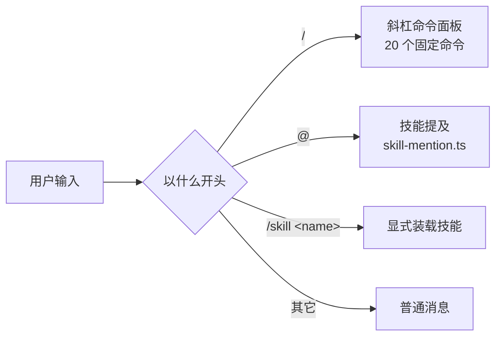

**技能不进命令面板**，因为技能数量会增长（现在 16 个，用户还能装），混进去会淹没真正的命令。

`skill-mention.ts` + `isSkillEnabled()` 负责 `@name` 的补全与校验。

---

## 12. 渲染子系统

| 模块 | 处理 |
|---|---|
| `streaming-markdown.ts` | 流式 Markdown——内容还没写完就要渲染 |
| `markdown-segments.ts` | 把 Markdown 切成可独立渲染的段 |
| `markdown-layout.ts` | 布局计算 |
| `markdown-table.tsx` | 表格（285 行，因为终端表格要手工算列宽） |
| `diff-block.tsx` | diff 高亮（371 行） |
| `text-layout.ts` | 文本布局与换行 |
| `smith-ui-schema.ts` | 结构化 UI 的 schema 校验（391 行） |
| `sanitize.ts` | 输入清洗 |

### 12.1 流式 Markdown 的难点

普通 Markdown 渲染器假设输入是完整的。流式场景下：

```
收到 "```pyth"     → 这是一个代码围栏的开头，还是普通文本？
收到 "```python\nx" → 现在确定是代码块了
```

**代码围栏误判**是踩过的坑——一个未闭合的围栏会让后面所有内容都被当成代码。`streaming-markdown.ts` 要在"内容不完整"的前提下做出可撤销的渲染决定。

### 12.2 `smith-ui-schema.ts`：结构化 UI 要校验

`render_ui` 工具让模型能产出结构化 UI（表单、列表、卡片）。但模型的输出**是不可信的**——一个不符合 schema 的载荷会让渲染器崩溃，进而崩掉整个终端。

所以有 391 行的 schema 校验，校验失败时降级成 `SMITH_UI_FALLBACK` 事件，渲染成纯文本。**一个渲染失败不能杀掉 UI。**

---

## 13. 测试

`shell/src` 里测试文件占 5.7k 行（16.4k 总量的 35%）：

| 测试 | 行数 | 覆盖 |
|---|---|---|
| `api.test.ts` | 760 | HTTP 客户端与 SSE |
| `bridge.test.ts` | 714 | 命令分发与事件消费 |
| `input.test.ts` | 570 | 按键处理 |
| `transcript-state.test.ts` | 512 | 状态机（纯函数，好测） |
| `commands.test.ts` | 426 | 20 个命令 |
| `transcript.test.tsx` | 281 | 渲染 |
| `store.test.ts` | 267 | 状态容器 |
| `panel-components.test.tsx` | 257 | 面板组件 |
| `setup.test.ts` | 194 | 配置向导 |
| `window-size.test.tsx` | 124 | 窗口尺寸 |
| `ink-static-cache.test.tsx` | 119 | **Static 缓存行为** |
| `dev-server.test.ts` | 113 | 后端生命周期 |

**`ink-static-cache.test.tsx` 单独存在**，说明 `Static` 的重印问题被认真对待——它有专门的回归测试。

### 13.0 测试锁住了什么

`shell/src/*.test.ts(x)` **304 个测试**：

| 文件 | 数量 | 覆盖 |
|---|---|---|
| `api.test.ts` | 34 | SSE 解码、HTTP 错误、URL 构造 |
| `input.test.ts` | 27 | 19 个处理器的责任链 |
| `transcript-state.test.ts` | 26 | 会话记录的状态机 |
| `bridge.test.ts` | 23 | 批处理、竞态、状态更新 |
| `commands.test.ts` | 20 | 20 个斜杠命令 |
| `panel-components.test.tsx` | 19 | 面板渲染 |
| `transcript.test.tsx` | 17 | 会话记录渲染 |
| `store.test.ts` | 13 | 状态容器 |
| `setup.test.ts` / **`sanitize.test.ts`** / `hud.test.ts` | 各 11 | 向导、**注入防护**、HUD |
| 其余 | 92 | composer、approval、text-layout 等 |

#### 注入防护：11 个测试逐条对应 §5.9–5.12

这组测试的命名值得整段抄下来——每一个都是一种具体攻击：

| 测试 | 对应 |
|---|---|
| **`strips an OSC 52 clipboard write`** | §5.10 最严重的那一个 |
| `strips OSC sequences that forge terminal state` | OSC 7 / OSC 0 |
| **`strips an unterminated OSC sequence to end of input`** | §5.11 终止符可选的 `?` |
| `strips an OSC sequence terminated by ST rather than BEL` | 两种终止符都要认 |
| `strips CSI sequences and two-character escapes` | 另两个分支 |
| **`strips carriage returns, which rewrite the printed line`** | §5.11 CR 不豁免 |
| `strips bell and 8-bit sequence introducers` | C1 区段 |
| `keeps text that rendering needs` | Tab / LF 必须保留 |
| **`leaves no escape byte behind for any payload`** | §5.11 三层的**顺序** |
| **`bidi overrides are stripped so a rendered command cannot lie`** | §5.11 ③ trojan source |
| `sanitizeUnknownText tolerates non-strings` | 非字符串输入不炸 |

倒数第二个的名字直接说出了威胁：**"so a rendered command cannot lie"**——渲染出来的命令不能说谎。这正是审批提示的核心安全属性。

`leaves no escape byte behind for any payload` 是覆盖性测试：不管载荷是什么，处理完不能有 ESC 字节残留。它守的是"顺序不能换"这条，任何把控制字符过滤提到前面的改动都会打红它。

#### SSE 解码：`done` 之后的三个测试

| 测试 | 对应 |
|---|---|
| **`trailing token_usage after done is not dropped`** | §5.8.1 用量不能丢 |
| **`a trailing token_usage in its own read is yielded exactly once`** | 落在**独立 TCP 读**里的帧，且**只发一次** |
| **`streamMessage stops after done even when the SSE body stays open`** | §5.8.1 绝不挂起 |
| `streamMessage ignores events after the first terminal event` | 只认第一个终态 |
| `SSE decoder preserves an incomplete terminal status` | `incomplete` 不能被归一成 `completed` |

第二个测试的 "exactly once" 很关键：排空逻辑用 `Promise.race` 加轮询，写错很容易让同一帧被 yield 两次——用量就翻倍了。这类"多一次"的 bug 不会报错，只会让统计数字慢慢偏离。

第三个测试模拟的是服务端**不关连接**的情况。它验证的不是功能而是**不会卡住**——一个只在异常部署下才出现的场景，但一旦出现就是每轮对话都挂。

`SSE decoding accepts CR-only line endings` 对应 §5.1：SSE 语法允许 CRLF、裸 LF、裸 CR 三种行尾，混用也合法。只按 `\n\n` 切帧会在纯 CR 的服务端上完全失效。

#### 其余值得一提的

| 测试 | 锁住 |
|---|---|
| `HTTP error text is safe to present in the terminal` | §5.8.3 错误文本既净化又限长 |
| `request timeout signals abort and identify timeout rather than user cancellation` | **超时和用户取消要能区分** |
| `SSE decoder exposes a user approval request with redacted arguments` | 审批请求里的参数已脱敏 |
| `SSE decoder sends an invalid smith-ui event to the CodeBlock fallback` | 结构化 UI 校验失败要降级而非崩 |
| `SSE decoder falls back from non-finite context usage values` | `Infinity`/`NaN` 要兜底 |
| `SSE decoder preserves provisional lifecycle events` | 试探性文本三态完整 |

`request timeout ... rather than user cancellation` 守的是一条容易混淆的界限：两者在底层都是 `AbortController.abort()`，但对用户意味着完全不同的事——超时该提示"服务端没响应"，用户取消不该提示任何错误。区分不了就会在用户主动按下中断时弹一个错误框。

---

### 13.1 12 个依赖鉴权的测试

在没有 `~/.agent-smith/auth_token` 的容器里会失败，因为它们调用真实的 `localAuthHeaders()`。造一个就绿：

```bash
mkdir -p ~/.agent-smith && printf token > ~/.agent-smith/auth_token && chmod 600 ~/.agent-smith/auth_token
```

**这是环境噪声不是回归**——它们在 `main` 上表现一致。

---

## 14. 参数速查

| 参数 | 值 | 位置 |
|---|---|---|
| 会话记录上限 / 裁剪目标 | 200 / 150 | `store.ts` |
| 探测超时 | 3000 ms | `dev-server.ts` |
| 端口扫描范围 | 首选端口起 21 个 | `dev-server.ts` |
| 必需 API 操作 | 26 条 | `dev-server.ts` |
| 斜杠命令 | 20 个 | `commands.ts` |
| 顶层模式 | boot / setup / chat | `store.ts` |
| 技能状态 | 7 个 | `transcript-state.ts` |
| 视图模式 | compact / transcript | `transcript-state.ts` |
| Node 版本 | `>= 22` | `package.json` |
| ink 版本 | `^7.1.1`（overrides 强制） | `package.json` |
| shiki 版本 | `4.3.1`（精确锁定） | `package.json` |
| 测试占比 | 约 35%（5.7k / 16.4k 行） | — |

---

### 14.1 这一层反复出现的五条手法

Shell 的 16 000 行 TypeScript 里，同样的处理方式在 store、bridge、api、transcript-state 之间反复出现。

**① 在边界处理，不在使用处处理。** 净化放在解码边界而不是每个渲染器（§5.12），后端通信全走 `bridge.ts` 而不是各组件自己调（§5.5），批处理放在进 store 之前而不是组件里做防抖。共同理由是**新增的使用方不会忘记**——收敛点上的处理是强制的，分散的处理靠自觉。

**② 显示的必须等于生效的。** 审批提示的六道竞态防护（§7.0）、草稿不能单方面擦除（§7.0.1 ③）、交替 flush 保证文本顺序（§5.7）。终端 UI 的特殊之处在于**用户会基于屏幕内容做不可逆的决定**，显示和状态的任何分歧都可能变成一次错误的批准。

**③ 未终结的状态要能被推进，终结的不能被改写。** `awaiting_input` 必须在 `SKILL_END` 处就识别（§7.0.1 ①），因为终态一旦写入就不可逆；反过来，没有结果的工具调用要主动清理（§7.0 ⑥），不能永远挂着。**状态机的两端都要管**。

**④ 同一个事实只显示一次。** 内部遥测不进聊天（§7.0.1 ②），命令面板不混入技能（§11）。终端的纵向空间比网页贵得多——重复显示的代价是把真正需要看的东西挤出屏幕。

**⑤ 宁可少数据，不可卡界面。** `done` 之后排空用量帧有时间预算（§5.8.1），错误文本限长 2 000 字符（§5.8.3），会话记录有条数上限并按批裁剪。每一处都是"完整性 vs 响应性"的取舍，而方向一致：**终端卡住是用户立刻能感知的故障，统计少算不是。**

这五条里，①②在 [09 · Server API 层](./09-Server-API层.md) 也成立（归属校验放仓库层、显示与存储一致），③④⑤是终端 UI 特有的——因为只有它同时受限于屏幕尺寸和人的反应时间。

值得单独强调的是②在这一层的份量。后端的状态错误通常表现为数据不对，可以事后修；而终端 UI 的状态错误会直接变成**用户基于错误信息做出的决定**——批准了一个没看见的命令、以为任务完成了其实在等自己回话、以为输出结束了其实被中断了。这类错误没有"事后修"，因为副作用已经发生。所以审批、终态文案、草稿保留这三处的防护看起来偏重，实际上正好。

### 14.2 改 Shell 之前先问三个问题

**① 这段文本来自服务端吗？** 是的话，它必须经过 `sanitizeTerminalText`，而且要在 `api.ts` 的解码边界做，不是在组件里。模型输出、工具结果、技能描述、MCP 元数据、会话标题——全都算。新增一个从后端取数据的函数时，检查它的返回值有没有走净化。

**② 这个改动会影响审批提示吗？** 任何触碰 `pendingApproval`、`lastToolCallId`、视图模式切换的改动，都要对照 §7.0 的六条重新检查一遍。这是 Shell 里唯一"UI bug 等于安全 bug"的区域。

**③ 这个改动会增加重渲染吗？** Ink 的每次重渲染都要重画终端。新增的 `setState` 调用如果在流式路径上，就该考虑走批处理（§5.6）；新增的全屏组件要确认它不会触发 `<Static>` 的整卷重印（§4.2）。

三个问题分别对应 `sanitize.test.ts`（11 个）、`approval.test.ts`（7 个）、`transcript.test.tsx`（17 个）。

还有一条不在问题清单里的经验：**终端 UI 的 bug 很难靠读代码发现**。Ink 的 `Box` 只做换行不做裁剪、`<Static>` 在特定条件下会整卷重印、宽字符的列宽计算——这些都只在真实终端里以特定宽度运行才暴露。项目记录里那套 `script` + `stty -icrnl` 逐字符喂键的跑法就是为此存在的：单元测试能覆盖状态转换，但覆盖不了"渲染到 80 列的终端上是什么样"。改动任何涉及布局或宽度的代码时，真跑一遍比多写三个断言有用。

---

## 15. 设计取舍

**① 状态机做成纯函数。** `applyStreamEvent(entries, event) → entries` 没有副作用，所以 512 行测试能覆盖全部分支。代价是每次事件都要重建数组。

**② `Static` 换性能，代价是重印陷阱。** 不用 `Static` 就没有重印问题，但每个 token 都会重绘整个历史。选了性能，然后用 epoch + clearTerminal 处理边缘情况，并留一个专门的回归测试。

**③ 技能不进命令面板。** 命令是固定的 20 个，技能会增长。混在一起会让命令面板变成一个搜索框。

**④ 结构化 UI 必须校验。** 模型输出不可信，渲染崩溃会杀掉整个终端。391 行校验换一个降级路径。

**⑤ 精确锁定 shiki。** 高亮器的转义序列直接影响布局，minor 升级不可信。

**⑥ 用 `overrides` 绕过 peer 锁。** 因为只用了 ink 的几个稳定 API，风险可控——但这是一个需要人工判断的决定，不是可以无脑复制的做法。

**⑦ 宽度相关行为必须真 PTY 测。** `Box` 只 wrap 不裁剪，普通断言看不到折行。

---

## 16. 接下来

| 想深入 | 读 |
|---|---|
| 26 种事件的完整语义 | [03 · 架构总览](./03-架构总览.md) §3 |
| 启动协商的完整流程 | [02 · 快速上手](./02-快速上手.md) §6 |
| 20 个斜杠命令各做什么 | [02 · 快速上手](./02-快速上手.md) §7 |
| Shell 打的端点 | [09 · Server API 层](./09-Server-API层.md) §2 |
| 审批面板显示的内容从哪来 | [06 · 安全与安全边界](./06-安全与安全边界.md) §6.3 |
