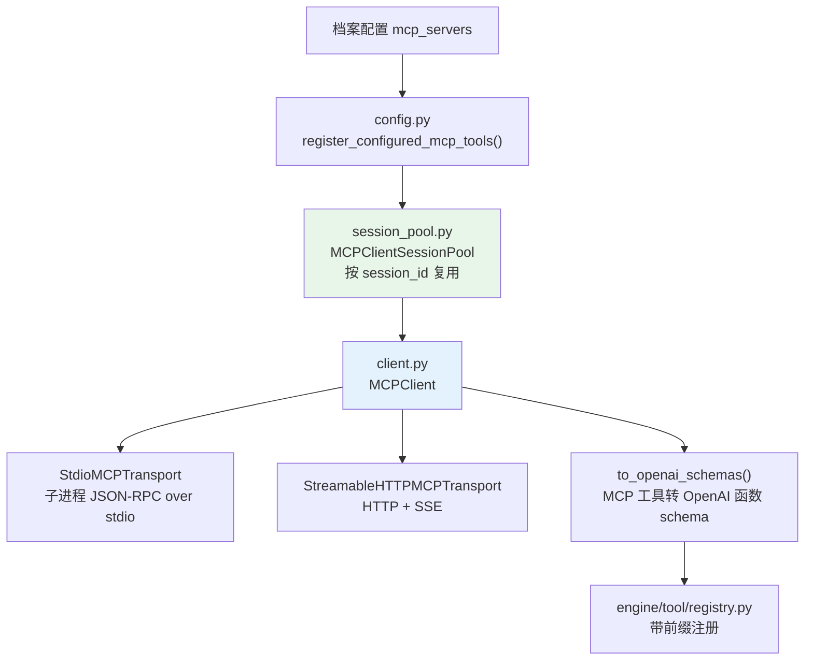
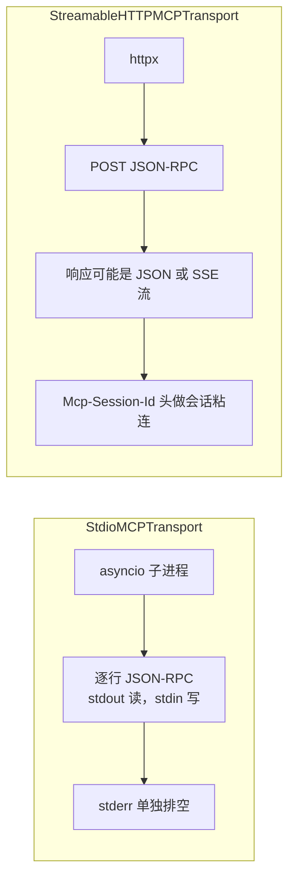
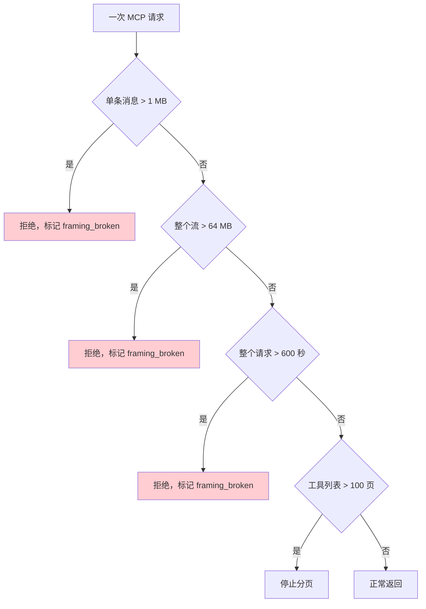
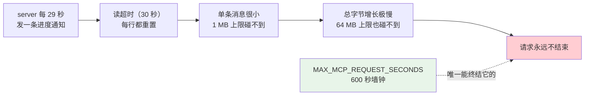
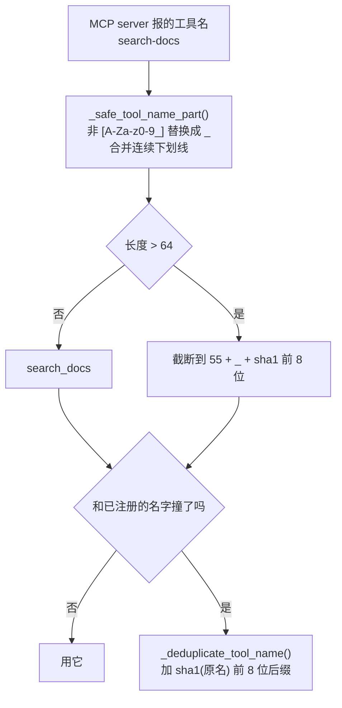
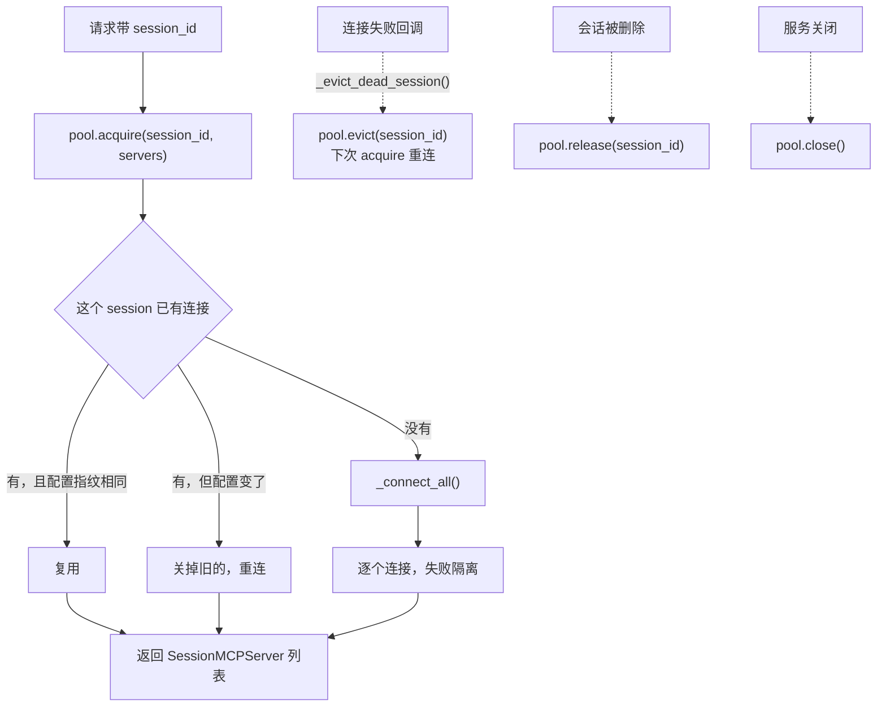
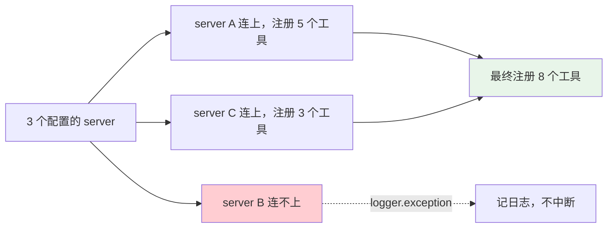

# 12 · MCP 集成

> **定位**：`engine/mcp/` 1.2k 行——两种传输、协议协商、工具名归一化、会话级连接池、以及四道防止一个坏 MCP server 拖垮整个运行的边界。
> **适合**：要接 MCP server 的人；被 MCP 的流式协议坑过的人。

---

## 1. 全景



---

## 2. 协议版本

```python
PROTOCOL_VERSION = "2025-11-25"
SUPPORTED_PROTOCOL_VERSIONS = {
    "2025-11-25",
    "2025-06-18",
    "2025-03-26",
    "2024-11-05",
}
CLIENT_INFO = {"name": "agent-smith", "version": "0.2.0"}
```

**声明最新版，接受四个版本**。MCP 协议演进较快，server 的实现分布在多个版本上，只接受最新版会让大部分现成 server 用不了。

---

## 3. 两种传输



两者都实现同一个 `MCPTransport` 协议：

```python
class MCPTransport(Protocol):
    async def connect(self) -> None: ...
    async def send_request(self, method: str, params: dict) -> dict: ...
    async def send_notification(self, method: str, params: dict) -> None: ...
    async def close(self) -> None: ...
```

### 3.1 stdio 的子进程环境白名单

```python
_MCP_SAFE_ENV_KEYS = ("LANG", "LC_ALL", "LC_CTYPE", "TERM", "TZ", "NO_COLOR")

def _mcp_subprocess_environment(env: dict[str, str] | None) -> dict[str, str]:
```

和 Seatbelt 沙箱同一套思路（见 [06 · 安全与安全边界](./06-安全与安全边界.md) §9.1）：**只有六个变量能进 MCP 子进程**，其余一律不继承——一个 MCP server 不该看到你的 `AWS_SECRET_ACCESS_KEY`。

用户在配置里显式给的 `env` 会被合并进来，但**宿主环境不自动继承**。

### 3.2 日志脱敏

```python
def _redact_command(command: list[str]) -> str: ...
def _redact_url(url: str) -> str: ...
```

MCP server 的启动命令和 URL 里经常带 token（`npx some-server --api-key=xxx`、`https://host/mcp?token=xxx`）。记日志前必须脱敏。

---

## 4. 四道边界

这是这个模块最值得学的部分。四个上限各防一种失效，**缺一个就有一条路能挂住整个运行**。



| 常量 | 值 | 防什么 |
|---|---|---|
| `MAX_MCP_RESPONSE_BYTES` | 1 MB | 单条消息过大 |
| `MAX_MCP_SSE_STREAM_BYTES` | 64 MB | 整个流的总量 |
| `MAX_MCP_REQUEST_SECONDS` | 600 秒 | 整个请求的墙钟 |
| `MAX_MCP_TOOL_LIST_PAGES` | 100 | 无限分页 |

### 4.1 为什么字节上限不够，还要墙钟

这段注释把问题讲得非常清楚：

```python
# A whole-request wall clock.  Both transports reset their read timeout on
# every line, so a server that trickles progress notifications keeps a request
# open for as long as it likes; the byte ceilings above cannot stop that,
# because a trickle is precisely what does not spend bytes.  Loose enough that
# a legitimately slow tool call is unaffected, finite so a hung one ends.
```



代码里的注释更直白：

> a byte budget alone would let ~1M tiny notifications run for months.
> （单靠字节预算，一百万条微小通知能跑几个月。）

**"涓流"恰恰是不花字节的那种攻击。** 对应提交：`efe49d2 fix(mcp): bound a trickling response by time, not only by bytes`。

实现上，每次读的超时取 `min(30, remaining)`：

```python
deadline = loop.time() + MAX_MCP_REQUEST_SECONDS
while True:
    remaining = deadline - loop.time()
    if remaining <= 0:
        self._framing_broken = True
        raise RuntimeError("MCP stdio response exceeded maximum total time")
    line = await asyncio.wait_for(self._process.stdout.readline(), timeout=min(30, remaining))
```

**最后一次读被剩余时间限制，所以它先到期**——不会出现"墙钟到了但还在等一个 30 秒的读"。

### 4.2 `framing_broken`：一次超限之后整条连接作废

```python
_FRAMING_BROKEN_MESSAGE = (
    "MCP stdio transport retired: an earlier response exceeded the maximum "
    "size and left the stream desynchronized"
)
```

理由写在超限分支的注释里：

> Same reasoning as the byte cap below: **we abandon the read mid-stream, so the next request would desynchronize.**

stdio 是**逐行 JSON-RPC**，没有帧长度前缀。中途放弃读取意味着流里还剩半条消息，下一个请求会读到那个残骸并把它当成自己的响应。

所以超限不是"这次失败"，是**这条传输永久报废**，必须重连。

### 4.3 死连接的三种消息

```python
_STDIO_DEAD_CONNECTION_MESSAGES = frozenset({
    "MCP server closed stdout unexpectedly",     # 子进程死了
    "MCP stdio transport not connected",         # 从没连上
    _FRAMING_BROKEN_MESSAGE,                     # 帧同步坏了
})
```

注释：

> A dead subprocess surfaces as EOF, and a retired transport refuses all future requests. **Both mean the session must reconnect, not retry.**

`is_fatal_connection_error(exc)` 用这个集合判定"该重连还是该重试"——**这两件事的处理完全不同**，重试一个死连接只是浪费时间。

---

## 5. 工具名归一化

MCP server 的工具名可以是任意字符串，但 provider 的函数名有格式和长度限制（实测踩过 **113 字符的工具名超出 provider 限制**）。



### 5.1 清洗是有损的，所以会撞名

```python
def _deduplicate_tool_name(registered_name: str, original: str, taken: set[str]) -> str:
    """Cleaning is intentionally lossy — ``safe-tool`` is meant to become
    ``safe_tool`` — but two server-side names can fold onto one registered name
    (``search-docs`` and ``search_docs``), and the loser used to hit
    ``register()``'s duplicate-name error and vanish from the session behind a
    warning.  Suffix only the actual collision, so names that do not collide keep
    their exact spelling."""
```

`search-docs` 和 `search_docs` 都会变成 `search_docs`。旧行为是**后来的那个静默消失**（只留一条 warning），用户完全不知道有个工具没注册上。

修法有一个克制之处：**只给真正撞名的那个加后缀**，没撞的保持原拼写。否则所有工具名都会带一串哈希，可读性全无。

### 5.2 广告的名字必须等于注册的名字

```python
def _mcp_registered_name(prefix: str, tool_name: str, taken: set[str]) -> str | None:
    """Two server-side names can fold onto one registered name; ``taken`` applies
    the same collision suffix the registry would, so an advertised schema name
    always equals the name actually registered.  Returns None when the tool
    name cleans down to nothing."""
```

**注册和广告用同一个函数**。如果 schema 里写的名字和注册表里的不一样，模型会调一个不存在的工具。

返回 `None` 的情况：工具名清洗后变成空（比如名字全是中文或符号）——这时干脆不注册。

---

## 6. 会话连接池

`engine/mcp/session_pool.py`（194 行）。



### 6.1 配置指纹

```python
def _fingerprint(configured_servers: list[dict[str, Any]]) -> str:
```

用户改了 `mcp_servers` 配置后，池里的旧连接必须被替换。指纹变化就是替换的触发条件。

### 6.2 每个会话一把锁

```python
async def _get_session_lock(self, session_id: str) -> asyncio.Lock:
```

同一个会话的两个并发请求不能同时去连同一批 server——否则会开两倍的子进程。

### 6.3 死会话驱逐

`config.py` 里注册工具时传入回调：

```python
async def _evict_dead_session() -> None:
    """Reconnect the next acquire instead of reusing a dead client."""
    await session_pool.evict(session_id)
```

**连接失败的正确处理是驱逐而不是重试**——因为一个死掉的 stdio 子进程不会自己活过来。

---

## 7. 故障隔离

`engine/mcp/config.py` 的 docstring：

> Iterates `profile_config["mcp_servers"]` and connects each server, **isolating failures so one broken server cannot prevent the rest from registering**. The caller receives the clients and applies its own ownership policy; **this module never reaches into an execution container.**



两条边界：

- **一个坏 server 不影响其余的**
- **这个模块不碰执行容器**——它返回 client 列表，由调用方决定所有权（`owns_mcp_clients`）

第二条是层边界的体现：MCP 注册不该知道谁负责关这些连接。

---

## 8. 类型与错误

```python
@dataclass
class MCPTool: ...

class MCPToolError(RuntimeError): ...        # 工具调用失败
class MCPConnectError(RuntimeError): ...     # 连接失败
class MCPSessionExpiredError(RuntimeError): ...  # HTTP 会话过期
```

`MCPSessionExpiredError` 是 Streamable HTTP 特有的——server 可以让 `Mcp-Session-Id` 失效，客户端要重新初始化而不是当成普通错误。

### 8.1 严格的 JSON 校验

```python
def _require_json_object(value: Any, *, label: str) -> dict[str, Any]:
    if not isinstance(value, dict):
        raise RuntimeError(f"{label} must be a JSON object")

def _parse_json_object(payload: str, *, label: str) -> dict[str, Any]:
```

**每一处解析都带 `label`**，所以错误信息能说清是哪一步的哪个字段出了问题——而不是一个孤零零的 `JSONDecodeError`。

---

## 9. 已知限制

`CLAUDE.md` 的记录与实测结论：

| 项 | 状态 |
|---|---|
| **stdio 单条消息 1 MB 硬墙** | 超限即报废传输，需重连 |
| **工具名长度** | 归一化到 64 字符内；实测遇到过 113 字符的原始名 |
| **server → client 消息** | 当前实现**不处理**服务端主动发起的请求 |
| **lazy-load / HTTP 重连 / Resources** | 历史记录里提过，**代码里不存在** |

最后一条值得强调：早期的记录里写过"已实现 MCP lazy-load、HTTP 自动重连、Resources 支持"，但**代码里找不到这些机制**。这正是 `CLAUDE.md` 那句 "Trust code over docs" 的由来。

---

## 10. 参数速查

| 参数 | 值 |
|---|---|
| 声明协议版本 | `2025-11-25` |
| 接受协议版本 | 4 个（2024-11-05 起） |
| 客户端标识 | `agent-smith` / `0.2.0` |
| 单条消息上限 | 1 MB |
| 整流上限 | 64 MB |
| 请求墙钟 | 600 秒 |
| 单次读超时 | `min(30, 剩余时间)` 秒 |
| 工具列表最大页数 | 100 |
| 工具名最大长度 | 64 |
| 撞名后缀 | sha1(原名) 前 8 位 |
| 子进程环境变量白名单 | 6 个 |
| 传输实现 | stdio、Streamable HTTP |

---

## 11. 设计取舍

**① 四道边界，每道防一种失效。** 单消息、整流、墙钟、分页。墙钟是后加的，因为前三道都拦不住"涓流"。

**② 超限即报废传输而不是重试。** 逐行 JSON-RPC 没有帧长度前缀，中途放弃读取会让流永久失同步。

**③ 区分"该重连"和"该重试"。** 三种死连接消息构成一个显式集合，判错了只是浪费时间。

**④ 工具名清洗有损，所以要处理撞名。** 而且只给真正撞的加后缀，保住其余名字的可读性。

**⑤ 注册和广告用同一个命名函数。** 否则模型会调一个不存在的名字。

**⑥ 子进程环境白名单。** 一个 MCP server 不该看到宿主的全部环境变量。

**⑦ 故障逐 server 隔离。** 一个坏 server 不能让其余的都注册不上。

**⑧ 这一层不管所有权。** 返回 client 列表，由调用方按 `owns_mcp_clients` 决定谁关。

---

## 12. 接下来

| 想深入 | 读 |
|---|---|
| MCP 工具怎么进工具注册表 | [04 · Engine 核心执行](./04-Engine-核心执行.md) §5 |
| 连接池的所有权语义 | [03 · 架构总览](./03-架构总览.md) §2.3 |
| 怎么配置 MCP server | [02 · 快速上手](./02-快速上手.md) §11 |
| 沙箱的同类环境白名单 | [06 · 安全与安全边界](./06-安全与安全边界.md) §9.1 |
