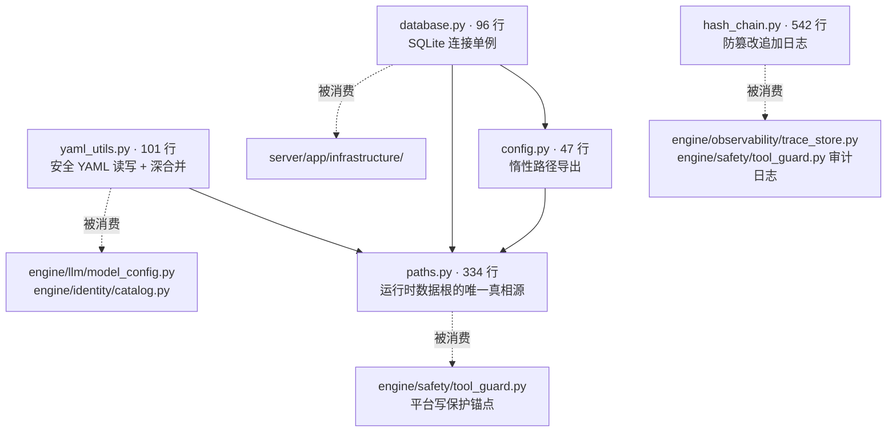
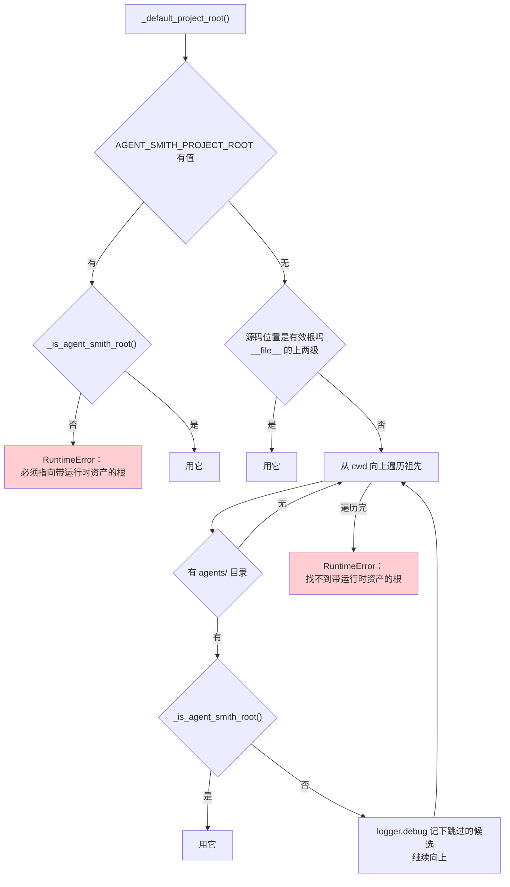
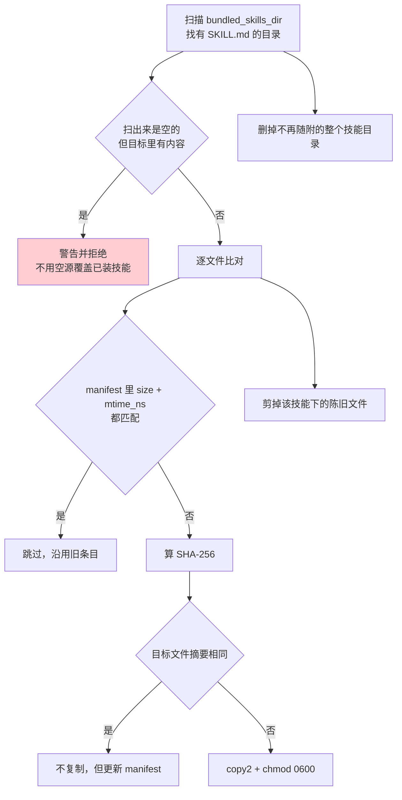
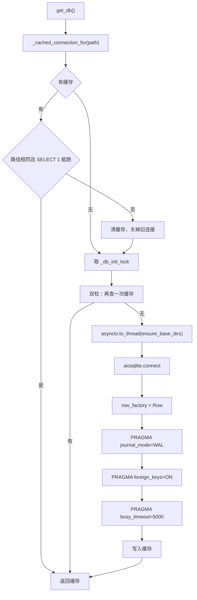
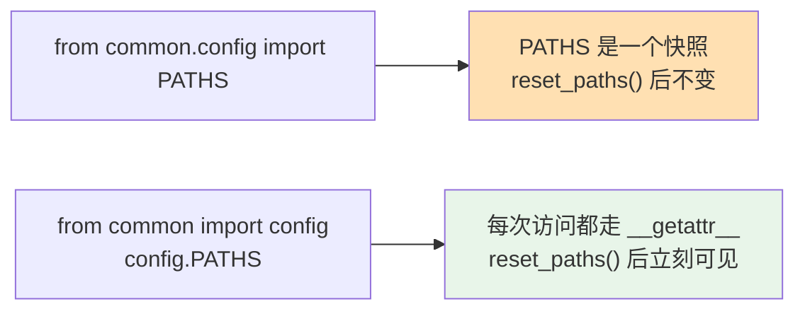
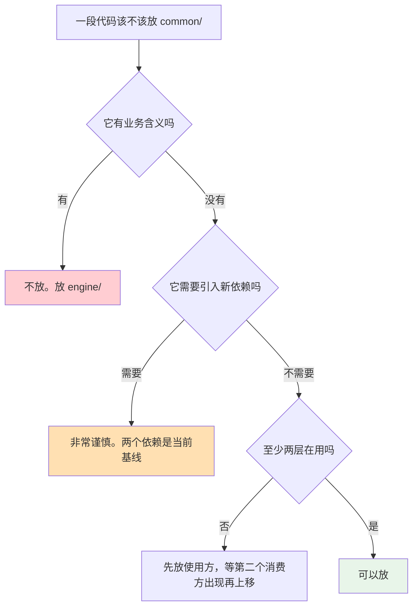

# 13 · Common 基础设施

> **定位**：`common/` 1.1k 行，五个文件——路径根、YAML 读写与合并、SQLite 连接、审计哈希链、惰性配置。**零业务逻辑。**
> **适合**：想知道"基础设施层到底该放什么"的人；要改路径或数据库连接的人。

这一层只有五个文件、两个依赖（`pyyaml` + `aiosqlite`）。**依赖数量就是边界纪律的度量**——一个基础设施层如果开始长依赖，说明它在偷偷做业务。

---

## 1. 五个文件



| 文件 | 行数 | 职责 |
|---|---|---|
| `hash_chain.py` | 542 | 防篡改追加日志（见 [06 · 安全与安全边界](./06-安全与安全边界.md) §10） |
| `paths.py` | 334 | 路径根、权限强制、内建技能镜像 |
| `yaml_utils.py` | 101 | 安全读写 + 深合并 |
| `database.py` | 96 | 连接单例 + 健康检查 |
| `config.py` | 47 | 惰性单例与遗留导出 |

---

## 2. `paths.py`：不只是拼路径

完整讨论见 [01 · 总览](./01-总览.md) §3.1 和 [02 · 快速上手](./02-快速上手.md) §15。这里补齐路径属性表和几个未讲的实现。

### 2.1 全部路径属性

```python
@dataclass(frozen=True)
class AppPaths:
    data_dir: Path        # ~/.agent-smith
    project_root: Path    # 仓库根
```

| 属性 | 值 |
|---|---|
| `agent_dir` | `data_dir / "agent"` |
| `sqlite_path` | `data_dir / "sqlite" / "agent-smith.sqlite"` |
| `builtin_skills_dir` | `data_dir / "builtin" / "skills"` |
| `smith_profile_dir` | `project_root / "agents" / "smith"` |
| `builtin_tools_dir` | `project_root / "agents" / "tools"` |
| `builtin_identities_dir` | `project_root / "agents" / "identities"` |
| `safety_rules_path` | `project_root / "agents" / "safety" / "dangerous_commands.json"` |
| `bundled_skills_dir` | **安装位优先，源码树兜底** |

### 2.2 `bundled_skills_dir` 的双路径

```python
@property
def bundled_skills_dir(self) -> Path:
    """Skill assets shipped with Smith, with a source-tree fallback for development."""
    installed = Path(sysconfig.get_path("data")) / "agent_smith_common" / "builtin_skills"
    if installed.is_dir():
        return installed
    return self.project_root / "agents" / "skills"
```

wheel 安装后技能在 `sysconfig` 的 data 目录（由 `common/pyproject.toml` 的 `[tool.setuptools.data-files]` 放置）；开发时回落到源码树。

**同一个属性在两种部署形态下指向不同位置**，调用方无感知。

### 2.3 项目根发现：三级回落 + 签名校验



**签名校验**：

```python
def _is_agent_smith_root(project_root: Path) -> bool:
    agents_dir = project_root / "agents"
    return (
        (agents_dir / "smith" / "config.yaml").is_file()
        and (agents_dir / "identities" / "smith.yaml").is_file()
        and any((agents_dir / "skills").glob("*/SKILL.md"))
    )
```

三个条件缺一不可。注释说明了为什么不能只看 `agents/` 存不存在：

> Stricter validation: check for Agent-Smith signature files **to avoid mistaking another project's agents/ directory**.

而且跳过的候选会打 `logger.debug`：

> Log skipped candidates to make root-discovery mismatches diagnosable.

**"我在 X 目录跑，为什么根被认成了 Y"** 这类问题，没有这行日志就只能靠猜。

### 2.4 受管路径的四个辅助函数

| 函数 | 作用 |
|---|---|
| `_ensure_real_path()` | 逐段拒绝软链 |
| `_ensure_real_descendant()` | 拒绝逃出受管根的路径 + 逐段拒绝软链 |
| `_ensure_managed_directory()` | 建私有目录树，**替换冲突的普通文件** |
| `_prepare_managed_file()` | 保证文件的父目录是真实受管目录，且目标不是别的类型 |
| `_remove_managed_path()` | 删除时不跟随最终软链 |

`_remove_managed_path()` 的注释解释了一个微妙之处：

```python
# A stale leaf symlink is safe to unlink: unlink() removes the link itself
# and cannot touch its target.  Its parents must still be real managed
# directories, otherwise a path such as ``target/link/stale`` could escape
# the managed tree.
```

**叶子软链可以直接 `unlink()`**（只删链接不碰目标），但**它的父级必须都是真实受管目录**——否则 `target/link/stale` 这样的路径能逃出受管树。

### 2.5 内建技能的增量镜像

`_install_builtin_skills()` 是 `paths.py` 里最长的函数（100 行）。它维护一份 `.manifest.json`：

```json
{
  "skills": ["grilling", "research", ...],
  "files": {
    "grilling/SKILL.md": {
      "source": {"mtime_ns": ..., "size": ..., "sha256": "..."},
      "target": {"mtime_ns": ..., "size": ...}
    }
  }
}
```



**三级判定**：先比元数据（便宜），元数据不符再比摘要（贵），摘要也不同才复制。

**空源防呆**很重要：

```python
if not shipped and any(child.is_dir() for child in target.iterdir()):
    logger.warning("refusing to replace installed builtin skills with an empty source: %s", source)
    return
```

一次路径解析错误（比如 `bundled_skills_dir` 指到了空目录）会把用户已装的技能全删掉。这条检查把它变成一条警告。

**陈旧文件剪除按路径深度倒序**：

```python
stale_paths = sorted(..., key=lambda path: len(path.parts), reverse=True)
```

先删深层再删浅层，否则删父目录时子文件还在。

---

## 3. `yaml_utils.py`：101 行里的四个安全决定

### 3.1 读：拒绝非 mapping 根

```python
def load_yaml(path) -> dict[str, Any]:
    if not p.is_file():
        return {}                      # 文件不存在 → 空 dict，不抛
    data = yaml.safe_load(f)           # safe_load，不是 load
    if data is None:
        return {}                      # 空文件 → 空 dict
    if not isinstance(data, dict):
        raise YamlConfigError(f"YAML root in {p} must be a mapping")
```

四个分支各有语义：**不存在 → 空**、**空文件 → 空**、**非 mapping → 报错**、**语法错 → 报错**。

用 `yaml.safe_load` 而不是 `yaml.load`——后者能构造任意 Python 对象。

### 3.2 写：原子 + fsync + 私有权限

```python
fd, temp_name = tempfile.mkstemp(dir=p.parent, prefix=f".{p.name}.", suffix=".tmp", text=True)
with os.fdopen(fd, "w", encoding="utf-8") as f:
    f.write(content)
    f.flush()
    os.fsync(f.fileno())      # 落盘
os.chmod(temp_path, PRIVATE_FILE_MODE)   # 0600，在 replace 之前
os.replace(temp_path, p)                 # 原子替换
```

四个细节：

1. **临时文件建在同一个目录**（`dir=p.parent`）——跨文件系统的 `os.replace` 不是原子的
2. **`fsync` 之后才替换**——否则崩溃可能留下一个内容为空的新文件
3. **`chmod` 在 `replace` 之前**——否则存在一个窗口，文件已就位但权限还是 `mkstemp` 的默认值
4. **失败时清理临时文件**（`except BaseException` + `unlink`）

写之前还会检查路径软链（`_ensure_real_path`）和父目录（`_ensure_private_parent`）。

`_ensure_private_parent()` 有一个先收集再创建的写法：

```python
missing: list[Path] = []
current = path
while not current.exists():
    missing.append(current)
    current = current.parent
...
for directory in reversed(missing):
    directory.mkdir(mode=PRIVATE_DIR_MODE)
    directory.chmod(PRIVATE_DIR_MODE)
```

**先向上找到第一个存在的祖先，再自顶向下逐级创建并 chmod**。用 `mkdir(parents=True)` 做不到这一点——中间层级的权限不受控。

`FileExistsError` 分支处理竞态：另一个进程刚建了这个目录，要重新确认它不是软链、且确实是目录。

### 3.3 `merge_configs`：`None` 不覆盖

```python
def merge_configs(*configs: dict[str, Any]) -> dict[str, Any]:
    """Deep merge dicts. Later overrides earlier."""
    for cfg in configs:
        for key, value in cfg.items():
            if value is None:
                continue                          # ← 这一行是全部语义
            if key in result and isinstance(result[key], dict) and isinstance(value, dict):
                result[key] = merge_configs(result[key], value)
            else:
                result[key] = value
```

**`None` 表示"我不表态"，不是"清空"。** 这一行是五层 LLM 配置合并（见 [02 · 快速上手](./02-快速上手.md) §3.2 坑 2）的全部机制。

`agents/smith/config.yaml` 里的 `model: null` 因此不会覆盖下层——这是**刻意的默认值**，让种子层可以留空而不破坏平台层的配置。

深合并只对**两边都是 dict** 的键递归，其余直接覆盖。所以 `llm.routes` 会合并，但一个列表字段会被整体替换。

---

## 4. `database.py`：96 行的连接单例



### 4.1 两把锁，各管一件事

```python
_db_lock = asyncio.Lock()        # 保护 _db / _db_path 这两个变量
_db_init_lock = asyncio.Lock()   # 保护"初始化"这个动作
```

注释解释了为什么要分开：

```python
# Directory setup hashes and copies files.  It is synchronous by design,
# so run it in a worker and keep the database-state lock available.
async with _db_init_lock:
    ...
    await asyncio.to_thread(paths.ensure_base_dirs)
```

`ensure_base_dirs()` 会做 SHA-256 和文件复制（内建技能镜像），耗时可观。如果它拿着"数据库状态锁"，所有想读缓存的协程都会被阻塞。所以：**初始化锁保护慢操作，状态锁只保护变量读写**。

而且初始化锁内部有**双重检查**——等锁期间另一个协程可能已经建好了连接。

### 4.2 缓存连接的健康检查

```python
async def _check_connection_health(conn) -> bool:
    try:
        cursor = await conn.execute("SELECT 1")
        await cursor.close()
    except (sqlite3.Error, ValueError):
        return False
    return True
```

**一个缓存的连接可能已经死了**（进程被 fork、底层文件被删、连接被别处关闭）。每次取缓存都跑一次 `SELECT 1`，代价近乎为零。

捕获 `ValueError` 是因为 aiosqlite 在连接已关闭时抛的是这个。

### 4.3 三个 PRAGMA

| PRAGMA | 值 | 理由 |
|---|---|---|
| `journal_mode` | `WAL` | 读写不互相阻塞 |
| `foreign_keys` | `ON` | SQLite **默认关闭**外键约束；不显式打开，`ON DELETE CASCADE` 就是摆设 |
| `busy_timeout` | `5000` ms | 注释：等一个并发写者（server 与 CLI 共享这个文件）而不是立刻报 `database is locked` |

第二条是 SQLite 最经典的坑：schema 里写了 `REFERENCES ... ON DELETE CASCADE`，不开 PRAGMA 就完全不生效，删会话不会删消息。

### 4.4 连接失败要关掉半成品

```python
db = await aiosqlite.connect(str(sqlite_path))
try:
    ...三个 PRAGMA...
except BaseException:
    await db.close()      # PRAGMA 失败时连接已经建好了，必须关
    raise
```

---

## 5. `config.py`：惰性单例的两个理由

47 行，全部是为了"路径实例什么时候创建"。

### 5.1 为什么惰性

```python
def _get_paths() -> AppPaths:
    """Lazy initialization: allows runtime environment changes before first access."""
```

`AppPaths.defaults()` 会读 `AGENT_SMITH_PROJECT_ROOT` 环境变量并做项目根发现。如果在 import 时就执行，**测试没法在导入之后再设环境变量**。

### 5.2 `__getattr__` 做遗留导出

```python
def __getattr__(name: str):
    paths = _get_paths()
    mapping = {"DATA_DIR": paths.data_dir, "AGENT_DIR": paths.agent_dir, ...}
```

模块级 `__getattr__`（PEP 562）让 `common.config.DATA_DIR` 这类老写法继续工作，**同时保持惰性**——一个模块级常量赋值会在 import 时求值，而 `__getattr__` 是访问时求值。

### 5.3 `reset_paths()` 的一条重要警告

```python
"""Replace the lazy path instance for tests or runtime reconfiguration.

Later ``config.PATHS`` lookups observe the replacement.  A value imported
with ``from common.config import PATHS`` is an ordinary Python snapshot and
intentionally keeps the instance that was bound at import time."""
```



**两种 import 写法行为不同**，而且这是 Python 的固有语义不是 bug。文档把它写下来，是因为测试里 monkeypatch 路径时踩这个坑会非常困惑——你以为换了路径，但某个模块在 import 时就把旧的绑住了。

实践中有一条相关教训：一个 service 的 `_config_path` 是**类属性**，环境变量隔离对它无效，必须 monkeypatch，否则测试会改到真实的 `~/.agent-smith/config.yaml`。**同一类问题的另一个表现形式。**

---

## 6. `hash_chain.py`

完整讨论见 [06 · 安全与安全边界](./06-安全与安全边界.md) §10。这里只补参数表：

| 常量 | 值 |
|---|---|
| `CHAIN_VERSION` | 1 |
| `CHAIN_FILE_MODE` | `0o600` |
| `_PRIVATE_DIR_MODE` | `0o700` |

核心 API：

| 函数 / 方法 | 作用 |
|---|---|
| `canonical_json(value)` | 稳定序列化（哈希的前提） |
| `sha256_hex(text)` | 摘要 |
| `genesis_hash(namespace)` | 链的起点，按命名空间隔离 |
| `record_hash(record)` | 一条记录的哈希 |
| `HashChainLog.append(record, *, sync=False)` | 追加，**默认不 fsync** |
| `HashChainLog.seal()` | 封存锚点到 `<log>.head` |
| `HashChainLog.verify(anchor)` | 校验，返回 `ChainVerification` |
| `HashChainLog.unseal()` | 解封 |
| `verify_chain(...)` | 独立校验函数 |

两个消费方：

- `engine/observability/trace_store.py` —— 每次 run 一条链
- `engine/safety/tool_guard.py` —— 装机级审计日志（`~/.agent-smith/audit.jsonl`）

---

## 7. 参数速查

| 参数 | 值 | 位置 |
|---|---|---|
| 私有目录权限 | `0o700` | `paths.py` |
| 私有文件权限 | `0o600` | `paths.py` |
| 项目根环境变量 | `AGENT_SMITH_PROJECT_ROOT` | `paths.py` |
| 根签名文件 | 3 个（smith config / smith identity / 任一 SKILL.md） | `paths.py` |
| 摘要块大小 | 64 KB | `paths.py` |
| SQLite journal 模式 | WAL | `database.py` |
| SQLite 外键 | ON | `database.py` |
| SQLite 忙等 | 5000 ms | `database.py` |
| 哈希链版本 | 1 | `hash_chain.py` |
| 哈希链文件权限 | `0o600` | `hash_chain.py` |
| YAML 合并语义 | `None` 不覆盖 | `yaml_utils.py` |
| 依赖 | `pyyaml`、`aiosqlite` | `pyproject.toml` |

---

## 8. 这一层该放什么、不该放什么



现有五个文件都满足这三条：

| 文件 | 业务含义 | 依赖 | 消费方 |
|---|---|---|---|
| `paths.py` | 无 | 标准库 | engine + server |
| `hash_chain.py` | 无 | 标准库 | engine（两处） |
| `yaml_utils.py` | 无 | `pyyaml` | engine + server + agents 内容 |
| `database.py` | 无 | `aiosqlite` | server |
| `config.py` | 无 | 无 | 全部 |

`database.py` 严格说只有 server 在用，但它是"SQLite 连接管理"这类纯基础设施，放这里符合直觉。

### 8.1 反例

这些**不该**放进来：

| 反例 | 为什么 |
|---|---|
| 一个"顺手"的字符串工具 | 只有一个消费方，放使用方 |
| 记忆策略解析 | 有业务含义 |
| LLM 配置合并 | 有业务含义（`merge_configs` 是通用深合并，`resolve_llm_config` 不是） |
| HTTP 客户端封装 | 引入 `httpx` 依赖，且 `common/` 不该知道网络 |

`merge_configs` 和 `resolve_llm_config` 的分界值得注意：**通用的深合并算法在 `common/`，"哪五层、什么优先级"在 `engine/llm/`。**

---

## 9. 设计取舍

**① 两个依赖是纪律。** 依赖数量是这一层是否守住边界的最直接指标。

**② 权限强制两步走。** `mkdir(mode=...)` 会被 umask 削弱，必须再 `chmod`。

**③ 软链逐段拒绝，且删除时特殊处理叶子。** 因为整个平台写保护锚在路径根上。

**④ 惰性单例 + 模块级 `__getattr__`。** 让环境变量能在 import 之后再设，同时保住老的常量写法。代价是两种 import 写法行为不同——只能靠文档说明。

**⑤ 原子写的四个细节缺一不可。** 同目录临时文件、fsync、chmod 在 replace 之前、失败清理。

**⑥ `None` 不覆盖是一行代码的语义。** 它撑起了整个五层配置合并。

**⑦ 两把锁分工。** 慢初始化不阻塞状态读取。

**⑧ 缓存连接每次都健康检查。** 一次 `SELECT 1` 换掉一整类"连接已死"的疑难杂症。

---

## 10. 接下来

| 想深入 | 读 |
|---|---|
| 路径根怎么支撑写保护 | [06 · 安全与安全边界](./06-安全与安全边界.md) §3.5 |
| 哈希链的能力边界 | [06 · 安全与安全边界](./06-安全与安全边界.md) §10 |
| 五层配置合并 | [02 · 快速上手](./02-快速上手.md) §3 |
| 8 张表的 schema 与迁移 | [09 · Server API 层](./09-Server-API层.md) |
| 层归属决策树 | [03 · 架构总览](./03-架构总览.md) §10 |
